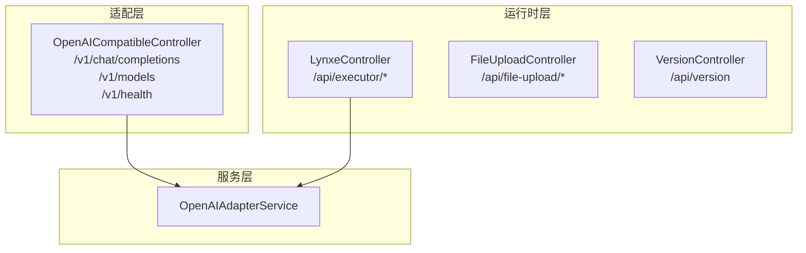
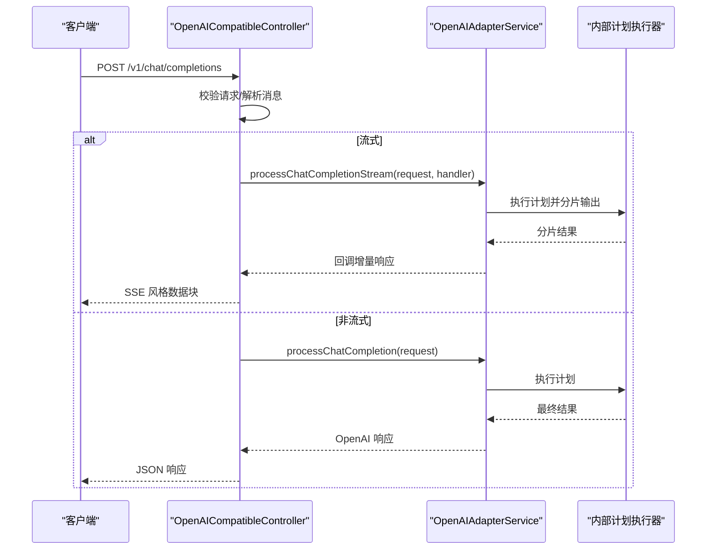
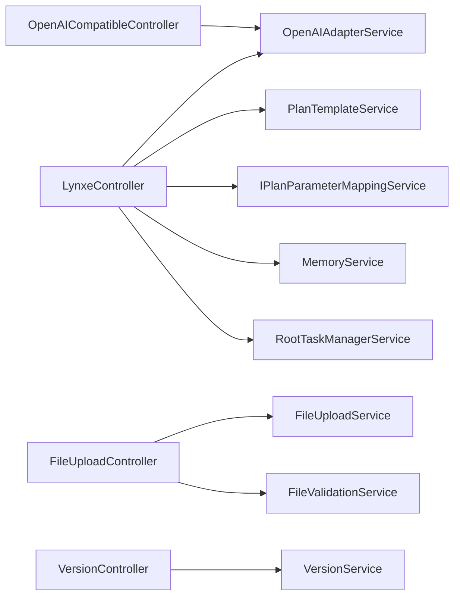

# API接口文档

<cite>
**本文档引用的文件**
- [OpenAICompatibleController.java](file://src/main/java/com/alibaba/cloud/ai/lynxe/adapter/controller/OpenAICompatibleController.java)
- [OpenAIRequest.java](file://src/main/java/com/alibaba/cloud/ai/lynxe/adapter/model/OpenAIRequest.java)
- [OpenAIResponse.java](file://src/main/java/com/alibaba/cloud/ai/lynxe/adapter/model/OpenAIResponse.java)
- [OpenAIAdapterService.java](file://src/main/java/com/alibaba/cloud/ai/lynxe/adapter/service/OpenAIAdapterService.java)
- [LynxeController.java](file://src/main/java/com/alibaba/cloud/ai/lynxe/runtime/controller/LynxeController.java)
- [FileUploadController.java](file://src/main/java/com/alibaba/cloud/ai/lynxe/runtime/controller/FileUploadController.java)
- [VersionController.java](file://src/main/java/com/alibaba/cloud/ai/lynxe/runtime/controller/VersionController.java)
</cite>

## 目录
1. [简介](#简介)
2. [项目结构](#项目结构)
3. [核心组件](#核心组件)
4. [架构总览](#架构总览)
5. [详细组件分析](#详细组件分析)
6. [依赖分析](#依赖分析)
7. [性能考量](#性能考量)
8. [故障排除指南](#故障排除指南)
9. [结论](#结论)
10. [附录](#附录)

## 简介
本文件为 Lynxe 的 API 接口文档，覆盖以下内容：
- RESTful API 设计原则与版本管理策略
- OpenAI 兼容接口（聊天补全、模型列表、健康检查）
- 工具调用接口（按工具名同步/异步执行）
- 文件上传与管理接口
- 版本信息查询接口
- 认证方式、请求/响应模式、错误处理策略
- 限流策略、安全考虑与性能优化建议
- 调试工具、监控指标与故障排除指南

## 项目结构
Lynxe 后端采用 Spring Boot 架构，API 主要分布在以下控制器中：
- 适配层：OpenAI 兼容接口
- 运行时层：工具执行、文件上传、版本信息等

图表来源
- [OpenAICompatibleController.java:50-357](file://src/main/java/com/alibaba/cloud/ai/lynxe/adapter/controller/OpenAICompatibleController.java#L50-L357)
- [OpenAIAdapterService.java:36-560](file://src/main/java/com/alibaba/cloud/ai/lynxe/adapter/service/OpenAIAdapterService.java#L36-L560)
- [LynxeController.java:96-800](file://src/main/java/com/alibaba/cloud/ai/lynxe/runtime/controller/LynxeController.java#L96-L800)
- [FileUploadController.java:38-301](file://src/main/java/com/alibaba/cloud/ai/lynxe/runtime/controller/FileUploadController.java#L38-L301)
- [VersionController.java:42-137](file://src/main/java/com/alibaba/cloud/ai/lynxe/runtime/controller/VersionController.java#L42-L137)

章节来源
- [OpenAICompatibleController.java:50-357](file://src/main/java/com/alibaba/cloud/ai/lynxe/adapter/controller/OpenAICompatibleController.java#L50-L357)
- [OpenAIAdapterService.java:36-560](file://src/main/java/com/alibaba/cloud/ai/lynxe/adapter/service/OpenAIAdapterService.java#L36-L560)
- [LynxeController.java:96-800](file://src/main/java/com/alibaba/cloud/ai/lynxe/runtime/controller/LynxeController.java#L96-L800)
- [FileUploadController.java:38-301](file://src/main/java/com/alibaba/cloud/ai/lynxe/runtime/controller/FileUploadController.java#L38-L301)
- [VersionController.java:42-137](file://src/main/java/com/alibaba/cloud/ai/lynxe/runtime/controller/VersionController.java#L42-L137)

## 核心组件
- OpenAI 兼容控制器：提供 OpenAI 兼容的聊天补全、模型列表与健康检查接口，支持流式与非流式响应。
- OpenAI 适配服务：负责将 OpenAI 请求转换为内部执行流程，并将结果格式化为 OpenAI 响应。
- 运行时控制器：提供按工具名执行计划的同步/异步接口，支持参数替换、文件上传键、会话记忆等。
- 文件上传控制器：提供文件上传、查询、删除与配置获取接口。
- 版本控制器：提供版本号与构建时间查询。

章节来源
- [OpenAICompatibleController.java:50-357](file://src/main/java/com/alibaba/cloud/ai/lynxe/adapter/controller/OpenAICompatibleController.java#L50-L357)
- [OpenAIAdapterService.java:36-560](file://src/main/java/com/alibaba/cloud/ai/lynxe/adapter/service/OpenAIAdapterService.java#L36-L560)
- [LynxeController.java:96-800](file://src/main/java/com/alibaba/cloud/ai/lynxe/runtime/controller/LynxeController.java#L96-L800)
- [FileUploadController.java:38-301](file://src/main/java/com/alibaba/cloud/ai/lynxe/runtime/controller/FileUploadController.java#L38-L301)
- [VersionController.java:42-137](file://src/main/java/com/alibaba/cloud/ai/lynxe/runtime/controller/VersionController.java#L42-L137)

## 架构总览
下图展示 OpenAI 兼容接口到内部执行链路：

图表来源
- [OpenAICompatibleController.java:85-261](file://src/main/java/com/alibaba/cloud/ai/lynxe/adapter/controller/OpenAICompatibleController.java#L85-L261)
- [OpenAIAdapterService.java:66-135](file://src/main/java/com/alibaba/cloud/ai/lynxe/adapter/service/OpenAIAdapterService.java#L66-L135)

## 详细组件分析

### OpenAI 兼容接口
- 基础路径：/
- 支持方法：POST（聊天补全）、GET（模型列表、健康检查）

端点定义
- POST /v1/chat/completions
  - 功能：聊天补全，支持流式与非流式
  - 请求体：OpenAIRequest
  - 响应：OpenAIResponse（非流式）或文本流（流式）
  - 流式超时：3 分钟；轮询间隔：100ms
- GET /v1/models
  - 功能：列出可用模型
  - 响应：模型对象列表
- GET /v1/health
  - 功能：健康检查
  - 响应：状态、服务名、时间戳、模型标识

请求/响应模型
- OpenAIRequest：包含 model、messages、temperature、top_p、max_tokens、stream、stream_options、functions、function_call、tools、tool_choice、user、seed、n、stop、frequency_penalty、presence_penalty、logit_bias、logprobs、top_logprobs 等字段
- OpenAIResponse：包含 id、object、created、model、system_fingerprint、choices（含 message/delta、finish_reason、logprobs）、usage（prompt_tokens、completion_tokens、total_tokens 及详细统计）

错误处理
- 非法请求：返回 400
- 内部错误：返回 500
- 流式错误：以 OpenAI chunk 形式返回错误并结束流

章节来源
- [OpenAICompatibleController.java:85-298](file://src/main/java/com/alibaba/cloud/ai/lynxe/adapter/controller/OpenAICompatibleController.java#L85-L298)
- [OpenAIRequest.java:26-490](file://src/main/java/com/alibaba/cloud/ai/lynxe/adapter/model/OpenAIRequest.java#L26-L490)
- [OpenAIResponse.java:25-630](file://src/main/java/com/alibaba/cloud/ai/lynxe/adapter/model/OpenAIResponse.java#L25-L630)

### 工具调用接口
- 基础路径：/api/executor
- 支持方法：GET/POST（同步）、POST（异步）、GET（详情）、DELETE（详情）、POST（提交用户输入）

端点定义
- GET /api/executor/executeByToolNameSync/{toolName}
  - 功能：按工具名同步执行
  - 查询参数：allParams（字符串映射）、serviceGroup（可选）
  - 返回：执行结果
- POST /api/executor/executeByToolNameSync
  - 功能：按工具名同步执行（请求体）
  - 请求体：toolName、serviceGroup、uploadedFiles、uploadKey、replacementParams、conversationId、requestSource
  - 返回：执行结果
- POST /api/executor/executeByToolNameAsync
  - 功能：按工具名异步执行
  - 请求体：同上
  - 返回：planId、status、message、conversationId、toolName、planTemplateId
- GET /api/executor/details/{planId}
  - 功能：获取执行详情（JSON 字符串）
  - 返回：PlanExecutionRecord 序列化结果
- DELETE /api/executor/details/{planId}
  - 功能：查询执行记录（不删除）
  - 返回：提示信息
- POST /api/executor/submit-input/{planId}
  - 功能：提交用户输入（用于等待表单输入的任务）
  - 请求体：表单数据（Map<String, String>）
  - 返回：提交结果

参数说明
- toolName：工具名称
- serviceGroup：服务组（可选）
- uploadedFiles：上传文件名列表（可选）
- uploadKey：上传键（可选）
- replacementParams：参数替换映射（<<>> 占位符替换）
- conversationId：会话 ID（可选）
- requestSource：请求来源枚举（HTTP_REQUEST/VUE_SIDEBAR/VUE_DIALOG，默认 HTTP_REQUEST）

章节来源
- [LynxeController.java:194-507](file://src/main/java/com/alibaba/cloud/ai/lynxe/runtime/controller/LynxeController.java#L194-L507)
- [LynxeController.java:519-693](file://src/main/java/com/alibaba/cloud/ai/lynxe/runtime/controller/LynxeController.java#L519-L693)

### 文件上传接口
- 基础路径：/api/file-upload
- 支持方法：POST（上传）、GET（查询）、DELETE（删除）、GET（配置）

端点定义
- POST /api/file-upload/upload
  - 功能：上传文件
  - 参数：files（多文件）
  - 返回：FileUploadResult（成功/失败、uploadKey、文件信息）
- GET /api/file-upload/files/{uploadKey}
  - 功能：根据 uploadKey 获取已上传文件列表
  - 返回：GetUploadedFilesResponse（success、uploadKey、files、totalCount）
- DELETE /api/file-upload/files/{uploadKey}/{fileName}
  - 功能：删除指定文件
  - 返回：DeleteFileResponse（success、message/error、uploadKey、fileName）
- GET /api/file-upload/config
  - 功能：获取上传配置（最大文件大小、最大文件数、允许类型）
  - 返回：Map（maxFileSize、maxFiles、allowedTypes、success）

章节来源
- [FileUploadController.java:56-182](file://src/main/java/com/alibaba/cloud/ai/lynxe/runtime/controller/FileUploadController.java#L56-L182)
- [FileUploadController.java:101-164](file://src/main/java/com/alibaba/cloud/ai/lynxe/runtime/controller/FileUploadController.java#L101-L164)
- [FileUploadController.java:170-182](file://src/main/java/com/alibaba/cloud/ai/lynxe/runtime/controller/FileUploadController.java#L170-L182)

### 版本信息接口
- 基础路径：/api/version
- 支持方法：GET
- 返回：version、buildTime、timestamp

章节来源
- [VersionController.java:65-82](file://src/main/java/com/alibaba/cloud/ai/lynxe/runtime/controller/VersionController.java#L65-L82)

## 依赖分析
- OpenAI 兼容控制器依赖 OpenAI 适配服务进行请求转换与响应格式化
- 运行时控制器依赖计划模板服务、参数映射服务、内存服务、任务中断管理等
- 文件上传控制器依赖文件上传与校验服务
- 版本控制器依赖版本服务与资源属性加载

图表来源
- [OpenAICompatibleController.java:77-80](file://src/main/java/com/alibaba/cloud/ai/lynxe/adapter/controller/OpenAICompatibleController.java#L77-L80)
- [OpenAIAdapterService.java:60-61](file://src/main/java/com/alibaba/cloud/ai/lynxe/adapter/service/OpenAIAdapterService.java#L60-L61)
- [LynxeController.java:108-156](file://src/main/java/com/alibaba/cloud/ai/lynxe/runtime/controller/LynxeController.java#L108-L156)
- [FileUploadController.java:46-49](file://src/main/java/com/alibaba/cloud/ai/lynxe/runtime/controller/FileUploadController.java#L46-L49)
- [VersionController.java:53-59](file://src/main/java/com/alibaba/cloud/ai/lynxe/runtime/controller/VersionController.java#L53-L59)

## 性能考量
- 流式响应
  - 超时：3 分钟
  - 轮询间隔：100ms
  - 建议：前端使用事件源（SSE）或流式读取，避免阻塞
- 消息长度限制
  - 用户消息超过一定长度会被截断，避免过长输入影响性能
- Token 估算
  - 使用字符长度估算 token 数量，便于成本控制与上限判断
- 并发与异步
  - 工具执行支持异步，返回 planId 以便后续查询执行详情
- 缓存
  - 异常缓存用于快速定位执行异常（10 分钟过期）

章节来源
- [OpenAICompatibleController.java:57-59](file://src/main/java/com/alibaba/cloud/ai/lynxe/adapter/controller/OpenAICompatibleController.java#L57-L59)
- [OpenAIAdapterService.java:155-158](file://src/main/java/com/alibaba/cloud/ai/lynxe/adapter/service/OpenAIAdapterService.java#L155-L158)
- [OpenAIAdapterService.java:462-466](file://src/main/java/com/alibaba/cloud/ai/lynxe/adapter/service/OpenAIAdapterService.java#L462-L466)
- [LynxeController.java:164-166](file://src/main/java/com/alibaba/cloud/ai/lynxe/runtime/controller/LynxeController.java#L164-L166)

## 故障排除指南
- 常见错误码
  - 400：请求参数非法（如空消息、空工具名）
  - 500：服务器内部错误（执行异常、序列化失败）
- 健康检查
  - GET /v1/health：确认服务可用性
- 执行详情
  - GET /api/executor/details/{planId}：获取完整执行树与最终结果
  - 若存在异常缓存，系统会抛出 PlanException 并清理缓存
- 文件上传问题
  - 校验失败：检查文件类型与大小是否在允许范围内
  - 删除失败：确认 uploadKey 与文件名正确
- 版本信息
  - GET /api/version：确认当前版本与构建时间

章节来源
- [OpenAICompatibleController.java:103-116](file://src/main/java/com/alibaba/cloud/ai/lynxe/adapter/controller/OpenAICompatibleController.java#L103-L116)
- [LynxeController.java:387-450](file://src/main/java/com/alibaba/cloud/ai/lynxe/runtime/controller/LynxeController.java#L387-L450)
- [LynxeController.java:392-398](file://src/main/java/com/alibaba/cloud/ai/lynxe/runtime/controller/LynxeController.java#L392-L398)
- [FileUploadController.java:66-93](file://src/main/java/com/alibaba/cloud/ai/lynxe/runtime/controller/FileUploadController.java#L66-L93)
- [FileUploadController.java:135-164](file://src/main/java/com/alibaba/cloud/ai/lynxe/runtime/controller/FileUploadController.java#L135-L164)
- [VersionController.java:65-82](file://src/main/java/com/alibaba/cloud/ai/lynxe/runtime/controller/VersionController.java#L65-82)

## 结论
Lynxe 提供了与 OpenAI 兼容的聊天补全接口，同时在后端提供了强大的工具执行能力与文件上传管理。通过统一的执行框架与参数替换机制，能够灵活地完成复杂任务编排。建议在生产环境中结合流式响应、异步执行与合理的超时设置，确保良好的用户体验与系统稳定性。

## 附录

### API 使用示例（概念性说明）
- OpenAI 兼容聊天补全（非流式）
  - 方法：POST /v1/chat/completions
  - 请求体：包含 messages、model、temperature、max_tokens 等
  - 响应：OpenAIResponse
- OpenAI 兼容聊天补全（流式）
  - 方法：POST /v1/chat/completions
  - 请求体：设置 stream=true
  - 响应：SSE 数据块，以 data: 开头，最后以 [DONE] 结束
- 工具调用（同步）
  - 方法：GET/POST /api/executor/executeByToolNameSync
  - 请求体：toolName、replacementParams、uploadedFiles、uploadKey、conversationId、requestSource
  - 响应：执行结果
- 工具调用（异步）
  - 方法：POST /api/executor/executeByToolNameAsync
  - 返回：planId、status、message、conversationId、toolName、planTemplateId
- 文件上传
  - 方法：POST /api/file-upload/upload
  - 返回：uploadKey 与文件列表
- 版本信息
  - 方法：GET /api/version
  - 返回：version、buildTime、timestamp

### SDK 集成指南（概念性说明）
- OpenAI 兼容 SDK
  - 使用标准 OpenAI 客户端库，将 base_url 指向 Lynxe 适配层根路径
  - 注意：流式响应需正确处理 SSE 数据块
- 工具调用 SDK
  - 封装 /api/executor 下的同步/异步端点
  - 支持参数替换与上传键传递
- 文件上传 SDK
  - 先上传文件获取 uploadKey，再在工具调用时传入

### 最佳实践
- 使用流式响应提升交互体验
- 对长消息进行预处理与长度限制
- 在异步执行场景中定期轮询 /api/executor/details/{planId} 获取进度
- 合理设置 temperature、top_p、max_tokens 控制生成质量与成本
- 使用 /api/version 与健康检查端点进行运维监控