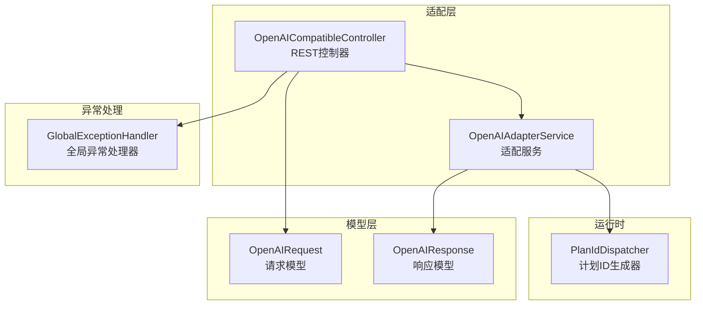
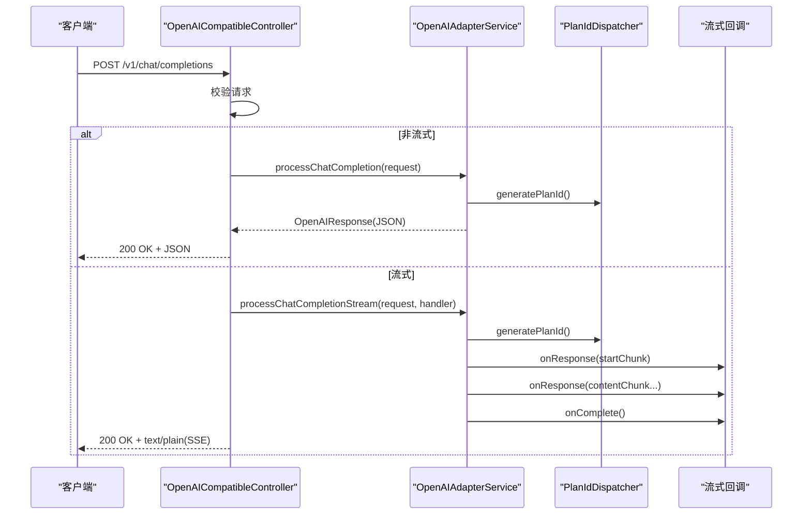
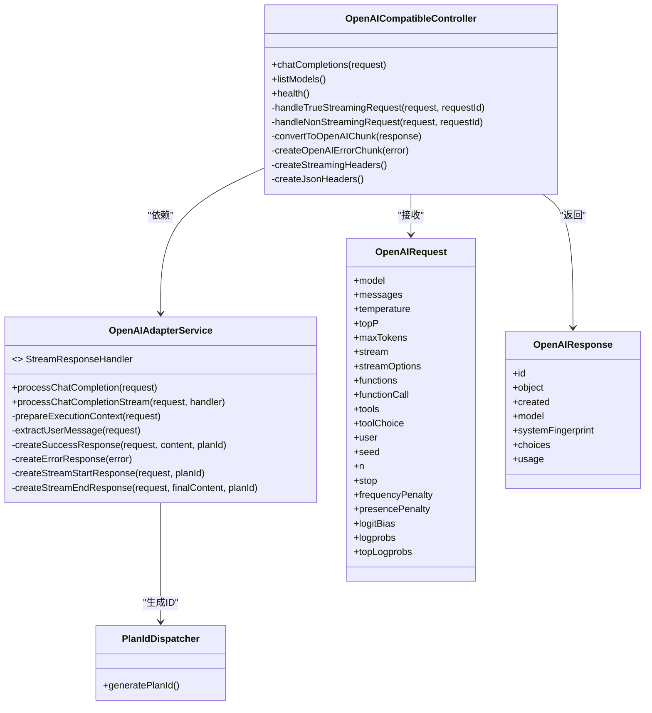

# OpenAI兼容接口

<cite>
**本文引用的文件**
- [OpenAICompatibleController.java](file://src/main/java/com/alibaba/cloud/ai/lynxe/adapter/controller/OpenAICompatibleController.java)
- [OpenAIRequest.java](file://src/main/java/com/alibaba/cloud/ai/lynxe/adapter/model/OpenAIRequest.java)
- [OpenAIResponse.java](file://src/main/java/com/alibaba/cloud/ai/lynxe/adapter/model/OpenAIResponse.java)
- [OpenAIAdapterService.java](file://src/main/java/com/alibaba/cloud/ai/lynxe/adapter/service/OpenAIAdapterService.java)
- [PlanIdDispatcher.java](file://src/main/java/com/alibaba/cloud/ai/lynxe/runtime/service/PlanIdDispatcher.java)
- [GlobalExceptionHandler.java](file://src/main/java/com/alibaba/cloud/ai/lynxe/exception/handler/GlobalExceptionHandler.java)
- [application.yml](file://src/main/resources/application.yml)
</cite>

## 目录
1. [简介](#简介)
2. [项目结构](#项目结构)
3. [核心组件](#核心组件)
4. [架构总览](#架构总览)
5. [详细组件分析](#详细组件分析)
6. [依赖关系分析](#依赖关系分析)
7. [性能与超时](#性能与超时)
8. [故障排查指南](#故障排查指南)
9. [结论](#结论)
10. [附录](#附录)

## 简介
本文件为Lynxe的OpenAI兼容接口提供详尽的API文档，重点覆盖以下内容：
- /v1/chat/completions端点的聊天补全功能，支持非流式与流式两种响应模式
- OpenAIRequest与OpenAIResponse的数据结构说明，包括消息格式、角色定义、内容类型等
- 流式响应的SSE格式规范、chunk数据结构与[DONE]标记
- 健康检查端点/v1/health与模型列表端点/v1/models的使用方法
- 错误处理机制、超时设置与性能优化建议
- 完整的请求与响应示例路径（以源码路径代替具体示例）

## 项目结构
OpenAI兼容接口位于adapter模块中，采用Spring MVC控制器对外暴露REST端点，并通过适配服务将OpenAI格式转换为内部执行流程，再将结果回写为OpenAI格式。

图表来源
- [OpenAICompatibleController.java:50-357](file://src/main/java/com/alibaba/cloud/ai/lynxe/adapter/controller/OpenAICompatibleController.java#L50-L357)
- [OpenAIAdapterService.java:36-560](file://src/main/java/com/alibaba/cloud/ai/lynxe/adapter/service/OpenAIAdapterService.java#L36-L560)
- [OpenAIRequest.java:26-490](file://src/main/java/com/alibaba/cloud/ai/lynxe/adapter/model/OpenAIRequest.java#L26-L490)
- [OpenAIResponse.java:25-630](file://src/main/java/com/alibaba/cloud/ai/lynxe/adapter/model/OpenAIResponse.java#L25-L630)
- [PlanIdDispatcher.java:28-292](file://src/main/java/com/alibaba/cloud/ai/lynxe/runtime/service/PlanIdDispatcher.java#L28-L292)
- [GlobalExceptionHandler.java:32-69](file://src/main/java/com/alibaba/cloud/ai/lynxe/exception/handler/GlobalExceptionHandler.java#L32-L69)

章节来源
- [OpenAICompatibleController.java:50-357](file://src/main/java/com/alibaba/cloud/ai/lynxe/adapter/controller/OpenAICompatibleController.java#L50-L357)
- [OpenAIAdapterService.java:36-560](file://src/main/java/com/alibaba/cloud/ai/lynxe/adapter/service/OpenAIAdapterService.java#L36-L560)

## 核心组件
- OpenAICompatibleController：负责接收HTTP请求，校验参数，分发到非流式或流式处理逻辑，并构造SSE或JSON响应。
- OpenAIAdapterService：负责将OpenAI请求转换为内部执行上下文，调度执行并返回OpenAI格式的响应；同时提供流式回调接口。
- OpenAIRequest/OpenAIResponse：遵循OpenAI API规范的数据模型，用于序列化/反序列化请求与响应。
- PlanIdDispatcher：生成唯一计划ID，用于追踪任务执行。
- GlobalExceptionHandler：统一捕获异常并返回标准错误响应。

章节来源
- [OpenAICompatibleController.java:73-80](file://src/main/java/com/alibaba/cloud/ai/lynxe/adapter/controller/OpenAICompatibleController.java#L73-L80)
- [OpenAIAdapterService.java:66-97](file://src/main/java/com/alibaba/cloud/ai/lynxe/adapter/service/OpenAIAdapterService.java#L66-L97)
- [OpenAIRequest.java:26-242](file://src/main/java/com/alibaba/cloud/ai/lynxe/adapter/model/OpenAIRequest.java#L26-L242)
- [OpenAIResponse.java:25-101](file://src/main/java/com/alibaba/cloud/ai/lynxe/adapter/model/OpenAIResponse.java#L25-L101)
- [PlanIdDispatcher.java:125-129](file://src/main/java/com/alibaba/cloud/ai/lynxe/runtime/service/PlanIdDispatcher.java#L125-L129)
- [GlobalExceptionHandler.java:38-66](file://src/main/java/com/alibaba/cloud/ai/lynxe/exception/handler/GlobalExceptionHandler.java#L38-L66)

## 架构总览
下图展示从客户端到服务端的调用链路与数据流转。

图表来源
- [OpenAICompatibleController.java:85-116](file://src/main/java/com/alibaba/cloud/ai/lynxe/adapter/controller/OpenAICompatibleController.java#L85-L116)
- [OpenAICompatibleController.java:121-185](file://src/main/java/com/alibaba/cloud/ai/lynxe/adapter/controller/OpenAICompatibleController.java#L121-L185)
- [OpenAICompatibleController.java:246-261](file://src/main/java/com/alibaba/cloud/ai/lynxe/adapter/controller/OpenAICompatibleController.java#L246-L261)
- [OpenAIAdapterService.java:102-135](file://src/main/java/com/alibaba/cloud/ai/lynxe/adapter/service/OpenAIAdapterService.java#L102-L135)
- [PlanIdDispatcher.java:125-129](file://src/main/java/com/alibaba/cloud/ai/lynxe/runtime/service/PlanIdDispatcher.java#L125-L129)

## 详细组件分析

### /v1/chat/completions 端点
- 方法与路径：POST /v1/chat/completions
- 功能：根据请求中的messages与stream字段选择非流式或流式响应。
- 请求体：OpenAIRequest
- 响应：
  - 非流式：application/json
  - 流式：text/plain，SSE格式，逐条发送data: {...}\n\n，最后发送data: [DONE]\n\n

关键实现要点
- 请求校验：确保messages非空且每条消息的role与content有效。
- 流式超时：默认3分钟，轮询间隔100ms。
- SSE格式：每条chunk前缀"data: "，末尾"\n\n"；结束标记为"data: [DONE]\n\n"。
- 错误处理：异常时返回500，流式错误以OpenAI chunk格式返回后[DONE]。

章节来源
- [OpenAICompatibleController.java:85-116](file://src/main/java/com/alibaba/cloud/ai/lynxe/adapter/controller/OpenAICompatibleController.java#L85-L116)
- [OpenAICompatibleController.java:121-185](file://src/main/java/com/alibaba/cloud/ai/lynxe/adapter/controller/OpenAICompatibleController.java#L121-L185)
- [OpenAICompatibleController.java:246-261](file://src/main/java/com/alibaba/cloud/ai/lynxe/adapter/controller/OpenAICompatibleController.java#L246-L261)
- [OpenAICompatibleController.java:302-309](file://src/main/java/com/alibaba/cloud/ai/lynxe/adapter/controller/OpenAICompatibleController.java#L302-L309)

### 流式响应SSE规范
- 内容类型：text/plain; charset=utf-8
- 头部：Cache-Control: no-cache, Connection: keep-alive
- 数据块格式：每条数据以"data: "开头，后跟JSON对象，再以"\n\n"结尾
- 结束标记：data: [DONE]\n\n
- 错误块：当发生异常时，先发送一条错误chunk，再发送[DONE]

章节来源
- [OpenAICompatibleController.java:328-343](file://src/main/java/com/alibaba/cloud/ai/lynxe/adapter/controller/OpenAICompatibleController.java#L328-L343)
- [OpenAICompatibleController.java:71-71](file://src/main/java/com/alibaba/cloud/ai/lynxe/adapter/controller/OpenAICompatibleController.java#L71-L71)
- [OpenAICompatibleController.java:232-244](file://src/main/java/com/alibaba/cloud/ai/lynxe/adapter/controller/OpenAICompatibleController.java#L232-L244)

### OpenAIRequest 数据结构
- 字段概览
  - model：模型标识
  - messages：消息数组，每条消息含role与content
  - temperature/top_p/max_tokens/stream/stream_options：采样与生成控制
  - functions/function_call/tools/tool_choice：函数/工具调用相关
  - user/seed/n/stop/frequency_penalty/presence_penalty/logit_bias/logprobs/top_logprobs：其他OpenAI标准参数
- Message结构
  - role：消息角色（如user/assistant/system等）
  - content：可为字符串或富文本数组（含type与text）
  - name/function_call/tool_calls：可选扩展字段
- 工具调用相关
  - Tool：type与function
  - Function：name/description/parameters
  - ToolCall：id/type/function

章节来源
- [OpenAIRequest.java:26-242](file://src/main/java/com/alibaba/cloud/ai/lynxe/adapter/model/OpenAIRequest.java#L26-L242)
- [OpenAIRequest.java:244-351](file://src/main/java/com/alibaba/cloud/ai/lynxe/adapter/model/OpenAIRequest.java#L244-L351)
- [OpenAIRequest.java:353-490](file://src/main/java/com/alibaba/cloud/ai/lynxe/adapter/model/OpenAIRequest.java#L353-L490)

### OpenAIResponse 数据结构
- 字段概览
  - id/object/created/model/system_fingerprint：通用元信息
  - choices：候选输出数组
  - usage：token用量统计
- Choice结构
  - index：索引
  - message/delta：最终消息或流式增量
  - finish_reason：结束原因
  - logprobs：可选日志概率
- Message/Delta结构
  - role/content/function_call/tool_calls：与请求对应
- Usage结构
  - prompt_tokens/completion_tokens/total_tokens
  - prompt_tokens_details/completion_tokens_details：细粒度用量

章节来源
- [OpenAIResponse.java:25-101](file://src/main/java/com/alibaba/cloud/ai/lynxe/adapter/model/OpenAIResponse.java#L25-L101)
- [OpenAIResponse.java:104-162](file://src/main/java/com/alibaba/cloud/ai/lynxe/adapter/model/OpenAIResponse.java#L104-L162)
- [OpenAIResponse.java:164-274](file://src/main/java/com/alibaba/cloud/ai/lynxe/adapter/model/OpenAIResponse.java#L164-L274)
- [OpenAIResponse.java:276-422](file://src/main/java/com/alibaba/cloud/ai/lynxe/adapter/model/OpenAIResponse.java#L276-L422)
- [OpenAIResponse.java:424-490](file://src/main/java/com/alibaba/cloud/ai/lynxe/adapter/model/OpenAIResponse.java#L424-L490)
- [OpenAIResponse.java:521-627](file://src/main/java/com/alibaba/cloud/ai/lynxe/adapter/model/OpenAIResponse.java#L521-L627)

### /v1/health 健康检查端点
- 方法与路径：GET /v1/health
- 响应：包含状态、服务名、时间戳与模型标识的标准JSON对象
- 示例响应路径：[健康检查响应示例:294-298](file://src/main/java/com/alibaba/cloud/ai/lynxe/adapter/controller/OpenAICompatibleController.java#L294-L298)

章节来源
- [OpenAICompatibleController.java:294-298](file://src/main/java/com/alibaba/cloud/ai/lynxe/adapter/controller/OpenAICompatibleController.java#L294-L298)

### /v1/models 模型列表端点
- 方法与路径：GET /v1/models
- 响应：OpenAI风格的模型列表对象，包含单个模型信息（id/object/created/owned_by/root/parent）
- 示例响应路径：[模型列表响应示例:311-323](file://src/main/java/com/alibaba/cloud/ai/lynxe/adapter/controller/OpenAICompatibleController.java#L311-L323)

章节来源
- [OpenAICompatibleController.java:276-288](file://src/main/java/com/alibaba/cloud/ai/lynxe/adapter/controller/OpenAICompatibleController.java#L276-L288)
- [OpenAICompatibleController.java:311-323](file://src/main/java/com/alibaba/cloud/ai/lynxe/adapter/controller/OpenAICompatibleController.java#L311-L323)

### 错误处理机制
- 控制器层：非法请求返回400；异常返回500
- 适配服务层：内部异常转为OpenAI格式错误响应
- 全局异常处理器：统一捕获并返回包含error字段的JSON
- 流式错误：以OpenAI chunk格式发送错误，随后发送[DONE]

章节来源
- [OpenAICompatibleController.java:103-115](file://src/main/java/com/alibaba/cloud/ai/lynxe/adapter/controller/OpenAICompatibleController.java#L103-L115)
- [OpenAICompatibleController.java:160-166](file://src/main/java/com/alibaba/cloud/ai/lynxe/adapter/controller/OpenAICompatibleController.java#L160-L166)
- [OpenAIAdapterService.java:367-376](file://src/main/java/com/alibaba/cloud/ai/lynxe/adapter/service/OpenAIAdapterService.java#L367-L376)
- [GlobalExceptionHandler.java:38-66](file://src/main/java/com/alibaba/cloud/ai/lynxe/exception/handler/GlobalExceptionHandler.java#L38-L66)

### 类关系图（代码级）

图表来源
- [OpenAICompatibleController.java:73-80](file://src/main/java/com/alibaba/cloud/ai/lynxe/adapter/controller/OpenAICompatibleController.java#L73-L80)
- [OpenAIAdapterService.java:66-97](file://src/main/java/com/alibaba/cloud/ai/lynxe/adapter/service/OpenAIAdapterService.java#L66-L97)
- [OpenAIRequest.java:26-242](file://src/main/java/com/alibaba/cloud/ai/lynxe/adapter/model/OpenAIRequest.java#L26-L242)
- [OpenAIResponse.java:25-101](file://src/main/java/com/alibaba/cloud/ai/lynxe/adapter/model/OpenAIResponse.java#L25-L101)
- [PlanIdDispatcher.java:125-129](file://src/main/java/com/alibaba/cloud/ai/lynxe/runtime/service/PlanIdDispatcher.java#L125-L129)

## 依赖关系分析
- 控制器依赖适配服务进行业务处理
- 适配服务依赖计划ID生成器以保证任务唯一性
- 控制器与全局异常处理器共同保障错误响应一致性
- 应用配置文件提供服务器端口、文件上传限制与计划轮询参数

```mermaid
graph LR
Controller["OpenAICompatibleController"] --> Service["OpenAIAdapterService"]
Service --> PID["PlanIdDispatcher"]
Controller --> Ex["GlobalExceptionHandler"]
Controller --> Conf["application.yml"]
```

图表来源
- [OpenAICompatibleController.java:73-80](file://src/main/java/com/alibaba/cloud/ai/lynxe/adapter/controller/OpenAICompatibleController.java#L73-L80)
- [OpenAIAdapterService.java:60-61](file://src/main/java/com/alibaba/cloud/ai/lynxe/adapter/service/OpenAIAdapterService.java#L60-L61)
- [GlobalExceptionHandler.java:32-33](file://src/main/java/com/alibaba/cloud/ai/lynxe/exception/handler/GlobalExceptionHandler.java#L32-L33)
- [application.yml:1-97](file://src/main/resources/application.yml#L1-L97)

章节来源
- [application.yml:1-97](file://src/main/resources/application.yml#L1-L97)

## 性能与超时
- 流式超时：默认3分钟（可通过常量STREAMING_TIMEOUT_MS调整）
- 轮询间隔：100ms（POLLING_INTERVAL_MS），用于阻塞等待流式完成
- 计划轮询配置：在application.yml中提供计划执行轮询的启用、尝试次数、间隔与超时参数
- 文件上传限制：multipart配置限制了单文件与总请求大小，避免资源滥用
- 日志级别：INFO及以上，便于生产环境监控

章节来源
- [OpenAICompatibleController.java:57-59](file://src/main/java/com/alibaba/cloud/ai/lynxe/adapter/controller/OpenAICompatibleController.java#L57-L59)
- [application.yml:60-77](file://src/main/resources/application.yml#L60-L77)
- [application.yml:14-19](file://src/main/resources/application.yml#L14-L19)

## 故障排查指南
- 常见问题
  - 请求无效：检查messages是否为空、每条消息的role与content是否有效
  - 流式响应未结束：确认客户端正确处理SSE，等待[DONE]标记
  - 异常响应：查看全局异常处理器返回的error字段
- 排查步骤
  - 查看控制器日志：请求ID、消息预览与响应统计
  - 检查适配服务：计划ID生成与执行上下文准备
  - 核对配置：端口、文件上传限制、计划轮询参数
- 参考路径
  - 控制器日志与错误处理：[控制器实现:89-115](file://src/main/java/com/alibaba/cloud/ai/lynxe/adapter/controller/OpenAICompatibleController.java#L89-L115)
  - 全局异常处理：[异常处理器:38-66](file://src/main/java/com/alibaba/cloud/ai/lynxe/exception/handler/GlobalExceptionHandler.java#L38-L66)
  - 计划轮询配置：[应用配置:60-77](file://src/main/resources/application.yml#L60-L77)

章节来源
- [OpenAICompatibleController.java:89-115](file://src/main/java/com/alibaba/cloud/ai/lynxe/adapter/controller/OpenAICompatibleController.java#L89-L115)
- [GlobalExceptionHandler.java:38-66](file://src/main/java/com/alibaba/cloud/ai/lynxe/exception/handler/GlobalExceptionHandler.java#L38-L66)
- [application.yml:60-77](file://src/main/resources/application.yml#L60-L77)

## 结论
Lynxe的OpenAI兼容接口提供了与OpenAI生态高度一致的聊天补全能力，支持非流式与流式两种响应模式，并通过SSE规范实现稳定的流式传输。其数据模型严格遵循OpenAI规范，便于与现有工具链集成。通过合理的超时与轮询配置，可在保证稳定性的同时提升用户体验。

## 附录

### 请求与响应示例路径
- 非流式请求示例：[请求模型定义:26-242](file://src/main/java/com/alibaba/cloud/ai/lynxe/adapter/model/OpenAIRequest.java#L26-L242)
- 非流式响应示例：[响应模型定义:25-101](file://src/main/java/com/alibaba/cloud/ai/lynxe/adapter/model/OpenAIResponse.java#L25-L101)
- 流式请求示例：[控制器流式处理:121-185](file://src/main/java/com/alibaba/cloud/ai/lynxe/adapter/controller/OpenAICompatibleController.java#L121-L185)
- 流式响应示例：[SSE格式与[DONE]标记](file://src/main/java/com/alibaba/cloud/ai/lynxe/adapter/controller/OpenAICompatibleController.java#L71-L71)
- 健康检查示例：[健康端点:294-298](file://src/main/java/com/alibaba/cloud/ai/lynxe/adapter/controller/OpenAICompatibleController.java#L294-L298)
- 模型列表示例：[模型端点:276-288](file://src/main/java/com/alibaba/cloud/ai/lynxe/adapter/controller/OpenAICompatibleController.java#L276-L288)