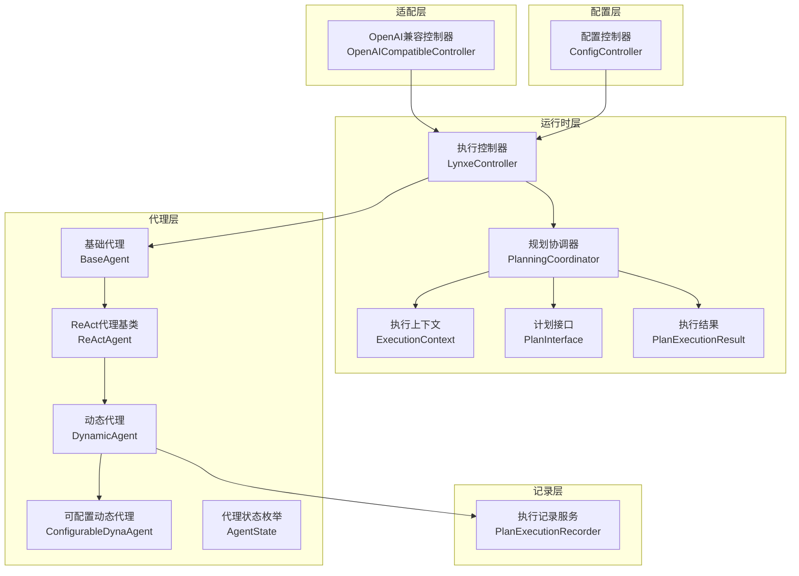
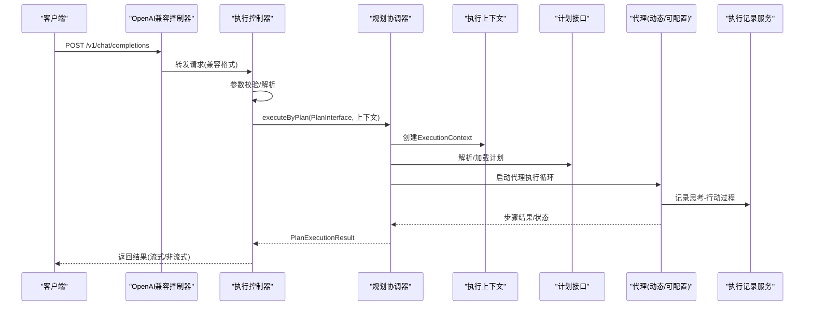
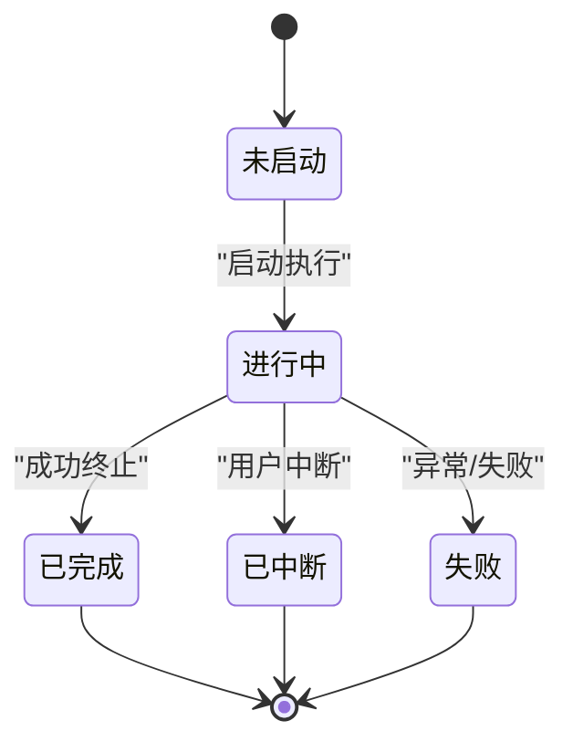
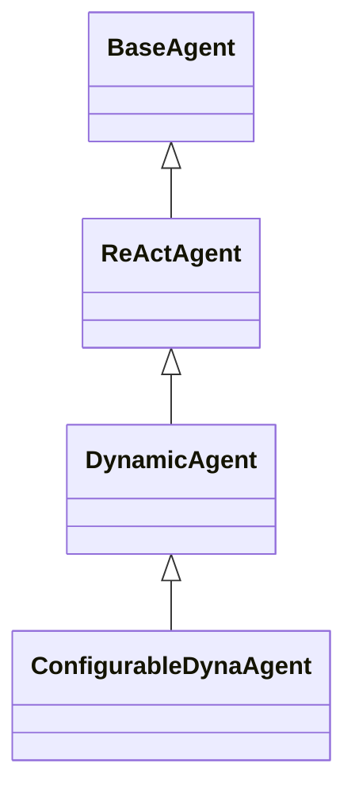
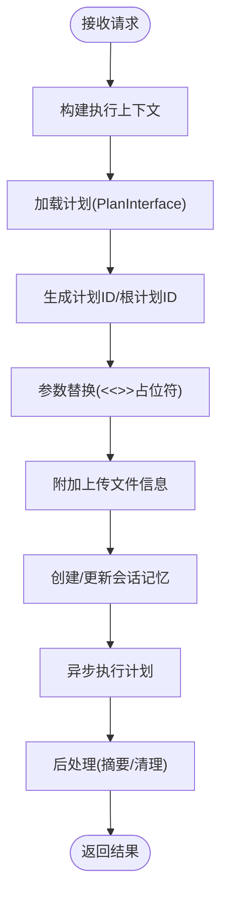
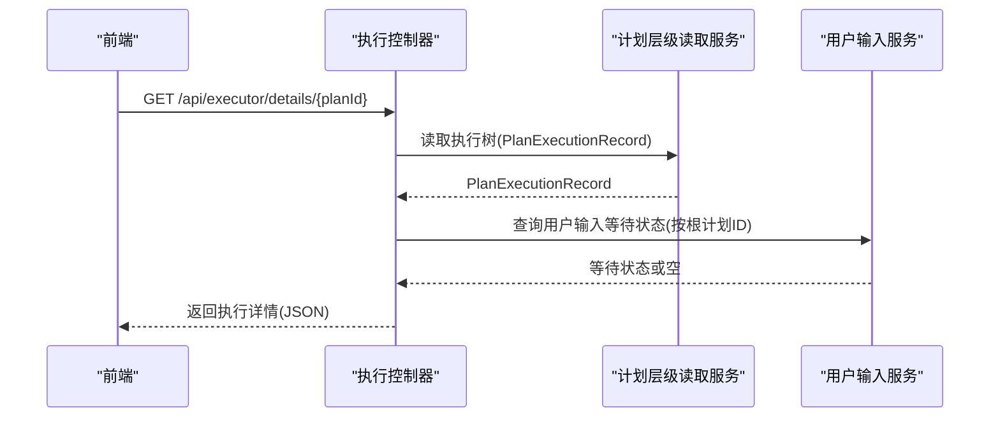
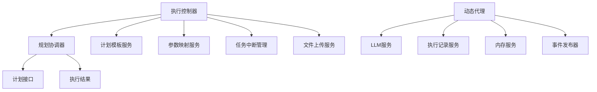

# 代理管理接口

<cite>
**本文档引用的文件**
- [DynamicAgent.java](file://src/main/java/com/alibaba/cloud/ai/lynxe/agent/DynamicAgent.java)
- [ReActAgent.java](file://src/main/java/com/alibaba/cloud/ai/lynxe/agent/ReActAgent.java)
- [BaseAgent.java](file://src/main/java/com/alibaba/cloud/ai/lynxe/agent/BaseAgent.java)
- [ConfigurableDynaAgent.java](file://src/main/java/com/alibaba/cloud/ai/lynxe/agent/ConfigurableDynaAgent.java)
- [AgentState.java](file://src/main/java/com/alibaba/cloud/ai/lynxe/agent/AgentState.java)
- [PlanningCoordinator.java](file://src/main/java/com/alibaba/cloud/ai/lynxe/runtime/service/PlanningCoordinator.java)
- [LynxeController.java](file://src/main/java/com/alibaba/cloud/ai/lynxe/runtime/controller/LynxeController.java)
- [PlanInterface.java](file://src/main/java/com/alibaba/cloud/ai/lynxe/runtime/entity/vo/PlanInterface.java)
- [ExecutionContext.java](file://src/main/java/com/alibaba/cloud/ai/lynxe/runtime/entity/vo/ExecutionContext.java)
- [PlanExecutionResult.java](file://src/main/java/com/alibaba/cloud/ai/lynxe/runtime/entity/vo/PlanExecutionResult.java)
- [PlanExecutionRecorder.java](file://src/main/java/com/alibaba/cloud/ai/lynxe/recorder/service/PlanExecutionRecorder.java)
- [OpenAICompatibleController.java](file://src/main/java/com/alibaba/cloud/ai/lynxe/adapter/controller/OpenAICompatibleController.java)
- [OpenAIRequest.java](file://src/main/java/com/alibaba/cloud/ai/lynxe/adapter/model/OpenAIRequest.java)
- [OpenAIResponse.java](file://src/main/java/com/alibaba/cloud/ai/lynxe/adapter/model/OpenAIResponse.java)
- [ConfigController.java](file://src/main/java/com/alibaba/cloud/ai/lynxe/config/ConfigController.java)
</cite>

## 目录
1. [简介](#简介)
2. [项目结构](#项目结构)
3. [核心组件](#核心组件)
4. [架构总览](#架构总览)
5. [详细组件分析](#详细组件分析)
6. [依赖关系分析](#依赖关系分析)
7. [性能考虑](#性能考虑)
8. [故障排除指南](#故障排除指南)
9. [结论](#结论)
10. [附录](#附录)

## 简介
本文件面向Lynxe代理管理接口，系统性梳理代理的全生命周期管理能力，包括代理创建、配置、启动与停止、状态查询、执行上下文管理、任务调度、动态代理与ReAct代理的差异化调用方式与参数配置、实时监控（执行进度、状态变更、错误信息）、代理间通信与协作模式、配置导入导出与版本管理、备份恢复，以及性能监控与资源统计、故障诊断接口。文档以代码为依据，提供分层讲解与可视化图示，兼顾技术与非技术读者的理解。

## 项目结构
Lynxe采用分层架构：适配层负责对外兼容接口（如OpenAI兼容接口），运行时层负责计划编排与执行，代理层负责具体智能体行为，记录层负责执行过程与结果的持久化与查询，配置层负责系统与模型配置。

**图表来源**
- [OpenAICompatibleController.java:1-357](file://src/main/java/com/alibaba/cloud/ai/lynxe/adapter/controller/OpenAICompatibleController.java#L1-L357)
- [LynxeController.java:1-800](file://src/main/java/com/alibaba/cloud/ai/lynxe/runtime/controller/LynxeController.java#L1-L800)
- [PlanningCoordinator.java:1-182](file://src/main/java/com/alibaba/cloud/ai/lynxe/runtime/service/PlanningCoordinator.java#L1-L182)
- [ExecutionContext.java:1-252](file://src/main/java/com/alibaba/cloud/ai/lynxe/runtime/entity/vo/ExecutionContext.java#L1-L252)
- [PlanInterface.java:1-184](file://src/main/java/com/alibaba/cloud/ai/lynxe/runtime/entity/vo/PlanInterface.java#L1-L184)
- [PlanExecutionResult.java:1-72](file://src/main/java/com/alibaba/cloud/ai/lynxe/runtime/entity/vo/PlanExecutionResult.java#L1-L72)
- [BaseAgent.java:1-589](file://src/main/java/com/alibaba/cloud/ai/lynxe/agent/BaseAgent.java#L1-L589)
- [ReActAgent.java:1-97](file://src/main/java/com/alibaba/cloud/ai/lynxe/agent/ReActAgent.java#L1-L97)
- [DynamicAgent.java:1-800](file://src/main/java/com/alibaba/cloud/ai/lynxe/agent/DynamicAgent.java#L1-L800)
- [ConfigurableDynaAgent.java:1-340](file://src/main/java/com/alibaba/cloud/ai/lynxe/agent/ConfigurableDynaAgent.java#L1-L340)
- [AgentState.java:1-35](file://src/main/java/com/alibaba/cloud/ai/lynxe/agent/AgentState.java#L1-L35)
- [PlanExecutionRecorder.java:1-242](file://src/main/java/com/alibaba/cloud/ai/lynxe/recorder/service/PlanExecutionRecorder.java#L1-L242)
- [ConfigController.java:1-82](file://src/main/java/com/alibaba/cloud/ai/lynxe/config/ConfigController.java#L1-L82)

**章节来源**
- [OpenAICompatibleController.java:1-357](file://src/main/java/com/alibaba/cloud/ai/lynxe/adapter/controller/OpenAICompatibleController.java#L1-L357)
- [LynxeController.java:1-800](file://src/main/java/com/alibaba/cloud/ai/lynxe/runtime/controller/LynxeController.java#L1-L800)
- [PlanningCoordinator.java:1-182](file://src/main/java/com/alibaba/cloud/ai/lynxe/runtime/service/PlanningCoordinator.java#L1-L182)
- [ExecutionContext.java:1-252](file://src/main/java/com/alibaba/cloud/ai/lynxe/runtime/entity/vo/ExecutionContext.java#L1-L252)
- [PlanInterface.java:1-184](file://src/main/java/com/alibaba/cloud/ai/lynxe/runtime/entity/vo/PlanInterface.java#L1-L184)
- [PlanExecutionResult.java:1-72](file://src/main/java/com/alibaba/cloud/ai/lynxe/runtime/entity/vo/PlanExecutionResult.java#L1-L72)
- [BaseAgent.java:1-589](file://src/main/java/com/alibaba/cloud/ai/lynxe/agent/BaseAgent.java#L1-L589)
- [ReActAgent.java:1-97](file://src/main/java/com/alibaba/cloud/ai/lynxe/agent/ReActAgent.java#L1-L97)
- [DynamicAgent.java:1-800](file://src/main/java/com/alibaba/cloud/ai/lynxe/agent/DynamicAgent.java#L1-L800)
- [ConfigurableDynaAgent.java:1-340](file://src/main/java/com/alibaba/cloud/ai/lynxe/agent/ConfigurableDynaAgent.java#L1-L340)
- [AgentState.java:1-35](file://src/main/java/com/alibaba/cloud/ai/lynxe/agent/AgentState.java#L1-L35)
- [PlanExecutionRecorder.java:1-242](file://src/main/java/com/alibaba/cloud/ai/lynxe/recorder/service/PlanExecutionRecorder.java#L1-L242)
- [ConfigController.java:1-82](file://src/main/java/com/alibaba/cloud/ai/lynxe/config/ConfigController.java#L1-L82)

## 核心组件
- 代理抽象与实现
  - 基础代理：统一状态管理、步数限制、思考提示构建、异常处理与收尾逻辑。
  - ReAct代理：定义思考与行动的交替执行流程。
  - 动态代理：基于工具回调与流式响应的推理-行动循环，支持重试、早期终止检测、并行工具执行。
  - 可配置动态代理：在动态代理基础上，允许运行时指定可用工具集，自动补齐终止工具。
- 执行编排
  - 规划协调器：根据计划类型选择执行器，创建执行上下文，驱动异步执行并后处理。
  - 执行控制器：对外提供同步/异步执行入口，参数替换、文件上传、会话记忆集成、用户输入等待与提交。
- 记录与查询
  - 执行记录服务：记录计划开始/结束、步骤开始/结束、代理完整执行、思考-行动过程与动作结果。
  - 计划执行结果：封装最终结果、错误信息与各步骤结果。
- 适配与配置
  - OpenAI兼容控制器：提供/v1/chat/completions与/v1/models等标准端点，支持流式与非流式响应。
  - 配置控制器：批量更新配置、重置默认值、查询可用模型列表。

**章节来源**
- [BaseAgent.java:1-589](file://src/main/java/com/alibaba/cloud/ai/lynxe/agent/BaseAgent.java#L1-L589)
- [ReActAgent.java:1-97](file://src/main/java/com/alibaba/cloud/ai/lynxe/agent/ReActAgent.java#L1-L97)
- [DynamicAgent.java:1-800](file://src/main/java/com/alibaba/cloud/ai/lynxe/agent/DynamicAgent.java#L1-L800)
- [ConfigurableDynaAgent.java:1-340](file://src/main/java/com/alibaba/cloud/ai/lynxe/agent/ConfigurableDynaAgent.java#L1-L340)
- [PlanningCoordinator.java:1-182](file://src/main/java/com/alibaba/cloud/ai/lynxe/runtime/service/PlanningCoordinator.java#L1-L182)
- [LynxeController.java:1-800](file://src/main/java/com/alibaba/cloud/ai/lynxe/runtime/controller/LynxeController.java#L1-L800)
- [PlanExecutionRecorder.java:1-242](file://src/main/java/com/alibaba/cloud/ai/lynxe/recorder/service/PlanExecutionRecorder.java#L1-L242)
- [PlanExecutionResult.java:1-72](file://src/main/java/com/alibaba/cloud/ai/lynxe/runtime/entity/vo/PlanExecutionResult.java#L1-L72)
- [OpenAICompatibleController.java:1-357](file://src/main/java/com/alibaba/cloud/ai/lynxe/adapter/controller/OpenAICompatibleController.java#L1-L357)
- [ConfigController.java:1-82](file://src/main/java/com/alibaba/cloud/ai/lynxe/config/ConfigController.java#L1-L82)

## 架构总览
下图展示从外部请求到代理执行、记录与结果返回的完整链路，涵盖同步/异步两种模式、参数替换、文件上传、会话记忆与用户输入等待。

**图表来源**
- [OpenAICompatibleController.java:82-116](file://src/main/java/com/alibaba/cloud/ai/lynxe/adapter/controller/OpenAICompatibleController.java#L82-L116)
- [LynxeController.java:579-693](file://src/main/java/com/alibaba/cloud/ai/lynxe/runtime/controller/LynxeController.java#L579-L693)
- [PlanningCoordinator.java:76-179](file://src/main/java/com/alibaba/cloud/ai/lynxe/runtime/service/PlanningCoordinator.java#L76-L179)
- [ExecutionContext.java:34-252](file://src/main/java/com/alibaba/cloud/ai/lynxe/runtime/entity/vo/ExecutionContext.java#L34-L252)
- [PlanInterface.java:27-33](file://src/main/java/com/alibaba/cloud/ai/lynxe/runtime/entity/vo/PlanInterface.java#L27-L33)
- [PlanExecutionRecorder.java:26-108](file://src/main/java/com/alibaba/cloud/ai/lynxe/recorder/service/PlanExecutionRecorder.java#L26-L108)

## 详细组件分析

### 代理生命周期与状态管理
- 生命周期阶段
  - 初始化：设置计划ID、根计划ID、会话ID、深度、最大步数等。
  - 思考阶段：构建系统提示与当前环境消息，调用大模型推理，支持重试与早期终止检测。
  - 行动阶段：执行工具调用，支持单工具与多工具并行，记录工具结果与内存更新。
  - 收尾阶段：完成清理、异常缓存清除、最终摘要生成与终止工具调用。
- 状态枚举
  - not_started、in_progress、completed、blocked、failed、interrupted。

**图表来源**
- [AgentState.java:18-35](file://src/main/java/com/alibaba/cloud/ai/lynxe/agent/AgentState.java#L18-L35)
- [BaseAgent.java:281-357](file://src/main/java/com/alibaba/cloud/ai/lynxe/agent/BaseAgent.java#L281-L357)
- [DynamicAgent.java:521-563](file://src/main/java/com/alibaba/cloud/ai/lynxe/agent/DynamicAgent.java#L521-L563)

**章节来源**
- [BaseAgent.java:1-589](file://src/main/java/com/alibaba/cloud/ai/lynxe/agent/BaseAgent.java#L1-L589)
- [ReActAgent.java:1-97](file://src/main/java/com/alibaba/cloud/ai/lynxe/agent/ReActAgent.java#L1-L97)
- [DynamicAgent.java:1-800](file://src/main/java/com/alibaba/cloud/ai/lynxe/agent/DynamicAgent.java#L1-L800)
- [AgentState.java:1-35](file://src/main/java/com/alibaba/cloud/ai/lynxe/agent/AgentState.java#L1-L35)

### 动态代理与ReAct代理差异
- ReAct代理
  - 抽象定义思考与行动两个阶段，由子类实现具体推理与动作逻辑。
- 动态代理
  - 在ReAct基础上，引入工具回调管理、流式响应处理、重试与早期终止检测、并行工具执行、表单输入等待与提交、异常缓存与事件发布。
  - 支持对话记忆压缩与字符计数统计，便于成本控制与性能优化。
- 可配置动态代理
  - 允许运行时传入工具集合，若未显式提供则自动启用全部可用工具，并确保存在终止工具。

**图表来源**
- [BaseAgent.java:70-135](file://src/main/java/com/alibaba/cloud/ai/lynxe/agent/BaseAgent.java#L70-L135)
- [ReActAgent.java:30-96](file://src/main/java/com/alibaba/cloud/ai/lynxe/agent/ReActAgent.java#L30-L96)
- [DynamicAgent.java:83-201](file://src/main/java/com/alibaba/cloud/ai/lynxe/agent/DynamicAgent.java#L83-L201)
- [ConfigurableDynaAgent.java:51-89](file://src/main/java/com/alibaba/cloud/ai/lynxe/agent/ConfigurableDynaAgent.java#L51-L89)

**章节来源**
- [ReActAgent.java:1-97](file://src/main/java/com/alibaba/cloud/ai/lynxe/agent/ReActAgent.java#L1-L97)
- [DynamicAgent.java:1-800](file://src/main/java/com/alibaba/cloud/ai/lynxe/agent/DynamicAgent.java#L1-L800)
- [ConfigurableDynaAgent.java:1-340](file://src/main/java/com/alibaba/cloud/ai/lynxe/agent/ConfigurableDynaAgent.java#L1-L340)

### 执行上下文与任务调度
- 执行上下文
  - 携带当前/根计划ID、父计划ID、工具调用ID、计划实体、标题、是否需要摘要、成功标记、计划深度、会话ID、上传键等。
- 任务调度
  - 规划协调器根据计划类型创建执行器，异步执行计划，完成后进行后处理。
  - 执行控制器支持同步/异步两种模式，参数替换、文件上传、会话记忆创建与维护、用户输入等待与提交。

**图表来源**
- [LynxeController.java:579-693](file://src/main/java/com/alibaba/cloud/ai/lynxe/runtime/controller/LynxeController.java#L579-L693)
- [PlanningCoordinator.java:76-179](file://src/main/java/com/alibaba/cloud/ai/lynxe/runtime/service/PlanningCoordinator.java#L76-L179)
- [ExecutionContext.java:34-252](file://src/main/java/com/alibaba/cloud/ai/lynxe/runtime/entity/vo/ExecutionContext.java#L34-L252)
- [PlanInterface.java:27-183](file://src/main/java/com/alibaba/cloud/ai/lynxe/runtime/entity/vo/PlanInterface.java#L27-L183)

**章节来源**
- [ExecutionContext.java:1-252](file://src/main/java/com/alibaba/cloud/ai/lynxe/runtime/entity/vo/ExecutionContext.java#L1-L252)
- [PlanningCoordinator.java:1-182](file://src/main/java/com/alibaba/cloud/ai/lynxe/runtime/service/PlanningCoordinator.java#L1-L182)
- [LynxeController.java:1-800](file://src/main/java/com/alibaba/cloud/ai/lynxe/runtime/controller/LynxeController.java#L1-L800)

### 实时监控与状态查询
- 执行详情查询
  - 提供按根计划ID查询执行树的接口，包含代理执行序列、思考-行动步骤、最后工具调用结果抽取。
- 用户输入等待
  - 当代理等待表单输入时，控制器将等待状态合并到执行记录中，前端据此提交数据。
- 异常缓存
  - 对特定计划ID维护异常缓存，查询时触发异常抛出并清理缓存。

**图表来源**
- [LynxeController.java:387-450](file://src/main/java/com/alibaba/cloud/ai/lynxe/runtime/controller/LynxeController.java#L387-L450)
- [LynxeController.java:476-507](file://src/main/java/com/alibaba/cloud/ai/lynxe/runtime/controller/LynxeController.java#L476-L507)

**章节来源**
- [LynxeController.java:387-507](file://src/main/java/com/alibaba/cloud/ai/lynxe/runtime/controller/LynxeController.java#L387-L507)

### 代理间通信与协作
- 子计划与父计划
  - 根计划ID始终指向最外层计划；子计划通过父计划ID关联，深度递增。
- 工具调用链
  - 代理在思考阶段选择工具，在行动阶段执行工具调用，记录工具名称、参数、结果与工具调用ID，形成可追溯的调用链。
- 会话记忆
  - 通过会话ID共享历史消息，支持对话记忆压缩与字符计数统计，避免超出上下文长度。

**章节来源**
- [PlanInterface.java:34-183](file://src/main/java/com/alibaba/cloud/ai/lynxe/runtime/entity/vo/PlanInterface.java#L34-L183)
- [DynamicAgent.java:287-495](file://src/main/java/com/alibaba/cloud/ai/lynxe/agent/DynamicAgent.java#L287-L495)
- [ExecutionContext.java:40-86](file://src/main/java/com/alibaba/cloud/ai/lynxe/runtime/entity/vo/ExecutionContext.java#L40-L86)

### 配置导入导出、版本管理与备份恢复
- 配置管理
  - 批量更新配置、重置默认值、查询可用模型选项。
- 版本管理
  - 计划模板通过版本存储与检索，执行时加载最新版本JSON并进行参数替换。
- 备份恢复
  - 执行记录持久化，删除接口返回“无需删除”提示，表明数据库作为持久化存储。

**章节来源**
- [ConfigController.java:46-81](file://src/main/java/com/alibaba/cloud/ai/lynxe/config/ConfigController.java#L46-L81)
- [LynxeController.java:595-600](file://src/main/java/com/alibaba/cloud/ai/lynxe/runtime/controller/LynxeController.java#L595-L600)
- [LynxeController.java:457-468](file://src/main/java/com/alibaba/cloud/ai/lynxe/runtime/controller/LynxeController.java#L457-L468)

### 性能监控与资源统计
- 字符计数与成本控制
  - 动态代理在构建提示前计算消息总字符数，用于成本估算与阈值控制。
- 流式响应与吞吐
  - 适配层支持流式响应，提升用户体验；执行控制器对异步任务进行超时与轮询控制。
- 资源使用
  - 记录服务统计输入/输出字符数，便于资源使用统计与优化。

**章节来源**
- [DynamicAgent.java:356-380](file://src/main/java/com/alibaba/cloud/ai/lynxe/agent/DynamicAgent.java#L356-L380)
- [OpenAICompatibleController.java:121-185](file://src/main/java/com/alibaba/cloud/ai/lynxe/adapter/controller/OpenAICompatibleController.java#L121-L185)
- [PlanExecutionRecorder.java:113-182](file://src/main/java/com/alibaba/cloud/ai/lynxe/recorder/service/PlanExecutionRecorder.java#L113-L182)

### 故障诊断接口
- 错误上报与回退
  - 代理在异常时通过系统错误报告工具包装错误信息，模拟正常工具流程，保留错误消息到步骤。
- 异常缓存与清理
  - 控制器对特定计划ID维护异常缓存，查询时触发异常并清理缓存，便于定位问题。
- 重试与早期终止
  - 动态代理内置重试策略与早期终止阈值，超过阈值直接失败，避免无限循环。

**章节来源**
- [BaseAgent.java:400-449](file://src/main/java/com/alibaba/cloud/ai/lynxe/agent/BaseAgent.java#L400-L449)
- [LynxeController.java:392-398](file://src/main/java/com/alibaba/cloud/ai/lynxe/runtime/controller/LynxeController.java#L392-L398)
- [DynamicAgent.java:235-495](file://src/main/java/com/alibaba/cloud/ai/lynxe/agent/DynamicAgent.java#L235-L495)

## 依赖关系分析
- 组件耦合
  - 执行控制器依赖规划协调器、计划模板服务、参数映射服务、任务中断管理、文件上传服务等。
  - 代理层依赖LLM服务、工具回调管理、记录服务、内存服务、事件发布器等。
- 外部依赖
  - 适配层依赖OpenAI兼容模型类，支持请求/响应格式转换。
  - 配置层依赖动态模型仓库与配置服务。

**图表来源**
- [LynxeController.java:106-166](file://src/main/java/com/alibaba/cloud/ai/lynxe/runtime/controller/LynxeController.java#L106-L166)
- [PlanningCoordinator.java:40-58](file://src/main/java/com/alibaba/cloud/ai/lynxe/runtime/service/PlanningCoordinator.java#L40-L58)
- [DynamicAgent.java:170-201](file://src/main/java/com/alibaba/cloud/ai/lynxe/agent/DynamicAgent.java#L170-L201)

**章节来源**
- [LynxeController.java:1-800](file://src/main/java/com/alibaba/cloud/ai/lynxe/runtime/controller/LynxeController.java#L1-L800)
- [PlanningCoordinator.java:1-182](file://src/main/java/com/alibaba/cloud/ai/lynxe/runtime/service/PlanningCoordinator.java#L1-L182)
- [DynamicAgent.java:1-800](file://src/main/java/com/alibaba/cloud/ai/lynxe/agent/DynamicAgent.java#L1-L800)

## 性能考虑
- 并行工具执行
  - 动态代理支持多工具并行执行，但表单输入工具仍需串行交互。
- 重试与退避
  - 内置指数退避重试，降低网络抖动影响。
- 早期终止检测
  - 通过阈值限制避免模型只输出思考不调用工具，减少无效调用。
- 字符计数与内存压缩
  - 提前计算字符数并压缩对话记忆，有助于控制成本与延迟。

[本节为通用指导，无需特定文件引用]

## 故障排除指南
- 常见问题
  - 代理未选择工具：检查工具回调注册与可用工具列表，确认终止工具存在。
  - 早期终止：调整提示或增加工具调用要求，避免模型仅输出文本。
  - 异常缓存：查询时出现异常，通常表示该计划曾发生异常，建议查看执行详情与错误消息。
- 排查步骤
  - 使用执行详情接口获取完整执行树与最后工具调用结果。
  - 检查参数替换是否正确，确认占位符已替换。
  - 查看记录服务中的思考-行动步骤与动作结果，定位失败环节。

**章节来源**
- [LynxeController.java:387-507](file://src/main/java/com/alibaba/cloud/ai/lynxe/runtime/controller/LynxeController.java#L387-L507)
- [DynamicAgent.java:521-563](file://src/main/java/com/alibaba/cloud/ai/lynxe/agent/DynamicAgent.java#L521-L563)

## 结论
Lynxe代理管理接口通过清晰的分层设计与完善的执行编排，提供了从计划加载、代理执行、工具调用、记录持久化到对外适配的全栈能力。动态代理与ReAct代理的差异化设计满足不同场景需求，配合实时监控、异常处理与性能优化策略，能够稳定支撑复杂任务的自动化执行与可观测性。

[本节为总结性内容，无需特定文件引用]

## 附录

### API参考（基于控制器与模型）
- OpenAI兼容接口
  - POST /v1/chat/completions：流式/非流式聊天补全。
  - GET /v1/models：列出可用模型。
  - GET /v1/health：健康检查。
- 执行接口
  - GET /api/executor/details/{planId}：查询执行详情。
  - POST /api/executor/submit-input/{planId}：提交用户输入。
  - POST /api/executor/executeByToolNameAsync：异步执行工具名计划。
  - POST /api/executor/executeByToolNameSync：同步执行工具名计划。
  - GET /api/executor/agent-execution/{stepId}：查询代理执行详情。
- 配置接口
  - GET /api/config/group/{groupName}：按组获取配置。
  - POST /api/config/batch-update：批量更新配置。
  - POST /api/config/reset-all-defaults：重置所有默认配置。
  - GET /api/config/available-models：获取可用模型列表。

**章节来源**
- [OpenAICompatibleController.java:82-357](file://src/main/java/com/alibaba/cloud/ai/lynxe/adapter/controller/OpenAICompatibleController.java#L82-L357)
- [LynxeController.java:194-800](file://src/main/java/com/alibaba/cloud/ai/lynxe/runtime/controller/LynxeController.java#L194-L800)
- [ConfigController.java:46-81](file://src/main/java/com/alibaba/cloud/ai/lynxe/config/ConfigController.java#L46-L81)