# Excel处理工具API

<cite>
**本文档引用的文件**
- [ExcelProcessorTool.java](file://src/main/java/com/alibaba/cloud/ai/lynxe/tool/excelProcessor/ExcelProcessorTool.java)
- [ExcelProcessingService.java](file://src/main/java/com/alibaba/cloud/ai/lynxe/tool/excelProcessor/ExcelProcessingService.java)
- [IExcelProcessingService.java](file://src/main/java/com/alibaba/cloud/ai/lynxe/tool/excelProcessor/IExcelProcessingService.java)
- [ExcelProcessorConfiguration.java](file://src/main/java/com/alibaba/cloud/ai/lynxe/config/ExcelProcessorConfiguration.java)
- [ExcelToMarkdownProcessor.java](file://src/main/java/com/alibaba/cloud/ai/lynxe/tool/convertToMarkdown/ExcelToMarkdownProcessor.java)
- [FileUploadController.java](file://src/main/java/com/alibaba/cloud/ai/lynxe/runtime/controller/FileUploadController.java)
- [LynxeController.java](file://src/main/java/com/alibaba/cloud/ai/lynxe/runtime/controller/LynxeController.java)
- [application.yml](file://src/main/resources/application.yml)
</cite>

## 目录
1. [简介](#简介)
2. [项目结构](#项目结构)
3. [核心组件](#核心组件)
4. [架构概览](#架构概览)
5. [详细组件分析](#详细组件分析)
6. [依赖关系分析](#依赖关系分析)
7. [性能考虑](#性能考虑)
8. [故障排除指南](#故障排除指南)
9. [结论](#结论)
10. [附录](#附录)

## 简介

Lynxe Excel处理工具API是一个基于Spring Boot的Java应用程序，提供了全面的Excel文件处理能力。该系统专为处理大规模数据集而设计，支持并行计算、表格操作和数据转换功能。

### 主要特性

- **统一接口设计**：提供单一的Excel处理API，支持多种操作类型
- **大文件处理**：优化的大文件读写和流式处理能力
- **并行计算**：支持多线程并行处理大量数据
- **表格操作**：完整的Excel表格操作功能
- **公式支持**：Excel公式添加和管理
- **数据验证**：内置的数据验证和清理功能
- **格式转换**：多种输出格式支持（CSV、JSON、XML等）

## 项目结构

Lynxe项目采用标准的Spring Boot项目结构，Excel处理功能主要位于以下模块：

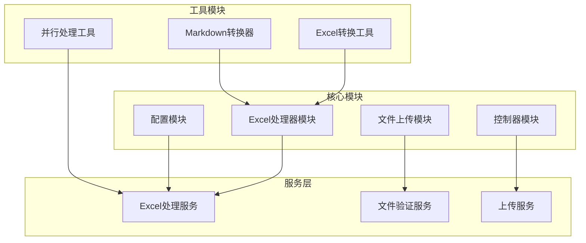

**图表来源**
- [ExcelProcessorTool.java:1-800](file://src/main/java/com/alibaba/cloud/ai/lynxe/tool/excelProcessor/ExcelProcessorTool.java#L1-L800)
- [ExcelProcessingService.java:1-800](file://src/main/java/com/alibaba/cloud/ai/lynxe/tool/excelProcessor/ExcelProcessingService.java#L1-L800)

**章节来源**
- [ExcelProcessorTool.java:1-800](file://src/main/java/com/alibaba/cloud/ai/lynxe/tool/excelProcessor/ExcelProcessorTool.java#L1-L800)
- [ExcelProcessingService.java:1-800](file://src/main/java/com/alibaba/cloud/ai/lynxe/tool/excelProcessor/ExcelProcessingService.java#L1-L800)

## 核心组件

### Excel处理器工具

ExcelProcessorTool是整个Excel处理系统的核心组件，提供了统一的API接口：

#### 支持的操作类型

| 操作类型 | 功能描述 | 使用场景 |
|---------|----------|----------|
| create_file | 创建新的Excel文件 | 初始化工作簿 |
| create_table | 创建带表头的表格 | 结构化数据存储 |
| get_structure | 获取文件结构信息 | 文件元数据查询 |
| read_data | 读取数据 | 数据检索 |
| write_data | 写入数据 | 数据保存 |
| update_cells | 更新单元格 | 数据修改 |
| search_data | 搜索数据 | 数据查找 |
| delete_rows | 删除行 | 数据清理 |
| format_cells | 格式化单元格 | 数据展示优化 |
| add_formulas | 添加公式 | 动态计算 |
| batch_process | 批量处理 | 大数据集处理 |
| smart_import | 智能导入 | 多源数据整合 |
| read_csv | 读取CSV文件 | 文本数据处理 |

#### 输入参数结构

ExcelProcessorTool.ExcelInput类定义了完整的输入参数结构：

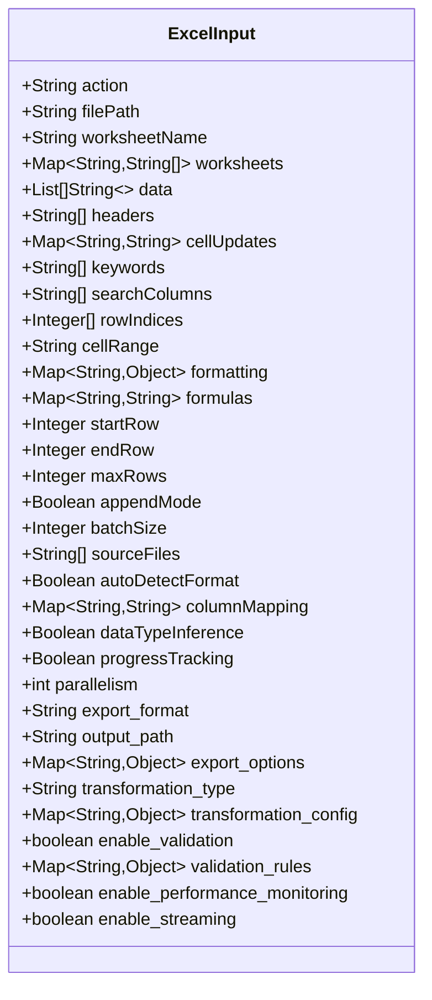

**图表来源**
- [ExcelProcessorTool.java:86-424](file://src/main/java/com/alibaba/cloud/ai/lynxe/tool/excelProcessor/ExcelProcessorTool.java#L86-L424)

**章节来源**
- [ExcelProcessorTool.java:50-506](file://src/main/java/com/alibaba/cloud/ai/lynxe/tool/excelProcessor/ExcelProcessorTool.java#L50-L506)
- [ExcelProcessorTool.java:86-424](file://src/main/java/com/alibaba/cloud/ai/lynxe/tool/excelProcessor/ExcelProcessorTool.java#L86-L424)

### Excel处理服务

ExcelProcessingService实现了IExcelProcessingService接口，提供了具体的Excel处理逻辑：

#### 大文件处理策略

系统针对不同大小的文件采用了不同的处理策略：

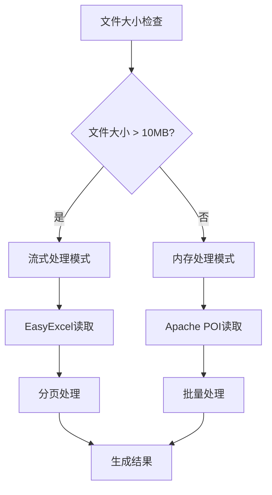

**图表来源**
- [ExcelProcessingService.java:242-321](file://src/main/java/com/alibaba/cloud/ai/lynxe/tool/excelProcessor/ExcelProcessingService.java#L242-L321)

#### 内存优化机制

- **SXSSFWorkbook**: 用于大文件写入，限制内存中的行数
- **流式读取**: 使用EasyExcel进行流式读取，避免内存溢出
- **批处理**: 默认批大小为1000行，可配置调整

**章节来源**
- [ExcelProcessingService.java:76-84](file://src/main/java/com/alibaba/cloud/ai/lynxe/tool/excelProcessor/ExcelProcessingService.java#L76-L84)
- [ExcelProcessingService.java:418-488](file://src/main/java/com/alibaba/cloud/ai/lynxe/tool/excelProcessor/ExcelProcessingService.java#L418-L488)

## 架构概览

Lynxe Excel处理工具API采用分层架构设计，确保了良好的可维护性和扩展性：

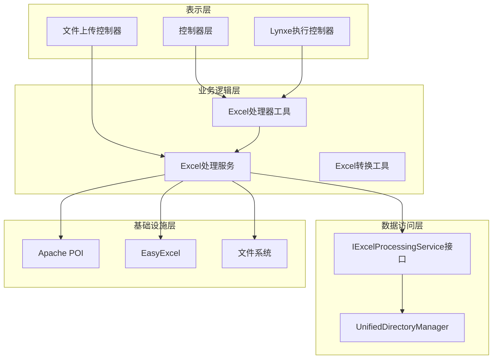

**图表来源**
- [ExcelProcessorConfiguration.java:31-45](file://src/main/java/com/alibaba/cloud/ai/lynxe/config/ExcelProcessorConfiguration.java#L31-L45)
- [LynxeController.java:96-166](file://src/main/java/com/alibaba/cloud/ai/lynxe/runtime/controller/LynxeController.java#L96-L166)

### 组件交互流程

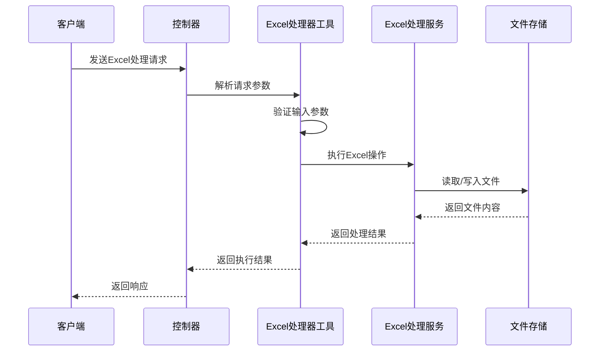

**图表来源**
- [ExcelProcessorTool.java:430-506](file://src/main/java/com/alibaba/cloud/ai/lynxe/tool/excelProcessor/ExcelProcessorTool.java#L430-L506)
- [ExcelProcessingService.java:144-194](file://src/main/java/com/alibaba/cloud/ai/lynxe/tool/excelProcessor/ExcelProcessingService.java#L144-L194)

**章节来源**
- [ExcelProcessorConfiguration.java:31-45](file://src/main/java/com/alibaba/cloud/ai/lynxe/config/ExcelProcessorConfiguration.java#L31-L45)
- [LynxeController.java:579-693](file://src/main/java/com/alibaba/cloud/ai/lynxe/runtime/controller/LynxeController.java#L579-L693)

## 详细组件分析

### Excel处理器工具分析

#### 类设计结构

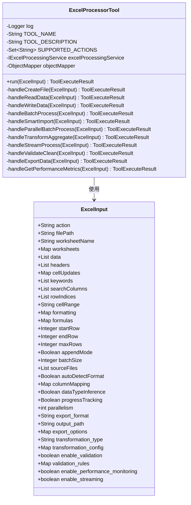

**图表来源**
- [ExcelProcessorTool.java:34-506](file://src/main/java/com/alibaba/cloud/ai/lynxe/tool/excelProcessor/ExcelProcessorTool.java#L34-L506)

#### 并行处理机制

系统支持多种并行处理模式：

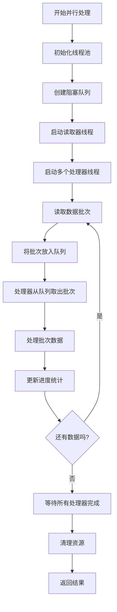

**图表来源**
- [ExcelProcessingService.java:509-633](file://src/main/java/com/alibaba/cloud/ai/lynxe/tool/excelProcessor/ExcelProcessingService.java#L509-L633)

**章节来源**
- [ExcelProcessorTool.java:426-506](file://src/main/java/com/alibaba/cloud/ai/lynxe/tool/excelProcessor/ExcelProcessorTool.java#L426-L506)
- [ExcelProcessingService.java:509-633](file://src/main/java/com/alibaba/cloud/ai/lynxe/tool/excelProcessor/ExcelProcessingService.java#L509-L633)

### Excel处理服务分析

#### 接口设计

IExcelProcessingService接口定义了完整的Excel处理能力：

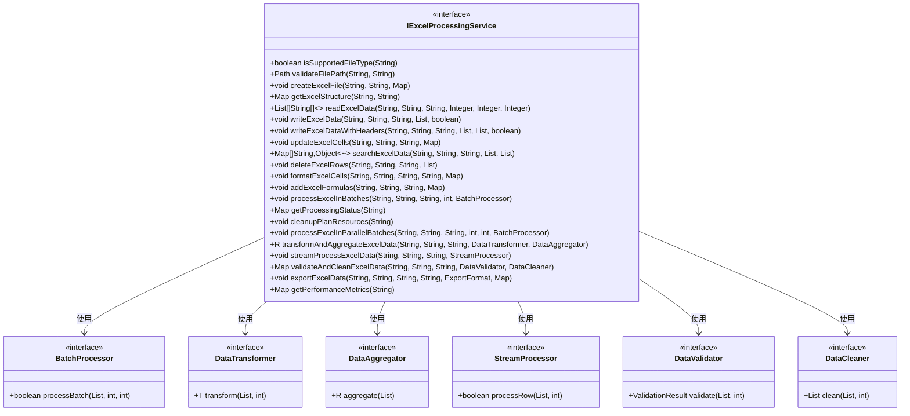

**图表来源**
- [IExcelProcessingService.java:40-398](file://src/main/java/com/alibaba/cloud/ai/lynxe/tool/excelProcessor/IExcelProcessingService.java#L40-L398)

#### 数据验证和清理

系统提供了完整的数据验证和清理功能：

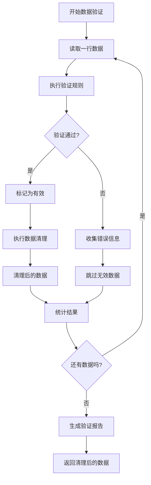

**图表来源**
- [ExcelProcessingService.java:708-765](file://src/main/java/com/alibaba/cloud/ai/lynxe/tool/excelProcessor/ExcelProcessingService.java#L708-L765)

**章节来源**
- [IExcelProcessingService.java:268-398](file://src/main/java/com/alibaba/cloud/ai/lynxe/tool/excelProcessor/IExcelProcessingService.java#L268-L398)
- [ExcelProcessingService.java:708-765](file://src/main/java/com/alibaba/cloud/ai/lynxe/tool/excelProcessor/ExcelProcessingService.java#L708-L765)

### 文件上传和处理

#### 文件上传控制器

FileUploadController提供了完整的文件上传功能：

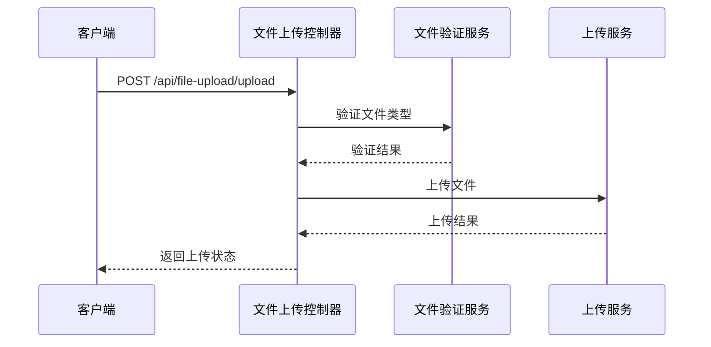

**图表来源**
- [FileUploadController.java:56-94](file://src/main/java/com/alibaba/cloud/ai/lynxe/runtime/controller/FileUploadController.java#L56-L94)

#### 配置参数

系统支持的文件类型和限制：

| 参数 | 默认值 | 描述 |
|------|--------|------|
| maxFileSize | 1GB | 单个文件最大大小 |
| maxFiles | 10 | 单次上传最大文件数 |
| allowedTypes | 多种Office格式 | 允许的文件类型 |
| uploadDirectory | uploaded_files | 上传文件存储目录 |

**章节来源**
- [FileUploadController.java:170-182](file://src/main/java/com/alibaba/cloud/ai/lynxe/runtime/controller/FileUploadController.java#L170-L182)
- [application.yml:78-87](file://src/main/resources/application.yml#L78-L87)

## 依赖关系分析

### 核心依赖关系

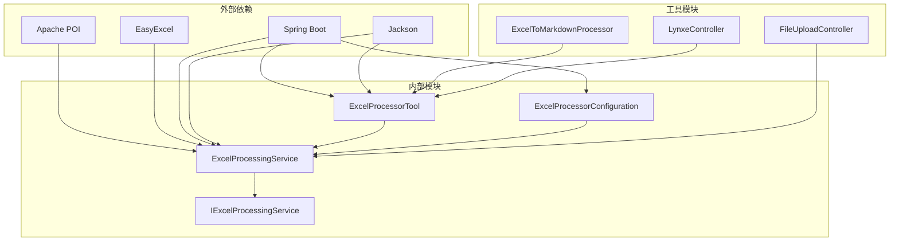

**图表来源**
- [ExcelProcessorConfiguration.java:39-43](file://src/main/java/com/alibaba/cloud/ai/lynxe/config/ExcelProcessorConfiguration.java#L39-L43)
- [ExcelToMarkdownProcessor.java:31-59](file://src/main/java/com/alibaba/cloud/ai/lynxe/tool/convertToMarkdown/ExcelToMarkdownProcessor.java#L31-L59)

### 性能监控和指标

系统提供了详细的性能监控功能：

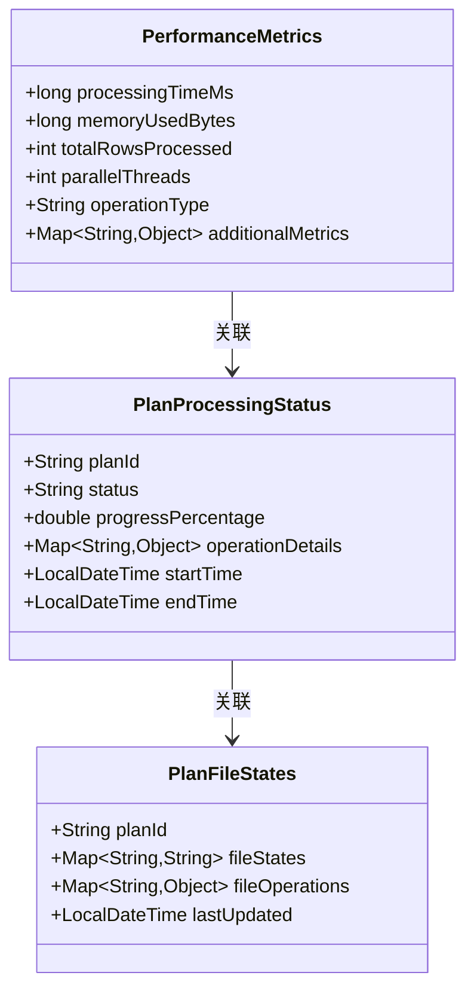

**图表来源**
- [ExcelProcessingService.java:88-98](file://src/main/java/com/alibaba/cloud/ai/lynxe/tool/excelProcessor/ExcelProcessingService.java#L88-L98)

**章节来源**
- [ExcelProcessingService.java:88-98](file://src/main/java/com/alibaba/cloud/ai/lynxe/tool/excelProcessor/ExcelProcessingService.java#L88-L98)

## 性能考虑

### 内存优化策略

1. **流式处理**: 对于大于10MB的文件，使用EasyExcel进行流式读取
2. **批处理**: 默认批大小为1000行，可根据内存情况调整
3. **SXSSFWorkbook**: 大文件写入时限制内存中的行数
4. **资源管理**: 自动关闭文件流和工作簿实例

### 并发控制机制

1. **线程池管理**: 使用固定大小的线程池处理并行任务
2. **阻塞队列**: 使用有界阻塞队列控制内存使用
3. **原子操作**: 使用AtomicInteger和AtomicLong保证线程安全
4. **超时控制**: 设置合理的线程等待超时时间

### 大文件处理最佳实践

1. **分页读取**: 使用startRow和endRow参数分页读取数据
2. **增量写入**: 使用appendMode参数进行增量写入
3. **内存监控**: 定期检查内存使用情况
4. **错误恢复**: 实现断点续传和错误恢复机制

## 故障排除指南

### 常见问题和解决方案

| 问题类型 | 错误信息 | 可能原因 | 解决方案 |
|----------|----------|----------|----------|
| 文件格式错误 | Unsupported file type | 不支持的文件格式 | 确保使用.xlsx或.xls格式 |
| 内存不足 | OutOfMemoryError | 处理超大文件 | 使用流式处理或增加内存 |
| 文件路径错误 | File not found | 路径不正确 | 检查相对路径和绝对路径 |
| 并发冲突 | ConcurrentModificationException | 多线程访问共享数据 | 使用线程安全的数据结构 |
| 性能问题 | 处理速度慢 | 缺少索引或优化 | 调整批大小和并行度 |

### 调试和监控

1. **日志级别**: 将日志级别设置为DEBUG以获取详细信息
2. **性能指标**: 使用getPerformanceMetrics获取处理统计信息
3. **状态查询**: 使用getProcessingStatus监控长时间运行操作
4. **异常缓存**: 系统会缓存最近的异常以便调试

**章节来源**
- [ExcelProcessingService.java:88-98](file://src/main/java/com/alibaba/cloud/ai/lynxe/tool/excelProcessor/ExcelProcessingService.java#L88-L98)

## 结论

Lynxe Excel处理工具API提供了一个功能完整、性能优异的Excel文件处理解决方案。其设计特点包括：

1. **统一接口**: 提供单一的API入口，简化了Excel操作
2. **大文件优化**: 专门针对大文件处理进行了优化
3. **并行处理**: 支持多线程并行处理，提升性能
4. **内存管理**: 有效的内存使用策略，避免内存溢出
5. **扩展性**: 清晰的架构设计，便于功能扩展

该系统适用于各种Excel处理场景，从简单的数据读写到复杂的大数据分析，都能提供高效可靠的解决方案。

## 附录

### API使用示例

#### 基本文件读取

```json
{
  "action": "read_data",
  "file_path": "data/sales.xlsx",
  "worksheet_name": "Sheet1",
  "start_row": 0,
  "end_row": 100,
  "max_rows": 1000
}
```

#### 数据写入

```json
{
  "action": "write_data",
  "file_path": "output/result.xlsx",
  "worksheet_name": "Results",
  "headers": ["姓名", "年龄", "部门"],
  "data": [
    ["张三", "25", "技术部"],
    ["李四", "30", "销售部"]
  ],
  "append_mode": true
}
```

#### 并行处理

```json
{
  "action": "parallel_batch_process",
  "file_path": "large_data.xlsx",
  "worksheet_name": "Sheet1",
  "batch_size": 1000,
  "parallelism": 4,
  "enable_performance_monitoring": true
}
```

### 配置选项

#### 内存配置

```yaml
lynxe:
  excel-processing:
    memory-limit: 1073741824  # 1GB
    batch-size: 1000
    parallel-threads: 4
```

#### 文件处理配置

```yaml
spring:
  servlet:
    multipart:
      max-file-size: 1073741824
      max-request-size: 6442450944
```