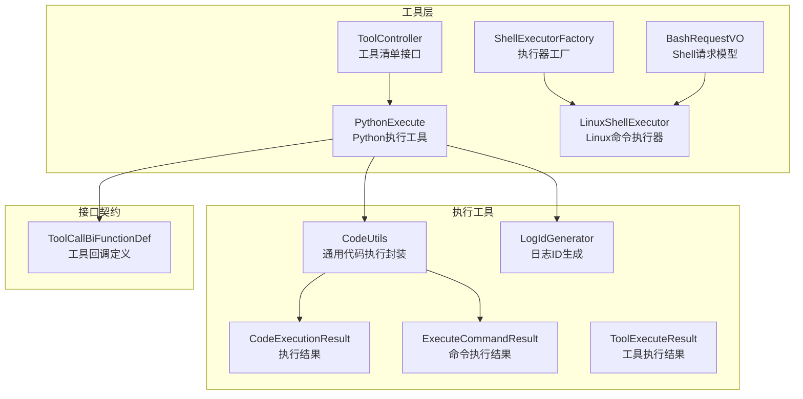
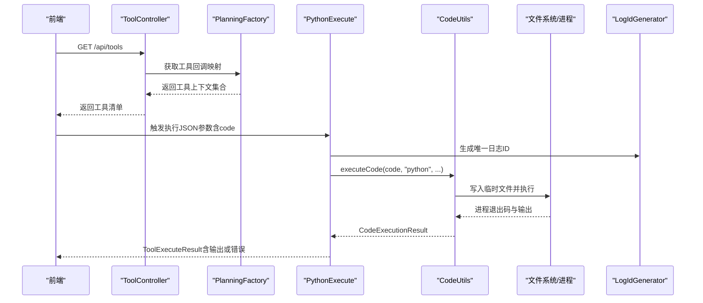
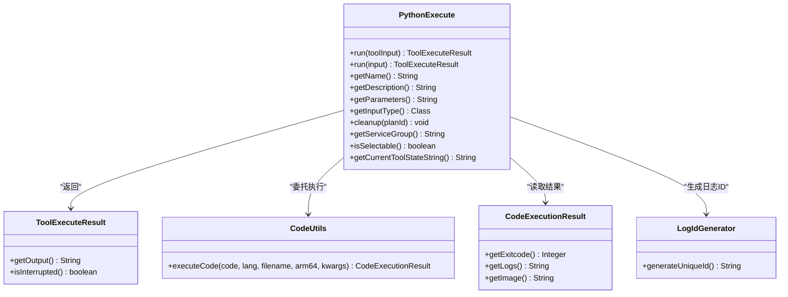
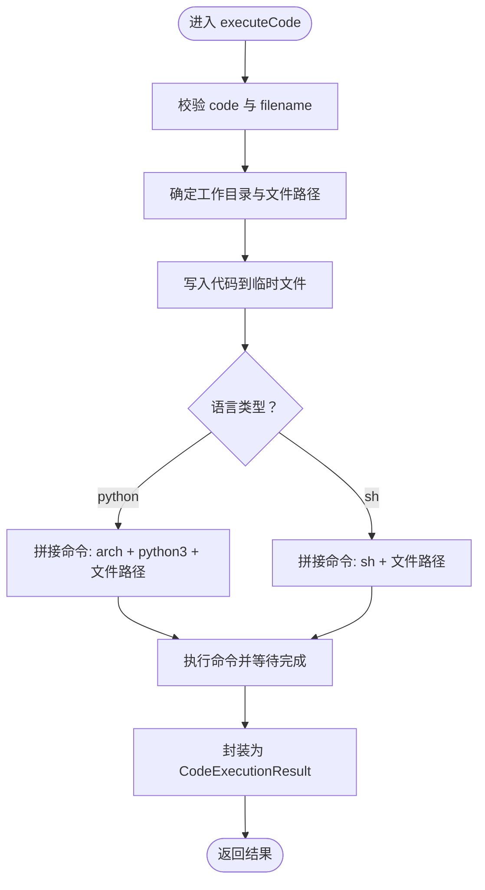
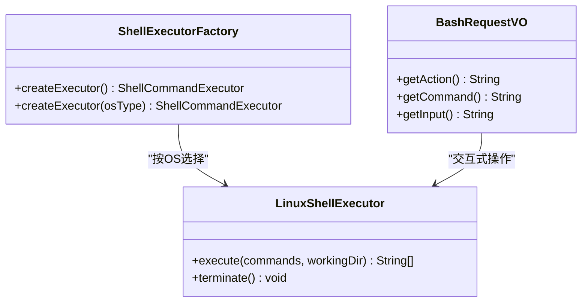
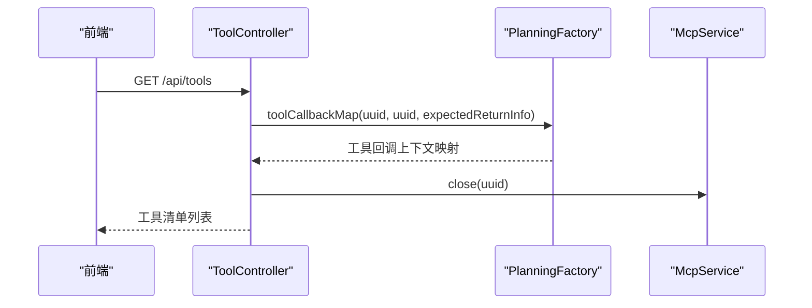
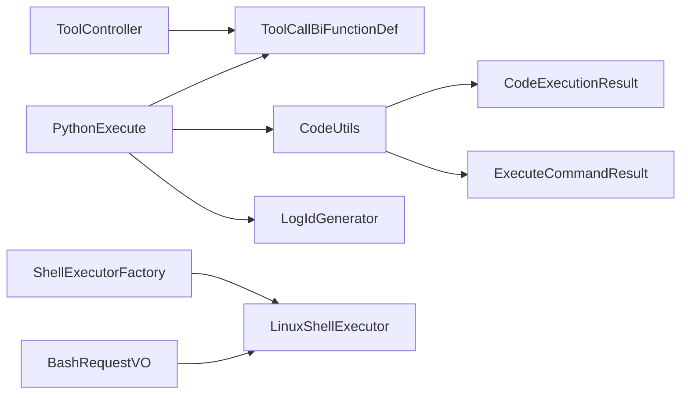

# 代码执行工具API

<cite>
**本文引用的文件**
- [PythonExecute.java](file://src/main/java/com/alibaba/cloud/ai/lynxe/tool/code/PythonExecute.java)
- [CodeUtils.java](file://src/main/java/com/alibaba/cloud/ai/lynxe/tool/code/CodeUtils.java)
- [CodeExecutionResult.java](file://src/main/java/com/alibaba/cloud/ai/lynxe/tool/code/CodeExecutionResult.java)
- [ExecuteCommandResult.java](file://src/main/java/com/alibaba/cloud/ai/lynxe/tool/code/ExecuteCommandResult.java)
- [ToolExecuteResult.java](file://src/main/java/com/alibaba/cloud/ai/lynxe/tool/code/ToolExecuteResult.java)
- [LogIdGenerator.java](file://src/main/java/com/alibaba/cloud/ai/lynxe/tool/code/LogIdGenerator.java)
- [ToolController.java](file://src/main/java/com/alibaba/cloud/ai/lynxe/tool/controller/ToolController.java)
- [ToolCallBiFunctionDef.java](file://src/main/java/com/alibaba/cloud/ai/lynxe/tool/ToolCallBiFunctionDef.java)
- [BashRequestVO.java](file://src/main/java/com/alibaba/cloud/ai/lynxe/tool/bash/BashRequestVO.java)
- [LinuxShellExecutor.java](file://src/main/java/com/alibaba/cloud/ai/lynxe/tool/bash/LinuxShellExecutor.java)
- [ShellExecutorFactory.java](file://src/main/java/com/alibaba/cloud/ai/lynxe/tool/bash/ShellExecutorFactory.java)
</cite>

## 目录
1. [简介](#简介)
2. [项目结构](#项目结构)
3. [核心组件](#核心组件)
4. [架构总览](#架构总览)
5. [详细组件分析](#详细组件分析)
6. [依赖分析](#依赖分析)
7. [性能考虑](#性能考虑)
8. [故障排查指南](#故障排查指南)
9. [结论](#结论)
10. [附录：使用示例与最佳实践](#附录使用示例与最佳实践)

## 简介
本文件为 Lynxe 代码执行工具API的权威文档，聚焦于统一的代码执行接口设计，涵盖：
- Python 脚本执行
- Shell 命令调用（跨平台）
- 代码结果获取与状态查询
- 执行环境配置、资源限制与安全防护
- 执行超时控制、输出捕获与错误处理策略
- 完整使用示例与安全最佳实践

该API通过“工具”抽象层对外暴露，前端可通过统一的工具列表接口发现可用能力，并以标准参数格式触发具体执行。

## 项目结构
围绕“代码执行”的关键模块分布如下：
- 工具层：统一的工具接口与具体实现（Python 执行、Shell 执行）
- 工具控制器：提供工具清单查询接口
- 工具回调定义：规范工具的输入、输出、描述与可选性等元信息
- 执行工具：通用代码执行与命令执行封装
- 日志ID生成：用于执行日志与临时文件命名
- Shell 执行器：按操作系统选择合适的执行器并处理超时与终止

**图表来源**
- [ToolController.java:41-113](file://src/main/java/com/alibaba/cloud/ai/lynxe/tool/controller/ToolController.java#L41-L113)
- [PythonExecute.java:27-246](file://src/main/java/com/alibaba/cloud/ai/lynxe/tool/code/PythonExecute.java#L27-L246)
- [CodeUtils.java:38-220](file://src/main/java/com/alibaba/cloud/ai/lynxe/tool/code/CodeUtils.java#L38-L220)
- [CodeExecutionResult.java:18-51](file://src/main/java/com/alibaba/cloud/ai/lynxe/tool/code/CodeExecutionResult.java#L18-L51)
- [ExecuteCommandResult.java:18-41](file://src/main/java/com/alibaba/cloud/ai/lynxe/tool/code/ExecuteCommandResult.java#L18-L41)
- [ToolExecuteResult.java:18-60](file://src/main/java/com/alibaba/cloud/ai/lynxe/tool/code/ToolExecuteResult.java#L18-L60)
- [LogIdGenerator.java:31-154](file://src/main/java/com/alibaba/cloud/ai/lynxe/tool/code/LogIdGenerator.java#L31-L154)
- [ToolCallBiFunctionDef.java:24-107](file://src/main/java/com/alibaba/cloud/ai/lynxe/tool/ToolCallBiFunctionDef.java#L24-L107)
- [BashRequestVO.java:18-65](file://src/main/java/com/alibaba/cloud/ai/lynxe/tool/bash/BashRequestVO.java#L18-L65)
- [ShellExecutorFactory.java:18-60](file://src/main/java/com/alibaba/cloud/ai/lynxe/tool/bash/ShellExecutorFactory.java#L18-L60)
- [LinuxShellExecutor.java:33-166](file://src/main/java/com/alibaba/cloud/ai/lynxe/tool/bash/LinuxShellExecutor.java#L33-L166)

**章节来源**
- [ToolController.java:41-113](file://src/main/java/com/alibaba/cloud/ai/lynxe/tool/controller/ToolController.java#L41-L113)
- [PythonExecute.java:27-246](file://src/main/java/com/alibaba/cloud/ai/lynxe/tool/code/PythonExecute.java#L27-L246)
- [CodeUtils.java:38-220](file://src/main/java/com/alibaba/cloud/ai/lynxe/tool/code/CodeUtils.java#L38-L220)
- [ToolCallBiFunctionDef.java:24-107](file://src/main/java/com/alibaba/cloud/ai/lynxe/tool/ToolCallBiFunctionDef.java#L24-L107)
- [BashRequestVO.java:18-65](file://src/main/java/com/alibaba/cloud/ai/lynxe/tool/bash/BashRequestVO.java#L18-L65)
- [ShellExecutorFactory.java:18-60](file://src/main/java/com/alibaba/cloud/ai/lynxe/tool/bash/ShellExecutorFactory.java#L18-L60)
- [LinuxShellExecutor.java:33-166](file://src/main/java/com/alibaba/cloud/ai/lynxe/tool/bash/LinuxShellExecutor.java#L33-L166)

## 核心组件
- 工具接口契约：定义工具名称、描述、参数模式、是否可选、清理方法等，确保所有工具具备一致的元信息与生命周期管理。
- Python 执行工具：接收 JSON 参数中的 code 字段，落地到临时文件后通过 CodeUtils 执行，返回工具执行结果。
- 通用代码执行：根据语言类型选择执行命令（如 python3 或 sh），支持 ARM64/x86_64 架构切换，捕获标准输出与错误输出。
- Shell 执行器：按操作系统选择执行器，设置默认超时、禁用分页器、处理中断与后台任务重试。
- 工具控制器：聚合所有工具，返回前端可用工具清单，包含服务组、名称、描述、是否可选等信息。

**章节来源**
- [ToolCallBiFunctionDef.java:24-107](file://src/main/java/com/alibaba/cloud/ai/lynxe/tool/ToolCallBiFunctionDef.java#L24-L107)
- [PythonExecute.java:27-246](file://src/main/java/com/alibaba/cloud/ai/lynxe/tool/code/PythonExecute.java#L27-L246)
- [CodeUtils.java:92-163](file://src/main/java/com/alibaba/cloud/ai/lynxe/tool/code/CodeUtils.java#L92-L163)
- [LinuxShellExecutor.java:47-107](file://src/main/java/com/alibaba/cloud/ai/lynxe/tool/bash/LinuxShellExecutor.java#L47-L107)
- [ToolController.java:54-110](file://src/main/java/com/alibaba/cloud/ai/lynxe/tool/controller/ToolController.java#L54-L110)

## 架构总览
下图展示从“工具清单查询”到“Python 代码执行”的端到端流程，以及 Shell 执行器的跨平台适配。

**图表来源**
- [ToolController.java:58-94](file://src/main/java/com/alibaba/cloud/ai/lynxe/tool/controller/ToolController.java#L58-L94)
- [PythonExecute.java:103-145](file://src/main/java/com/alibaba/cloud/ai/lynxe/tool/code/PythonExecute.java#L103-L145)
- [CodeUtils.java:139-163](file://src/main/java/com/alibaba/cloud/ai/lynxe/tool/code/CodeUtils.java#L139-L163)
- [LogIdGenerator.java:82-103](file://src/main/java/com/alibaba/cloud/ai/lynxe/tool/code/LogIdGenerator.java#L82-L103)

## 详细组件分析

### Python 执行工具（PythonExecute）
- 输入参数
  - JSON 结构包含字段：code（字符串，必填）。工具内部会解析 JSON 并提取 code。
- 执行流程
  - 生成唯一日志ID，写入临时文件（扩展名由语言决定），调用 CodeUtils 执行。
  - 解析输出，若包含常见 Python 错误关键字则标记为失败并记录错误信息。
- 输出结果
  - ToolExecuteResult 包含输出文本；若发生异常，返回错误提示。
- 元信息
  - 名称、描述、参数模式（JSON Schema）、是否可选、服务组等由工具契约提供。

**图表来源**
- [PythonExecute.java:27-246](file://src/main/java/com/alibaba/cloud/ai/lynxe/tool/code/PythonExecute.java#L27-L246)
- [ToolExecuteResult.java:18-60](file://src/main/java/com/alibaba/cloud/ai/lynxe/tool/code/ToolExecuteResult.java#L18-L60)
- [CodeUtils.java:92-163](file://src/main/java/com/alibaba/cloud/ai/lynxe/tool/code/CodeUtils.java#L92-L163)
- [CodeExecutionResult.java:18-51](file://src/main/java/com/alibaba/cloud/ai/lynxe/tool/code/CodeExecutionResult.java#L18-L51)
- [LogIdGenerator.java:82-103](file://src/main/java/com/alibaba/cloud/ai/lynxe/tool/code/LogIdGenerator.java#L82-L103)

**章节来源**
- [PythonExecute.java:36-145](file://src/main/java/com/alibaba/cloud/ai/lynxe/tool/code/PythonExecute.java#L36-L145)
- [ToolExecuteResult.java:18-60](file://src/main/java/com/alibaba/cloud/ai/lynxe/tool/code/ToolExecuteResult.java#L18-L60)
- [CodeExecutionResult.java:18-51](file://src/main/java/com/alibaba/cloud/ai/lynxe/tool/code/CodeExecutionResult.java#L18-L51)
- [LogIdGenerator.java:82-103](file://src/main/java/com/alibaba/cloud/ai/lynxe/tool/code/LogIdGenerator.java#L82-L103)

### 通用代码执行（CodeUtils）
- 功能
  - 将传入代码写入临时文件，按语言选择执行命令（如 python3、sh）。
  - 支持 ARM64/x86_64 架构切换（通过 arch 指令）。
  - 返回 CodeExecutionResult，包含退出码与日志。
- 关键点
  - 若未提供 filename，则基于 code 的 MD5 生成文件名。
  - 默认工作目录为用户当前目录，必要时自动创建目录。
  - 不支持的语言会抛出异常。

**图表来源**
- [CodeUtils.java:92-163](file://src/main/java/com/alibaba/cloud/ai/lynxe/tool/code/CodeUtils.java#L92-L163)

**章节来源**
- [CodeUtils.java:92-163](file://src/main/java/com/alibaba/cloud/ai/lynxe/tool/code/CodeUtils.java#L92-L163)

### Shell 执行器（跨平台）
- 工厂选择
  - 根据系统属性自动选择 Windows/Mac/Linux 对应执行器。
- 执行细节
  - 设置 LANG、SHELL、PATH 等环境变量，禁用分页器以保证直接输出。
  - 默认超时时间（秒），非后台命令在超时后尝试发送 SIGINT 并可重试为后台任务。
  - 支持 ctrl+c 终止当前进程，先 SIGINT 后强制终止。
- 请求模型
  - BashRequestVO 提供 action（command/send_input/terminate）、command、input 等字段，便于交互式场景。

**图表来源**
- [ShellExecutorFactory.java:22-60](file://src/main/java/com/alibaba/cloud/ai/lynxe/tool/bash/ShellExecutorFactory.java#L22-L60)
- [LinuxShellExecutor.java:36-166](file://src/main/java/com/alibaba/cloud/ai/lynxe/tool/bash/LinuxShellExecutor.java#L36-L166)
- [BashRequestVO.java:22-65](file://src/main/java/com/alibaba/cloud/ai/lynxe/tool/bash/BashRequestVO.java#L22-L65)

**章节来源**
- [ShellExecutorFactory.java:22-60](file://src/main/java/com/alibaba/cloud/ai/lynxe/tool/bash/ShellExecutorFactory.java#L22-L60)
- [LinuxShellExecutor.java:47-127](file://src/main/java/com/alibaba/cloud/ai/lynxe/tool/bash/LinuxShellExecutor.java#L47-L127)
- [BashRequestVO.java:22-65](file://src/main/java/com/alibaba/cloud/ai/lynxe/tool/bash/BashRequestVO.java#L22-L65)

### 工具清单接口（ToolController）
- 端点
  - GET /api/tools：返回可用工具列表，包含 key、name、description、enabled、serviceGroup、selectable 等。
- 流程
  - 通过 PlanningFactory 获取工具回调映射，组装 Tool 对象并返回。
  - 最终关闭 MCP 连接，避免资源泄漏。

**图表来源**
- [ToolController.java:58-110](file://src/main/java/com/alibaba/cloud/ai/lynxe/tool/controller/ToolController.java#L58-L110)

**章节来源**
- [ToolController.java:58-110](file://src/main/java/com/alibaba/cloud/ai/lynxe/tool/controller/ToolController.java#L58-L110)

## 依赖分析
- 松耦合设计
  - 工具通过 ToolCallBiFunctionDef 抽象，统一了工具的元信息与生命周期。
  - PythonExecute 仅依赖 CodeUtils 与 LogIdGenerator，职责清晰。
  - Shell 执行器通过工厂按 OS 选择，避免硬编码分支。
- 可能的循环依赖
  - 当前各模块均为单向依赖，未见循环依赖迹象。
- 外部依赖点
  - 进程执行与文件系统写入是主要外部交互面，需关注权限与路径安全。

**图表来源**
- [PythonExecute.java:27-246](file://src/main/java/com/alibaba/cloud/ai/lynxe/tool/code/PythonExecute.java#L27-L246)
- [ToolCallBiFunctionDef.java:24-107](file://src/main/java/com/alibaba/cloud/ai/lynxe/tool/ToolCallBiFunctionDef.java#L24-L107)
- [CodeUtils.java:92-163](file://src/main/java/com/alibaba/cloud/ai/lynxe/tool/code/CodeUtils.java#L92-L163)
- [CodeExecutionResult.java:18-51](file://src/main/java/com/alibaba/cloud/ai/lynxe/tool/code/CodeExecutionResult.java#L18-L51)
- [ExecuteCommandResult.java:18-41](file://src/main/java/com/alibaba/cloud/ai/lynxe/tool/code/ExecuteCommandResult.java#L18-L41)
- [LogIdGenerator.java:82-103](file://src/main/java/com/alibaba/cloud/ai/lynxe/tool/code/LogIdGenerator.java#L82-L103)
- [ShellExecutorFactory.java:22-60](file://src/main/java/com/alibaba/cloud/ai/lynxe/tool/bash/ShellExecutorFactory.java#L22-L60)
- [LinuxShellExecutor.java:36-166](file://src/main/java/com/alibaba/cloud/ai/lynxe/tool/bash/LinuxShellExecutor.java#L36-L166)
- [BashRequestVO.java:22-65](file://src/main/java/com/alibaba/cloud/ai/lynxe/tool/bash/BashRequestVO.java#L22-L65)
- [ToolController.java:41-113](file://src/main/java/com/alibaba/cloud/ai/lynxe/tool/controller/ToolController.java#L41-L113)

**章节来源**
- [PythonExecute.java:27-246](file://src/main/java/com/alibaba/cloud/ai/lynxe/tool/code/PythonExecute.java#L27-L246)
- [CodeUtils.java:92-163](file://src/main/java/com/alibaba/cloud/ai/lynxe/tool/code/CodeUtils.java#L92-L163)
- [ShellExecutorFactory.java:22-60](file://src/main/java/com/alibaba/cloud/ai/lynxe/tool/bash/ShellExecutorFactory.java#L22-L60)
- [ToolController.java:41-113](file://src/main/java/com/alibaba/cloud/ai/lynxe/tool/controller/ToolController.java#L41-L113)

## 性能考虑
- I/O 与进程开销
  - 代码执行涉及磁盘写入与子进程启动，建议批量提交小任务，避免频繁 I/O。
- 超时与中断
  - Shell 执行器默认超时并尝试 SIGINT，随后可重试为后台任务；Python 执行器通过 CodeUtils 执行命令，建议在上层控制任务粒度。
- 资源限制
  - 当前实现未显式设置 CPU/内存限额，建议在部署层面结合容器或系统级限制进行约束。

[本节为通用指导，不直接分析具体文件]

## 故障排查指南
- Python 执行失败
  - 现象：输出包含语法/缩进/名称/类型/值/导入等错误关键字。
  - 排查：检查 code 是否合法、依赖库是否安装、是否使用 print 输出可见结果。
- Shell 命令超时
  - 现象：长时间无输出或被终止。
  - 排查：确认命令是否后台运行、是否需要交互输入；必要时调整超时策略或改为交互式 send_input。
- 进程无法终止
  - 现象：SIGINT 后仍存活。
  - 排查：执行器会回退至强制终止；若仍失败，检查系统权限与僵尸进程。
- 工具清单为空
  - 现象：GET /api/tools 返回空列表。
  - 排查：确认 PlanningFactory 初始化正常、MCP 连接未阻塞；查看日志中工具回调映射构建过程。

**章节来源**
- [PythonExecute.java:120-139](file://src/main/java/com/alibaba/cloud/ai/lynxe/tool/code/PythonExecute.java#L120-L139)
- [LinuxShellExecutor.java:82-127](file://src/main/java/com/alibaba/cloud/ai/lynxe/tool/bash/LinuxShellExecutor.java#L82-L127)
- [ToolController.java:96-110](file://src/main/java/com/alibaba/cloud/ai/lynxe/tool/controller/ToolController.java#L96-L110)

## 结论
Lynxe 的代码执行工具API通过统一的工具契约与跨平台执行器，实现了 Python 与 Shell 的标准化执行入口。配合工具清单接口，前端可动态发现并调用相应能力。建议在生产环境中结合容器化与系统级资源限制，强化安全与稳定性。

[本节为总结性内容，不直接分析具体文件]

## 附录：使用示例与最佳实践

### API 端点与请求/响应
- 获取工具清单
  - 方法：GET
  - 路径：/api/tools
  - 响应：工具列表（包含 key、name、description、enabled、serviceGroup、selectable）

- Python 代码执行（通过工具调用）
  - 方法：POST（通过工具调用框架触发，参数为 JSON）
  - 路径：由工具注册与调度框架决定（本仓库未提供独立 REST 端点）
  - 请求体：包含字段 code（字符串，必填）
  - 响应：ToolExecuteResult（包含 output；若失败包含错误信息）

- Shell 命令执行（通过工具调用）
  - 方法：POST（通过工具调用框架触发）
  - 请求体：BashRequestVO（action、command、input）
  - 响应：字符串输出或错误信息

**章节来源**
- [ToolController.java:58-94](file://src/main/java/com/alibaba/cloud/ai/lynxe/tool/controller/ToolController.java#L58-L94)
- [PythonExecute.java:174-187](file://src/main/java/com/alibaba/cloud/ai/lynxe/tool/code/PythonExecute.java#L174-L187)
- [BashRequestVO.java:22-65](file://src/main/java/com/alibaba/cloud/ai/lynxe/tool/bash/BashRequestVO.java#L22-L65)

### 执行环境配置
- Python 执行
  - 语言：python3
  - 架构：支持 ARM64/x86_64（通过 arch 切换）
  - 临时文件：基于 code 的 MD5 生成文件名，写入工作目录
- Shell 执行
  - 系统：自动识别 Windows/Mac/Linux
  - 环境：LANG、SHELL、PATH、分页器禁用
  - 超时：默认超时并尝试 SIGINT，必要时转为后台任务

**章节来源**
- [CodeUtils.java:140-149](file://src/main/java/com/alibaba/cloud/ai/lynxe/tool/code/CodeUtils.java#L140-L149)
- [LinuxShellExecutor.java:62-77](file://src/main/java/com/alibaba/cloud/ai/lynxe/tool/bash/LinuxShellExecutor.java#L62-L77)

### 资源限制与安全防护
- 资源限制
  - 建议在容器或系统层面设置 CPU/内存/文件句柄上限
  - 控制工作目录与临时文件数量，定期清理
- 安全防护
  - 仅允许受信用户提交代码与命令
  - 限制可访问的系统路径与命令
  - 对输出进行脱敏与长度限制，避免敏感信息泄露

[本节为通用指导，不直接分析具体文件]

### 执行超时控制、输出捕获与错误处理
- 超时控制
  - Shell：默认超时后发送 SIGINT，若仍存活则强制终止；可重试为后台任务
  - Python：通过执行命令等待完成，上层可结合任务调度控制
- 输出捕获
  - 标准输出与错误输出分别读取并合并为最终结果
- 错误处理
  - Python：识别常见错误关键字并标记失败
  - Shell：返回退出码与错误信息；异常时返回错误描述

**章节来源**
- [LinuxShellExecutor.java:82-100](file://src/main/java/com/alibaba/cloud/ai/lynxe/tool/bash/LinuxShellExecutor.java#L82-L100)
- [PythonExecute.java:120-131](file://src/main/java/com/alibaba/cloud/ai/lynxe/tool/code/PythonExecute.java#L120-L131)

### 使用示例（步骤说明）
- 获取可用工具
  - 调用 GET /api/tools，记录工具 key
- 执行 Python 代码
  - 准备 JSON：包含 code 字段
  - 通过工具调用框架触发对应工具（key 由上一步获得）
  - 查看 ToolExecuteResult 的 output 字段
- 执行 Shell 命令
  - 准备 BashRequestVO：action=command，command=你的命令
  - 通过工具调用框架触发
  - 查看返回字符串输出

[本节为概念性说明，不直接分析具体文件]