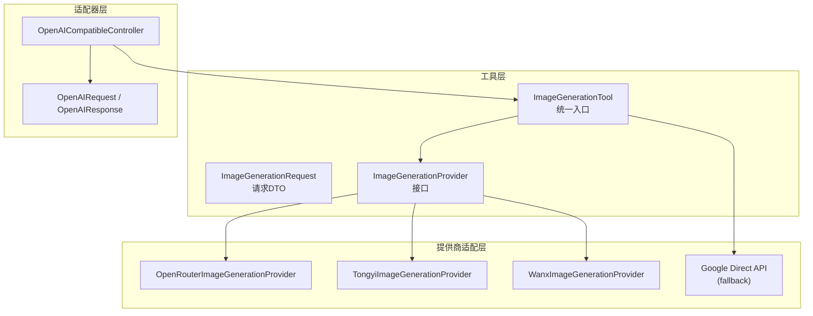
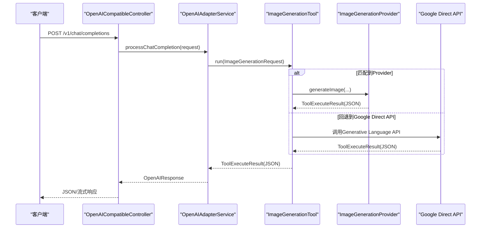
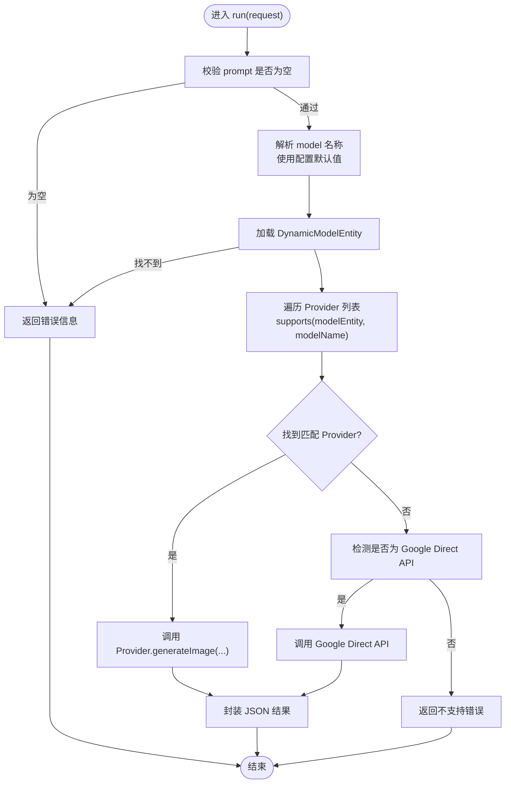
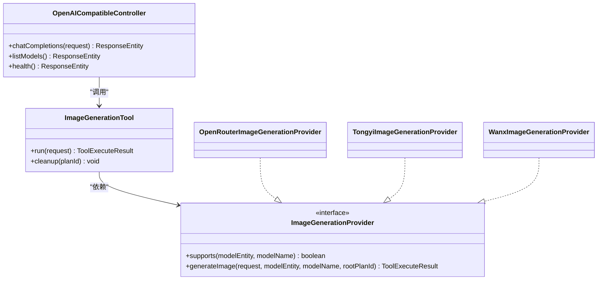

# 图像生成工具API

<cite>
**本文引用的文件列表**
- [ImageGenerationTool.java](file://src/main/java/com/alibaba/cloud/ai/lynxe/tool/image/ImageGenerationTool.java)
- [ImageGenerationProvider.java](file://src/main/java/com/alibaba/cloud/ai/lynxe/tool/image/ImageGenerationProvider.java)
- [ImageGenerationRequest.java](file://src/main/java/com/alibaba/cloud/ai/lynxe/tool/image/ImageGenerationRequest.java)
- [OpenRouterImageGenerationProvider.java](file://src/main/java/com/alibaba/cloud/ai/lynxe/tool/image/OpenRouterImageGenerationProvider.java)
- [TongyiImageGenerationProvider.java](file://src/main/java/com/alibaba/cloud/ai/lynxe/tool/image/TongyiImageGenerationProvider.java)
- [WanxImageGenerationProvider.java](file://src/main/java/com/alibaba/cloud/ai/lynxe/tool/image/WanxImageGenerationProvider.java)
- [OpenAICompatibleController.java](file://src/main/java/com/alibaba/cloud/ai/lynxe/adapter/controller/OpenAICompatibleController.java)
- [OpenAIRequest.java](file://src/main/java/com/alibaba/cloud/ai/lynxe/adapter/model/OpenAIRequest.java)
- [OpenAIResponse.java](file://src/main/java/com/alibaba/cloud/ai/lynxe/adapter/model/OpenAIResponse.java)
- [image-generate-tool-zh.yml](file://src/main/resources/i18n/tools/image-generate-tool-zh.yml)
- [image-generate-tool-en.yml](file://src/main/resources/i18n/tools/image-generate-tool-en.yml)
- [application.yml](file://src/main/resources/application.yml)
- [README.md](file://README.md)
</cite>

## 目录
1. [简介](#简介)
2. [项目结构](#项目结构)
3. [核心组件](#核心组件)
4. [架构总览](#架构总览)
5. [详细组件分析](#详细组件分析)
6. [依赖关系分析](#依赖关系分析)
7. [性能与计费](#性能与计费)
8. [故障排查指南](#故障排查指南)
9. [结论](#结论)
10. [附录](#附录)

## 简介
本文件为Lynxe图像生成工具API的权威技术文档，面向需要在多供应商环境下统一调用文生图、图生图与图像编辑能力的开发者与集成方。文档覆盖：
- 统一的图像生成接口设计与多供应商适配
- 请求参数规范、尺寸与质量参数、生成结果获取
- 不同图像提供商的集成方式与配置要点
- 错误处理与诊断建议
- 使用示例与效果优化建议

## 项目结构
Lynxe通过“工具层 + 适配器层”的分层设计实现多供应商图像生成能力：
- 工具层：ImageGenerationTool作为统一入口，负责参数校验、模型选择、错误增强与结果封装
- 提供商适配层：针对不同平台（OpenRouter、Tongyi DashScope、Wanx DashScope、Google Generative Language）的专用Provider
- 适配器层：OpenAI兼容控制器，提供标准OpenAI风格的REST接口，便于外部客户端对接

图表来源
- [ImageGenerationTool.java:94-164](file://src/main/java/com/alibaba/cloud/ai/lynxe/tool/image/ImageGenerationTool.java#L94-L164)
- [OpenRouterImageGenerationProvider.java:41-125](file://src/main/java/com/alibaba/cloud/ai/lynxe/tool/image/OpenRouterImageGenerationProvider.java#L41-L125)
- [TongyiImageGenerationProvider.java:42-107](file://src/main/java/com/alibaba/cloud/ai/lynxe/tool/image/TongyiImageGenerationProvider.java#L42-L107)
- [WanxImageGenerationProvider.java:53-173](file://src/main/java/com/alibaba/cloud/ai/lynxe/tool/image/WanxImageGenerationProvider.java#L53-L173)
- [OpenAICompatibleController.java:85-116](file://src/main/java/com/alibaba/cloud/ai/lynxe/adapter/controller/OpenAICompatibleController.java#L85-L116)

章节来源
- [ImageGenerationTool.java:94-164](file://src/main/java/com/alibaba/cloud/ai/lynxe/tool/image/ImageGenerationTool.java#L94-L164)
- [OpenAICompatibleController.java:85-116](file://src/main/java/com/alibaba/cloud/ai/lynxe/adapter/controller/OpenAICompatibleController.java#L85-L116)

## 核心组件
- 统一入口：ImageGenerationTool
  - 支持参数校验、模型解析、提供商匹配、错误增强与结果封装
  - 支持直接调用Google Generative Language API作为回退方案
- 请求对象：ImageGenerationRequest
  - 字段：prompt、model、size、quality、n
  - 默认值与枚举约束详见参数表
- 提供商接口：ImageGenerationProvider
  - supports(modelEntity, modelName)：判定是否支持该模型
  - generateImage(request, modelEntity, modelName, rootPlanId)：执行图像生成
- 适配器：OpenAICompatibleController
  - 提供/v1/chat/completions与/v1/models等OpenAI兼容端点
  - 支持流式与非流式响应

章节来源
- [ImageGenerationTool.java:94-164](file://src/main/java/com/alibaba/cloud/ai/lynxe/tool/image/ImageGenerationTool.java#L94-L164)
- [ImageGenerationRequest.java:23-103](file://src/main/java/com/alibaba/cloud/ai/lynxe/tool/image/ImageGenerationRequest.java#L23-L103)
- [ImageGenerationProvider.java:25-48](file://src/main/java/com/alibaba/cloud/ai/lynxe/tool/image/ImageGenerationProvider.java#L25-L48)
- [OpenAICompatibleController.java:85-116](file://src/main/java/com/alibaba/cloud/ai/lynxe/adapter/controller/OpenAICompatibleController.java#L85-L116)

## 架构总览
下图展示从OpenAI兼容端点到图像生成工具的调用链路与错误增强机制：

图表来源
- [OpenAICompatibleController.java:85-116](file://src/main/java/com/alibaba/cloud/ai/lynxe/adapter/controller/OpenAICompatibleController.java#L85-L116)
- [OpenAIRequest.java:26-490](file://src/main/java/com/alibaba/cloud/ai/lynxe/adapter/model/OpenAIRequest.java#L26-L490)
- [OpenAIResponse.java:25-630](file://src/main/java/com/alibaba/cloud/ai/lynxe/adapter/model/OpenAIResponse.java#L25-L630)
- [ImageGenerationTool.java:94-164](file://src/main/java/com/alibaba/cloud/ai/lynxe/tool/image/ImageGenerationTool.java#L94-L164)

## 详细组件分析

### 统一入口：ImageGenerationTool
- 参数校验与默认模型解析
  - prompt必填；若请求未指定model，则使用配置中的默认模型名称
- 提供商匹配与回退
  - 优先匹配已注册的ImageGenerationProvider
  - 若不支持，则检测是否为Google Generative Language API，若是则走direct API路径
- 结果封装
  - 返回ToolExecuteResult，内部为JSON字符串，包含images、count、prompt、model、size、quality、method等字段
- 错误增强
  - 对HTML响应、模态错误等进行增强提示，包含配置检查清单与修复建议

图表来源
- [ImageGenerationTool.java:94-164](file://src/main/java/com/alibaba/cloud/ai/lynxe/tool/image/ImageGenerationTool.java#L94-L164)

章节来源
- [ImageGenerationTool.java:94-164](file://src/main/java/com/alibaba/cloud/ai/lynxe/tool/image/ImageGenerationTool.java#L94-L164)

### 请求对象：ImageGenerationRequest
- 字段定义与默认值
  - prompt：必填
  - model：可选，未指定时使用配置默认值
  - size：可选，默认1024x1024；支持256x256、512x512、1024x1024、1792x1024、1024x1792
  - quality：可选，默认standard；支持standard、hd
  - n：可选，默认1；范围1-10

章节来源
- [ImageGenerationRequest.java:23-103](file://src/main/java/com/alibaba/cloud/ai/lynxe/tool/image/ImageGenerationRequest.java#L23-L103)
- [image-generate-tool-zh.yml:7-38](file://src/main/resources/i18n/tools/image-generate-tool-zh.yml#L7-L38)
- [image-generate-tool-en.yml:7-38](file://src/main/resources/i18n/tools/image-generate-tool-en.yml#L7-L38)

### 提供商接口：ImageGenerationProvider
- supports(modelEntity, modelName)：判定是否支持该模型
- generateImage(request, modelEntity, modelName, rootPlanId)：执行图像生成，返回ToolExecuteResult

章节来源
- [ImageGenerationProvider.java:25-48](file://src/main/java/com/alibaba/cloud/ai/lynxe/tool/image/ImageGenerationProvider.java#L25-L48)

### OpenRouter提供商：OpenRouterImageGenerationProvider
- 支持模型族
  - Google Gemini系列（含image preview变体）、OpenAI GPT-5 Image、Sourceful Riverflow V2 Max、Black Forest Labs FLUX.2 Pro等
- 请求格式
  - 使用chat/completions，设置modalities为["image","text"]
- 响应提取
  - 从choices[].message.images[].image_url.url中提取图片URL

章节来源
- [OpenRouterImageGenerationProvider.java:56-125](file://src/main/java/com/alibaba/cloud/ai/lynxe/tool/image/OpenRouterImageGenerationProvider.java#L56-L125)
- [OpenRouterImageGenerationProvider.java:128-258](file://src/main/java/com/alibaba/cloud/ai/lynxe/tool/image/OpenRouterImageGenerationProvider.java#L128-L258)
- [OpenRouterImageGenerationProvider.java:267-307](file://src/main/java/com/alibaba/cloud/ai/lynxe/tool/image/OpenRouterImageGenerationProvider.java#L267-L307)

### Tongyi提供商：TongyiImageGenerationProvider
- 支持模型族
  - Qwen图像生成与编辑：qwen-image-plus、qwen-image、qwen-image-edit-plus、qwen-image-edit等
- 请求格式
  - 使用DashScope同步multimodal-generation接口，input.messages数组包含用户文本内容
- 尺寸映射
  - 将请求size映射到允许的固定尺寸集合（如1664*928、1472*1140、1328*1328、1140*1472、928*1664）

章节来源
- [TongyiImageGenerationProvider.java:71-107](file://src/main/java/com/alibaba/cloud/ai/lynxe/tool/image/TongyiImageGenerationProvider.java#L71-L107)
- [TongyiImageGenerationProvider.java:110-271](file://src/main/java/com/alibaba/cloud/ai/lynxe/tool/image/TongyiImageGenerationProvider.java#L110-L271)
- [TongyiImageGenerationProvider.java:332-403](file://src/main/java/com/alibaba/cloud/ai/lynxe/tool/image/TongyiImageGenerationProvider.java#L332-L403)

### Wanx提供商：WanxImageGenerationProvider
- 支持模型族
  - 文生图：wan2.6-t2i、wan2.5-t2i-preview、wan2.2-t2i-plus、wan2.2-t2i-flash、wanx2.1-t2i-plus、wanx2.1-t2i-turbo、wanx2.0-t2i-turbo、wanx-v1、wan2.6-image等
  - 图像编辑：wan2.5-i2i-preview、wanx2.1-imageedit等
  - 其他：草图转图、局部重绘、背景生成、扩图、虚拟建模、海报生成等
- 请求格式
  - 同步multimodal-generation接口，input.messages包含文本内容
  - parameters支持negative_prompt、prompt_extend、watermark、size、n（1-4）
- 本地下载
  - 可选将远程图片下载至本地计划目录，返回可访问的API路径

章节来源
- [WanxImageGenerationProvider.java:92-173](file://src/main/java/com/alibaba/cloud/ai/lynxe/tool/image/WanxImageGenerationProvider.java#L92-L173)
- [WanxImageGenerationProvider.java:176-365](file://src/main/java/com/alibaba/cloud/ai/lynxe/tool/image/WanxImageGenerationProvider.java#L176-L365)
- [WanxImageGenerationProvider.java:426-505](file://src/main/java/com/alibaba/cloud/ai/lynxe/tool/image/WanxImageGenerationProvider.java#L426-L505)
- [WanxImageGenerationProvider.java:517-622](file://src/main/java/com/alibaba/cloud/ai/lynxe/tool/image/WanxImageGenerationProvider.java#L517-L622)

### 适配器：OpenAICompatibleController
- 端点
  - POST /v1/chat/completions：聊天补全（支持流式与非流式）
  - GET /v1/models：列出可用模型
  - GET /v1/health：健康检查
- 流式响应
  - 使用SSE风格的data: JSON块，最后以data: [DONE]结束
- 非流式响应
  - 返回标准OpenAIResponse JSON

章节来源
- [OpenAICompatibleController.java:85-116](file://src/main/java/com/alibaba/cloud/ai/lynxe/adapter/controller/OpenAICompatibleController.java#L85-L116)
- [OpenAICompatibleController.java:121-185](file://src/main/java/com/alibaba/cloud/ai/lynxe/adapter/controller/OpenAICompatibleController.java#L121-L185)
- [OpenAICompatibleController.java:246-261](file://src/main/java/com/alibaba/cloud/ai/lynxe/adapter/controller/OpenAICompatibleController.java#L246-L261)
- [OpenAICompatibleController.java:276-298](file://src/main/java/com/alibaba/cloud/ai/lynxe/adapter/controller/OpenAICompatibleController.java#L276-L298)

## 依赖关系分析
- 组件耦合
  - ImageGenerationTool依赖DynamicModelRepository、LynxeProperties、ToolI18nService、RestClient.Builder、ObjectMapper
  - Provider实现各自依赖RestClient.Builder与ObjectMapper
- 外部依赖
  - DashScope（Tongyi/Wanx）、OpenRouter、Google Generative Language API
- 循环依赖
  - 未发现循环依赖迹象

图表来源
- [ImageGenerationTool.java:40-66](file://src/main/java/com/alibaba/cloud/ai/lynxe/tool/image/ImageGenerationTool.java#L40-L66)
- [ImageGenerationProvider.java:25-48](file://src/main/java/com/alibaba/cloud/ai/lynxe/tool/image/ImageGenerationProvider.java#L25-L48)
- [OpenRouterImageGenerationProvider.java:41-53](file://src/main/java/com/alibaba/cloud/ai/lynxe/tool/image/OpenRouterImageGenerationProvider.java#L41-L53)
- [TongyiImageGenerationProvider.java:42-54](file://src/main/java/com/alibaba/cloud/ai/lynxe/tool/image/TongyiImageGenerationProvider.java#L42-L54)
- [WanxImageGenerationProvider.java:53-68](file://src/main/java/com/alibaba/cloud/ai/lynxe/tool/image/WanxImageGenerationProvider.java#L53-L68)
- [OpenAICompatibleController.java:50-80](file://src/main/java/com/alibaba/cloud/ai/lynxe/adapter/controller/OpenAICompatibleController.java#L50-L80)

章节来源
- [ImageGenerationTool.java:40-66](file://src/main/java/com/alibaba/cloud/ai/lynxe/tool/image/ImageGenerationTool.java#L40-L66)
- [OpenAICompatibleController.java:50-80](file://src/main/java/com/alibaba/cloud/ai/lynxe/adapter/controller/OpenAICompatibleController.java#L50-L80)

## 性能与计费
- 性能特性
  - RestClient复用与连接池：通过RestClient.Builder注入，减少连接开销
  - 流式响应：OpenAI兼容控制器支持流式输出，降低首包延迟
  - 本地下载：Wanx Provider可将图片下载至本地目录，便于后续访问与缓存
- 计费与配额
  - 本仓库未内置计费统计逻辑，计费与额度控制由各上游提供商（DashScope、OpenRouter、Google）管理
  - 建议在模型配置中正确填写API Key与Base URL，确保上游计费正常生效
- 资源限制
  - 服务端默认端口18080，multipart大小与文件上传策略可在application.yml中调整

章节来源
- [application.yml:1-97](file://src/main/resources/application.yml#L1-L97)
- [OpenAICompatibleController.java:121-185](file://src/main/java/com/alibaba/cloud/ai/lynxe/adapter/controller/OpenAICompatibleController.java#L121-L185)

## 故障排查指南
- 常见错误与增强提示
  - HTML响应错误：当上游返回text/html而非JSON时，工具会输出详细配置检查清单（API Key、Base URL、网络代理等）
  - 模态错误：当模型不支持图像生成或模态参数不正确时，提供模型支持性检查与修复建议
- 定位步骤
  - 检查模型配置：确认model、baseUrl、apiKey是否正确
  - 检查网络连通性：代理、防火墙、DNS
  - 查看日志：关注请求/响应JSON与错误堆栈
- 修复建议
  - OpenRouter：确认模型具备image输出模态，使用chat/completions并设置modalities
  - Google Direct API：使用x-goog-api-key头，确认模型名与endpoint
  - DashScope：确认区域（北京/新加坡），使用正确的multimodal-generation endpoint

章节来源
- [ImageGenerationTool.java:478-607](file://src/main/java/com/alibaba/cloud/ai/lynxe/tool/image/ImageGenerationTool.java#L478-L607)

## 结论
Lynxe通过统一的工具入口与多提供商适配，实现了跨平台的图像生成能力。其OpenAI兼容接口便于外部系统快速集成，错误增强机制提升了问题定位效率。建议在生产环境中：
- 明确模型与尺寸约束，合理设置n与quality
- 正确配置API Key与Base URL，优先使用Provider直连
- 在需要时启用本地图片下载，提升前端访问体验

## 附录

### API端点与请求格式
- OpenAI兼容端点
  - POST /v1/chat/completions
    - 支持stream参数，流式响应以data: JSON块形式发送
  - GET /v1/models
  - GET /v1/health
- 请求体字段（OpenAIRequest）
  - model、messages、temperature、top_p、max_tokens、stream、tools、tool_choice等
- 响应体（OpenAIResponse）
  - choices[].message.content为生成内容；流式时以choices[].delta形式返回

章节来源
- [OpenAICompatibleController.java:85-116](file://src/main/java/com/alibaba/cloud/ai/lynxe/adapter/controller/OpenAICompatibleController.java#L85-L116)
- [OpenAICompatibleController.java:246-261](file://src/main/java/com/alibaba/cloud/ai/lynxe/adapter/controller/OpenAICompatibleController.java#L246-L261)
- [OpenAIRequest.java:26-490](file://src/main/java/com/alibaba/cloud/ai/lynxe/adapter/model/OpenAIRequest.java#L26-L490)
- [OpenAIResponse.java:25-630](file://src/main/java/com/alibaba/cloud/ai/lynxe/adapter/model/OpenAIResponse.java#L25-L630)

### 图像生成请求参数与示例
- 请求参数（ImageGenerationRequest）
  - prompt：必填
  - model：可选
  - size：可选，默认1024x1024；支持256x256、512x512、1024x1024、1792x1024、1024x1792
  - quality：可选，默认standard；支持standard、hd
  - n：可选，默认1；范围1-10
- 示例（概念性）
  - 文生图：prompt为“一只坐在咖啡桌上的橘猫”，size为1024x1024，quality为standard，n为1
  - 图像编辑：结合Wanx Provider的输入消息与参数，实现局部重绘或扩图

章节来源
- [ImageGenerationRequest.java:23-103](file://src/main/java/com/alibaba/cloud/ai/lynxe/tool/image/ImageGenerationRequest.java#L23-L103)
- [image-generate-tool-zh.yml:7-38](file://src/main/resources/i18n/tools/image-generate-tool-zh.yml#L7-L38)
- [image-generate-tool-en.yml:7-38](file://src/main/resources/i18n/tools/image-generate-tool-en.yml#L7-L38)

### 不同提供商的集成要点
- OpenRouter
  - 使用chat/completions，modalities设为["image","text"]
  - 确认模型具备image输出模态
- Tongyi DashScope
  - 使用multimodal-generation同步接口
  - 尺寸需映射到允许集合
- Wanx DashScope
  - 文生图使用multimodal-generation，支持n（1-4）
  - 图像编辑使用异步接口（示例中提及），注意参数与尺寸约束
- Google Generative Language
  - 使用/v1beta/models/{model}:generateContent
  - 使用x-goog-api-key头

章节来源
- [OpenRouterImageGenerationProvider.java:128-258](file://src/main/java/com/alibaba/cloud/ai/lynxe/tool/image/OpenRouterImageGenerationProvider.java#L128-L258)
- [TongyiImageGenerationProvider.java:110-271](file://src/main/java/com/alibaba/cloud/ai/lynxe/tool/image/TongyiImageGenerationProvider.java#L110-L271)
- [WanxImageGenerationProvider.java:176-365](file://src/main/java/com/alibaba/cloud/ai/lynxe/tool/image/WanxImageGenerationProvider.java#L176-L365)
- [ImageGenerationTool.java:173-293](file://src/main/java/com/alibaba/cloud/ai/lynxe/tool/image/ImageGenerationTool.java#L173-L293)

### 使用示例与效果优化建议
- 快速开始
  - 通过浏览器访问 http://localhost:18080，按向导完成DashScope API Key配置
  - 使用OpenAI兼容端点POST /v1/chat/completions发起请求
- 效果优化
  - 提示词明确具体场景与风格，有助于提升生成质量
  - 合理设置size与quality，平衡清晰度与生成耗时
  - 对于需要批量生成的场景，适当调整n值并关注上游配额

章节来源
- [README.md:75-81](file://README.md#L75-L81)
- [README.md:129-134](file://README.md#L129-L134)