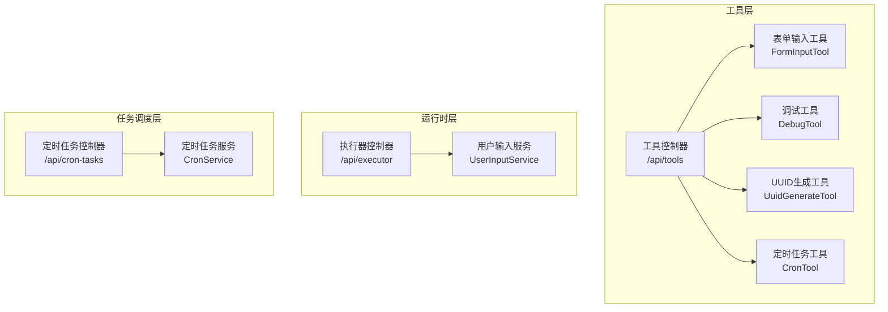
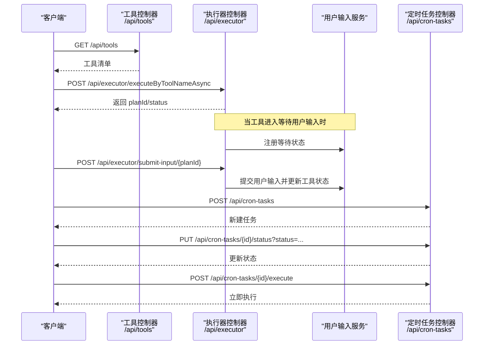
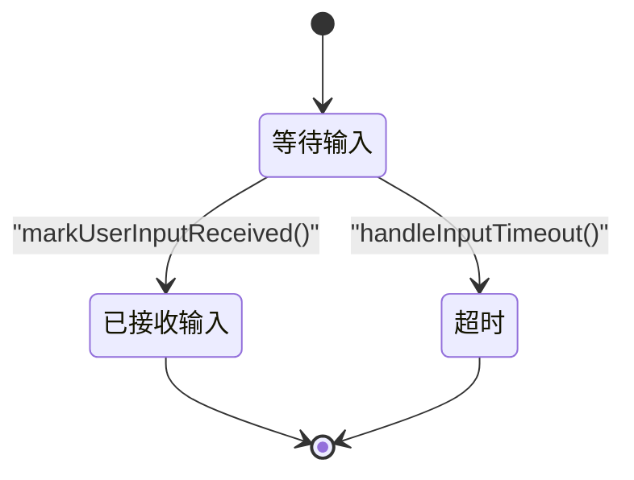
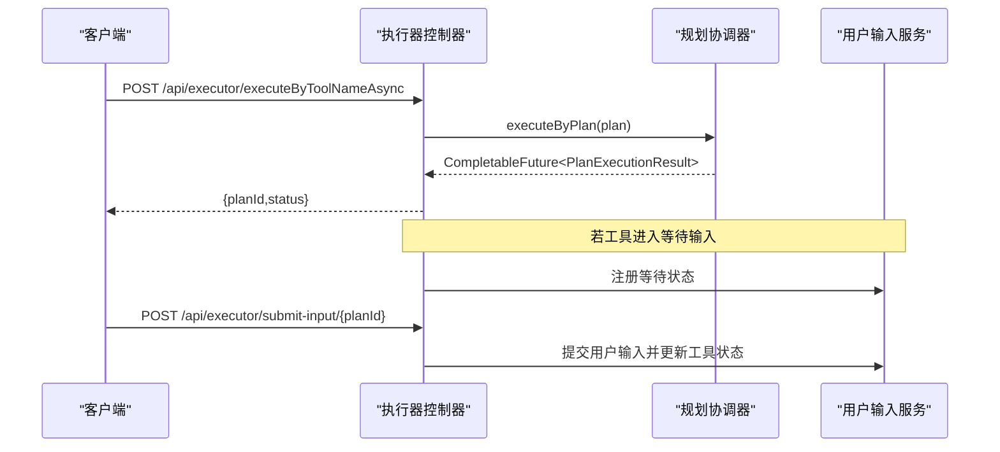
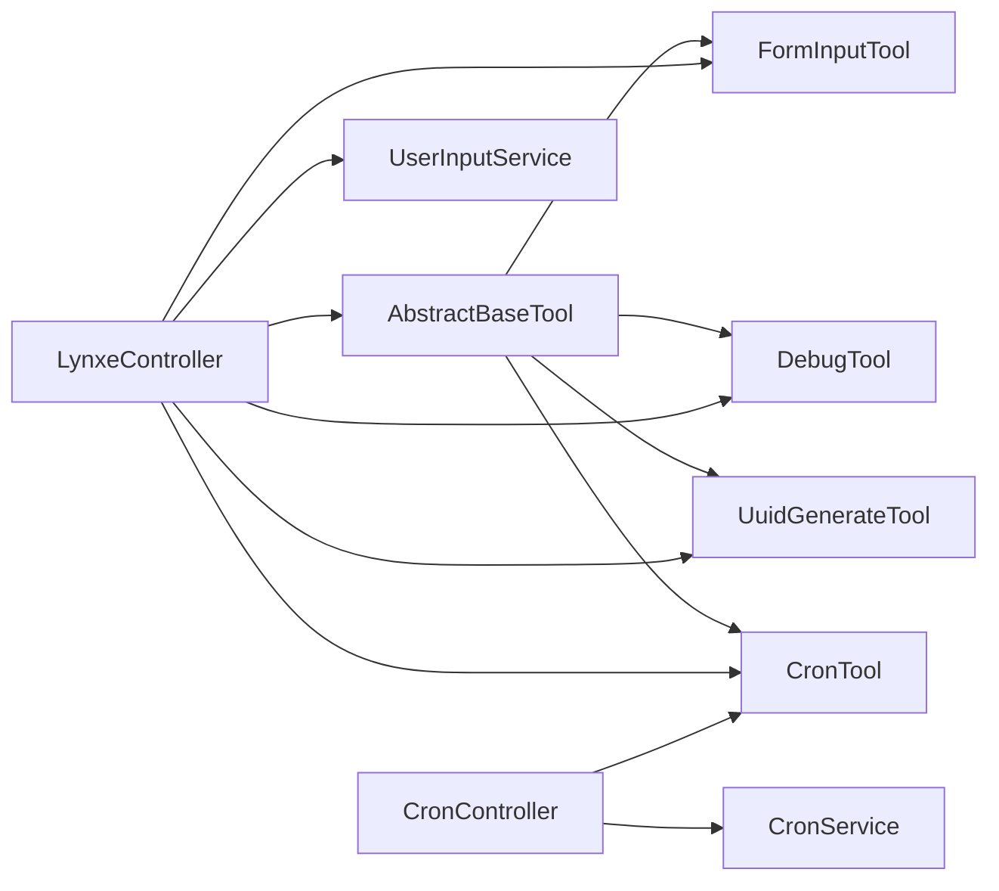

# 实用工具API

<cite>
**本文引用的文件**
- [ToolController.java](file://src/main/java/com/alibaba/cloud/ai/lynxe/tool/controller/ToolController.java)
- [CronController.java](file://src/main/java/com/alibaba/cloud/ai/lynxe/cron/controller/CronController.java)
- [FormInputTool.java](file://src/main/java/com/alibaba/cloud/ai/lynxe/tool/FormInputTool.java)
- [DebugTool.java](file://src/main/java/com/alibaba/cloud/ai/lynxe/tool/DebugTool.java)
- [UuidGenerateTool.java](file://src/main/java/com/alibaba/cloud/ai/lynxe/tool/database/UuidGenerateTool.java)
- [UuidGenerateRequest.java](file://src/main/java/com/alibaba/cloud/ai/lynxe/tool/database/UuidGenerateRequest.java)
- [CronTool.java](file://src/main/java/com/alibaba/cloud/ai/lynxe/tool/cron/CronTool.java)
- [LynxeController.java](file://src/main/java/com/alibaba/cloud/ai/lynxe/runtime/controller/LynxeController.java)
- [AbstractBaseTool.java](file://src/main/java/com/alibaba/cloud/ai/lynxe/tool/AbstractBaseTool.java)
- [CronService.java](file://src/main/java/com/alibaba/cloud/ai/lynxe/cron/service/CronService.java)
- [UserInputService.java](file://src/main/java/com/alibaba/cloud/ai/lynxe/runtime/service/UserInputService.java)
- [form-input-tool-zh.yml](file://src/main/resources/i18n/tools/form-input-tool-zh.yml)
- [README.md](file://README.md)
</cite>

## 目录
1. [简介](#简介)
2. [项目结构](#项目结构)
3. [核心组件](#核心组件)
4. [架构总览](#架构总览)
5. [详细组件分析](#详细组件分析)
6. [依赖关系分析](#依赖关系分析)
7. [性能与可靠性](#性能与可靠性)
8. [故障排查指南](#故障排查指南)
9. [结论](#结论)
10. [附录：API参考与最佳实践](#附录api参考与最佳实践)

## 简介
本文件为 Lynxe 实用工具API的权威文档，面向需要在应用中集成“定时任务、UUID生成、表单输入、系统调试”等辅助能力的开发者。文档覆盖统一的工具接口设计、端点定义、请求/响应规范、执行机制、状态管理与错误处理策略，并提供可操作的使用场景、配置选项与最佳实践。

## 项目结构
Lynxe 将“工具”抽象为可插拔的执行单元，通过统一的控制器暴露可用工具清单；同时提供运行时控制器以支持按工具名同步/异步执行计划、提交用户输入、查询执行详情等。定时任务由独立模块提供REST API，配合后端服务实现持久化与调度。

图表来源
- [ToolController.java:58-110](file://src/main/java/com/alibaba/cloud/ai/lynxe/tool/controller/ToolController.java#L58-L110)
- [LynxeController.java:194-378](file://src/main/java/com/alibaba/cloud/ai/lynxe/runtime/controller/LynxeController.java#L194-L378)
- [CronController.java:44-92](file://src/main/java/com/alibaba/cloud/ai/lynxe/cron/controller/CronController.java#L44-L92)
- [FormInputTool.java:266-290](file://src/main/java/com/alibaba/cloud/ai/lynxe/tool/FormInputTool.java#L266-L290)
- [DebugTool.java:43-64](file://src/main/java/com/alibaba/cloud/ai/lynxe/tool/DebugTool.java#L43-L64)
- [UuidGenerateTool.java:71-87](file://src/main/java/com/alibaba/cloud/ai/lynxe/tool/database/UuidGenerateTool.java#L71-L87)
- [CronTool.java:89-112](file://src/main/java/com/alibaba/cloud/ai/lynxe/tool/cron/CronTool.java#L89-L112)

章节来源
- [ToolController.java:58-110](file://src/main/java/com/alibaba/cloud/ai/lynxe/tool/controller/ToolController.java#L58-L110)
- [CronController.java:44-92](file://src/main/java/com/alibaba/cloud/ai/lynxe/cron/controller/CronController.java#L44-L92)
- [LynxeController.java:194-378](file://src/main/java/com/alibaba/cloud/ai/lynxe/runtime/controller/LynxeController.java#L194-L378)
- [FormInputTool.java:266-290](file://src/main/java/com/alibaba/cloud/ai/lynxe/tool/FormInputTool.java#L266-L290)
- [DebugTool.java:43-64](file://src/main/java/com/alibaba/cloud/ai/lynxe/tool/DebugTool.java#L43-L64)
- [UuidGenerateTool.java:71-87](file://src/main/java/com/alibaba/cloud/ai/lynxe/tool/database/UuidGenerateTool.java#L71-L87)
- [CronTool.java:89-112](file://src/main/java/com/alibaba/cloud/ai/lynxe/tool/cron/CronTool.java#L89-L112)

## 核心组件
- 工具控制器：统一返回可用工具清单，包含键名、描述、分组、可选性等元信息。
- 表单输入工具：支持多字段、多类型的交互式表单，用于收集用户输入；具备等待态、接收态、超时态的状态机。
- 调试工具：接收任意消息并直接返回，便于日志与调试。
- UUID生成工具：生成标准UUID字符串，支持参数校验与异常兜底。
- 定时任务工具：将计划描述与Cron表达式写入任务配置，返回保存后的任务信息。
- 执行器控制器：按工具名同步/异步执行计划，支持参数替换、上传文件、对话记忆、中断与恢复。
- 用户输入服务：管理表单等待状态，提交用户输入并更新工具状态。
- 定时任务控制器：提供任务的增删改查、启停、立即执行、状态变更等REST接口。
- 抽象工具基类：统一工具上下文（当前/根计划ID）、状态字符串获取与URL规范化等通用能力。

章节来源
- [ToolController.java:58-110](file://src/main/java/com/alibaba/cloud/ai/lynxe/tool/controller/ToolController.java#L58-L110)
- [FormInputTool.java:245-402](file://src/main/java/com/alibaba/cloud/ai/lynxe/tool/FormInputTool.java#L245-L402)
- [DebugTool.java:42-116](file://src/main/java/com/alibaba/cloud/ai/lynxe/tool/DebugTool.java#L42-L116)
- [UuidGenerateTool.java:71-115](file://src/main/java/com/alibaba/cloud/ai/lynxe/tool/database/UuidGenerateTool.java#L71-L115)
- [CronTool.java:89-154](file://src/main/java/com/alibaba/cloud/ai/lynxe/tool/cron/CronTool.java#L89-L154)
- [LynxeController.java:194-378](file://src/main/java/com/alibaba/cloud/ai/lynxe/runtime/controller/LynxeController.java#L194-L378)
- [UserInputService.java:52-243](file://src/main/java/com/alibaba/cloud/ai/lynxe/runtime/service/UserInputService.java#L52-L243)
- [CronController.java:44-92](file://src/main/java/com/alibaba/cloud/ai/lynxe/cron/controller/CronController.java#L44-L92)
- [AbstractBaseTool.java:56-144](file://src/main/java/com/alibaba/cloud/ai/lynxe/tool/AbstractBaseTool.java#L56-L144)

## 架构总览
下图展示从客户端到工具执行的端到端流程，包括工具发现、计划执行、用户输入提交与任务调度。

图表来源
- [ToolController.java:58-110](file://src/main/java/com/alibaba/cloud/ai/lynxe/tool/controller/ToolController.java#L58-L110)
- [LynxeController.java:230-326](file://src/main/java/com/alibaba/cloud/ai/lynxe/runtime/controller/LynxeController.java#L230-L326)
- [UserInputService.java:217-243](file://src/main/java/com/alibaba/cloud/ai/lynxe/runtime/service/UserInputService.java#L217-L243)
- [CronController.java:54-92](file://src/main/java/com/alibaba/cloud/ai/lynxe/cron/controller/CronController.java#L54-L92)

## 详细组件分析

### 工具控制器（/api/tools）
- 功能：返回所有可用工具的元信息，包含键名、名称、描述、分组、可选性等。
- 关键点：
  - 使用规划工厂构建回调上下文，提取工具函数实例并组装工具对象。
  - 前端键名采用“serviceGroup_toolName”格式，后端执行时会转换为“serviceGroup.toolName”。

章节来源
- [ToolController.java:58-110](file://src/main/java/com/alibaba/cloud/ai/lynxe/tool/controller/ToolController.java#L58-L110)

### 表单输入工具（FormInputTool）
- 功能：定义多字段表单，支持文本、数字、邮箱、密码、多行文本、选择框、单选/复选等类型；收集用户输入并维护状态机。
- 请求模型（简化）：
  - title：表单标题
  - description：表单描述（Markdown）
  - inputs：字段数组，每项含 name、label、type、required、placeholder、options
- 状态机：
  - AWAITING_USER_INPUT：等待用户输入
  - INPUT_RECEIVED：已收到输入
  - INPUT_TIMEOUT：输入超时
- 关键行为：
  - run：初始化表单并返回结构化结果，标记为“等待输入”
  - setUserFormInputValues：根据提交值更新表单项
  - markUserInputReceived：标记输入已接收
  - handleInputTimeout：超时清理并清空表单定义
  - getCurrentToolStateString：序列化当前状态（含描述与输入项）

图表来源
- [FormInputTool.java:245-342](file://src/main/java/com/alibaba/cloud/ai/lynxe/tool/FormInputTool.java#L245-L342)

章节来源
- [FormInputTool.java:266-290](file://src/main/java/com/alibaba/cloud/ai/lynxe/tool/FormInputTool.java#L266-L290)
- [FormInputTool.java:307-331](file://src/main/java/com/alibaba/cloud/ai/lynxe/tool/FormInputTool.java#L307-L331)
- [FormInputTool.java:337-342](file://src/main/java/com/alibaba/cloud/ai/lynxe/tool/FormInputTool.java#L337-L342)
- [FormInputTool.java:384-402](file://src/main/java/com/alibaba/cloud/ai/lynxe/tool/FormInputTool.java#L384-L402)
- [form-input-tool-zh.yml:4-56](file://src/main/resources/i18n/tools/form-input-tool-zh.yml#L4-L56)

### 调试工具（DebugTool）
- 功能：接收任意消息并直接返回，便于调试与日志输出。
- 请求模型（简化）：message（字符串或对象）
- 行为：解析消息，记录日志并返回结果；支持非字符串自动转字符串。

章节来源
- [DebugTool.java:43-64](file://src/main/java/com/alibaba/cloud/ai/lynxe/tool/DebugTool.java#L43-L64)
- [DebugTool.java:104-111](file://src/main/java/com/alibaba/cloud/ai/lynxe/tool/DebugTool.java#L104-L111)

### UUID生成工具（UuidGenerateTool）
- 功能：生成标准UUID v4字符串。
- 请求模型（UuidGenerateRequest）：action（仅支持“generate_uuid”）
- 行为：校验action，生成UUID并返回；异常时返回错误信息；提供状态字符串描述工具就绪状态。

章节来源
- [UuidGenerateTool.java:71-87](file://src/main/java/com/alibaba/cloud/ai/lynxe/tool/database/UuidGenerateTool.java#L71-L87)
- [UuidGenerateRequest.java:28-49](file://src/main/java/com/alibaba/cloud/ai/lynxe/tool/database/UuidGenerateRequest.java#L28-L49)
- [UuidGenerateTool.java:102-115](file://src/main/java/com/alibaba/cloud/ai/lynxe/tool/database/UuidGenerateTool.java#L102-L115)

### 定时任务工具（CronTool）
- 功能：将任务名称、Cron表达式与计划描述写入任务配置，返回保存后的任务信息。
- 请求模型（CronToolInput）：cronName、cronTime、planDesc
- 行为：构造 CronConfig 并调用服务创建任务；异常时返回错误信息；提供状态字符串描述工具可写入状态。

章节来源
- [CronTool.java:89-112](file://src/main/java/com/alibaba/cloud/ai/lynxe/tool/cron/CronTool.java#L89-L112)
- [CronTool.java:140-144](file://src/main/java/com/alibaba/cloud/ai/lynxe/tool/cron/CronTool.java#L140-L144)

### 执行器控制器（/api/executor）
- 同步执行（GET/POST）：按工具名同步执行，返回最终结果与对话ID。
- 异步执行（POST）：按工具名异步提交，返回 planId/status；支持参数替换、上传文件、请求来源识别、对话记忆。
- 提交用户输入（POST /submit-input/{planId}）：当工具处于等待输入状态时，提交表单数据并更新工具状态。
- 查询执行详情（GET /details/{planId}）：返回执行树与最后一步工具调用结果；若存在等待输入，合并等待状态。

图表来源
- [LynxeController.java:230-326](file://src/main/java/com/alibaba/cloud/ai/lynxe/runtime/controller/LynxeController.java#L230-L326)
- [LynxeController.java:476-507](file://src/main/java/com/alibaba/cloud/ai/lynxe/runtime/controller/LynxeController.java#L476-L507)
- [UserInputService.java:217-243](file://src/main/java/com/alibaba/cloud/ai/lynxe/runtime/service/UserInputService.java#L217-L243)

章节来源
- [LynxeController.java:194-378](file://src/main/java/com/alibaba/cloud/ai/lynxe/runtime/controller/LynxeController.java#L194-L378)
- [LynxeController.java:476-507](file://src/main/java/com/alibaba/cloud/ai/lynxe/runtime/controller/LynxeController.java#L476-L507)
- [LynxeController.java:387-450](file://src/main/java/com/alibaba/cloud/ai/lynxe/runtime/controller/LynxeController.java#L387-L450)

### 定时任务控制器（/api/cron-tasks）
- 获取全部任务：GET /api/cron-tasks
- 按ID获取：GET /api/cron-tasks/{id}
- 新建任务：POST /api/cron-tasks
- 更新任务：PUT /api/cron-tasks/{id}
- 更新任务状态：PUT /api/cron-tasks/{id}/status?status=...
- 立即执行：POST /api/cron-tasks/{id}/execute
- 删除任务：DELETE /api/cron-tasks/{id}

章节来源
- [CronController.java:44-92](file://src/main/java/com/alibaba/cloud/ai/lynxe/cron/controller/CronController.java#L44-L92)
- [CronService.java:22-38](file://src/main/java/com/alibaba/cloud/ai/lynxe/cron/service/CronService.java#L22-L38)

## 依赖关系分析
- 工具层依赖抽象基类提供统一上下文与状态字符串能力。
- 执行器控制器依赖规划协调器与用户输入服务，实现计划执行与输入协作。
- 定时任务控制器依赖定时任务服务，完成任务的持久化与状态变更。
- 工具控制器依赖规划工厂与MCP服务，用于工具枚举与连接清理。

图表来源
- [AbstractBaseTool.java:30-144](file://src/main/java/com/alibaba/cloud/ai/lynxe/tool/AbstractBaseTool.java#L30-L144)
- [LynxeController.java:107-156](file://src/main/java/com/alibaba/cloud/ai/lynxe/runtime/controller/LynxeController.java#L107-L156)
- [UserInputService.java:34-97](file://src/main/java/com/alibaba/cloud/ai/lynxe/runtime/service/UserInputService.java#L34-L97)
- [CronController.java:41-42](file://src/main/java/com/alibaba/cloud/ai/lynxe/cron/controller/CronController.java#L41-L42)
- [CronService.java:22-38](file://src/main/java/com/alibaba/cloud/ai/lynxe/cron/service/CronService.java#L22-L38)

## 性能与可靠性
- 工具枚举与MCP连接：工具控制器在获取工具列表后会关闭对应连接，避免资源泄漏。
- 异步执行：执行器控制器异步提交计划，返回任务ID，适合长耗时任务；完成后通过任务管理器更新状态。
- 参数替换与文件附加：执行前进行参数占位符替换，上传文件会附加到步骤需求中，减少重复传输。
- 等待输入的并发控制：用户输入服务使用独占锁与自旋等待机制，确保同一根计划下仅一个表单处于等待状态。
- 错误缓存：执行器控制器维护异常缓存，超时后抛出计划异常，保证前端可感知失败。

章节来源
- [ToolController.java:102-109](file://src/main/java/com/alibaba/cloud/ai/lynxe/tool/controller/ToolController.java#L102-L109)
- [LynxeController.java:289-303](file://src/main/java/com/alibaba/cloud/ai/lynxe/runtime/controller/LynxeController.java#L289-L303)
- [LynxeController.java:519-565](file://src/main/java/com/alibaba/cloud/ai/lynxe/runtime/controller/LynxeController.java#L519-L565)
- [UserInputService.java:52-97](file://src/main/java/com/alibaba/cloud/ai/lynxe/runtime/service/UserInputService.java#L52-L97)
- [LynxeController.java:392-398](file://src/main/java/com/alibaba/cloud/ai/lynxe/runtime/controller/LynxeController.java#L392-L398)

## 故障排查指南
- 工具不可用或返回为空：
  - 检查工具控制器是否成功获取工具回调上下文；确认MCP连接是否正常关闭。
- 表单输入未生效：
  - 确认执行器控制器返回的等待状态中 planId 是否正确；检查用户输入服务是否已注册等待状态；确认提交时使用的 planId 与等待状态一致。
- UUID生成失败：
  - 检查请求 action 是否为“generate_uuid”；查看日志中的异常堆栈并返回错误信息。
- 定时任务无法执行：
  - 确认任务状态是否为启用；检查立即执行接口返回的错误码；核对Cron表达式与计划描述。
- 同步执行长时间阻塞：
  - 切换为异步执行并轮询任务状态；检查参数替换与文件附加逻辑是否导致执行时间过长。

章节来源
- [ToolController.java:97-100](file://src/main/java/com/alibaba/cloud/ai/lynxe/tool/controller/ToolController.java#L97-L100)
- [LynxeController.java:476-507](file://src/main/java/com/alibaba/cloud/ai/lynxe/runtime/controller/LynxeController.java#L476-L507)
- [UserInputService.java:217-243](file://src/main/java/com/alibaba/cloud/ai/lynxe/runtime/service/UserInputService.java#L217-L243)
- [UuidGenerateTool.java:83-86](file://src/main/java/com/alibaba/cloud/ai/lynxe/tool/database/UuidGenerateTool.java#L83-L86)
- [CronController.java:78-81](file://src/main/java/com/alibaba/cloud/ai/lynxe/cron/controller/CronController.java#L78-L81)

## 结论
Lynxe 实用工具API通过统一的工具抽象与控制器设计，提供了稳定、可扩展的辅助能力集合。借助执行器控制器与用户输入服务，可实现从工具发现、计划执行到用户交互的完整闭环；结合定时任务控制器，满足周期性任务编排与即时触发的需求。建议在生产环境中优先采用异步执行与参数替换机制，并严格管理表单等待状态与资源清理。

## 附录：API参考与最佳实践

### 统一工具接口设计
- 工具元信息字段：
  - key：前端展示键名（serviceGroup_toolName）
  - name：工具名称
  - description：描述（含服务组后缀）
  - enabled：是否启用
  - serviceGroup：服务分组
  - selectable：是否可被前端选择

章节来源
- [ToolController.java:68-91](file://src/main/java/com/alibaba/cloud/ai/lynxe/tool/controller/ToolController.java#L68-L91)

### API端点一览
- 工具管理
  - GET /api/tools：获取可用工具清单
- 执行器
  - GET /api/executor/executeByToolNameSync/{toolName}：按工具名同步执行（GET）
  - POST /api/executor/executeByToolNameSync：按工具名同步执行（POST）
  - POST /api/executor/executeByToolNameAsync：按工具名异步执行
  - GET /api/executor/details/{planId}：查询执行详情
  - POST /api/executor/submit-input/{planId}：提交用户输入
- 定时任务
  - GET /api/cron-tasks
  - GET /api/cron-tasks/{id}
  - POST /api/cron-tasks
  - PUT /api/cron-tasks/{id}
  - PUT /api/cron-tasks/{id}/status?status=...
  - POST /api/cron-tasks/{id}/execute
  - DELETE /api/cron-tasks/{id}

章节来源
- [ToolController.java:58-110](file://src/main/java/com/alibaba/cloud/ai/lynxe/tool/controller/ToolController.java#L58-L110)
- [LynxeController.java:194-378](file://src/main/java/com/alibaba/cloud/ai/lynxe/runtime/controller/LynxeController.java#L194-L378)
- [LynxeController.java:387-507](file://src/main/java/com/alibaba/cloud/ai/lynxe/runtime/controller/LynxeController.java#L387-L507)
- [CronController.java:44-92](file://src/main/java/com/alibaba/cloud/ai/lynxe/cron/controller/CronController.java#L44-L92)

### 请求/响应规范与参数配置
- 表单输入（FormInputTool）
  - 请求体字段：title、description（Markdown）、inputs（name、label、type、required、placeholder、options）
  - 响应：结构化表单定义；等待用户输入时返回等待状态
- 调试（DebugTool）
  - 请求体字段：message（字符串或对象）
  - 响应：调试消息字符串
- UUID生成（UuidGenerateTool）
  - 请求体字段：UuidGenerateRequest.action（仅支持“generate_uuid”）
  - 响应：UUID字符串或错误信息
- 定时任务（CronTool）
  - 请求体字段：cronName、cronTime、planDesc
  - 响应：任务保存后的描述、计划描述与调度时间
- 执行器（LynxeController）
  - 同步执行：返回 {status: "completed", result, conversationId}
  - 异步执行：返回 {planId, status: "processing", message, conversationId, toolName, planTemplateId}
  - 提交输入：返回 {message, planId}
- 定时任务控制器（CronController）
  - 新建/更新/删除：返回任务对象或空内容
  - 立即执行：返回空内容（200）或错误（400）

章节来源
- [FormInputTool.java:266-290](file://src/main/java/com/alibaba/cloud/ai/lynxe/tool/FormInputTool.java#L266-L290)
- [DebugTool.java:43-64](file://src/main/java/com/alibaba/cloud/ai/lynxe/tool/DebugTool.java#L43-L64)
- [UuidGenerateTool.java:71-87](file://src/main/java/com/alibaba/cloud/ai/lynxe/tool/database/UuidGenerateTool.java#L71-L87)
- [CronTool.java:89-112](file://src/main/java/com/alibaba/cloud/ai/lynxe/tool/cron/CronTool.java#L89-L112)
- [LynxeController.java:230-326](file://src/main/java/com/alibaba/cloud/ai/lynxe/runtime/controller/LynxeController.java#L230-L326)
- [LynxeController.java:476-507](file://src/main/java/com/alibaba/cloud/ai/lynxe/runtime/controller/LynxeController.java#L476-L507)
- [CronController.java:54-92](file://src/main/java/com/alibaba/cloud/ai/lynxe/cron/controller/CronController.java#L54-L92)

### 执行机制与状态管理
- 工具执行链路：工具控制器 → 规划工厂/回调上下文 → 工具实例 → 执行器控制器 → 规划协调器 → 记录与回放
- 等待输入机制：执行器控制器在工具进入等待态时注册等待状态；用户提交后更新工具状态并继续执行
- 状态字符串：各工具提供 getCurrentToolStateStringWithErrorHandler 包装，确保状态查询不中断执行

章节来源
- [ToolController.java:65-91](file://src/main/java/com/alibaba/cloud/ai/lynxe/tool/controller/ToolController.java#L65-L91)
- [AbstractBaseTool.java:128-144](file://src/main/java/com/alibaba/cloud/ai/lynxe/tool/AbstractBaseTool.java#L128-L144)
- [UserInputService.java:203-215](file://src/main/java/com/alibaba/cloud/ai/lynxe/runtime/service/UserInputService.java#L203-L215)

### 错误处理策略
- 工具枚举：异常时返回500
- 表单提交：非法参数返回400；未知错误返回500
- UUID生成：异常返回错误信息
- 定时任务：非法参数返回400；立即执行异常返回400
- 执行器：参数替换失败抛出参数验证异常；同步执行失败返回500

章节来源
- [ToolController.java:97-100](file://src/main/java/com/alibaba/cloud/ai/lynxe/tool/controller/ToolController.java#L97-L100)
- [LynxeController.java:519-565](file://src/main/java/com/alibaba/cloud/ai/lynxe/runtime/controller/LynxeController.java#L519-L565)
- [LynxeController.java:497-506](file://src/main/java/com/alibaba/cloud/ai/lynxe/runtime/controller/LynxeController.java#L497-L506)
- [UuidGenerateTool.java:83-86](file://src/main/java/com/alibaba/cloud/ai/lynxe/tool/database/UuidGenerateTool.java#L83-L86)
- [CronController.java:78-81](file://src/main/java/com/alibaba/cloud/ai/lynxe/cron/controller/CronController.java#L78-L81)

### 使用场景与最佳实践
- 场景一：表单驱动的数据采集
  - 使用 FormInputTool 定义表单；执行器控制器返回等待状态；前端轮询或监听等待状态；用户提交后继续执行
- 场景二：调试与日志输出
  - 使用 DebugTool 输出 message；便于定位问题与记录中间状态
- 场景三：唯一标识符生成
  - 在计划中调用 UuidGenerateTool 生成全局唯一ID；支持参数校验与异常兜底
- 场景四：周期性任务编排
  - 使用 CronController 新建任务；通过状态接口启停；通过立即执行接口触发一次性任务
- 最佳实践
  - 优先使用异步执行并轮询 planId 状态
  - 对表单输入进行必填校验与类型约束
  - 对定时任务的 Cron 表达式进行有效性校验
  - 在工具执行前后清理MCP连接与临时资源

章节来源
- [LynxeController.java:230-326](file://src/main/java/com/alibaba/cloud/ai/lynxe/runtime/controller/LynxeController.java#L230-L326)
- [UserInputService.java:217-243](file://src/main/java/com/alibaba/cloud/ai/lynxe/runtime/service/UserInputService.java#L217-L243)
- [CronController.java:54-92](file://src/main/java/com/alibaba/cloud/ai/lynxe/cron/controller/CronController.java#L54-L92)
- [UuidGenerateTool.java:71-87](file://src/main/java/com/alibaba/cloud/ai/lynxe/tool/database/UuidGenerateTool.java#L71-L87)