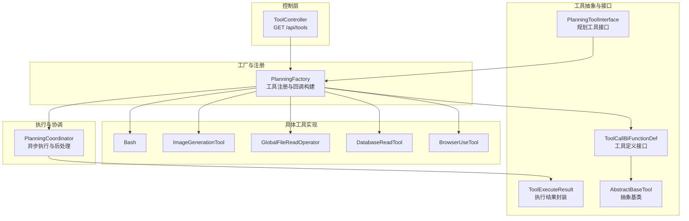
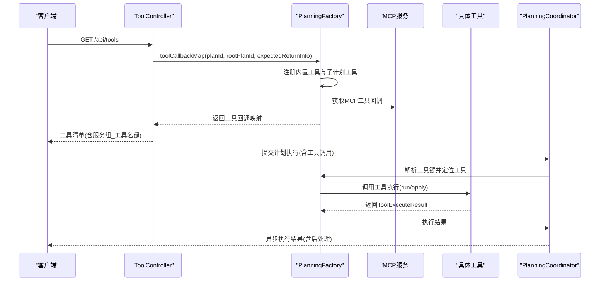
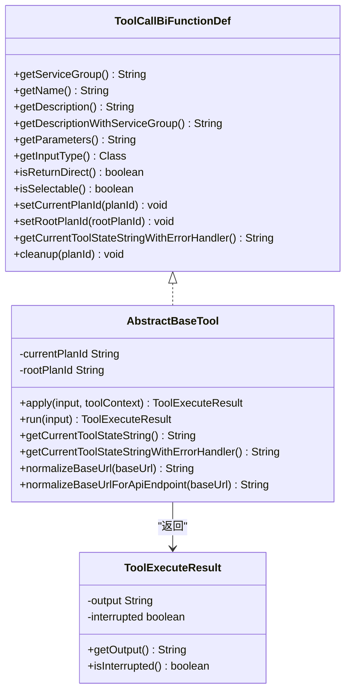
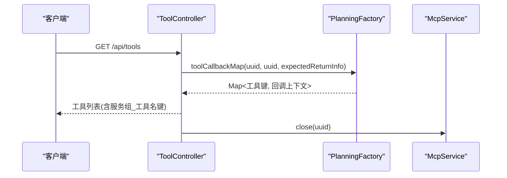
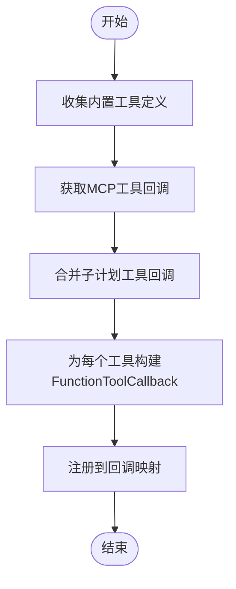
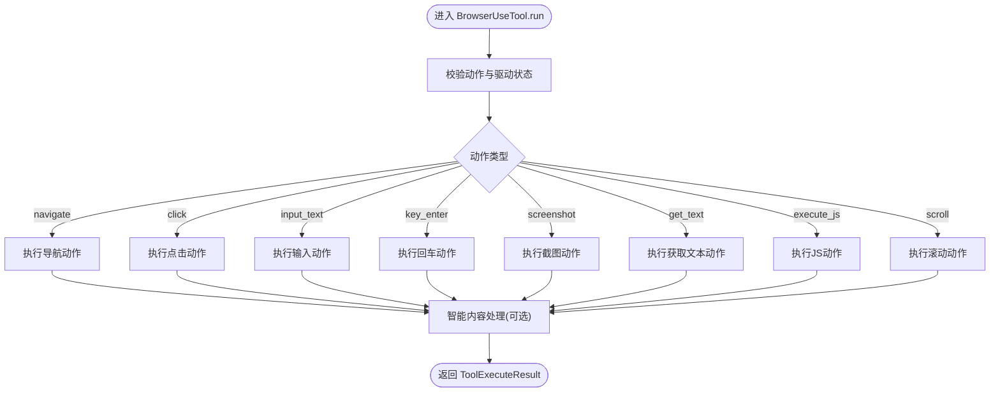
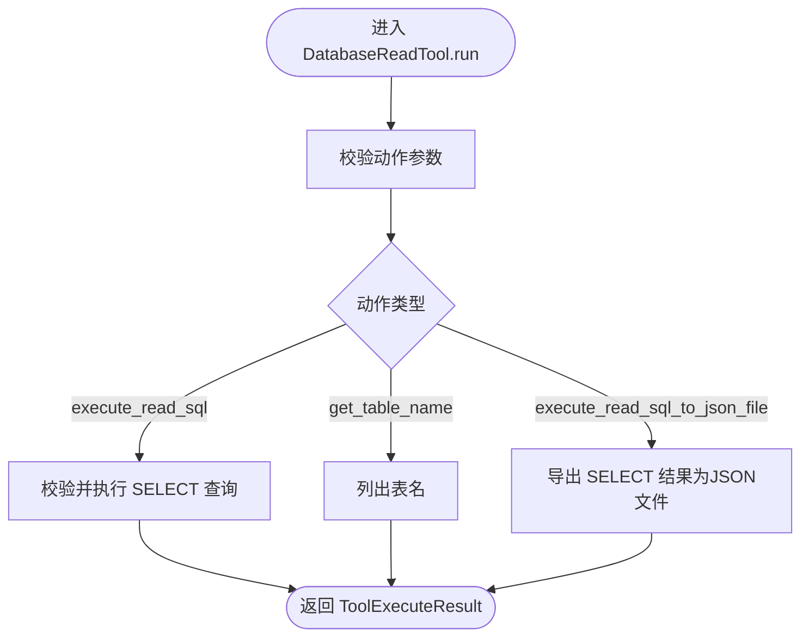
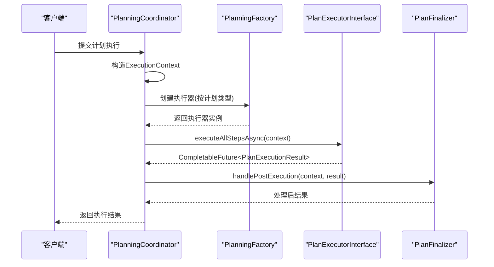
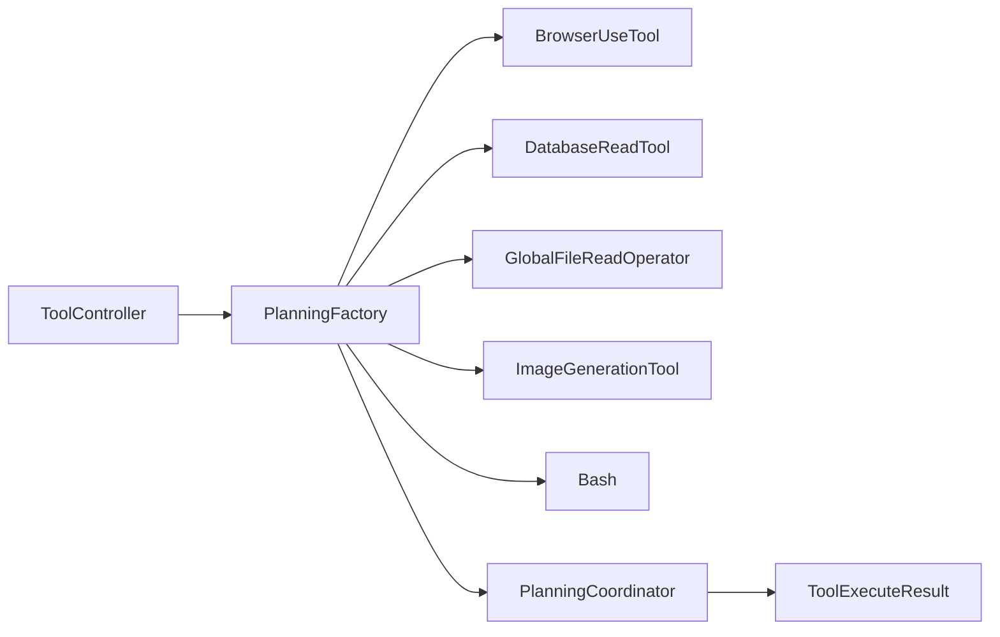

# 工具调用接口

<cite>
**本文引用的文件**   
- [ToolController.java](file://src/main/java/com/alibaba/cloud/ai/lynxe/tool/controller/ToolController.java)
- [Tool.java](file://src/main/java/com/alibaba/cloud/ai/lynxe/agent/model/Tool.java)
- [AbstractBaseTool.java](file://src/main/java/com/alibaba/cloud/ai/lynxe/tool/AbstractBaseTool.java)
- [PlanningToolInterface.java](file://src/main/java/com/alibaba/cloud/ai/lynxe/tool/PlanningToolInterface.java)
- [ToolCallBiFunctionDef.java](file://src/main/java/com/alibaba/cloud/ai/lynxe/tool/ToolCallBiFunctionDef.java)
- [PlanningFactory.java](file://src/main/java/com/alibaba/cloud/ai/lynxe/planning/PlanningFactory.java)
- [ToolExecuteResult.java](file://src/main/java/com/alibaba/cloud/ai/lynxe/tool/code/ToolExecuteResult.java)
- [BrowserUseTool.java](file://src/main/java/com/alibaba/cloud/ai/lynxe/tool/browser/BrowserUseTool.java)
- [DatabaseReadTool.java](file://src/main/java/com/alibaba/cloud/ai/lynxe/tool/database/DatabaseReadTool.java)
- [GlobalFileReadOperator.java](file://src/main/java/com/alibaba/cloud/ai/lynxe/tool/textOperator/GlobalFileReadOperator.java)
- [ImageGenerationTool.java](file://src/main/java/com/alibaba/cloud/ai/lynxe/tool/image/ImageGenerationTool.java)
- [Bash.java](file://src/main/java/com/alibaba/cloud/ai/lynxe/tool/bash/Bash.java)
- [PlanningCoordinator.java](file://src/main/java/com/alibaba/cloud/ai/lynxe/runtime/service/PlanningCoordinator.java)
- [application.yml](file://src/main/resources/application.yml)
</cite>

## 目录
1. [简介](#简介)
2. [项目结构](#项目结构)
3. [核心组件](#核心组件)
4. [架构总览](#架构总览)
5. [详细组件分析](#详细组件分析)
6. [依赖分析](#依赖分析)
7. [性能考虑](#性能考虑)
8. [故障排查指南](#故障排查指南)
9. [结论](#结论)
10. [附录](#附录)

## 简介
本文件为 Lynxe 工具调用接口的全面 API 文档，聚焦“统一工具接口设计”与“工具生命周期管理”。内容涵盖：
- 工具注册与发现：通过统一工厂集中注册各类工具，生成可被 LLM 调用的函数式工具回调。
- 参数传递与校验：工具输入参数的定义、Schema 校验与执行前验证。
- 执行结果返回：标准化的执行结果封装，支持中断标记与智能内容保存。
- 工具类型与端点：浏览器工具、文件处理工具、数据库工具、代码执行工具等。
- 生命周期管理：异步执行、上下文绑定、资源清理与错误恢复。
- 权限控制、资源限制与并发处理：基于计划 ID 的隔离、工作目录限制、线程池与执行器池化。
- 示例与最佳实践：请求格式、参数规范、响应结构与调用建议。

## 项目结构
围绕工具调用的核心模块包括：
- 控制层：提供工具清单查询端点。
- 工具抽象与接口：统一工具定义、参数 Schema、执行回调与状态描述。
- 工厂注册：集中注册内置工具与外部 MCP 工具，构建函数式工具回调映射。
- 执行协调：根据计划类型选择执行器，异步执行并后处理。
- 具体工具实现：浏览器、数据库、文件、图像生成、命令行等。

图表来源
- [ToolController.java:58-110](file://src/main/java/com/alibaba/cloud/ai/lynxe/tool/controller/ToolController.java#L58-L110)
- [PlanningFactory.java:261-393](file://src/main/java/com/alibaba/cloud/ai/lynxe/planning/PlanningFactory.java#L261-L393)
- [PlanningCoordinator.java:76-179](file://src/main/java/com/alibaba/cloud/ai/lynxe/runtime/service/PlanningCoordinator.java#L76-L179)

章节来源
- [ToolController.java:58-110](file://src/main/java/com/alibaba/cloud/ai/lynxe/tool/controller/ToolController.java#L58-L110)
- [PlanningFactory.java:261-393](file://src/main/java/com/alibaba/cloud/ai/lynxe/planning/PlanningFactory.java#L261-L393)
- [PlanningCoordinator.java:76-179](file://src/main/java/com/alibaba/cloud/ai/lynxe/runtime/service/PlanningCoordinator.java#L76-L179)

## 核心组件
- 统一工具接口与抽象基类
  - 工具接口定义了服务组、名称、描述、参数 Schema、输入类型、是否直接返回、可否选择、当前/根计划 ID 绑定、状态字符串与清理方法。
  - 抽象基类提供默认执行入口、状态字符串容错处理、URL 规范化等通用能力。
- 工具模型
  - 前端展示模型包含键、名称、描述、启用状态、服务组与可选性字段。
- 工具执行结果
  - 封装输出内容与中断标记，便于上层判断执行状态。
- 工具注册与回调
  - 工厂集中注册内置工具与 MCP 工具，构建函数式工具回调映射，使用“服务组_工具名”的唯一键供 LLM 调用。

章节来源
- [ToolCallBiFunctionDef.java:29-106](file://src/main/java/com/alibaba/cloud/ai/lynxe/tool/ToolCallBiFunctionDef.java#L29-L106)
- [AbstractBaseTool.java:30-192](file://src/main/java/com/alibaba/cloud/ai/lynxe/tool/AbstractBaseTool.java#L30-L192)
- [Tool.java:18-81](file://src/main/java/com/alibaba/cloud/ai/lynxe/agent/model/Tool.java#L18-L81)
- [ToolExecuteResult.java:18-59](file://src/main/java/com/alibaba/cloud/ai/lynxe/tool/code/ToolExecuteResult.java#L18-L59)
- [PlanningFactory.java:240-393](file://src/main/java/com/alibaba/cloud/ai/lynxe/planning/PlanningFactory.java#L240-L393)

## 架构总览
工具调用的统一接口由“控制器—工厂—工具—执行器—结果”链路构成。控制器负责暴露工具清单；工厂负责注册与构建工具回调；具体工具实现执行业务逻辑；执行器负责异步调度与后处理；结果以统一对象返回。

图表来源
- [ToolController.java:58-110](file://src/main/java/com/alibaba/cloud/ai/lynxe/tool/controller/ToolController.java#L58-L110)
- [PlanningFactory.java:261-393](file://src/main/java/com/alibaba/cloud/ai/lynxe/planning/PlanningFactory.java#L261-L393)
- [PlanningCoordinator.java:76-179](file://src/main/java/com/alibaba/cloud/ai/lynxe/runtime/service/PlanningCoordinator.java#L76-L179)

## 详细组件分析

### 统一工具接口与抽象基类
- 接口职责
  - 定义工具元信息：服务组、名称、描述、参数 Schema、输入类型、是否直接返回、可否选择。
  - 绑定执行上下文：当前计划 ID 与根计划 ID。
  - 统一执行入口：BiFunction 输入与 ToolContext，返回 ToolExecuteResult。
  - 清理资源：按计划 ID 清理相关资源。
- 抽象基类增强
  - 默认执行入口委托到 run 方法，便于子类覆盖。
  - 状态字符串容错：在获取状态失败时返回友好提示，不中断流程。
  - URL 规范化：避免重复路径段，适配不同 API 前缀。

图表来源
- [ToolCallBiFunctionDef.java:29-106](file://src/main/java/com/alibaba/cloud/ai/lynxe/tool/ToolCallBiFunctionDef.java#L29-L106)
- [AbstractBaseTool.java:30-192](file://src/main/java/com/alibaba/cloud/ai/lynxe/tool/AbstractBaseTool.java#L30-L192)
- [ToolExecuteResult.java:18-59](file://src/main/java/com/alibaba/cloud/ai/lynxe/tool/code/ToolExecuteResult.java#L18-L59)

章节来源
- [ToolCallBiFunctionDef.java:29-106](file://src/main/java/com/alibaba/cloud/ai/lynxe/tool/ToolCallBiFunctionDef.java#L29-L106)
- [AbstractBaseTool.java:30-192](file://src/main/java/com/alibaba/cloud/ai/lynxe/tool/AbstractBaseTool.java#L30-L192)
- [ToolExecuteResult.java:18-59](file://src/main/java/com/alibaba/cloud/ai/lynxe/tool/code/ToolExecuteResult.java#L18-L59)

### 工具控制器与工具清单
- 端点：GET /api/tools
- 行为：通过工厂生成工具回调映射，提取工具键、名称、描述、服务组与可选性，返回给前端。
- 资源清理：调用完成后关闭对应 MCP 连接，避免资源泄漏。

图表来源
- [ToolController.java:58-110](file://src/main/java/com/alibaba/cloud/ai/lynxe/tool/controller/ToolController.java#L58-L110)
- [PlanningFactory.java:261-393](file://src/main/java/com/alibaba/cloud/ai/lynxe/planning/PlanningFactory.java#L261-L393)

章节来源
- [ToolController.java:58-110](file://src/main/java/com/alibaba/cloud/ai/lynxe/tool/controller/ToolController.java#L58-L110)

### 工具注册与回调构建
- 内置工具注册：浏览器、数据库读写、文件读写、并行执行、定时任务、Markdown 转换、图像生成、命令行等。
- MCP 工具注册：从 MCP 服务获取回调，包装为工具定义并注册。
- 子计划工具注册：通过子计划服务创建回调并合并。
- 函数式回调构建：为每个工具构建 FunctionToolCallback，设置描述、参数 Schema、输入类型与返回策略。

图表来源
- [PlanningFactory.java:261-393](file://src/main/java/com/alibaba/cloud/ai/lynxe/planning/PlanningFactory.java#L261-L393)

章节来源
- [PlanningFactory.java:261-393](file://src/main/java/com/alibaba/cloud/ai/lynxe/planning/PlanningFactory.java#L261-L393)

### 浏览器工具（BrowserUseTool）
- 功能：导航、点击、输入、回车、截图、获取文本、执行 JS、滚动等。
- 安全与稳定性：驱动可用性与连接检查、页面有效性检查、超时配置、内容智能处理（长输出截断或归档）。
- 错误处理：参数缺失、驱动异常、浏览器未连接、页面不可用等情况返回明确错误信息。

图表来源
- [BrowserUseTool.java:113-200](file://src/main/java/com/alibaba/cloud/ai/lynxe/tool/browser/BrowserUseTool.java#L113-L200)

章节来源
- [BrowserUseTool.java:113-200](file://src/main/java/com/alibaba/cloud/ai/lynxe/tool/browser/BrowserUseTool.java#L113-L200)

### 数据库工具（DatabaseReadTool）
- 功能：只读 SQL 执行、表名查询、SQL 结果导出为 JSON 文件。
- 安全约束：只允许 SELECT 查询；非法操作返回明确错误。
- 状态：可输出当前可用数据源信息，便于诊断。

图表来源
- [DatabaseReadTool.java:87-120](file://src/main/java/com/alibaba/cloud/ai/lynxe/tool/database/DatabaseReadTool.java#L87-L120)

章节来源
- [DatabaseReadTool.java:87-120](file://src/main/java/com/alibaba/cloud/ai/lynxe/tool/database/DatabaseReadTool.java#L87-L120)

### 文件处理工具（GlobalFileReadOperator）
- 功能：全局文件读取、词数统计；支持偏移与限制；可绕过限制。
- 安全与限制：对全量读取设置行数上限；路径参数优先级与必填校验。
- 输出：JSON 格式或智能内容处理后的结果。

章节来源
- [GlobalFileReadOperator.java:151-200](file://src/main/java/com/alibaba/cloud/ai/lynxe/tool/textOperator/GlobalFileReadOperator.java#L151-L200)

### 图像生成工具（ImageGenerationTool）
- 功能：多提供商适配、模型配置解析、直连 Google API 支持。
- 参数校验：提示词必填、模型存在性与支持性检查。
- 错误增强：对异常进行增强错误消息构建，提升可诊断性。

章节来源
- [ImageGenerationTool.java:94-164](file://src/main/java/com/alibaba/cloud/ai/lynxe/tool/image/ImageGenerationTool.java#L94-L164)

### 命令行工具（Bash）
- 功能：跨平台命令执行；工作目录限定为根计划目录；路径访问安全校验。
- 安全：禁止绝对路径逃逸；cd 等命令路径合法性检查。
- 输出：通过智能内容保存服务处理大输出，必要时返回 JSON 包裹。

章节来源
- [Bash.java:93-163](file://src/main/java/com/alibaba/cloud/ai/lynxe/tool/bash/Bash.java#L93-L163)

### 执行协调与生命周期
- 异步执行：根据计划类型选择执行器，提交异步执行任务。
- 上下文绑定：设置标题、当前/根计划 ID、父计划 ID、工具调用 ID、上传键、会话 ID 等。
- 后处理：执行完成进行收尾处理（如摘要生成、内存管理等）。

图表来源
- [PlanningCoordinator.java:76-179](file://src/main/java/com/alibaba/cloud/ai/lynxe/runtime/service/PlanningCoordinator.java#L76-L179)

章节来源
- [PlanningCoordinator.java:76-179](file://src/main/java/com/alibaba/cloud/ai/lynxe/runtime/service/PlanningCoordinator.java#L76-L179)

## 依赖分析
- 控制器依赖工厂与 MCP 服务，用于生成工具清单与清理资源。
- 工厂聚合多种工具与服务（文件系统、数据库、Excel、图像生成等），并通过函数式回调对外暴露。
- 执行协调器依赖工厂与执行器工厂，负责异步调度与后处理。
- 工具实现依赖抽象基类与通用服务（智能内容保存、国际化、短链等）。

图表来源
- [ToolController.java:48-52](file://src/main/java/com/alibaba/cloud/ai/lynxe/tool/controller/ToolController.java#L48-L52)
- [PlanningFactory.java:261-393](file://src/main/java/com/alibaba/cloud/ai/lynxe/planning/PlanningFactory.java#L261-L393)
- [PlanningCoordinator.java:52-57](file://src/main/java/com/alibaba/cloud/ai/lynxe/runtime/service/PlanningCoordinator.java#L52-L57)

章节来源
- [ToolController.java:48-52](file://src/main/java/com/alibaba/cloud/ai/lynxe/tool/controller/ToolController.java#L48-L52)
- [PlanningFactory.java:261-393](file://src/main/java/com/alibaba/cloud/ai/lynxe/planning/PlanningFactory.java#L261-L393)
- [PlanningCoordinator.java:52-57](file://src/main/java/com/alibaba/cloud/ai/lynxe/runtime/service/PlanningCoordinator.java#L52-L57)

## 性能考虑
- 超时配置：REST 客户端连接、响应与连接请求超时均为分钟级，适合长耗时工具。
- 并发与资源池：提供基于级别的执行器池与图片识别执行池，支持并行任务与资源隔离。
- 输出优化：智能内容保存服务对长输出进行截断或归档，降低内存与传输压力。
- 文件上传：配置了较大的文件与请求体积限制，满足大文件场景。

章节来源
- [PlanningFactory.java:397-414](file://src/main/java/com/alibaba/cloud/ai/lynxe/planning/PlanningFactory.java#L397-L414)
- [application.yml:14-19](file://src/main/resources/application.yml#L14-L19)
- [application.yml:78-87](file://src/main/resources/application.yml#L78-L87)

## 故障排查指南
- 工具清单为空
  - 检查工厂初始化标志与 ChromeDriver 服务可用性；确认工具注册日志。
  - 关闭 MCP 连接失败仅记录告警，不影响工具清单返回。
- 浏览器工具异常
  - 驱动不可用、浏览器未连接、当前页面无效均会返回明确错误；检查浏览器服务与页面状态。
- 数据库工具异常
  - 非 SELECT 查询会被拒绝；SQL 执行异常会返回错误信息；检查数据源配置与权限。
- 文件读取异常
  - 缺少路径参数、超出行数限制、路径非法等情况会返回错误；确认参数与访问范围。
- 命令行工具异常
  - 路径校验失败会阻止执行；错误信息通过智能内容保存服务处理后再返回。
- 图像生成异常
  - 模型配置缺失、提供商不支持、API Key 缺失等会返回增强错误信息；检查模型与密钥配置。

章节来源
- [ToolController.java:97-109](file://src/main/java/com/alibaba/cloud/ai/lynxe/tool/controller/ToolController.java#L97-L109)
- [BrowserUseTool.java:127-148](file://src/main/java/com/alibaba/cloud/ai/lynxe/tool/browser/BrowserUseTool.java#L127-L148)
- [DatabaseReadTool.java:91-119](file://src/main/java/com/alibaba/cloud/ai/lynxe/tool/database/DatabaseReadTool.java#L91-L119)
- [GlobalFileReadOperator.java:166-171](file://src/main/java/com/alibaba/cloud/ai/lynxe/tool/textOperator/GlobalFileReadOperator.java#L166-L171)
- [Bash.java:100-115](file://src/main/java/com/alibaba/cloud/ai/lynxe/tool/bash/Bash.java#L100-L115)
- [ImageGenerationTool.java:103-118](file://src/main/java/com/alibaba/cloud/ai/lynxe/tool/image/ImageGenerationTool.java#L103-L118)

## 结论
Lynxe 通过统一的工具接口与工厂注册机制，实现了工具的标准化、可扩展与可治理。结合异步执行、资源限制与错误恢复机制，能够稳定支撑浏览器、数据库、文件、图像生成与命令行等多种工具类型的调用。建议在生产环境中配合严格的参数校验、资源池配置与监控告警，确保工具调用的安全与高效。

## 附录

### API 端点一览
- GET /api/tools
  - 功能：获取可用工具清单
  - 请求：无
  - 响应：工具数组，包含键、名称、描述、启用状态、服务组与可选性
  - 状态码：200 成功；500 内部错误

章节来源
- [ToolController.java:58-110](file://src/main/java/com/alibaba/cloud/ai/lynxe/tool/controller/ToolController.java#L58-L110)

### 工具类型与参数要点
- 浏览器工具（服务组：空或特定值）
  - 动作：navigate、click、input_text、key_enter、screenshot、get_text、execute_js、scroll
  - 参数：动作必填；部分动作需要元素定位或文本内容
  - 结果：文本或截图；长输出经智能处理
- 数据库工具（服务组：database-service-group）
  - 动作：execute_read_sql、get_table_name、execute_read_sql_to_json_file
  - 参数：SQL 必填；只允许 SELECT 查询
  - 结果：查询结果或文件链接
- 文件工具（服务组：默认）
  - 动作：read、count_words
  - 参数：路径必填；支持偏移与限制
  - 结果：文本内容或统计结果
- 图像生成工具（服务组：default-service-group）
  - 参数：提示词必填；模型、尺寸、质量、数量等可选
  - 结果：图像 URL 或数据
- 命令行工具（服务组：默认）
  - 参数：命令必填；路径访问受限于根计划目录
  - 结果：命令输出；异常信息经智能处理

章节来源
- [BrowserUseTool.java:152-200](file://src/main/java/com/alibaba/cloud/ai/lynxe/tool/browser/BrowserUseTool.java#L152-L200)
- [DatabaseReadTool.java:94-114](file://src/main/java/com/alibaba/cloud/ai/lynxe/tool/database/DatabaseReadTool.java#L94-L114)
- [GlobalFileReadOperator.java:173-183](file://src/main/java/com/alibaba/cloud/ai/lynxe/tool/textOperator/GlobalFileReadOperator.java#L173-L183)
- [ImageGenerationTool.java:94-164](file://src/main/java/com/alibaba/cloud/ai/lynxe/tool/image/ImageGenerationTool.java#L94-L164)
- [Bash.java:93-163](file://src/main/java/com/alibaba/cloud/ai/lynxe/tool/bash/Bash.java#L93-L163)

### 请求与响应规范
- 请求格式
  - 工具清单：GET /api/tools
  - 工具调用：由 LLM 通过函数式工具回调触发，参数遵循各工具的 JSON Schema
- 参数验证规则
  - 必填参数缺失：返回明确错误信息
  - 动作非法：返回未知动作错误
  - 越权或越界：如数据库非 SELECT、命令路径逃逸等，返回拒绝与指导信息
- 响应数据结构
  - 工具清单：数组，每项包含键、名称、描述、启用状态、服务组与可选性
  - 执行结果：包含输出内容与中断标记；异常时输出增强错误信息

章节来源
- [ToolController.java:58-110](file://src/main/java/com/alibaba/cloud/ai/lynxe/tool/controller/ToolController.java#L58-L110)
- [ToolExecuteResult.java:18-59](file://src/main/java/com/alibaba/cloud/ai/lynxe/tool/code/ToolExecuteResult.java#L18-L59)

### 生命周期管理与最佳实践
- 生命周期
  - 注册阶段：工厂构建函数式回调，使用“服务组_工具名”键
  - 执行阶段：绑定当前/根计划 ID，执行工具逻辑，返回结果
  - 清理阶段：按计划 ID 清理资源；控制器关闭 MCP 连接
  - 异步阶段：执行器异步执行，后处理汇总结果
- 最佳实践
  - 明确动作与参数：严格遵循各工具的参数 Schema
  - 控制输出规模：利用智能内容保存服务处理大输出
  - 安全访问：命令行与文件工具严格限制工作目录与路径
  - 错误恢复：捕获异常并返回可诊断信息，避免中断流程

章节来源
- [PlanningFactory.java:341-377](file://src/main/java/com/alibaba/cloud/ai/lynxe/planning/PlanningFactory.java#L341-L377)
- [AbstractBaseTool.java:128-144](file://src/main/java/com/alibaba/cloud/ai/lynxe/tool/AbstractBaseTool.java#L128-L144)
- [PlanningCoordinator.java:76-179](file://src/main/java/com/alibaba/cloud/ai/lynxe/runtime/service/PlanningCoordinator.java#L76-L179)