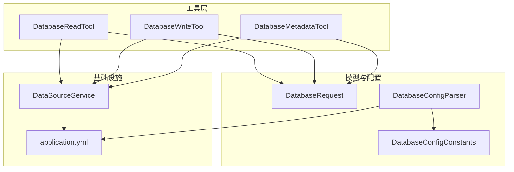
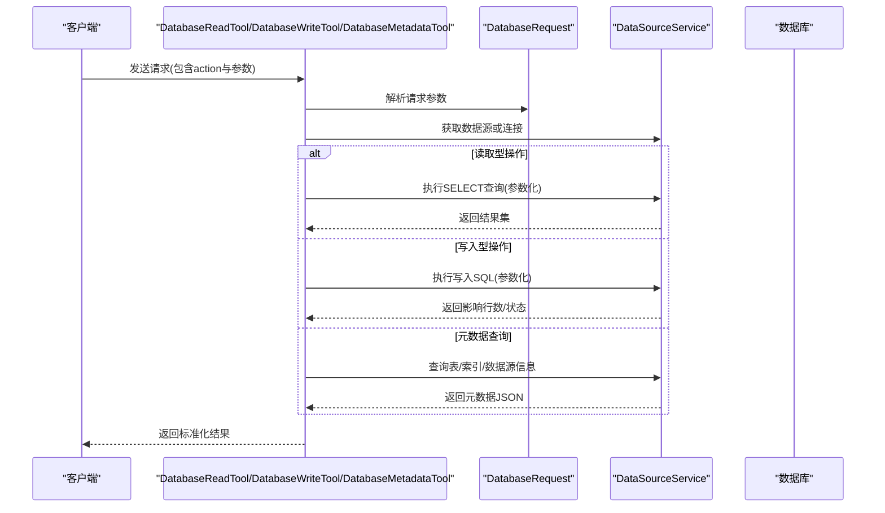
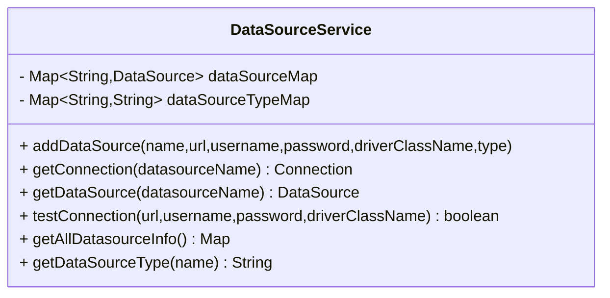
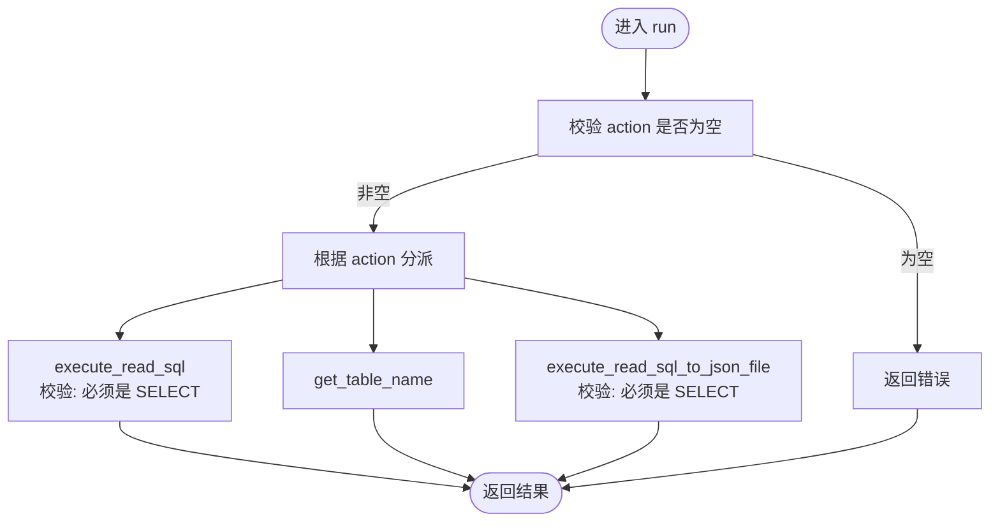
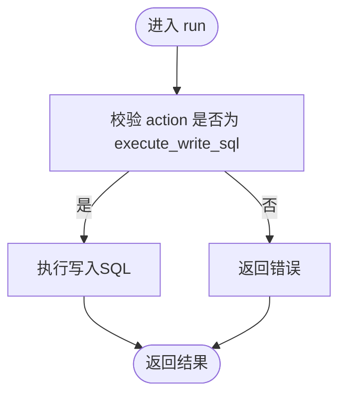
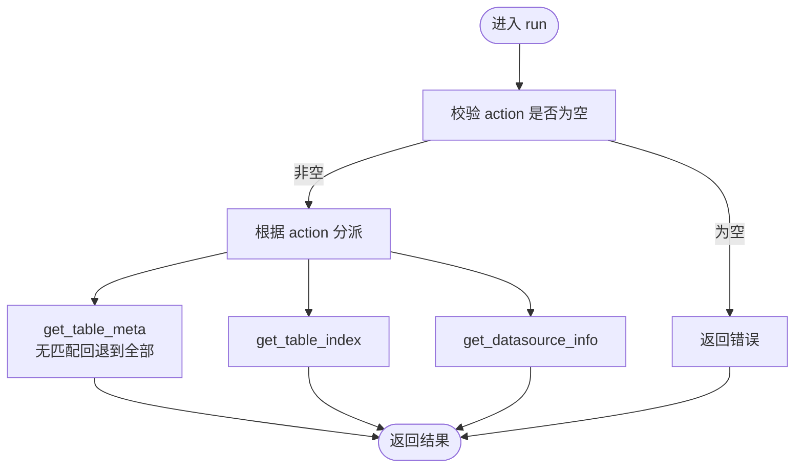
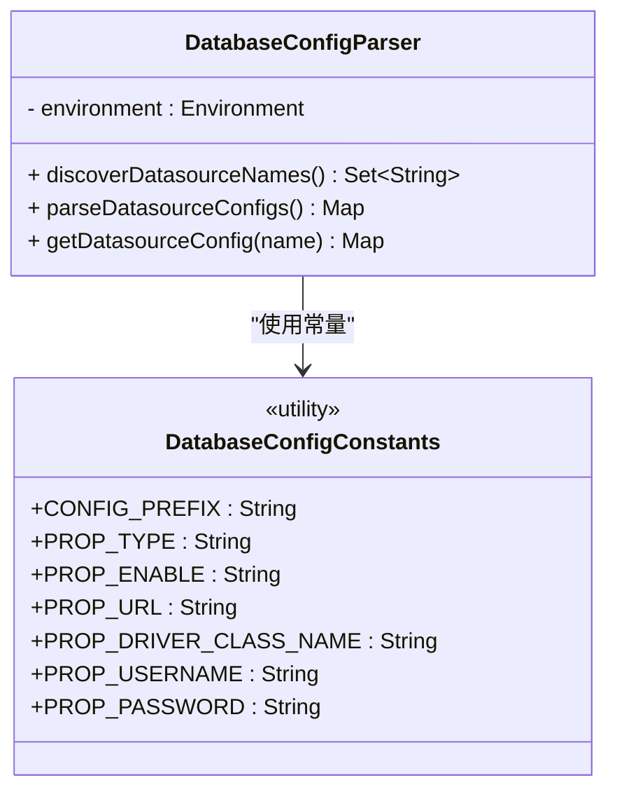
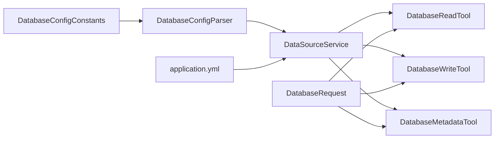

# 数据库工具API

<cite>
**本文引用的文件**
- [DataSourceService.java](file://src/main/java/com/alibaba/cloud/ai/lynxe/tool/database/DataSourceService.java)
- [DatabaseReadTool.java](file://src/main/java/com/alibaba/cloud/ai/lynxe/tool/database/DatabaseReadTool.java)
- [DatabaseWriteTool.java](file://src/main/java/com/alibaba/cloud/ai/lynxe/tool/database/DatabaseWriteTool.java)
- [DatabaseMetadataTool.java](file://src/main/java/com/alibaba/cloud/ai/lynxe/tool/database/DatabaseMetadataTool.java)
- [DatabaseRequest.java](file://src/main/java/com/alibaba/cloud/ai/lynxe/tool/database/DatabaseRequest.java)
- [DatabaseConfigConstants.java](file://src/main/java/com/alibaba/cloud/ai/lynxe/tool/database/DatabaseConfigConstants.java)
- [DatabaseConfigParser.java](file://src/main/java/com/alibaba/cloud/ai/lynxe/tool/database/DatabaseConfigParser.java)
- [application.yml](file://src/main/resources/application.yml)
</cite>

## 目录
1. [简介](#简介)
2. [项目结构](#项目结构)
3. [核心组件](#核心组件)
4. [架构总览](#架构总览)
5. [详细组件分析](#详细组件分析)
6. [依赖分析](#依赖分析)
7. [性能考虑](#性能考虑)
8. [故障排查指南](#故障排查指南)
9. [结论](#结论)
10. [附录](#附录)

## 简介
本文件面向Lynxe数据库工具API，提供统一的数据库连接管理、SQL执行与元数据查询接口的设计说明与使用指南。系统通过“工具”模式对外暴露能力，支持：
- 读取型操作：仅允许SELECT的SQL执行、表名查询、结果导出为JSON文件等
- 写入型操作：执行任意写入SQL（如INSERT/UPDATE/DELETE/TRUNCATE/DDL等）
- 元数据查询：表结构信息、索引信息、数据源信息等
- 多数据源管理：动态发现与注册多个数据源，按名称选择目标数据源
- 安全与合规：读写分离策略、只允许SELECT的读取模式、参数化查询支持

## 项目结构
数据库工具位于后端模块的工具包中，采用“工具+服务”的分层设计：
- 工具层：DatabaseReadTool、DatabaseWriteTool、DatabaseMetadataTool
- 请求模型：DatabaseRequest
- 连接与配置：DataSourceService、DatabaseConfigConstants、DatabaseConfigParser
- 应用配置：application.yml（含Hikari连接池配置）

图表来源
- [DatabaseReadTool.java:1-166](file://src/main/java/com/alibaba/cloud/ai/lynxe/tool/database/DatabaseReadTool.java#L1-L166)
- [DatabaseWriteTool.java:1-142](file://src/main/java/com/alibaba/cloud/ai/lynxe/tool/database/DatabaseWriteTool.java#L1-L142)
- [DatabaseMetadataTool.java:1-188](file://src/main/java/com/alibaba/cloud/ai/lynxe/tool/database/DatabaseMetadataTool.java#L1-L188)
- [DatabaseRequest.java:1-202](file://src/main/java/com/alibaba/cloud/ai/lynxe/tool/database/DatabaseRequest.java#L1-L202)
- [DatabaseConfigConstants.java:1-50](file://src/main/java/com/alibaba/cloud/ai/lynxe/tool/database/DatabaseConfigConstants.java#L1-L50)
- [DatabaseConfigParser.java:1-194](file://src/main/java/com/alibaba/cloud/ai/lynxe/tool/database/DatabaseConfigParser.java#L1-L194)
- [application.yml:1-97](file://src/main/resources/application.yml#L1-L97)

章节来源
- [DatabaseReadTool.java:1-166](file://src/main/java/com/alibaba/cloud/ai/lynxe/tool/database/DatabaseReadTool.java#L1-L166)
- [DatabaseWriteTool.java:1-142](file://src/main/java/com/alibaba/cloud/ai/lynxe/tool/database/DatabaseWriteTool.java#L1-L142)
- [DatabaseMetadataTool.java:1-188](file://src/main/java/com/alibaba/cloud/ai/lynxe/tool/database/DatabaseMetadataTool.java#L1-L188)
- [DatabaseRequest.java:1-202](file://src/main/java/com/alibaba/cloud/ai/lynxe/tool/database/DatabaseRequest.java#L1-L202)
- [DatabaseConfigConstants.java:1-50](file://src/main/java/com/alibaba/cloud/ai/lynxe/tool/database/DatabaseConfigConstants.java#L1-L50)
- [DatabaseConfigParser.java:1-194](file://src/main/java/com/alibaba/cloud/ai/lynxe/tool/database/DatabaseConfigParser.java#L1-L194)
- [application.yml:1-97](file://src/main/resources/application.yml#L1-L97)

## 核心组件
- 数据源服务：DataSourceService
  - 提供多数据源注册、按名称获取连接、测试连接、统计信息等能力
  - 支持类型标记与默认数据源选择
- 读取工具：DatabaseReadTool
  - 仅允许SELECT语句；支持将结果导出为JSON文件
- 写入工具：DatabaseWriteTool
  - 执行任意写入SQL；严格区分读写场景
- 元数据工具：DatabaseMetadataTool
  - 查询表元数据、索引、数据源信息；具备回退逻辑（无匹配时返回全部）
- 请求模型：DatabaseRequest
  - 统一承载action、query、text、datasourceName、parameters、fileName等字段
- 配置常量与解析器：DatabaseConfigConstants、DatabaseConfigParser
  - 基于环境变量动态发现数据源配置并解析
- 应用配置：application.yml
  - Hikari连接池参数、JPA设置、日志级别等

章节来源
- [DataSourceService.java:1-215](file://src/main/java/com/alibaba/cloud/ai/lynxe/tool/database/DataSourceService.java#L1-L215)
- [DatabaseReadTool.java:1-166](file://src/main/java/com/alibaba/cloud/ai/lynxe/tool/database/DatabaseReadTool.java#L1-L166)
- [DatabaseWriteTool.java:1-142](file://src/main/java/com/alibaba/cloud/ai/lynxe/tool/database/DatabaseWriteTool.java#L1-L142)
- [DatabaseMetadataTool.java:1-188](file://src/main/java/com/alibaba/cloud/ai/lynxe/tool/database/DatabaseMetadataTool.java#L1-L188)
- [DatabaseRequest.java:1-202](file://src/main/java/com/alibaba/cloud/ai/lynxe/tool/database/DatabaseRequest.java#L1-L202)
- [DatabaseConfigConstants.java:1-50](file://src/main/java/com/alibaba/cloud/ai/lynxe/tool/database/DatabaseConfigConstants.java#L1-L50)
- [DatabaseConfigParser.java:1-194](file://src/main/java/com/alibaba/cloud/ai/lynxe/tool/database/DatabaseConfigParser.java#L1-L194)
- [application.yml:1-97](file://src/main/resources/application.yml#L1-L97)

## 架构总览
数据库工具API通过工具类对外提供统一入口，内部以DataSourceService为中心协调连接与配置，配合DatabaseRequest进行参数化调用。

图表来源
- [DatabaseReadTool.java:87-120](file://src/main/java/com/alibaba/cloud/ai/lynxe/tool/database/DatabaseReadTool.java#L87-L120)
- [DatabaseWriteTool.java:78-96](file://src/main/java/com/alibaba/cloud/ai/lynxe/tool/database/DatabaseWriteTool.java#L78-L96)
- [DatabaseMetadataTool.java:83-117](file://src/main/java/com/alibaba/cloud/ai/lynxe/tool/database/DatabaseMetadataTool.java#L83-L117)
- [DatabaseRequest.java:32-202](file://src/main/java/com/alibaba/cloud/ai/lynxe/tool/database/DatabaseRequest.java#L32-L202)
- [DataSourceService.java:85-115](file://src/main/java/com/alibaba/cloud/ai/lynxe/tool/database/DataSourceService.java#L85-L115)

## 详细组件分析

### 数据源服务（DataSourceService）
- 功能要点
  - 注册与管理多数据源（名称、URL、用户名、密码、驱动类）
  - 按名称获取连接或默认连接
  - 测试连接可用性
  - 维护数据源类型映射与统计信息
- 关键行为
  - addDataSource：支持带类型与不带类型的两种注册方式
  - getConnection/getDataSource：支持默认与指定名称的数据源访问
  - testConnection：快速验证连接有效性
  - getAllDatasourceInfo：返回所有已注册数据源的名称与类型
- 错误处理
  - 未找到数据源时抛出SQL异常
  - 注册失败时记录错误日志
- 性能与并发
  - 使用并发安全的Map存储数据源与类型映射
  - 默认实现基于DriverManagerDataSource，适合轻量场景；如需连接池，请结合应用配置

图表来源
- [DataSourceService.java:32-215](file://src/main/java/com/alibaba/cloud/ai/lynxe/tool/database/DataSourceService.java#L32-L215)

章节来源
- [DataSourceService.java:1-215](file://src/main/java/com/alibaba/cloud/ai/lynxe/tool/database/DataSourceService.java#L1-L215)

### 读取工具（DatabaseReadTool）
- 功能要点
  - 仅允许SELECT语句的读取操作
  - 支持将查询结果导出为JSON文件
  - 表名查询与元数据辅助查询
- 行为流程
  - 校验action与SQL类型（非SELECT直接拒绝）
  - 委托ExecuteSqlAction/GetTableNameAction/ExecuteSqlToJsonFileAction执行
  - 返回标准化结果对象
- 安全策略
  - 读取模式下强制只接受SELECT，防止误执行写入
- 可观测性
  - 提供当前工具状态字符串，包含可用数据源与连接状态

图表来源
- [DatabaseReadTool.java:87-120](file://src/main/java/com/alibaba/cloud/ai/lynxe/tool/database/DatabaseReadTool.java#L87-L120)

章节来源
- [DatabaseReadTool.java:1-166](file://src/main/java/com/alibaba/cloud/ai/lynxe/tool/database/DatabaseReadTool.java#L1-L166)

### 写入工具（DatabaseWriteTool）
- 功能要点
  - 仅支持execute_write_sql动作
  - 执行任意写入SQL（INSERT/UPDATE/DELETE/TRUNCATE/DDL等）
- 行为流程
  - 校验action是否为execute_write_sql
  - 委托ExecuteSqlAction执行
  - 返回标准化结果对象
- 安全策略
  - 严格限制动作类型，避免误用为读取动作

图表来源
- [DatabaseWriteTool.java:78-96](file://src/main/java/com/alibaba/cloud/ai/lynxe/tool/database/DatabaseWriteTool.java#L78-L96)

章节来源
- [DatabaseWriteTool.java:1-142](file://src/main/java/com/alibaba/cloud/ai/lynxe/tool/database/DatabaseWriteTool.java#L1-L142)

### 元数据工具（DatabaseMetadataTool）
- 功能要点
  - 表元数据查询（支持文本过滤；若无匹配则回退到全部）
  - 表索引查询
  - 数据源信息查询
- 行为流程
  - 根据action分派至对应Action
  - 对表元数据查询增加“无匹配回退”逻辑
  - 提供当前工具状态字符串，包含数据源列表、默认类型与连接状态

图表来源
- [DatabaseMetadataTool.java:83-117](file://src/main/java/com/alibaba/cloud/ai/lynxe/tool/database/DatabaseMetadataTool.java#L83-L117)

章节来源
- [DatabaseMetadataTool.java:1-188](file://src/main/java/com/alibaba/cloud/ai/lynxe/tool/database/DatabaseMetadataTool.java#L1-L188)

### 请求模型（DatabaseRequest）
- 字段说明
  - action：操作类型（如execute_read_sql、execute_write_sql、get_table_meta、get_table_index、get_datasource_info等）
  - query：SQL语句（在执行类action中使用）
  - text：文本过滤条件（用于表名/元数据查询）
  - datasourceName：目标数据源名称（为空则使用默认数据源）
  - parameters：参数化查询的参数列表
  - fileName：将读取结果保存为JSON文件的文件名（相对路径）
- 设计原则
  - 单一职责：统一承载数据库操作所需参数
  - 明确边界：读取/写入/元数据三类操作通过action区分

章节来源
- [DatabaseRequest.java:1-202](file://src/main/java/com/alibaba/cloud/ai/lynxe/tool/database/DatabaseRequest.java#L1-L202)

### 配置常量与解析器（DatabaseConfigConstants、DatabaseConfigParser）
- DatabaseConfigConstants
  - 定义配置前缀与属性键名（type、enable、url、driver-class-name、username、password）
- DatabaseConfigParser
  - 动态扫描环境中的配置键，提取数据源名称集合
  - 解析单个或全部数据源配置，生成规范化配置映射
  - 支持从配置中读取类型、启用状态、URL、驱动类、用户名、密码等

图表来源
- [DatabaseConfigConstants.java:22-49](file://src/main/java/com/alibaba/cloud/ai/lynxe/tool/database/DatabaseConfigConstants.java#L22-L49)
- [DatabaseConfigParser.java:31-194](file://src/main/java/com/alibaba/cloud/ai/lynxe/tool/database/DatabaseConfigParser.java#L31-L194)

章节来源
- [DatabaseConfigConstants.java:1-50](file://src/main/java/com/alibaba/cloud/ai/lynxe/tool/database/DatabaseConfigConstants.java#L1-L50)
- [DatabaseConfigParser.java:1-194](file://src/main/java/com/alibaba/cloud/ai/lynxe/tool/database/DatabaseConfigParser.java#L1-L194)

### 应用配置（application.yml）
- Hikari连接池参数
  - maximum-pool-size、minimum-idle、connection-timeout、idle-timeout、max-lifetime、validation-timeout、leak-detection-threshold
  - connection-test-query：用于连接有效性检测
- JPA配置
  - show-sql关闭、open-in-view禁用，避免性能问题
- 其他
  - 日志级别、计划轮询、文件上传等

章节来源
- [application.yml:1-97](file://src/main/resources/application.yml#L1-L97)

## 依赖分析
- 工具与服务耦合
  - 三个工具均依赖DataSourceService进行连接获取与数据源管理
  - DatabaseRequest作为统一输入载体，贯穿所有工具
- 配置发现
  - DatabaseConfigParser通过Environment扫描配置键，动态发现数据源并解析
- 外部依赖
  - DataSourceService基于DriverManagerDataSource，默认不内置连接池；生产建议结合Hikari配置

图表来源
- [DatabaseConfigConstants.java:22-49](file://src/main/java/com/alibaba/cloud/ai/lynxe/tool/database/DatabaseConfigConstants.java#L22-L49)
- [DatabaseConfigParser.java:136-167](file://src/main/java/com/alibaba/cloud/ai/lynxe/tool/database/DatabaseConfigParser.java#L136-L167)
- [DataSourceService.java:32-115](file://src/main/java/com/alibaba/cloud/ai/lynxe/tool/database/DataSourceService.java#L32-L115)
- [DatabaseReadTool.java:35-53](file://src/main/java/com/alibaba/cloud/ai/lynxe/tool/database/DatabaseReadTool.java#L35-L53)
- [DatabaseWriteTool.java:32-44](file://src/main/java/com/alibaba/cloud/ai/lynxe/tool/database/DatabaseWriteTool.java#L32-L44)
- [DatabaseMetadataTool.java:34-49](file://src/main/java/com/alibaba/cloud/ai/lynxe/tool/database/DatabaseMetadataTool.java#L34-L49)
- [DatabaseRequest.java:32-202](file://src/main/java/com/alibaba/cloud/ai/lynxe/tool/database/DatabaseRequest.java#L32-L202)
- [application.yml:20-30](file://src/main/resources/application.yml#L20-L30)

## 性能考虑
- 连接池配置
  - 建议在应用配置中完善Hikari参数，确保连接复用与健康检查
  - 合理设置maximum-pool-size与validation-timeout，避免连接泄漏与抖动
- SQL执行
  - 优先使用参数化查询（parameters字段），减少解析开销与注入风险
  - 控制单次查询结果集大小，必要时分页或限制返回行数
- 并发与资源
  - DataSourceService使用并发安全容器；在高并发场景建议引入连接池
  - 导出JSON文件时注意I/O开销，控制文件大小与频率

[本节为通用指导，无需列出章节来源]

## 故障排查指南
- 数据源不可用
  - 现象：getConnection抛出异常或返回null
  - 排查：确认数据源是否已注册、URL/驱动/凭据是否正确、网络连通性
  - 参考：DataSourceService的注册与获取方法
- 连接测试失败
  - 现象：testConnection返回false
  - 排查：核对URL、用户名、密码与驱动类；查看日志中的错误堆栈
- 读取动作被拒绝
  - 现象：读取工具返回“仅允许SELECT”
  - 排查：确认action为execute_read_sql且SQL以SELECT开头
- 写入动作不支持
  - 现象：写入工具返回“仅支持execute_write_sql”
  - 排查：确认action为execute_write_sql
- 元数据查询无结果
  - 现象：get_table_meta返回空或提示无匹配
  - 排查：尝试清除text过滤条件或检查表是否存在

章节来源
- [DataSourceService.java:192-212](file://src/main/java/com/alibaba/cloud/ai/lynxe/tool/database/DataSourceService.java#L192-L212)
- [DatabaseReadTool.java:96-101](file://src/main/java/com/alibaba/cloud/ai/lynxe/tool/database/DatabaseReadTool.java#L96-L101)
- [DatabaseWriteTool.java:85-87](file://src/main/java/com/alibaba/cloud/ai/lynxe/tool/database/DatabaseWriteTool.java#L85-L87)
- [DatabaseMetadataTool.java:95-103](file://src/main/java/com/alibaba/cloud/ai/lynxe/tool/database/DatabaseMetadataTool.java#L95-L103)

## 结论
Lynxe数据库工具API通过清晰的工具分层与统一的请求模型，实现了数据库连接管理、SQL执行与元数据查询的统一接口。读取工具的“只读”约束与写入工具的“写入”约束有效降低了误操作风险；配合参数化查询与连接池配置，可在保证安全性的同时提升性能与稳定性。建议在生产环境中结合Hikari连接池参数与严格的权限控制，持续监控连接泄漏与慢查询。

[本节为总结性内容，无需列出章节来源]

## 附录

### API端点与请求/响应规范
- 端点形式
  - 工具调用通过工具名称触发（例如database_read_use、database_write_use、database_metadata_use）
  - 请求体为DatabaseRequest对象，包含action与相关参数
- 读取型操作
  - action: execute_read_sql
  - 参数: query（必须为SELECT）、datasourceName、parameters
  - 响应: 标准化结果对象（包含输出或错误信息）
- 写入型操作
  - action: execute_write_sql
  - 参数: query（可为任意写入SQL）、datasourceName、parameters
  - 响应: 标准化结果对象（包含影响行数或错误信息）
- 元数据查询
  - action: get_table_meta / get_table_index / get_datasource_info
  - 参数: text（可选，用于过滤）、datasourceName
  - 响应: 标准化结果对象（包含JSON格式的元数据或错误信息）
- 结果导出
  - action: execute_read_sql_to_json_file
  - 参数: query（必须为SELECT）、fileName（相对路径）
  - 响应: 标准化结果对象（包含导出状态或错误信息）

章节来源
- [DatabaseReadTool.java:94-111](file://src/main/java/com/alibaba/cloud/ai/lynxe/tool/database/DatabaseReadTool.java#L94-L111)
- [DatabaseWriteTool.java:88-90](file://src/main/java/com/alibaba/cloud/ai/lynxe/tool/database/DatabaseWriteTool.java#L88-L90)
- [DatabaseMetadataTool.java:90-108](file://src/main/java/com/alibaba/cloud/ai/lynxe/tool/database/DatabaseMetadataTool.java#L90-L108)
- [DatabaseRequest.java:48-101](file://src/main/java/com/alibaba/cloud/ai/lynxe/tool/database/DatabaseRequest.java#L48-L101)

### SQL注入防护与参数化查询
- 建议
  - 使用parameters字段传递参数，避免拼接SQL
  - 读取工具仅接受SELECT，降低DDL/命令注入风险
  - 对外部输入进行白名单校验与长度限制

章节来源
- [DatabaseReadTool.java:96-101](file://src/main/java/com/alibaba/cloud/ai/lynxe/tool/database/DatabaseReadTool.java#L96-L101)
- [DatabaseRequest.java:90-91](file://src/main/java/com/alibaba/cloud/ai/lynxe/tool/database/DatabaseRequest.java#L90-L91)

### 连接池管理与事务处理
- 连接池
  - 建议在application.yml中完善Hikari参数，启用连接测试与泄漏检测
- 事务
  - 当前工具未内置事务管理；如需事务，请在上层业务中封装或在SQL层面显式BEGIN/COMMIT/ROLLBACK

章节来源
- [application.yml:20-30](file://src/main/resources/application.yml#L20-L30)

### 错误恢复与可观测性
- 工具状态
  - 三个工具均提供getCurrentToolStateString，可用于诊断数据源与连接状态
- 日志
  - 工具与服务层均记录关键事件与错误，便于定位问题

章节来源
- [DatabaseReadTool.java:135-158](file://src/main/java/com/alibaba/cloud/ai/lynxe/tool/database/DatabaseReadTool.java#L135-L158)
- [DatabaseWriteTool.java:111-134](file://src/main/java/com/alibaba/cloud/ai/lynxe/tool/database/DatabaseWriteTool.java#L111-L134)
- [DatabaseMetadataTool.java:132-180](file://src/main/java/com/alibaba/cloud/ai/lynxe/tool/database/DatabaseMetadataTool.java#L132-L180)

### 使用示例（步骤说明）
- 配置数据源
  - 通过环境配置声明多个数据源，使用统一前缀与键名
  - 参考：DatabaseConfigConstants与DatabaseConfigParser
- 注册数据源
  - 在启动阶段或运行时调用DataSourceService.addDataSource完成注册
- 读取数据
  - 设置action为execute_read_sql，query为SELECT语句，parameters传参
  - 可选：设置fileName导出为JSON文件
- 写入数据
  - 设置action为execute_write_sql，query为写入SQL，parameters传参
- 查询元数据
  - 设置action为get_table_meta或get_table_index，text可选过滤
- 查看状态
  - 调用工具的getCurrentToolStateString，检查数据源与连接状态

章节来源
- [DatabaseConfigConstants.java:24-39](file://src/main/java/com/alibaba/cloud/ai/lynxe/tool/database/DatabaseConfigConstants.java#L24-L39)
- [DatabaseConfigParser.java:136-167](file://src/main/java/com/alibaba/cloud/ai/lynxe/tool/database/DatabaseConfigParser.java#L136-L167)
- [DataSourceService.java:43-67](file://src/main/java/com/alibaba/cloud/ai/lynxe/tool/database/DataSourceService.java#L43-L67)
- [DatabaseReadTool.java:94-111](file://src/main/java/com/alibaba/cloud/ai/lynxe/tool/database/DatabaseReadTool.java#L94-L111)
- [DatabaseWriteTool.java:88-90](file://src/main/java/com/alibaba/cloud/ai/lynxe/tool/database/DatabaseWriteTool.java#L88-L90)
- [DatabaseMetadataTool.java:90-108](file://src/main/java/com/alibaba/cloud/ai/lynxe/tool/database/DatabaseMetadataTool.java#L90-L108)
- [DatabaseReadTool.java:135-158](file://src/main/java/com/alibaba/cloud/ai/lynxe/tool/database/DatabaseReadTool.java#L135-L158)