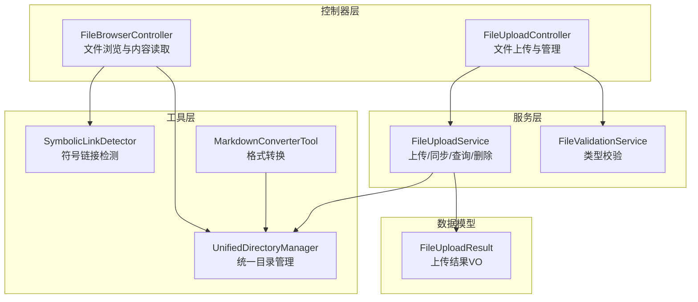
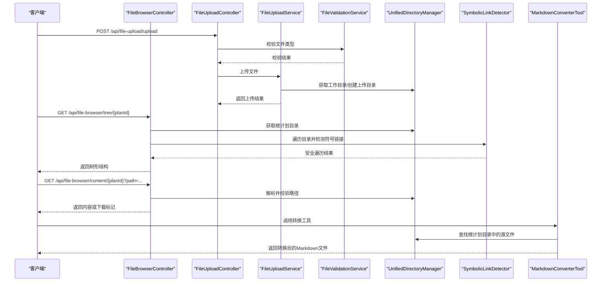
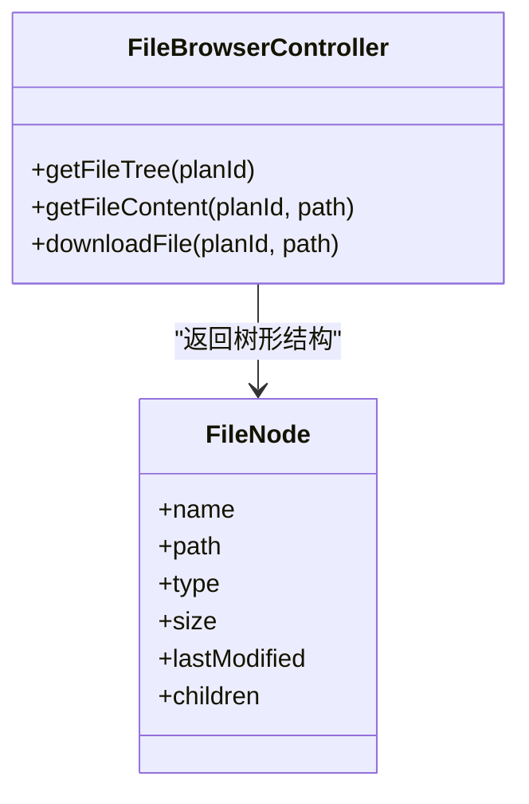
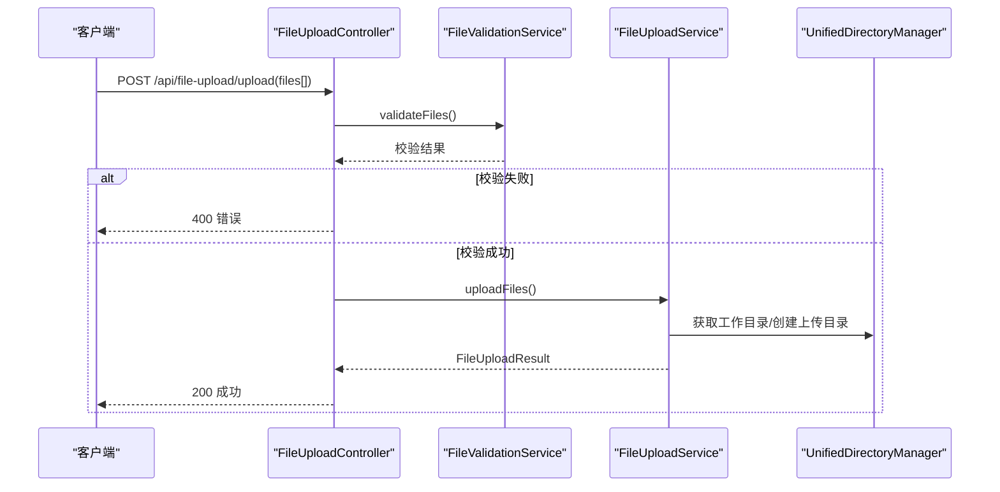
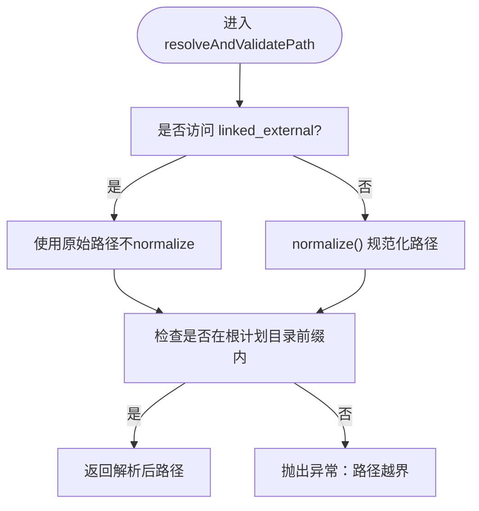
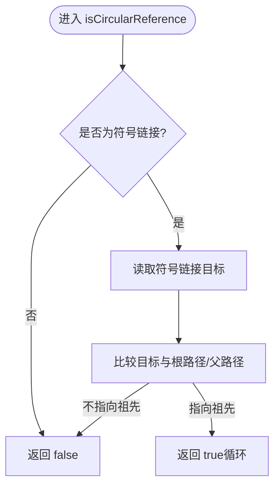
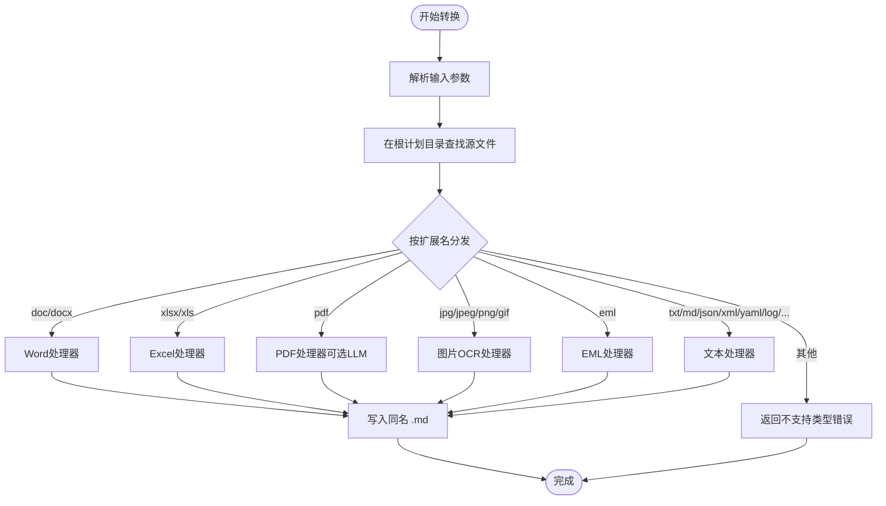
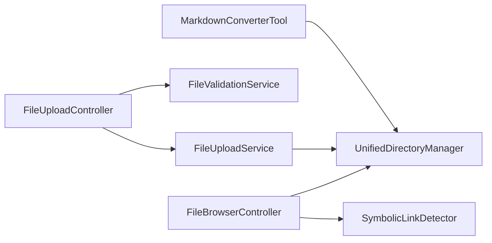

# 文件系统工具API

<cite>
**本文档引用的文件**
- [FileBrowserController.java](file://src/main/java/com/alibaba/cloud/ai/lynxe/runtime/controller/FileBrowserController.java)
- [FileUploadController.java](file://src/main/java/com/alibaba/cloud/ai/lynxe/runtime/controller/FileUploadController.java)
- [UnifiedDirectoryManager.java](file://src/main/java/com/alibaba/cloud/ai/lynxe/tool/filesystem/UnifiedDirectoryManager.java)
- [SymbolicLinkDetector.java](file://src/main/java/com/alibaba/cloud/ai/lynxe/tool/filesystem/SymbolicLinkDetector.java)
- [MarkdownConverterTool.java](file://src/main/java/com/alibaba/cloud/ai/lynxe/tool/convertToMarkdown/MarkdownConverterTool.java)
- [FileUploadService.java](file://src/main/java/com/alibaba/cloud/ai/lynxe/runtime/service/FileUploadService.java)
- [FileValidationService.java](file://src/main/java/com/alibaba/cloud/ai/lynxe/runtime/service/FileValidationService.java)
- [FileUploadResult.java](file://src/main/java/com/alibaba/cloud/ai/lynxe/runtime/entity/vo/FileUploadResult.java)
</cite>

## 目录
1. [简介](#简介)
2. [项目结构](#项目结构)
3. [核心组件](#核心组件)
4. [架构总览](#架构总览)
5. [详细组件分析](#详细组件分析)
6. [依赖分析](#依赖分析)
7. [性能考虑](#性能考虑)
8. [故障排查指南](#故障排查指南)
9. [结论](#结论)
10. [附录](#附录)

## 简介
本文件系统工具API旨在提供统一的文件读写、目录遍历与文件格式转换能力，覆盖以下关键场景：
- 文件上传与管理：支持批量上传、类型校验、临时存储与同步至计划目录
- 文件浏览与内容读取：树形目录展示、安全路径解析、文本/二进制文件读取与下载
- 符号链接安全：检测与防护循环引用，保障目录遍历安全
- 格式转换：将多种文件类型（Word、Excel、PDF、图片、EML、文本等）转换为Markdown

该API通过控制器层暴露REST端点，服务层负责业务逻辑与安全校验，工具层提供格式转换能力，统一目录管理器集中管控工作目录与计划目录。

## 项目结构
围绕文件系统工具API的关键模块如下：
- 控制器层
  - 文件浏览器：/api/file-browser/tree/{planId}、/api/file-browser/content/{planId}、/api/file-browser/download/{planId}
  - 文件上传：/api/file-upload/upload、/api/file-upload/files/{uploadKey}、/api/file-upload/files/{uploadKey}/{fileName}、/api/file-upload/config
- 服务层
  - 文件上传服务：生成唯一上传键、批量上传、同步到计划目录、查询与删除
  - 文件校验服务：基于扩展名的类型白名单/黑名单校验
- 工具层
  - 统一目录管理器：根计划目录、子任务目录、外部链接目录、路径安全校验
  - 符号链接检测器：循环引用检测、安全遍历
  - Markdown转换工具：多格式转Markdown
- 数据模型
  - 上传结果与文件信息VO

**图表来源**
- [FileBrowserController.java:45-534](file://src/main/java/com/alibaba/cloud/ai/lynxe/runtime/controller/FileBrowserController.java#L45-L534)
- [FileUploadController.java:38-301](file://src/main/java/com/alibaba/cloud/ai/lynxe/runtime/controller/FileUploadController.java#L38-L301)
- [FileUploadService.java:40-588](file://src/main/java/com/alibaba/cloud/ai/lynxe/runtime/service/FileUploadService.java#L40-L588)
- [FileValidationService.java:31-141](file://src/main/java/com/alibaba/cloud/ai/lynxe/runtime/service/FileValidationService.java#L31-L141)
- [UnifiedDirectoryManager.java:37-715](file://src/main/java/com/alibaba/cloud/ai/lynxe/tool/filesystem/UnifiedDirectoryManager.java#L37-L715)
- [SymbolicLinkDetector.java:41-277](file://src/main/java/com/alibaba/cloud/ai/lynxe/tool/filesystem/SymbolicLinkDetector.java#L41-L277)
- [MarkdownConverterTool.java:39-400](file://src/main/java/com/alibaba/cloud/ai/lynxe/tool/convertToMarkdown/MarkdownConverterTool.java#L39-L400)
- [FileUploadResult.java:24-166](file://src/main/java/com/alibaba/cloud/ai/lynxe/runtime/entity/vo/FileUploadResult.java#L24-L166)

**章节来源**
- [FileBrowserController.java:45-534](file://src/main/java/com/alibaba/cloud/ai/lynxe/runtime/controller/FileBrowserController.java#L45-L534)
- [FileUploadController.java:38-301](file://src/main/java/com/alibaba/cloud/ai/lynxe/runtime/controller/FileUploadController.java#L38-L301)
- [FileUploadService.java:40-588](file://src/main/java/com/alibaba/cloud/ai/lynxe/runtime/service/FileUploadService.java#L40-L588)
- [FileValidationService.java:31-141](file://src/main/java/com/alibaba/cloud/ai/lynxe/runtime/service/FileValidationService.java#L31-L141)
- [UnifiedDirectoryManager.java:37-715](file://src/main/java/com/alibaba/cloud/ai/lynxe/tool/filesystem/UnifiedDirectoryManager.java#L37-L715)
- [SymbolicLinkDetector.java:41-277](file://src/main/java/com/alibaba/cloud/ai/lynxe/tool/filesystem/SymbolicLinkDetector.java#L41-L277)
- [MarkdownConverterTool.java:39-400](file://src/main/java/com/alibaba/cloud/ai/lynxe/tool/convertToMarkdown/MarkdownConverterTool.java#L39-L400)
- [FileUploadResult.java:24-166](file://src/main/java/com/alibaba/cloud/ai/lynxe/runtime/entity/vo/FileUploadResult.java#L24-L166)

## 核心组件
- 文件浏览器控制器
  - 提供树形目录结构、文件内容读取（文本/二进制/Base64）、文件下载
  - 安全路径解析与符号链接循环检测
- 文件上传控制器
  - 批量上传、查询上传文件、删除单个文件、获取上传配置
  - 与上传服务协作完成类型校验与同步
- 统一目录管理器
  - 根计划目录、子任务目录、外部链接目录（linked_external）
  - 路径安全校验、相对路径计算、清理与回收
- 符号链接检测器
  - 循环引用检测、安全遍历回调、忽略规则集成
- Markdown转换工具
  - 支持Word、Excel、PDF、图片、EML、文本等转Markdown
  - 基于根计划目录定位源文件，生成同名.md目标文件
- 上传服务与校验服务
  - 上传键生成、文件去重命名、同步到计划目录、类型白名单/黑名单
  - 扩展名驱动的类型判定与错误聚合

**章节来源**
- [FileBrowserController.java:143-385](file://src/main/java/com/alibaba/cloud/ai/lynxe/runtime/controller/FileBrowserController.java#L143-L385)
- [FileUploadController.java:56-182](file://src/main/java/com/alibaba/cloud/ai/lynxe/runtime/controller/FileUploadController.java#L56-L182)
- [UnifiedDirectoryManager.java:153-306](file://src/main/java/com/alibaba/cloud/ai/lynxe/tool/filesystem/UnifiedDirectoryManager.java#L153-L306)
- [SymbolicLinkDetector.java:62-100](file://src/main/java/com/alibaba/cloud/ai/lynxe/tool/filesystem/SymbolicLinkDetector.java#L62-L100)
- [MarkdownConverterTool.java:139-249](file://src/main/java/com/alibaba/cloud/ai/lynxe/tool/convertToMarkdown/MarkdownConverterTool.java#L139-L249)
- [FileUploadService.java:86-139](file://src/main/java/com/alibaba/cloud/ai/lynxe/runtime/service/FileUploadService.java#L86-L139)
- [FileValidationService.java:39-85](file://src/main/java/com/alibaba/cloud/ai/lynxe/runtime/service/FileValidationService.java#L39-L85)

## 架构总览
下图展示了文件系统工具API的整体交互流程：客户端通过控制器发起请求，服务层执行业务逻辑并进行安全校验，工具层提供底层能力（目录管理、符号链接检测、格式转换），最终返回标准化响应。

**图表来源**
- [FileBrowserController.java:143-385](file://src/main/java/com/alibaba/cloud/ai/lynxe/runtime/controller/FileBrowserController.java#L143-L385)
- [FileUploadController.java:56-182](file://src/main/java/com/alibaba/cloud/ai/lynxe/runtime/controller/FileUploadController.java#L56-L182)
- [FileUploadService.java:86-139](file://src/main/java/com/alibaba/cloud/ai/lynxe/runtime/service/FileUploadService.java#L86-L139)
- [FileValidationService.java:39-85](file://src/main/java/com/alibaba/cloud/ai/lynxe/runtime/service/FileValidationService.java#L39-L85)
- [UnifiedDirectoryManager.java:153-306](file://src/main/java/com/alibaba/cloud/ai/lynxe/tool/filesystem/UnifiedDirectoryManager.java#L153-L306)
- [SymbolicLinkDetector.java:177-253](file://src/main/java/com/alibaba/cloud/ai/lynxe/tool/filesystem/SymbolicLinkDetector.java#L177-L253)
- [MarkdownConverterTool.java:139-249](file://src/main/java/com/alibaba/cloud/ai/lynxe/tool/convertToMarkdown/MarkdownConverterTool.java#L139-L249)

## 详细组件分析

### 文件浏览器API
- 端点
  - GET /api/file-browser/tree/{planId}
    - 功能：返回指定计划ID的文件树
    - 请求参数：path变量 planId
    - 响应：success + data(FileNode)
    - 安全：根目录限制、符号链接循环检测
  - GET /api/file-browser/content/{planId}?path=...
    - 功能：读取文件内容，自动区分文本/二进制/下载
    - 请求参数：path变量 planId；查询参数 path
    - 响应：success + data(content, mimeType, size, isBinary, downloadOnly)
    - 安全：路径规范化与根目录校验
  - GET /api/file-browser/download/{planId}?path=...
    - 功能：文件下载（二进制）
    - 请求参数：path变量 planId；查询参数 path
    - 响应：HTTP附件/内联（根据MIME类型）
    - 安全：路径规范化与根目录校验
- 数据模型
  - FileNode：name, path, type, size, lastModified, children

**图表来源**
- [FileBrowserController.java:143-385](file://src/main/java/com/alibaba/cloud/ai/lynxe/runtime/controller/FileBrowserController.java#L143-L385)

**章节来源**
- [FileBrowserController.java:143-385](file://src/main/java/com/alibaba/cloud/ai/lynxe/runtime/controller/FileBrowserController.java#L143-L385)

### 文件上传API
- 端点
  - POST /api/file-upload/upload
    - 功能：批量上传文件
    - 请求：multipart/form-data，参数 files[]
    - 响应：FileUploadResult（包含uploadKey与文件列表）
    - 校验：类型白名单/黑名单、大小限制、数量限制
  - GET /api/file-upload/files/{uploadKey}
    - 功能：查询指定上传会话的所有文件
    - 响应：GetUploadedFilesResponse（success, uploadKey, files, totalCount）
  - DELETE /api/file-upload/files/{uploadKey}/{fileName}
    - 功能：删除指定上传会话中的文件
    - 响应：DeleteFileResponse（success, message/error, uploadKey, fileName）
  - GET /api/file-upload/config
    - 功能：获取上传配置（最大文件大小、最大文件数、允许类型）
- 数据模型
  - FileUploadResult：success, message, uploadKey, uploadedFiles, totalFiles, successfulFiles, failedFiles
  - FileInfo：originalName, size, type, uploadTime, success, error

**图表来源**
- [FileUploadController.java:56-94](file://src/main/java/com/alibaba/cloud/ai/lynxe/runtime/controller/FileUploadController.java#L56-L94)
- [FileValidationService.java:72-85](file://src/main/java/com/alibaba/cloud/ai/lynxe/runtime/service/FileValidationService.java#L72-L85)
- [FileUploadService.java:86-139](file://src/main/java/com/alibaba/cloud/ai/lynxe/runtime/service/FileUploadService.java#L86-L139)
- [UnifiedDirectoryManager.java:143-145](file://src/main/java/com/alibaba/cloud/ai/lynxe/tool/filesystem/UnifiedDirectoryManager.java#L143-L145)

**章节来源**
- [FileUploadController.java:56-182](file://src/main/java/com/alibaba/cloud/ai/lynxe/runtime/controller/FileUploadController.java#L56-L182)
- [FileUploadService.java:86-139](file://src/main/java/com/alibaba/cloud/ai/lynxe/runtime/service/FileUploadService.java#L86-L139)
- [FileValidationService.java:39-85](file://src/main/java/com/alibaba/cloud/ai/lynxe/runtime/service/FileValidationService.java#L39-L85)
- [FileUploadResult.java:24-166](file://src/main/java/com/alibaba/cloud/ai/lynxe/runtime/entity/vo/FileUploadResult.java#L24-L166)

### 统一目录管理器
- 能力
  - 获取工作目录与根计划目录
  - 子任务目录与外部链接目录（linked_external）管理
  - 路径安全校验与规范化
  - 清理与回收（递归删除）
- 关键行为
  - ensureExternalFolderLink：在根计划目录创建指向外部文件夹的符号链接（避免循环引用）
  - removeExternalFolderLink：任务结束时移除外部链接
  - resolveAndValidatePath：对普通路径进行normalize并校验，对linked_external不normalize以保留符号链接语义
  - isPathAllowed：仅允许在工作目录范围内访问，禁止外部直接访问

**图表来源**
- [UnifiedDirectoryManager.java:249-276](file://src/main/java/com/alibaba/cloud/ai/lynxe/tool/filesystem/UnifiedDirectoryManager.java#L249-L276)

**章节来源**
- [UnifiedDirectoryManager.java:100-124](file://src/main/java/com/alibaba/cloud/ai/lynxe/tool/filesystem/UnifiedDirectoryManager.java#L100-L124)
- [UnifiedDirectoryManager.java:153-181](file://src/main/java/com/alibaba/cloud/ai/lynxe/tool/filesystem/UnifiedDirectoryManager.java#L153-L181)
- [UnifiedDirectoryManager.java:249-276](file://src/main/java/com/alibaba/cloud/ai/lynxe/tool/filesystem/UnifiedDirectoryManager.java#L249-L276)
- [UnifiedDirectoryManager.java:286-306](file://src/main/java/com/alibaba/cloud/ai/lynxe/tool/filesystem/UnifiedDirectoryManager.java#L286-L306)
- [UnifiedDirectoryManager.java:413-631](file://src/main/java/com/alibaba/cloud/ai/lynxe/tool/filesystem/UnifiedDirectoryManager.java#L413-L631)
- [UnifiedDirectoryManager.java:638-712](file://src/main/java/com/alibaba/cloud/ai/lynxe/tool/filesystem/UnifiedDirectoryManager.java#L638-L712)

### 符号链接检测器
- 能力
  - isCircularReference：检测符号链接是否指向祖先导致循环
  - isSymlinkOutsideRoot：检测符号链接目标是否超出允许根目录
  - createSafeFileVisitor：安全遍历目录，跟踪已访问真实路径，避免循环
- 应用
  - 在构建文件树时用于跳过循环符号链接，并记录调试信息

**图表来源**
- [SymbolicLinkDetector.java:62-100](file://src/main/java/com/alibaba/cloud/ai/lynxe/tool/filesystem/SymbolicLinkDetector.java#L62-L100)

**章节来源**
- [SymbolicLinkDetector.java:62-100](file://src/main/java/com/alibaba/cloud/ai/lynxe/tool/filesystem/SymbolicLinkDetector.java#L62-L100)
- [SymbolicLinkDetector.java:177-253](file://src/main/java/com/alibaba/cloud/ai/lynxe/tool/filesystem/SymbolicLinkDetector.java#L177-L253)

### 格式转换工具（MarkdownConverterTool）
- 支持类型
  - Word：.doc/.docx
  - Excel：.xlsx/.xls
  - PDF：可选强制LLM处理
  - 图片：.jpg/.jpeg/.png/.gif（OCR）
  - EML：邮件转Markdown
  - 文本：.txt/.md/.json/.xml/.yaml/.yml/.log/.java/.py/.js/.html/.css等
- 行为
  - 输入参数：filename、additionalRequirement、forceLlmForPdf
  - 在根计划目录中查找源文件，调用对应处理器生成同名.md文件
  - 对不支持的类型返回错误信息

**图表来源**
- [MarkdownConverterTool.java:139-249](file://src/main/java/com/alibaba/cloud/ai/lynxe/tool/convertToMarkdown/MarkdownConverterTool.java#L139-L249)

**章节来源**
- [MarkdownConverterTool.java:139-249](file://src/main/java/com/alibaba/cloud/ai/lynxe/tool/convertToMarkdown/MarkdownConverterTool.java#L139-L249)

## 依赖分析
- 控制器到服务
  - FileUploadController 依赖 FileUploadService 与 FileValidationService
  - FileBrowserController 依赖 UnifiedDirectoryManager 与 SymbolicLinkDetector
- 服务到工具
  - FileUploadService 依赖 UnifiedDirectoryManager
  - MarkdownConverterTool 依赖 UnifiedDirectoryManager 及各格式处理器
- 数据模型
  - FileUploadService 输出 FileUploadResult，内部使用 FileInfo

**图表来源**
- [FileUploadController.java:45-49](file://src/main/java/com/alibaba/cloud/ai/lynxe/runtime/controller/FileUploadController.java#L45-L49)
- [FileBrowserController.java:52-56](file://src/main/java/com/alibaba/cloud/ai/lynxe/runtime/controller/FileBrowserController.java#L52-L56)
- [FileUploadService.java:45-46](file://src/main/java/com/alibaba/cloud/ai/lynxe/runtime/service/FileUploadService.java#L45-L46)
- [MarkdownConverterTool.java:57-65](file://src/main/java/com/alibaba/cloud/ai/lynxe/tool/convertToMarkdown/MarkdownConverterTool.java#L57-L65)

**章节来源**
- [FileUploadController.java:45-49](file://src/main/java/com/alibaba/cloud/ai/lynxe/runtime/controller/FileUploadController.java#L45-L49)
- [FileBrowserController.java:52-56](file://src/main/java/com/alibaba/cloud/ai/lynxe/runtime/controller/FileBrowserController.java#L52-L56)
- [FileUploadService.java:45-46](file://src/main/java/com/alibaba/cloud/ai/lynxe/runtime/service/FileUploadService.java#L45-L46)
- [MarkdownConverterTool.java:57-65](file://src/main/java/com/alibaba/cloud/ai/lynxe/tool/convertToMarkdown/MarkdownConverterTool.java#L57-L65)

## 性能考虑
- 目录遍历
  - 使用安全遍历器与已访问路径集合避免重复处理与循环
  - 对大目录采用流式遍历，减少内存占用
- 文件读取
  - 文本文件优先尝试UTF-8读取，失败则降级为二进制下载
  - 二进制文件采用Base64编码返回，注意带宽与内存开销
- 上传与同步
  - 单次上传文件数与大小限制，防止资源滥用
  - 同步到计划目录时生成唯一文件名，避免冲突
- 并发与清理
  - 外部链接创建存在竞态条件处理，必要时重试删除
  - 清理完成后记录已清理计划ID，避免重建链接

[本节为通用指导，无需特定文件来源]

## 故障排查指南
- 访问被拒绝（403/400）
  - 检查路径是否越界（超出根计划目录或工作目录范围）
  - 确认符号链接是否形成循环引用
- 文件不存在（404）
  - 确认planId与path组合是否正确
  - 确认文件是否已同步到根计划目录
- 类型不被允许（400）
  - 检查文件扩展名是否在白名单中
  - 确认未被黑名单阻止
- 下载异常
  - 对于Office/PDF/压缩包等“仅下载”类型，前端应触发下载而非显示
- 转换失败
  - 确认源文件存在于根计划目录
  - 检查对应格式处理器可用性（如图片OCR）

**章节来源**
- [FileBrowserController.java:181-185](file://src/main/java/com/alibaba/cloud/ai/lynxe/runtime/controller/FileBrowserController.java#L181-L185)
- [FileBrowserController.java:303-330](file://src/main/java/com/alibaba/cloud/ai/lynxe/runtime/controller/FileBrowserController.java#L303-L330)
- [FileValidationService.java:50-59](file://src/main/java/com/alibaba/cloud/ai/lynxe/runtime/service/FileValidationService.java#L50-L59)
- [FileUploadService.java:306-322](file://src/main/java/com/alibaba/cloud/ai/lynxe/runtime/service/FileUploadService.java#L306-L322)
- [MarkdownConverterTool.java:130-135](file://src/main/java/com/alibaba/cloud/ai/lynxe/tool/convertToMarkdown/MarkdownConverterTool.java#L130-L135)

## 结论
本API通过控制器、服务与工具三层架构，提供了安全、可扩展的文件系统能力：
- 统一的目录管理与路径安全校验，确保操作边界可控
- 完整的上传/下载/浏览/转换链路，满足多样化需求
- 符号链接检测与安全遍历，有效防范循环与越权访问
- 明确的错误处理与响应结构，便于前端集成与排错

[本节为总结，无需特定文件来源]

## 附录

### API端点一览
- 文件浏览
  - GET /api/file-browser/tree/{planId}
  - GET /api/file-browser/content/{planId}?path=...
  - GET /api/file-browser/download/{planId}?path=...
- 文件上传
  - POST /api/file-upload/upload
  - GET /api/file-upload/files/{uploadKey}
  - DELETE /api/file-upload/files/{uploadKey}/{fileName}
  - GET /api/file-upload/config

**章节来源**
- [FileBrowserController.java:143-385](file://src/main/java/com/alibaba/cloud/ai/lynxe/runtime/controller/FileBrowserController.java#L143-L385)
- [FileUploadController.java:56-182](file://src/main/java/com/alibaba/cloud/ai/lynxe/runtime/controller/FileUploadController.java#L56-L182)

### 参数与响应规范
- 上传
  - 请求：multipart/form-data，files[] 数组
  - 响应：FileUploadResult（success, message, uploadKey, uploadedFiles, total/successful/failedFiles）
- 浏览
  - 树形：FileNode（name, path, type, size, lastModified, children）
  - 内容：data（content, mimeType, size, isBinary, downloadOnly）
- 转换
  - 输入：filename, additionalRequirement, forceLlmForPdf
  - 输出：转换后的Markdown文件（同名.md）

**章节来源**
- [FileUploadResult.java:24-166](file://src/main/java/com/alibaba/cloud/ai/lynxe/runtime/entity/vo/FileUploadResult.java#L24-L166)
- [FileBrowserController.java:61-136](file://src/main/java/com/alibaba/cloud/ai/lynxe/runtime/controller/FileBrowserController.java#L61-L136)
- [MarkdownConverterTool.java:71-107](file://src/main/java/com/alibaba/cloud/ai/lynxe/tool/convertToMarkdown/MarkdownConverterTool.java#L71-L107)

### 权限与安全
- 路径安全
  - 统一目录管理器严格限制访问范围，禁止外部直接访问
  - 路径规范化与前缀校验，防止路径穿越
- 符号链接
  - 检测循环引用，跳过危险链接
  - 对linked_external特殊处理，避免解析真实目标
- 类型控制
  - 基于扩展名的白名单/黑名单策略
  - 上传前批量校验，失败即刻返回

**章节来源**
- [UnifiedDirectoryManager.java:286-306](file://src/main/java/com/alibaba/cloud/ai/lynxe/tool/filesystem/UnifiedDirectoryManager.java#L286-L306)
- [SymbolicLinkDetector.java:62-100](file://src/main/java/com/alibaba/cloud/ai/lynxe/tool/filesystem/SymbolicLinkDetector.java#L62-L100)
- [FileValidationService.java:50-59](file://src/main/java/com/alibaba/cloud/ai/lynxe/runtime/service/FileValidationService.java#L50-L59)

### 并发与清理
- 外部链接创建/删除具备竞态处理与二次确认
- 清理完成后记录已清理计划ID，避免重建
- 上传目录与计划目录分离，降低并发冲突

**章节来源**
- [UnifiedDirectoryManager.java:413-631](file://src/main/java/com/alibaba/cloud/ai/lynxe/tool/filesystem/UnifiedDirectoryManager.java#L413-L631)
- [UnifiedDirectoryManager.java:638-712](file://src/main/java/com/alibaba/cloud/ai/lynxe/tool/filesystem/UnifiedDirectoryManager.java#L638-L712)