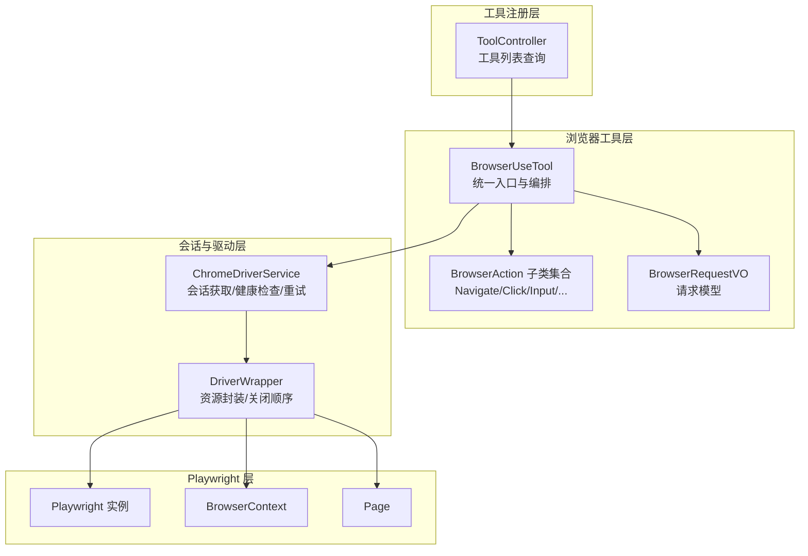
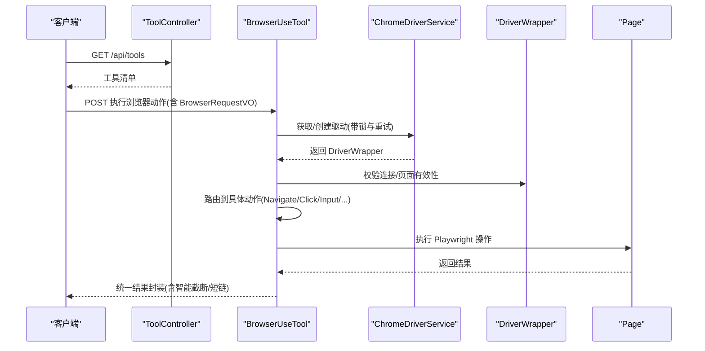
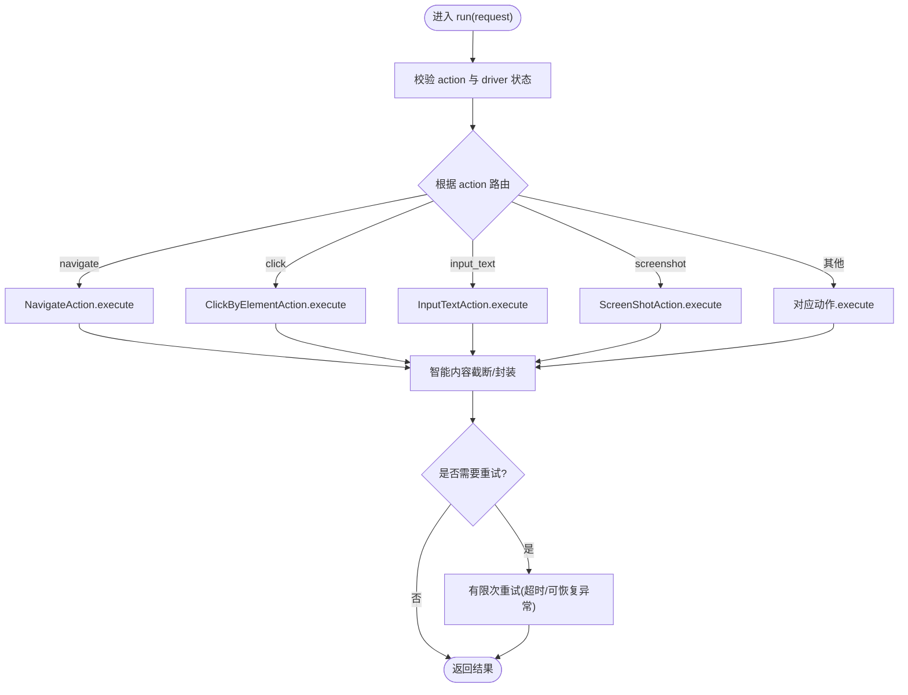
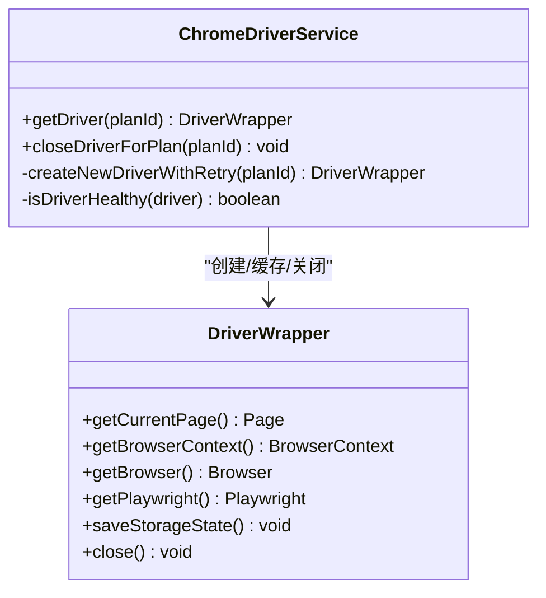
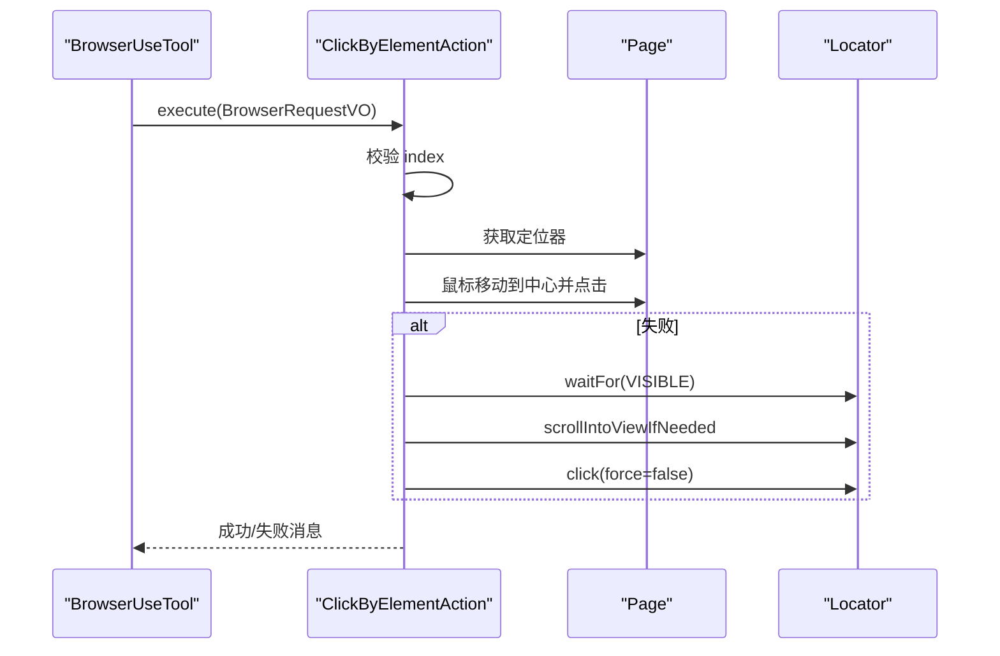
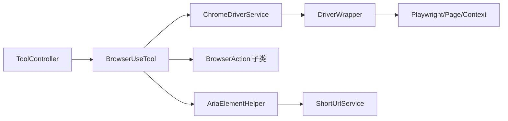

# 浏览器工具API

<cite>
**本文引用的文件**
- [BrowserUseTool.java](file://src/main/java/com/alibaba/cloud/ai/lynxe/tool/browser/BrowserUseTool.java)
- [ChromeDriverService.java](file://src/main/java/com/alibaba/cloud/ai/lynxe/tool/browser/ChromeDriverService.java)
- [DriverWrapper.java](file://src/main/java/com/alibaba/cloud/ai/lynxe/tool/browser/DriverWrapper.java)
- [AriaElementHelper.java](file://src/main/java/com/alibaba/cloud/ai/lynxe/tool/browser/AriaElementHelper.java)
- [BrowserRequestVO.java](file://src/main/java/com/alibaba/cloud/ai/lynxe/tool/browser/actions/BrowserRequestVO.java)
- [NavigateAction.java](file://src/main/java/com/alibaba/cloud/ai/lynxe/tool/browser/actions/NavigateAction.java)
- [ScreenShotAction.java](file://src/main/java/com/alibaba/cloud/ai/lynxe/tool/browser/actions/ScreenShotAction.java)
- [ClickByElementAction.java](file://src/main/java/com/alibaba/cloud/ai/lynxe/tool/browser/actions/ClickByElementAction.java)
- [InputTextAction.java](file://src/main/java/com/alibaba/cloud/ai/lynxe/tool/browser/actions/InputTextAction.java)
- [ToolController.java](file://src/main/java/com/alibaba/cloud/ai/lynxe/tool/controller/ToolController.java)
- [application.yml](file://src/main/resources/application.yml)
</cite>

## 目录
1. [简介](#简介)
2. [项目结构](#项目结构)
3. [核心组件](#核心组件)
4. [架构总览](#架构总览)
5. [详细组件分析](#详细组件分析)
6. [依赖关系分析](#依赖关系分析)
7. [性能与稳定性](#性能与稳定性)
8. [故障排查指南](#故障排查指南)
9. [结论](#结论)
10. [附录：API规范与使用示例](#附录api规范与使用示例)

## 简介
本文件为 Lynxe 浏览器工具API的权威技术文档，面向需要在系统中集成浏览器自动化能力的开发者与运维人员。文档覆盖统一接口设计、请求与响应规范、浏览器动作执行机制、会话与页面生命周期管理、错误处理策略以及最佳实践与排障建议。

Lynxe 使用 Playwright 作为底层浏览器驱动，通过 BrowserUseTool 提供统一入口，支持页面导航、元素交互、截图、文本输入、滚动、标签页管理、下载、JS 执行、内容提取等常用自动化场景，并内置重试、超时控制、智能内容截断与短链压缩等工程化能力。

## 项目结构
浏览器工具相关代码主要位于以下模块：
- 工具入口与编排：BrowserUseTool
- 浏览器会话与资源管理：ChromeDriverService、DriverWrapper
- 动作实现：NavigateAction、ScreenShotAction、ClickByElementAction、InputTextAction 等
- 请求模型：BrowserRequestVO
- ARIA 元素解析与短链压缩：AriaElementHelper
- 工具注册与对外暴露：ToolController
- 应用配置：application.yml

图表来源
- [BrowserUseTool.java:113-295](file://src/main/java/com/alibaba/cloud/ai/lynxe/tool/browser/BrowserUseTool.java#L113-L295)
- [ChromeDriverService.java:105-157](file://src/main/java/com/alibaba/cloud/ai/lynxe/tool/browser/ChromeDriverService.java#L105-L157)
- [DriverWrapper.java:37-84](file://src/main/java/com/alibaba/cloud/ai/lynxe/tool/browser/DriverWrapper.java#L37-L84)
- [ToolController.java:58-94](file://src/main/java/com/alibaba/cloud/ai/lynxe/tool/controller/ToolController.java#L58-L94)

章节来源
- [BrowserUseTool.java:113-295](file://src/main/java/com/alibaba/cloud/ai/lynxe/tool/browser/BrowserUseTool.java#L113-L295)
- [ChromeDriverService.java:105-157](file://src/main/java/com/alibaba/cloud/ai/lynxe/tool/browser/ChromeDriverService.java#L105-L157)
- [DriverWrapper.java:37-84](file://src/main/java/com/alibaba/cloud/ai/lynxe/tool/browser/DriverWrapper.java#L37-L84)
- [ToolController.java:58-94](file://src/main/java/com/alibaba/cloud/ai/lynxe/tool/controller/ToolController.java#L58-L94)

## 核心组件
- 统一入口与编排：BrowserUseTool
  - 负责接收请求、参数校验、路由到具体动作、重试与异常处理、状态采集与智能内容截断。
  - 提供当前浏览器状态快照（URL、标题、标签页、可交互元素等）。
- 会话与驱动：ChromeDriverService、DriverWrapper
  - 基于 Playwright 创建/复用/清理浏览器实例，保证上下文隔离与资源有序释放。
  - 支持持久化存储状态（cookies/localStorage），并按最佳实践关闭顺序进行资源回收。
- 动作实现：NavigateAction、ScreenShotAction、ClickByElementAction、InputTextAction 等
  - 将 BrowserRequestVO 参数映射为 Playwright 操作，处理超时、回退策略与结果返回。
- 请求模型：BrowserRequestVO
  - 定义所有动作所需的字段与语义，用于统一校验与序列化。
- ARIA 解析与短链：AriaElementHelper
  - 生成并处理 ARIA 快照，支持索引化与短链压缩，提升交互体验与传输效率。
- 工具注册：ToolController
  - 对外暴露可用工具清单，便于前端或上层调度系统发现与调用。

章节来源
- [BrowserUseTool.java:113-295](file://src/main/java/com/alibaba/cloud/ai/lynxe/tool/browser/BrowserUseTool.java#L113-L295)
- [ChromeDriverService.java:105-157](file://src/main/java/com/alibaba/cloud/ai/lynxe/tool/browser/ChromeDriverService.java#L105-L157)
- [DriverWrapper.java:193-283](file://src/main/java/com/alibaba/cloud/ai/lynxe/tool/browser/DriverWrapper.java#L193-L283)
- [BrowserRequestVO.java:23-177](file://src/main/java/com/alibaba/cloud/ai/lynxe/tool/browser/actions/BrowserRequestVO.java#L23-L177)
- [AriaElementHelper.java:79-132](file://src/main/java/com/alibaba/cloud/ai/lynxe/tool/browser/AriaElementHelper.java#L79-L132)
- [ToolController.java:58-94](file://src/main/java/com/alibaba/cloud/ai/lynxe/tool/controller/ToolController.java#L58-L94)

## 架构总览
浏览器工具API采用“控制器-工具-动作-驱动”的分层架构：
- 控制器层：ToolController 提供工具清单查询接口，便于外部系统发现 Lynxe 已注册的工具。
- 工具层：BrowserUseTool 作为统一入口，负责参数校验、动作路由、重试与异常包装、状态采集。
- 动作层：各 BrowserAction 子类实现具体浏览器操作，确保与 Playwright 的强一致映射。
- 驱动层：ChromeDriverService 负责会话生命周期管理；DriverWrapper 封装资源与关闭顺序。

图表来源
- [ToolController.java:58-94](file://src/main/java/com/alibaba/cloud/ai/lynxe/tool/controller/ToolController.java#L58-L94)
- [BrowserUseTool.java:113-295](file://src/main/java/com/alibaba/cloud/ai/lynxe/tool/browser/BrowserUseTool.java#L113-L295)
- [ChromeDriverService.java:105-157](file://src/main/java/com/alibaba/cloud/ai/lynxe/tool/browser/ChromeDriverService.java#L105-L157)
- [DriverWrapper.java:193-283](file://src/main/java/com/alibaba/cloud/ai/lynxe/tool/browser/DriverWrapper.java#L193-L283)

## 详细组件分析

### 统一入口：BrowserUseTool
- 功能职责
  - 接收 BrowserRequestVO，校验 action 与必要参数。
  - 获取/校验 DriverWrapper，确保浏览器连接与当前页面有效。
  - 根据 action 分发到对应动作类，执行后进行智能内容截断与统一结果封装。
  - 提供 getCurrentState 生成浏览器状态快照（URL、标题、标签页、可交互元素等）。
  - 提供 cleanup 以释放指定 planId 的浏览器资源。
- 关键流程
  - 执行前校验：action 非空、driver 可用、浏览器连接正常、当前页面有效。
  - 动作执行：按 action 分支调用对应 Action，统一捕获超时与 Playwright 异常。
  - 结果处理：对长输出进行智能截断；部分动作（如 get_text、execute_js）额外触发智能处理。
  - 重试策略：对超时与可恢复异常进行有限次重试，避免偶发抖动导致失败。
- 错误处理
  - 明确区分超时、Playwright 异常与未知异常，分别返回可读提示。
  - 对非可重试异常直接抛出，避免无意义重试。
- 状态采集
  - 自动等待 DOMContentLoaded 与 NETWORKIDLE，确保页面稳定后再采集状态。
  - 生成 ARIA 快照并进行索引化与短链压缩，便于前端交互。

图表来源
- [BrowserUseTool.java:113-295](file://src/main/java/com/alibaba/cloud/ai/lynxe/tool/browser/BrowserUseTool.java#L113-L295)
- [BrowserUseTool.java:297-353](file://src/main/java/com/alibaba/cloud/ai/lynxe/tool/browser/BrowserUseTool.java#L297-L353)

章节来源
- [BrowserUseTool.java:113-295](file://src/main/java/com/alibaba/cloud/ai/lynxe/tool/browser/BrowserUseTool.java#L113-L295)
- [BrowserUseTool.java:297-353](file://src/main/java/com/alibaba/cloud/ai/lynxe/tool/browser/BrowserUseTool.java#L297-L353)

### 会话与驱动：ChromeDriverService 与 DriverWrapper
- ChromeDriverService
  - 以 planId 为维度缓存 DriverWrapper，支持并发安全与健康检查。
  - 创建新驱动时采用指数退避重试，确保启动成功率。
  - 启动参数优化：禁用背景网络、扩展、通知等，提升启动速度与稳定性。
  - 支持持久化用户数据目录与共享存储状态（cookies/localStorage），便于历史登录态复用与清理。
  - 注册浏览器断开监听，在断开时标记驱动不健康并移除。
- DriverWrapper
  - 严格遵循关闭顺序：保存存储状态 → 关闭上下文 → 清理历史（保留 cookies）→ 关闭浏览器 → 关闭 Playwright。
  - 提供异步保存存储状态，避免阻塞关闭流程。
  - 封装当前 Page、上下文与 Playwright 实例，便于上层统一访问。

图表来源
- [ChromeDriverService.java:105-157](file://src/main/java/com/alibaba/cloud/ai/lynxe/tool/browser/ChromeDriverService.java#L105-L157)
- [ChromeDriverService.java:237-284](file://src/main/java/com/alibaba/cloud/ai/lynxe/tool/browser/ChromeDriverService.java#L237-L284)
- [DriverWrapper.java:37-84](file://src/main/java/com/alibaba/cloud/ai/lynxe/tool/browser/DriverWrapper.java#L37-L84)
- [DriverWrapper.java:193-283](file://src/main/java/com/alibaba/cloud/ai/lynxe/tool/browser/DriverWrapper.java#L193-L283)

章节来源
- [ChromeDriverService.java:105-157](file://src/main/java/com/alibaba/cloud/ai/lynxe/tool/browser/ChromeDriverService.java#L105-L157)
- [ChromeDriverService.java:237-284](file://src/main/java/com/alibaba/cloud/ai/lynxe/tool/browser/ChromeDriverService.java#L237-L284)
- [DriverWrapper.java:193-283](file://src/main/java/com/alibaba/cloud/ai/lynxe/tool/browser/DriverWrapper.java#L193-L283)

### 动作实现：NavigateAction、ScreenShotAction、ClickByElementAction、InputTextAction
- NavigateAction
  - 校验 URL（支持短链解析与自动协议补全），导航并等待 DOMContentLoaded。
  - 导航后保存存储状态，确保登录态持久化。
- ScreenShotAction
  - 截取当前页面为 base64 字符串，便于直接嵌入响应或前端展示。
- ClickByElementAction
  - 优先使用鼠标模拟点击（移动到元素中心再点击），失败则回退到标准定位器点击。
  - 支持滚动到可视区域、可见性检查与超时控制。
- InputTextAction
  - 先清空再逐字符输入，支持延迟与超时控制；失败时回退到 JS 赋值并触发 input 事件。

图表来源
- [ClickByElementAction.java:32-103](file://src/main/java/com/alibaba/cloud/ai/lynxe/tool/browser/actions/ClickByElementAction.java#L32-L103)
- [ClickByElementAction.java:113-177](file://src/main/java/com/alibaba/cloud/ai/lynxe/tool/browser/actions/ClickByElementAction.java#L113-L177)

章节来源
- [NavigateAction.java:31-75](file://src/main/java/com/alibaba/cloud/ai/lynxe/tool/browser/actions/NavigateAction.java#L31-L75)
- [ScreenShotAction.java:28-35](file://src/main/java/com/alibaba/cloud/ai/lynxe/tool/browser/actions/ScreenShotAction.java#L28-L35)
- [ClickByElementAction.java:32-103](file://src/main/java/com/alibaba/cloud/ai/lynxe/tool/browser/actions/ClickByElementAction.java#L32-L103)
- [InputTextAction.java:28-85](file://src/main/java/com/alibaba/cloud/ai/lynxe/tool/browser/actions/InputTextAction.java#L28-L85)

### 请求模型：BrowserRequestVO
- 字段定义
  - action：动作类型（navigate、click、input_text、key_enter、screenshot、execute_js、scroll、new_tab、close_tab、switch_tab、refresh、get_element_position、move_to_and_click、get_web_content、download 等）。
  - url：导航与新建标签页时使用。
  - index：点击、输入、按键等基于元素索引的动作。
  - text：输入文本。
  - script：执行 JS 代码。
  - scrollAmount/direction：滚动像素或方向（up/down）。
  - tab_id：切换标签页。
  - elementName：按名称获取元素位置。
  - positionX/positionY：移动并点击坐标。
- 校验规则
  - 必填字段随动作变化而变化（如 navigate 需要 url，click 需要 index）。
  - 对于短链，支持自动解析真实 URL。

章节来源
- [BrowserRequestVO.java:23-177](file://src/main/java/com/alibaba/cloud/ai/lynxe/tool/browser/actions/BrowserRequestVO.java#L23-L177)

### ARIA 解析与短链压缩：AriaElementHelper
- 功能
  - 从 Page 生成 ARIA 快照，替换 aria-id-N 为 [idx=N]，便于上层以索引方式交互。
  - 可选地对快照中的 URL 进行短链压缩，结合 ShortUrlService 与 rootPlanId 管理映射。
- 错误处理
  - 快照生成失败时返回错误信息字符串而非抛出异常，保证流程继续。

章节来源
- [AriaElementHelper.java:79-132](file://src/main/java/com/alibaba/cloud/ai/lynxe/tool/browser/AriaElementHelper.java#L79-L132)
- [AriaElementHelper.java:142-190](file://src/main/java/com/alibaba/cloud/ai/lynxe/tool/browser/AriaElementHelper.java#L142-L190)

### 工具注册：ToolController
- 提供 /api/tools 接口，返回可用工具清单（含服务组、名称、描述、是否可选择等）。
- 内部通过 PlanningFactory 与 McpService 协作，动态构建工具回调上下文。

章节来源
- [ToolController.java:58-94](file://src/main/java/com/alibaba/cloud/ai/lynxe/tool/controller/ToolController.java#L58-L94)

## 依赖关系分析
- 组件耦合
  - BrowserUseTool 依赖 ChromeDriverService 获取/校验 DriverWrapper，依赖各动作类执行具体操作。
  - ChromeDriverService 依赖 DriverWrapper 封装 Playwright 生命周期，依赖配置与目录管理。
  - AriaElementHelper 依赖 Page 与 ShortUrlService 生成并压缩快照。
- 外部依赖
  - Playwright：浏览器驱动与页面操作。
  - Spring Boot：工具注册、配置与 Web 暴露。
- 循环依赖
  - 未见循环依赖迹象；各层职责清晰，接口边界明确。

图表来源
- [BrowserUseTool.java:113-295](file://src/main/java/com/alibaba/cloud/ai/lynxe/tool/browser/BrowserUseTool.java#L113-L295)
- [ChromeDriverService.java:105-157](file://src/main/java/com/alibaba/cloud/ai/lynxe/tool/browser/ChromeDriverService.java#L105-L157)
- [DriverWrapper.java:37-84](file://src/main/java/com/alibaba/cloud/ai/lynxe/tool/browser/DriverWrapper.java#L37-L84)
- [AriaElementHelper.java:79-132](file://src/main/java/com/alibaba/cloud/ai/lynxe/tool/browser/AriaElementHelper.java#L79-L132)
- [ToolController.java:58-94](file://src/main/java/com/alibaba/cloud/ai/lynxe/tool/controller/ToolController.java#L58-L94)

章节来源
- [BrowserUseTool.java:113-295](file://src/main/java/com/alibaba/cloud/ai/lynxe/tool/browser/BrowserUseTool.java#L113-L295)
- [ChromeDriverService.java:105-157](file://src/main/java/com/alibaba/cloud/ai/lynxe/tool/browser/ChromeDriverService.java#L105-L157)
- [DriverWrapper.java:37-84](file://src/main/java/com/alibaba/cloud/ai/lynxe/tool/browser/DriverWrapper.java#L37-L84)
- [AriaElementHelper.java:79-132](file://src/main/java/com/alibaba/cloud/ai/lynxe/tool/browser/AriaElementHelper.java#L79-L132)
- [ToolController.java:58-94](file://src/main/java/com/alibaba/cloud/ai/lynxe/tool/controller/ToolController.java#L58-L94)

## 性能与稳定性
- 启动优化
  - 禁用背景网络与扩展，降低启动与运行时开销。
  - 使用持久化上下文与存储状态，减少重复登录成本。
- 超时与重试
  - 页面级默认超时可配置；动作内部针对元素操作设置更短超时，避免长时间阻塞。
  - 对超时与可恢复异常进行有限次重试，提高鲁棒性。
- 资源回收
  - 严格的关闭顺序与异步保存存储状态，避免资源泄漏与数据丢失。
- 状态采集
  - 自动等待 DOMContentLoaded 与 NETWORKIDLE，确保快照与交互的准确性。

[本节为通用性能讨论，无需特定文件来源]

## 故障排查指南
- 常见问题与定位
  - 驱动不可用/浏览器未连接：检查 ChromeDriverService 的健康检查与断开监听日志。
  - 当前页面无效：确认已先执行导航或新建标签页，且页面未被关闭。
  - 元素不存在或不可见：使用 ARIA 快照确认元素索引与可见性，必要时增加等待或滚动。
  - 超时错误：适当增大 Lynxe 配置中的浏览器超时，或优化页面加载策略。
  - Playwright 异常：关注断言、定位器状态与页面生命周期，避免在已关闭上下文中操作。
- 排障步骤
  - 通过 ToolController 获取工具清单，确认工具已正确注册。
  - 在 BrowserUseTool 中查看状态快照，定位 URL、标题、标签页与可交互元素。
  - 检查应用日志级别与输出，定位具体动作失败原因。
  - 必要时调用 cleanup 释放指定 planId 的浏览器资源，重启会话。

章节来源
- [BrowserUseTool.java:113-295](file://src/main/java/com/alibaba/cloud/ai/lynxe/tool/browser/BrowserUseTool.java#L113-L295)
- [ChromeDriverService.java:305-351](file://src/main/java/com/alibaba/cloud/ai/lynxe/tool/browser/ChromeDriverService.java#L305-L351)
- [DriverWrapper.java:193-283](file://src/main/java/com/alibaba/cloud/ai/lynxe/tool/browser/DriverWrapper.java#L193-L283)

## 结论
Lynxe 浏览器工具API通过统一入口与标准化动作模型，实现了对 Playwright 的高效封装与工程化增强。其会话管理、状态采集、智能内容截断与短链压缩等特性，显著提升了自动化脚本的稳定性与可维护性。建议在生产环境中合理配置超时与重试策略，结合状态快照与工具清单接口，构建健壮的浏览器自动化流水线。

[本节为总结性内容，无需特定文件来源]

## 附录：API规范与使用示例

### 统一接口与端点
- 工具清单查询
  - 方法：GET
  - 路径：/api/tools
  - 功能：返回可用工具列表（含服务组、名称、描述、是否可选择）
  - 响应：HTTP 200 + 列表；异常时返回 500

章节来源
- [ToolController.java:58-94](file://src/main/java/com/alibaba/cloud/ai/lynxe/tool/controller/ToolController.java#L58-L94)

### 浏览器动作请求与响应规范
- 请求模型：BrowserRequestVO
  - 字段与含义详见“请求模型：BrowserRequestVO”章节。
- 响应模型：ToolExecuteResult（由 BrowserUseTool 统一封装）
  - 包含输出文本与状态信息；对长输出进行智能截断；对错误进行友好提示。

章节来源
- [BrowserRequestVO.java:23-177](file://src/main/java/com/alibaba/cloud/ai/lynxe/tool/browser/actions/BrowserRequestVO.java#L23-L177)
- [BrowserUseTool.java:113-295](file://src/main/java/com/alibaba/cloud/ai/lynxe/tool/browser/BrowserUseTool.java#L113-L295)

### 核心动作说明与参数
- 导航（navigate）
  - 必填：url
  - 行为：自动补全协议、支持短链解析、等待 DOMContentLoaded、保存存储状态
- 点击（click）
  - 必填：index
  - 行为：优先鼠标模拟点击，失败回退标准点击；支持滚动到可视区域
- 输入（input_text）
  - 必填：index、text
  - 行为：清空后逐字符输入，失败回退 JS 赋值并触发 input 事件
- 截图（screenshot）
  - 输出：base64 编码的图片数据
- 其他动作：scroll、new_tab、close_tab、switch_tab、refresh、get_element_position、move_to_and_click、get_web_content、download 等，均在 BrowserUseTool 中按 action 分发执行。

章节来源
- [NavigateAction.java:31-75](file://src/main/java/com/alibaba/cloud/ai/lynxe/tool/browser/actions/NavigateAction.java#L31-L75)
- [ClickByElementAction.java:32-103](file://src/main/java/com/alibaba/cloud/ai/lynxe/tool/browser/actions/ClickByElementAction.java#L32-L103)
- [InputTextAction.java:28-85](file://src/main/java/com/alibaba/cloud/ai/lynxe/tool/browser/actions/InputTextAction.java#L28-L85)
- [ScreenShotAction.java:28-35](file://src/main/java/com/alibaba/cloud/ai/lynxe/tool/browser/actions/ScreenShotAction.java#L28-L35)
- [BrowserUseTool.java:152-254](file://src/main/java/com/alibaba/cloud/ai/lynxe/tool/browser/BrowserUseTool.java#L152-L254)

### 会话管理与生命周期
- 获取驱动：ChromeDriverService.getDriver(planId)
- 健康检查：isDriverHealthy，自动剔除不健康实例
- 关闭驱动：closeDriverForPlan(planId)，按最佳实践顺序关闭资源
- 清理历史：在上下文关闭后清理用户数据目录的历史文件，保留 cookies

章节来源
- [ChromeDriverService.java:105-157](file://src/main/java/com/alibaba/cloud/ai/lynxe/tool/browser/ChromeDriverService.java#L105-L157)
- [ChromeDriverService.java:237-284](file://src/main/java/com/alibaba/cloud/ai/lynxe/tool/browser/ChromeDriverService.java#L237-L284)
- [DriverWrapper.java:193-283](file://src/main/java/com/alibaba/cloud/ai/lynxe/tool/browser/DriverWrapper.java#L193-L283)

### 配置参考
- 应用端口与日志级别：application.yml
- 浏览器超时、无头模式等可通过 LynxeProperties 注入（由 ChromeDriverService 读取）

章节来源
- [application.yml:1-97](file://src/main/resources/application.yml#L1-L97)
- [ChromeDriverService.java:768-789](file://src/main/java/com/alibaba/cloud/ai/lynxe/tool/browser/ChromeDriverService.java#L768-L789)

### 最佳实践
- 先导航再交互：任何元素操作前确保已导航至目标页面。
- 使用索引化交互：通过 ARIA 快照获取元素索引，避免脆弱的选择器。
- 合理设置超时：根据页面复杂度调整 Lynxe 配置中的超时参数。
- 重试策略：对偶发超时启用有限次重试，避免对不可恢复异常重复尝试。
- 资源清理：任务结束或异常退出时调用 cleanup，防止浏览器进程堆积。
- 状态快照：定期采集浏览器状态，辅助调试与可视化。

[本节为通用最佳实践，无需特定文件来源]