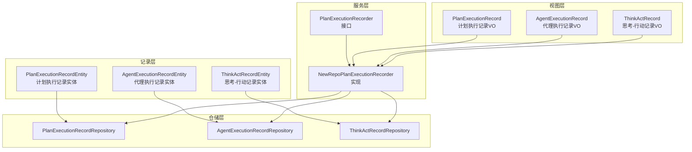
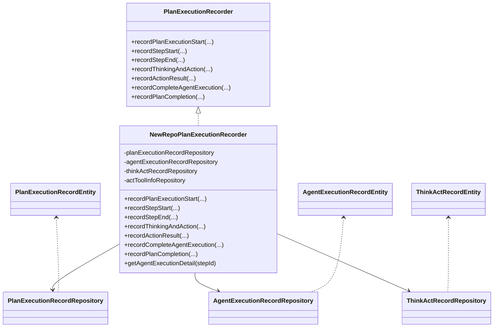
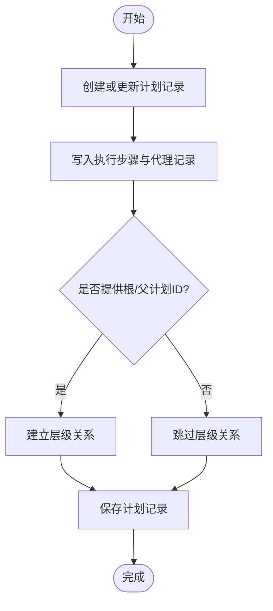
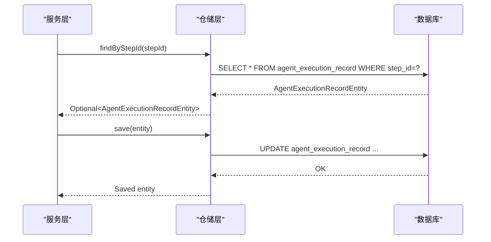
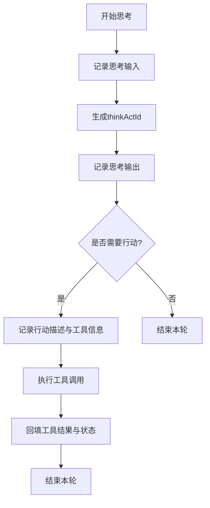
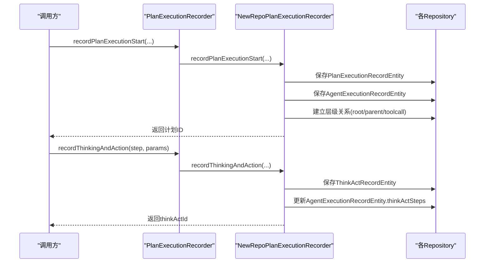
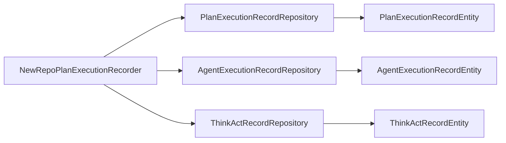

# 执行记录接口

<cite>
**本文引用的文件**
- [PlanExecutionRecordRepository.java](file://src/main/java/com/alibaba/cloud/ai/lynxe/recorder/repository/PlanExecutionRecordRepository.java)
- [AgentExecutionRecordRepository.java](file://src/main/java/com/alibaba/cloud/ai/lynxe/recorder/repository/AgentExecutionRecordRepository.java)
- [ThinkActRecordRepository.java](file://src/main/java/com/alibaba/cloud/ai/lynxe/recorder/repository/ThinkActRecordRepository.java)
- [PlanExecutionRecordEntity.java](file://src/main/java/com/alibaba/cloud/ai/lynxe/recorder/entity/po/PlanExecutionRecordEntity.java)
- [AgentExecutionRecordEntity.java](file://src/main/java/com/alibaba/cloud/ai/lynxe/recorder/entity/po/AgentExecutionRecordEntity.java)
- [ThinkActRecordEntity.java](file://src/main/java/com/alibaba/cloud/ai/lynxe/recorder/entity/po/ThinkActRecordEntity.java)
- [PlanExecutionRecorder.java](file://src/main/java/com/alibaba/cloud/ai/lynxe/recorder/service/PlanExecutionRecorder.java)
- [NewRepoPlanExecutionRecorder.java](file://src/main/java/com/alibaba/cloud/ai/lynxe/recorder/service/NewRepoPlanExecutionRecorder.java)
- [PlanExecutionRecord.java](file://src/main/java/com/alibaba/cloud/ai/lynxe/recorder/entity/vo/PlanExecutionRecord.java)
- [AgentExecutionRecord.java](file://src/main/java/com/alibaba/cloud/ai/lynxe/recorder/entity/vo/AgentExecutionRecord.java)
- [ThinkActRecord.java](file://src/main/java/com/alibaba/cloud/ai/lynxe/recorder/entity/vo/ThinkActRecord.java)
</cite>

## 目录
1. [简介](#简介)
2. [项目结构](#项目结构)
3. [核心组件](#核心组件)
4. [架构总览](#架构总览)
5. [详细组件分析](#详细组件分析)
6. [依赖分析](#依赖分析)
7. [性能考虑](#性能考虑)
8. [故障排查指南](#故障排查指南)
9. [结论](#结论)
10. [附录](#附录)

## 简介
本文件面向 Lynxe 的“执行记录接口”，系统化梳理并输出与执行记录相关的查询、过滤、统计分析、导出归档、清理策略、性能指标与资源统计、异常告警与诊断、可视化与报表、以及权限与数据安全等能力。当前仓库中已实现完整的三层模型（PO 实体、服务接口与 VO 视图对象）及对应的仓储层，覆盖计划执行、代理执行与工具调用的完整链路记录。

## 项目结构
围绕执行记录的核心模块位于 recorder 包下，包含：
- 实体层（PO）：PlanExecutionRecordEntity、AgentExecutionRecordEntity、ThinkActRecordEntity
- 仓储层（Repository）：PlanExecutionRecordRepository、AgentExecutionRecordRepository、ThinkActRecordRepository
- 服务层（Service）：PlanExecutionRecorder 接口与 NewRepoPlanExecutionRecorder 实现
- 视图层（VO）：PlanExecutionRecord、AgentExecutionRecord、ThinkActRecord

图表来源
- [PlanExecutionRecordEntity.java:42-283](file://src/main/java/com/alibaba/cloud/ai/lynxe/recorder/entity/po/PlanExecutionRecordEntity.java#L42-L283)
- [AgentExecutionRecordEntity.java:61-275](file://src/main/java/com/alibaba/cloud/ai/lynxe/recorder/entity/po/AgentExecutionRecordEntity.java#L61-L275)
- [ThinkActRecordEntity.java:53-185](file://src/main/java/com/alibaba/cloud/ai/lynxe/recorder/entity/po/ThinkActRecordEntity.java#L53-L185)
- [PlanExecutionRecordRepository.java:27-54](file://src/main/java/com/alibaba/cloud/ai/lynxe/recorder/repository/PlanExecutionRecordRepository.java#L27-L54)
- [AgentExecutionRecordRepository.java:26-43](file://src/main/java/com/alibaba/cloud/ai/lynxe/recorder/repository/AgentExecutionRecordRepository.java#L26-L43)
- [ThinkActRecordRepository.java:29-54](file://src/main/java/com/alibaba/cloud/ai/lynxe/recorder/repository/ThinkActRecordRepository.java#L29-L54)
- [PlanExecutionRecorder.java:26-242](file://src/main/java/com/alibaba/cloud/ai/lynxe/recorder/service/PlanExecutionRecorder.java#L26-L242)
- [NewRepoPlanExecutionRecorder.java:48-800](file://src/main/java/com/alibaba/cloud/ai/lynxe/recorder/service/NewRepoPlanExecutionRecorder.java#L48-L800)
- [PlanExecutionRecord.java:46-337](file://src/main/java/com/alibaba/cloud/ai/lynxe/recorder/entity/vo/PlanExecutionRecord.java#L46-L337)
- [AgentExecutionRecord.java:55-318](file://src/main/java/com/alibaba/cloud/ai/lynxe/recorder/entity/vo/AgentExecutionRecord.java#L55-L318)
- [ThinkActRecord.java:45-362](file://src/main/java/com/alibaba/cloud/ai/lynxe/recorder/entity/vo/ThinkActRecord.java#L45-L362)

章节来源
- [PlanExecutionRecordRepository.java:27-54](file://src/main/java/com/alibaba/cloud/ai/lynxe/recorder/repository/PlanExecutionRecordRepository.java#L27-L54)
- [AgentExecutionRecordRepository.java:26-43](file://src/main/java/com/alibaba/cloud/ai/lynxe/recorder/repository/AgentExecutionRecordRepository.java#L26-L43)
- [ThinkActRecordRepository.java:29-54](file://src/main/java/com/alibaba/cloud/ai/lynxe/recorder/repository/ThinkActRecordRepository.java#L29-L54)
- [PlanExecutionRecordEntity.java:42-283](file://src/main/java/com/alibaba/cloud/ai/lynxe/recorder/entity/po/PlanExecutionRecordEntity.java#L42-L283)
- [AgentExecutionRecordEntity.java:61-275](file://src/main/java/com/alibaba/cloud/ai/lynxe/recorder/entity/po/AgentExecutionRecordEntity.java#L61-L275)
- [ThinkActRecordEntity.java:53-185](file://src/main/java/com/alibaba/cloud/ai/lynxe/recorder/entity/po/ThinkActRecordEntity.java#L53-L185)
- [PlanExecutionRecorder.java:26-242](file://src/main/java/com/alibaba/cloud/ai/lynxe/recorder/service/PlanExecutionRecorder.java#L26-L242)
- [NewRepoPlanExecutionRecorder.java:48-800](file://src/main/java/com/alibaba/cloud/ai/lynxe/recorder/service/NewRepoPlanExecutionRecorder.java#L48-L800)
- [PlanExecutionRecord.java:46-337](file://src/main/java/com/alibaba/cloud/ai/lynxe/recorder/entity/vo/PlanExecutionRecord.java#L46-L337)
- [AgentExecutionRecord.java:55-318](file://src/main/java/com/alibaba/cloud/ai/lynxe/recorder/entity/vo/AgentExecutionRecord.java#L55-L318)
- [ThinkActRecord.java:45-362](file://src/main/java/com/alibaba/cloud/ai/lynxe/recorder/entity/vo/ThinkActRecord.java#L45-L362)

## 核心组件
- 计划执行记录（PlanExecutionRecord）
  - 负责记录一次计划的生命周期：开始、步骤推进、完成与摘要；支持父子/根层级关系标识与工具触发标识。
  - 支持动态计算当前步骤索引，便于前端展示进度。
- 代理执行记录（AgentExecutionRecord）
  - 记录单个代理在某一步骤内的执行状态、思考-行动序列、结果与错误信息；支持子计划记录挂载。
- 思考-行动记录（ThinkActRecord）
  - 记录代理在单轮循环中的“思考”输入/输出、“行动”描述与结果、工具调用信息与字符计数等。
- 仓储与服务
  - 通过 Repository 提供按计划 ID、父执行 ID、工具调用 ID 等维度的查询与过滤；
  - 通过 PlanExecutionRecorder 接口定义统一的记录 API，并由 NewRepoPlanExecutionRecorder 实现具体持久化逻辑。

章节来源
- [PlanExecutionRecord.java:46-337](file://src/main/java/com/alibaba/cloud/ai/lynxe/recorder/entity/vo/PlanExecutionRecord.java#L46-L337)
- [AgentExecutionRecord.java:55-318](file://src/main/java/com/alibaba/cloud/ai/lynxe/recorder/entity/vo/AgentExecutionRecord.java#L55-L318)
- [ThinkActRecord.java:45-362](file://src/main/java/com/alibaba/cloud/ai/lynxe/recorder/entity/vo/ThinkActRecord.java#L45-L362)
- [PlanExecutionRecorder.java:26-242](file://src/main/java/com/alibaba/cloud/ai/lynxe/recorder/service/PlanExecutionRecorder.java#L26-L242)
- [NewRepoPlanExecutionRecorder.java:48-800](file://src/main/java/com/alibaba/cloud/ai/lynxe/recorder/service/NewRepoPlanExecutionRecorder.java#L48-L800)

## 架构总览
执行记录体系采用“接口-实现-仓储-实体-视图”的分层设计，服务层负责业务流程编排与状态转换，仓储层负责数据持久化，实体层承载数据库映射，视图层用于对外传输与展示。

图表来源
- [PlanExecutionRecorder.java:26-242](file://src/main/java/com/alibaba/cloud/ai/lynxe/recorder/service/PlanExecutionRecorder.java#L26-L242)
- [NewRepoPlanExecutionRecorder.java:48-800](file://src/main/java/com/alibaba/cloud/ai/lynxe/recorder/service/NewRepoPlanExecutionRecorder.java#L48-L800)
- [PlanExecutionRecordRepository.java:27-54](file://src/main/java/com/alibaba/cloud/ai/lynxe/recorder/repository/PlanExecutionRecordRepository.java#L27-L54)
- [AgentExecutionRecordRepository.java:26-43](file://src/main/java/com/alibaba/cloud/ai/lynxe/recorder/repository/AgentExecutionRecordRepository.java#L26-L43)
- [ThinkActRecordRepository.java:29-54](file://src/main/java/com/alibaba/cloud/ai/lynxe/recorder/repository/ThinkActRecordRepository.java#L29-L54)
- [PlanExecutionRecordEntity.java:42-283](file://src/main/java/com/alibaba/cloud/ai/lynxe/recorder/entity/po/PlanExecutionRecordEntity.java#L42-L283)
- [AgentExecutionRecordEntity.java:61-275](file://src/main/java/com/alibaba/cloud/ai/lynxe/recorder/entity/po/AgentExecutionRecordEntity.java#L61-L275)
- [ThinkActRecordEntity.java:53-185](file://src/main/java/com/alibaba/cloud/ai/lynxe/recorder/entity/po/ThinkActRecordEntity.java#L53-L185)

## 详细组件分析

### 计划执行记录（PlanExecutionRecord）
- 数据结构要点
  - 唯一标识：currentPlanId（唯一）、rootPlanId、parentPlanId、toolCallId
  - 生命周期：title、userRequest、startTime、endTime、steps、currentStepIndex、completed、summary
  - 关联：agentExecutionSequence（代理执行记录列表）
- 关键行为
  - 动态更新 currentStepIndex：根据代理执行状态推断当前步骤
  - 完成标记：complete(summary) 设置结束时间与完成标志
- 查询与过滤
  - 按 currentPlanId 查找（存在性检查、删除）
  - 按 parentPlanId、rootPlanId 进行层级筛选
- 可视化与报表
  - 前端可基于 steps 与 agentExecutionSequence 展示流程图与进度条
  - summary 作为汇总信息用于报表输出

图表来源
- [PlanExecutionRecordEntity.java:42-283](file://src/main/java/com/alibaba/cloud/ai/lynxe/recorder/entity/po/PlanExecutionRecordEntity.java#L42-L283)
- [PlanExecutionRecordRepository.java:27-54](file://src/main/java/com/alibaba/cloud/ai/lynxe/recorder/repository/PlanExecutionRecordRepository.java#L27-L54)
- [PlanExecutionRecord.java:46-337](file://src/main/java/com/alibaba/cloud/ai/lynxe/recorder/entity/vo/PlanExecutionRecord.java#L46-L337)

章节来源
- [PlanExecutionRecordEntity.java:42-283](file://src/main/java/com/alibaba/cloud/ai/lynxe/recorder/entity/po/PlanExecutionRecordEntity.java#L42-L283)
- [PlanExecutionRecordRepository.java:27-54](file://src/main/java/com/alibaba/cloud/ai/lynxe/recorder/repository/PlanExecutionRecordRepository.java#L27-L54)
- [PlanExecutionRecord.java:46-337](file://src/main/java/com/alibaba/cloud/ai/lynxe/recorder/entity/vo/PlanExecutionRecord.java#L46-L337)

### 代理执行记录（AgentExecutionRecord）
- 数据结构要点
  - 唯一标识：stepId（唯一）、conversationId
  - 生命周期：agentName、agentDescription、startTime、endTime、status（IDLE/RUNNING/FINISHED）
  - 执行数据：maxSteps、currentStep、thinkActSteps（思考-行动序列）、agentRequest
  - 结果：result、errorMessage、modelName、subPlanExecutionRecords
- 关键行为
  - 记录步骤开始/结束：设置状态、时间戳与步号
  - 完整代理执行：根据最终状态与结果进行收尾
- 查询与过滤
  - 按 stepId 查询（存在性检查、删除）

图表来源
- [AgentExecutionRecordRepository.java:26-43](file://src/main/java/com/alibaba/cloud/ai/lynxe/recorder/repository/AgentExecutionRecordRepository.java#L26-L43)
- [AgentExecutionRecordEntity.java:61-275](file://src/main/java/com/alibaba/cloud/ai/lynxe/recorder/entity/po/AgentExecutionRecordEntity.java#L61-L275)
- [NewRepoPlanExecutionRecorder.java:293-386](file://src/main/java/com/alibaba/cloud/ai/lynxe/recorder/service/NewRepoPlanExecutionRecorder.java#L293-L386)

章节来源
- [AgentExecutionRecordRepository.java:26-43](file://src/main/java/com/alibaba/cloud/ai/lynxe/recorder/repository/AgentExecutionRecordRepository.java#L26-L43)
- [AgentExecutionRecordEntity.java:61-275](file://src/main/java/com/alibaba/cloud/ai/lynxe/recorder/entity/po/AgentExecutionRecordEntity.java#L61-L275)
- [AgentExecutionRecord.java:55-318](file://src/main/java/com/alibaba/cloud/ai/lynxe/recorder/entity/vo/AgentExecutionRecord.java#L55-L318)
- [NewRepoPlanExecutionRecorder.java:293-386](file://src/main/java/com/alibaba/cloud/ai/lynxe/recorder/service/NewRepoPlanExecutionRecorder.java#L293-L386)

### 思考-行动记录（ThinkActRecord）
- 数据结构要点
  - 唯一标识：thinkActId、parentExecutionId
  - 思考阶段：thinkInput、thinkOutput、thinkStartTime、thinkEndTime
  - 行动阶段：actionDescription、actionResult、actStartTime、actEndTime、status、errorMessage
  - 工具信息：actToolInfoList（名称、参数、结果、toolCallId）
  - 字符统计：inputCharCount、outputCharCount
- 关键行为
  - 记录思考开始/结束、行动开始/结束、错误记录
  - 通过工具调用 ID 更新工具执行结果
- 查询与过滤
  - 按 parentExecutionId 获取全部子记录
  - 按工具调用 ID（ActToolInfo）反向关联查询

图表来源
- [ThinkActRecordEntity.java:53-185](file://src/main/java/com/alibaba/cloud/ai/lynxe/recorder/entity/po/ThinkActRecordEntity.java#L53-L185)
- [ThinkActRecordRepository.java:29-54](file://src/main/java/com/alibaba/cloud/ai/lynxe/recorder/repository/ThinkActRecordRepository.java#L29-L54)
- [ThinkActRecord.java:45-362](file://src/main/java/com/alibaba/cloud/ai/lynxe/recorder/entity/vo/ThinkActRecord.java#L45-L362)
- [NewRepoPlanExecutionRecorder.java:390-520](file://src/main/java/com/alibaba/cloud/ai/lynxe/recorder/service/NewRepoPlanExecutionRecorder.java#L390-L520)

章节来源
- [ThinkActRecordEntity.java:53-185](file://src/main/java/com/alibaba/cloud/ai/lynxe/recorder/entity/po/ThinkActRecordEntity.java#L53-L185)
- [ThinkActRecordRepository.java:29-54](file://src/main/java/com/alibaba/cloud/ai/lynxe/recorder/repository/ThinkActRecordRepository.java#L29-L54)
- [ThinkActRecord.java:45-362](file://src/main/java/com/alibaba/cloud/ai/lynxe/recorder/entity/vo/ThinkActRecord.java#L45-L362)
- [NewRepoPlanExecutionRecorder.java:390-520](file://src/main/java/com/alibaba/cloud/ai/lynxe/recorder/service/NewRepoPlanExecutionRecorder.java#L390-L520)

### 服务接口与实现（PlanExecutionRecorder / NewRepoPlanExecutionRecorder）
- 接口职责
  - 计划生命周期：开始、步骤开始/结束、思考-行动、行动结果、完整代理执行、完成
  - 参数封装：ThinkActRecordParams、ActToolParam
- 实现要点
  - 将 VO 层参数转换为 PO 实体并持久化
  - 维护层级关系（rootPlanId、parentPlanId、toolCallId）
  - 事务性保证关键写入操作
  - 提供 getAgentExecutionDetail 以获取带工具信息的详细记录

图表来源
- [PlanExecutionRecorder.java:26-242](file://src/main/java/com/alibaba/cloud/ai/lynxe/recorder/service/PlanExecutionRecorder.java#L26-L242)
- [NewRepoPlanExecutionRecorder.java:75-156](file://src/main/java/com/alibaba/cloud/ai/lynxe/recorder/service/NewRepoPlanExecutionRecorder.java#L75-L156)
- [NewRepoPlanExecutionRecorder.java:390-450](file://src/main/java/com/alibaba/cloud/ai/lynxe/recorder/service/NewRepoPlanExecutionRecorder.java#L390-L450)

章节来源
- [PlanExecutionRecorder.java:26-242](file://src/main/java/com/alibaba/cloud/ai/lynxe/recorder/service/PlanExecutionRecorder.java#L26-L242)
- [NewRepoPlanExecutionRecorder.java:48-800](file://src/main/java/com/alibaba/cloud/ai/lynxe/recorder/service/NewRepoPlanExecutionRecorder.java#L48-L800)

## 依赖分析
- 组件耦合
  - 服务实现依赖三个 Repository，形成清晰的数据访问边界
  - 实体间一对多关系明确：Plan → Agent → ThinkAct
- 外部依赖
  - Spring Data JPA 提供 Repository 能力
  - 日志框架用于运行时诊断
- 循环依赖
  - 未发现循环依赖，分层清晰

图表来源
- [NewRepoPlanExecutionRecorder.java:48-800](file://src/main/java/com/alibaba/cloud/ai/lynxe/recorder/service/NewRepoPlanExecutionRecorder.java#L48-L800)
- [PlanExecutionRecordRepository.java:27-54](file://src/main/java/com/alibaba/cloud/ai/lynxe/recorder/repository/PlanExecutionRecordRepository.java#L27-L54)
- [AgentExecutionRecordRepository.java:26-43](file://src/main/java/com/alibaba/cloud/ai/lynxe/recorder/repository/AgentExecutionRecordRepository.java#L26-L43)
- [ThinkActRecordRepository.java:29-54](file://src/main/java/com/alibaba/cloud/ai/lynxe/recorder/repository/ThinkActRecordRepository.java#L29-L54)
- [PlanExecutionRecordEntity.java:42-283](file://src/main/java/com/alibaba/cloud/ai/lynxe/recorder/entity/po/PlanExecutionRecordEntity.java#L42-L283)
- [AgentExecutionRecordEntity.java:61-275](file://src/main/java/com/alibaba/cloud/ai/lynxe/recorder/entity/po/AgentExecutionRecordEntity.java#L61-L275)
- [ThinkActRecordEntity.java:53-185](file://src/main/java/com/alibaba/cloud/ai/lynxe/recorder/entity/po/ThinkActRecordEntity.java#L53-L185)

章节来源
- [NewRepoPlanExecutionRecorder.java:48-800](file://src/main/java/com/alibaba/cloud/ai/lynxe/recorder/service/NewRepoPlanExecutionRecorder.java#L48-L800)
- [PlanExecutionRecordRepository.java:27-54](file://src/main/java/com/alibaba/cloud/ai/lynxe/recorder/repository/PlanExecutionRecordRepository.java#L27-L54)
- [AgentExecutionRecordRepository.java:26-43](file://src/main/java/com/alibaba/cloud/ai/lynxe/recorder/repository/AgentExecutionRecordRepository.java#L26-L43)
- [ThinkActRecordRepository.java:29-54](file://src/main/java/com/alibaba/cloud/ai/lynxe/recorder/repository/ThinkActRecordRepository.java#L29-L54)

## 性能考虑
- 查询优化
  - ThinkActRecordRepository 提供按 parentExecutionId 懒加载与按工具调用 ID 反查的能力，避免 N+1 查询
  - 建议在高频查询场景下对 stepId、parentExecutionId、toolCallId 建立合适索引
- 写入优化
  - 使用事务包裹关键写入，减少中间状态不一致
  - 批量处理 ActToolParam 列表时注意逐条更新以确保幂等
- 内存与序列化
  - VO 对时间字段使用 Jackson 序列化器，注意序列化开销与网络传输大小
- 分页与导出
  - 导出/报表建议分页拉取并异步处理，避免大事务阻塞

## 故障排查指南
- 常见问题
  - 记录缺失：确认 stepId 是否正确传入，是否存在 findByStepId 查询失败
  - 层级关系异常：rootPlanId、parentPlanId、toolCallId 必须满足实现中的校验规则
  - 工具结果未回填：检查 ActToolParam 的 toolCallId 是否匹配
- 诊断建议
  - 启用服务层日志，观察 record* 方法的返回值与异常栈
  - 使用 getAgentExecutionDetail 验证 ThinkActRecord 与 ActToolInfo 的加载情况
- 修复路径
  - 修正调用侧参数传递，确保 stepId、currentPlanId、toolCallId 有效
  - 在 recordActionResult 中补充缺失的结果回填

章节来源
- [NewRepoPlanExecutionRecorder.java:782-800](file://src/main/java/com/alibaba/cloud/ai/lynxe/recorder/service/NewRepoPlanExecutionRecorder.java#L782-L800)
- [NewRepoPlanExecutionRecorder.java:453-520](file://src/main/java/com/alibaba/cloud/ai/lynxe/recorder/service/NewRepoPlanExecutionRecorder.java#L453-L520)
- [NewRepoPlanExecutionRecorder.java:652-697](file://src/main/java/com/alibaba/cloud/ai/lynxe/recorder/service/NewRepoPlanExecutionRecorder.java#L652-L697)

## 结论
Lynxe 的执行记录体系已具备完整的计划、代理与工具调用链路记录能力，支持按多种维度进行查询与过滤，并可通过 VO 层为前端与报表提供友好数据结构。后续可在以下方面进一步完善：
- 增加 API 文档与鉴权控制（当前仓库未暴露控制器层）
- 引入导出/归档/清理策略的 API 与后台任务
- 补充性能指标采集与异常告警机制
- 加强权限控制与数据脱敏策略

## 附录

### API 设计建议（基于现有实现的扩展）
- 查询与过滤
  - GET /api/records/plans/{currentPlanId}
  - GET /api/records/agents/by-step-id/{stepId}
  - GET /api/records/think-acts/by-parent/{parentId}
  - GET /api/records/think-acts/by-tool-call/{toolCallId}
- 记录生命周期
  - POST /api/records/plans/start
  - POST /api/records/steps/start
  - POST /api/records/steps/end
  - POST /api/records/think-act
  - POST /api/records/action-results
  - POST /api/records/agents/complete
  - POST /api/records/plans/complete
- 导出/归档/清理
  - POST /api/records/export
  - POST /api/records/archive
  - POST /api/records/cleanup
- 统计与分析
  - GET /api/records/stats/performance
  - GET /api/records/stats/resource
  - GET /api/records/stats/bottlenecks
- 可视化与报表
  - GET /api/records/report/timeline
  - GET /api/records/report/trends
- 权限与安全
  - 建议引入基于角色的访问控制（RBAC），并对敏感字段进行脱敏处理