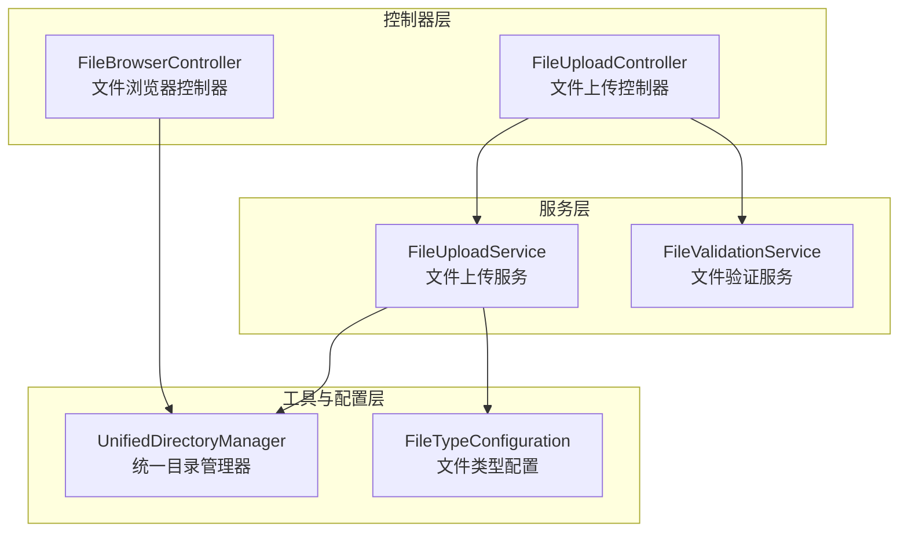
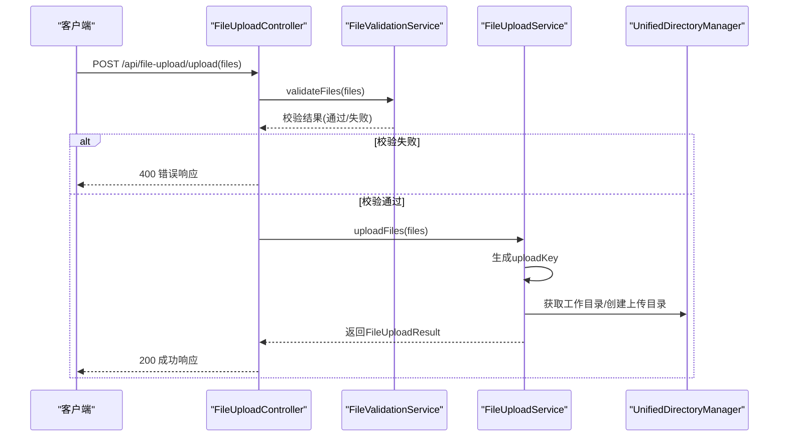
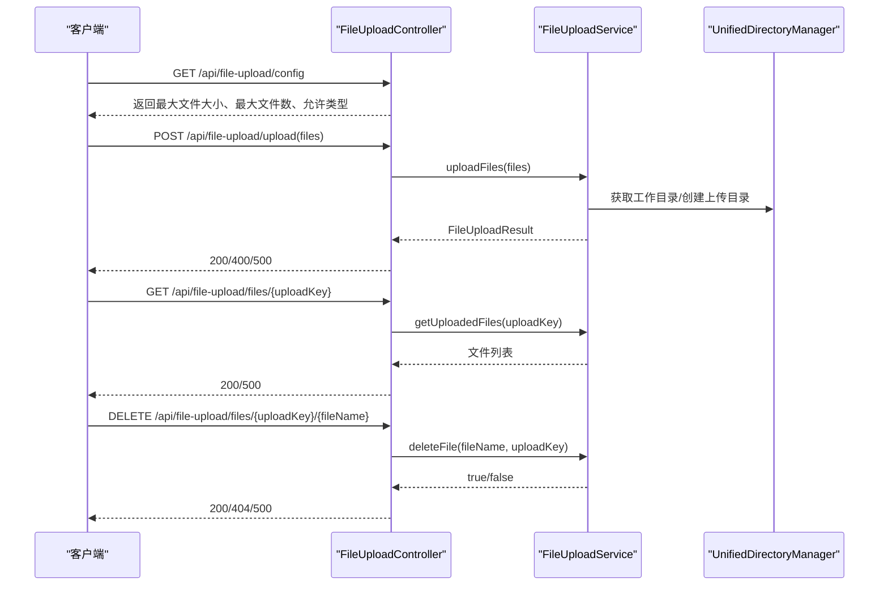
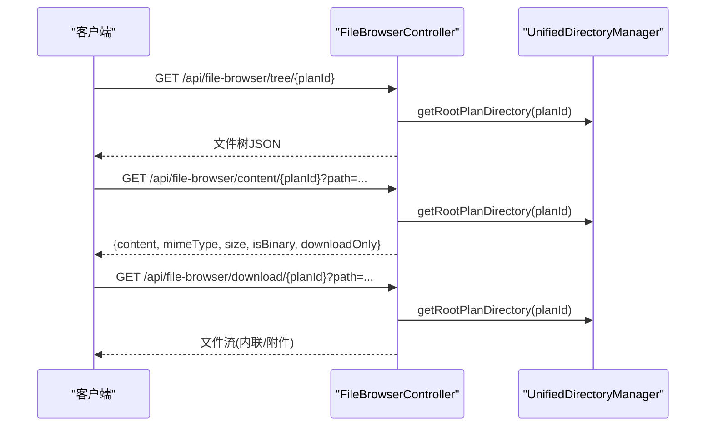
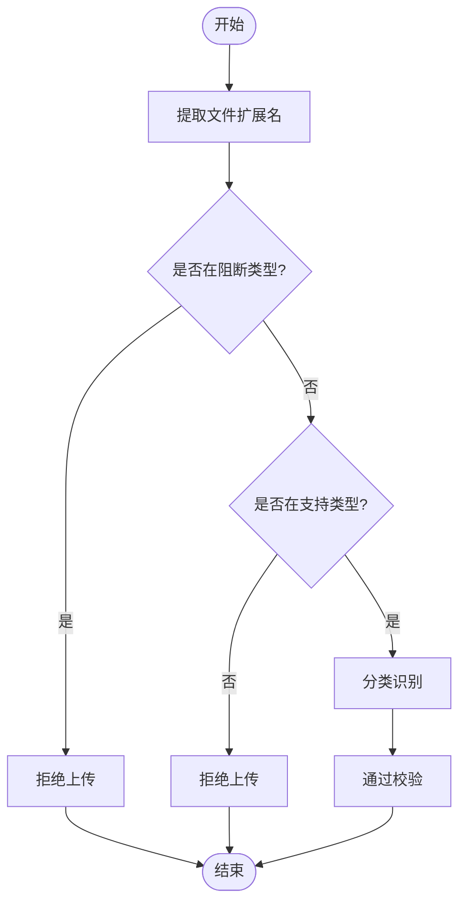
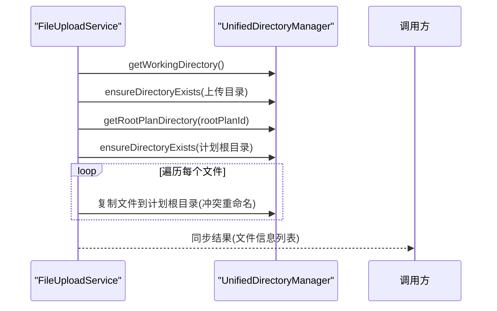
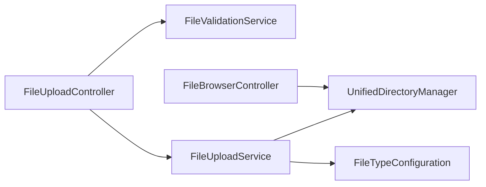

# 文件上传接口

<cite>
**本文档引用的文件**
- [FileUploadController.java](file://src/main/java/com/alibaba/cloud/ai/lynxe/runtime/controller/FileUploadController.java)
- [FileBrowserController.java](file://src/main/java/com/alibaba/cloud/ai/lynxe/runtime/controller/FileBrowserController.java)
- [FileUploadService.java](file://src/main/java/com/alibaba/cloud/ai/lynxe/runtime/service/FileUploadService.java)
- [FileValidationService.java](file://src/main/java/com/alibaba/cloud/ai/lynxe/runtime/service/FileValidationService.java)
- [UnifiedDirectoryManager.java](file://src/main/java/com/alibaba/cloud/ai/lynxe/tool/filesystem/UnifiedDirectoryManager.java)
- [FileTypeConfiguration.java](file://src/main/java/com/alibaba/cloud/ai/lynxe/config/FileTypeConfiguration.java)
</cite>

## 目录
1. [简介](#简介)
2. [项目结构](#项目结构)
3. [核心组件](#核心组件)
4. [架构总览](#架构总览)
5. [详细组件分析](#详细组件分析)
6. [依赖关系分析](#依赖关系分析)
7. [性能考虑](#性能考虑)
8. [故障排除指南](#故障排除指南)
9. [结论](#结论)

## 简介
本文件上传接口文档面向Lynxe平台的文件上传、批量上传与临时会话管理，以及文件浏览器的目录浏览、内容读取与下载能力。文档同时覆盖文件类型校验、安全限制、上传配置查询、文件同步至计划执行目录等关键流程，并对断点续传、预览与缩略图、安全扫描与内容过滤、分布式存储与高可用、同步备份与版本管理、权限控制与审计合规等扩展能力给出设计建议与实现路径指引。

## 项目结构
围绕文件上传与文件浏览的核心模块如下：
- 控制器层：负责HTTP请求处理与响应封装
  - 文件上传控制器：处理单/多文件上传、查询已上传文件、删除文件、查询上传配置
  - 文件浏览器控制器：构建文件树、读取文件内容（文本/二进制）、下载文件
- 服务层：实现业务逻辑与流程编排
  - 文件上传服务：生成上传会话键、校验与保存文件、同步到计划目录、查询与删除
  - 文件验证服务：基于文件类型配置进行白名单/黑名单校验
- 工具与配置层
  - 统一目录管理器：统一工作目录、计划根目录、符号链接与路径安全校验
  - 文件类型配置：集中式支持/阻断类型管理

图表来源
- [FileUploadController.java:35-301](file://src/main/java/com/alibaba/cloud/ai/lynxe/runtime/controller/FileUploadController.java#L35-L301)
- [FileBrowserController.java:45-534](file://src/main/java/com/alibaba/cloud/ai/lynxe/runtime/controller/FileBrowserController.java#L45-L534)
- [FileUploadService.java:37-588](file://src/main/java/com/alibaba/cloud/ai/lynxe/runtime/service/FileUploadService.java#L37-L588)
- [FileValidationService.java:28-141](file://src/main/java/com/alibaba/cloud/ai/lynxe/runtime/service/FileValidationService.java#L28-L141)
- [UnifiedDirectoryManager.java:32-715](file://src/main/java/com/alibaba/cloud/ai/lynxe/tool/filesystem/UnifiedDirectoryManager.java#L32-L715)
- [FileTypeConfiguration.java:24-135](file://src/main/java/com/alibaba/cloud/ai/lynxe/config/FileTypeConfiguration.java#L24-L135)

章节来源
- [FileUploadController.java:35-301](file://src/main/java/com/alibaba/cloud/ai/lynxe/runtime/controller/FileUploadController.java#L35-L301)
- [FileBrowserController.java:45-534](file://src/main/java/com/alibaba/cloud/ai/lynxe/runtime/controller/FileBrowserController.java#L45-L534)
- [FileUploadService.java:37-588](file://src/main/java/com/alibaba/cloud/ai/lynxe/runtime/service/FileUploadService.java#L37-L588)
- [FileValidationService.java:28-141](file://src/main/java/com/alibaba/cloud/ai/lynxe/runtime/service/FileValidationService.java#L28-L141)
- [UnifiedDirectoryManager.java:32-715](file://src/main/java/com/alibaba/cloud/ai/lynxe/tool/filesystem/UnifiedDirectoryManager.java#L32-L715)
- [FileTypeConfiguration.java:24-135](file://src/main/java/com/alibaba/cloud/ai/lynxe/config/FileTypeConfiguration.java#L24-L135)

## 核心组件
- 文件上传控制器
  - 提供上传、查询、删除、配置查询等接口
  - 负责调用文件验证服务与文件上传服务
- 文件上传服务
  - 生成唯一上传会话键
  - 校验文件大小、数量与类型
  - 将文件写入临时目录
  - 支持同步到计划根目录与查询同步结果
- 文件验证服务
  - 基于文件类型配置进行白名单/黑名单校验
- 文件浏览器控制器
  - 构建文件树（含符号链接检测）
  - 安全读取文件内容（文本/二进制/Base64编码）
  - 提供下载接口（内联/附件）
- 统一目录管理器
  - 统一工作目录与计划根目录
  - 路径安全校验与符号链接处理
- 文件类型配置
  - 集中式维护支持/阻断类型集合

章节来源
- [FileUploadController.java:51-182](file://src/main/java/com/alibaba/cloud/ai/lynxe/runtime/controller/FileUploadController.java#L51-L182)
- [FileUploadService.java:64-139](file://src/main/java/com/alibaba/cloud/ai/lynxe/runtime/service/FileUploadService.java#L64-L139)
- [FileValidationService.java:39-85](file://src/main/java/com/alibaba/cloud/ai/lynxe/runtime/service/FileValidationService.java#L39-L85)
- [FileBrowserController.java:143-385](file://src/main/java/com/alibaba/cloud/ai/lynxe/runtime/controller/FileBrowserController.java#L143-L385)
- [UnifiedDirectoryManager.java:143-276](file://src/main/java/com/alibaba/cloud/ai/lynxe/tool/filesystem/UnifiedDirectoryManager.java#L143-L276)
- [FileTypeConfiguration.java:67-102](file://src/main/java/com/alibaba/cloud/ai/lynxe/config/FileTypeConfiguration.java#L67-L102)

## 架构总览
下图展示从客户端到后端服务的典型调用链路，涵盖上传、验证、存储与同步流程。

图表来源
- [FileUploadController.java:56-94](file://src/main/java/com/alibaba/cloud/ai/lynxe/runtime/controller/FileUploadController.java#L56-L94)
- [FileValidationService.java:72-85](file://src/main/java/com/alibaba/cloud/ai/lynxe/runtime/service/FileValidationService.java#L72-L85)
- [FileUploadService.java:86-139](file://src/main/java/com/alibaba/cloud/ai/lynxe/runtime/service/FileUploadService.java#L86-L139)
- [UnifiedDirectoryManager.java:143-167](file://src/main/java/com/alibaba/cloud/ai/lynxe/tool/filesystem/UnifiedDirectoryManager.java#L143-L167)

## 详细组件分析

### 文件上传接口
- 接口定义
  - 单/批量上传：POST /api/file-upload/upload
  - 查询上传文件：GET /api/file-upload/files/{uploadKey}
  - 删除文件：DELETE /api/file-upload/files/{uploadKey}/{fileName}
  - 获取上传配置：GET /api/file-upload/config
- 行为特性
  - 上传前进行文件类型与大小校验
  - 生成唯一上传会话键，文件保存在工作目录下的临时上传目录
  - 支持将临时上传文件同步到计划根目录，便于后续工具使用
  - 返回标准化的上传结果对象，包含成功/失败统计与文件列表
- 数据模型
  - 上传结果对象包含上传键、文件列表、成功/失败计数等字段
  - 删除响应包含成功状态、消息与错误信息

图表来源
- [FileUploadController.java:56-182](file://src/main/java/com/alibaba/cloud/ai/lynxe/runtime/controller/FileUploadController.java#L56-L182)
- [FileUploadService.java:86-281](file://src/main/java/com/alibaba/cloud/ai/lynxe/runtime/service/FileUploadService.java#L86-L281)
- [UnifiedDirectoryManager.java:143-167](file://src/main/java/com/alibaba/cloud/ai/lynxe/tool/filesystem/UnifiedDirectoryManager.java#L143-L167)

章节来源
- [FileUploadController.java:51-182](file://src/main/java/com/alibaba/cloud/ai/lynxe/runtime/controller/FileUploadController.java#L51-L182)
- [FileUploadService.java:86-281](file://src/main/java/com/alibaba/cloud/ai/lynxe/runtime/service/FileUploadService.java#L86-L281)

### 文件浏览器接口
- 接口定义
  - 获取文件树：GET /api/file-browser/tree/{planId}
  - 读取文件内容：GET /api/file-browser/content/{planId}?path=...
  - 下载文件：GET /api/file-browser/download/{planId}?path=...
- 行为特性
  - 文件树构建时进行符号链接循环检测与安全遍历
  - 内容读取区分文本/二进制/下载型文件，自动探测MIME类型
  - 下载接口根据文件类型决定内联显示或附件下载
  - 所有路径均进行安全校验，防止越权访问
- 数据模型
  - 文件节点包含名称、路径、类型、大小、修改时间与子节点
  - 内容读取返回内容体（文本或Base64）与元数据

图表来源
- [FileBrowserController.java:143-385](file://src/main/java/com/alibaba/cloud/ai/lynxe/runtime/controller/FileBrowserController.java#L143-L385)
- [UnifiedDirectoryManager.java:153-167](file://src/main/java/com/alibaba/cloud/ai/lynxe/tool/filesystem/UnifiedDirectoryManager.java#L153-L167)

章节来源
- [FileBrowserController.java:138-385](file://src/main/java/com/alibaba/cloud/ai/lynxe/runtime/controller/FileBrowserController.java#L138-L385)
- [UnifiedDirectoryManager.java:143-276](file://src/main/java/com/alibaba/cloud/ai/lynxe/tool/filesystem/UnifiedDirectoryManager.java#L143-L276)

### 文件类型校验与安全限制
- 校验流程
  - 基于文件名扩展名判断是否在阻断类型集合中
  - 判断是否属于支持类型集合
  - 返回分类信息（文档/电子表格/代码/Web/配置/其他/阻断/未知）
- 配置要点
  - 支持类型与阻断类型集中维护，便于统一管控
  - 前端可直接使用支持类型字符串进行提示

图表来源
- [FileValidationService.java:39-67](file://src/main/java/com/alibaba/cloud/ai/lynxe/runtime/service/FileValidationService.java#L39-L67)
- [FileTypeConfiguration.java:67-102](file://src/main/java/com/alibaba/cloud/ai/lynxe/config/FileTypeConfiguration.java#L67-L102)

章节来源
- [FileValidationService.java:39-85](file://src/main/java/com/alibaba/cloud/ai/lynxe/runtime/service/FileValidationService.java#L39-L85)
- [FileTypeConfiguration.java:67-102](file://src/main/java/com/alibaba/cloud/ai/lynxe/config/FileTypeConfiguration.java#L67-L102)

### 上传会话与同步机制
- 上传会话
  - 生成唯一uploadKey，文件保存在工作目录的临时上传目录
  - 支持批量上传，逐个文件校验与落盘
- 同步到计划目录
  - 将临时上传目录中的文件复制到计划根目录
  - 若目标存在则生成唯一文件名避免冲突
  - 返回同步后的文件信息列表

图表来源
- [FileUploadService.java:405-510](file://src/main/java/com/alibaba/cloud/ai/lynxe/runtime/service/FileUploadService.java#L405-L510)
- [UnifiedDirectoryManager.java:153-167](file://src/main/java/com/alibaba/cloud/ai/lynxe/tool/filesystem/UnifiedDirectoryManager.java#L153-L167)

章节来源
- [FileUploadService.java:405-510](file://src/main/java/com/alibaba/cloud/ai/lynxe/runtime/service/FileUploadService.java#L405-L510)
- [UnifiedDirectoryManager.java:153-167](file://src/main/java/com/alibaba/cloud/ai/lynxe/tool/filesystem/UnifiedDirectoryManager.java#L153-L167)

## 依赖关系分析
- 控制器依赖服务，服务依赖统一目录管理器与文件类型配置
- 文件浏览器控制器直接依赖统一目录管理器进行路径解析与安全校验
- 文件验证服务依赖文件类型配置进行白名单/黑名单判定

图表来源
- [FileUploadController.java:45-49](file://src/main/java/com/alibaba/cloud/ai/lynxe/runtime/controller/FileUploadController.java#L45-L49)
- [FileUploadService.java:45-46](file://src/main/java/com/alibaba/cloud/ai/lynxe/runtime/service/FileUploadService.java#L45-L46)
- [FileValidationService.java:23-23](file://src/main/java/com/alibaba/cloud/ai/lynxe/runtime/service/FileValidationService.java#L23-L23)
- [FileBrowserController.java:52-56](file://src/main/java/com/alibaba/cloud/ai/lynxe/runtime/controller/FileBrowserController.java#L52-L56)
- [UnifiedDirectoryManager.java:126-129](file://src/main/java/com/alibaba/cloud/ai/lynxe/tool/filesystem/UnifiedDirectoryManager.java#L126-L129)
- [FileTypeConfiguration.java:32-33](file://src/main/java/com/alibaba/cloud/ai/lynxe/config/FileTypeConfiguration.java#L32-L33)

章节来源
- [FileUploadController.java:45-49](file://src/main/java/com/alibaba/cloud/ai/lynxe/runtime/controller/FileUploadController.java#L45-L49)
- [FileUploadService.java:45-46](file://src/main/java/com/alibaba/cloud/ai/lynxe/runtime/service/FileUploadService.java#L45-L46)
- [FileValidationService.java:23-23](file://src/main/java/com/alibaba/cloud/ai/lynxe/runtime/service/FileValidationService.java#L23-L23)
- [FileBrowserController.java:52-56](file://src/main/java/com/alibaba/cloud/ai/lynxe/runtime/controller/FileBrowserController.java#L52-L56)
- [UnifiedDirectoryManager.java:126-129](file://src/main/java/com/alibaba/cloud/ai/lynxe/tool/filesystem/UnifiedDirectoryManager.java#L126-L129)
- [FileTypeConfiguration.java:32-33](file://src/main/java/com/alibaba/cloud/ai/lynxe/config/FileTypeConfiguration.java#L32-L33)

## 性能考虑
- 上传性能
  - 使用流式写入与标准复制选项，避免不必要的内存拷贝
  - 批量上传时逐个文件校验与落盘，便于快速失败与错误定位
- 存储与IO
  - 统一工作目录与计划根目录分离，减少跨卷移动开销
  - 符号链接仅用于外部文件夹映射，不参与频繁IO路径
- 并发与会话
  - 上传键包含时间戳与线程ID，降低并发冲突概率
- 建议
  - 对大文件上传建议采用分片/断点续传方案（见扩展能力建议）

## 故障排除指南
- 常见错误与排查
  - 文件类型被阻断：检查扩展名是否在阻断集合中
  - 文件类型不受支持：确认扩展名是否在支持集合中
  - 超出最大文件大小或文件数量：调整上传配置或拆分文件
  - 路径越权访问：确保请求路径位于计划根目录内
  - 符号链接循环：系统会自动跳过循环引用，检查链接目标有效性
- 日志与监控
  - 控制器与服务层均输出详细日志，便于定位问题
  - 建议在网关或反向代理层记录请求耗时与错误码

章节来源
- [FileValidationService.java:39-67](file://src/main/java/com/alibaba/cloud/ai/lynxe/runtime/service/FileValidationService.java#L39-L67)
- [FileUploadService.java:287-330](file://src/main/java/com/alibaba/cloud/ai/lynxe/runtime/service/FileUploadService.java#L287-L330)
- [FileBrowserController.java:181-185](file://src/main/java/com/alibaba/cloud/ai/lynxe/runtime/controller/FileBrowserController.java#L181-L185)
- [UnifiedDirectoryManager.java:450-455](file://src/main/java/com/alibaba/cloud/ai/lynxe/tool/filesystem/UnifiedDirectoryManager.java#L450-L455)

## 结论
Lynxe的文件上传与文件浏览能力以清晰的分层架构实现：控制器负责协议与参数处理，服务层承载业务流程，工具层提供统一目录与安全校验，配置层集中管理文件类型策略。当前实现支持单/批量上传、临时会话管理、文件同步至计划目录、安全的内容读取与下载。对于断点续传、预览与缩略图、安全扫描与内容过滤、分布式存储与高可用、同步备份与版本管理、权限控制与审计合规等高级能力，可在现有架构基础上通过扩展服务与适配器模式平滑集成。