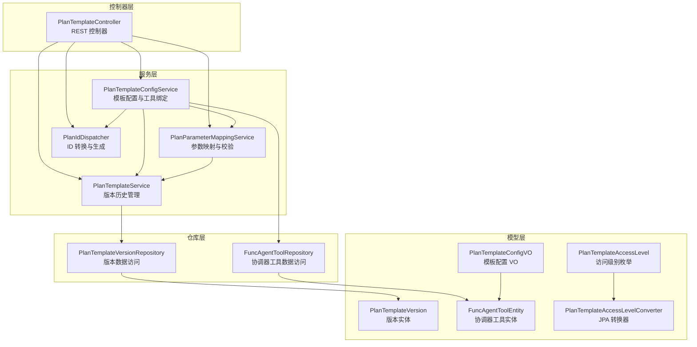
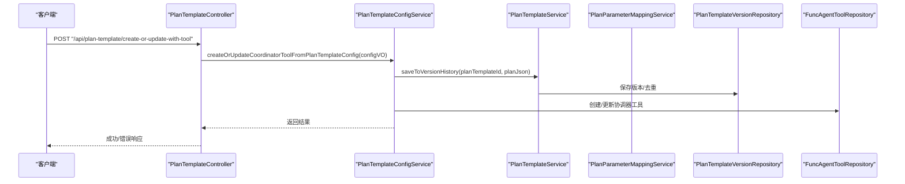
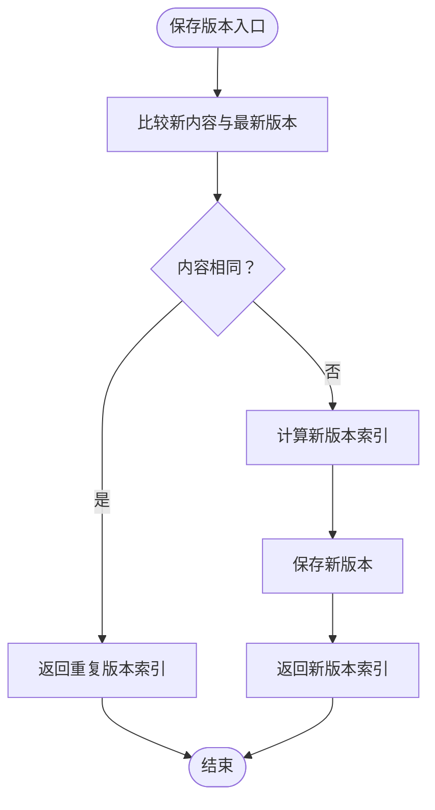
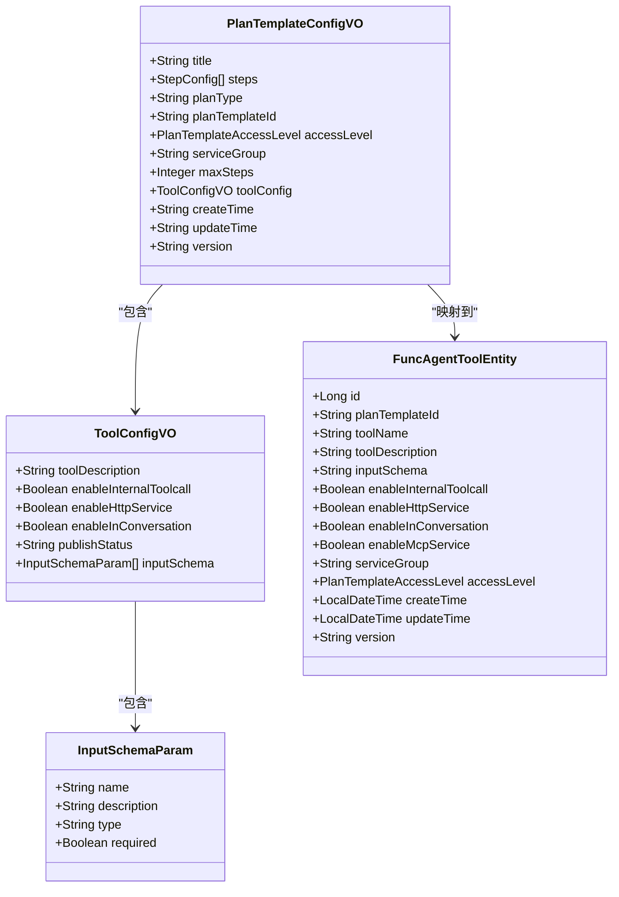
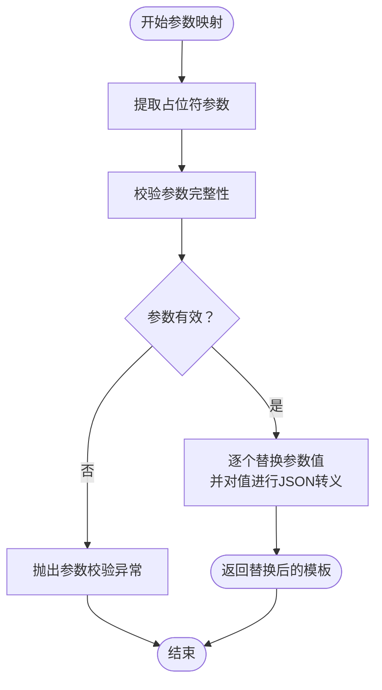
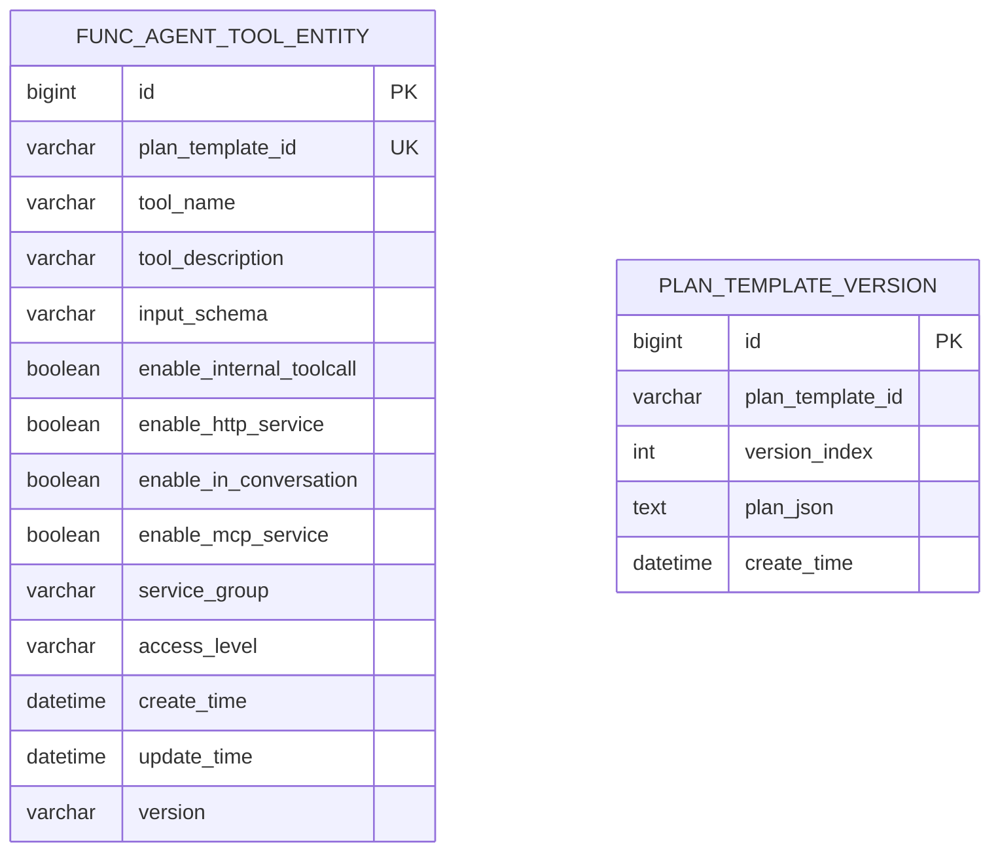
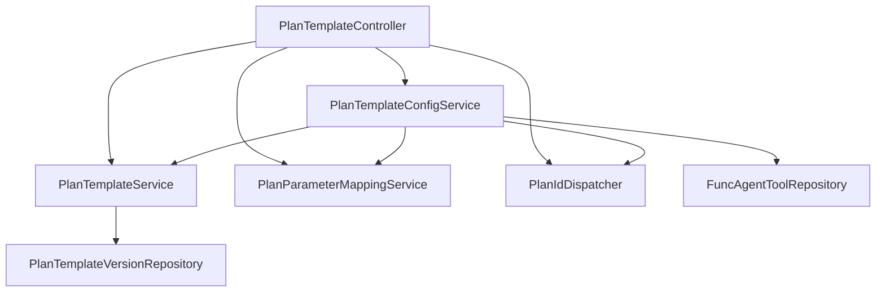

# 计划模板接口

<cite>
**本文档引用的文件**
- [PlanTemplateController.java](file://src/main/java/com/alibaba/cloud/ai/lynxe/planning/controller/PlanTemplateController.java)
- [PlanTemplateService.java](file://src/main/java/com/alibaba/cloud/ai/lynxe/planning/service/PlanTemplateService.java)
- [PlanTemplateConfigService.java](file://src/main/java/com/alibaba/cloud/ai/lynxe/planning/service/PlanTemplateConfigService.java)
- [PlanParameterMappingService.java](file://src/main/java/com/alibaba/cloud/ai/lynxe/planning/service/PlanParameterMappingService.java)
- [PlanTemplateService.java](file://src/main/java/com/alibaba/cloud/ai/lynxe/planning/service/IPlanTemplateService.java)
- [PlanTemplateVersionRepository.java](file://src/main/java/com/alibaba/cloud/ai/lynxe/planning/repository/PlanTemplateVersionRepository.java)
- [PlanTemplateVersion.java](file://src/main/java/com/alibaba/cloud/ai/lynxe/planning/model/po/PlanTemplateVersion.java)
- [PlanTemplateConfigVO.java](file://src/main/java/com/alibaba/cloud/ai/lynxe/planning/model/vo/PlanTemplateConfigVO.java)
- [FuncAgentToolEntity.java](file://src/main/java/com/alibaba/cloud/ai/lynxe/planning/model/po/FuncAgentToolEntity.java)
- [FuncAgentToolRepository.java](file://src/main/java/com/alibaba/cloud/ai/lynxe/planning/repository/FuncAgentToolRepository.java)
- [PlanTemplateAccessLevel.java](file://src/main/java/com/alibaba/cloud/ai/lynxe/planning/model/enums/PlanTemplateAccessLevel.java)
- [PlanTemplateAccessLevelConverter.java](file://src/main/java/com/alibaba/cloud/ai/lynxe/planning/model/converter/PlanTemplateAccessLevelConverter.java)
- [PlanTemplateConfigException.java](file://src/main/java/com/alibaba/cloud/ai/lynxe/planning/exception/PlanTemplateConfigException.java)
- [PlanIdDispatcher.java](file://src/main/java/com/alibaba/cloud/ai/lynxe/runtime/service/PlanIdDispatcher.java)
</cite>

## 目录
1. [简介](#简介)
2. [项目结构](#项目结构)
3. [核心组件](#核心组件)
4. [架构总览](#架构总览)
5. [详细组件分析](#详细组件分析)
6. [依赖关系分析](#依赖关系分析)
7. [性能考虑](#性能考虑)
8. [故障排除指南](#故障排除指南)
9. [结论](#结论)
10. [附录](#附录)

## 简介
本文件为 Lynxe 计划模板接口的完整 API 文档，覆盖计划模板的创建、编辑、删除与复制（通过版本历史）等管理操作；模板参数配置、工具绑定与执行流程定义；模板导入导出、版本管理与共享发布；模板验证机制、依赖检查与冲突解决策略；模板执行的参数映射、动态配置与运行时调整；以及性能优化、缓存管理与批量处理接口。同时记录权限控制、访问日志与审计追踪能力。

## 项目结构
计划模板相关代码位于后端模块的 planning 包中，采用分层架构：控制器层负责对外暴露 REST 接口，服务层封装业务逻辑，仓库层负责数据持久化，模型层定义 VO/实体与枚举。

**图表来源**
- [PlanTemplateController.java:51-637](file://src/main/java/com/alibaba/cloud/ai/lynxe/planning/controller/PlanTemplateController.java#L51-L637)
- [PlanTemplateService.java:35-206](file://src/main/java/com/alibaba/cloud/ai/lynxe/planning/service/PlanTemplateService.java#L35-L206)
- [PlanTemplateConfigService.java:43-800](file://src/main/java/com/alibaba/cloud/ai/lynxe/planning/service/PlanTemplateConfigService.java#L43-L800)
- [PlanParameterMappingService.java:36-335](file://src/main/java/com/alibaba/cloud/ai/lynxe/planning/service/PlanParameterMappingService.java#L36-L335)
- [PlanTemplateVersionRepository.java:30-65](file://src/main/java/com/alibaba/cloud/ai/lynxe/planning/repository/PlanTemplateVersionRepository.java#L30-L65)
- [FuncAgentToolRepository.java:29-58](file://src/main/java/com/alibaba/cloud/ai/lynxe/planning/repository/FuncAgentToolRepository.java#L29-L58)
- [PlanTemplateConfigVO.java:30-435](file://src/main/java/com/alibaba/cloud/ai/lynxe/planning/model/vo/PlanTemplateConfigVO.java#L30-L435)
- [PlanTemplateVersion.java:31-104](file://src/main/java/com/alibaba/cloud/ai/lynxe/planning/model/po/PlanTemplateVersion.java#L31-L104)
- [FuncAgentToolEntity.java:36-236](file://src/main/java/com/alibaba/cloud/ai/lynxe/planning/model/po/FuncAgentToolEntity.java#L36-L236)
- [PlanTemplateAccessLevel.java:24-80](file://src/main/java/com/alibaba/cloud/ai/lynxe/planning/model/enums/PlanTemplateAccessLevel.java#L24-L80)
- [PlanTemplateAccessLevelConverter.java:27-44](file://src/main/java/com/alibaba/cloud/ai/lynxe/planning/model/converter/PlanTemplateAccessLevelConverter.java#L27-L44)
- [PlanIdDispatcher.java:27-292](file://src/main/java/com/alibaba/cloud/ai/lynxe/runtime/service/PlanIdDispatcher.java#L27-L292)

**章节来源**
- [PlanTemplateController.java:51-637](file://src/main/java/com/alibaba/cloud/ai/lynxe/planning/controller/PlanTemplateController.java#L51-L637)
- [PlanTemplateService.java:35-206](file://src/main/java/com/alibaba/cloud/ai/lynxe/planning/service/PlanTemplateService.java#L35-L206)
- [PlanTemplateConfigService.java:43-800](file://src/main/java/com/alibaba/cloud/ai/lynxe/planning/service/PlanTemplateConfigService.java#L43-L800)

## 核心组件
- 计划模板控制器：提供版本查询、版本获取、模板列表、删除、参数需求、创建/更新模板并注册为工具、导出导入、配置获取与 ID 生成等接口。
- 版本服务：管理模板版本历史，去重保存，比较 JSON 内容等价性，提供版本列表与指定版本读取。
- 配置服务：将模板配置转换为数据库实体，生成输入参数模式，处理工具绑定与协调器工具的创建/更新/删除。
- 参数映射服务：提取模板中的占位符参数，进行参数完整性校验与安全替换，支持参数格式要求提示。
- 数据访问层：版本与协调器工具的数据持久化接口。
- 模型与枚举：配置 VO、版本实体、协调器工具实体、访问级别枚举及 JPA 转换器。

**章节来源**
- [PlanTemplateController.java:51-637](file://src/main/java/com/alibaba/cloud/ai/lynxe/planning/controller/PlanTemplateController.java#L51-L637)
- [PlanTemplateService.java:35-206](file://src/main/java/com/alibaba/cloud/ai/lynxe/planning/service/PlanTemplateService.java#L35-L206)
- [PlanTemplateConfigService.java:43-800](file://src/main/java/com/alibaba/cloud/ai/lynxe/planning/service/PlanTemplateConfigService.java#L43-L800)
- [PlanParameterMappingService.java:36-335](file://src/main/java/com/alibaba/cloud/ai/lynxe/planning/service/PlanParameterMappingService.java#L36-L335)

## 架构总览
下图展示计划模板接口在系统中的交互关系与数据流：

**图表来源**
- [PlanTemplateController.java:339-391](file://src/main/java/com/alibaba/cloud/ai/lynxe/planning/controller/PlanTemplateController.java#L339-L391)
- [PlanTemplateConfigService.java:497-561](file://src/main/java/com/alibaba/cloud/ai/lynxe/planning/service/PlanTemplateConfigService.java#L497-L561)
- [PlanTemplateService.java:90-110](file://src/main/java/com/alibaba/cloud/ai/lynxe/planning/service/PlanTemplateService.java#L90-L110)
- [PlanTemplateVersionRepository.java:30-65](file://src/main/java/com/alibaba/cloud/ai/lynxe/planning/repository/PlanTemplateVersionRepository.java#L30-L65)
- [FuncAgentToolRepository.java:29-58](file://src/main/java/com/alibaba/cloud/ai/lynxe/planning/repository/FuncAgentToolRepository.java#L29-L58)

## 详细组件分析

### 计划模板控制器 API 规范
- 获取版本历史
  - 方法：POST /api/plan-template/versions
  - 请求体：{"planId": "模板ID"}
  - 响应：包含版本数量与版本索引列表
- 获取指定版本
  - 方法：POST /api/plan-template/get-version
  - 请求体：{"planId": "模板ID", "versionIndex": "版本索引"}
  - 响应：返回该版本的 JSON 字符串
- 获取所有模板
  - 方法：GET /api/plan-template/list
  - 响应：模板列表与计数
- 删除模板
  - 方法：POST /api/plan-template/delete
  - 请求体：{"planId": "模板ID"}
  - 响应：成功/失败消息
- 获取模板参数需求
  - 方法：GET /api/plan-template/{planTemplateId}/parameters
  - 响应：参数列表、是否需要参数、参数要求说明
- 创建或更新模板并注册为工具
  - 方法：POST /api/plan-template/create-or-update-with-tool
  - 请求体：PlanTemplateConfigVO（含步骤、类型、访问级别、服务组、最大步数、工具配置）
  - 响应：成功标志、模板ID、是否已注册工具
- 获取所有模板配置（含工具配置）
  - 方法：GET /api/plan-template/list-config
  - 响应：PlanTemplateConfigVO 列表
- 导出所有模板
  - 方法：GET /api/plan-template/export-all
  - 响应：PlanTemplateConfigVO 列表
- 导入模板
  - 方法：POST /api/plan-template/import-all
  - 请求体：PlanTemplateConfigVO 列表
  - 响应：导入结果统计
- 获取单个模板配置
  - 方法：GET /api/plan-template/{planTemplateId}/config
  - 响应：PlanTemplateConfigVO（含步骤、类型、访问级别、服务组、最大步数、工具配置）
- 生成模板ID
  - 方法：GET /api/plan-template/generate-plan-template-id
  - 响应：新模板ID

**章节来源**
- [PlanTemplateController.java:150-634](file://src/main/java/com/alibaba/cloud/ai/lynxe/planning/controller/PlanTemplateController.java#L150-L634)

### 版本管理与复制（基于版本历史）
- 版本保存与去重：当新内容与最新版本相同则不保存，避免冗余版本。
- 版本列表与指定版本读取：按版本索引有序存储与检索。
- 复制语义：通过“保存到版本历史”实现模板复制（新版本），并自动去重。

**图表来源**
- [PlanTemplateService.java:90-110](file://src/main/java/com/alibaba/cloud/ai/lynxe/planning/service/PlanTemplateService.java#L90-L110)
- [PlanTemplateVersionRepository.java:39-56](file://src/main/java/com/alibaba/cloud/ai/lynxe/planning/repository/PlanTemplateVersionRepository.java#L39-L56)

**章节来源**
- [PlanTemplateService.java:90-203](file://src/main/java/com/alibaba/cloud/ai/lynxe/planning/service/PlanTemplateService.java#L90-L203)
- [PlanTemplateVersionRepository.java:30-65](file://src/main/java/com/alibaba/cloud/ai/lynxe/planning/repository/PlanTemplateVersionRepository.java#L30-L65)

### 模板参数配置与工具绑定
- 输入参数模式生成：从模板 JSON 中提取占位符参数，自动生成输入模式数组。
- 工具配置：支持内部工具调用、HTTP 服务、会话内调用、发布状态与输入模式。
- 协调器工具创建/更新：根据模板ID关联工具，自动刷新输入模式，设置访问级别与版本。

**图表来源**
- [PlanTemplateConfigVO.java:30-435](file://src/main/java/com/alibaba/cloud/ai/lynxe/planning/model/vo/PlanTemplateConfigVO.java#L30-L435)
- [FuncAgentToolEntity.java:40-236](file://src/main/java/com/alibaba/cloud/ai/lynxe/planning/model/po/FuncAgentToolEntity.java#L40-L236)

**章节来源**
- [PlanTemplateConfigService.java:76-151](file://src/main/java/com/alibaba/cloud/ai/lynxe/planning/service/PlanTemplateConfigService.java#L76-L151)
- [PlanTemplateConfigService.java:268-488](file://src/main/java/com/alibaba/cloud/ai/lynxe/planning/service/PlanTemplateConfigService.java#L268-L488)
- [PlanTemplateConfigService.java:497-561](file://src/main/java/com/alibaba/cloud/ai/lynxe/planning/service/PlanTemplateConfigService.java#L497-L561)
- [PlanTemplateConfigService.java:570-667](file://src/main/java/com/alibaba/cloud/ai/lynxe/planning/service/PlanTemplateConfigService.java#L570-L667)
- [PlanTemplateConfigService.java:722-797](file://src/main/java/com/alibaba/cloud/ai/lynxe/planning/service/PlanTemplateConfigService.java#L722-L797)

### 执行流程定义与参数映射
- 参数占位符提取：使用正则匹配 <<参数名>> 形式。
- 参数完整性校验：在替换前进行缺失参数检测，抛出异常并提供详细提示。
- 安全参数替换：对值进行 JSON 字符串转义，防止解析错误。
- 运行时动态配置：通过输入模式与参数映射服务实现动态参数注入。

**图表来源**
- [PlanParameterMappingService.java:134-149](file://src/main/java/com/alibaba/cloud/ai/lynxe/planning/service/PlanParameterMappingService.java#L134-L149)
- [PlanParameterMappingService.java:52-101](file://src/main/java/com/alibaba/cloud/ai/lynxe/planning/service/PlanParameterMappingService.java#L52-L101)
- [PlanParameterMappingService.java:189-246](file://src/main/java/com/alibaba/cloud/ai/lynxe/planning/service/PlanParameterMappingService.java#L189-L246)

**章节来源**
- [PlanParameterMappingService.java:36-335](file://src/main/java/com/alibaba/cloud/ai/lynxe/planning/service/PlanParameterMappingService.java#L36-L335)

### 权限控制、访问日志与审计追踪
- 访问级别：READ_ONLY 与 EDITABLE，通过枚举与 JPA 转换器持久化。
- 工具实体唯一约束：plan_template_id 与 (service_group, tool_name) 的唯一性，确保模板与工具的一致性。
- 审计字段：创建时间与更新时间自动维护，便于审计追踪。
- 日志记录：控制器与服务层广泛使用 SLF4J 记录关键操作与错误信息。

**图表来源**
- [FuncAgentToolEntity.java:36-236](file://src/main/java/com/alibaba/cloud/ai/lynxe/planning/model/po/FuncAgentToolEntity.java#L36-L236)
- [PlanTemplateVersion.java:31-104](file://src/main/java/com/alibaba/cloud/ai/lynxe/planning/model/po/PlanTemplateVersion.java#L31-L104)

**章节来源**
- [PlanTemplateAccessLevel.java:24-80](file://src/main/java/com/alibaba/cloud/ai/lynxe/planning/model/enums/PlanTemplateAccessLevel.java#L24-L80)
- [PlanTemplateAccessLevelConverter.java:27-44](file://src/main/java/com/alibaba/cloud/ai/lynxe/planning/model/converter/PlanTemplateAccessLevelConverter.java#L27-L44)
- [FuncAgentToolRepository.java:30-57](file://src/main/java/com/alibaba/cloud/ai/lynxe/planning/repository/FuncAgentToolRepository.java#L30-L57)

### 导入导出与批量处理
- 导出：获取所有模板配置（含工具配置）。
- 导入：批量导入模板配置，返回导入结果统计。
- 批量处理：通过列表形式进行导入，内部进行逐条处理与异常捕获。

**章节来源**
- [PlanTemplateController.java:489-528](file://src/main/java/com/alibaba/cloud/ai/lynxe/planning/controller/PlanTemplateController.java#L489-L528)
- [PlanTemplateController.java:397-483](file://src/main/java/com/alibaba/cloud/ai/lynxe/planning/controller/PlanTemplateController.java#L397-L483)

### 共享发布与版本管理
- 发布状态：工具配置包含发布状态字段，用于控制共享发布。
- 版本管理：版本历史按索引递增，支持版本对比与去重保存。
- ID 生成：模板ID与执行ID分离，模板ID统一前缀，便于跨系统兼容。

**章节来源**
- [PlanTemplateConfigVO.java:277-361](file://src/main/java/com/alibaba/cloud/ai/lynxe/planning/model/vo/PlanTemplateConfigVO.java#L277-L361)
- [PlanTemplateService.java:90-110](file://src/main/java/com/alibaba/cloud/ai/lynxe/planning/service/PlanTemplateService.java#L90-L110)
- [PlanIdDispatcher.java:114-129](file://src/main/java/com/alibaba/cloud/ai/lynxe/runtime/service/PlanIdDispatcher.java#L114-L129)

## 依赖关系分析

**图表来源**
- [PlanTemplateController.java:57-74](file://src/main/java/com/alibaba/cloud/ai/lynxe/planning/controller/PlanTemplateController.java#L57-L74)
- [PlanTemplateConfigService.java:48-67](file://src/main/java/com/alibaba/cloud/ai/lynxe/planning/service/PlanTemplateConfigService.java#L48-L67)
- [PlanTemplateService.java:40-44](file://src/main/java/com/alibaba/cloud/ai/lynxe/planning/service/PlanTemplateService.java#L40-L44)
- [PlanParameterMappingService.java:36-37](file://src/main/java/com/alibaba/cloud/ai/lynxe/planning/service/PlanParameterMappingService.java#L36-L37)
- [PlanIdDispatcher.java:27-28](file://src/main/java/com/alibaba/cloud/ai/lynxe/runtime/service/PlanIdDispatcher.java#L27-L28)

**章节来源**
- [PlanTemplateController.java:57-74](file://src/main/java/com/alibaba/cloud/ai/lynxe/planning/controller/PlanTemplateController.java#L57-L74)
- [PlanTemplateConfigService.java:48-67](file://src/main/java/com/alibaba/cloud/ai/lynxe/planning/service/PlanTemplateConfigService.java#L48-L67)

## 性能考虑
- 版本去重：保存前比较最新版本内容，避免重复写入，降低存储与IO压力。
- JSON 比较：优先字符串比较，失败再解析树结构，兼顾性能与准确性。
- 批量导入：通过列表一次性处理，减少多次往返开销。
- 唯一约束：利用数据库唯一约束避免重复记录，减少应用层判断成本。
- 日志分级：仅在必要时记录详细日志，避免生产环境过度 IO。

[本节为通用指导，无需特定文件来源]

## 故障排除指南
- 参数校验失败：检查模板中占位符与传入参数是否一致，注意大小写与命名规则。
- 模板ID冲突：导入/创建时若存在唯一约束冲突，系统会尝试清理旧记录并重试。
- 工具配置异常：确认工具描述、输入模式与模板参数一致性，确保启用内部工具调用。
- 版本未更新：确认新内容与最新版本是否相同，相同内容不会产生新版本。
- 权限限制：READ_ONLY 模板无法直接修改，需调整访问级别或复制后编辑。

**章节来源**
- [PlanParameterMappingService.java:302-332](file://src/main/java/com/alibaba/cloud/ai/lynxe/planning/service/PlanParameterMappingService.java#L302-L332)
- [PlanTemplateConfigService.java:425-487](file://src/main/java/com/alibaba/cloud/ai/lynxe/planning/service/PlanTemplateConfigService.java#L425-L487)
- [PlanTemplateConfigService.java:570-667](file://src/main/java/com/alibaba/cloud/ai/lynxe/planning/service/PlanTemplateConfigService.java#L570-L667)
- [PlanTemplateService.java:90-110](file://src/main/java/com/alibaba/cloud/ai/lynxe/planning/service/PlanTemplateService.java#L90-L110)
- [PlanTemplateAccessLevel.java:24-80](file://src/main/java/com/alibaba/cloud/ai/lynxe/planning/model/enums/PlanTemplateAccessLevel.java#L24-L80)

## 结论
Lynxe 计划模板接口提供了完善的模板生命周期管理、参数映射与工具绑定能力，并通过版本历史实现模板复制与审计。配合权限控制、唯一约束与日志记录，系统在保证安全性的同时具备良好的可扩展性与可维护性。建议在生产环境中结合批量导入、版本去重与参数校验策略，进一步提升稳定性与性能。

[本节为总结性内容，无需特定文件来源]

## 附录

### API 一览表
- GET /api/plan-template/list：获取所有模板
- POST /api/plan-template/versions：获取版本历史
- POST /api/plan-template/get-version：获取指定版本
- POST /api/plan-template/delete：删除模板
- GET /api/plan-template/{planTemplateId}/parameters：获取参数需求
- POST /api/plan-template/create-or-update-with-tool：创建/更新模板并注册为工具
- GET /api/plan-template/list-config：获取所有模板配置
- GET /api/plan-template/export-all：导出所有模板
- POST /api/plan-template/import-all：导入模板
- GET /api/plan-template/{planTemplateId}/config：获取单个模板配置
- GET /api/plan-template/generate-plan-template-id：生成模板ID

**章节来源**
- [PlanTemplateController.java:150-634](file://src/main/java/com/alibaba/cloud/ai/lynxe/planning/controller/PlanTemplateController.java#L150-L634)