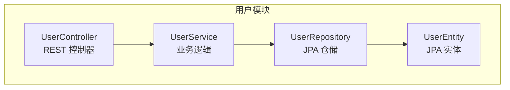
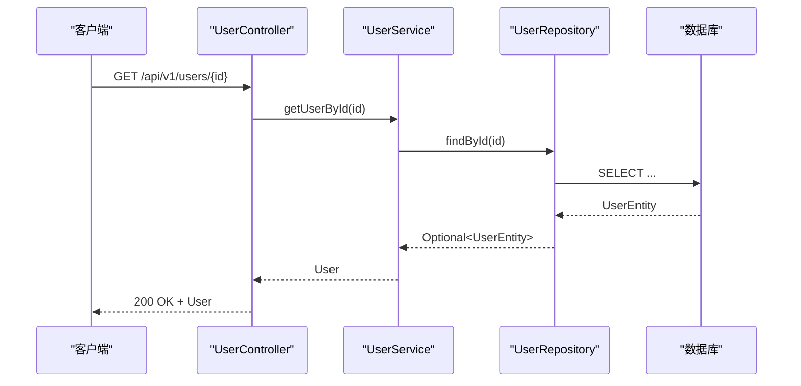
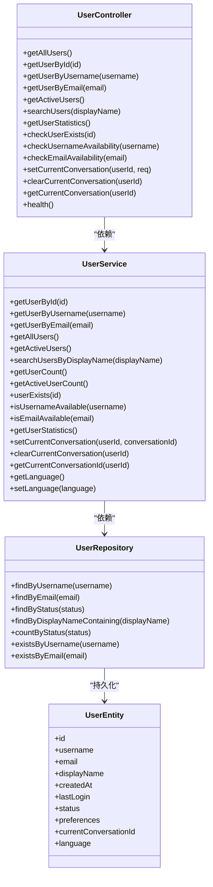
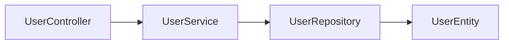

# 认证授权接口

<cite>
**本文引用的文件**
- [README-USER.md](file://src/main/java/com/alibaba/cloud/ai/lynxe/user/README-USER.md)
- [UserController.java](file://src/main/java/com/alibaba/cloud/ai/lynxe/user/controller/UserController.java)
- [UserEntity.java](file://src/main/java/com/alibaba/cloud/ai/lynxe/user/model/po/UserEntity.java)
- [UserService.java](file://src/main/java/com/alibaba/cloud/ai/lynxe/user/service/UserService.java)
- [UserRepository.java](file://src/main/java/com/alibaba/cloud/ai/lynxe/user/repository/UserRepository.java)
- [application.yml](file://src/main/resources/application.yml)
- [application-docker.yml](file://src/main/resources/application-docker.yml)
</cite>

## 目录
1. [简介](#简介)
2. [项目结构](#项目结构)
3. [核心组件](#核心组件)
4. [架构总览](#架构总览)
5. [详细组件分析](#详细组件分析)
6. [依赖分析](#依赖分析)
7. [性能考虑](#性能考虑)
8. [故障排查指南](#故障排查指南)
9. [结论](#结论)
10. [附录](#附录)

## 简介
本文件面向Lynxe系统的认证授权接口，基于当前仓库中已实现的“用户模块”进行系统化梳理与文档化。根据现有代码与说明，该模块提供基础用户查询能力，但不包含用户注册、登录、注销、密码管理、角色权限、访问控制、JWT令牌、多租户隔离、第三方认证（OAuth2/SAML/SSO）、审计日志与安全监控等高级认证授权特性。本文将明确当前能力边界，并给出后续扩展建议与最佳实践。

## 项目结构
用户模块采用经典的分层架构（控制器-服务-仓储），遵循Spring Boot与JPA规范，提供REST API以支撑用户信息的查询与统计，同时保留扩展点用于后续接入认证授权能力。

图表来源
- [UserController.java:1-344](file://src/main/java/com/alibaba/cloud/ai/lynxe/user/controller/UserController.java#L1-344)
- [UserService.java:1-271](file://src/main/java/com/alibaba/cloud/ai/lynxe/user/service/UserService.java#L1-271)
- [UserRepository.java:1-47](file://src/main/java/com/alibaba/cloud/ai/lynxe/user/repository/UserRepository.java#L1-47)
- [UserEntity.java:1-176](file://src/main/java/com/alibaba/cloud/ai/lynxe/user/model/po/UserEntity.java#L1-176)

章节来源
- [README-USER.md:1-111](file://src/main/java/com/alibaba/cloud/ai/lynxe/user/README-USER.md#L1-111)
- [application.yml:1-97](file://src/main/resources/application.yml#L1-97)

## 核心组件
- 控制器层：提供REST端点，负责请求接收、参数校验与响应封装。
- 服务层：编排业务逻辑，处理查询、统计与语言偏好设置等。
- 仓储层：基于JPA提供数据访问，定义查询方法与唯一性约束。
- 实体层：映射数据库表结构，包含用户基本信息、状态、偏好与会话字段。

章节来源
- [UserController.java:1-344](file://src/main/java/com/alibaba/cloud/ai/lynxe/user/controller/UserController.java#L1-344)
- [UserService.java:1-271](file://src/main/java/com/alibaba/cloud/ai/lynxe/user/service/UserService.java#L1-271)
- [UserRepository.java:1-47](file://src/main/java/com/alibaba/cloud/ai/lynxe/user/repository/UserRepository.java#L1-47)
- [UserEntity.java:1-176](file://src/main/java/com/alibaba/cloud/ai/lynxe/user/model/po/UserEntity.java#L1-176)

## 架构总览
用户模块当前为纯查询型服务，未内置认证授权中间件或拦截器。下图展示典型调用链路：

图表来源
- [UserController.java:77-96](file://src/main/java/com/alibaba/cloud/ai/lynxe/user/controller/UserController.java#L77-L96)
- [UserService.java:52-56](file://src/main/java/com/alibaba/cloud/ai/lynxe/user/service/UserService.java#L52-L56)
- [UserRepository.java:28-46](file://src/main/java/com/alibaba/cloud/ai/lynxe/user/repository/UserRepository.java#L28-L46)

## 详细组件分析

### 用户控制器（UserController）
- 职责：暴露REST端点，处理用户查询、存在性检查、可用性检查、统计信息与健康检查；新增会话绑定接口。
- 关键端点：
  - 查询类：按ID、用户名、邮箱、活跃状态、显示名模糊查询。
  - 统计与存在性：用户统计、用户存在性、用户名/邮箱可用性。
  - 健康检查：服务健康状态与用户数量。
  - 会话管理：设置/清空/获取当前会话ID。
- 错误处理：统一捕获异常并返回标准错误响应。
- 安全现状：未引入鉴权注解或过滤器，所有端点对调用方无身份校验。

章节来源
- [UserController.java:59-341](file://src/main/java/com/alibaba/cloud/ai/lynxe/user/controller/UserController.java#L59-L341)

### 用户服务（UserService）
- 职责：封装业务逻辑，包括用户查询、统计计算、存在性判断、语言偏好设置与当前会话维护。
- 关键方法：
  - 查询与筛选：按ID/用户名/邮箱/状态/显示名查询。
  - 统计：总用户数、活跃用户数、非活跃用户数、平均注册天数。
  - 语言偏好：默认用户（ID=1）的语言设置与读取。
  - 会话管理：设置/清空/获取当前会话ID。
- 数据映射：通过BeanUtils在实体与值对象之间转换。

章节来源
- [UserService.java:52-268](file://src/main/java/com/alibaba/cloud/ai/lynxe/user/service/UserService.java#L52-L268)

### 用户仓储（UserRepository）
- 职责：基于JPA提供数据访问，定义常用查询方法与唯一性校验。
- 关键查询：
  - 按用户名/邮箱查询。
  - 按状态筛选。
  - 显示名模糊匹配。
  - 按状态计数。
  - 用户名/邮箱存在性检查。

章节来源
- [UserRepository.java:28-46](file://src/main/java/com/alibaba/cloud/ai/lynxe/user/repository/UserRepository.java#L28-L46)

### 用户实体（UserEntity）
- 职责：映射数据库表结构，包含用户标识、凭证字段占位、状态、偏好、当前会话ID与语言等。
- 关键字段：
  - 标识与凭证占位：id、username、email（唯一约束）。
  - 状态与时间：status、created_at、last_login。
  - 偏好与会话：preferences、current_conversation_id、language。
- 设计要点：使用唯一约束保证用户名与邮箱唯一；元素集合用于存储偏好项。

章节来源
- [UserEntity.java:36-176](file://src/main/java/com/alibaba/cloud/ai/lynxe/user/model/po/UserEntity.java#L36-L176)

### 类关系图

图表来源
- [UserController.java:1-344](file://src/main/java/com/alibaba/cloud/ai/lynxe/user/controller/UserController.java#L1-344)
- [UserService.java:1-271](file://src/main/java/com/alibaba/cloud/ai/lynxe/user/service/UserService.java#L1-271)
- [UserRepository.java:1-47](file://src/main/java/com/alibaba/cloud/ai/lynxe/user/repository/UserRepository.java#L1-47)
- [UserEntity.java:1-176](file://src/main/java/com/alibaba/cloud/ai/lynxe/user/model/po/UserEntity.java#L1-176)

## 依赖分析
- 组件内聚：控制器仅负责HTTP交互，服务层封装业务，仓储层专注数据访问，职责清晰。
- 组件耦合：控制器依赖服务，服务依赖仓储，仓储依赖实体，层次分明。
- 外部依赖：Spring Data JPA、Spring Web MVC、日志框架；未发现Spring Security或OAuth2依赖。
- 可能的循环依赖：未见循环导入；若后续扩展认证授权，需避免在控制器与服务间形成环状依赖。

图表来源
- [UserController.java:1-344](file://src/main/java/com/alibaba/cloud/ai/lynxe/user/controller/UserController.java#L1-344)
- [UserService.java:1-271](file://src/main/java/com/alibaba/cloud/ai/lynxe/user/service/UserService.java#L1-271)
- [UserRepository.java:1-47](file://src/main/java/com/alibaba/cloud/ai/lynxe/user/repository/UserRepository.java#L1-47)
- [UserEntity.java:1-176](file://src/main/java/com/alibaba/cloud/ai/lynxe/user/model/po/UserEntity.java#L1-176)

章节来源
- [application.yml:1-97](file://src/main/resources/application.yml#L1-97)

## 性能考虑
- JPA配置：已关闭Open Session In View，避免潜在性能问题；SQL格式化在容器环境下可关闭以提升性能。
- 连接池：Hikari连接池参数合理，适合中小规模并发。
- 文件上传：上传大小与请求大小限制较大，注意与认证授权模块联用时的安全与资源限制。
- 查询优化：当前查询均为简单条件检索，建议在高频查询上增加索引与缓存策略。

章节来源
- [application.yml:32-38](file://src/main/resources/application.yml#L32-L38)
- [application-docker.yml:11-15](file://src/main/resources/application-docker.yml#L11-L15)

## 故障排查指南
- 常见问题
  - 用户不存在：查询返回空或404，检查ID/用户名/邮箱是否正确。
  - 统计失败：服务内部异常，查看日志定位具体原因。
  - 会话更新失败：用户ID不存在或保存失败，确认用户存在且数据库可写。
- 排查步骤
  - 启用调试日志，观察控制器与服务层的日志输出。
  - 使用健康检查端点确认服务状态与用户数量。
  - 检查数据库连接与JPA配置，确保实体映射正确。
- 建议
  - 在控制器层增加输入参数校验与异常分类处理。
  - 对高并发场景增加限流与重试策略。

章节来源
- [UserController.java:60-72](file://src/main/java/com/alibaba/cloud/ai/lynxe/user/controller/UserController.java#L60-L72)
- [UserService.java:145-168](file://src/main/java/com/alibaba/cloud/ai/lynxe/user/service/UserService.java#L145-L168)

## 结论
- 当前用户模块提供基础查询与统计能力，未包含认证授权相关功能（注册、登录、注销、密码管理、角色权限、访问控制、JWT、多租户隔离、第三方认证、审计日志与安全监控等）。
- 若需扩展认证授权能力，建议在现有分层架构基础上引入Spring Security与OAuth2/OIDC支持，并在控制器层增加鉴权注解与全局异常处理，同时完善数据模型以承载凭证与权限信息。

## 附录

### API清单（当前实现）
- 获取全部用户
  - 方法：GET
  - 路径：/api/v1/users
  - 响应：用户列表
- 根据ID获取用户
  - 方法：GET
  - 路径：/api/v1/users/{id}
  - 响应：用户详情
- 根据用户名获取用户
  - 方法：GET
  - 路径：/api/v1/users/username/{username}
  - 响应：用户详情
- 根据邮箱获取用户
  - 方法：GET
  - 路径：/api/v1/users/email/{email}
  - 响应：用户详情
- 获取活跃用户
  - 方法：GET
  - 路径：/api/v1/users/active
  - 响应：活跃用户列表
- 搜索用户（显示名）
  - 方法：GET
  - 路径：/api/v1/users/search?displayName={name}
  - 响应：匹配用户列表
- 用户统计
  - 方法：GET
  - 路径：/api/v1/users/statistics
  - 响应：统计信息
- 检查用户是否存在
  - 方法：GET
  - 路径：/api/v1/users/{id}/exists
  - 响应：存在性结果
- 检查用户名是否可用
  - 方法：GET
  - 路径：/api/v1/users/username/{username}/available
  - 响应：可用性结果
- 检查邮箱是否可用
  - 方法：GET
  - 路径：/api/v1/users/email/{email}/available
  - 响应：可用性结果
- 设置当前会话
  - 方法：POST
  - 路径：/api/v1/users/{userId}/conversation
  - 请求体：{ "conversationId": "..." }
  - 响应：操作结果
- 清空当前会话
  - 方法：DELETE
  - 路径：/api/v1/users/{userId}/conversation
  - 响应：操作结果
- 获取当前会话ID
  - 方法：GET
  - 路径：/api/v1/users/{userId}/conversation
  - 响应：当前会话ID
- 健康检查
  - 方法：GET
  - 路径：/api/v1/users/health
  - 响应：服务状态与用户数量

章节来源
- [README-USER.md:34-49](file://src/main/java/com/alibaba/cloud/ai/lynxe/user/README-USER.md#L34-L49)
- [UserController.java:59-341](file://src/main/java/com/alibaba/cloud/ai/lynxe/user/controller/UserController.java#L59-L341)

### 扩展建议（认证授权）
- 注册/登录/注销/密码管理
  - 新增认证控制器与服务，引入密码编码器与会话管理。
- 角色与权限
  - 扩展用户实体与权限表，实现RBAC模型。
- 访问控制
  - 引入Spring Security与方法级/URL级权限控制。
- JWT
  - 生成与验证令牌，支持刷新与黑名单。
- 多租户
  - 在实体与查询中加入租户字段，实现数据隔离与权限继承。
- 第三方认证与SSO
  - 集成OAuth2/OIDC，支持SAML与CAS。
- 审计与监控
  - 记录登录日志、操作审计与异常监控。
- 数据加密与隐私合规
  - 对敏感字段加密存储，遵循GDPR/CCPA等合规要求。

[本节为概念性建议，不直接对应具体源码文件]