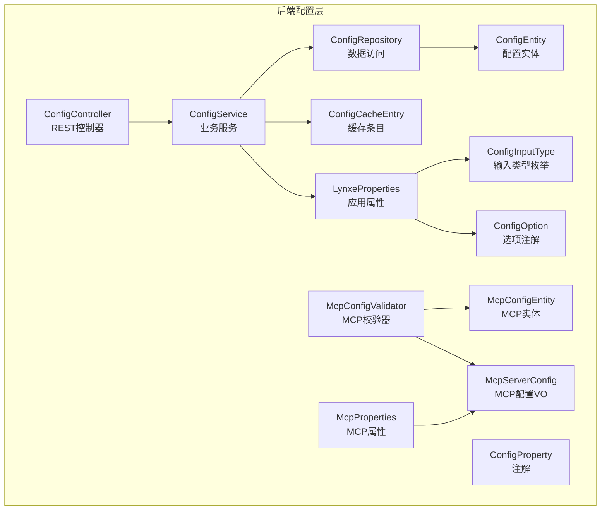
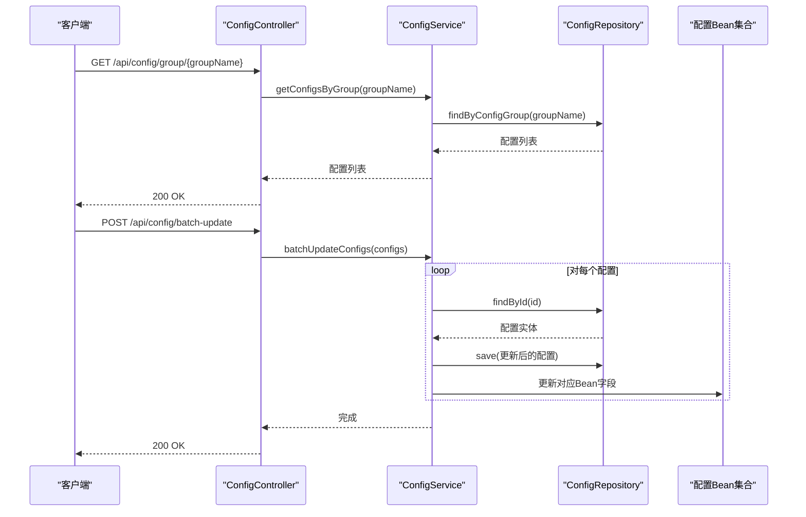
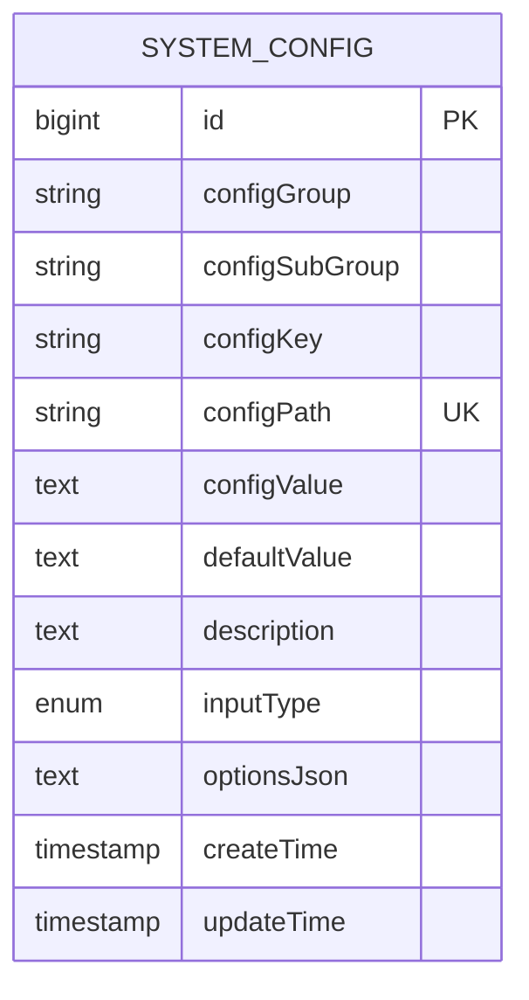
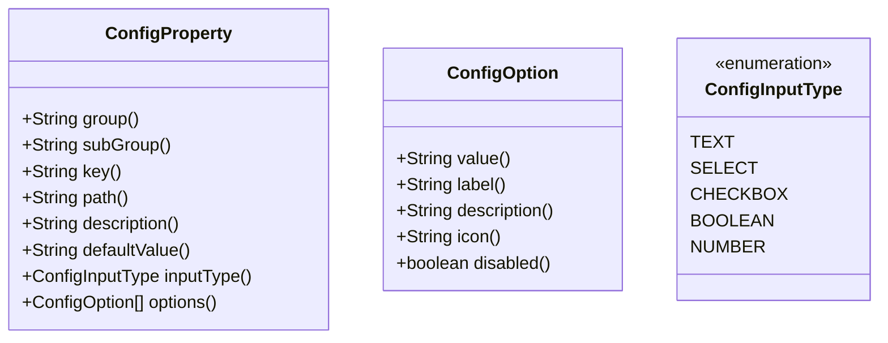
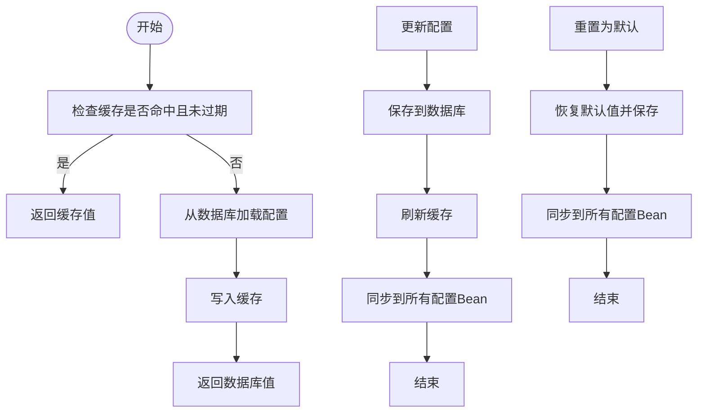
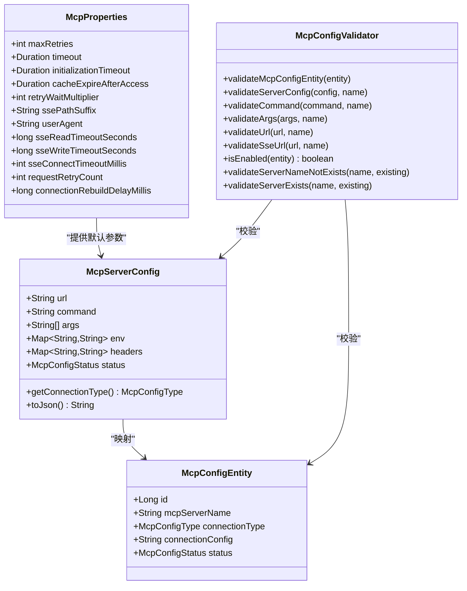
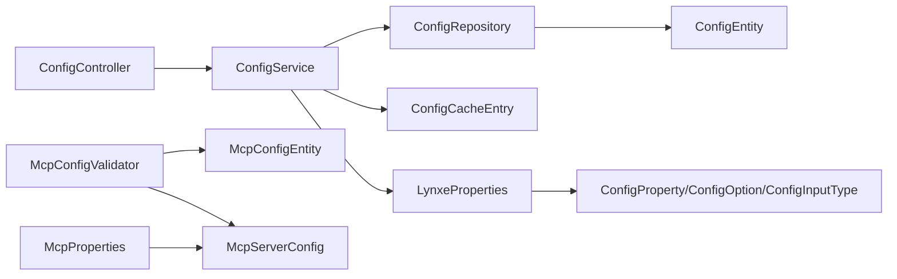

# 配置管理接口

<cite>
**本文档引用的文件**
- [ConfigController.java](file://src/main/java/com/alibaba/cloud/ai/lynxe/config/ConfigController.java)
- [ConfigService.java](file://src/main/java/com/alibaba/cloud/ai/lynxe/config/ConfigService.java)
- [IConfigService.java](file://src/main/java/com/alibaba/cloud/ai/lynxe/config/IConfigService.java)
- [ConfigEntity.java](file://src/main/java/com/alibaba/cloud/ai/lynxe/config/entity/ConfigEntity.java)
- [ConfigRepository.java](file://src/main/java/com/alibaba/cloud/ai/lynxe/config/repository/ConfigRepository.java)
- [ConfigProperty.java](file://src/main/java/com/alibaba/cloud/ai/lynxe/config/ConfigProperty.java)
- [ConfigInputType.java](file://src/main/java/com/alibaba/cloud/ai/lynxe/config/entity/ConfigInputType.java)
- [ConfigOption.java](file://src/main/java/com/alibaba/cloud/ai/lynxe/config/ConfigOption.java)
- [ConfigCacheEntry.java](file://src/main/java/com/alibaba/cloud/ai/lynxe/config/ConfigCacheEntry.java)
- [LynxeProperties.java](file://src/main/java/com/alibaba/cloud/ai/lynxe/config/LynxeProperties.java)
- [McpProperties.java](file://src/main/java/com/alibaba/cloud/ai/lynxe/mcp/config/McpProperties.java)
- [McpConfigValidator.java](file://src/main/java/com/alibaba/cloud/ai/lynxe/mcp/service/McpConfigValidator.java)
- [McpConfigEntity.java](file://src/main/java/com/alibaba/cloud/ai/lynxe/mcp/model/po/McpConfigEntity.java)
- [McpServerConfig.java](file://src/main/java/com/alibaba/cloud/ai/lynxe/mcp/model/vo/McpServerConfig.java)
</cite>

## 目录
1. [简介](#简介)
2. [项目结构](#项目结构)
3. [核心组件](#核心组件)
4. [架构总览](#架构总览)
5. [详细组件分析](#详细组件分析)
6. [依赖关系分析](#依赖关系分析)
7. [性能考虑](#性能考虑)
8. [故障排查指南](#故障排查指南)
9. [结论](#结论)
10. [附录](#附录)

## 简介
本文件面向Lynxe系统的配置管理接口，提供完整的API文档与实现解析，涵盖以下能力：
- 基础配置：增删改查、分组查询、批量更新、重置默认值
- 配置验证：输入类型、选项校验、MCP连接配置校验
- 数据结构：配置项模型、输入类型枚举、选项注解
- 运行时行为：热更新、缓存失效、Bean字段同步
- 扩展配置：MCP服务配置、通用属性配置
- 安全与治理：敏感信息保护（建议）、访问控制（建议）

## 项目结构
配置管理相关代码主要位于后端Java模块的config与mcp包中，前端Vue3侧提供配置界面与交互。

**图表来源**
- [ConfigController.java:36-81](file://src/main/java/com/alibaba/cloud/ai/lynxe/config/ConfigController.java#L36-L81)
- [ConfigService.java:41-319](file://src/main/java/com/alibaba/cloud/ai/lynxe/config/ConfigService.java#L41-L319)
- [ConfigRepository.java:31-100](file://src/main/java/com/alibaba/cloud/ai/lynxe/config/repository/ConfigRepository.java#L31-L100)
- [ConfigEntity.java:33-217](file://src/main/java/com/alibaba/cloud/ai/lynxe/config/entity/ConfigEntity.java#L33-L217)
- [ConfigProperty.java:26-88](file://src/main/java/com/alibaba/cloud/ai/lynxe/config/ConfigProperty.java#L26-L88)
- [ConfigInputType.java:18-45](file://src/main/java/com/alibaba/cloud/ai/lynxe/config/entity/ConfigInputType.java#L18-L45)
- [ConfigOption.java:22-63](file://src/main/java/com/alibaba/cloud/ai/lynxe/config/ConfigOption.java#L22-L63)
- [ConfigCacheEntry.java:18-44](file://src/main/java/com/alibaba/cloud/ai/lynxe/config/ConfigCacheEntry.java#L18-L44)
- [LynxeProperties.java:26-653](file://src/main/java/com/alibaba/cloud/ai/lynxe/config/LynxeProperties.java#L26-L653)
- [McpProperties.java:23-190](file://src/main/java/com/alibaba/cloud/ai/lynxe/mcp/config/McpProperties.java#L23-L190)
- [McpConfigValidator.java:37-390](file://src/main/java/com/alibaba/cloud/ai/lynxe/mcp/service/McpConfigValidator.java#L37-L390)
- [McpConfigEntity.java:27-106](file://src/main/java/com/alibaba/cloud/ai/lynxe/mcp/model/po/McpConfigEntity.java#L27-L106)
- [McpServerConfig.java:28-250](file://src/main/java/com/alibaba/cloud/ai/lynxe/mcp/model/vo/McpServerConfig.java#L28-L250)

**章节来源**
- [ConfigController.java:36-81](file://src/main/java/com/alibaba/cloud/ai/lynxe/config/ConfigController.java#L36-L81)
- [ConfigService.java:41-319](file://src/main/java/com/alibaba/cloud/ai/lynxe/config/ConfigService.java#L41-L319)

## 核心组件
- REST控制器：提供配置查询、分组查询、批量更新、重置默认值、可用模型列表等接口
- 业务服务：负责配置初始化、缓存、热更新、批量更新、重置默认值、按组查询
- 数据访问：基于JPA的仓库接口，支持按路径、分组、子组查询与批量更新
- 实体模型：系统配置表结构，包含分组、键、路径、默认值、输入类型、选项JSON等
- 注解体系：ConfigProperty定义配置项元数据；ConfigOption定义下拉选项；ConfigInputType定义输入类型
- 缓存机制：短时缓存（30秒过期）提升读取性能
- 应用属性：通过注解驱动的配置属性绑定到运行时Bean
- MCP扩展：MCP服务配置属性、校验器、实体与VO

**章节来源**
- [ConfigController.java:46-81](file://src/main/java/com/alibaba/cloud/ai/lynxe/config/ConfigController.java#L46-L81)
- [ConfigService.java:55-317](file://src/main/java/com/alibaba/cloud/ai/lynxe/config/ConfigService.java#L55-L317)
- [ConfigRepository.java:31-100](file://src/main/java/com/alibaba/cloud/ai/lynxe/config/repository/ConfigRepository.java#L31-L100)
- [ConfigEntity.java:33-217](file://src/main/java/com/alibaba/cloud/ai/lynxe/config/entity/ConfigEntity.java#L33-L217)
- [ConfigProperty.java:26-88](file://src/main/java/com/alibaba/cloud/ai/lynxe/config/ConfigProperty.java#L26-L88)
- [ConfigInputType.java:18-45](file://src/main/java/com/alibaba/cloud/ai/lynxe/config/entity/ConfigInputType.java#L18-L45)
- [ConfigOption.java:22-63](file://src/main/java/com/alibaba/cloud/ai/lynxe/config/ConfigOption.java#L22-L63)
- [ConfigCacheEntry.java:18-44](file://src/main/java/com/alibaba/cloud/ai/lynxe/config/ConfigCacheEntry.java#L18-L44)
- [LynxeProperties.java:26-653](file://src/main/java/com/alibaba/cloud/ai/lynxe/config/LynxeProperties.java#L26-L653)
- [McpProperties.java:23-190](file://src/main/java/com/alibaba/cloud/ai/lynxe/mcp/config/McpProperties.java#L23-L190)
- [McpConfigValidator.java:37-390](file://src/main/java/com/alibaba/cloud/ai/lynxe/mcp/service/McpConfigValidator.java#L37-L390)
- [McpConfigEntity.java:27-106](file://src/main/java/com/alibaba/cloud/ai/lynxe/mcp/model/po/McpConfigEntity.java#L27-L106)
- [McpServerConfig.java:28-250](file://src/main/java/com/alibaba/cloud/ai/lynxe/mcp/model/vo/McpServerConfig.java#L28-L250)

## 架构总览
配置管理采用“注解驱动 + 运行时热更新”的架构：
- 启动阶段扫描带@ConfigurationProperties的Bean，根据ConfigProperty注解生成或更新数据库中的配置项
- 运行时通过ConfigService提供统一的配置读写入口，支持缓存与Bean字段同步
- REST控制器暴露HTTP接口，供前端调用

**图表来源**
- [ConfigController.java:46-55](file://src/main/java/com/alibaba/cloud/ai/lynxe/config/ConfigController.java#L46-L55)
- [ConfigService.java:272-296](file://src/main/java/com/alibaba/cloud/ai/lynxe/config/ConfigService.java#L272-L296)
- [ConfigRepository.java:31-100](file://src/main/java/com/alibaba/cloud/ai/lynxe/config/repository/ConfigRepository.java#L31-L100)

**章节来源**
- [ConfigService.java:60-163](file://src/main/java/com/alibaba/cloud/ai/lynxe/config/ConfigService.java#L60-L163)
- [ConfigController.java:46-61](file://src/main/java/com/alibaba/cloud/ai/lynxe/config/ConfigController.java#L46-L61)

## 详细组件分析

### REST API定义
- 获取分组配置
  - 方法：GET
  - 路径：/api/config/group/{groupName}
  - 请求参数：groupName（路径变量）
  - 返回：配置项数组
  - 权限：建议鉴权
- 批量更新配置
  - 方法：POST
  - 路径：/api/config/batch-update
  - 请求体：配置项数组（仅含值字段）
  - 返回：200 OK
  - 权限：建议鉴权
- 重置全部配置为默认值
  - 方法：POST
  - 路径：/api/config/reset-all-defaults
  - 返回：200 OK
  - 权限：建议鉴权
- 可用模型列表
  - 方法：GET
  - 路径：/api/config/available-models
  - 返回：包含选项数组与总数的对象
  - 权限：建议鉴权

**章节来源**
- [ConfigController.java:46-79](file://src/main/java/com/alibaba/cloud/ai/lynxe/config/ConfigController.java#L46-L79)

### 配置实体与数据结构
- 表：system_config
- 关键字段：
  - id：主键
  - configGroup：配置分组
  - configSubGroup：配置子分组
  - configKey：配置键
  - configPath：完整路径（唯一）
  - configValue：当前值
  - defaultValue：默认值
  - description：描述
  - inputType：输入类型（TEXT/SELECT/CHECKBOX/BOOLEAN/NUMBER）
  - optionsJson：下拉选项JSON
  - createTime/updateTime：时间戳

**图表来源**
- [ConfigEntity.java:33-217](file://src/main/java/com/alibaba/cloud/ai/lynxe/config/entity/ConfigEntity.java#L33-L217)

**章节来源**
- [ConfigEntity.java:33-217](file://src/main/java/com/alibaba/cloud/ai/lynxe/config/entity/ConfigEntity.java#L33-L217)
- [ConfigInputType.java:18-45](file://src/main/java/com/alibaba/cloud/ai/lynxe/config/entity/ConfigInputType.java#L18-L45)

### 配置注解与输入类型
- ConfigProperty：定义配置项的分组、子分组、键、路径、描述、默认值、输入类型、选项
- ConfigOption：定义下拉选项的值、标签、描述、图标、禁用状态
- ConfigInputType：输入类型枚举（文本、下拉、多选、布尔、数字）

**图表来源**
- [ConfigProperty.java:26-88](file://src/main/java/com/alibaba/cloud/ai/lynxe/config/ConfigProperty.java#L26-L88)
- [ConfigOption.java:22-63](file://src/main/java/com/alibaba/cloud/ai/lynxe/config/ConfigOption.java#L22-L63)
- [ConfigInputType.java:18-45](file://src/main/java/com/alibaba/cloud/ai/lynxe/config/entity/ConfigInputType.java#L18-L45)

**章节来源**
- [ConfigProperty.java:26-88](file://src/main/java/com/alibaba/cloud/ai/lynxe/config/ConfigProperty.java#L26-L88)
- [ConfigOption.java:22-63](file://src/main/java/com/alibaba/cloud/ai/lynxe/config/ConfigOption.java#L22-L63)
- [ConfigInputType.java:18-45](file://src/main/java/com/alibaba/cloud/ai/lynxe/config/entity/ConfigInputType.java#L18-L45)

### 配置服务与热更新
- 初始化：启动时扫描带@ConfigurationProperties的Bean，根据ConfigProperty生成或更新数据库配置项，并从环境变量或默认值填充
- 读取：先查缓存（30秒过期），未命中则查库并写入缓存
- 更新：更新数据库值，刷新缓存，并反射设置所有使用该配置路径的Bean字段
- 批量更新：逐条更新并同步到Bean
- 重置默认：将值重置为默认值并同步到Bean
- 清理：对LynxeProperties中不再存在的配置进行清理删除

**图表来源**
- [ConfigService.java:165-217](file://src/main/java/com/alibaba/cloud/ai/lynxe/config/ConfigService.java#L165-L217)
- [ConfigService.java:182-203](file://src/main/java/com/alibaba/cloud/ai/lynxe/config/ConfigService.java#L182-L203)
- [ConfigService.java:255-265](file://src/main/java/com/alibaba/cloud/ai/lynxe/config/ConfigService.java#L255-L265)
- [ConfigService.java:280-296](file://src/main/java/com/alibaba/cloud/ai/lynxe/config/ConfigService.java#L280-L296)
- [ConfigCacheEntry.java:18-44](file://src/main/java/com/alibaba/cloud/ai/lynxe/config/ConfigCacheEntry.java#L18-L44)

**章节来源**
- [ConfigService.java:67-163](file://src/main/java/com/alibaba/cloud/ai/lynxe/config/ConfigService.java#L67-L163)
- [ConfigService.java:165-317](file://src/main/java/com/alibaba/cloud/ai/lynxe/config/ConfigService.java#L165-L317)
- [ConfigCacheEntry.java:18-44](file://src/main/java/com/alibaba/cloud/ai/lynxe/config/ConfigCacheEntry.java#L18-L44)

### MCP配置与验证
- MCP属性：最大重试次数、连接/初始化超时、SSE路径后缀、用户代理、SSE读写超时、请求重试次数、连接重建延迟等
- MCP配置实体：服务器名称、连接类型、连接配置JSON、状态
- MCP配置VO：支持URL/命令+参数/环境变量/头部/状态，自动推断连接类型（STUDIO/SSE/STREAMING）
- MCP校验器：校验服务器名称、连接类型、连接配置、命令格式、参数、URL协议与DNS解析、SSE路径包含性等

**图表来源**
- [McpProperties.java:23-190](file://src/main/java/com/alibaba/cloud/ai/lynxe/mcp/config/McpProperties.java#L23-L190)
- [McpConfigEntity.java:27-106](file://src/main/java/com/alibaba/cloud/ai/lynxe/mcp/model/po/McpConfigEntity.java#L27-L106)
- [McpServerConfig.java:28-250](file://src/main/java/com/alibaba/cloud/ai/lynxe/mcp/model/vo/McpServerConfig.java#L28-L250)
- [McpConfigValidator.java:37-390](file://src/main/java/com/alibaba/cloud/ai/lynxe/mcp/service/McpConfigValidator.java#L37-L390)

**章节来源**
- [McpProperties.java:23-190](file://src/main/java/com/alibaba/cloud/ai/lynxe/mcp/config/McpProperties.java#L23-L190)
- [McpConfigEntity.java:27-106](file://src/main/java/com/alibaba/cloud/ai/lynxe/mcp/model/po/McpConfigEntity.java#L27-L106)
- [McpServerConfig.java:28-250](file://src/main/java/com/alibaba/cloud/ai/lynxe/mcp/model/vo/McpServerConfig.java#L28-L250)
- [McpConfigValidator.java:37-390](file://src/main/java/com/alibaba/cloud/ai/lynxe/mcp/service/McpConfigValidator.java#L37-L390)

### 配置继承、优先级与合并策略
- 继承与优先级：配置读取顺序建议为“环境变量 > 数据库 > 注解默认值”，以环境变量最高优先
- 合并策略：当前实现为直接覆盖（更新数据库值并同步Bean字段），未见复杂合并逻辑
- 分组与层级：通过三段式路径（group.subGroup.key）组织配置，便于UI分组展示与权限控制

**章节来源**
- [ConfigService.java:125-133](file://src/main/java/com/alibaba/cloud/ai/lynxe/config/ConfigService.java#L125-L133)
- [ConfigProperty.java:26-88](file://src/main/java/com/alibaba/cloud/ai/lynxe/config/ConfigProperty.java#L26-L88)

### 加密存储、敏感信息保护与访问控制
- 加密存储：当前未见数据库字段加密实现
- 敏感信息保护：建议对包含口令/令牌的配置项启用加密存储与传输
- 访问控制：建议在控制器层增加鉴权与授权校验，限制配置修改权限

**章节来源**
- [ConfigController.java:46-79](file://src/main/java/com/alibaba/cloud/ai/lynxe/config/ConfigController.java#L46-L79)

### 导入导出、模板管理与批量部署
- 导入导出：当前未提供专门的导入导出接口
- 模板管理：可通过批量更新接口实现模板化批量应用
- 批量部署：通过批量更新接口与分组查询接口配合，实现跨实例的一致性部署

**章节来源**
- [ConfigController.java:51-61](file://src/main/java/com/alibaba/cloud/ai/lynxe/config/ConfigController.java#L51-L61)
- [ConfigService.java:280-296](file://src/main/java/com/alibaba/cloud/ai/lynxe/config/ConfigService.java#L280-L296)

### 监控告警、变更通知与审计日志
- 监控告警：建议在配置变更处埋点，触发变更事件并推送告警
- 变更通知：可结合事件发布器在更新后发布ModelChangeEvent等事件
- 审计日志：建议记录配置变更的用户、时间、路径、前后值，便于审计

**章节来源**
- [ConfigService.java:193-196](file://src/main/java/com/alibaba/cloud/ai/lynxe/config/ConfigService.java#L193-L196)
- [LynxeEvent.java](file://src/main/java/com/alibaba/cloud/ai/lynxe/event/LynxeEvent.java)
- [LynxeEventPublisher.java](file://src/main/java/com/alibaba/cloud/ai/lynxe/event/LynxeEventPublisher.java)

## 依赖关系分析
- 控制器依赖服务接口IConfigService
- 服务依赖仓库接口ConfigRepository与应用上下文
- 仓库依赖JPA，提供按路径、分组、子组查询与批量更新
- 应用属性通过注解驱动，与服务协同完成初始化与热更新
- MCP配置独立于系统配置，但共享类似的校验与存储模式

**图表来源**
- [ConfigController.java:36-81](file://src/main/java/com/alibaba/cloud/ai/lynxe/config/ConfigController.java#L36-L81)
- [ConfigService.java:41-319](file://src/main/java/com/alibaba/cloud/ai/lynxe/config/ConfigService.java#L41-L319)
- [ConfigRepository.java:31-100](file://src/main/java/com/alibaba/cloud/ai/lynxe/config/repository/ConfigRepository.java#L31-L100)
- [ConfigEntity.java:33-217](file://src/main/java/com/alibaba/cloud/ai/lynxe/config/entity/ConfigEntity.java#L33-L217)
- [LynxeProperties.java:26-653](file://src/main/java/com/alibaba/cloud/ai/lynxe/config/LynxeProperties.java#L26-L653)
- [McpConfigValidator.java:37-390](file://src/main/java/com/alibaba/cloud/ai/lynxe/mcp/service/McpConfigValidator.java#L37-L390)
- [McpConfigEntity.java:27-106](file://src/main/java/com/alibaba/cloud/ai/lynxe/mcp/model/po/McpConfigEntity.java#L27-L106)
- [McpServerConfig.java:28-250](file://src/main/java/com/alibaba/cloud/ai/lynxe/mcp/model/vo/McpServerConfig.java#L28-L250)
- [McpProperties.java:23-190](file://src/main/java/com/alibaba/cloud/ai/lynxe/mcp/config/McpProperties.java#L23-L190)

**章节来源**
- [ConfigService.java:41-319](file://src/main/java/com/alibaba/cloud/ai/lynxe/config/ConfigService.java#L41-L319)
- [ConfigRepository.java:31-100](file://src/main/java/com/alibaba/cloud/ai/lynxe/config/repository/ConfigRepository.java#L31-L100)

## 性能考虑
- 缓存：短时缓存（30秒）减少数据库压力，适合高频读取场景
- 批量更新：事务内批量更新，避免多次往返
- Bean同步：更新后同步到所有配置Bean，避免脏读
- 建议优化：对热点配置增加LRU缓存、异步刷新、只在变更时同步

[本节为通用指导，无需列出具体文件来源]

## 故障排查指南
- 配置未生效：确认是否已调用更新接口并等待缓存刷新；检查Bean字段是否被正确设置
- 批量更新失败：检查请求体中的配置ID是否存在；查看事务异常
- MCP配置校验失败：检查服务器名称、连接类型、URL协议、DNS可达性、SSE路径包含性
- 默认值不一致：确认环境变量是否覆盖默认值；检查清理逻辑是否移除了旧配置

**章节来源**
- [ConfigService.java:182-203](file://src/main/java/com/alibaba/cloud/ai/lynxe/config/ConfigService.java#L182-L203)
- [ConfigService.java:280-296](file://src/main/java/com/alibaba/cloud/ai/lynxe/config/ConfigService.java#L280-L296)
- [McpConfigValidator.java:53-107](file://src/main/java/com/alibaba/cloud/ai/lynxe/mcp/service/McpConfigValidator.java#L53-L107)
- [McpConfigValidator.java:271-323](file://src/main/java/com/alibaba/cloud/ai/lynxe/mcp/service/McpConfigValidator.java#L271-L323)

## 结论
Lynxe的配置管理以注解驱动为核心，实现了配置的自动生成、持久化、缓存与热更新。REST接口提供了基础的增删改查与批量操作能力，MCP配置模块补充了外部服务接入的配置与校验。建议后续增强安全与治理能力（加密存储、访问控制、审计日志、导入导出与模板管理），以满足生产环境的合规与运维需求。

[本节为总结性内容，无需列出具体文件来源]

## 附录

### API清单与示例路径
- 获取分组配置：GET /api/config/group/{groupName}
  - 示例路径：[ConfigController.java:46-49](file://src/main/java/com/alibaba/cloud/ai/lynxe/config/ConfigController.java#L46-L49)
- 批量更新配置：POST /api/config/batch-update
  - 示例路径：[ConfigController.java:51-55](file://src/main/java/com/alibaba/cloud/ai/lynxe/config/ConfigController.java#L51-L55)
- 重置全部配置为默认值：POST /api/config/reset-all-defaults
  - 示例路径：[ConfigController.java:57-61](file://src/main/java/com/alibaba/cloud/ai/lynxe/config/ConfigController.java#L57-L61)
- 可用模型列表：GET /api/config/available-models
  - 示例路径：[ConfigController.java:63-79](file://src/main/java/com/alibaba/cloud/ai/lynxe/config/ConfigController.java#L63-L79)

**章节来源**
- [ConfigController.java:46-79](file://src/main/java/com/alibaba/cloud/ai/lynxe/config/ConfigController.java#L46-L79)