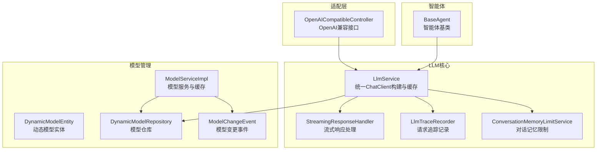
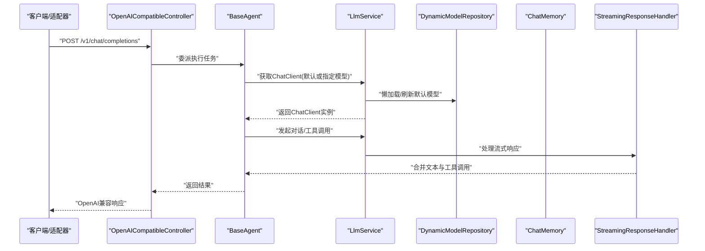
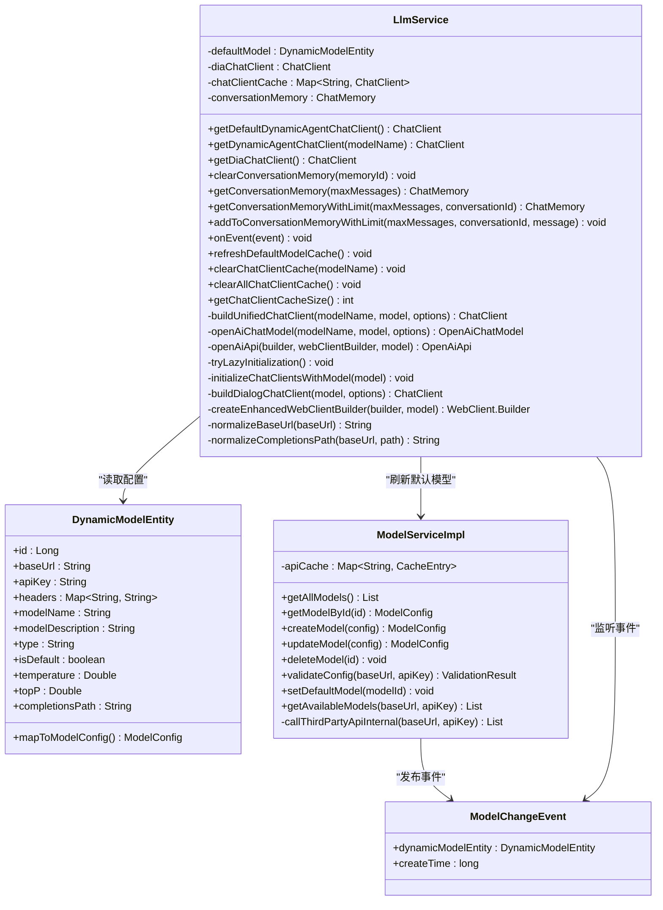
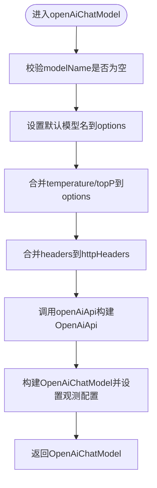
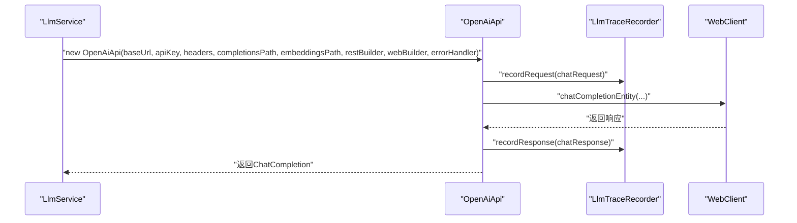
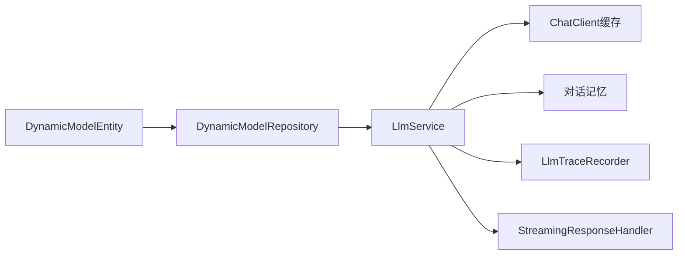
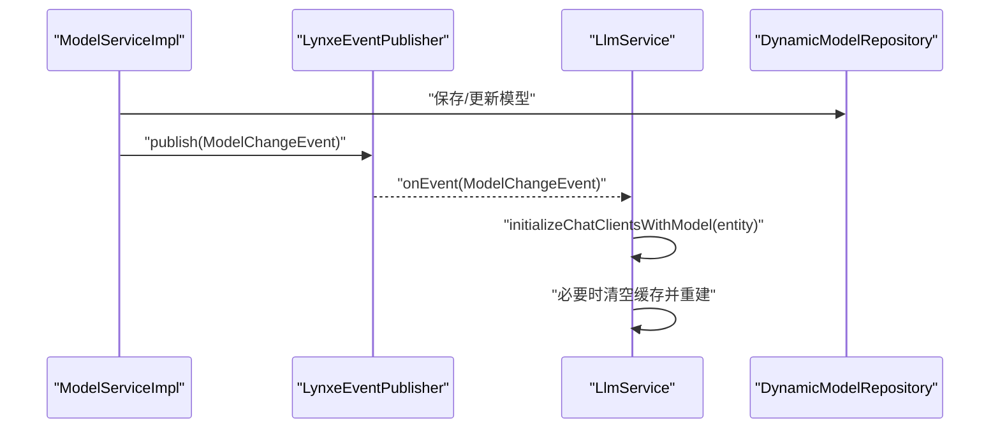
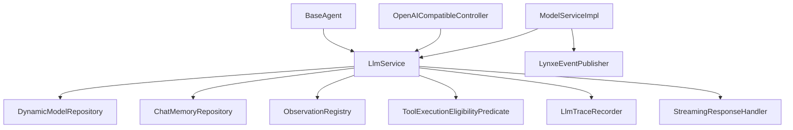

# LLM服务核心封装

<cite>
**本文档引用的文件**
- [LlmService.java](file://src/main/java/com/alibaba/cloud/ai/lynxe/llm/LlmService.java)
- [DynamicModelEntity.java](file://src/main/java/com/alibaba/cloud/ai/lynxe/model/entity/DynamicModelEntity.java)
- [ModelServiceImpl.java](file://src/main/java/com/alibaba/cloud/ai/lynxe/model/service/ModelServiceImpl.java)
- [ModelChangeEvent.java](file://src/main/java/com/alibaba/cloud/ai/lynxe/event/ModelChangeEvent.java)
- [StreamingResponseHandler.java](file://src/main/java/com/alibaba/cloud/ai/lynxe/llm/StreamingResponseHandler.java)
- [LlmTraceRecorder.java](file://src/main/java/com/alibaba/cloud/ai/lynxe/llm/LlmTraceRecorder.java)
- [ConversationMemoryLimitService.java](file://src/main/java/com/alibaba/cloud/ai/lynxe/llm/ConversationMemoryLimitService.java)
- [DefaultLlmConfiguration.java](file://src/main/java/com/alibaba/cloud/ai/lynxe/config/DefaultLlmConfiguration.java)
- [DynamicModelRepository.java](file://src/main/java/com/alibaba/cloud/ai/lynxe/model/repository/DynamicModelRepository.java)
- [OpenAICompatibleController.java](file://src/main/java/com/alibaba/cloud/ai/lynxe/adapter/controller/OpenAICompatibleController.java)
- [BaseAgent.java](file://src/main/java/com/alibaba/cloud/ai/lynxe/agent/BaseAgent.java)
</cite>

## 目录
1. [简介](#简介)
2. [项目结构](#项目结构)
3. [核心组件](#核心组件)
4. [架构总览](#架构总览)
5. [详细组件分析](#详细组件分析)
6. [依赖关系分析](#依赖关系分析)
7. [性能考虑](#性能考虑)
8. [故障排除指南](#故障排除指南)
9. [结论](#结论)
10. [附录](#附录)

## 简介
本文件针对Lynxe LLM服务核心封装进行全面技术文档化，重点围绕LlmService类的设计与实现，系统性阐述以下主题：
- ChatClient的统一构建机制与动态模型管理
- 缓存策略（ChatClient实例缓存、第三方API缓存）与生命周期管理
- openAiChatModel方法的实现细节：模型配置、HTTP头部处理、超时设置与重试机制
- 动态模型实体的存储与检索机制，以及模型变更事件的处理流程
- 服务初始化、懒加载机制与错误处理策略
- 提供具体使用示例，展示如何正确使用LLM服务进行对话与工具调用

## 项目结构
Lynxe采用分层架构组织LLM相关模块，核心位于llm包，配合model、event、adapter等子模块协同工作：
- llm包：LlmService、StreamingResponseHandler、LlmTraceRecorder、ConversationMemoryLimitService等
- model包：DynamicModelEntity、ModelServiceImpl、DynamicModelRepository等
- event包：ModelChangeEvent、LynxeEventPublisher等
- adapter包：OpenAI兼容控制器，对接外部客户端
- agent包：基础智能体框架，复用LlmService进行多轮对话与工具调用

**图表来源**
- [LlmService.java:57-482](file://src/main/java/com/alibaba/cloud/ai/lynxe/llm/LlmService.java#L57-L482)
- [ModelServiceImpl.java:54-485](file://src/main/java/com/alibaba/cloud/ai/lynxe/model/service/ModelServiceImpl.java#L54-L485)
- [DynamicModelEntity.java:26-190](file://src/main/java/com/alibaba/cloud/ai/lynxe/model/entity/DynamicModelEntity.java#L26-L190)
- [OpenAICompatibleController.java:50-357](file://src/main/java/com/alibaba/cloud/ai/lynxe/adapter/controller/OpenAICompatibleController.java#L50-L357)
- [BaseAgent.java:70-589](file://src/main/java/com/alibaba/cloud/ai/lynxe/agent/BaseAgent.java#L70-L589)

**章节来源**
- [LlmService.java:57-482](file://src/main/java/com/alibaba/cloud/ai/lynxe/llm/LlmService.java#L57-L482)
- [ModelServiceImpl.java:54-485](file://src/main/java/com/alibaba/cloud/ai/lynxe/model/service/ModelServiceImpl.java#L54-L485)
- [DynamicModelEntity.java:26-190](file://src/main/java/com/alibaba/cloud/ai/lynxe/model/entity/DynamicModelEntity.java#L26-L190)
- [OpenAICompatibleController.java:50-357](file://src/main/java/com/alibaba/cloud/ai/lynxe/adapter/controller/OpenAICompatibleController.java#L50-L357)
- [BaseAgent.java:70-589](file://src/main/java/com/alibaba/cloud/ai/lynxe/agent/BaseAgent.java#L70-L589)

## 核心组件
本节聚焦LlmService作为核心组件的设计与职责：
- 统一ChatClient构建：通过openAiChatModel与openAiApi方法，结合DynamicModelEntity配置，构建OpenAiChatModel与OpenAiApi实例，并封装到ChatClient中
- 动态模型管理：支持默认模型与指定模型的切换；在模型变更事件触发后，自动刷新缓存与默认模型
- 缓存策略：对ChatClient实例进行按模型名的并发缓存；对第三方API调用进行短期缓存（2秒）
- 生命周期管理：懒加载默认模型；提供缓存清理与大小查询接口；支持对话记忆的自动限制与压缩
- 错误处理：在流式响应处理中捕获异常并发布事件；在追踪器中记录请求/响应与错误详情

**章节来源**
- [LlmService.java:103-321](file://src/main/java/com/alibaba/cloud/ai/lynxe/llm/LlmService.java#L103-L321)
- [ModelServiceImpl.java:66-95](file://src/main/java/com/alibaba/cloud/ai/lynxe/model/service/ModelServiceImpl.java#L66-L95)
- [StreamingResponseHandler.java:167-452](file://src/main/java/com/alibaba/cloud/ai/lynxe/llm/StreamingResponseHandler.java#L167-L452)
- [LlmTraceRecorder.java:56-121](file://src/main/java/com/alibaba/cloud/ai/lynxe/llm/LlmTraceRecorder.java#L56-L121)

## 架构总览
下图展示了LlmService与各子系统的交互关系，突出其在对话生成、流式处理与模型管理中的核心地位。

**图表来源**
- [OpenAICompatibleController.java:85-116](file://src/main/java/com/alibaba/cloud/ai/lynxe/adapter/controller/OpenAICompatibleController.java#L85-L116)
- [BaseAgent.java:281-357](file://src/main/java/com/alibaba/cloud/ai/lynxe/agent/BaseAgent.java#L281-L357)
- [LlmService.java:166-197](file://src/main/java/com/alibaba/cloud/ai/lynxe/llm/LlmService.java#L166-L197)
- [StreamingResponseHandler.java:167-452](file://src/main/java/com/alibaba/cloud/ai/lynxe/llm/StreamingResponseHandler.java#L167-L452)

## 详细组件分析

### LlmService类设计与实现
LlmService是LLM服务的核心封装，承担以下关键职责：
- 统一构建ChatClient：通过buildUnifiedChatClient与openAiChatModel，将DynamicModelEntity配置映射到OpenAiChatModel与OpenAiApi
- 懒加载与缓存：在首次访问时从数据库加载默认模型，构建并缓存ChatClient实例
- 模型变更事件处理：监听ModelChangeEvent，当默认模型变更时清空缓存并重建
- 对话记忆管理：提供对话记忆的获取、清理与字符数限制功能
- 流式响应处理：集成StreamingResponseHandler进行进度日志与早期终止控制

**图表来源**
- [LlmService.java:57-482](file://src/main/java/com/alibaba/cloud/ai/lynxe/llm/LlmService.java#L57-L482)
- [DynamicModelEntity.java:26-190](file://src/main/java/com/alibaba/cloud/ai/lynxe/model/entity/DynamicModelEntity.java#L26-L190)
- [ModelServiceImpl.java:54-485](file://src/main/java/com/alibaba/cloud/ai/lynxe/model/service/ModelServiceImpl.java#L54-L485)
- [ModelChangeEvent.java:25-45](file://src/main/java/com/alibaba/cloud/ai/lynxe/event/ModelChangeEvent.java#L25-L45)

**章节来源**
- [LlmService.java:103-321](file://src/main/java/com/alibaba/cloud/ai/lynxe/llm/LlmService.java#L103-L321)
- [DynamicModelEntity.java:70-157](file://src/main/java/com/alibaba/cloud/ai/lynxe/model/entity/DynamicModelEntity.java#L70-L157)
- [ModelServiceImpl.java:97-187](file://src/main/java/com/alibaba/cloud/ai/lynxe/model/service/ModelServiceImpl.java#L97-L187)
- [ModelChangeEvent.java:25-45](file://src/main/java/com/alibaba/cloud/ai/lynxe/event/ModelChangeEvent.java#L25-L45)

### openAiChatModel方法实现细节
openAiChatModel负责将DynamicModelEntity配置转换为OpenAiChatModel，关键点如下：
- 模型名称与温度/采样参数：若请求选项未设置，则从DynamicModelEntity继承
- HTTP头部处理：将DynamicModelEntity.headers与固定User-Agent合并到OpenAiChatOptions.httpHeaders
- OpenAiApi构建：通过openAiApi方法创建OpenAiApi实例，传入RestClient.Builder、增强WebClient.Builder、基础URL、补全路径与嵌入路径
- 观测与指标：注入ObservationRegistry与ObservationConvention，便于链路追踪
- 工具执行策略：根据ObjectProvider注入的工具执行谓词，控制工具调用的可执行性

**图表来源**
- [LlmService.java:329-364](file://src/main/java/com/alibaba/cloud/ai/lynxe/llm/LlmService.java#L329-L364)

**章节来源**
- [LlmService.java:329-364](file://src/main/java/com/alibaba/cloud/ai/lynxe/llm/LlmService.java#L329-L364)

### openAiApi方法与HTTP头部、超时与重试
openAiApi方法负责创建OpenAiApi实例，关键实现要点：
- 头部处理：将DynamicModelEntity.headers转换为MultiValueMap，确保与请求头一致
- 增强WebClient构建：优先使用带DNS缓存的WebClient；否则创建默认WebClient并设置10分钟超时与10MB内存限制
- URL规范化：normalizeBaseUrl与normalizeCompletionsPath避免重复/v1段，确保路径正确
- 追踪记录：重写chatCompletionEntity与chatCompletionStream，注入LlmTraceRecorder记录请求与响应
- 重试机制：使用RetryUtils.DEFAULT_RESPONSE_ERROR_HANDLER作为默认错误处理器

**图表来源**
- [LlmService.java:441-479](file://src/main/java/com/alibaba/cloud/ai/lynxe/llm/LlmService.java#L441-L479)
- [LlmTraceRecorder.java:56-100](file://src/main/java/com/alibaba/cloud/ai/lynxe/llm/LlmTraceRecorder.java#L56-L100)

**章节来源**
- [LlmService.java:441-479](file://src/main/java/com/alibaba/cloud/ai/lynxe/llm/LlmService.java#L441-L479)
- [LlmTraceRecorder.java:56-100](file://src/main/java/com/alibaba/cloud/ai/lynxe/llm/LlmTraceRecorder.java#L56-L100)

### 动态模型实体的存储与检索
DynamicModelEntity定义了动态模型的完整配置，ModelServiceImpl提供模型的增删改查与验证逻辑：
- 存储：DynamicModelRepository基于JPA提供持久化能力，支持按模型名与默认标记查询
- 检索：LlmService通过DynamicModelRepository获取默认模型或全部模型，用于懒加载与缓存刷新
- 验证：ModelServiceImpl.validateConfig对基础URL与API Key进行格式校验，并调用第三方API验证可用性
- 第三方API缓存：对第三方模型列表查询进行2秒缓存，减少频繁网络请求

**图表来源**
- [DynamicModelEntity.java:26-190](file://src/main/java/com/alibaba/cloud/ai/lynxe/model/entity/DynamicModelEntity.java#L26-L190)
- [DynamicModelRepository.java:24-30](file://src/main/java/com/alibaba/cloud/ai/lynxe/model/repository/DynamicModelRepository.java#L24-L30)
- [ModelServiceImpl.java:66-95](file://src/main/java/com/alibaba/cloud/ai/lynxe/model/service/ModelServiceImpl.java#L66-L95)
- [LlmService.java:122-133](file://src/main/java/com/alibaba/cloud/ai/lynxe/llm/LlmService.java#L122-L133)

**章节来源**
- [DynamicModelEntity.java:70-157](file://src/main/java/com/alibaba/cloud/ai/lynxe/model/entity/DynamicModelEntity.java#L70-L157)
- [DynamicModelRepository.java:24-30](file://src/main/java/com/alibaba/cloud/ai/lynxe/model/repository/DynamicModelRepository.java#L24-L30)
- [ModelServiceImpl.java:97-187](file://src/main/java/com/alibaba/cloud/ai/lynxe/model/service/ModelServiceImpl.java#L97-L187)

### 模型变更事件处理流程
ModelServiceImpl在模型创建/更新/删除后发布ModelChangeEvent，LlmService作为监听者接收事件并执行相应操作：
- 当默认模型变更时，清空默认模型与ChatClient缓存，重新初始化
- 非默认模型变更仅刷新对应缓存项或保持不变

**图表来源**
- [ModelServiceImpl.java:129-134](file://src/main/java/com/alibaba/cloud/ai/lynxe/model/service/ModelServiceImpl.java#L129-L134)
- [ModelServiceImpl.java:171-176](file://src/main/java/com/alibaba/cloud/ai/lynxe/model/service/ModelServiceImpl.java#L171-L176)
- [ModelServiceImpl.java:376-380](file://src/main/java/com/alibaba/cloud/ai/lynxe/model/service/ModelServiceImpl.java#L376-L380)
- [LlmService.java:266-280](file://src/main/java/com/alibaba/cloud/ai/lynxe/llm/LlmService.java#L266-L280)

**章节来源**
- [ModelServiceImpl.java:129-134](file://src/main/java/com/alibaba/cloud/ai/lynxe/model/service/ModelServiceImpl.java#L129-L134)
- [ModelServiceImpl.java:171-176](file://src/main/java/com/alibaba/cloud/ai/lynxe/model/service/ModelServiceImpl.java#L171-L176)
- [ModelServiceImpl.java:376-380](file://src/main/java/com/alibaba/cloud/ai/lynxe/model/service/ModelServiceImpl.java#L376-L380)
- [LlmService.java:266-280](file://src/main/java/com/alibaba/cloud/ai/lynxe/llm/LlmService.java#L266-L280)

### 服务初始化、懒加载与生命周期管理
- 默认模型懒加载：首次访问ChatClient时，从DynamicModelRepository查找默认模型或首个可用模型，构建并缓存
- ChatClient缓存：以模型名为键的并发映射，支持按模型名清理与全量清理
- 对话记忆：支持按消息数量与字符数限制，必要时自动压缩历史对话
- 生命周期：提供缓存大小查询与清理接口，便于监控与资源回收

**章节来源**
- [LlmService.java:135-159](file://src/main/java/com/alibaba/cloud/ai/lynxe/llm/LlmService.java#L135-L159)
- [LlmService.java:166-197](file://src/main/java/com/alibaba/cloud/ai/lynxe/llm/LlmService.java#L166-L197)
- [LlmService.java:286-321](file://src/main/java/com/alibaba/cloud/ai/lynxe/llm/LlmService.java#L286-L321)
- [ConversationMemoryLimitService.java:73-103](file://src/main/java/com/alibaba/cloud/ai/lynxe/llm/ConversationMemoryLimitService.java#L73-L103)

### 错误处理策略
- 流式响应错误：StreamingResponseHandler在doOnError中记录错误并发布PlanExceptionEvent事件
- 请求追踪错误：LlmTraceRecorder在recordError中记录WebClientResponseException的详细信息
- 统一日志：使用独立的日志通道（如LLM_REQUEST_LOGGER、STREAMING_PROGRESS_LOGGER）便于问题定位

**章节来源**
- [StreamingResponseHandler.java:348-428](file://src/main/java/com/alibaba/cloud/ai/lynxe/llm/StreamingResponseHandler.java#L348-L428)
- [LlmTraceRecorder.java:106-121](file://src/main/java/com/alibaba/cloud/ai/lynxe/llm/LlmTraceRecorder.java#L106-L121)

## 依赖关系分析
LlmService与各组件之间的耦合关系如下：
- 低耦合：通过接口与事件解耦，如ModelServiceImpl通过事件发布模型变更
- 高内聚：LlmService集中处理ChatClient构建、缓存与追踪，职责清晰
- 外部依赖：Spring AI ChatClient、OpenAI API、WebClient、RestClient、Micrometer观测等

**图表来源**
- [LlmService.java:73-101](file://src/main/java/com/alibaba/cloud/ai/lynxe/llm/LlmService.java#L73-L101)
- [ModelServiceImpl.java:61-64](file://src/main/java/com/alibaba/cloud/ai/lynxe/model/service/ModelServiceImpl.java#L61-L64)
- [OpenAICompatibleController.java:77-80](file://src/main/java/com/alibaba/cloud/ai/lynxe/adapter/controller/OpenAICompatibleController.java#L77-L80)
- [BaseAgent.java:269-279](file://src/main/java/com/alibaba/cloud/ai/lynxe/agent/BaseAgent.java#L269-L279)

**章节来源**
- [LlmService.java:73-101](file://src/main/java/com/alibaba/cloud/ai/lynxe/llm/LlmService.java#L73-L101)
- [ModelServiceImpl.java:61-64](file://src/main/java/com/alibaba/cloud/ai/lynxe/model/service/ModelServiceImpl.java#L61-L64)
- [OpenAICompatibleController.java:77-80](file://src/main/java/com/alibaba/cloud/ai/lynxe/adapter/controller/OpenAICompatibleController.java#L77-L80)
- [BaseAgent.java:269-279](file://src/main/java/com/alibaba/cloud/ai/lynxe/agent/BaseAgent.java#L269-L279)

## 性能考虑
- ChatClient缓存：按模型名缓存实例，避免重复构建开销，适合多模型场景
- 第三方API缓存：2秒有效期降低网络抖动影响，提升配置验证效率
- 流式响应优化：10秒进度日志与早期终止（非调试模式）减少用户等待时间
- 超时与内存限制：WebClient默认10分钟超时与10MB内存限制，防止资源泄露
- 对话记忆压缩：基于字符数与保留比例的摘要策略，平衡上下文长度与性能

[本节为通用指导，无需特定文件引用]

## 故障排除指南
- 默认模型未初始化：检查DynamicModelRepository是否存在默认模型或至少一个模型；查看懒加载日志
- ChatClient缓存异常：使用clearChatClientCache或clearAllChatClientCache清理缓存后重试
- 流式响应长时间无输出：确认StreamingResponseHandler的10秒进度日志；检查网络与上游API状态
- 请求追踪：查看LLM_REQUEST_LOGGER通道，定位请求/响应与错误详情
- 模型变更未生效：确认ModelServiceImpl已发布ModelChangeEvent且LlmService已刷新默认模型缓存

**章节来源**
- [LlmService.java:135-159](file://src/main/java/com/alibaba/cloud/ai/lynxe/llm/LlmService.java#L135-L159)
- [LlmService.java:286-321](file://src/main/java/com/alibaba/cloud/ai/lynxe/llm/LlmService.java#L286-L321)
- [StreamingResponseHandler.java:348-428](file://src/main/java/com/alibaba/cloud/ai/lynxe/llm/StreamingResponseHandler.java#L348-L428)
- [LlmTraceRecorder.java:56-100](file://src/main/java/com/alibaba/cloud/ai/lynxe/llm/LlmTraceRecorder.java#L56-L100)

## 结论
LlmService通过统一的ChatClient构建机制、完善的缓存策略与事件驱动的模型管理，实现了对动态模型的灵活支持与高效运行。结合StreamingResponseHandler与LlmTraceRecorder，系统在性能、可观测性与用户体验方面达到良好平衡。建议在生产环境中合理配置超时与内存限制，并利用缓存与对话记忆压缩策略优化资源使用。

[本节为总结性内容，无需特定文件引用]

## 附录

### 使用示例：对话与工具调用
以下示例展示如何使用LLM服务进行对话与工具调用（以路径代替具体代码）：
- 获取默认动态代理ChatClient
  - 参考路径：[LlmService.java:161-164](file://src/main/java/com/alibaba/cloud/ai/lynxe/llm/LlmService.java#L161-L164)
- 获取指定模型的ChatClient
  - 参考路径：[LlmService.java:166-197](file://src/main/java/com/alibaba/cloud/ai/lynxe/llm/LlmService.java#L166-L197)
- 发起对话并处理流式响应
  - 参考路径：[StreamingResponseHandler.java:167-452](file://src/main/java/com/alibaba/cloud/ai/lynxe/llm/StreamingResponseHandler.java#L167-L452)
- 记录请求与响应追踪
  - 参考路径：[LlmTraceRecorder.java:56-100](file://src/main/java/com/alibaba/cloud/ai/lynxe/llm/LlmTraceRecorder.java#L56-L100)
- 通过适配器对外提供OpenAI兼容接口
  - 参考路径：[OpenAICompatibleController.java:85-116](file://src/main/java/com/alibaba/cloud/ai/lynxe/adapter/controller/OpenAICompatibleController.java#L85-L116)
- 在智能体中使用LLM服务
  - 参考路径：[BaseAgent.java:281-357](file://src/main/java/com/alibaba/cloud/ai/lynxe/agent/BaseAgent.java#L281-L357)

**章节来源**
- [LlmService.java:161-197](file://src/main/java/com/alibaba/cloud/ai/lynxe/llm/LlmService.java#L161-L197)
- [StreamingResponseHandler.java:167-452](file://src/main/java/com/alibaba/cloud/ai/lynxe/llm/StreamingResponseHandler.java#L167-L452)
- [LlmTraceRecorder.java:56-100](file://src/main/java/com/alibaba/cloud/ai/lynxe/llm/LlmTraceRecorder.java#L56-L100)
- [OpenAICompatibleController.java:85-116](file://src/main/java/com/alibaba/cloud/ai/lynxe/adapter/controller/OpenAICompatibleController.java#L85-L116)
- [BaseAgent.java:281-357](file://src/main/java/com/alibaba/cloud/ai/lynxe/agent/BaseAgent.java#L281-L357)