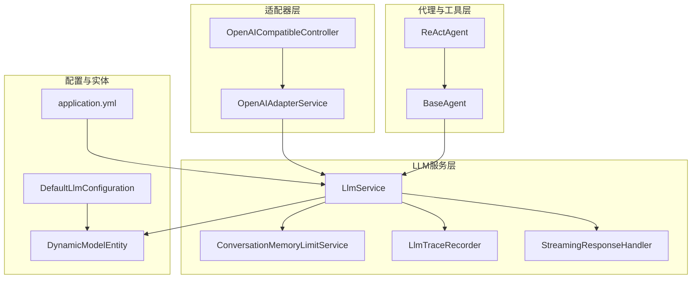
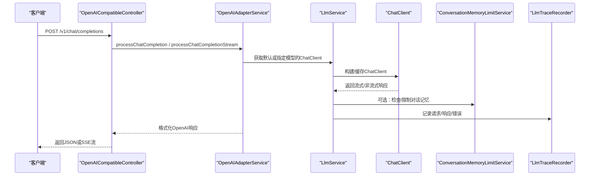
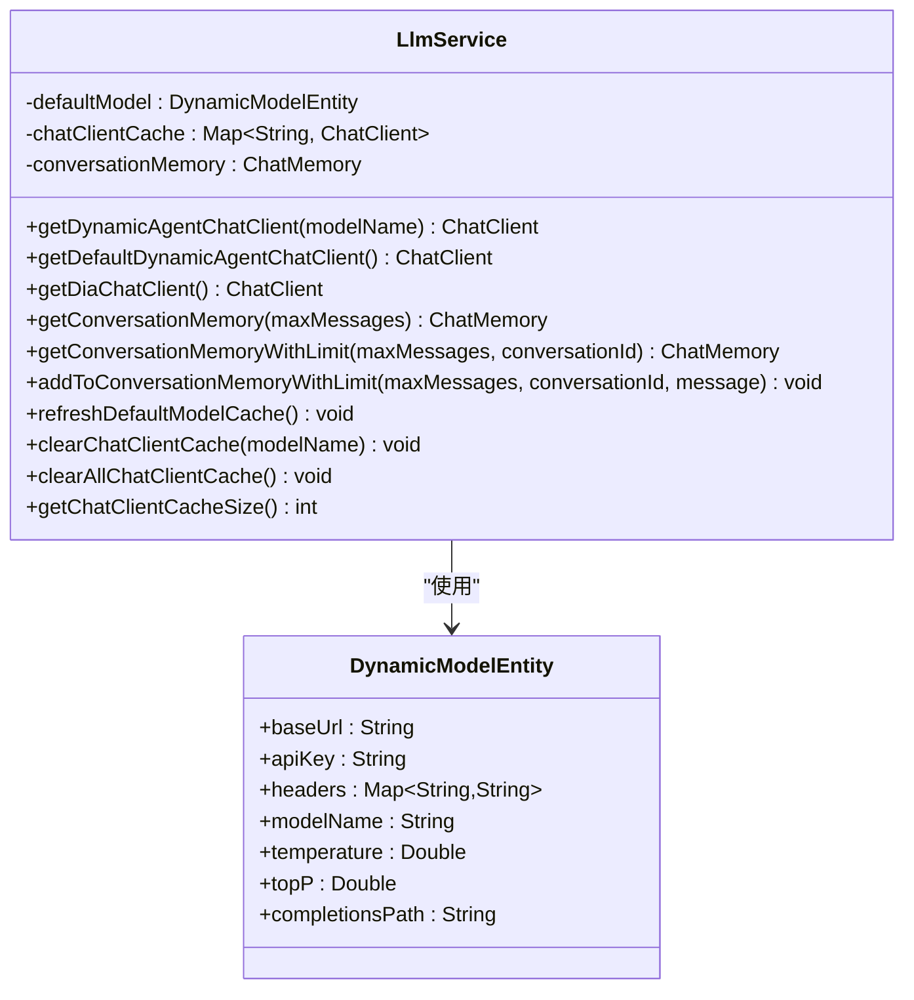
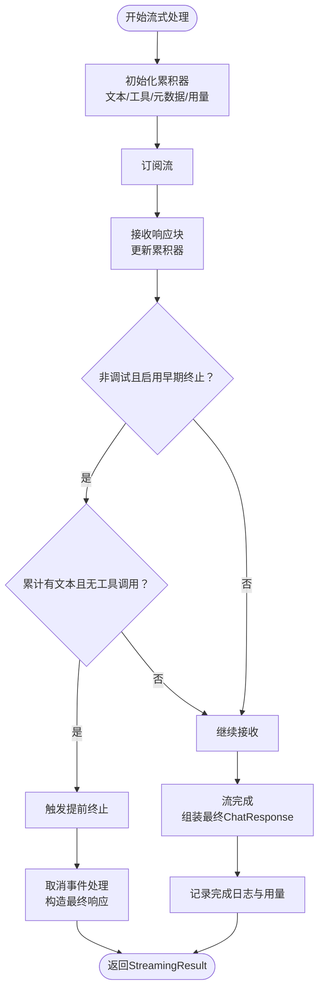
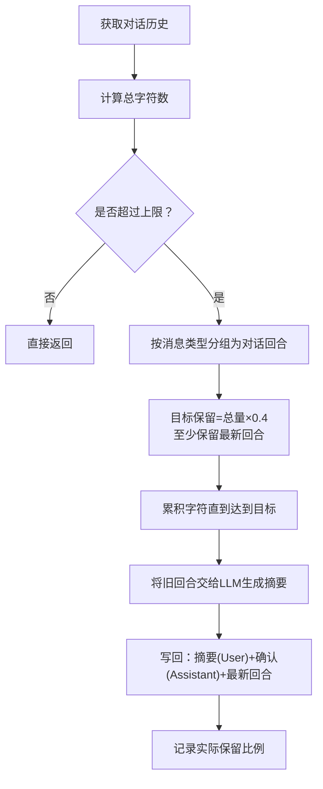
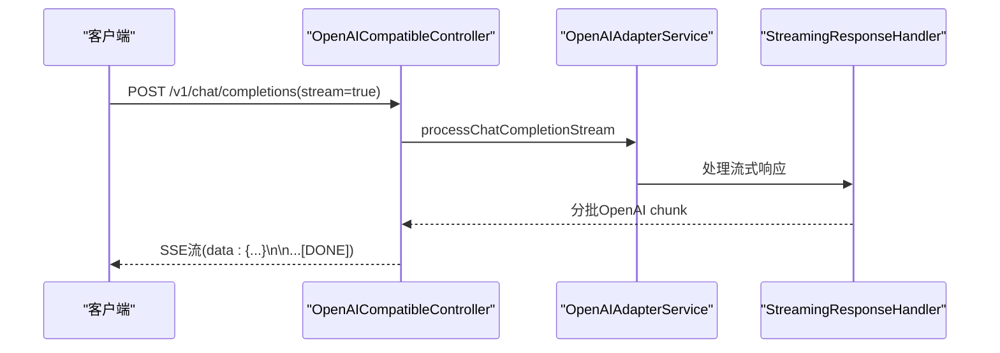
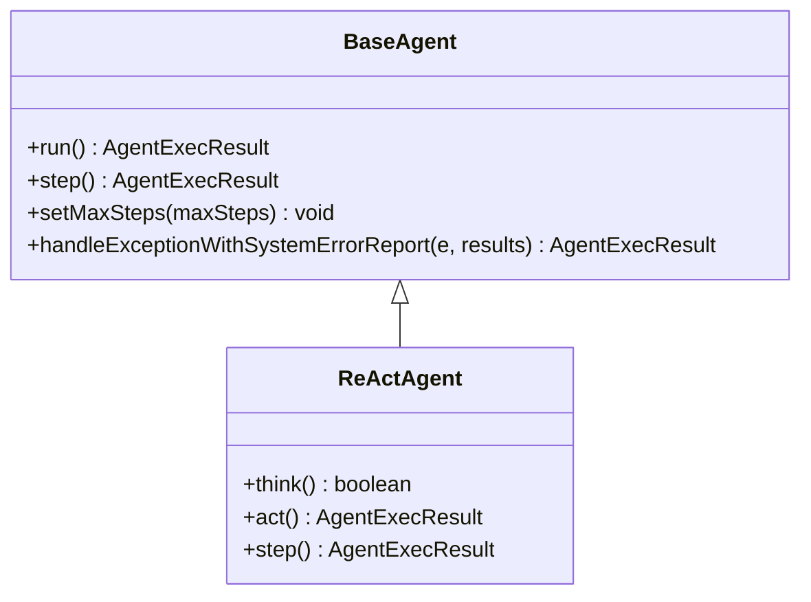
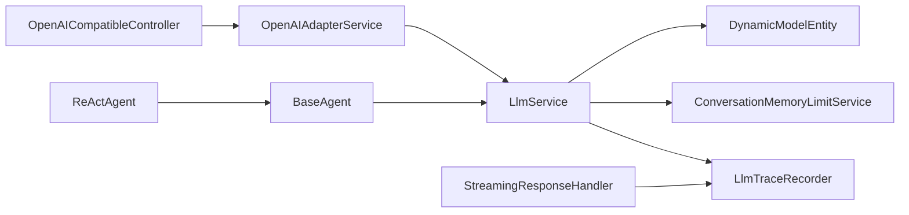

# LLM服务集成

<cite>
**本文引用的文件**   
- [LlmService.java](file://src/main/java/com/alibaba/cloud/ai/lynxe/llm/LlmService.java)
- [StreamingResponseHandler.java](file://src/main/java/com/alibaba/cloud/ai/lynxe/llm/StreamingResponseHandler.java)
- [ConversationMemoryLimitService.java](file://src/main/java/com/alibaba/cloud/ai/lynxe/llm/ConversationMemoryLimitService.java)
- [LlmTraceRecorder.java](file://src/main/java/com/alibaba/cloud/ai/lynxe/llm/LlmTraceRecorder.java)
- [OpenAICompatibleController.java](file://src/main/java/com/alibaba/cloud/ai/lynxe/adapter/controller/OpenAICompatibleController.java)
- [OpenAIAdapterService.java](file://src/main/java/com/alibaba/cloud/ai/lynxe/adapter/service/OpenAIAdapterService.java)
- [DefaultLlmConfiguration.java](file://src/main/java/com/alibaba/cloud/ai/lynxe/config/DefaultLlmConfiguration.java)
- [DynamicModelEntity.java](file://src/main/java/com/alibaba/cloud/ai/lynxe/model/entity/DynamicModelEntity.java)
- [BaseAgent.java](file://src/main/java/com/alibaba/cloud/ai/lynxe/agent/BaseAgent.java)
- [ReActAgent.java](file://src/main/java/com/alibaba/cloud/ai/lynxe/agent/ReActAgent.java)
- [application.yml](file://src/main/resources/application.yml)
</cite>

## 目录
1. [引言](#引言)
2. [项目结构](#项目结构)
3. [核心组件](#核心组件)
4. [架构总览](#架构总览)
5. [详细组件分析](#详细组件分析)
6. [依赖关系分析](#依赖关系分析)
7. [性能考量](#性能考量)
8. [故障排查指南](#故障排查指南)
9. [结论](#结论)
10. [附录](#附录)

## 引言
本文件面向Lynxe LLM服务集成，系统化阐述LLM服务封装、配置与调用机制；解释流式响应处理、实时通信与状态管理；梳理对话记忆管理、上下文维护与历史记录；给出LLM提供商适配、切换与配置策略；并提供LLM调优、性能监控与成本控制建议，以及LLM与代理系统、工具调用的交互模式，最后覆盖扩展性、可用性与故障恢复机制。

## 项目结构
围绕LLM能力，核心模块包括：
- LLM服务层：统一构建ChatClient、模型参数注入、内存与追踪
- 流式处理层：合并增量输出、进度日志、早期终止与错误处理
- 适配器层：OpenAI兼容接口，支持流式与非流式
- 代理与工具层：基于ReAct范式的智能体执行链路
- 配置与实体：动态模型配置、默认提供商与参数

**图表来源**
- [OpenAICompatibleController.java:85-116](file://src/main/java/com/alibaba/cloud/ai/lynxe/adapter/controller/OpenAICompatibleController.java#L85-L116)
- [OpenAIAdapterService.java:66-97](file://src/main/java/com/alibaba/cloud/ai/lynxe/adapter/service/OpenAIAdapterService.java#L66-L97)
- [LlmService.java:112-120](file://src/main/java/com/alibaba/cloud/ai/lynxe/llm/LlmService.java#L112-L120)
- [StreamingResponseHandler.java:167-168](file://src/main/java/com/alibaba/cloud/ai/lynxe/llm/StreamingResponseHandler.java#L167-L168)
- [ConversationMemoryLimitService.java:73-103](file://src/main/java/com/alibaba/cloud/ai/lynxe/llm/ConversationMemoryLimitService.java#L73-L103)
- [LlmTraceRecorder.java:56-87](file://src/main/java/com/alibaba/cloud/ai/lynxe/llm/LlmTraceRecorder.java#L56-L87)
- [BaseAgent.java:281-357](file://src/main/java/com/alibaba/cloud/ai/lynxe/agent/BaseAgent.java#L281-L357)
- [ReActAgent.java:79-94](file://src/main/java/com/alibaba/cloud/ai/lynxe/agent/ReActAgent.java#L79-L94)
- [DynamicModelEntity.java:24-62](file://src/main/java/com/alibaba/cloud/ai/lynxe/model/entity/DynamicModelEntity.java#L24-L62)
- [DefaultLlmConfiguration.java:24-51](file://src/main/java/com/alibaba/cloud/ai/lynxe/config/DefaultLlmConfiguration.java#L24-L51)
- [application.yml:1-97](file://src/main/resources/application.yml#L1-L97)

**章节来源**
- [OpenAICompatibleController.java:85-116](file://src/main/java/com/alibaba/cloud/ai/lynxe/adapter/controller/OpenAICompatibleController.java#L85-L116)
- [OpenAIAdapterService.java:66-97](file://src/main/java/com/alibaba/cloud/ai/lynxe/adapter/service/OpenAIAdapterService.java#L66-L97)
- [LlmService.java:112-120](file://src/main/java/com/alibaba/cloud/ai/lynxe/llm/LlmService.java#L112-L120)
- [StreamingResponseHandler.java:167-168](file://src/main/java/com/alibaba/cloud/ai/lynxe/llm/StreamingResponseHandler.java#L167-L168)
- [ConversationMemoryLimitService.java:73-103](file://src/main/java/com/alibaba/cloud/ai/lynxe/llm/ConversationMemoryLimitService.java#L73-L103)
- [LlmTraceRecorder.java:56-87](file://src/main/java/com/alibaba/cloud/ai/lynxe/llm/LlmTraceRecorder.java#L56-L87)
- [BaseAgent.java:281-357](file://src/main/java/com/alibaba/cloud/ai/lynxe/agent/BaseAgent.java#L281-L357)
- [ReActAgent.java:79-94](file://src/main/java/com/alibaba/cloud/ai/lynxe/agent/ReActAgent.java#L79-L94)
- [DynamicModelEntity.java:24-62](file://src/main/java/com/alibaba/cloud/ai/lynxe/model/entity/DynamicModelEntity.java#L24-L62)
- [DefaultLlmConfiguration.java:24-51](file://src/main/java/com/alibaba/cloud/ai/lynxe/config/DefaultLlmConfiguration.java#L24-L51)
- [application.yml:1-97](file://src/main/resources/application.yml#L1-L97)

## 核心组件
- LlmService：统一构建ChatClient、按模型缓存实例、注入HTTP头与工具执行策略、注入观测与重试；提供对话记忆获取与限制、默认模型懒加载与事件驱动刷新。
- StreamingResponseHandler：合并流式响应文本与工具调用、周期性进度日志、非调试模式下“仅思考”早期终止、错误与取消事件处理、统计字符数与用量元数据。
- ConversationMemoryLimitService：按字符计数压缩历史，保留最近N字符与最新一轮，使用LLM生成state_snapshot摘要，维持用户-助手消息对一致性。
- LlmTraceRecorder：请求/响应/错误的结构化追踪，记录输入输出字符数，便于审计与成本估算。
- OpenAICompatibleController/Service：OpenAI兼容端点，支持流式与非流式；健康检查与模型列表；将外部请求转换为内部执行上下文。
- BaseAgent/ReActAgent：智能体执行框架，支持多步推理-行动循环、工具回调、中断与异常处理、最终总结与终止。
- DynamicModelEntity/DefaultLlmConfiguration：动态模型配置实体与默认提供商配置，支持温度、topP、自定义头部、完成路径等。

**章节来源**
- [LlmService.java:112-120](file://src/main/java/com/alibaba/cloud/ai/lynxe/llm/LlmService.java#L112-L120)
- [StreamingResponseHandler.java:167-168](file://src/main/java/com/alibaba/cloud/ai/lynxe/llm/StreamingResponseHandler.java#L167-L168)
- [ConversationMemoryLimitService.java:73-103](file://src/main/java/com/alibaba/cloud/ai/lynxe/llm/ConversationMemoryLimitService.java#L73-L103)
- [LlmTraceRecorder.java:56-87](file://src/main/java/com/alibaba/cloud/ai/lynxe/llm/LlmTraceRecorder.java#L56-L87)
- [OpenAICompatibleController.java:85-116](file://src/main/java/com/alibaba/cloud/ai/lynxe/adapter/controller/OpenAICompatibleController.java#L85-L116)
- [OpenAIAdapterService.java:66-97](file://src/main/java/com/alibaba/cloud/ai/lynxe/adapter/service/OpenAIAdapterService.java#L66-L97)
- [BaseAgent.java:281-357](file://src/main/java/com/alibaba/cloud/ai/lynxe/agent/BaseAgent.java#L281-L357)
- [ReActAgent.java:79-94](file://src/main/java/com/alibaba/cloud/ai/lynxe/agent/ReActAgent.java#L79-L94)
- [DynamicModelEntity.java:24-62](file://src/main/java/com/alibaba/cloud/ai/lynxe/model/entity/DynamicModelEntity.java#L24-L62)
- [DefaultLlmConfiguration.java:24-51](file://src/main/java/com/alibaba/cloud/ai/lynxe/config/DefaultLlmConfiguration.java#L24-L51)

## 架构总览
从客户端到LLM的完整链路如下：

**图表来源**
- [OpenAICompatibleController.java:85-116](file://src/main/java/com/alibaba/cloud/ai/lynxe/adapter/controller/OpenAICompatibleController.java#L85-L116)
- [OpenAIAdapterService.java:66-97](file://src/main/java/com/alibaba/cloud/ai/lynxe/adapter/service/OpenAIAdapterService.java#L66-L97)
- [LlmService.java:112-120](file://src/main/java/com/alibaba/cloud/ai/lynxe/llm/LlmService.java#L112-L120)
- [StreamingResponseHandler.java:167-168](file://src/main/java/com/alibaba/cloud/ai/lynxe/llm/StreamingResponseHandler.java#L167-L168)
- [ConversationMemoryLimitService.java:73-103](file://src/main/java/com/alibaba/cloud/ai/lynxe/llm/ConversationMemoryLimitService.java#L73-L103)
- [LlmTraceRecorder.java:56-87](file://src/main/java/com/alibaba/cloud/ai/lynxe/llm/LlmTraceRecorder.java#L56-L87)

## 详细组件分析

### LlmService：统一模型封装与会话管理
- 统一构建ChatClient：通过OpenAI兼容API封装，注入默认选项、工具执行策略、观测注册表与可选的DNS缓存WebClient。
- 模型缓存与懒加载：以模型名为键缓存ChatClient实例，首次使用时从数据库加载默认模型；监听模型变更事件刷新缓存。
- 对话记忆：提供MessageWindowChatMemory实例，支持按需限制字符数并触发压缩。
- 请求追踪：在OpenAiApi子类中拦截请求/响应，交由LlmTraceRecorder记录。

**图表来源**
- [LlmService.java:112-120](file://src/main/java/com/alibaba/cloud/ai/lynxe/llm/LlmService.java#L112-L120)
- [DynamicModelEntity.java:24-62](file://src/main/java/com/alibaba/cloud/ai/lynxe/model/entity/DynamicModelEntity.java#L24-L62)

**章节来源**
- [LlmService.java:112-120](file://src/main/java/com/alibaba/cloud/ai/lynxe/llm/LlmService.java#L112-L120)
- [LlmService.java:266-280](file://src/main/java/com/alibaba/cloud/ai/lynxe/llm/LlmService.java#L266-L280)
- [LlmService.java:329-364](file://src/main/java/com/alibaba/cloud/ai/lynxe/llm/LlmService.java#L329-L364)
- [LlmService.java:441-479](file://src/main/java/com/alibaba/cloud/ai/lynxe/llm/LlmService.java#L441-L479)
- [DynamicModelEntity.java:24-62](file://src/main/java/com/alibaba/cloud/ai/lynxe/model/entity/DynamicModelEntity.java#L24-L62)

### StreamingResponseHandler：流式响应合并与状态管理
- 合并策略：累积文本内容、工具调用列表与元数据，最终组装为单个ChatResponse。
- 进度日志：每10秒输出一次进度，包含响应次数、字符数、字符/秒、工具调用数量与预览。
- 早期终止：非调试模式下，当累计出现文本但无工具调用时，触发takeUntil提前结束流。
- 错误与取消：捕获WebClient异常与取消事件，构造最终响应并发布计划异常事件。
- 字符统计与用量：从追踪器与响应元数据汇总输入/输出字符数与Token用量。

**图表来源**
- [StreamingResponseHandler.java:167-168](file://src/main/java/com/alibaba/cloud/ai/lynxe/llm/StreamingResponseHandler.java#L167-L168)
- [StreamingResponseHandler.java:211-219](file://src/main/java/com/alibaba/cloud/ai/lynxe/llm/StreamingResponseHandler.java#L211-L219)
- [StreamingResponseHandler.java:302-347](file://src/main/java/com/alibaba/cloud/ai/lynxe/llm/StreamingResponseHandler.java#L302-L347)
- [StreamingResponseHandler.java:368-404](file://src/main/java/com/alibaba/cloud/ai/lynxe/llm/StreamingResponseHandler.java#L368-L404)

**章节来源**
- [StreamingResponseHandler.java:167-168](file://src/main/java/com/alibaba/cloud/ai/lynxe/llm/StreamingResponseHandler.java#L167-L168)
- [StreamingResponseHandler.java:211-219](file://src/main/java/com/alibaba/cloud/ai/lynxe/llm/StreamingResponseHandler.java#L211-L219)
- [StreamingResponseHandler.java:302-347](file://src/main/java/com/alibaba/cloud/ai/lynxe/llm/StreamingResponseHandler.java#L302-L347)
- [StreamingResponseHandler.java:368-404](file://src/main/java/com/alibaba/cloud/ai/lynxe/llm/StreamingResponseHandler.java#L368-L404)

### ConversationMemoryLimitService：对话记忆压缩与上下文维护
- 字符计数：优先JSON序列化消息列表计算字符数，回退为文本长度之和。
- 分组策略：按用户-助手-工具响应三类消息分组为“对话回合”，保留最新回合并压缩旧回合。
- 压缩摘要：使用LLM生成state_snapshot格式摘要（3000-4000字符），作为新的用户消息插入，随后添加确认助手消息，保持消息对一致性。
- 强制压缩：针对潜在死循环场景，强制保留最新回合并压缩更早回合。

**图表来源**
- [ConversationMemoryLimitService.java:73-103](file://src/main/java/com/alibaba/cloud/ai/lynxe/llm/ConversationMemoryLimitService.java#L73-L103)
- [ConversationMemoryLimitService.java:208-315](file://src/main/java/com/alibaba/cloud/ai/lynxe/llm/ConversationMemoryLimitService.java#L208-L315)
- [ConversationMemoryLimitService.java:416-520](file://src/main/java/com/alibaba/cloud/ai/lynxe/llm/ConversationMemoryLimitService.java#L416-L520)

**章节来源**
- [ConversationMemoryLimitService.java:73-103](file://src/main/java/com/alibaba/cloud/ai/lynxe/llm/ConversationMemoryLimitService.java#L73-L103)
- [ConversationMemoryLimitService.java:208-315](file://src/main/java/com/alibaba/cloud/ai/lynxe/llm/ConversationMemoryLimitService.java#L208-L315)
- [ConversationMemoryLimitService.java:416-520](file://src/main/java/com/alibaba/cloud/ai/lynxe/llm/ConversationMemoryLimitService.java#L416-L520)

### LlmTraceRecorder：请求/响应/错误追踪
- 请求：记录原始请求JSON与输入字符数（按消息内容累加）。
- 响应：记录响应JSON与输出字符数。
- 错误：记录状态码、响应体、URL等，便于定位问题。

**章节来源**
- [LlmTraceRecorder.java:56-87](file://src/main/java/com/alibaba/cloud/ai/lynxe/llm/LlmTraceRecorder.java#L56-L87)
- [LlmTraceRecorder.java:89-100](file://src/main/java/com/alibaba/cloud/ai/lynxe/llm/LlmTraceRecorder.java#L89-L100)
- [LlmTraceRecorder.java:106-121](file://src/main/java/com/alibaba/cloud/ai/lynxe/llm/LlmTraceRecorder.java#L106-L121)

### OpenAI兼容控制器与适配器
- 控制器：提供/v1/chat/completions与/v1/models、/v1/health端点，支持SSE流式返回与非流式JSON返回。
- 适配器：提取用户消息、准备执行上下文、健康检查短路、估算Token用量、将内部结果转为OpenAI格式。

**图表来源**
- [OpenAICompatibleController.java:121-185](file://src/main/java/com/alibaba/cloud/ai/lynxe/adapter/controller/OpenAICompatibleController.java#L121-L185)
- [OpenAICompatibleController.java:189-227](file://src/main/java/com/alibaba/cloud/ai/lynxe/adapter/controller/OpenAICompatibleController.java#L189-L227)
- [OpenAIAdapterService.java:102-135](file://src/main/java/com/alibaba/cloud/ai/lynxe/adapter/service/OpenAIAdapterService.java#L102-L135)
- [StreamingResponseHandler.java:167-168](file://src/main/java/com/alibaba/cloud/ai/lynxe/llm/StreamingResponseHandler.java#L167-L168)

**章节来源**
- [OpenAICompatibleController.java:85-116](file://src/main/java/com/alibaba/cloud/ai/lynxe/adapter/controller/OpenAICompatibleController.java#L85-L116)
- [OpenAICompatibleController.java:121-185](file://src/main/java/com/alibaba/cloud/ai/lynxe/adapter/controller/OpenAICompatibleController.java#L121-L185)
- [OpenAICompatibleController.java:189-227](file://src/main/java/com/alibaba/cloud/ai/lynxe/adapter/controller/OpenAICompatibleController.java#L189-L227)
- [OpenAIAdapterService.java:66-97](file://src/main/java/com/alibaba/cloud/ai/lynxe/adapter/service/OpenAIAdapterService.java#L66-L97)
- [OpenAIAdapterService.java:102-135](file://src/main/java/com/alibaba/cloud/ai/lynxe/adapter/service/OpenAIAdapterService.java#L102-L135)

### 代理系统与工具调用交互
- BaseAgent：定义执行生命周期、步骤限制、异常与中断处理、最终总结与终止。
- ReActAgent：在think/act之间交替，根据决策决定是否执行工具调用。
- 与LLM集成：通过LlmService获取ChatClient，结合工具回调与记忆服务，实现多轮推理-行动。

**图表来源**
- [BaseAgent.java:281-357](file://src/main/java/com/alibaba/cloud/ai/lynxe/agent/BaseAgent.java#L281-L357)
- [ReActAgent.java:79-94](file://src/main/java/com/alibaba/cloud/ai/lynxe/agent/ReActAgent.java#L79-L94)

**章节来源**
- [BaseAgent.java:281-357](file://src/main/java/com/alibaba/cloud/ai/lynxe/agent/BaseAgent.java#L281-L357)
- [ReActAgent.java:79-94](file://src/main/java/com/alibaba/cloud/ai/lynxe/agent/ReActAgent.java#L79-L94)

## 依赖关系分析
- LlmService依赖DynamicModelEntity进行模型参数注入，依赖ChatMemoryRepository与ConversationMemoryLimitService进行记忆管理，依赖ObservationRegistry与WebClient进行可观测与网络增强。
- StreamingResponseHandler依赖LlmTraceRecorder进行请求/响应追踪，并通过事件发布器上报异常。
- OpenAICompatibleController依赖OpenAIAdapterService；OpenAIAdapterService依赖PlanIdDispatcher与执行上下文。
- BaseAgent/ReActAgent依赖LlmService进行推理与工具调用。

**图表来源**
- [LlmService.java:89-101](file://src/main/java/com/alibaba/cloud/ai/lynxe/llm/LlmService.java#L89-L101)
- [StreamingResponseHandler.java:62-66](file://src/main/java/com/alibaba/cloud/ai/lynxe/llm/StreamingResponseHandler.java#L62-L66)
- [OpenAICompatibleController.java:73-79](file://src/main/java/com/alibaba/cloud/ai/lynxe/adapter/controller/OpenAICompatibleController.java#L73-L79)
- [OpenAIAdapterService.java:60-61](file://src/main/java/com/alibaba/cloud/ai/lynxe/adapter/service/OpenAIAdapterService.java#L60-L61)
- [BaseAgent.java:269-279](file://src/main/java/com/alibaba/cloud/ai/lynxe/agent/BaseAgent.java#L269-L279)
- [ReActAgent.java:40-44](file://src/main/java/com/alibaba/cloud/ai/lynxe/agent/ReActAgent.java#L40-L44)

**章节来源**
- [LlmService.java:89-101](file://src/main/java/com/alibaba/cloud/ai/lynxe/llm/LlmService.java#L89-L101)
- [StreamingResponseHandler.java:62-66](file://src/main/java/com/alibaba/cloud/ai/lynxe/llm/StreamingResponseHandler.java#L62-L66)
- [OpenAICompatibleController.java:73-79](file://src/main/java/com/alibaba/cloud/ai/lynxe/adapter/controller/OpenAICompatibleController.java#L73-L79)
- [OpenAIAdapterService.java:60-61](file://src/main/java/com/alibaba/cloud/ai/lynxe/adapter/service/OpenAIAdapterService.java#L60-L61)
- [BaseAgent.java:269-279](file://src/main/java/com/alibaba/cloud/ai/lynxe/agent/BaseAgent.java#L269-L279)
- [ReActAgent.java:40-44](file://src/main/java/com/alibaba/cloud/ai/lynxe/agent/ReActAgent.java#L40-L44)

## 性能考量
- 流式处理：通过10秒周期日志与takeUntil早期终止减少无效等待，提升感知性能。
- 缓存策略：ChatClient按模型名缓存，避免重复构建；默认模型变更事件触发全量清理与重建。
- 网络优化：优先使用带DNS缓存的WebClient；否则设置10分钟超时与10MB内存限制，降低长连接与内存压力。
- 记忆压缩：按字符上限与保留比例压缩旧对话，降低上下文长度，提高响应速度与稳定性。
- 观测与追踪：注入ObservationRegistry与自定义追踪器，便于性能分析与成本归因。

[本节为通用指导，无需特定文件引用]

## 故障排查指南
- 流式错误：StreamingResponseHandler捕获WebClient异常，记录状态码、响应体与URL，同时发布计划异常事件。
- 取消与早期终止：检测到“仅思考”响应时主动取消流，构造最终响应，确保前端体验一致。
- 请求追踪：LlmTraceRecorder记录请求/响应/错误，便于定位问题与复现。
- 健康检查：/v1/health返回服务状态；/v1/models返回可用模型信息。

**章节来源**
- [StreamingResponseHandler.java:348-428](file://src/main/java/com/alibaba/cloud/ai/lynxe/llm/StreamingResponseHandler.java#L348-L428)
- [StreamingResponseHandler.java:368-404](file://src/main/java/com/alibaba/cloud/ai/lynxe/llm/StreamingResponseHandler.java#L368-L404)
- [LlmTraceRecorder.java:106-121](file://src/main/java/com/alibaba/cloud/ai/lynxe/llm/LlmTraceRecorder.java#L106-L121)
- [OpenAICompatibleController.java:293-298](file://src/main/java/com/alibaba/cloud/ai/lynxe/adapter/controller/OpenAICompatibleController.java#L293-L298)

## 结论
Lynxe通过LlmService统一抽象LLM接入，结合StreamingResponseHandler实现稳健的流式处理与状态管理，配合ConversationMemoryLimitService保障上下文规模可控；通过OpenAI兼容适配器对外提供标准接口；在代理系统中以ReAct范式实现推理-行动闭环。整体设计兼顾性能、可观测性与可扩展性，支持多提供商切换与动态配置。

[本节为总结，无需特定文件引用]

## 附录

### LLM提供商适配与切换策略
- 动态模型配置：通过DynamicModelEntity配置baseUrl、apiKey、headers、modelName、temperature、topP、completionsPath等。
- 默认提供商：DefaultLlmConfiguration提供DashScope/Qwen默认值，便于快速启动。
- 切换机制：LlmService按模型名缓存ChatClient；监听模型变更事件刷新缓存；支持清空指定或全部缓存。

**章节来源**
- [DynamicModelEntity.java:24-62](file://src/main/java/com/alibaba/cloud/ai/lynxe/model/entity/DynamicModelEntity.java#L24-L62)
- [DefaultLlmConfiguration.java:24-51](file://src/main/java/com/alibaba/cloud/ai/lynxe/config/DefaultLlmConfiguration.java#L24-L51)
- [LlmService.java:266-280](file://src/main/java/com/alibaba/cloud/ai/lynxe/llm/LlmService.java#L266-L280)
- [LlmService.java:299-312](file://src/main/java/com/alibaba/cloud/ai/lynxe/llm/LlmService.java#L299-L312)

### LLM调优与成本控制
- 温度与采样：通过DynamicModelEntity设置temperature/topP，平衡创造性与稳定性。
- 上下文压缩：ConversationMemoryLimitService按字符上限与保留比例压缩历史，降低Token消耗。
- 追踪与计量：LlmTraceRecorder记录输入/输出字符数，辅助成本估算与阈值设定。
- 超时与资源：网络层设置合理超时与内存限制，避免资源泄露。

**章节来源**
- [DynamicModelEntity.java:54-59](file://src/main/java/com/alibaba/cloud/ai/lynxe/model/entity/DynamicModelEntity.java#L54-L59)
- [ConversationMemoryLimitService.java:73-103](file://src/main/java/com/alibaba/cloud/ai/lynxe/llm/ConversationMemoryLimitService.java#L73-L103)
- [LlmTraceRecorder.java:56-87](file://src/main/java/com/alibaba/cloud/ai/lynxe/llm/LlmTraceRecorder.java#L56-L87)
- [LlmService.java:372-388](file://src/main/java/com/alibaba/cloud/ai/lynxe/llm/LlmService.java#L372-L388)

### 扩展性、可用性与故障恢复
- 扩展性：新增LLM提供商只需实现OpenAI兼容API或替换ChatClient构建逻辑；模型变更事件驱动缓存刷新。
- 可用性：健康检查端点与流式进度日志提升可用性感知；错误与取消事件处理保证前端稳定。
- 故障恢复：流式错误捕获与事件发布；强制压缩记忆打破潜在死循环；默认模型缓存刷新应对配置变更。

**章节来源**
- [OpenAICompatibleController.java:293-298](file://src/main/java/com/alibaba/cloud/ai/lynxe/adapter/controller/OpenAICompatibleController.java#L293-L298)
- [StreamingResponseHandler.java:348-428](file://src/main/java/com/alibaba/cloud/ai/lynxe/llm/StreamingResponseHandler.java#L348-L428)
- [ConversationMemoryLimitService.java:555-681](file://src/main/java/com/alibaba/cloud/ai/lynxe/llm/ConversationMemoryLimitService.java#L555-L681)
- [LlmService.java:286-293](file://src/main/java/com/alibaba/cloud/ai/lynxe/llm/LlmService.java#L286-L293)