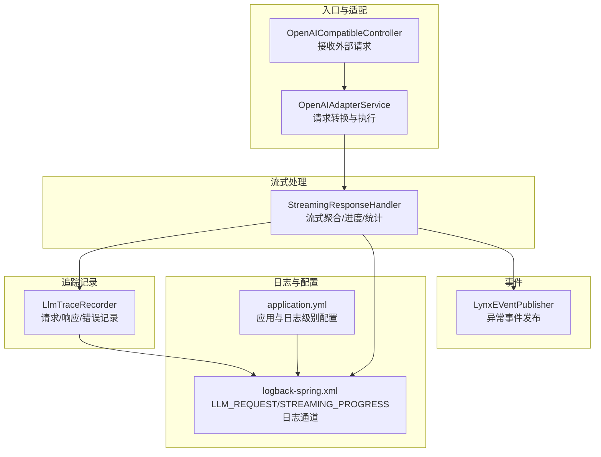
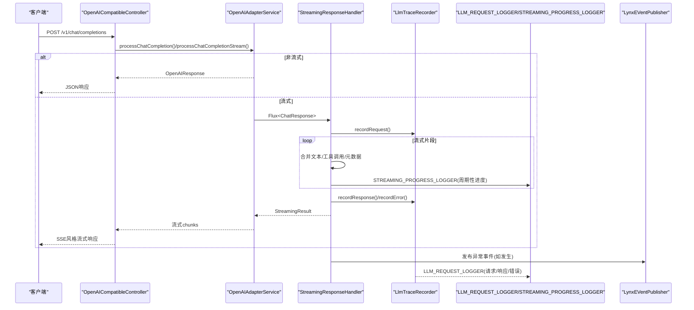
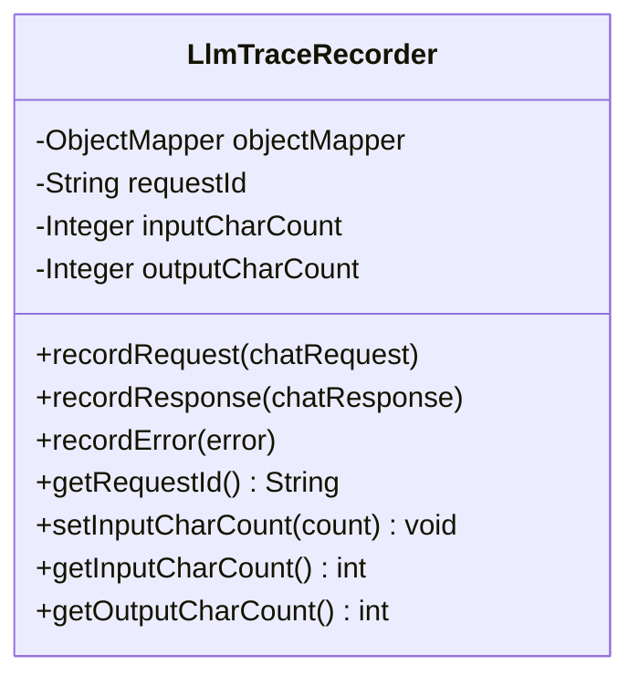
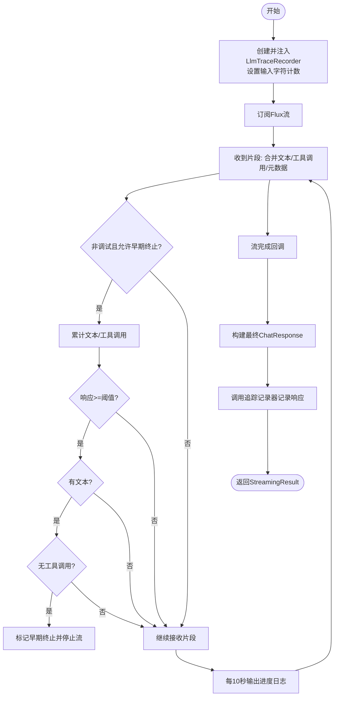
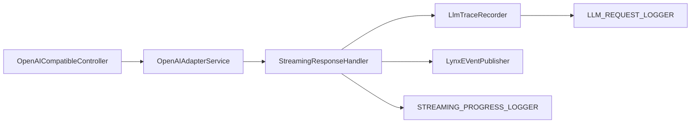

# LLM追踪记录器

<cite>
**本文引用的文件**
- [LlmTraceRecorder.java](file://src/main/java/com/alibaba/cloud/ai/lynxe/llm/LlmTraceRecorder.java)
- [StreamingResponseHandler.java](file://src/main/java/com/alibaba/cloud/ai/lynxe/llm/StreamingResponseHandler.java)
- [OpenAICompatibleController.java](file://src/main/java/com/alibaba/cloud/ai/lynxe/adapter/controller/OpenAICompatibleController.java)
- [OpenAIAdapterService.java](file://src/main/java/com/alibaba/cloud/ai/lynxe/adapter/service/OpenAIAdapterService.java)
- [logback-spring.xml](file://src/main/resources/logback-spring.xml)
- [application.yml](file://src/main/resources/application.yml)
- [LynxeEventPublisher.java](file://src/main/java/com/alibaba/cloud/ai/lynxe/event/LynxeEventPublisher.java)
</cite>

## 目录
1. [引言](#引言)
2. [项目结构](#项目结构)
3. [核心组件](#核心组件)
4. [架构总览](#架构总览)
5. [详细组件分析](#详细组件分析)
6. [依赖分析](#依赖分析)
7. [性能考量](#性能考量)
8. [故障排查指南](#故障排查指南)
9. [结论](#结论)
10. [附录](#附录)

## 引言
本文件面向Lynxe项目的“LLM追踪记录器”子系统，系统性阐述其设计目标与实现细节，覆盖请求与响应的完整记录机制、追踪数据的结构化存储、性能影响最小化策略、追踪数据的查询与分析能力、安全考虑与访问控制，以及具体使用示例与系统优化建议。该追踪记录器以轻量、可扩展为目标，通过专用日志通道与结构化字段，确保在不影响主业务流程的前提下，提供高质量的可观测性与可审计性。

## 项目结构
围绕LLM追踪记录器的关键模块与文件如下：
- 控制层：OpenAI兼容控制器负责接收外部请求并分发到适配服务
- 适配层：OpenAI适配服务负责请求转换、执行上下文准备与结果格式化
- 流式处理：流式响应处理器负责合并流式片段、周期性进度日志、早期终止与最终聚合
- 追踪记录：LLM追踪记录器负责单次请求/响应周期内的请求体、响应体、错误信息与字符计数记录
- 日志配置：Logback配置定义了LLM请求日志与流式进度日志的独立滚动文件通道
- 事件发布：事件发布器用于在异常时触发上层事件，便于统一监控与告警

图表来源
- [OpenAICompatibleController.java:85-116](file://src/main/java/com/alibaba/cloud/ai/lynxe/adapter/controller/OpenAICompatibleController.java#L85-L116)
- [OpenAIAdapterService.java:66-97](file://src/main/java/com/alibaba/cloud/ai/lynxe/adapter/service/OpenAIAdapterService.java#L66-L97)
- [StreamingResponseHandler.java:167-452](file://src/main/java/com/alibaba/cloud/ai/lynxe/llm/StreamingResponseHandler.java#L167-L452)
- [LlmTraceRecorder.java:56-121](file://src/main/java/com/alibaba/cloud/ai/lynxe/llm/LlmTraceRecorder.java#L56-L121)
- [logback-spring.xml:114-158](file://src/main/resources/logback-spring.xml#L114-L158)
- [application.yml:46-57](file://src/main/resources/application.yml#L46-L57)

章节来源
- [OpenAICompatibleController.java:85-116](file://src/main/java/com/alibaba/cloud/ai/lynxe/adapter/controller/OpenAICompatibleController.java#L85-L116)
- [OpenAIAdapterService.java:66-97](file://src/main/java/com/alibaba/cloud/ai/lynxe/adapter/service/OpenAIAdapterService.java#L66-L97)
- [StreamingResponseHandler.java:167-452](file://src/main/java/com/alibaba/cloud/ai/lynxe/llm/StreamingResponseHandler.java#L167-L452)
- [LlmTraceRecorder.java:56-121](file://src/main/java/com/alibaba/cloud/ai/lynxe/llm/LlmTraceRecorder.java#L56-L121)
- [logback-spring.xml:114-158](file://src/main/resources/logback-spring.xml#L114-L158)
- [application.yml:46-57](file://src/main/resources/application.yml#L46-L57)

## 核心组件
- LLM追踪记录器（LlmTraceRecorder）
  - 单次请求/响应周期的追踪载体，负责记录请求体、响应体、错误详情，并维护输入/输出字符计数
  - 使用专用SLF4J记录器“LLM_REQUEST_LOGGER”，输出到独立的日志文件通道
  - 支持从OpenAI消息中估算输入字符数，对非文本内容（如媒体）进行跳过或降级处理
- 流式响应处理器（StreamingResponseHandler）
  - 在流式场景下合并片段、周期性输出进度日志、统计令牌用量与字符数、支持早期终止
  - 在完成阶段汇总生成最终ChatResponse，并调用追踪记录器记录响应与字符计数
- OpenAI兼容控制器（OpenAICompatibleController）
  - 对外提供OpenAI兼容接口，支持流式与非流式两种模式
  - 统一请求日志与错误处理，将请求体与消息预览写入日志
- OpenAI适配服务（OpenAIAdapterService）
  - 将OpenAI格式请求转换为内部执行上下文，负责健康检查与简单问候等快速路径
  - 提供流式与非流式的响应封装，便于控制器直接返回
- 日志配置（logback-spring.xml）
  - 定义“LLM_REQUEST_LOGGER”与“STREAMING_PROGRESS_LOGGER”的独立滚动文件通道
  - 控制日志级别、滚动策略与编码，确保追踪数据持久化与容量管理
- 应用配置（application.yml）
  - 设置根日志级别、Spring AI自动配置排除项、计划轮询与文件上传等全局参数
- 事件发布（LynxEVentPublisher）
  - 在流式处理异常时发布事件，便于上层监控系统统一采集与告警

章节来源
- [LlmTraceRecorder.java:31-156](file://src/main/java/com/alibaba/cloud/ai/lynxe/llm/LlmTraceRecorder.java#L31-L156)
- [StreamingResponseHandler.java:54-452](file://src/main/java/com/alibaba/cloud/ai/lynxe/llm/StreamingResponseHandler.java#L54-L452)
- [OpenAICompatibleController.java:50-116](file://src/main/java/com/alibaba/cloud/ai/lynxe/adapter/controller/OpenAICompatibleController.java#L50-L116)
- [OpenAIAdapterService.java:36-135](file://src/main/java/com/alibaba/cloud/ai/lynxe/adapter/service/OpenAIAdapterService.java#L36-L135)
- [logback-spring.xml:114-158](file://src/main/resources/logback-spring.xml#L114-L158)
- [application.yml:46-57](file://src/main/resources/application.yml#L46-L57)
- [LynxeEventPublisher.java:27-65](file://src/main/java/com/alibaba/cloud/ai/lynxe/event/LynxEVentPublisher.java#L27-L65)

## 架构总览
下图展示了从外部请求进入，经由控制器与适配服务，再到流式处理与追踪记录的整体链路，以及日志落盘与事件发布的集成点。

图表来源
- [OpenAICompatibleController.java:85-185](file://src/main/java/com/alibaba/cloud/ai/lynxe/adapter/controller/OpenAICompatibleController.java#L85-L185)
- [OpenAIAdapterService.java:102-135](file://src/main/java/com/alibaba/cloud/ai/lynxe/adapter/service/OpenAIAdapterService.java#L102-L135)
- [StreamingResponseHandler.java:167-452](file://src/main/java/com/alibaba/cloud/ai/lynxe/llm/StreamingResponseHandler.java#L167-L452)
- [LlmTraceRecorder.java:56-121](file://src/main/java/com/alibaba/cloud/ai/lynxe/llm/LlmTraceRecorder.java#L56-L121)
- [logback-spring.xml:114-158](file://src/main/resources/logback-spring.xml#L114-L158)
- [LynxeEventPublisher.java:35-51](file://src/main/java/com/alibaba/cloud/ai/lynxe/event/LynxEVentPublisher.java#L35-L51)

## 详细组件分析

### LLM追踪记录器（LlmTraceRecorder）
- 设计目标
  - 为一次请求/响应周期提供结构化、可审计的追踪数据
  - 通过专用日志通道与字段，降低对主业务线程的影响
  - 支持输入/输出字符计数，便于成本与性能分析
- 关键职责
  - 记录请求：序列化OpenAI聊天请求，计算输入字符数（文本消息），对非文本内容进行降级处理
  - 记录响应：序列化ChatResponse，计算输出字符数
  - 记录错误：区分WebClient异常与通用异常，提取状态码、响应体、URL等关键信息
  - 提供只读访问：暴露请求ID、输入/输出字符计数
- 性能与可靠性
  - 使用专用记录器与独立日志通道，避免与应用日志争抢IO
  - 对序列化失败与异常进行兜底记录，防止追踪逻辑成为瓶颈
- 数据字段
  - 请求ID：UUID，贯穿整个生命周期
  - 输入字符数：基于文本消息长度累加
  - 输出字符数：响应JSON字符串长度
  - 错误详情：状态码、响应体、URL等

图表来源
- [LlmTraceRecorder.java:31-156](file://src/main/java/com/alibaba/cloud/ai/lynxe/llm/LlmTraceRecorder.java#L31-L156)

章节来源
- [LlmTraceRecorder.java:31-156](file://src/main/java/com/alibaba/cloud/ai/lynxe/llm/LlmTraceRecorder.java#L31-L156)

### 流式响应处理器（StreamingResponseHandler）
- 设计目标
  - 在流式场景下高效合并片段，提供周期性进度日志，统计令牌用量与字符数
  - 支持非调试模式下的“仅思考”早期终止，减少无效输出
  - 在完成阶段汇总生成最终ChatResponse，并驱动追踪记录器完成记录
- 关键流程
  - 创建并注入追踪记录器实例，设置输入字符计数
  - 使用Flux管道合并文本、工具调用与元数据，周期性输出进度日志
  - 在完成回调中构建最终ChatResponse，统计输出字符数
  - 在异常与取消回调中记录错误并发布事件
- 统计与指标
  - 周期性进度日志包含：响应数量、累计字符数、字符/秒、工具调用数量、内容预览
  - 完成日志包含：总耗时、响应数量、字符数、工具调用数、prompt/completion/total tokens
- 早期终止
  - 非调试模式下，当累积文本存在而工具调用为空时，达到阈值后提前停止流

图表来源
- [StreamingResponseHandler.java:167-452](file://src/main/java/com/alibaba/cloud/ai/lynxe/llm/StreamingResponseHandler.java#L167-L452)
- [LlmTraceRecorder.java:56-121](file://src/main/java/com/alibaba/cloud/ai/lynxe/llm/LlmTraceRecorder.java#L56-L121)

章节来源
- [StreamingResponseHandler.java:167-452](file://src/main/java/com/alibaba/cloud/ai/lynxe/llm/StreamingResponseHandler.java#L167-L452)

### OpenAI兼容控制器与适配服务
- 兼容控制器
  - 接收OpenAI兼容请求，校验消息合法性，选择流式或非流式处理路径
  - 统一记录请求日志与错误响应，保证对外接口一致性
- 适配服务
  - 将OpenAI请求转换为内部执行上下文，处理健康检查与简单问候等快速路径
  - 提供流式与非流式的响应封装，便于控制器直接返回

章节来源
- [OpenAICompatibleController.java:85-185](file://src/main/java/com/alibaba/cloud/ai/lynxe/adapter/controller/OpenAICompatibleController.java#L85-L185)
- [OpenAIAdapterService.java:66-135](file://src/main/java/com/alibaba/cloud/ai/lynxe/adapter/service/OpenAIAdapterService.java#L66-L135)

### 日志与事件集成
- 日志通道
  - “LLM_REQUEST_LOGGER”：记录请求/响应/错误，独立滚动文件，便于离线分析
  - “STREAMING_PROGRESS_LOGGER”：记录流式进度，包含字符/秒、工具调用等指标
- 事件发布
  - 在流式异常时发布事件，便于上层监控系统统一采集与告警

章节来源
- [logback-spring.xml:114-158](file://src/main/resources/logback-spring.xml#L114-L158)
- [LynxeEventPublisher.java:35-51](file://src/main/java/com/alibaba/cloud/ai/lynxe/event/LynxEVentPublisher.java#L35-L51)

## 依赖分析
- 组件耦合
  - 控制器依赖适配服务；适配服务在流式场景下依赖流式处理器；流式处理器依赖追踪记录器
  - 追踪记录器与流式处理器均依赖专用日志通道；流式处理器在异常时依赖事件发布器
- 外部依赖
  - SLF4J记录器与Logback配置；Spring WebFlux（Flux）；Jackson（JSON序列化）

图表来源
- [OpenAICompatibleController.java:77-80](file://src/main/java/com/alibaba/cloud/ai/lynxe/adapter/controller/OpenAICompatibleController.java#L77-L80)
- [OpenAIAdapterService.java:102-135](file://src/main/java/com/alibaba/cloud/ai/lynxe/adapter/service/OpenAIAdapterService.java#L102-L135)
- [StreamingResponseHandler.java:167-452](file://src/main/java/com/alibaba/cloud/ai/lynxe/llm/StreamingResponseHandler.java#L167-L452)
- [LlmTraceRecorder.java:56-121](file://src/main/java/com/alibaba/cloud/ai/lynxe/llm/LlmTraceRecorder.java#L56-L121)
- [logback-spring.xml:114-158](file://src/main/resources/logback-spring.xml#L114-L158)
- [LynxeEventPublisher.java:35-51](file://src/main/java/com/alibaba/cloud/ai/lynxe/event/LynxEVentPublisher.java#L35-L51)

## 性能考量
- 异步与阻塞
  - 控制器在流式场景采用阻塞等待完成（轮询超时），以确保完整响应；此策略在高并发下需结合超时与资源限制
  - 适配服务在流式场景使用异步任务启动执行，避免阻塞主线程
- 批量与压缩
  - 追踪记录器按请求/响应分别序列化并落盘，未实现批量写入与压缩；可通过调整日志通道滚动策略与磁盘IO参数优化吞吐
- 字符计数与开销
  - 输入字符计数仅统计文本消息，对媒体内容跳过，避免昂贵的二进制解析；输出字符计数基于JSON长度，成本较低
- 进度日志频率
  - 每10秒输出一次进度日志，兼顾可观测性与日志开销；可根据场景调整频率

章节来源
- [OpenAICompatibleController.java:121-185](file://src/main/java/com/alibaba/cloud/ai/lynxe/adapter/controller/OpenAICompatibleController.java#L121-L185)
- [OpenAIAdapterService.java:102-135](file://src/main/java/com/alibaba/cloud/ai/lynxe/adapter/service/OpenAIAdapterService.java#L102-L135)
- [StreamingResponseHandler.java:302-310](file://src/main/java/com/alibaba/cloud/ai/lynxe/llm/StreamingResponseHandler.java#L302-L310)

## 故障排查指南
- 常见问题定位
  - 请求/响应无法落盘：检查“LLM_REQUEST_LOGGER”与“STREAMING_PROGRESS_LOGGER”的日志通道是否正确配置
  - 错误信息不完整：确认WebClient异常分支是否被触发，查看错误日志中的状态码、响应体与URL
  - 流式进度缺失：确认进度日志的输出频率与日志级别设置
- 事件与异常
  - 流式异常会触发事件发布，可在上层监控系统中订阅对应事件源进行统一告警
- 日志级别与滚动
  - 应用日志级别与滚动策略在application.yml与logback-spring.xml中集中配置，确保追踪日志容量可控

章节来源
- [logback-spring.xml:114-158](file://src/main/resources/logback-spring.xml#L114-L158)
- [application.yml:46-57](file://src/main/resources/application.yml#L46-L57)
- [LynxeEventPublisher.java:35-51](file://src/main/java/com/alibaba/cloud/ai/lynxe/event/LynxEVentPublisher.java#L35-L51)

## 结论
Lynxe的LLM追踪记录器以轻量、可扩展为核心设计原则，通过专用日志通道与结构化字段，实现了对请求、响应与错误的全生命周期记录。配合流式处理器的进度日志与统计指标，能够有效支撑性能分析与故障诊断。当前实现未引入外部队列或压缩机制，但通过合理的日志滚动与级别控制，已能在大多数生产环境中保持较低的性能影响。后续可考虑引入批量写入与压缩策略，进一步降低IO与存储成本。

## 附录

### 追踪数据结构化字段
- 请求字段
  - 请求ID：UUID
  - 请求体：JSON序列化后的OpenAI聊天请求
  - 输入字符数：文本消息长度之和
- 响应字段
  - 响应体：JSON序列化后的ChatResponse
  - 输出字符数：响应JSON长度
- 错误字段
  - 错误类型：WebClient异常或通用异常
  - 状态码：HTTP状态码
  - 响应体：异常响应体字符串
  - URL：请求URI
- 进度与统计字段
  - 响应数量、累计字符数、字符/秒、工具调用数量、prompt/completion/total tokens、内容预览

章节来源
- [LlmTraceRecorder.java:56-121](file://src/main/java/com/alibaba/cloud/ai/lynxe/llm/LlmTraceRecorder.java#L56-L121)
- [StreamingResponseHandler.java:507-526](file://src/main/java/com/alibaba/cloud/ai/lynxe/llm/StreamingResponseHandler.java#L507-L526)

### 查询与分析建议
- 日志查询
  - 使用日志检索工具按请求ID过滤“LLM_REQUEST_LOGGER”日志，快速定位单次请求的完整轨迹
  - 利用“STREAMING_PROGRESS_LOGGER”日志进行流式性能分析，关注字符/秒与工具调用变化
- 指标采集
  - 从进度日志中提取响应数量、字符数、tokens等指标，建立API调用统计与性能基线
- 故障诊断
  - 结合错误日志与事件发布器，定位异常发生阶段与上游依赖状态

章节来源
- [logback-spring.xml:114-158](file://src/main/resources/logback-spring.xml#L114-L158)
- [LynxeEventPublisher.java:35-51](file://src/main/java/com/alibaba/cloud/ai/lynxe/event/LynxEVentPublisher.java#L35-L51)

### 安全与访问控制
- 敏感信息脱敏
  - 追踪日志中避免记录用户隐私与密钥；若确需保留上下文，请在序列化前进行脱敏处理
- 日志访问控制
  - 严格控制日志文件读写权限，限制对“LLM_REQUEST_LOGGER”与“STREAMING_PROGRESS_LOGGER”通道的访问范围
- 合规与审计
  - 建议结合企业合规要求，对日志保留期限与归档策略进行统一管理

章节来源
- [logback-spring.xml:114-158](file://src/main/resources/logback-spring.xml#L114-L158)

### 使用示例与配置
- 启用与配置
  - 在application.yml中设置日志级别与Spring AI自动配置排除项
  - 在logback-spring.xml中确认“LLM_REQUEST_LOGGER”与“STREAMING_PROGRESS_LOGGER”通道已启用
- 开启追踪
  - 控制器与适配服务默认启用追踪；流式场景由流式处理器自动创建并注入追踪记录器
- 分析与优化
  - 基于进度日志与统计指标识别慢请求与高开销工具调用，优化提示词与工具链路

章节来源
- [application.yml:46-57](file://src/main/resources/application.yml#L46-L57)
- [logback-spring.xml:114-158](file://src/main/resources/logback-spring.xml#L114-L158)
- [StreamingResponseHandler.java:167-173](file://src/main/java/com/alibaba/cloud/ai/lynxe/llm/StreamingResponseHandler.java#L167-L173)