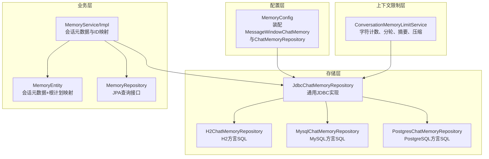
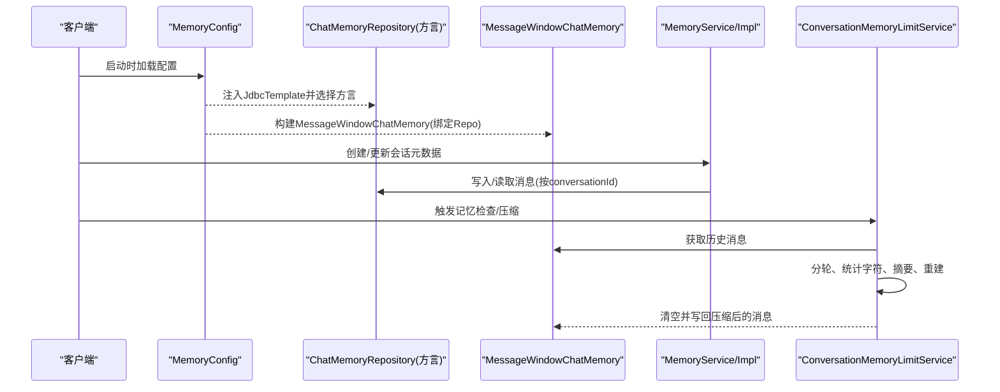
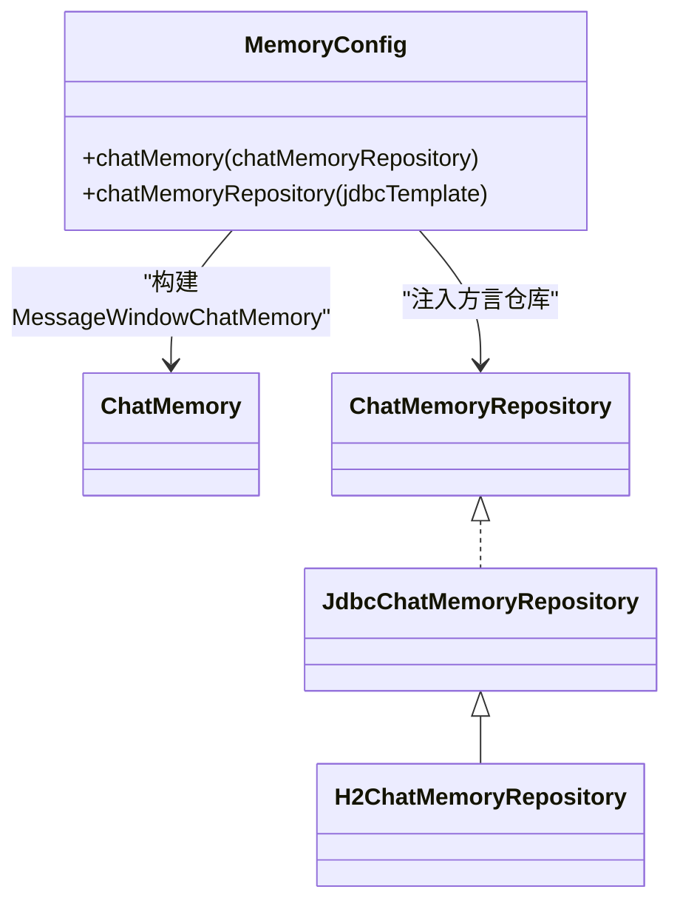
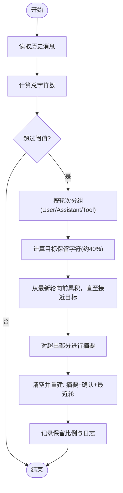
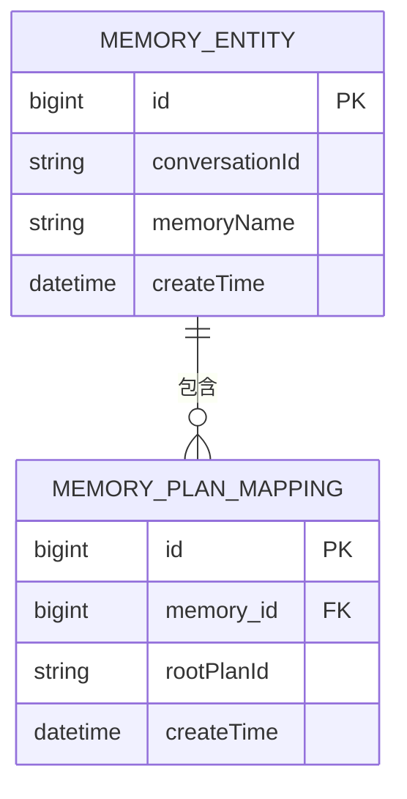
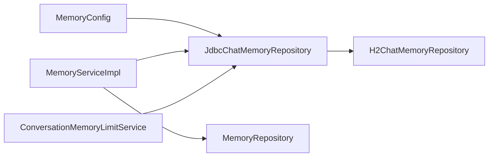

# 对话记忆管理

<cite>
**本文引用的文件**
- [MemoryConfig.java](file://src/main/java/com/alibaba/cloud/ai/lynxe/config/MemoryConfig.java)
- [ConversationMemoryLimitService.java](file://src/main/java/com/alibaba/cloud/ai/lynxe/llm/ConversationMemoryLimitService.java)
- [MemoryService.java](file://src/main/java/com/alibaba/cloud/ai/lynxe/workspace/conversation/service/MemoryService.java)
- [MemoryServiceImpl.java](file://src/main/java/com/alibaba/cloud/ai/lynxe/workspace/conversation/service/MemoryServiceImpl.java)
- [MemoryRepository.java](file://src/main/java/com/alibaba/cloud/ai/lynxe/workspace/conversation/repository/MemoryRepository.java)
- [JdbcChatMemoryRepository.java](file://src/main/java/com/alibaba/cloud/ai/lynxe/workspace/conversation/repository/JdbcChatMemoryRepository.java)
- [H2ChatMemoryRepository.java](file://src/main/java/com/alibaba/cloud/ai/lynxe/workspace/conversation/repository/H2ChatMemoryRepository.java)
- [MemoryEntity.java](file://src/main/java/com/alibaba/cloud/ai/lynxe/workspace/conversation/entity/po/MemoryEntity.java)
- [application.yml](file://src/main/resources/application.yml)
</cite>

## 目录
1. [引言](#引言)
2. [项目结构](#项目结构)
3. [核心组件](#核心组件)
4. [架构总览](#架构总览)
5. [组件详解](#组件详解)
6. [依赖关系分析](#依赖关系分析)
7. [性能考量](#性能考量)
8. [故障排查指南](#故障排查指南)
9. [结论](#结论)
10. [附录](#附录)

## 引言
本文件面向Lynxe对话记忆管理系统，系统性阐述对话记忆的设计理念与实现机制，重点覆盖以下方面：
- MessageWindowChatMemory的配置与使用方式
- 记忆限制服务的工作原理：消息数量控制、字符长度限制与自动压缩
- 记忆存储的持久化策略：数据库存储、内存窗口与可扩展的分布式存储
- 记忆上下文的维护与优化：历史消息截断、敏感信息过滤与隐私保护
- 记忆服务的扩展性设计：自定义记忆策略与第三方存储集成
- 具体配置示例与最佳实践

## 项目结构
围绕对话记忆的关键模块分布如下：
- 配置层：通过MemoryConfig装配MessageWindowChatMemory与ChatMemoryRepository
- 存储层：JdbcChatMemoryRepository及其方言实现（H2/MySQL/PostgreSQL），负责消息表的增删查与DDL
- 业务层：MemoryService/Impl封装会话元数据与聊天ID/根计划ID的关联
- 上下文限制层：ConversationMemoryLimitService对历史消息进行统计、分轮、摘要与压缩
- 数据模型：MemoryEntity承载会话元数据与根计划映射

**图表来源**
- [MemoryConfig.java:35-72](file://src/main/java/com/alibaba/cloud/ai/lynxe/config/MemoryConfig.java#L35-L72)
- [JdbcChatMemoryRepository.java:41-171](file://src/main/java/com/alibaba/cloud/ai/lynxe/workspace/conversation/repository/JdbcChatMemoryRepository.java#L41-L171)
- [H2ChatMemoryRepository.java:23-79](file://src/main/java/com/alibaba/cloud/ai/lynxe/workspace/conversation/repository/H2ChatMemoryRepository.java#L23-L79)
- [MemoryService.java:27-62](file://src/main/java/com/alibaba/cloud/ai/lynxe/workspace/conversation/service/MemoryService.java#L27-L62)
- [MemoryServiceImpl.java:39-281](file://src/main/java/com/alibaba/cloud/ai/lynxe/workspace/conversation/service/MemoryServiceImpl.java#L39-L281)
- [MemoryRepository.java:32-49](file://src/main/java/com/alibaba/cloud/ai/lynxe/workspace/conversation/repository/MemoryRepository.java#L32-L49)
- [MemoryEntity.java:40-186](file://src/main/java/com/alibaba/cloud/ai/lynxe/workspace/conversation/entity/po/MemoryEntity.java#L40-L186)
- [ConversationMemoryLimitService.java:42-800](file://src/main/java/com/alibaba/cloud/ai/lynxe/llm/ConversationMemoryLimitService.java#L42-L800)

**章节来源**
- [MemoryConfig.java:35-72](file://src/main/java/com/alibaba/cloud/ai/lynxe/config/MemoryConfig.java#L35-L72)
- [JdbcChatMemoryRepository.java:41-171](file://src/main/java/com/alibaba/cloud/ai/lynxe/workspace/conversation/repository/JdbcChatMemoryRepository.java#L41-L171)
- [MemoryService.java:27-62](file://src/main/java/com/alibaba/cloud/ai/lynxe/workspace/conversation/service/MemoryService.java#L27-L62)
- [MemoryServiceImpl.java:39-281](file://src/main/java/com/alibaba/cloud/ai/lynxe/workspace/conversation/service/MemoryServiceImpl.java#L39-L281)
- [MemoryRepository.java:32-49](file://src/main/java/com/alibaba/cloud/ai/lynxe/workspace/conversation/repository/MemoryRepository.java#L32-L49)
- [MemoryEntity.java:40-186](file://src/main/java/com/alibaba/cloud/ai/lynxe/workspace/conversation/entity/po/MemoryEntity.java#L40-L186)
- [ConversationMemoryLimitService.java:42-800](file://src/main/java/com/alibaba/cloud/ai/lynxe/llm/ConversationMemoryLimitService.java#L42-L800)

## 核心组件
- MessageWindowChatMemory与ChatMemoryRepository装配：通过MemoryConfig在运行时根据配置选择MySQL/PostgreSQL/H2方言的ChatMemoryRepository，并以MessageWindowChatMemory作为上层记忆容器
- JDBC存储实现：JdbcChatMemoryRepository统一处理DDL（建表）、增删查与消息类型映射；H2/MySQL/PostgreSQL通过方言类覆盖SQL片段
- 会话元数据与ID映射：MemoryService/Impl负责生成会话ID、维护会话名称、添加根计划ID或聊天ID到会话映射
- 记忆限制与压缩：ConversationMemoryLimitService基于字符计数与对话轮次，执行摘要与压缩，确保上下文长度可控

**章节来源**
- [MemoryConfig.java:35-72](file://src/main/java/com/alibaba/cloud/ai/lynxe/config/MemoryConfig.java#L35-L72)
- [JdbcChatMemoryRepository.java:41-171](file://src/main/java/com/alibaba/cloud/ai/lynxe/workspace/conversation/repository/JdbcChatMemoryRepository.java#L41-L171)
- [MemoryServiceImpl.java:151-248](file://src/main/java/com/alibaba/cloud/ai/lynxe/workspace/conversation/service/MemoryServiceImpl.java#L151-L248)
- [ConversationMemoryLimitService.java:73-103](file://src/main/java/com/alibaba/cloud/ai/lynxe/llm/ConversationMemoryLimitService.java#L73-L103)

## 架构总览
下图展示从配置到存储、业务与上下文限制的整体交互：

**图表来源**
- [MemoryConfig.java:49-70](file://src/main/java/com/alibaba/cloud/ai/lynxe/config/MemoryConfig.java#L49-L70)
- [JdbcChatMemoryRepository.java:86-104](file://src/main/java/com/alibaba/cloud/ai/lynxe/workspace/conversation/repository/JdbcChatMemoryRepository.java#L86-L104)
- [MemoryServiceImpl.java:118-149](file://src/main/java/com/alibaba/cloud/ai/lynxe/workspace/conversation/service/MemoryServiceImpl.java#L118-L149)
- [ConversationMemoryLimitService.java:73-103](file://src/main/java/com/alibaba/cloud/ai/lynxe/llm/ConversationMemoryLimitService.java#L73-L103)

## 组件详解

### MessageWindowChatMemory配置与使用
- 配置入口：MemoryConfig在运行时依据spring.ai.memory.*.enabled属性选择具体方言仓库，并以MessageWindowChatMemory包裹该仓库
- 使用方式：上层调用通过ChatMemory接口操作，内部委托至对应方言的ChatMemoryRepository完成持久化

**图表来源**
- [MemoryConfig.java:49-70](file://src/main/java/com/alibaba/cloud/ai/lynxe/config/MemoryConfig.java#L49-L70)
- [JdbcChatMemoryRepository.java:41](file://src/main/java/com/alibaba/cloud/ai/lynxe/workspace/conversation/repository/JdbcChatMemoryRepository.java#L41)
- [H2ChatMemoryRepository.java:23](file://src/main/java/com/alibaba/cloud/ai/lynxe/workspace/conversation/repository/H2ChatMemoryRepository.java#L23)

**章节来源**
- [MemoryConfig.java:35-72](file://src/main/java/com/alibaba/cloud/ai/lynxe/config/MemoryConfig.java#L35-L72)

### 记忆限制服务：字符计数、分轮与压缩
- 字符计数：优先序列化整段消息列表为JSON计算字符数，回退到文本长度之和
- 分轮策略：将消息按User/Assistant/ToolResponse组合为“对话轮”，保留最新轮次并按目标保留比例（约40%）决定摘要范围
- 摘要生成：构造state_snapshot风格提示词，调用默认动态代理ChatClient生成摘要，长度控制在3000-4000字符区间
- 压缩流程：清空旧内容，写入摘要与确认消息，再追加最近轮次；记录实际保留比例用于监控

**图表来源**
- [ConversationMemoryLimitService.java:73-103](file://src/main/java/com/alibaba/cloud/ai/lynxe/llm/ConversationMemoryLimitService.java#L73-L103)
- [ConversationMemoryLimitService.java:208-315](file://src/main/java/com/alibaba/cloud/ai/lynxe/llm/ConversationMemoryLimitService.java#L208-L315)
- [ConversationMemoryLimitService.java:416-520](file://src/main/java/com/alibaba/cloud/ai/lynxe/llm/ConversationMemoryLimitService.java#L416-L520)

**章节来源**
- [ConversationMemoryLimitService.java:42-800](file://src/main/java/com/alibaba/cloud/ai/lynxe/llm/ConversationMemoryLimitService.java#L42-L800)

### 记忆存储持久化策略
- 数据库存储：JdbcChatMemoryRepository统一建表与CRUD；方言类覆盖SQL片段，支持H2/MySQL/PostgreSQL
- 表结构要点：conversation_id分区、消息类型枚举校验、时间戳排序
- 会话元数据：MemoryEntity保存会话ID、名称与创建时间；通过MemoryRepository提供TopN查询与按会话ID删除

**图表来源**
- [MemoryEntity.java:40-186](file://src/main/java/com/alibaba/cloud/ai/lynxe/workspace/conversation/entity/po/MemoryEntity.java#L40-L186)
- [MemoryRepository.java:32-49](file://src/main/java/com/alibaba/cloud/ai/lynxe/workspace/conversation/repository/MemoryRepository.java#L32-L49)

**章节来源**
- [JdbcChatMemoryRepository.java:41-171](file://src/main/java/com/alibaba/cloud/ai/lynxe/workspace/conversation/repository/JdbcChatMemoryRepository.java#L41-L171)
- [H2ChatMemoryRepository.java:23-79](file://src/main/java/com/alibaba/cloud/ai/lynxe/workspace/conversation/repository/H2ChatMemoryRepository.java#L23-L79)
- [MemoryEntity.java:40-186](file://src/main/java/com/alibaba/cloud/ai/lynxe/workspace/conversation/entity/po/MemoryEntity.java#L40-L186)
- [MemoryRepository.java:32-49](file://src/main/java/com/alibaba/cloud/ai/lynxe/workspace/conversation/repository/MemoryRepository.java#L32-L49)

### 记忆上下文维护与优化
- 历史截断：通过对话轮次与字符目标保留比例，确保上下文长度稳定
- 敏感信息过滤：工具响应内容在提取时进行长度限制，避免过长内容进入摘要
- 隐私保护：摘要采用结构化XML模板，聚焦关键知识与行动，不直接暴露原始敏感内容

**章节来源**
- [ConversationMemoryLimitService.java:136-198](file://src/main/java/com/alibaba/cloud/ai/lynxe/llm/ConversationMemoryLimitService.java#L136-L198)
- [ConversationMemoryLimitService.java:416-520](file://src/main/java/com/alibaba/cloud/ai/lynxe/llm/ConversationMemoryLimitService.java#L416-L520)

### 扩展性设计：自定义策略与第三方存储
- 自定义记忆策略：可在ConversationMemoryLimitService中调整保留比例、摘要长度区间与分轮规则
- 第三方存储集成：通过实现ChatMemoryRepository接口，提供新的方言SQL与表结构，替换MemoryConfig中的仓库选择逻辑

**章节来源**
- [JdbcChatMemoryRepository.java:166-168](file://src/main/java/com/alibaba/cloud/ai/lynxe/workspace/conversation/repository/JdbcChatMemoryRepository.java#L166-L168)
- [MemoryConfig.java:54-70](file://src/main/java/com/alibaba/cloud/ai/lynxe/config/MemoryConfig.java#L54-L70)

## 依赖关系分析
- 配置层依赖：MemoryConfig依赖JdbcTemplate与方言仓库实现
- 存储层依赖：JdbcChatMemoryRepository依赖JdbcTemplate与RowMapper；H2/MySQL/PostgreSQL通过方言类覆盖SQL
- 业务层依赖：MemoryServiceImpl依赖MemoryRepository与ChatMemory；MemoryRepository依赖JPA
- 上下文限制层依赖：ConversationMemoryLimitService依赖ChatMemory与LlmService

**图表来源**
- [MemoryConfig.java:49-70](file://src/main/java/com/alibaba/cloud/ai/lynxe/config/MemoryConfig.java#L49-L70)
- [JdbcChatMemoryRepository.java:41-171](file://src/main/java/com/alibaba/cloud/ai/lynxe/workspace/conversation/repository/JdbcChatMemoryRepository.java#L41-L171)
- [MemoryServiceImpl.java:46-49](file://src/main/java/com/alibaba/cloud/ai/lynxe/workspace/conversation/service/MemoryServiceImpl.java#L46-L49)
- [ConversationMemoryLimitService.java:57-64](file://src/main/java/com/alibaba/cloud/ai/lynxe/llm/ConversationMemoryLimitService.java#L57-L64)

**章节来源**
- [MemoryConfig.java:35-72](file://src/main/java/com/alibaba/cloud/ai/lynxe/config/MemoryConfig.java#L35-L72)
- [MemoryServiceImpl.java:46-49](file://src/main/java/com/alibaba/cloud/ai/lynxe/workspace/conversation/service/MemoryServiceImpl.java#L46-L49)
- [ConversationMemoryLimitService.java:57-64](file://src/main/java/com/alibaba/cloud/ai/lynxe/llm/ConversationMemoryLimitService.java#L57-L64)

## 性能考量
- 字符计数开销：JSON序列化与流式遍历均可能带来额外CPU消耗，建议在高频场景下结合批量触发与缓存策略
- 分轮与摘要：摘要生成依赖LLM调用，应设置合理的超时与重试策略，避免阻塞主线程
- 存储层优化：JdbcChatMemoryRepository使用批处理插入与时间戳递增序号，减少写放大；方言SQL需确保索引与约束合理
- 会话元数据查询：MemoryRepository提供TopN查询与按时间倒序，注意数据库索引与LIMIT性能

[本节为通用性能建议，无需特定文件引用]

## 故障排查指南
- 记忆未生效：检查MemoryConfig是否正确注入ChatMemoryRepository与MessageWindowChatMemory
- 方言未启用：确认spring.ai.memory.*.enabled配置项，确保至少启用一种数据库方言
- 摘要失败：查看ConversationMemoryLimitService日志，关注摘要长度与格式异常
- 存储异常：核对JdbcChatMemoryRepository建表SQL与方言SQL一致性，检查DDL执行权限
- 会话元数据缺失：确认MemoryRepository查询条件与表名一致，检查dynamic_memories表是否存在

**章节来源**
- [MemoryConfig.java:66-70](file://src/main/java/com/alibaba/cloud/ai/lynxe/config/MemoryConfig.java#L66-L70)
- [ConversationMemoryLimitService.java:100-102](file://src/main/java/com/alibaba/cloud/ai/lynxe/llm/ConversationMemoryLimitService.java#L100-L102)
- [JdbcChatMemoryRepository.java:67-71](file://src/main/java/com/alibaba/cloud/ai/lynxe/workspace/conversation/repository/JdbcChatMemoryRepository.java#L67-L71)
- [MemoryRepository.java:45-47](file://src/main/java/com/alibaba/cloud/ai/lynxe/workspace/conversation/repository/MemoryRepository.java#L45-L47)

## 结论
Lynxe对话记忆系统通过MessageWindowChatMemory与JDBC方言仓库实现了灵活的上下文管理与持久化能力；ConversationMemoryLimitService提供了稳健的字符计数、分轮与摘要压缩机制，保障了长对话的稳定性与性能。结合会话元数据与根计划映射，系统在可扩展性与可维护性上具备良好基础。

[本节为总结性内容，无需特定文件引用]

## 附录

### 配置示例与最佳实践
- 启用数据库方言
  - 在应用配置中启用任一数据库方言开关，MemoryConfig将自动装配对应仓库
  - 示例键位参考：spring.ai.memory.mysql.enabled、spring.ai.memory.postgres.enabled、spring.ai.memory.h2.enabled
- 记忆限制参数
  - 可在ConversationMemoryLimitService中调整保留比例、摘要最小/最大长度等阈值
- 会话ID生成
  - 使用MemoryServiceImpl.generateConversationId生成带前缀的唯一ID，适合并发场景
- 最佳实践
  - 将摘要生成与字符计数逻辑纳入定时任务或请求后置钩子，避免阻塞主流程
  - 对工具响应内容进行长度限制，防止摘要过大
  - 为ai_chat_memory与dynamic_memories建立合适索引，提升查询性能

**章节来源**
- [application.yml:1-97](file://src/main/resources/application.yml#L1-L97)
- [MemoryConfig.java:40-47](file://src/main/java/com/alibaba/cloud/ai/lynxe/config/MemoryConfig.java#L40-L47)
- [MemoryServiceImpl.java:151-170](file://src/main/java/com/alibaba/cloud/ai/lynxe/workspace/conversation/service/MemoryServiceImpl.java#L151-L170)
- [ConversationMemoryLimitService.java:47-53](file://src/main/java/com/alibaba/cloud/ai/lynxe/llm/ConversationMemoryLimitService.java#L47-L53)