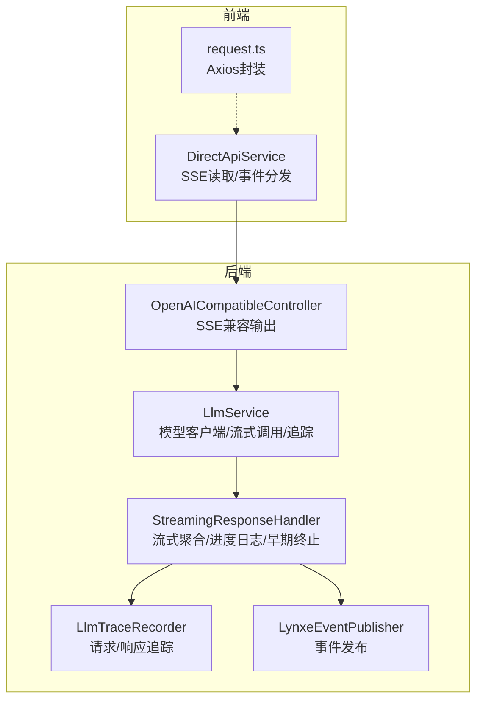
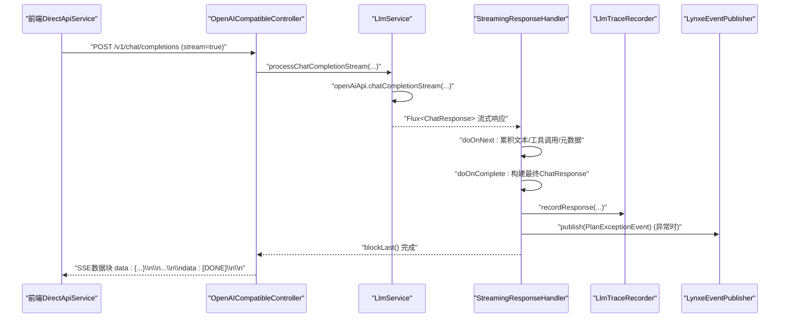
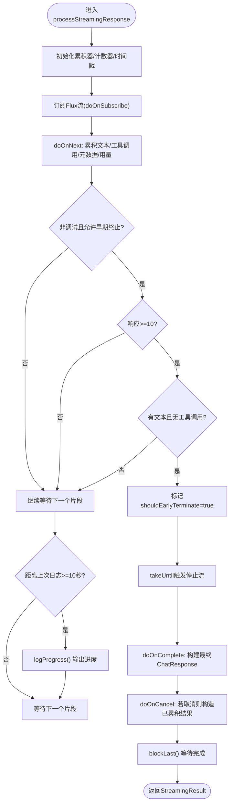
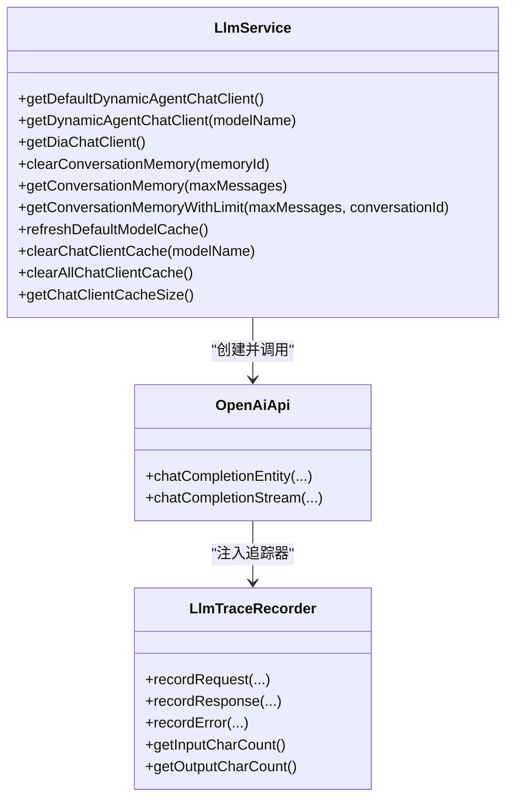
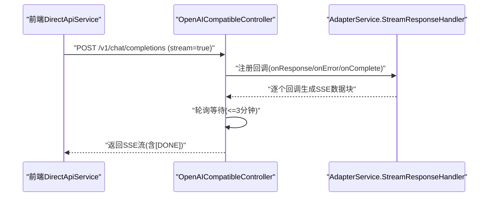
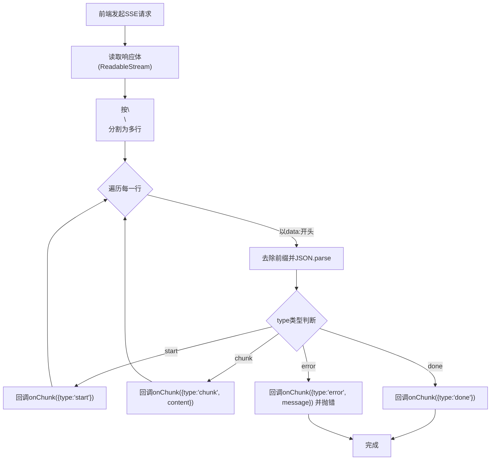
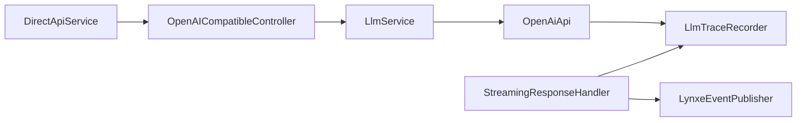

# 流式响应处理器

<cite>
**本文引用的文件**
- [StreamingResponseHandler.java](file://src/main/java/com/alibaba/cloud/ai/lynxe/llm/StreamingResponseHandler.java)
- [OpenAICompatibleController.java](file://src/main/java/com/alibaba/cloud/ai/lynxe/adapter/controller/OpenAICompatibleController.java)
- [LlmService.java](file://src/main/java/com/alibaba/cloud/ai/lynxe/llm/LlmService.java)
- [LynxeEventPublisher.java](file://src/main/java/com/alibaba/cloud/ai/lynxe/event/LynxeEventPublisher.java)
- [LlmTraceRecorder.java](file://src/main/java/com/alibaba/cloud/ai/lynxe/llm/LlmTraceRecorder.java)
- [direct-api-service.ts](file://ui-vue3/src/api/direct-api-service.ts)
- [request.ts](file://ui-vue3/src/utils/request.ts)
</cite>

## 目录
1. [简介](#简介)
2. [项目结构](#项目结构)
3. [核心组件](#核心组件)
4. [架构总览](#架构总览)
5. [详细组件分析](#详细组件分析)
6. [依赖分析](#依赖分析)
7. [性能考虑](#性能考虑)
8. [故障排查指南](#故障排查指南)
9. [结论](#结论)
10. [附录：使用示例与最佳实践](#附录使用示例与最佳实践)

## 简介
本文件围绕 Lynxe 的流式响应处理能力进行系统化技术文档整理，重点覆盖以下方面：
- StreamingResponseHandler 的设计目标与实现机制：包括流式数据的接收、聚合、进度日志、早期终止策略、错误与取消处理等。
- WebSocket/SSE 连接与消息格式：结合后端 OpenAI 兼容控制器与前端直接对话 API 的交互方式，说明流式数据的传输与事件分发。
- 实时通信性能优化：背压处理、缓冲区管理、内存控制与超时策略。
- 错误处理、重连与超时控制：统一的追踪记录、事件发布与错误上报。
- 使用示例：前后端如何通过 SSE 实现实时数据传输，并处理异常场景。

## 项目结构
与流式响应处理直接相关的模块分布如下：
- 后端核心处理：StreamingResponseHandler（流式聚合与进度日志）、LlmService（模型客户端与流式调用）、LlmTraceRecorder（请求/响应追踪）。
- 接口适配：OpenAICompatibleController（OpenAI 兼容的流式输出，SSE 格式）。
- 前端交互：DirectApiService（SSE 读取与事件分发）、通用请求封装（Axios 封装）。

**图表来源**
- [StreamingResponseHandler.java:167-452](file://src/main/java/com/alibaba/cloud/ai/lynxe/llm/StreamingResponseHandler.java#L167-L452)
- [LlmService.java:441-479](file://src/main/java/com/alibaba/cloud/ai/lynxe/llm/LlmService.java#L441-L479)
- [OpenAICompatibleController.java:121-185](file://src/main/java/com/alibaba/cloud/ai/lynxe/adapter/controller/OpenAICompatibleController.java#L121-L185)
- [LynxeEventPublisher.java:35-51](file://src/main/java/com/alibaba/cloud/ai/lynxe/event/LynxeEventPublisher.java#L35-L51)
- [LlmTraceRecorder.java:56-121](file://src/main/java/com/alibaba/cloud/ai/lynxe/llm/LlmTraceRecorder.java#L56-L121)
- [direct-api-service.ts:44-220](file://ui-vue3/src/api/direct-api-service.ts#L44-L220)
- [request.ts:26-64](file://ui-vue3/src/utils/request.ts#L26-L64)

**章节来源**
- [StreamingResponseHandler.java:167-452](file://src/main/java/com/alibaba/cloud/ai/lynxe/llm/StreamingResponseHandler.java#L167-L452)
- [OpenAICompatibleController.java:85-185](file://src/main/java/com/alibaba/cloud/ai/lynxe/adapter/controller/OpenAICompatibleController.java#L85-L185)
- [LlmService.java:441-479](file://src/main/java/com/alibaba/cloud/ai/lynxe/llm/LlmService.java#L441-L479)
- [direct-api-service.ts:44-220](file://ui-vue3/src/api/direct-api-service.ts#L44-L220)

## 核心组件
- StreamingResponseHandler：负责将来自模型的流式 ChatResponse 聚合为最终 ChatResponse，同时输出进度日志、统计字符数、令牌用量、支持早期终止（非调试模式下检测到纯思考文本时）。
- LlmService：构建 ChatClient 并通过 OpenAI 兼容 API 发起流式请求，注入追踪器记录请求/响应；提供缓存与模型切换能力。
- LlmTraceRecorder：单次请求作用域内的追踪器，记录请求体、响应体、错误详情及输入/输出字符计数。
- OpenAICompatibleController：将内部响应转换为 OpenAI 兼容的 SSE 数据块，支持超时轮询与错误块输出。
- LynxeEventPublisher：统一事件发布，便于上层监听器处理异常或状态变更。
- DirectApiService（前端）：以 SSE 方式消费后端流式响应，按 start/chunk/done/error 事件分发给调用方。

**章节来源**
- [StreamingResponseHandler.java:68-151](file://src/main/java/com/alibaba/cloud/ai/lynxe/llm/StreamingResponseHandler.java#L68-L151)
- [LlmService.java:112-120](file://src/main/java/com/alibaba/cloud/ai/lynxe/llm/LlmService.java#L112-L120)
- [LlmTraceRecorder.java:31-54](file://src/main/java/com/alibaba/cloud/ai/lynxe/llm/LlmTraceRecorder.java#L31-L54)
- [OpenAICompatibleController.java:121-185](file://src/main/java/com/alibaba/cloud/ai/lynxe/adapter/controller/OpenAICompatibleController.java#L121-L185)
- [LynxeEventPublisher.java:28-65](file://src/main/java/com/alibaba/cloud/ai/lynxe/event/LynxeEventPublisher.java#L28-L65)
- [direct-api-service.ts:44-220](file://ui-vue3/src/api/direct-api-service.ts#L44-L220)

## 架构总览
下面的序列图展示了从前端发起 SSE 请求到后端流式响应聚合与事件发布的完整流程。

**图表来源**
- [OpenAICompatibleController.java:121-185](file://src/main/java/com/alibaba/cloud/ai/lynxe/adapter/controller/OpenAICompatibleController.java#L121-L185)
- [LlmService.java:471-477](file://src/main/java/com/alibaba/cloud/ai/lynxe/llm/LlmService.java#L471-L477)
- [StreamingResponseHandler.java:167-452](file://src/main/java/com/alibaba/cloud/ai/lynxe/llm/StreamingResponseHandler.java#L167-L452)
- [LlmTraceRecorder.java:89-100](file://src/main/java/com/alibaba/cloud/ai/lynxe/llm/LlmTraceRecorder.java#L89-L100)
- [LynxeEventPublisher.java:35-51](file://src/main/java/com/alibaba/cloud/ai/lynxe/event/LynxeEventPublisher.java#L35-L51)

## 详细组件分析

### 组件一：StreamingResponseHandler（流式聚合与进度日志）
- 设计目的
  - 将模型返回的多个 ChatResponse 片段合并为最终 ChatResponse。
  - 提供周期性进度日志，避免用户误以为服务无响应。
  - 支持“早期终止”：在非调试模式且启用该策略时，若检测到仅有思考文本而无工具调用，将在一定响应次数后提前结束流。
- 关键机制
  - 使用 Reactor Flux 的 doOnNext/doOnComplete/doOnError/doOnCancel 钩子累积文本、工具调用、元数据与用量信息。
  - 每 10 秒输出一次进度日志，包含响应次数、字符数、字符速率、工具调用数量与最后内容预览。
  - 在取消或完成时构造 ChatResponse 与 ChatResponseMetadata，确保即使提前终止也能返回可用结果。
  - 通过 LlmTraceRecorder 记录输入/输出字符计数与最终响应。
  - 异常时通过 LynxeEventPublisher 发布 PlanExceptionEvent 事件。
- 早期终止策略
  - 仅在非调试模式且允许早期终止时生效。
  - 至少收到 10 个片段后才开始判断；若累计文本非空而工具调用为空，则标记提前终止并停止流。
- 错误与取消处理
  - doOnError：记录错误详情，区分 WebClient 响应异常与其他异常，增强日志可诊断性。
  - doOnCancel：若因早期终止被取消，仍会构造最终 ChatResponse，保证调用方能拿到已累积的内容。

**图表来源**
- [StreamingResponseHandler.java:167-452](file://src/main/java/com/alibaba/cloud/ai/lynxe/llm/StreamingResponseHandler.java#L167-L452)

**章节来源**
- [StreamingResponseHandler.java:167-452](file://src/main/java/com/alibaba/cloud/ai/lynxe/llm/StreamingResponseHandler.java#L167-L452)
- [StreamingResponseHandler.java:472-526](file://src/main/java/com/alibaba/cloud/ai/lynxe/llm/StreamingResponseHandler.java#L472-L526)

### 组件二：LlmService（模型客户端与流式调用）
- 统一 ChatClient 构建：基于 OpenAiChatModel 与 OpenAiApi，支持动态模型切换、HTTP 头注入、观察与重试配置。
- 流式调用增强：在 openAiApi 的 chatCompletionStream 中注入 LlmTraceRecorder，记录请求与响应，便于问题定位。
- 缓存与懒加载：按模型名缓存 ChatClient，避免重复创建；默认模型缺失时进行懒初始化。
- 超时与缓冲：通过增强的 WebClient Builder 设置超时与最大内存大小，保障流式请求稳定性。

**图表来源**
- [LlmService.java:112-120](file://src/main/java/com/alibaba/cloud/ai/lynxe/llm/LlmService.java#L112-L120)
- [LlmService.java:441-479](file://src/main/java/com/alibaba/cloud/ai/lynxe/llm/LlmService.java#L441-L479)
- [LlmTraceRecorder.java:56-121](file://src/main/java/com/alibaba/cloud/ai/lynxe/llm/LlmTraceRecorder.java#L56-L121)

**章节来源**
- [LlmService.java:112-120](file://src/main/java/com/alibaba/cloud/ai/lynxe/llm/LlmService.java#L112-L120)
- [LlmService.java:441-479](file://src/main/java/com/alibaba/cloud/ai/lynxe/llm/LlmService.java#L441-L479)

### 组件三：OpenAICompatibleController（SSE 兼容输出）
- 功能概述
  - 对外暴露 /v1/chat/completions（支持 stream 参数），将内部响应转换为 OpenAI 兼容的 SSE 数据块。
  - 使用 StringBuilder 累积数据块，完成后追加 [DONE] 结束标记。
  - 轮询等待（最长 3 分钟，每 100ms 轮询）以确保完整收集所有数据块。
  - 错误时输出 OpenAI 兼容的错误块并返回 500。
- SSE 格式
  - 每个数据块前缀为 "data: "，末尾跟随两个换行符；结束块为 "data: [DONE]"。
  - Content-Type 为 text/plain; charset=utf-8，保持与 SSE 兼容。

**图表来源**
- [OpenAICompatibleController.java:121-185](file://src/main/java/com/alibaba/cloud/ai/lynxe/adapter/controller/OpenAICompatibleController.java#L121-L185)

**章节来源**
- [OpenAICompatibleController.java:85-185](file://src/main/java/com/alibaba/cloud/ai/lynxe/adapter/controller/OpenAICompatibleController.java#L85-L185)

### 组件四：前端 DirectApiService（SSE 读取与事件分发）
- SSE 读取
  - 使用 fetch 并设置 Accept: text/event-stream，通过 ReadableStream 读取响应体。
  - 解析以 \n\n 分割的数据块，提取 "data:" 后的内容并 JSON 解析。
- 事件分发
  - start：携带 conversationId，用于标识会话。
  - chunk：携带增量内容，逐步拼接为完整消息。
  - done：表示流结束。
  - error：表示发生错误，抛出异常并释放读取锁。
- 超时与错误
  - 若响应非 ok，读取文本并抛出错误。
  - 解析失败时记录错误但不中断后续数据块处理。

**图表来源**
- [direct-api-service.ts:117-220](file://ui-vue3/src/api/direct-api-service.ts#L117-L220)

**章节来源**
- [direct-api-service.ts:44-220](file://ui-vue3/src/api/direct-api-service.ts#L44-L220)

### 组件五：LynxeEventPublisher 与 LlmTraceRecorder
- LynxeEventPublisher
  - 提供事件发布接口，按事件类型分发给已注册监听器；异常时记录日志而不中断。
- LlmTraceRecorder
  - 单请求作用域内记录请求/响应与错误详情，计算输入/输出字符计数，便于审计与性能分析。

**章节来源**
- [LynxeEventPublisher.java:28-65](file://src/main/java/com/alibaba/cloud/ai/lynxe/event/LynxeEventPublisher.java#L28-L65)
- [LlmTraceRecorder.java:31-156](file://src/main/java/com/alibaba/cloud/ai/lynxe/llm/LlmTraceRecorder.java#L31-L156)

## 依赖分析
- 组件耦合
  - StreamingResponseHandler 依赖 LlmTraceRecorder（追踪）、LynxeEventPublisher（异常事件发布）。
  - LlmService 依赖 OpenAiApi（流式调用）、LlmTraceRecorder（请求/响应记录）。
  - OpenAICompatibleController 依赖 OpenAIAdapterService（内部处理），并通过 SSE 输出。
  - 前端 DirectApiService 依赖后端 SSE 接口，通过事件分发与调用方协作。
- 外部依赖
  - Spring AI ChatClient/WebClient、Reactor Flux、Jackson ObjectMapper、SLF4J 日志框架。

**图表来源**
- [StreamingResponseHandler.java:62-66](file://src/main/java/com/alibaba/cloud/ai/lynxe/llm/StreamingResponseHandler.java#L62-L66)
- [LlmService.java:441-479](file://src/main/java/com/alibaba/cloud/ai/lynxe/llm/LlmService.java#L441-L479)
- [OpenAICompatibleController.java:73-80](file://src/main/java/com/alibaba/cloud/ai/lynxe/adapter/controller/OpenAICompatibleController.java#L73-L80)
- [direct-api-service.ts:44-220](file://ui-vue3/src/api/direct-api-service.ts#L44-L220)

**章节来源**
- [StreamingResponseHandler.java:62-66](file://src/main/java/com/alibaba/cloud/ai/lynxe/llm/StreamingResponseHandler.java#L62-L66)
- [LlmService.java:441-479](file://src/main/java/com/alibaba/cloud/ai/lynxe/llm/LlmService.java#L441-L479)
- [OpenAICompatibleController.java:73-80](file://src/main/java/com/alibaba/cloud/ai/lynxe/adapter/controller/OpenAICompatibleController.java#L73-L80)
- [direct-api-service.ts:44-220](file://ui-vue3/src/api/direct-api-service.ts#L44-L220)

## 性能考虑
- 背压与缓冲
  - 后端通过 Reactor Flux 的背压策略与线程模型处理高并发流式响应；前端使用 ReadableStream 逐步解码，避免一次性加载全部数据。
- 内存控制
  - LlmService 中对 WebClient 设置最大内存大小（10MB），防止大响应导致内存溢出。
  - StreamingResponseHandler 使用 StringBuilder 累积文本，完成后清空引用，降低峰值内存占用。
- 超时与轮询
  - OpenAICompatibleController 对 SSE 轮询设置最大等待时间（3 分钟），避免长时间阻塞。
  - LlmService 对底层 HTTP 调用设置超时（10 分钟），保障长流式请求的稳定性。
- 进度日志与可观测性
  - 每 10 秒输出一次进度日志，包含字符速率、工具调用数量与最后内容预览，便于监控与排障。

**章节来源**
- [LlmService.java:382-387](file://src/main/java/com/alibaba/cloud/ai/lynxe/llm/LlmService.java#L382-L387)
- [OpenAICompatibleController.java:57-59](file://src/main/java/com/alibaba/cloud/ai/lynxe/adapter/controller/OpenAICompatibleController.java#L57-L59)
- [StreamingResponseHandler.java:302-309](file://src/main/java/com/alibaba/cloud/ai/lynxe/llm/StreamingResponseHandler.java#L302-L309)

## 故障排查指南
- 常见错误类型
  - WebClient 响应异常：包含状态码、响应体与请求 URI，便于快速定位上游问题。
  - JSON 序列化失败：在 SSE 转换或追踪记录中出现，检查对象结构与编码。
  - SSE 解析错误：前端解析 "data:" 行失败，检查后端输出格式是否正确。
- 日志与追踪
  - LLM_REQUEST_LOGGER：记录请求/响应 JSON 与输入/输出字符计数。
  - STREAMING_PROGRESS_LOGGER：记录流式进度（字符数、速率、工具调用数）。
  - 异常事件：通过 LynxeEventPublisher 发布 PlanExceptionEvent，便于上层监听器处理。
- 重试与恢复
  - 建议在前端对网络错误进行指数退避重试，避免频繁抖动。
  - 后端对上游 API 调用启用合理的重试与熔断策略（由 LlmService 注入的观察与重试配置负责）。

**章节来源**
- [StreamingResponseHandler.java:348-428](file://src/main/java/com/alibaba/cloud/ai/lynxe/llm/StreamingResponseHandler.java#L348-L428)
- [LlmTraceRecorder.java:106-121](file://src/main/java/com/alibaba/cloud/ai/lynxe/llm/LlmTraceRecorder.java#L106-L121)
- [LynxeEventPublisher.java:35-51](file://src/main/java/com/alibaba/cloud/ai/lynxe/event/LynxeEventPublisher.java#L35-L51)

## 结论
StreamingResponseHandler 通过 Reactor 流式处理、周期性进度日志与早期终止策略，有效提升了实时对话的用户体验与系统可观测性；配合 LlmService 的追踪记录与 OpenAICompatibleController 的 SSE 输出，形成了从前端到后端的完整流式链路。在性能方面，通过缓冲区限制、超时控制与内存管理，兼顾了稳定性与资源利用率。建议在生产环境中结合事件发布与日志分析，持续优化流式响应的延迟与吞吐表现。

## 附录：使用示例与最佳实践
- 前端 SSE 使用（DirectApiService）
  - 发送聊天消息并开启 SSE：调用 sendChatMessage，传入 onChunk 回调以接收 start/chunk/done/error 事件。
  - 注意：当收到 error 事件时，前端应释放读取锁并提示用户重试。
- 后端流式处理（OpenAICompatibleController + LlmService + StreamingResponseHandler）
  - 控制器负责将内部响应转换为 SSE 数据块并追加 [DONE]。
  - LlmService 负责实际的流式调用与追踪记录。
  - StreamingResponseHandler 负责聚合与进度日志，必要时进行早期终止。
- 最佳实践
  - 前端：对 SSE 错误进行分类处理（网络错误、解析错误、业务错误），并在 UI 层给出明确反馈。
  - 后端：合理设置超时与缓冲上限，开启进度日志与追踪记录，异常时及时发布事件以便监控告警。
  - 跨团队协作：前端遵循 SSE 规范，后端保持稳定的流式输出与错误块格式，确保兼容性。

**章节来源**
- [direct-api-service.ts:44-220](file://ui-vue3/src/api/direct-api-service.ts#L44-L220)
- [OpenAICompatibleController.java:121-185](file://src/main/java/com/alibaba/cloud/ai/lynxe/adapter/controller/OpenAICompatibleController.java#L121-L185)
- [LlmService.java:441-479](file://src/main/java/com/alibaba/cloud/ai/lynxe/llm/LlmService.java#L441-L479)
- [StreamingResponseHandler.java:167-452](file://src/main/java/com/alibaba/cloud/ai/lynxe/llm/StreamingResponseHandler.java#L167-L452)