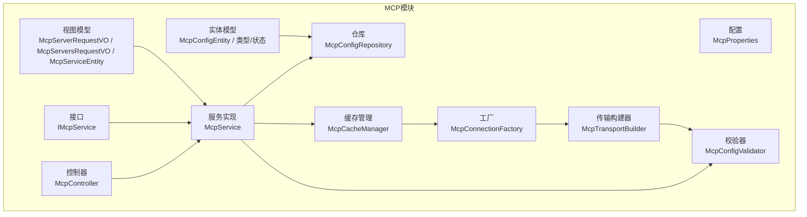
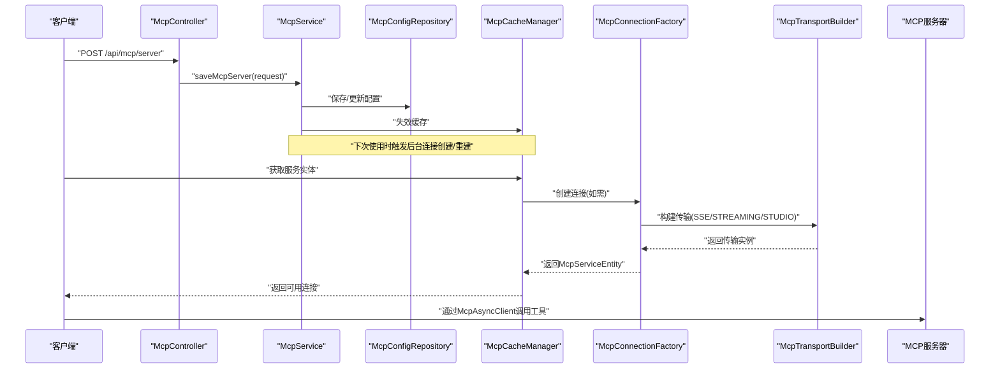
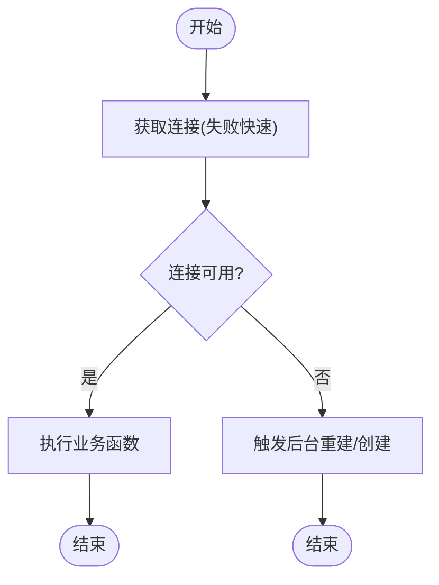
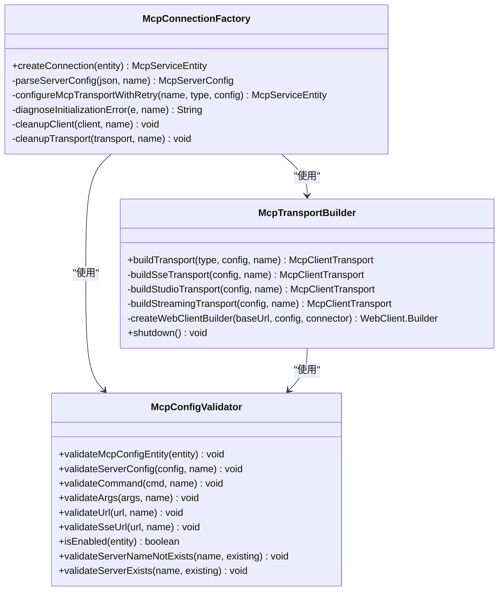
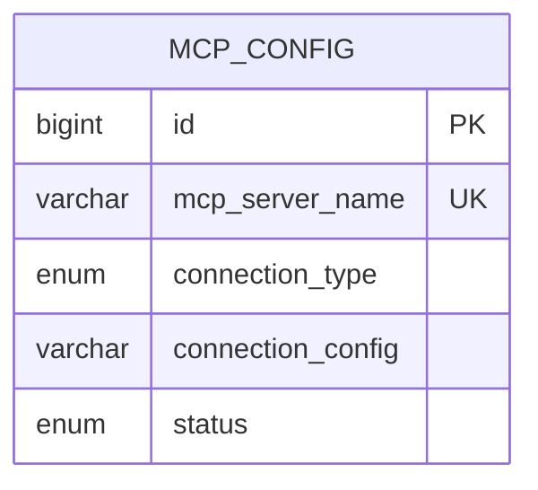
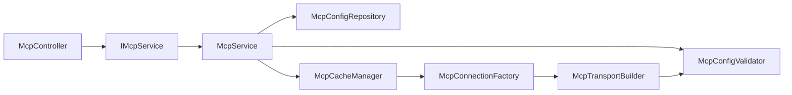

# MCP协议集成

<cite>
**本文档引用的文件**
- [McpProperties.java](file://src/main/java/com/alibaba/cloud/ai/lynxe/mcp/config/McpProperties.java)
- [McpController.java](file://src/main/java/com/alibaba/cloud/ai/lynxe/mcp/controller/McpController.java)
- [IMcpService.java](file://src/main/java/com/alibaba/cloud/ai/lynxe/mcp/service/IMcpService.java)
- [McpService.java](file://src/main/java/com/alibaba/cloud/ai/lynxe/mcp/service/McpService.java)
- [McpCacheManager.java](file://src/main/java/com/alibaba/cloud/ai/lynxe/mcp/service/McpCacheManager.java)
- [McpConfigValidator.java](file://src/main/java/com/alibaba/cloud/ai/lynxe/mcp/service/McpConfigValidator.java)
- [McpConnectionFactory.java](file://src/main/java/com/alibaba/cloud/ai/lynxe/mcp/service/McpConnectionFactory.java)
- [McpTransportBuilder.java](file://src/main/java/com/alibaba/cloud/ai/lynxe/mcp/service/McpTransportBuilder.java)
- [McpConfigRepository.java](file://src/main/java/com/alibaba/cloud/ai/lynxe/mcp/repository/McpConfigRepository.java)
- [McpConfigEntity.java](file://src/main/java/com/alibaba/cloud/ai/lynxe/mcp/model/po/McpConfigEntity.java)
- [McpConfigType.java](file://src/main/java/com/alibaba/cloud/ai/lynxe/mcp/model/po/McpConfigType.java)
- [McpConfigStatus.java](file://src/main/java/com/alibaba/cloud/ai/lynxe/mcp/model/po/McpConfigStatus.java)
- [McpServerRequestVO.java](file://src/main/java/com/alibaba/cloud/ai/lynxe/mcp/model/vo/McpServerRequestVO.java)
- [McpServersRequestVO.java](file://src/main/java/com/alibaba/cloud/ai/lynxe/mcp/model/vo/McpServersRequestVO.java)
- [McpServiceEntity.java](file://src/main/java/com/alibaba/cloud/ai/lynxe/mcp/model/vo/McpServiceEntity.java)
</cite>

## 目录
1. [简介](#简介)
2. [项目结构](#项目结构)
3. [核心组件](#核心组件)
4. [架构总览](#架构总览)
5. [详细组件分析](#详细组件分析)
6. [依赖关系分析](#依赖关系分析)
7. [性能考量](#性能考量)
8. [故障排除指南](#故障排除指南)
9. [结论](#结论)
10. [附录](#附录)

## 简介
本文件面向Lynxe平台的MCP（Model Context Protocol）集成，系统性阐述MCP协议在Lynxe中的客户端实现、连接管理、会话处理、服务器配置、工具注册与服务发现机制，并提供开发、部署与管理流程、最佳实践、性能优化与故障排除建议。同时说明MCP与代理系统、工具系统的集成关系以及安全与访问控制策略。

## 项目结构
Lynxe的MCP模块位于`src/main/java/com/alibaba/cloud/ai/lynxe/mcp/`目录下，采用按功能域分层组织：配置、控制器、模型、仓库、服务与传输构建器等。核心职责划分清晰，便于扩展与维护。

图表来源
- [McpController.java:38-196](file://src/main/java/com/alibaba/cloud/ai/lynxe/mcp/controller/McpController.java#L38-L196)
- [McpService.java:44-352](file://src/main/java/com/alibaba/cloud/ai/lynxe/mcp/service/McpService.java#L44-L352)
- [McpCacheManager.java:54-800](file://src/main/java/com/alibaba/cloud/ai/lynxe/mcp/service/McpCacheManager.java#L54-L800)
- [McpConnectionFactory.java:44-437](file://src/main/java/com/alibaba/cloud/ai/lynxe/mcp/service/McpConnectionFactory.java#L44-L437)
- [McpTransportBuilder.java:54-393](file://src/main/java/com/alibaba/cloud/ai/lynxe/mcp/service/McpTransportBuilder.java#L54-L393)
- [McpConfigRepository.java:29-42](file://src/main/java/com/alibaba/cloud/ai/lynxe/mcp/repository/McpConfigRepository.java#L29-L42)
- [McpConfigEntity.java:27-107](file://src/main/java/com/alibaba/cloud/ai/lynxe/mcp/model/po/McpConfigEntity.java#L27-L107)
- [McpServerRequestVO.java:28-355](file://src/main/java/com/alibaba/cloud/ai/lynxe/mcp/model/vo/McpServerRequestVO.java#L28-L355)
- [McpServersRequestVO.java:26-192](file://src/main/java/com/alibaba/cloud/ai/lynxe/mcp/model/vo/McpServersRequestVO.java#L26-L192)

章节来源
- [McpController.java:38-196](file://src/main/java/com/alibaba/cloud/ai/lynxe/mcp/controller/McpController.java#L38-L196)
- [McpService.java:44-352](file://src/main/java/com/alibaba/cloud/ai/lynxe/mcp/service/McpService.java#L44-L352)

## 核心组件
- 配置属性：集中管理MCP连接超时、重试、SSE参数、用户代理等。
- 控制器：提供MCP服务器的增删改查、启用/禁用、批量导入等REST接口。
- 服务层：协调仓库、校验器、缓存管理器，提供统一业务方法。
- 缓存管理：单连接、失败快速返回、后台重建、健康检查与自动重连。
- 工厂与传输：根据连接类型构建SSE/STREAMING/STUDIO传输，支持重试与诊断。
- 校验器：对命令、URL、环境变量、参数进行格式与可达性校验。
- 仓库与实体：持久化MCP服务器配置，支持按状态查询。

章节来源
- [McpProperties.java:26-191](file://src/main/java/com/alibaba/cloud/ai/lynxe/mcp/config/McpProperties.java#L26-L191)
- [IMcpService.java:30-95](file://src/main/java/com/alibaba/cloud/ai/lynxe/mcp/service/IMcpService.java#L30-L95)
- [McpCacheManager.java:54-800](file://src/main/java/com/alibaba/cloud/ai/lynxe/mcp/service/McpCacheManager.java#L54-L800)
- [McpConnectionFactory.java:44-437](file://src/main/java/com/alibaba/cloud/ai/lynxe/mcp/service/McpConnectionFactory.java#L44-L437)
- [McpTransportBuilder.java:54-393](file://src/main/java/com/alibaba/cloud/ai/lynxe/mcp/service/McpTransportBuilder.java#L54-L393)
- [McpConfigValidator.java:40-391](file://src/main/java/com/alibaba/cloud/ai/lynxe/mcp/service/McpConfigValidator.java#L40-L391)
- [McpConfigRepository.java:29-42](file://src/main/java/com/alibaba/cloud/ai/lynxe/mcp/repository/McpConfigRepository.java#L29-L42)
- [McpConfigEntity.java:27-107](file://src/main/java/com/alibaba/cloud/ai/lynxe/mcp/model/po/McpConfigEntity.java#L27-L107)

## 架构总览
MCP集成采用“控制器-服务-缓存-工厂-传输”的分层架构。控制器接收请求，服务层负责业务编排，缓存管理器负责连接生命周期与健康检查，工厂与传输构建器负责不同连接类型的底层通信。

图表来源
- [McpController.java:85-122](file://src/main/java/com/alibaba/cloud/ai/lynxe/mcp/controller/McpController.java#L85-L122)
- [McpService.java:149-213](file://src/main/java/com/alibaba/cloud/ai/lynxe/mcp/service/McpService.java#L149-L213)
- [McpCacheManager.java:213-343](file://src/main/java/com/alibaba/cloud/ai/lynxe/mcp/service/McpCacheManager.java#L213-L343)
- [McpConnectionFactory.java:80-97](file://src/main/java/com/alibaba/cloud/ai/lynxe/mcp/service/McpConnectionFactory.java#L80-L97)
- [McpTransportBuilder.java:167-186](file://src/main/java/com/alibaba/cloud/ai/lynxe/mcp/service/McpTransportBuilder.java#L167-L186)

## 详细组件分析

### 配置与属性管理
- 集中配置项包括最大重试次数、连接/初始化超时、SSE读写超时、连接重建延迟、缓存过期时间等。
- 提供默认值与合理边界，确保长连接与进程式传输的稳定性。

章节来源
- [McpProperties.java:26-191](file://src/main/java/com/alibaba/cloud/ai/lynxe/mcp/config/McpProperties.java#L26-L191)

### 控制器层（REST接口）
- 列表、单个新增/更新、批量导入、删除、按名称删除、启用/禁用。
- 对异常进行分类处理，返回明确的错误信息或状态码。

章节来源
- [McpController.java:54-193](file://src/main/java/com/alibaba/cloud/ai/lynxe/mcp/controller/McpController.java#L54-L193)

### 服务层（业务编排）
- 批量导入：解析JSON，逐台校验并入库，清空缓存以触发重载。
- 单个保存：表单校验、构建配置对象、持久化、清空缓存。
- 删除：支持按ID或名称删除。
- 启用/禁用：更新状态并清空缓存。
- 查询：提供计划维度的服务实体列表。

章节来源
- [IMcpService.java:30-95](file://src/main/java/com/alibaba/cloud/ai/lynxe/mcp/service/IMcpService.java#L30-L95)
- [McpService.java:70-352](file://src/main/java/com/alibaba/cloud/ai/lynxe/mcp/service/McpService.java#L70-L352)

### 缓存管理（连接生命周期与健康检查）
- 单连接模型：每个服务器名对应一个连接包装器。
- 失败快速返回：主调用线程不阻塞，后台执行连接创建/重建。
- 健康检查：周期性检查连接状态与待处理请求数阈值，必要时触发重建。
- 错误处理：识别连接错误（如队列入队失败、超时、读超时、IO关闭等），标记关闭并后台重建。
- 重试执行：封装函数式执行，自动处理连接错误并重试。

图表来源
- [McpCacheManager.java:213-343](file://src/main/java/com/alibaba/cloud/ai/lynxe/mcp/service/McpCacheManager.java#L213-L343)

章节来源
- [McpCacheManager.java:54-800](file://src/main/java/com/alibaba/cloud/ai/lynxe/mcp/service/McpCacheManager.java#L54-L800)

### 工厂与传输构建器
- 连接工厂：解析配置、构建传输、初始化客户端、带重试与诊断。
- 传输构建器：共享HttpClient连接池，区分常规HTTP与SSE专用连接器；支持SSE/STREAMING/STUDIO三种模式。
- STUDIO模式：捕获stderr输出，便于调试与监控。
- SSE/STREAMING：基于WebClient与Netty，配置读/写/连接超时，支持自定义Headers。

图表来源
- [McpConnectionFactory.java:44-437](file://src/main/java/com/alibaba/cloud/ai/lynxe/mcp/service/McpConnectionFactory.java#L44-L437)
- [McpTransportBuilder.java:54-393](file://src/main/java/com/alibaba/cloud/ai/lynxe/mcp/service/McpTransportBuilder.java#L54-L393)
- [McpConfigValidator.java:40-391](file://src/main/java/com/alibaba/cloud/ai/lynxe/mcp/service/McpConfigValidator.java#L40-L391)

章节来源
- [McpConnectionFactory.java:44-437](file://src/main/java/com/alibaba/cloud/ai/lynxe/mcp/service/McpConnectionFactory.java#L44-L437)
- [McpTransportBuilder.java:54-393](file://src/main/java/com/alibaba/cloud/ai/lynxe/mcp/service/McpTransportBuilder.java#L54-L393)
- [McpConfigValidator.java:40-391](file://src/main/java/com/alibaba/cloud/ai/lynxe/mcp/service/McpConfigValidator.java#L40-L391)

### 数据模型
- 实体模型：存储服务器名称、连接类型、连接配置JSON、状态。
- 视图模型：请求VO用于单个/批量导入；服务实体封装异步客户端与回调提供者。
- 枚举：连接类型（SSE/STREAMING/STUDIO）、状态（ENABLE/DISABLE）。

图表来源
- [McpConfigEntity.java:27-107](file://src/main/java/com/alibaba/cloud/ai/lynxe/mcp/model/po/McpConfigEntity.java#L27-L107)

章节来源
- [McpConfigEntity.java:27-107](file://src/main/java/com/alibaba/cloud/ai/lynxe/mcp/model/po/McpConfigEntity.java#L27-L107)
- [McpConfigType.java:18-22](file://src/main/java/com/alibaba/cloud/ai/lynxe/mcp/model/po/McpConfigType.java#L18-L22)
- [McpConfigStatus.java:21-25](file://src/main/java/com/alibaba/cloud/ai/lynxe/mcp/model/po/McpConfigStatus.java#L21-L25)
- [McpServerRequestVO.java:28-355](file://src/main/java/com/alibaba/cloud/ai/lynxe/mcp/model/vo/McpServerRequestVO.java#L28-L355)
- [McpServersRequestVO.java:26-192](file://src/main/java/com/alibaba/cloud/ai/lynxe/mcp/model/vo/McpServersRequestVO.java#L26-L192)
- [McpServiceEntity.java:21-67](file://src/main/java/com/alibaba/cloud/ai/lynxe/mcp/model/vo/McpServiceEntity.java#L21-L67)

## 依赖关系分析
- 控制器依赖服务接口，服务实现依赖仓库、校验器与缓存管理器。
- 缓存管理器依赖工厂创建连接，工厂依赖传输构建器与校验器。
- 传输构建器共享HttpClient连接池，避免资源泄漏与线程堆积。
- 模型层提供PO/VO分离，便于持久化与接口交互。

图表来源
- [McpController.java:38-196](file://src/main/java/com/alibaba/cloud/ai/lynxe/mcp/controller/McpController.java#L38-L196)
- [McpService.java:44-352](file://src/main/java/com/alibaba/cloud/ai/lynxe/mcp/service/McpService.java#L44-L352)
- [McpCacheManager.java:54-800](file://src/main/java/com/alibaba/cloud/ai/lynxe/mcp/service/McpCacheManager.java#L54-L800)
- [McpConnectionFactory.java:44-437](file://src/main/java/com/alibaba/cloud/ai/lynxe/mcp/service/McpConnectionFactory.java#L44-L437)
- [McpTransportBuilder.java:54-393](file://src/main/java/com/alibaba/cloud/ai/lynxe/mcp/service/McpTransportBuilder.java#L54-L393)
- [McpConfigValidator.java:40-391](file://src/main/java/com/alibaba/cloud/ai/lynxe/mcp/service/McpConfigValidator.java#L40-L391)
- [McpConfigRepository.java:29-42](file://src/main/java/com/alibaba/cloud/ai/lynxe/mcp/repository/McpConfigRepository.java#L29-L42)

章节来源
- [McpController.java:38-196](file://src/main/java/com/alibaba/cloud/ai/lynxe/mcp/controller/McpController.java#L38-L196)
- [McpService.java:44-352](file://src/main/java/com/alibaba/cloud/ai/lynxe/mcp/service/McpService.java#L44-L352)
- [McpCacheManager.java:54-800](file://src/main/java/com/alibaba/cloud/ai/lynxe/mcp/service/McpCacheManager.java#L54-L800)
- [McpConnectionFactory.java:44-437](file://src/main/java/com/alibaba/cloud/ai/lynxe/mcp/service/McpConnectionFactory.java#L44-L437)
- [McpTransportBuilder.java:54-393](file://src/main/java/com/alibaba/cloud/ai/lynxe/mcp/service/McpTransportBuilder.java#L54-L393)
- [McpConfigValidator.java:40-391](file://src/main/java/com/alibaba/cloud/ai/lynxe/mcp/service/McpConfigValidator.java#L40-L391)
- [McpConfigRepository.java:29-42](file://src/main/java/com/alibaba/cloud/ai/lynxe/mcp/repository/McpConfigRepository.java#L29-L42)

## 性能考量
- 连接池与共享HttpClient：减少连接数与线程开销，避免SelectorManager线程堆积。
- SSE专用连接器：可配置读/写/连接超时，长连接场景建议禁用读超时。
- 失败快速返回与后台重建：避免主线程阻塞，提升响应性。
- 健康检查与阈值：及时发现异常并重建，防止积压请求导致雪崩。
- 超时与重试：初始化超时独立于请求超时，重试等待采用递增策略，降低抖动。
- 缓存失效策略：批量导入/状态变更后清空缓存，确保配置变更生效。

章节来源
- [McpTransportBuilder.java:97-157](file://src/main/java/com/alibaba/cloud/ai/lynxe/mcp/service/McpTransportBuilder.java#L97-L157)
- [McpCacheManager.java:174-179](file://src/main/java/com/alibaba/cloud/ai/lynxe/mcp/service/McpCacheManager.java#L174-L179)
- [McpProperties.java:38-92](file://src/main/java/com/alibaba/cloud/ai/lynxe/mcp/config/McpProperties.java#L38-L92)

## 故障排除指南
常见问题与定位要点：
- 初始化超时：检查服务器启动时间与网络状况，适当增大初始化超时。
- DNS解析失败：确认主机名正确与网络可达，避免无限重试。
- 进程相关错误（STUDIO）：检查命令是否存在、权限是否足够、stderr日志。
- 传输入队失败：通常表示进程退出或流被关闭，检查服务器状态与日志。
- URL格式/路径错误：SSE必须包含“sse”，STREAMING不可包含“sse”。
- 连接关闭/读超时：检查SSE读超时设置与网络稳定性。

章节来源
- [McpConnectionFactory.java:243-294](file://src/main/java/com/alibaba/cloud/ai/lynxe/mcp/service/McpConnectionFactory.java#L243-L294)
- [McpConfigValidator.java:271-323](file://src/main/java/com/alibaba/cloud/ai/lynxe/mcp/service/McpConfigValidator.java#L271-L323)
- [McpCacheManager.java:433-508](file://src/main/java/com/alibaba/cloud/ai/lynxe/mcp/service/McpCacheManager.java#L433-L508)

## 结论
Lynxe的MCP集成通过清晰的分层设计与稳健的连接管理机制，实现了对多种连接类型的统一支持与高效运行。结合健康检查、失败快速返回与后台重建策略，系统在高并发与不稳定网络环境下仍能保持稳定与低延迟。配合完善的校验与诊断能力，能够快速定位并解决问题。

## 附录

### MCP协议基本概念与工作原理
- MCP协议用于在模型与工具之间建立上下文感知的通信通道，支持工具发现、调用与流式交互。
- 客户端通过传输层（SSE/STREAMING/STDIO）与服务器建立连接，完成初始化后进行工具注册与调用。
- 本实现通过异步客户端与回调提供者，将MCP工具能力注入到代理/工具系统中。

### 应用场景
- 将外部工具（数据库、文件系统、搜索、图像生成等）以MCP形式暴露给代理系统。
- 支持本地进程（STUDIO）与远程HTTP（SSE/STREAMING）两种部署形态。
- 适用于需要上下文感知与流式交互的复杂任务编排。

### MCP客户端实现与连接管理
- 使用工厂与传输构建器按类型创建连接，初始化时设置超时与客户端信息。
- 缓存管理器负责连接生命周期、健康检查与自动重建，保证可用性。
- 执行时通过重试逻辑处理瞬时连接错误。

章节来源
- [McpConnectionFactory.java:125-235](file://src/main/java/com/alibaba/cloud/ai/lynxe/mcp/service/McpConnectionFactory.java#L125-L235)
- [McpCacheManager.java:628-711](file://src/main/java/com/alibaba/cloud/ai/lynxe/mcp/service/McpCacheManager.java#L628-L711)

### MCP服务器配置与服务发现
- 支持单个/批量配置导入，自动校验并入库。
- 通过状态字段控制启用/禁用，变更后清空缓存以触发重载。
- 服务发现由缓存管理器按配置动态加载与重建。

章节来源
- [McpService.java:70-141](file://src/main/java/com/alibaba/cloud/ai/lynxe/mcp/service/McpService.java#L70-L141)
- [McpConfigRepository.java:32-39](file://src/main/java/com/alibaba/cloud/ai/lynxe/mcp/repository/McpConfigRepository.java#L32-L39)

### 工具开发、部署与管理流程
- 开发：遵循MCP协议规范，实现工具清单与调用接口。
- 部署：选择STUDIO（本地进程）或HTTP（SSE/STREAMING）部署方式。
- 管理：通过REST接口添加/更新/删除/启用/禁用服务器，支持批量导入。

章节来源
- [McpController.java:54-193](file://src/main/java/com/alibaba/cloud/ai/lynxe/mcp/controller/McpController.java#L54-L193)
- [McpServerRequestVO.java:163-221](file://src/main/java/com/alibaba/cloud/ai/lynxe/mcp/model/vo/McpServerRequestVO.java#L163-L221)
- [McpServersRequestVO.java:75-104](file://src/main/java/com/alibaba/cloud/ai/lynxe/mcp/model/vo/McpServersRequestVO.java#L75-L104)

### 与代理系统、工具系统的集成关系
- MCP工具通过回调提供者注入到工具系统，代理在规划阶段选择并调用工具。
- 缓存管理器提供服务实体列表，供执行阶段使用。

章节来源
- [McpServiceEntity.java:21-67](file://src/main/java/com/alibaba/cloud/ai/lynxe/mcp/model/vo/McpServiceEntity.java#L21-L67)
- [McpService.java:284-287](file://src/main/java/com/alibaba/cloud/ai/lynxe/mcp/service/McpService.java#L284-L287)

### 安全考虑与访问控制
- 自定义Headers：可通过配置为SSE/STREAMING传输添加认证头，注意敏感信息掩码记录。
- DNS与URL校验：避免错误主机名与协议，减少中间人攻击风险。
- 进程安全：STUDIO模式下确保命令可执行且权限最小化，stderr输出便于审计。
- 超时与重试：防止长时间挂起与资源耗尽，降低DoS风险。

章节来源
- [McpTransportBuilder.java:343-374](file://src/main/java/com/alibaba/cloud/ai/lynxe/mcp/service/McpTransportBuilder.java#L343-L374)
- [McpConfigValidator.java:271-323](file://src/main/java/com/alibaba/cloud/ai/lynxe/mcp/service/McpConfigValidator.java#L271-L323)
- [McpConfigValidator.java:121-149](file://src/main/java/com/alibaba/cloud/ai/lynxe/mcp/service/McpConfigValidator.java#L121-L149)