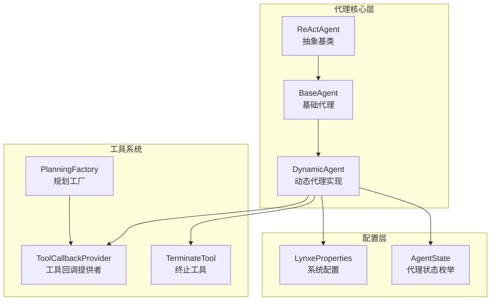
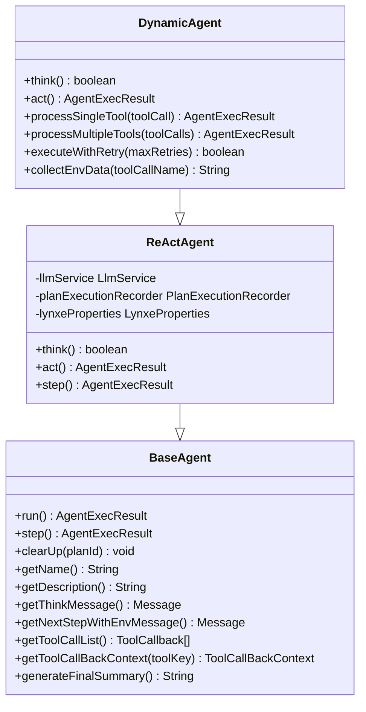
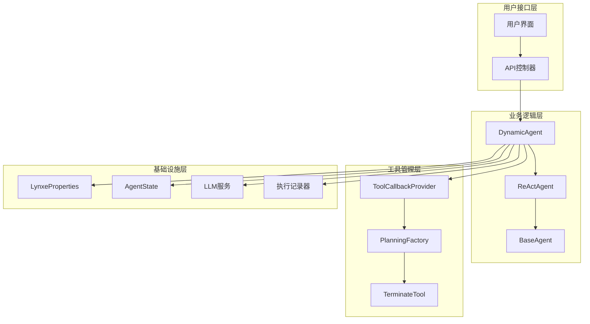
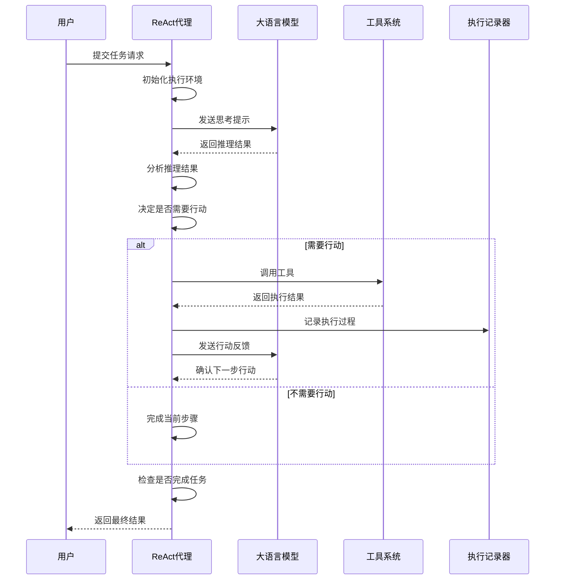
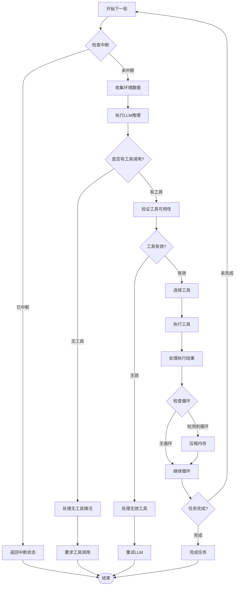
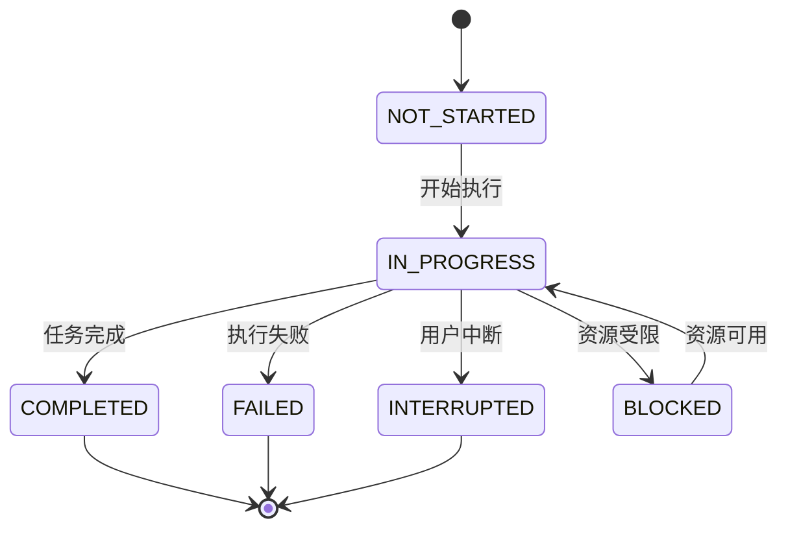
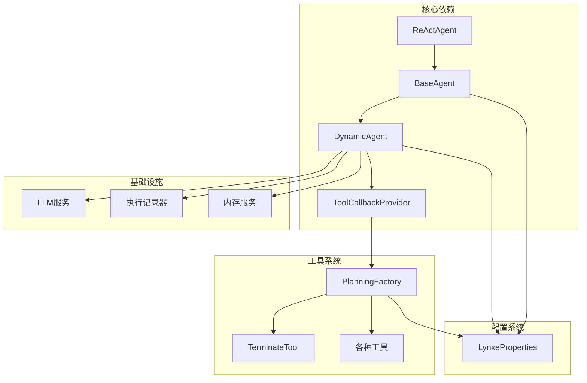

# ReAct代理实现

<cite>
**本文档引用的文件**
- [ReActAgent.java](file://src/main/java/com/alibaba/cloud/ai/lynxe/agent/ReActAgent.java)
- [BaseAgent.java](file://src/main/java/com/alibaba/cloud/ai/lynxe/agent/BaseAgent.java)
- [DynamicAgent.java](file://src/main/java/com/alibaba/cloud/ai/lynxe/agent/DynamicAgent.java)
- [AgentState.java](file://src/main/java/com/alibaba/cloud/ai/lynxe/agent/AgentState.java)
- [ToolCallbackProvider.java](file://src/main/java/com/alibaba/cloud/ai/lynxe/agent/ToolCallbackProvider.java)
- [PlanningFactory.java](file://src/main/java/com/alibaba/cloud/ai/lynxe/planning/PlanningFactory.java)
- [LynxeProperties.java](file://src/main/java/com/alibaba/cloud/ai/lynxe/config/LynxeProperties.java)
- [TerminateTool.java](file://src/main/java/com/alibaba/cloud/ai/lynxe/tool/TerminateTool.java)
</cite>

## 目录
1. [简介](#简介)
2. [项目结构](#项目结构)
3. [核心组件](#核心组件)
4. [架构概览](#架构概览)
5. [详细组件分析](#详细组件分析)
6. [依赖分析](#依赖分析)
7. [性能考虑](#性能考虑)
8. [故障排除指南](#故障排除指南)
9. [结论](#结论)
10. [附录](#附录)

## 简介

Lynxe ReAct代理实现是一个基于推理-行动（Reasoning-Acting）模式的智能代理系统。该实现采用ReAct框架的核心思想，通过交替进行推理思考和具体行动来完成复杂的多步骤任务。

ReAct代理的核心设计理念是将大型语言模型（LLM）的能力与工具调用相结合，形成一个完整的智能决策和执行系统。代理不仅能够进行逻辑推理和问题分析，还能够通过调用各种工具来执行实际操作，从而实现从"思考"到"行动"的完整闭环。

该实现提供了高度可配置的框架，支持多种工具类型、并行执行、错误处理和状态管理等功能，适用于各种复杂的企业级应用场景。

## 项目结构

Lynxe ReAct代理实现位于项目的agent包中，采用分层架构设计：

**图表来源**
- [ReActAgent.java:30-96](file://src/main/java/com/alibaba/cloud/ai/lynxe/agent/ReActAgent.java#L30-L96)
- [BaseAgent.java:70-589](file://src/main/java/com/alibaba/cloud/ai/lynxe/agent/BaseAgent.java#L70-L589)
- [DynamicAgent.java:83-201](file://src/main/java/com/alibaba/cloud/ai/lynxe/agent/DynamicAgent.java#L83-L201)

**章节来源**
- [ReActAgent.java:1-97](file://src/main/java/com/alibaba/cloud/ai/lynxe/agent/ReActAgent.java#L1-L97)
- [BaseAgent.java:1-589](file://src/main/java/com/alibaba/cloud/ai/lynxe/agent/BaseAgent.java#L1-L589)
- [DynamicAgent.java:1-800](file://src/main/java/com/alibaba/cloud/ai/lynxe/agent/DynamicAgent.java#L1-L800)

## 核心组件

### ReActAgent抽象基类

ReActAgent是整个ReAct模式的核心抽象类，定义了推理-行动循环的基本框架：

**图表来源**
- [ReActAgent.java:30-96](file://src/main/java/com/alibaba/cloud/ai/lynxe/agent/ReActAgent.java#L30-L96)
- [BaseAgent.java:70-589](file://src/main/java/com/alibaba/cloud/ai/lynxe/agent/BaseAgent.java#L70-L589)
- [DynamicAgent.java:83-201](file://src/main/java/com/alibaba/cloud/ai/lynxe/agent/DynamicAgent.java#L83-L201)

ReActAgent的核心特性包括：
- **推理-行动循环**：通过`think()`和`act()`方法实现交替执行
- **状态管理**：继承自BaseAgent的状态管理系统
- **异常处理**：内置的任务中断检查和异常处理机制
- **可扩展性**：为具体的代理实现提供清晰的接口定义

**章节来源**
- [ReActAgent.java:26-96](file://src/main/java/com/alibaba/cloud/ai/lynxe/agent/ReActAgent.java#L26-L96)

### BaseAgent基础代理

BaseAgent提供了代理系统的基础功能和通用逻辑：

**核心功能模块**：
- **执行控制**：`run()`方法管理整个执行流程
- **状态管理**：`AgentState`枚举定义代理状态
- **内存管理**：对话历史和执行记忆的管理
- **错误处理**：统一的异常处理和错误报告机制

**章节来源**
- [BaseAgent.java:41-589](file://src/main/java/com/alibaba/cloud/ai/lynxe/agent/BaseAgent.java#L41-L589)

### DynamicAgent动态代理实现

DynamicAgent是ReActAgent的具体实现，提供了完整的推理-行动功能：

**主要特性**：
- **智能思考**：通过LLM进行推理和决策
- **工具调用**：支持单个和多个工具的执行
- **重试机制**：网络异常时的自动重试
- **早期终止检测**：防止无限循环的保护机制
- **并行执行**：支持多个工具的并行调用

**章节来源**
- [DynamicAgent.java:83-800](file://src/main/java/com/alibaba/cloud/ai/lynxe/agent/DynamicAgent.java#L83-L800)

## 架构概览

Lynxe ReAct代理系统采用分层架构设计，各层职责明确：

**图表来源**
- [DynamicAgent.java:170-201](file://src/main/java/com/alibaba/cloud/ai/lynxe/agent/DynamicAgent.java#L170-L201)
- [PlanningFactory.java:261-393](file://src/main/java/com/alibaba/cloud/ai/lynxe/planning/PlanningFactory.java#L261-L393)

## 详细组件分析

### ReAct推理-行动模式

ReAct模式的核心在于推理和行动的交替执行：

**图表来源**
- [ReActAgent.java:78-94](file://src/main/java/com/alibaba/cloud/ai/lynxe/agent/ReActAgent.java#L78-L94)
- [DynamicAgent.java:203-233](file://src/main/java/com/alibaba/cloud/ai/lynxe/agent/DynamicAgent.java#L203-L233)

### 思维链构建机制

BaseAgent负责构建和维护思维链：

**思维链要素**：
- **系统信息**：操作系统、时间等环境信息
- **当前步骤要求**：具体的任务指令
- **操作步骤说明**：执行指导和规则
- **重要注意事项**：行为准则和限制条件

**章节来源**
- [BaseAgent.java:163-263](file://src/main/java/com/alibaba/cloud/ai/lynxe/agent/BaseAgent.java#L163-L263)

### 工具选择策略

DynamicAgent采用智能的工具选择策略：

**图表来源**
- [DynamicAgent.java:235-495](file://src/main/java/com/alibaba/cloud/ai/lynxe/agent/DynamicAgent.java#L235-L495)
- [DynamicAgent.java:616-658](file://src/main/java/com/alibaba/cloud/ai/lynxe/agent/DynamicAgent.java#L616-L658)

### 执行反馈循环

系统实现了完整的执行反馈循环：

**反馈循环流程**：
1. **思考阶段**：LLM生成推理和行动决策
2. **行动阶段**：执行选定的工具调用
3. **记录阶段**：记录执行过程和结果
4. **评估阶段**：评估行动效果和下一步决策
5. **循环阶段**：根据评估结果决定是否继续

**章节来源**
- [DynamicAgent.java:1282-1333](file://src/main/java/com/alibaba/cloud/ai/lynxe/agent/DynamicAgent.java#L1282-L1333)

### 提示工程设计

提示工程是ReAct代理的核心技术之一：

**提示模板结构**：
- **系统信息**：环境和约束条件
- **Agent信息**：代理能力和限制
- **当前步骤**：具体任务要求
- **执行规则**：行为准则和响应规则

**章节来源**
- [BaseAgent.java:163-249](file://src/main/java/com/alibaba/cloud/ai/lynxe/agent/BaseAgent.java#L163-L249)

### 上下文管理

系统提供了强大的上下文管理能力：

**上下文要素**：
- **环境数据**：工具相关的上下文信息
- **执行历史**：之前的执行结果和状态
- **配置参数**：系统和代理的配置设置
- **内存状态**：对话历史和长期记忆

**章节来源**
- [DynamicAgent.java:1686-1701](file://src/main/java/com/alibaba/cloud/ai/lynxe/agent/DynamicAgent.java#L1686-L1701)

### 状态转换机制

代理的状态转换遵循严格的规则：

**图表来源**
- [AgentState.java:18-34](file://src/main/java/com/alibaba/cloud/ai/lynxe/agent/AgentState.java#L18-L34)

**章节来源**
- [AgentState.java:1-35](file://src/main/java/com/alibaba/cloud/ai/lynxe/agent/AgentState.java#L1-L35)

## 依赖分析

### 组件耦合关系

**图表来源**
- [DynamicAgent.java:170-201](file://src/main/java/com/alibaba/cloud/ai/lynxe/agent/DynamicAgent.java#L170-L201)
- [PlanningFactory.java:261-393](file://src/main/java/com/alibaba/cloud/ai/lynxe/planning/PlanningFactory.java#L261-L393)

### 外部依赖管理

系统对外部依赖进行了良好的封装和管理：

**主要外部依赖**：
- **Spring AI框架**：LLM集成和工具调用管理
- **Jackson库**：JSON序列化和反序列化
- **SLF4J**：日志记录
- **Reactor**：响应式编程支持

**章节来源**
- [DynamicAgent.java:170-201](file://src/main/java/com/alibaba/cloud/ai/lynxe/agent/DynamicAgent.java#L170-L201)

## 性能考虑

### 并行执行优化

系统支持多种并行执行策略：

**并行执行场景**：
- **多工具并行**：同时执行多个独立工具
- **内存压缩**：防止内存膨胀导致的性能下降
- **重试机制**：网络异常时的自动恢复

**性能优化措施**：
- **指数退避**：网络重试采用指数退避策略
- **早期终止检测**：防止无效的重复执行
- **内存限制**：对话历史的大小限制

### 资源管理

**资源管理策略**：
- **连接池管理**：HTTP客户端连接池的合理配置
- **线程池管理**：工具执行的并发控制
- **内存监控**：执行历史的内存使用监控

**章节来源**
- [DynamicAgent.java:500-518](file://src/main/java/com/alibaba/cloud/ai/lynxe/agent/DynamicAgent.java#L500-L518)
- [LynxeProperties.java:289-310](file://src/main/java/com/alibaba/cloud/ai/lynxe/config/LynxeProperties.java#L289-L310)

## 故障排除指南

### 常见问题诊断

**早期终止问题**：
- **症状**：LLM只输出文本而不调用工具
- **原因**：模型配置或提示工程问题
- **解决方案**：检查`parallelToolCalls`配置和提示模板

**工具调用失败**：
- **症状**：工具执行异常或超时
- **原因**：网络问题、权限不足、工具配置错误
- **解决方案**：查看工具回调映射和配置参数

**内存溢出问题**：
- **症状**：执行过程中内存使用持续增长
- **原因**：对话历史过长或工具结果过大
- **解决方案**：调整`maxMemory`配置和启用内存压缩

### 调试技巧

**调试方法**：
- **详细日志**：启用`debugDetail`配置获取详细执行信息
- **状态监控**：监控代理状态变化和执行进度
- **工具追踪**：跟踪工具调用的输入输出和执行时间

**章节来源**
- [DynamicAgent.java:1282-1333](file://src/main/java/com/alibaba/cloud/ai/lynxe/agent/DynamicAgent.java#L1282-L1333)

## 结论

Lynxe ReAct代理实现提供了一个完整、可扩展的智能代理系统。该实现成功地将推理-行动模式与现代LLM技术相结合，形成了一个功能强大且易于使用的框架。

**主要优势**：
- **架构清晰**：分层设计使得系统易于理解和维护
- **功能完整**：涵盖了从推理到行动的完整流程
- **配置灵活**：丰富的配置选项适应不同的使用场景
- **扩展性强**：工具系统的插件化设计便于功能扩展

**适用场景**：
- **自动化任务**：重复性的业务流程自动化
- **数据分析**：复杂的数据查询和处理任务
- **系统运维**：服务器管理和维护任务
- **内容创作**：文档生成和内容编辑工作流

## 附录

### 配置参数参考

**核心配置参数**：
- `lynxe.maxSteps`：最大执行步数
- `lynxe.agent.parallelToolCalls`：是否启用并行工具调用
- `lynxe.agent.maxMemory`：最大内存使用量
- `lynxe.general.debugDetail`：调试详细程度

**章节来源**
- [LynxeProperties.java:154-310](file://src/main/java/com/alibaba/cloud/ai/lynxe/config/LynxeProperties.java#L154-L310)

### 使用案例

**典型使用场景**：
1. **数据查询代理**：自动执行数据库查询和报表生成
2. **文件处理代理**：批量文件处理和格式转换
3. **系统监控代理**：自动化系统监控和告警处理
4. **内容生成代理**：智能内容创作和编辑

**最佳实践**：
- 合理设置最大执行步数，避免无限循环
- 为工具调用提供清晰的参数定义
- 实现适当的错误处理和重试机制
- 监控代理执行状态和性能指标