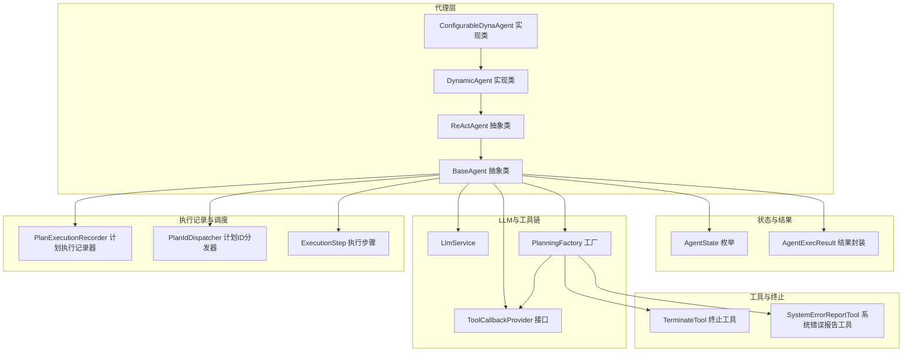
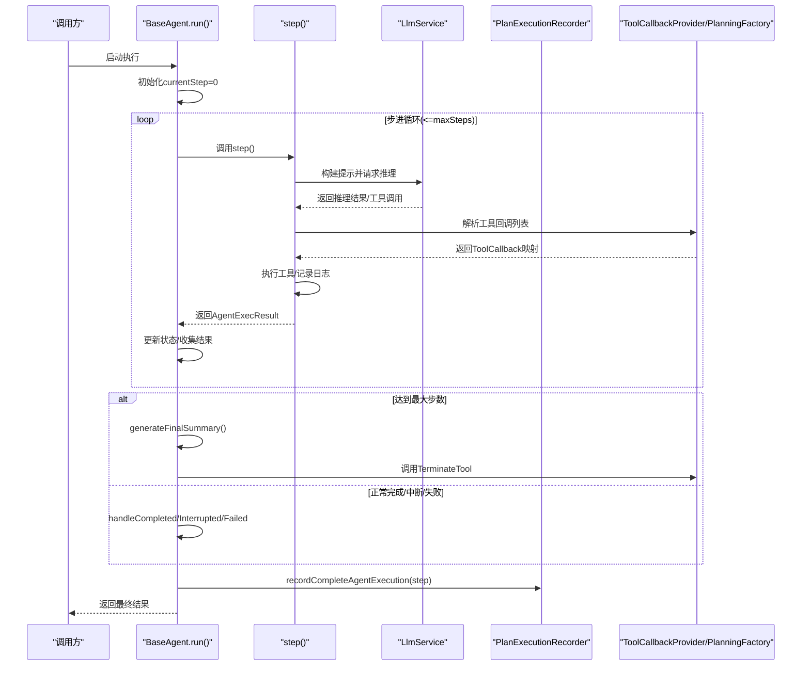
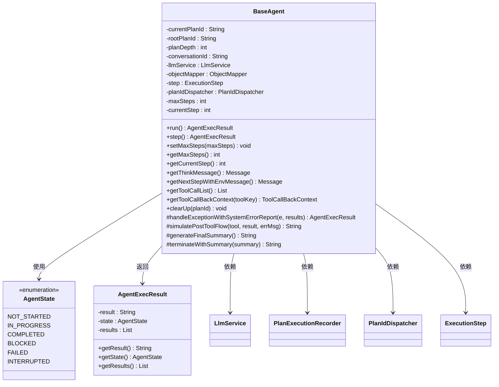
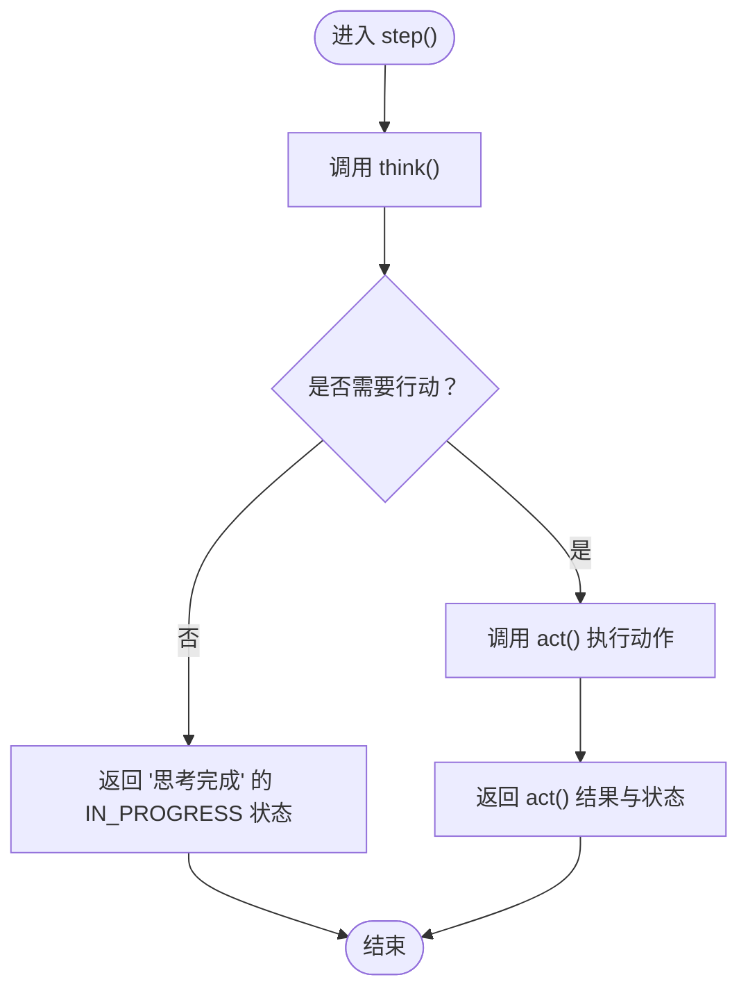
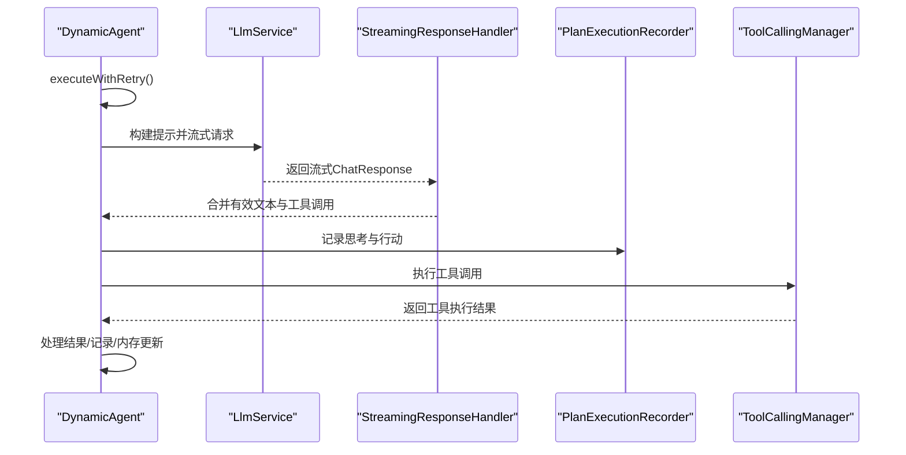
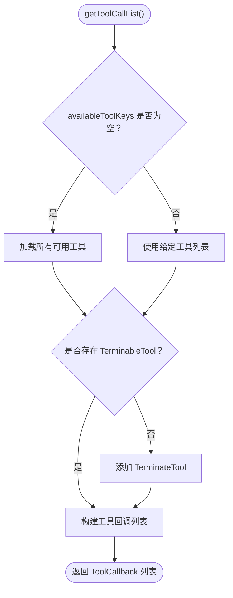
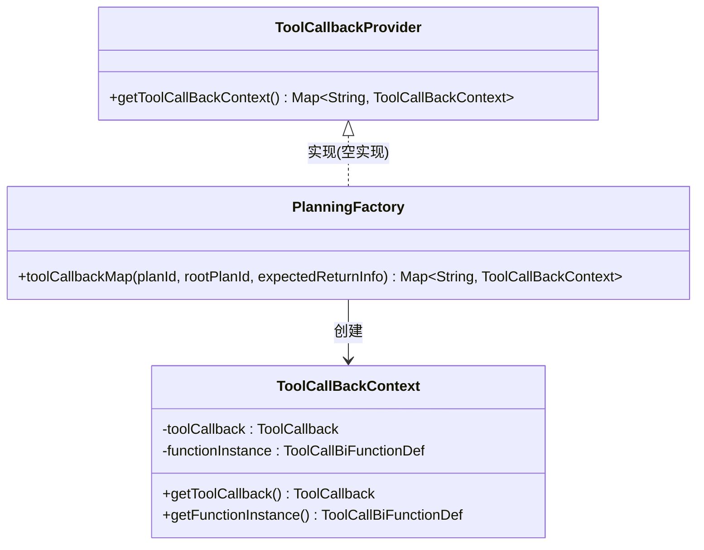
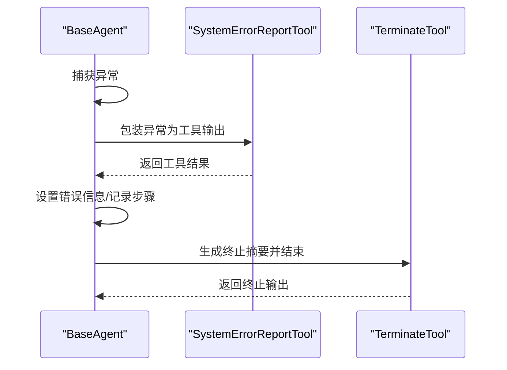
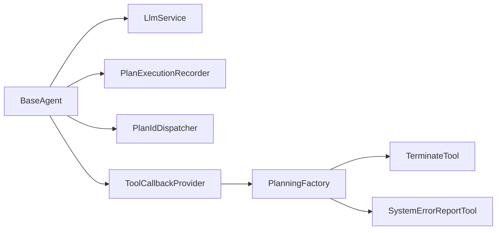

# 代理基类设计

<cite>
**本文引用的文件**   
- [BaseAgent.java](file://src/main/java/com/alibaba/cloud/ai/lynxe/agent/BaseAgent.java)
- [AgentState.java](file://src/main/java/com/alibaba/cloud/ai/lynxe/agent/AgentState.java)
- [ReActAgent.java](file://src/main/java/com/alibaba/cloud/ai/lynxe/agent/ReActAgent.java)
- [DynamicAgent.java](file://src/main/java/com/alibaba/cloud/ai/lynxe/agent/DynamicAgent.java)
- [ConfigurableDynaAgent.java](file://src/main/java/com/alibaba/cloud/ai/lynxe/agent/ConfigurableDynaAgent.java)
- [ToolCallbackProvider.java](file://src/main/java/com/alibaba/cloud/ai/lynxe/agent/ToolCallbackProvider.java)
- [PlanningFactory.java](file://src/main/java/com/alibaba/cloud/ai/lynxe/planning/PlanningFactory.java)
- [LlmService.java](file://src/main/java/com/alibaba/cloud/ai/lynxe/llm/LlmService.java)
- [PlanExecutionRecorder.java](file://src/main/java/com/alibaba/cloud/ai/lynxe/recorder/service/PlanExecutionRecorder.java)
- [PlanIdDispatcher.java](file://src/main/java/com/alibaba/cloud/ai/lynxe/runtime/service/PlanIdDispatcher.java)
- [ExecutionStep.java](file://src/main/java/com/alibaba/cloud/ai/lynxe/runtime/entity(vo)/ExecutionStep.java)
- [TerminateTool.java](file://src/main/java/com/alibaba/cloud/ai/lynxe/tool/TerminateTool.java)
- [SystemErrorReportTool.java](file://src/main/java/com/alibaba/cloud/ai/lynxe/tool/SystemErrorReportTool.java)
- [DynamicAgentEntity.java](file://src/main/java/com/alibaba/cloud/ai/lynxe/agent/entity/DynamicAgentEntity.java)
- [Tool.java](file://src/main/java/com/alibaba/cloud/ai/lynxe/agent/model/Tool.java)
</cite>

## 目录
1. [简介](#简介)
2. [项目结构](#项目结构)
3. [核心组件](#核心组件)
4. [架构总览](#架构总览)
5. [详细组件分析](#详细组件分析)
6. [依赖分析](#依赖分析)
7. [性能考虑](#性能考虑)
8. [故障排查指南](#故障排查指南)
9. [结论](#结论)
10. [附录：最佳实践与扩展指南](#附录最佳实践与扩展指南)

## 简介
本文件面向Lynxe代理体系中的BaseAgent抽象类，系统化阐述其设计理念、架构模式与实现细节。重点覆盖代理生命周期管理、状态控制机制、执行步数限制与异常处理策略；解释代理与LLM服务的集成方式、消息传递机制与回调处理；说明代理配置参数、环境数据管理与上下文传递；给出代理初始化流程、执行循环控制与终止条件判断；并提供开发最佳实践与扩展指南，帮助开发者正确实现抽象方法与处理代理状态变化。

## 项目结构
围绕代理基类设计，涉及的关键模块如下：
- 代理层：BaseAgent、ReActAgent、DynamicAgent、ConfigurableDynaAgent
- 状态与结果：AgentState、AgentExecResult
- LLM与工具链：LlmService、ToolCallbackProvider、PlanningFactory、Tool回调上下文
- 执行记录与调度：PlanExecutionRecorder、PlanIdDispatcher、ExecutionStep
- 工具与终止：TerminateTool、SystemErrorReportTool
- 动态代理实体与模型：DynamicAgentEntity、Tool

**图表来源**
- [BaseAgent.java:70-589](file://src/main/java/com/alibaba/cloud/ai/lynxe/agent/BaseAgent.java#L70-L589)
- [ReActAgent.java:30-97](file://src/main/java/com/alibaba/cloud/ai/lynxe/agent/ReActAgent.java#L30-L97)
- [DynamicAgent.java:83-201](file://src/main/java/com/alibaba/cloud/ai/lynxe/agent/DynamicAgent.java#L83-L201)
- [ConfigurableDynaAgent.java:51-89](file://src/main/java/com/alibaba/cloud/ai/lynxe/agent/ConfigurableDynaAgent.java#L51-L89)
- [PlanningFactory.java:240-393](file://src/main/java/com/alibaba/cloud/ai/lynxe/planning/PlanningFactory.java#L240-L393)
- [ToolCallbackProvider.java:22-26](file://src/main/java/com/alibaba/cloud/ai/lynxe/agent/ToolCallbackProvider.java#L22-L26)

**章节来源**
- [BaseAgent.java:70-589](file://src/main/java/com/alibaba/cloud/ai/lynxe/agent/BaseAgent.java#L70-L589)
- [ReActAgent.java:30-97](file://src/main/java/com/alibaba/cloud/ai/lynxe/agent/ReActAgent.java#L30-L97)
- [DynamicAgent.java:83-201](file://src/main/java/com/alibaba/cloud/ai/lynxe/agent/DynamicAgent.java#L83-L201)
- [ConfigurableDynaAgent.java:51-89](file://src/main/java/com/alibaba/cloud/ai/lynxe/agent/ConfigurableDynaAgent.java#L51-L89)
- [PlanningFactory.java:240-393](file://src/main/java/com/alibaba/cloud/ai/lynxe/planning/PlanningFactory.java#L240-L393)
- [ToolCallbackProvider.java:22-26](file://src/main/java/com/alibaba/cloud/ai/lynxe/agent/ToolCallbackProvider.java#L22-L26)

## 核心组件
- BaseAgent（抽象类）
  - 职责：统一代理生命周期、状态机、执行步数限制、异常处理、与LLM交互、工具回调、上下文与环境数据管理、执行记录。
  - 关键点：run()主循环、step()抽象方法、AgentExecResult结果封装、handleExceptionWithSystemErrorReport()异常包装、generateFinalSummary()/terminateWithSummary()终止流程。
- AgentState（枚举）
  - 职责：定义代理状态集合（未开始、进行中、已完成、阻塞、失败、中断）。
- ReActAgent（抽象类）
  - 职责：在BaseAgent之上引入“思考-行动”交替模式，think()与act()分离。
- DynamicAgent（实现类）
  - 职责：基于LLM流式响应与工具调用的动态代理实现，包含重试、早期终止检测、并行工具执行、内存压缩与事件发布等高级能力。
- ConfigurableDynaAgent（实现类）
  - 职责：在DynamicAgent基础上支持运行时可配置工具集，自动补齐终止工具，兼容服务组前缀工具名。
- ToolCallbackProvider接口与PlanningFactory
  - 职责：提供工具回调映射（工具名到回调实例），支持MCP与子计划工具注册，统一工具回调上下文ToolCallBackContext。
- LlmService、PlanExecutionRecorder、PlanIdDispatcher、ExecutionStep
  - 职责：LLM对话客户端、执行记录、计划ID生成、执行步骤载体。
- 终止与错误工具
  - TerminateTool：用于在合适时机结束代理执行。
  - SystemErrorReportTool：将异常包装为工具输出，模拟正常工具流以保持状态一致性。

**章节来源**
- [BaseAgent.java:70-589](file://src/main/java/com/alibaba/cloud/ai/lynxe/agent/BaseAgent.java#L70-L589)
- [AgentState.java:18-35](file://src/main/java/com/alibaba/cloud/ai/lynxe/agent/AgentState.java#L18-L35)
- [ReActAgent.java:30-97](file://src/main/java/com/alibaba/cloud/ai/lynxe/agent/ReActAgent.java#L30-L97)
- [DynamicAgent.java:83-201](file://src/main/java/com/alibaba/cloud/ai/lynxe/agent/DynamicAgent.java#L83-L201)
- [ConfigurableDynaAgent.java:51-89](file://src/main/java/com/alibaba/cloud/ai/lynxe/agent/ConfigurableDynaAgent.java#L51-L89)
- [PlanningFactory.java:240-393](file://src/main/java/com/alibaba/cloud/ai/lynxe/planning/PlanningFactory.java#L240-L393)
- [ToolCallbackProvider.java:22-26](file://src/main/java/com/alibaba/cloud/ai/lynxe/agent/ToolCallbackProvider.java#L22-L26)

## 架构总览
下图展示BaseAgent及其派生类与外部依赖的交互关系，突出消息传递、工具回调与执行记录路径。

**图表来源**
- [BaseAgent.java:281-357](file://src/main/java/com/alibaba/cloud/ai/lynxe/agent/BaseAgent.java#L281-L357)
- [DynamicAgent.java:330-449](file://src/main/java/com/alibaba/cloud/ai/lynxe/agent/DynamicAgent.java#L330-L449)
- [PlanningFactory.java:261-393](file://src/main/java/com/alibaba/cloud/ai/lynxe/planning/PlanningFactory.java#L261-L393)

## 详细组件分析

### BaseAgent抽象类
- 生命周期与执行循环
  - run()负责步进循环，依据step()返回的AgentExecResult.State判断是否终止或继续；达到maxSteps后生成摘要并终止。
  - 支持中断（INTERRUPTED）、失败（FAILED）、完成（COMPLETED）三种终止态，并分别进入对应处理分支。
- 状态控制机制
  - AgentState枚举统一代理状态；AgentExecResult封装单轮结果与历史结果列表，便于回溯与审计。
- 执行步数限制
  - 通过setMaxSteps()/getMaxSteps()设置与读取最大步数，默认来自LynxeProperties；循环内currentStep自增并在超过阈值时触发终止逻辑。
- 异常处理策略
  - 捕获异常后通过handleExceptionWithSystemErrorReport()将异常包装为工具输出，模拟正常工具流，避免破坏状态一致性；同时在finally中确保执行记录。
- 与LLM服务集成
  - 通过LlmService构建提示、发送请求、接收流式响应；结合StreamingResponseHandler进行内容合并与早期终止检测。
- 消息传递与回调
  - getThinkMessage()构建思考提示模板，getNextStepWithEnvMessage()提供下一步环境消息；getToolCallList()/getToolCallBackContext()提供工具回调与上下文。
- 上下文与环境数据管理
  - initSettingData为不可变初始设置；envData为运行期环境数据；getInitSettingData()/setEnvData()提供只读访问与更新。
- 终止流程
  - generateFinalSummary()由子类实现；terminateWithSummary()使用TerminateTool生成终止输出，保证一致的结束语义。

**图表来源**
- [BaseAgent.java:70-589](file://src/main/java/com/alibaba/cloud/ai/lynxe/agent/BaseAgent.java#L70-L589)
- [AgentState.java:18-35](file://src/main/java/com/alibaba/cloud/ai/lynxe/agent/AgentState.java#L18-L35)

**章节来源**
- [BaseAgent.java:70-589](file://src/main/java/com/alibaba/cloud/ai/lynxe/agent/BaseAgent.java#L70-L589)
- [AgentState.java:18-35](file://src/main/java/com/alibaba/cloud/ai/lynxe/agent/AgentState.java#L18-L35)

### ReActAgent抽象类
- 设计理念：将代理执行拆分为“思考（think）”与“行动（act）”两个阶段，think()决定是否需要行动，act()执行具体操作。
- 关键方法：
  - think()：基于当前状态与上下文进行推理，返回是否需要行动。
  - act()：执行具体动作（如工具调用、状态更新等），返回结果描述。
  - step()：组合think()与act()，捕获中断异常并返回相应状态。

**图表来源**
- [ReActAgent.java:78-94](file://src/main/java/com/alibaba/cloud/ai/lynxe/agent/ReActAgent.java#L78-L94)

**章节来源**
- [ReActAgent.java:30-97](file://src/main/java/com/alibaba/cloud/ai/lynxe/agent/ReActAgent.java#L30-L97)

### DynamicAgent实现类
- 思考阶段（think）
  - 基于LLM的流式响应，支持重试与指数退避、早期终止检测（仅文本无工具调用）、对话记忆压缩、事件发布与中断检查。
  - 将工具调用信息记录到PlanExecutionRecorder，支持输入/输出字符统计。
- 行动阶段（act）
  - 单工具与多工具（并行）执行，支持FormInputTool、TerminableTool、TerminateTool、ErrorReportTool、SystemErrorReportTool等特殊工具处理。
  - 对重复结果进行检测与强制压缩，防止陷入无效循环。
- 异常与中断
  - 针对网络类可重试异常采用退避重试；对用户中断抛出TaskInterruptedException，上层转换为INTERRUPTED状态。
- 工具回调与上下文
  - 通过PlanningFactory构建工具回调映射，支持服务组前缀工具名与子计划工具注册。

**图表来源**
- [DynamicAgent.java:235-495](file://src/main/java/com/alibaba/cloud/ai/lynxe/agent/DynamicAgent.java#L235-L495)
- [DynamicAgent.java:617-777](file://src/main/java/com/alibaba/cloud/ai/lynxe/agent/DynamicAgent.java#L617-L777)
- [PlanningFactory.java:261-393](file://src/main/java/com/alibaba/cloud/ai/lynxe/planning/PlanningFactory.java#L261-L393)

**章节来源**
- [DynamicAgent.java:83-201](file://src/main/java/com/alibaba/cloud/ai/lynxe/agent/DynamicAgent.java#L83-L201)
- [DynamicAgent.java:235-495](file://src/main/java/com/alibaba/cloud/ai/lynxe/agent/DynamicAgent.java#L235-L495)
- [DynamicAgent.java:617-777](file://src/main/java/com/alibaba/cloud/ai/lynxe/agent/DynamicAgent.java#L617-L777)

### ConfigurableDynaAgent实现类
- 可配置工具集：当availableToolKeys为空时，自动从ToolCallbackProvider获取全部可用工具，并确保存在TerminableTool或添加TerminateTool。
- 工具名兼容：支持serviceGroup.toolName格式到serviceGroup_toolName的转换，提升前端传参灵活性。
- 服务组索引：通过ServiceGroupIndexService高效定位工具，降低遍历成本。

**图表来源**
- [ConfigurableDynaAgent.java:97-201](file://src/main/java/com/alibaba/cloud/ai/lynxe/agent/ConfigurableDynaAgent.java#L97-L201)

**章节来源**
- [ConfigurableDynaAgent.java:51-89](file://src/main/java/com/alibaba/cloud/ai/lynxe/agent/ConfigurableDynaAgent.java#L51-L89)
- [ConfigurableDynaAgent.java:97-201](file://src/main/java/com/alibaba/cloud/ai/lynxe/agent/ConfigurableDynaAgent.java#L97-L201)

### 工具回调与规划工厂
- PlanningFactory.toolCallbackMap(planId, rootPlanId, expectedReturnInfo)
  - 注册内置工具与MCP工具，构建工具回调映射；使用qualified key（serviceGroup_toolName）确保LLM调用一致性。
  - 返回ToolCallBackContext（包含ToolCallback与函数实例），供代理侧解析与执行。
- ToolCallbackProvider
  - 提供工具回调上下文Map，支持空实现（MCP禁用时）。

**图表来源**
- [PlanningFactory.java:240-393](file://src/main/java/com/alibaba/cloud/ai/lynxe/planning/PlanningFactory.java#L240-L393)
- [ToolCallbackProvider.java:22-26](file://src/main/java/com/alibaba/cloud/ai/lynxe/agent/ToolCallbackProvider.java#L22-L26)

**章节来源**
- [PlanningFactory.java:240-393](file://src/main/java/com/alibaba/cloud/ai/lynxe/planning/PlanningFactory.java#L240-L393)
- [ToolCallbackProvider.java:22-26](file://src/main/java/com/alibaba/cloud/ai/lynxe/agent/ToolCallbackProvider.java#L22-L26)

### 终止与错误处理工具
- TerminateTool
  - 在代理需要结束时调用，生成统一的终止输出，配合BaseAgent.terminateWithSummary()完成收尾。
- SystemErrorReportTool
  - 将异常包装为工具输出，模拟正常工具流，便于统一记录与显示；BaseAgent.handleExceptionWithSystemErrorReport()负责调用与结果提取。

**图表来源**
- [BaseAgent.java:400-449](file://src/main/java/com/alibaba/cloud/ai/lynxe/agent/BaseAgent.java#L400-L449)
- [BaseAgent.java:569-586](file://src/main/java/com/alibaba/cloud/ai/lynxe/agent/BaseAgent.java#L569-L586)

**章节来源**
- [BaseAgent.java:400-449](file://src/main/java/com/alibaba/cloud/ai/lynxe/agent/BaseAgent.java#L400-L449)
- [BaseAgent.java:569-586](file://src/main/java/com/alibaba/cloud/ai/lynxe/agent/BaseAgent.java#L569-L586)

## 依赖分析
- 组件耦合与内聚
  - BaseAgent高内聚地封装了代理通用行为，ReActAgent与DynamicAgent分别在不同抽象层次扩展；工具回调通过PlanningFactory集中管理，降低代理与工具实现的耦合。
- 外部依赖
  - LlmService提供LLM交互能力；PlanExecutionRecorder负责执行记录；PlanIdDispatcher负责ID生成；ToolCallbackProvider/PlanningFactory提供工具回调上下文。
- 循环依赖风险
  - 代理与工具回调通过回调接口解耦，避免直接循环依赖；工具注册在工厂中集中处理，减少代理侧复杂度。

**图表来源**
- [BaseAgent.java:82-90](file://src/main/java/com/alibaba/cloud/ai/lynxe/agent/BaseAgent.java#L82-L90)
- [PlanningFactory.java:261-393](file://src/main/java/com/alibaba/cloud/ai/lynxe/planning/PlanningFactory.java#L261-L393)

**章节来源**
- [BaseAgent.java:82-90](file://src/main/java/com/alibaba/cloud/ai/lynxe/agent/BaseAgent.java#L82-L90)
- [PlanningFactory.java:261-393](file://src/main/java/com/alibaba/cloud/ai/lynxe/planning/PlanningFactory.java#L261-L393)

## 性能考虑
- 流式响应与内容合并
  - DynamicAgent通过StreamingResponseHandler合并流式内容，减少中间对象创建，提升用户体验与吞吐。
- 重试与退避
  - 对网络类可重试异常采用指数退避，避免频繁重试导致资源浪费；早期终止阈值防止无效循环。
- 内存压缩
  - 在构建提示前检查并压缩对话记忆，控制输入字符数，避免超出模型上下文限制。
- 并行工具执行
  - 支持多工具并行执行（除FormInputTool外），提高执行效率；TerminateTool在并行完成后作为收尾执行。

[本节为通用指导，不直接分析具体文件]

## 故障排查指南
- 代理未产生工具调用
  - 检查DynamicAgent.executeWithRetry()中的早期终止检测与重试逻辑；确认工具回调列表是否正确注入。
- 中断与失败状态
  - 观察TaskInterruptionCheckerService抛出的TaskInterruptedException；在BaseAgent.run()中对应INTERRUPTED/FAILED分支。
- 异常包装与错误显示
  - SystemErrorReportTool会将异常转为工具输出，若解析失败则回退至基础错误信息；检查objectMapper与错误字段提取逻辑。
- 终止流程异常
  - TerminateTool执行失败时，BaseAgent.terminateWithSummary()会记录错误并返回兜底信息；检查工具参数与计划ID。

**章节来源**
- [DynamicAgent.java:235-495](file://src/main/java/com/alibaba/cloud/ai/lynxe/agent/DynamicAgent.java#L235-L495)
- [BaseAgent.java:400-449](file://src/main/java/com/alibaba/cloud/ai/lynxe/agent/BaseAgent.java#L400-L449)
- [BaseAgent.java:569-586](file://src/main/java/com/alibaba/cloud/ai/lynxe/agent/BaseAgent.java#L569-L586)

## 结论
BaseAgent通过清晰的生命周期管理、严格的步数限制与完善的异常处理策略，为Lynxe代理体系提供了稳定且可扩展的抽象基座。ReActAgent与DynamicAgent分别覆盖“思考-行动”范式与动态工具调用场景，ConfigurableDynaAgent进一步增强了工具配置的灵活性。借助PlanningFactory与ToolCallbackProvider，代理与工具实现解耦，便于维护与扩展。遵循本文最佳实践，可在保证一致性的同时快速实现新的代理类型。

[本节为总结性内容，不直接分析具体文件]

## 附录：最佳实践与扩展指南
- 实现抽象方法
  - getName()/getDescription()：简洁准确地描述代理职责与特性。
  - getThinkMessage()：根据环境变量与配置生成系统提示，确保工具调用规则与调试开关生效。
  - getNextStepWithEnvMessage()：提供下一步明确的执行指令与上下文。
  - step()/think()/act()：遵循ReActAgent约定，think()返回是否需要行动，act()返回AgentExecResult。
- 状态与终止
  - 正确设置AgentState：IN_PROGRESS用于继续执行，COMPLETED用于成功结束，INTERRUPTED/FAILED用于异常终止。
  - 在generateFinalSummary()中汇总关键信息，确保terminateWithSummary()输出一致。
- 工具回调与上下文
  - 通过PlanningFactory提供的ToolCallBackContext获取工具实例与回调；注意服务组前缀工具名的兼容处理。
- 环境数据与上下文
  - 使用getInitSettingData()与setEnvData()管理不可变初始设置与运行期环境数据，避免在代理内部修改。
- 异常处理
  - 发生异常时优先使用handleExceptionWithSystemErrorReport()包装为工具输出，保持状态一致性与可观测性。
- 性能优化
  - 合理设置maxSteps，启用对话记忆压缩，必要时开启并行工具执行；对网络类异常采用退避重试。

[本节为通用指导，不直接分析具体文件]