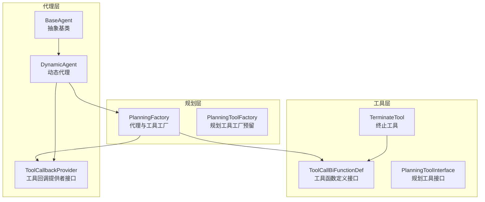
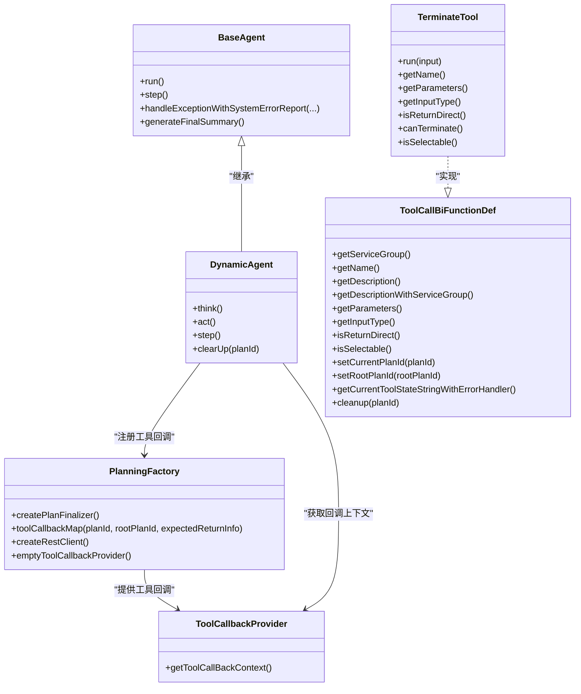
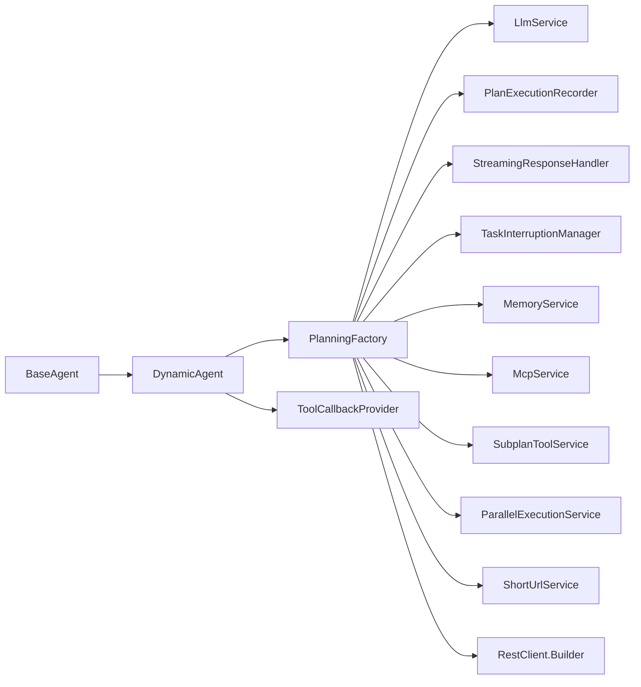

# 代理工厂模式

<cite>
**本文引用的文件**
- [PlanningFactory.java](file://src/main/java/com/alibaba/cloud/ai/lynxe/planning/PlanningFactory.java)
- [PlanningToolFactory.java](file://src/main/java/com/alibaba/cloud/ai/lynxe/planning/factory/PlanningToolFactory.java)
- [DynamicAgent.java](file://src/main/java/com/alibaba/cloud/ai/lynxe/agent/DynamicAgent.java)
- [BaseAgent.java](file://src/main/java/com/alibaba/cloud/ai/lynxe/agent/BaseAgent.java)
- [ToolCallbackProvider.java](file://src/main/java/com/alibaba/cloud/ai/lynxe/agent/ToolCallbackProvider.java)
- [PlanningToolInterface.java](file://src/main/java/com/alibaba/cloud/ai/lynxe/tool/PlanningToolInterface.java)
- [ToolCallBiFunctionDef.java](file://src/main/java/com/alibaba/cloud/ai/lynxe/tool/ToolCallBiFunctionDef.java)
- [TerminateTool.java](file://src/main/java/com/alibaba/cloud/ai/lynxe/tool/TerminateTool.java)
- [DynamicAgentDefinition.java](file://src/main/java/com/alibaba/cloud/ai/lynxe/agent/annotation/DynamicAgentDefinition.java)
- [DynamicAgentEntity.java](file://src/main/java/com/alibaba/cloud/ai/lynxe/agent/entity/DynamicAgentEntity.java)
</cite>

## 目录
1. [引言](#引言)
2. [项目结构](#项目结构)
3. [核心组件](#核心组件)
4. [架构总览](#架构总览)
5. [详细组件分析](#详细组件分析)
6. [依赖分析](#依赖分析)
7. [性能考虑](#性能考虑)
8. [故障排除指南](#故障排除指南)
9. [结论](#结论)
10. [附录](#附录)

## 引言
本文件围绕 Lynxe 的“代理工厂模式”展开，重点解释 PlanningFactory 的设计原理与工厂模式在代理与工具注册中的应用。文档涵盖：
- 代理实例创建流程、参数传递与配置管理
- 不同类型代理的工厂方法、代理选择策略与动态创建机制
- 工厂的扩展性设计、新增代理类型的步骤与配置管理
- 性能考量（缓存策略、超时设置、资源复用）
- 使用示例、最佳实践与故障排除
- 与依赖注入容器的集成与生命周期管理

## 项目结构
与代理工厂相关的关键模块位于以下包中：
- planning：规划与工厂层，包含 PlanningFactory 与 PlanningToolFactory
- agent：代理层，包含 DynamicAgent、BaseAgent、ToolCallbackProvider 等
- tool：工具层，包含工具接口与具体工具实现
- agent.annotation 与 agent.entity：动态代理定义与持久化实体

图表来源
- [PlanningFactory.java](file://src/main/java/com/alibaba/cloud/ai/lynxe/planning/PlanningFactory.java)
- [PlanningToolFactory.java](file://src/main/java/com/alibaba/cloud/ai/lynxe/planning/factory/PlanningToolFactory.java)
- [DynamicAgent.java](file://src/main/java/com/alibaba/cloud/ai/lynxe/agent/DynamicAgent.java)
- [BaseAgent.java](file://src/main/java/com/alibaba/cloud/ai/lynxe/agent/BaseAgent.java)
- [ToolCallbackProvider.java](file://src/main/java/com/alibaba/cloud/ai/lynxe/agent/ToolCallbackProvider.java)
- [ToolCallBiFunctionDef.java](file://src/main/java/com/alibaba/cloud/ai/lynxe/tool/ToolCallBiFunctionDef.java)
- [TerminateTool.java](file://src/main/java/com/alibaba/cloud/ai/lynxe/tool/TerminateTool.java)
- [PlanningToolInterface.java](file://src/main/java/com/alibaba/cloud/ai/lynxe/tool/PlanningToolInterface.java)

章节来源
- [PlanningFactory.java](file://src/main/java/com/alibaba/cloud/ai/lynxe/planning/PlanningFactory.java)
- [PlanningToolFactory.java](file://src/main/java/com/alibaba/cloud/ai/lynxe/planning/factory/PlanningToolFactory.java)
- [DynamicAgent.java](file://src/main/java/com/alibaba/cloud/ai/lynxe/agent/DynamicAgent.java)
- [BaseAgent.java](file://src/main/java/com/alibaba/cloud/ai/lynxe/agent/BaseAgent.java)
- [ToolCallbackProvider.java](file://src/main/java/com/alibaba/cloud/ai/lynxe/agent/ToolCallbackProvider.java)
- [ToolCallBiFunctionDef.java](file://src/main/java/com/alibaba/cloud/ai/lynxe/tool/ToolCallBiFunctionDef.java)
- [TerminateTool.java](file://src/main/java/com/alibaba/cloud/ai/lynxe/tool/TerminateTool.java)
- [PlanningToolInterface.java](file://src/main/java/com/alibaba/cloud/ai/lynxe/tool/PlanningToolInterface.java)

## 核心组件
- PlanningFactory：负责创建 PlanFinalizer、构建工具回调映射、装配 RestClient、提供空的 ToolCallbackProvider Bean。
- DynamicAgent：基于 PlanningFactory 注册的工具回调执行推理与行动，支持重试、中断、并行工具调用等。
- BaseAgent：抽象基类，提供统一的执行循环、异常处理、终止逻辑与状态管理。
- ToolCallbackProvider：代理侧获取工具回调上下文的统一入口。
- ToolCallBiFunctionDef：工具定义接口，规范工具名称、描述、参数、输入类型、是否直接返回等。
- PlanningToolInterface：规划工具接口，定义获取当前计划与 FunctionToolCallback 的能力。
- TerminateTool：终止工具，用于在代理执行结束时输出结构化结果。

章节来源
- [PlanningFactory.java](file://src/main/java/com/alibaba/cloud/ai/lynxe/planning/PlanningFactory.java)
- [DynamicAgent.java](file://src/main/java/com/alibaba/cloud/ai/lynxe/agent/DynamicAgent.java)
- [BaseAgent.java](file://src/main/java/com/alibaba/cloud/ai/lynxe/agent/BaseAgent.java)
- [ToolCallbackProvider.java](file://src/main/java/com/alibaba/cloud/ai/lynxe/agent/ToolCallbackProvider.java)
- [ToolCallBiFunctionDef.java](file://src/main/java/com/alibaba/cloud/ai/lynxe/tool/ToolCallBiFunctionDef.java)
- [PlanningToolInterface.java](file://src/main/java/com/alibaba/cloud/ai/lynxe/tool/PlanningToolInterface.java)
- [TerminateTool.java](file://src/main/java/com/alibaba/cloud/ai/lynxe/tool/TerminateTool.java)

## 架构总览
下图展示代理工厂在系统中的角色与交互关系：

图表来源
- [PlanningFactory.java](file://src/main/java/com/alibaba/cloud/ai/lynxe/planning/PlanningFactory.java)
- [DynamicAgent.java](file://src/main/java/com/alibaba/cloud/ai/lynxe/agent/DynamicAgent.java)
- [BaseAgent.java](file://src/main/java/com/alibaba/cloud/ai/lynxe/agent/BaseAgent.java)
- [ToolCallbackProvider.java](file://src/main/java/com/alibaba/cloud/ai/lynxe/agent/ToolCallbackProvider.java)
- [ToolCallBiFunctionDef.java](file://src/main/java/com/alibaba/cloud/ai/lynxe/tool/ToolCallBiFunctionDef.java)
- [TerminateTool.java](file://src/main/java/com/alibaba/cloud/ai/lynxe/tool/TerminateTool.java)

## 详细组件分析

### PlanningFactory 设计与工厂模式
- 职责边界
  - 创建 PlanFinalizer 实例，封装 LLM、记录器、流式响应处理器、任务中断管理与内存服务。
  - 构建工具回调映射 toolCallbackMap：根据 agent 初始化开关与 MCP 配置，动态注册浏览器、数据库、文件系统、并行执行、Markdown 转换、图像生成等工具，并为每个工具生成 FunctionToolCallback。
  - 提供 RestClient.Builder Bean，统一 HTTP 客户端超时配置（连接、响应、请求）。
  - 在 MCP 关闭时提供空的 ToolCallbackProvider Bean，保证容器可用性。

- 参数与配置管理
  - 通过构造注入与 @Lazy 延迟加载，避免循环依赖；通过 @Value 读取 agent 初始化开关。
  - RestClient 超时统一设置为 10 分钟，确保长耗时外部调用稳定。
  - 工具注册时按 serviceGroup 与 toolName 组合键名，支持带服务组前缀的唯一标识，便于 LLM 调用。

- 动态创建机制
  - 根据 agentInit 决定是否注册内置工具集合；否则仅注册终止工具。
  - 从 MCP 服务获取函数回调，包装为 McpTool 并加入工具集。
  - 子计划工具通过 SubplanToolService 注册，实现多级计划的工具扩展。

- 扩展性设计
  - 新增工具：在 toolCallbackMap 中添加新的 ToolCallBiFunctionDef 实例，即可自动注册为 FunctionToolCallback。
  - 新增代理类型：通过 ToolCallbackProvider 接口与 PlanningFactory 的工具映射，动态注入到代理执行链路。

- 错误处理与日志
  - 对缺失关键服务（如 ChromeDriverService、SmartContentSavingService）进行保护性跳过与错误日志。
  - 工具注册失败时记录错误并继续流程，避免单点故障影响整体执行。

章节来源
- [PlanningFactory.java](file://src/main/java/com/alibaba/cloud/ai/lynxe/planning/PlanningFactory.java)

### DynamicAgent 与代理选择策略
- 代理选择策略
  - 通过 ToolCallbackProvider 获取工具回调上下文，DynamicAgent 在思考阶段使用 StreamingResponseHandler 流式接收 LLM 输出，提取 ToolCall 列表。
  - 支持单工具与多工具执行：多工具时利用并行执行服务，但保留 TerminateTool 的后置执行顺序，确保终止逻辑在所有并行工具完成后生效。

- 执行流程
  - think()：构建提示词、检查中断、重试与早停检测、记录思考与动作。
  - act()：根据 ToolCall 数量分派到单工具或并行工具处理，对特殊工具（FormInputTool、TerminateTool、ErrorReportTool、SystemErrorReportTool）进行专门处理。
  - step()：综合 think/act 结果，返回 AgentState（IN_PROGRESS/COMPLETED/INTERRUPTED/FAILED）。

- 清理与中断
  - clearUp()：遍历工具回调上下文调用 cleanup(planId)，并移除对应根计划的表单输入工具。

章节来源
- [DynamicAgent.java](file://src/main/java/com/alibaba/cloud/ai/lynxe/agent/DynamicAgent.java)
- [BaseAgent.java](file://src/main/java/com/alibaba/cloud/ai/lynxe/agent/BaseAgent.java)

### 工具回调与工具定义
- ToolCallbackProvider
  - 代理侧通过该接口获取工具回调映射，作为 LLM 工具调用的入口。

- ToolCallBiFunctionDef
  - 规范工具元数据（名称、描述、参数 Schema、输入类型、是否直接返回、可否选择、计划绑定等），并提供清理方法。

- TerminateTool
  - 作为终止工具，支持结构化消息输出与短链接替换，满足不同场景下的终止信息格式需求。

章节来源
- [ToolCallbackProvider.java](file://src/main/java/com/alibaba/cloud/ai/lynxe/agent/ToolCallbackProvider.java)
- [ToolCallBiFunctionDef.java](file://src/main/java/com/alibaba/cloud/ai/lynxe/tool/ToolCallBiFunctionDef.java)
- [TerminateTool.java](file://src/main/java/com/alibaba/cloud/ai/lynxe/tool/TerminateTool.java)

### 规划工具工厂（预留）
- PlanningToolFactory 当前为注释状态，保留了未来按“规划类型”选择工具实例的思路，包括简单规划与 MapReduce 规划等类型。

章节来源
- [PlanningToolFactory.java](file://src/main/java/com/alibaba/cloud/ai/lynxe/planning/factory/PlanningToolFactory.java)

### 动态代理定义与实体
- DynamicAgentDefinition 注解：用于标注动态代理的名称、描述、下一步提示与可用工具键集合。
- DynamicAgentEntity 实体：持久化动态代理的元数据（名称、描述、下一步提示、可用工具键、类名、模型、命名空间、内置标记等）。

章节来源
- [DynamicAgentDefinition.java](file://src/main/java/com/alibaba/cloud/ai/lynxe/agent/annotation/DynamicAgentDefinition.java)
- [DynamicAgentEntity.java](file://src/main/java/com/alibaba/cloud/ai/lynxe/agent/entity/DynamicAgentEntity.java)

## 依赖分析
- PlanningFactory 依赖
  - LLM 服务、记录器、流式响应处理器、任务中断管理、内存服务、MCP 服务、子计划工具服务、并行执行服务、短链接服务、对象映射器、RestClient Builder 等。
  - 通过 @Lazy 与可选注入（@Autowired(required = false)）降低耦合度，提升启动稳定性。

- 代理与工具依赖
  - DynamicAgent 依赖 PlanningFactory 提供的工具回调映射，结合 ToolCallbackProvider 实现工具调用。
  - BaseAgent 提供统一的异常处理与终止逻辑，贯穿代理生命周期。

图表来源
- [PlanningFactory.java](file://src/main/java/com/alibaba/cloud/ai/lynxe/planning/PlanningFactory.java)
- [DynamicAgent.java](file://src/main/java/com/alibaba/cloud/ai/lynxe/agent/DynamicAgent.java)
- [BaseAgent.java](file://src/main/java/com/alibaba/cloud/ai/lynxe/agent/BaseAgent.java)

章节来源
- [PlanningFactory.java](file://src/main/java/com/alibaba/cloud/ai/lynxe/planning/PlanningFactory.java)
- [DynamicAgent.java](file://src/main/java/com/alibaba/cloud/ai/lynxe/agent/DynamicAgent.java)
- [BaseAgent.java](file://src/main/java/com/alibaba/cloud/ai/lynxe/agent/BaseAgent.java)

## 性能考虑
- 超时与连接池
  - RestClient 超时统一设置为 10 分钟，适合长耗时外部调用；可根据业务调整以平衡稳定性与响应速度。
- 并行工具执行
  - 多工具执行时利用并行执行服务，提高吞吐；注意 TerminateTool 的后置执行顺序，避免并发冲突。
- 早停与重试
  - think() 中的早停阈值与指数退避重试，减少无效轮询与网络抖动带来的开销。
- 资源清理
  - clearUp() 遍历工具回调上下文执行 cleanup(planId)，释放代理执行期间占用的资源。

章节来源
- [PlanningFactory.java](file://src/main/java/com/alibaba/cloud/ai/lynxe/planning/PlanningFactory.java)
- [DynamicAgent.java](file://src/main/java/com/alibaba/cloud/ai/lynxe/agent/DynamicAgent.java)

## 故障排除指南
- 工具注册失败
  - 现象：工具未出现在 LLM 可调用列表。
  - 排查：确认 PlanningFactory 中工具注册逻辑是否被 agentInit 开关屏蔽；检查工具构造参数是否完整；查看日志中“Failed to register tool”错误。
- 缺少关键服务
  - 现象：浏览器工具或内部存储工具未注册。
  - 排查：检查 ChromeDriverService、SmartContentSavingService 是否注入成功；若为空，工厂会记录错误并跳过注册。
- MCP 未启用
  - 现象：ToolCallbackProvider 返回空映射。
  - 排查：确认 spring.ai.mcp.client.enabled=false 时，emptyToolCallbackProvider Bean 生效。
- 代理早停
  - 现象：多次仅思考不调用工具。
  - 排查：检查 think() 中早停阈值与重试策略；必要时增强提示词引导工具调用。
- 终止工具输出格式
  - 现象：终止信息不符合预期。
  - 排查：确认 TerminateTool 的 expectedReturnInfo 配置与参数 Schema 生成逻辑。

章节来源
- [PlanningFactory.java](file://src/main/java/com/alibaba/cloud/ai/lynxe/planning/PlanningFactory.java)
- [DynamicAgent.java](file://src/main/java/com/alibaba/cloud/ai/lynxe/agent/DynamicAgent.java)
- [TerminateTool.java](file://src/main/java/com/alibaba/cloud/ai/lynxe/tool/TerminateTool.java)

## 结论
PlanningFactory 通过工厂模式将工具注册、回调构建与 RestClient 配置集中化，配合 DynamicAgent 的执行链路，实现了高扩展、可配置且稳定的代理执行框架。其设计要点包括：
- 明确的职责边界与延迟注入，降低启动风险
- 动态工具注册与服务组命名策略，提升 LLM 工具调用的可控性
- 并行执行与早停重试机制，兼顾性能与鲁棒性
- 清晰的扩展路径：新增工具与代理类型无需改动核心执行逻辑

## 附录

### 使用示例与最佳实践
- 新增工具
  - 在 PlanningFactory 的 toolCallbackMap 中添加新的 ToolCallBiFunctionDef 实例，确保 setCurrentPlanId 与 setRootPlanId 已设置。
  - 若工具需要外部服务，请通过 @Lazy 或可选注入避免启动失败。
- 新增代理类型
  - 通过 ToolCallbackProvider 获取工具回调映射，结合 DynamicAgent 的执行流程快速接入。
  - 使用 DynamicAgentDefinition 注解与 DynamicAgentEntity 持久化代理元数据，便于运行时动态选择。
- 配置管理
  - 通过 agent.init 控制是否注册内置工具集合。
  - 通过 spring.ai.mcp.client.enabled 控制 MCP 工具回调提供策略。
  - 通过 LynxeProperties 与工具国际化服务（ToolI18nService）统一描述与参数文案。

章节来源
- [PlanningFactory.java](file://src/main/java/com/alibaba/cloud/ai/lynxe/planning/PlanningFactory.java)
- [DynamicAgent.java](file://src/main/java/com/alibaba/cloud/ai/lynxe/agent/DynamicAgent.java)
- [DynamicAgentDefinition.java](file://src/main/java/com/alibaba/cloud/ai/lynxe/agent/annotation/DynamicAgentDefinition.java)
- [DynamicAgentEntity.java](file://src/main/java/com/alibaba/cloud/ai/lynxe/agent/entity/DynamicAgentEntity.java)