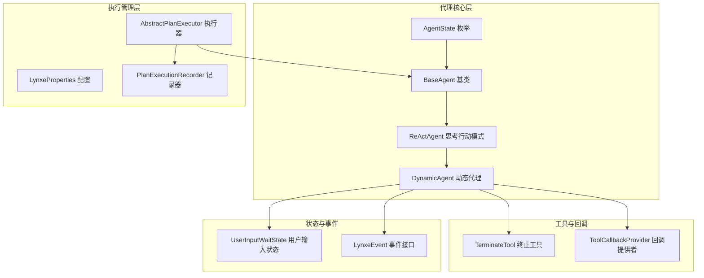
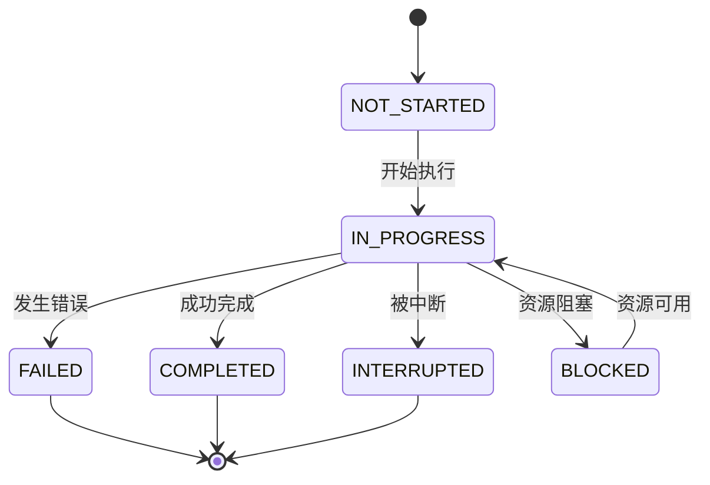
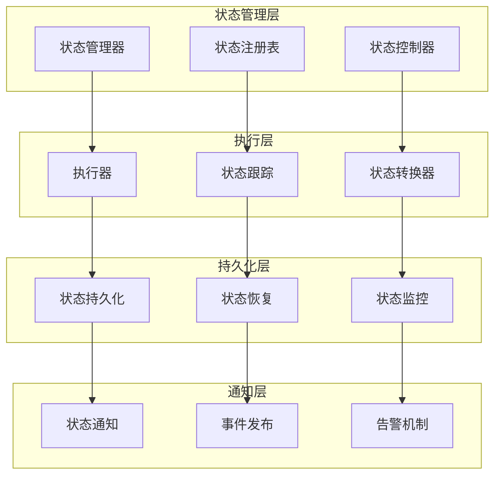
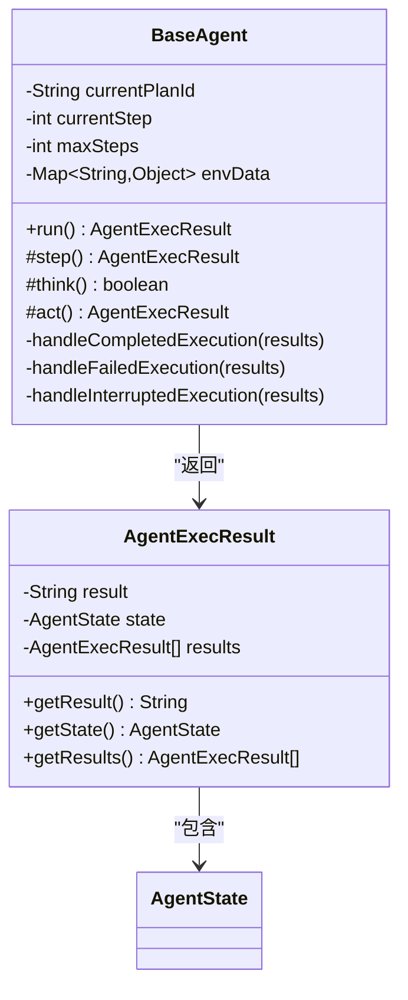
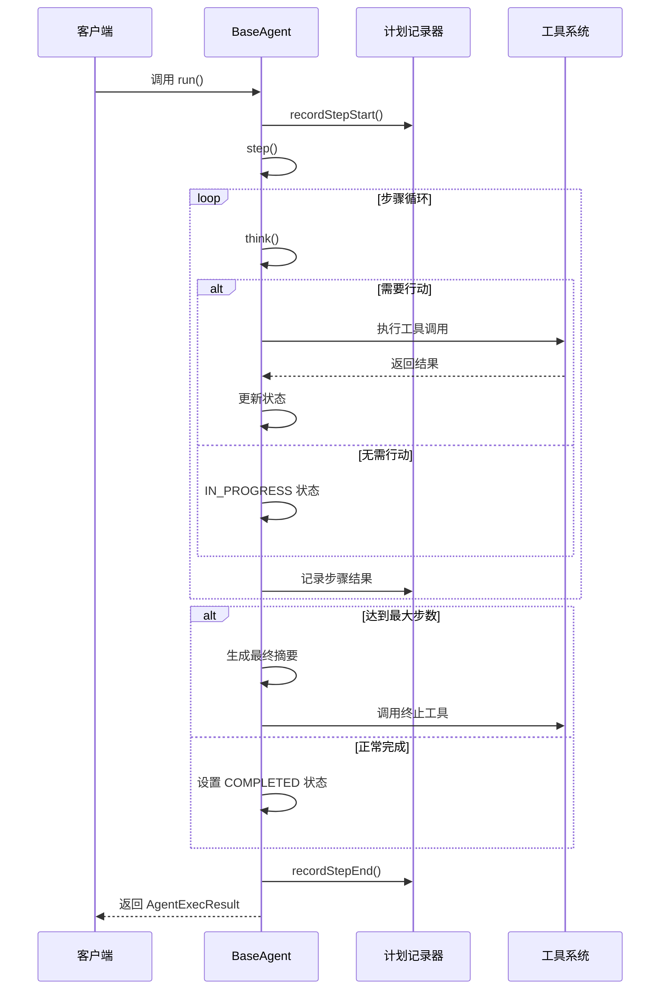
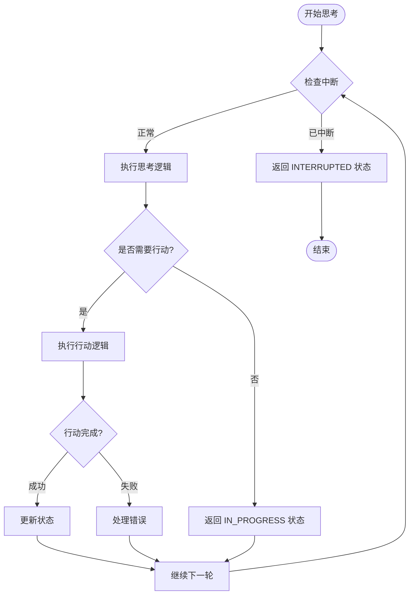
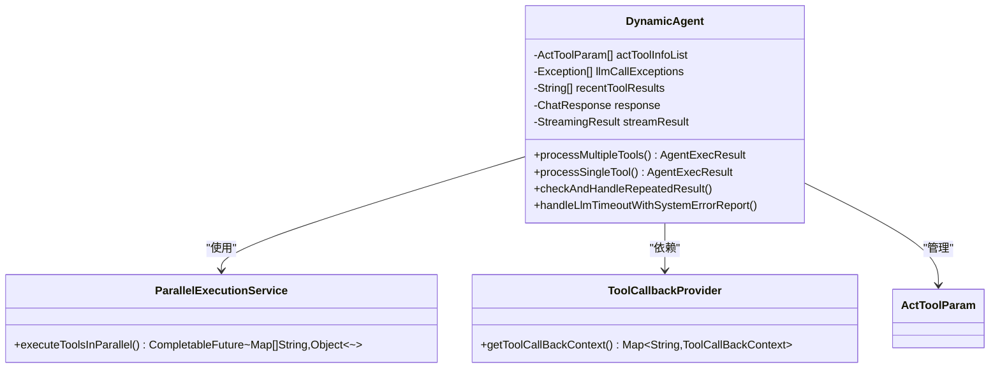
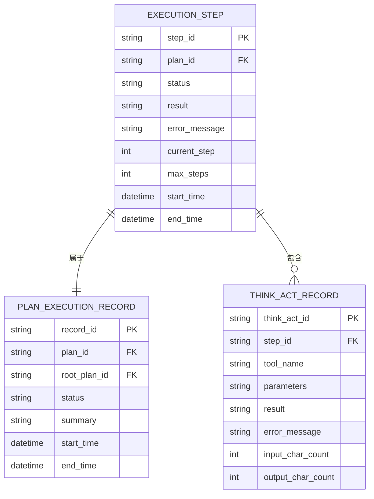
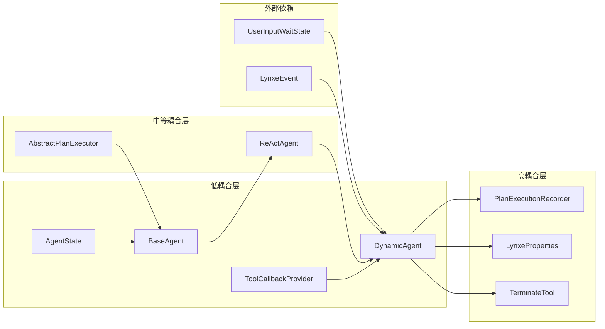

# 代理状态管理

<cite>
**本文档引用的文件**
- [AgentState.java](file://src/main/java/com/alibaba/cloud/ai/lynxe/agent/AgentState.java)
- [BaseAgent.java](file://src/main/java/com/alibaba/cloud/ai/lynxe/agent/BaseAgent.java)
- [ReActAgent.java](file://src/main/java/com/alibaba/cloud/ai/lynxe/agent/ReActAgent.java)
- [DynamicAgent.java](file://src/main/java/com/alibaba/cloud/ai/lynxe/agent/DynamicAgent.java)
- [AbstractPlanExecutor.java](file://src/main/java/com/alibaba/cloud/ai/lynxe/runtime/executor/AbstractPlanExecutor.java)
- [LynxeProperties.java](file://src/main/java/com/alibaba/cloud/ai/lynxe/config/LynxeProperties.java)
- [PlanExecutionRecorder.java](file://src/main/java/com/alibaba/cloud/ai/lynxe/recorder/service/PlanExecutionRecorder.java)
- [TerminateTool.java](file://src/main/java/com/alibaba/cloud/ai/lynxe/tool/TerminateTool.java)
- [ToolCallbackProvider.java](file://src/main/java/com/alibaba/cloud/ai/lynxe/agent/ToolCallbackProvider.java)
- [UserInputWaitState.java](file://src/main/java/com/alibaba/cloud/ai/lynxe/runtime/entity/vo/UserInputWaitState.java)
- [LynxeEvent.java](file://src/main/java/com/alibaba/cloud/ai/lynxe/event/LynxeEvent.java)
</cite>

## 目录
1. [引言](#引言)
2. [项目结构](#项目结构)
3. [核心组件](#核心组件)
4. [架构概览](#架构概览)
5. [详细组件分析](#详细组件分析)
6. [依赖关系分析](#依赖关系分析)
7. [性能考虑](#性能考虑)
8. [故障排除指南](#故障排除指南)
9. [结论](#结论)
10. [附录](#附录)

## 引言

Lynxe代理状态管理系统是整个AI代理执行框架的核心基础设施，负责管理代理在执行过程中的各种状态转换、生命周期管理和状态持久化。该系统采用枚举驱动的状态管理模式，通过严格的有限状态机设计确保代理执行的可控性和可预测性。

本文档深入解析了AgentState枚举的设计理念、状态转换机制以及在代理生命周期中的具体应用，涵盖了从状态定义、转换规则到持久化恢复的完整技术栈。

## 项目结构

Lynxe代理状态管理相关的代码主要分布在以下模块中：

**图表来源**
- [AgentState.java:18-34](file://src/main/java/com/alibaba/cloud/ai/lynxe/agent/AgentState.java#L18-L34)
- [BaseAgent.java:70-589](file://src/main/java/com/alibaba/cloud/ai/lynxe/agent/BaseAgent.java#L70-L589)
- [DynamicAgent.java:83-1769](file://src/main/java/com/alibaba/cloud/ai/lynxe/agent/DynamicAgent.java#L83-L1769)

**章节来源**
- [AgentState.java:1-35](file://src/main/java/com/alibaba/cloud/ai/lynxe/agent/AgentState.java#L1-L35)
- [BaseAgent.java:1-589](file://src/main/java/com/alibaba/cloud/ai/lynxe/agent/BaseAgent.java#L1-L589)

## 核心组件

### AgentState枚举设计

AgentState枚举定义了代理执行的完整状态集合，采用简洁而明确的设计原则：

| 状态 | 描述 | 触发条件 |
|------|------|----------|
| NOT_STARTED | 未开始状态 | 代理实例创建但尚未执行 |
| IN_PROGRESS | 执行中状态 | 代理正在进行思考或行动 |
| COMPLETED | 完成状态 | 代理成功完成所有任务或调用终止工具 |
| BLOCKED | 阻塞状态 | 代理因外部依赖或资源限制而暂停 |
| FAILED | 失败状态 | 代理执行过程中发生不可恢复错误 |
| INTERRUPTED | 中断状态 | 代理被外部请求中断执行 |

### 状态转换规则

**图表来源**
- [AgentState.java:20-21](file://src/main/java/com/alibaba/cloud/ai/lynxe/agent/AgentState.java#L20-L21)
- [BaseAgent.java:281-357](file://src/main/java/com/alibaba/cloud/ai/lynxe/agent/BaseAgent.java#L281-L357)

**章节来源**
- [AgentState.java:18-34](file://src/main/java/com/alibaba/cloud/ai/lynxe/agent/AgentState.java#L18-L34)
- [BaseAgent.java:281-357](file://src/main/java/com/alibaba/cloud/ai/lynxe/agent/BaseAgent.java#L281-L357)

## 架构概览

Lynxe代理状态管理采用分层架构设计，确保状态管理的独立性和可扩展性：

**图表来源**
- [BaseAgent.java:281-357](file://src/main/java/com/alibaba/cloud/ai/lynxe/agent/BaseAgent.java#L281-L357)
- [AbstractPlanExecutor.java:103-183](file://src/main/java/com/alibaba/cloud/ai/lynxe/runtime/executor/AbstractPlanExecutor.java#L103-L183)

## 详细组件分析

### BaseAgent基础代理类

BaseAgent作为所有代理的基础抽象类，提供了完整的状态管理框架：

#### 核心状态管理机制

**图表来源**
- [BaseAgent.java:70-589](file://src/main/java/com/alibaba/cloud/ai/lynxe/agent/BaseAgent.java#L70-L589)

#### 代理执行生命周期

代理的执行生命周期严格遵循状态转换规则：

**图表来源**
- [BaseAgent.java:281-357](file://src/main/java/com/alibaba/cloud/ai/lynxe/agent/BaseAgent.java#L281-L357)
- [AbstractPlanExecutor.java:103-183](file://src/main/java/com/alibaba/cloud/ai/lynxe/runtime/executor/AbstractPlanExecutor.java#L103-L183)

**章节来源**
- [BaseAgent.java:281-357](file://src/main/java/com/alibaba/cloud/ai/lynxe/agent/BaseAgent.java#L281-L357)

### ReActAgent思考行动模式

ReActAgent实现了经典的思考-行动交替模式，是动态代理的核心执行引擎：

#### 思考-行动循环机制

**图表来源**
- [ReActAgent.java:78-96](file://src/main/java/com/alibaba/cloud/ai/lynxe/agent/ReActAgent.java#L78-L96)

#### 错误处理与异常管理

ReActAgent通过TaskInterruptedException实现优雅的中断处理：

**章节来源**
- [ReActAgent.java:78-96](file://src/main/java/com/alibaba/cloud/ai/lynxe/agent/ReActAgent.java#L78-L96)

### DynamicAgent动态代理实现

DynamicAgent是Lynxe的核心执行引擎，实现了复杂的多工具并行执行和状态管理：

#### 多工具并行执行状态管理

**图表来源**
- [DynamicAgent.java:83-1769](file://src/main/java/com/alibaba/cloud/ai/lynxe/agent/DynamicAgent.java#L83-L1769)

#### 重试机制与状态一致性

DynamicAgent实现了智能的重试机制，确保在LLM调用失败时的状态一致性：

**章节来源**
- [DynamicAgent.java:235-495](file://src/main/java/com/alibaba/cloud/ai/lynxe/agent/DynamicAgent.java#L235-L495)

### 状态持久化与恢复机制

#### 执行记录与状态存储

**图表来源**
- [PlanExecutionRecorder.java:26-242](file://src/main/java/com/alibaba/cloud/ai/lynxe/recorder/service/PlanExecutionRecorder.java#L26-L242)

#### 状态恢复与异常处理

**章节来源**
- [PlanExecutionRecorder.java:26-242](file://src/main/java/com/alibaba/cloud/ai/lynxe/recorder/service/PlanExecutionRecorder.java#L26-L242)

## 依赖关系分析

### 组件耦合度分析

**图表来源**
- [BaseAgent.java:269-279](file://src/main/java/com/alibaba/cloud/ai/lynxe/agent/BaseAgent.java#L269-L279)
- [DynamicAgent.java:170-201](file://src/main/java/com/alibaba/cloud/ai/lynxe/agent/DynamicAgent.java#L170-L201)

### 状态管理集成点

状态管理在系统中的关键集成点包括：

1. **执行器集成**: AbstractPlanExecutor直接使用AgentState进行状态设置
2. **记录器集成**: PlanExecutionRecorder持久化状态信息
3. **工具集成**: TerminateTool通过返回特定状态实现优雅退出
4. **配置集成**: LynxeProperties影响状态转换的阈值和行为

**章节来源**
- [AbstractPlanExecutor.java:103-183](file://src/main/java/com/alibaba/cloud/ai/lynxe/runtime/executor/AbstractPlanExecutor.java#L103-L183)
- [LynxeProperties.java:154-169](file://src/main/java/com/alibaba/cloud/ai/lynxe/config/LynxeProperties.java#L154-L169)

## 性能考虑

### 状态转换性能优化

1. **状态缓存**: AgentState使用枚举类型，避免字符串比较开销
2. **延迟初始化**: 环境数据和工具回调按需初始化
3. **内存管理**: 使用不可变Map减少内存占用

### 并发安全考虑

- 状态字段使用原子操作确保线程安全
- 工具执行采用异步模式避免阻塞
- 内存压缩机制防止状态膨胀

## 故障排除指南

### 常见状态异常问题

#### 状态不一致问题

**症状**: 代理状态与实际执行情况不符
**解决方案**: 
1. 检查状态转换逻辑的完整性
2. 验证异常处理分支的状态设置
3. 确认状态持久化的事务一致性

#### 中断处理问题

**症状**: 代理无法正确响应中断请求
**解决方案**:
1. 检查TaskInterruptionCheckerService的实现
2. 验证AgentInterruptionHelper的配置
3. 确认中断信号的传递路径

#### 状态持久化失败

**症状**: 执行历史丢失或状态恢复异常
**解决方案**:
1. 检查PlanExecutionRecorder的实现
2. 验证数据库连接和事务配置
3. 确认状态序列化/反序列化逻辑

**章节来源**
- [BaseAgent.java:400-449](file://src/main/java/com/alibaba/cloud/ai/lynxe/agent/BaseAgent.java#L400-L449)
- [DynamicAgent.java:1282-1333](file://src/main/java/com/alibaba/cloud/ai/lynxe/agent/DynamicAgent.java#L1282-L1333)

## 结论

Lynxe代理状态管理系统通过精心设计的枚举驱动状态模型、严格的有限状态机约束和完善的异常处理机制，为AI代理的可靠执行提供了坚实基础。系统的关键优势包括：

1. **清晰的状态定义**: 明确的六种状态覆盖了代理执行的所有场景
2. **严格的转换规则**: 防止非法状态转换，确保系统稳定性
3. **完善的持久化机制**: 支持状态恢复和审计追踪
4. **灵活的扩展性**: 通过接口设计支持新的状态类型和转换规则

该系统为构建复杂AI代理应用提供了可靠的基础设施，其设计理念和实现模式值得在类似项目中借鉴。

## 附录

### 最佳实践指南

1. **状态设计原则**
   - 确保状态数量适中，避免过度细分
   - 明确每种状态的进入和退出条件
   - 考虑状态之间的转换成本

2. **状态管理最佳实践**
   - 在每个状态转换点添加日志记录
   - 实现状态超时检测机制
   - 提供状态查询和监控接口

3. **扩展指南**
   - 新增状态类型时，确保向后兼容性
   - 扩展状态转换时，验证所有分支的正确性
   - 添加状态持久化时，考虑性能影响

### 状态调试工具

1. **状态监控面板**: 实时显示代理状态和转换历史
2. **状态追踪器**: 记录状态变化的时间戳和原因
3. **异常分析器**: 分析状态异常的根本原因
4. **性能分析器**: 监控状态转换的性能指标