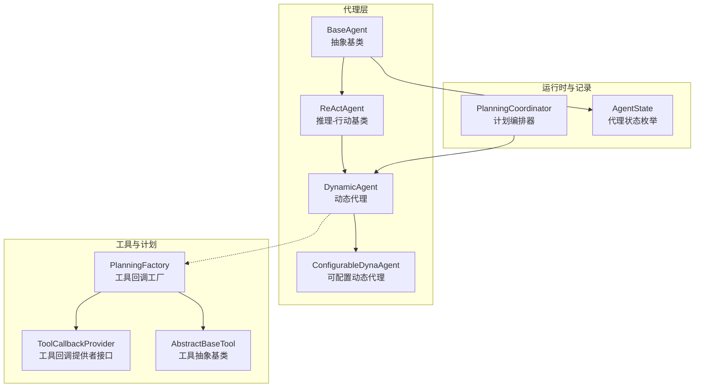
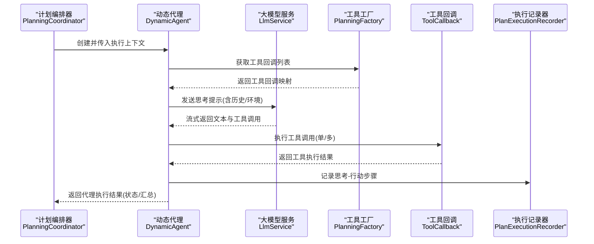
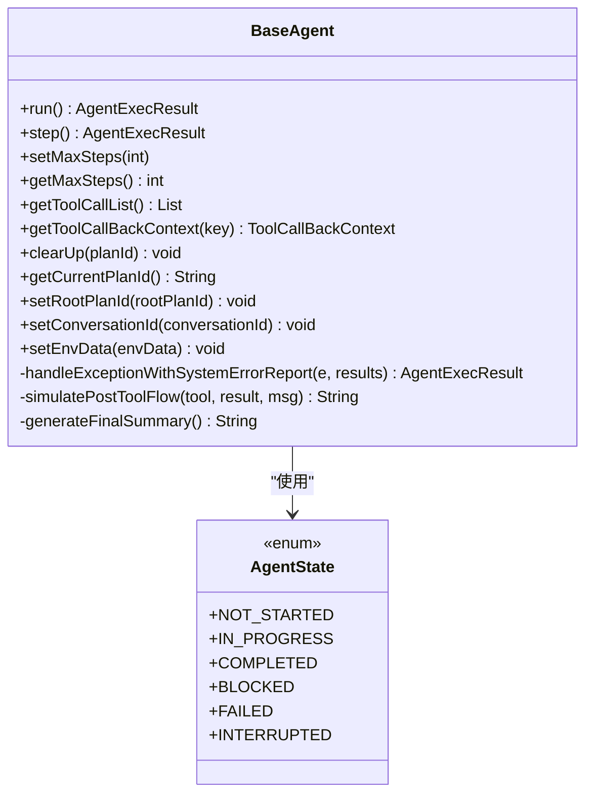
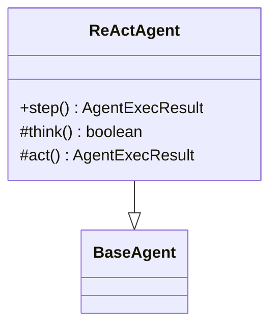
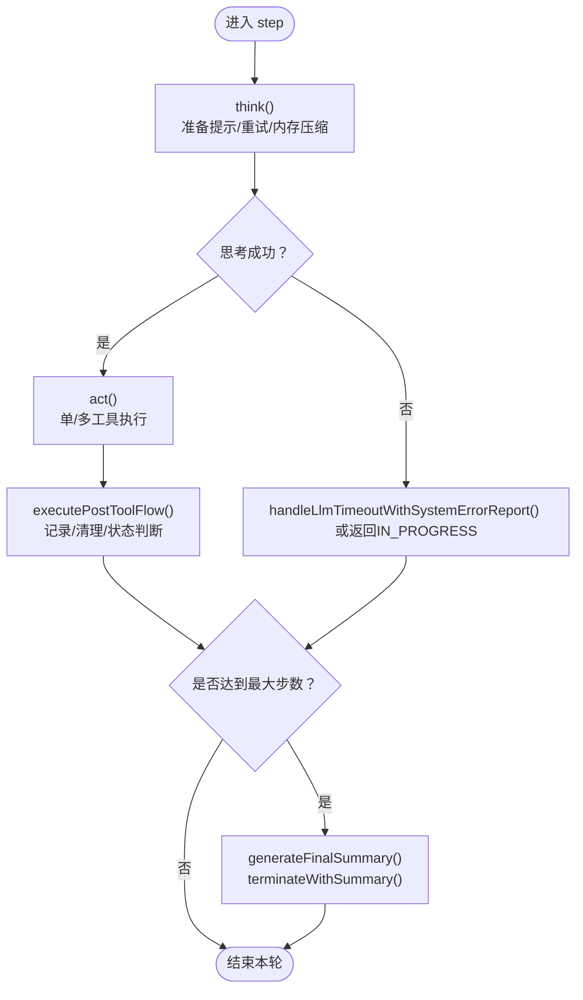
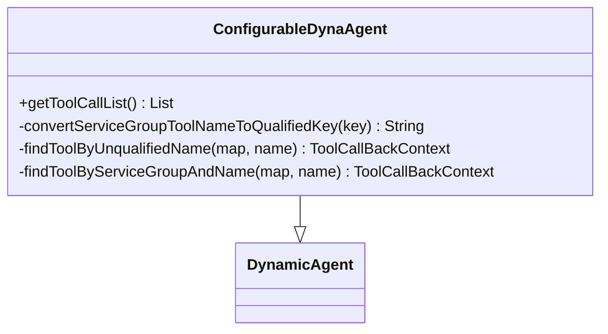
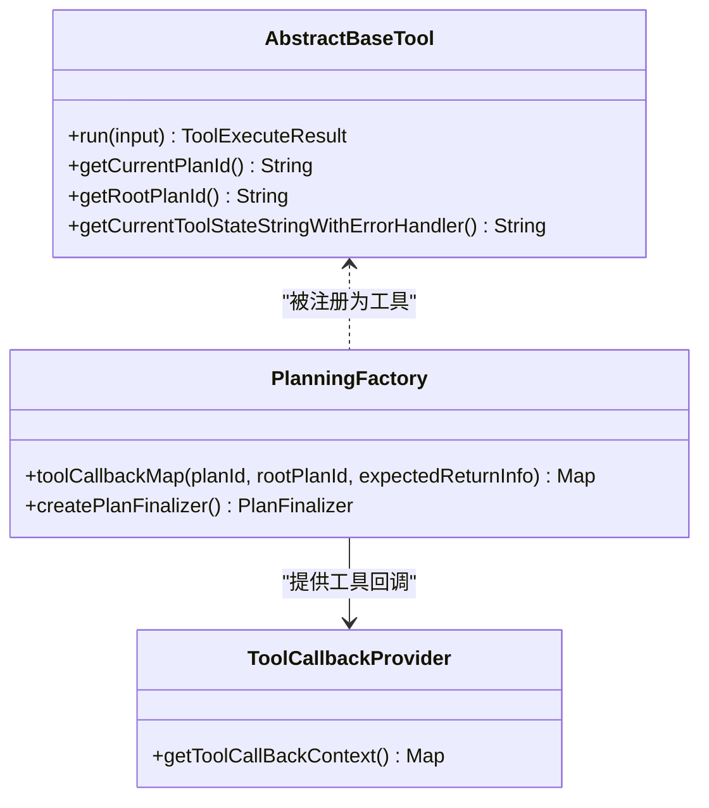
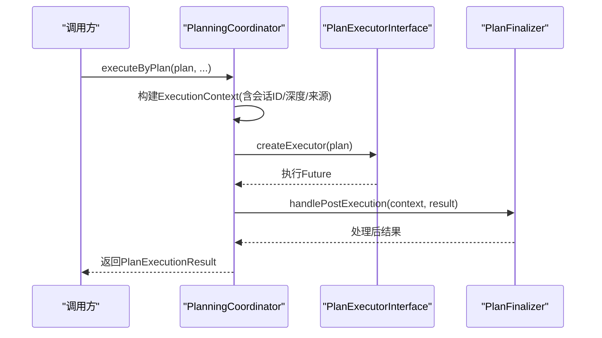
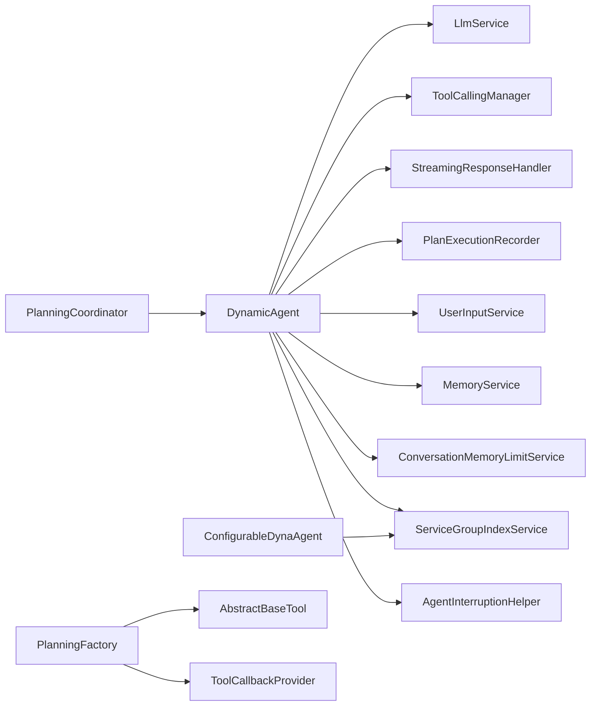

# 代理系统

<cite>
**本文引用的文件**
- [BaseAgent.java](file://src/main/java/com/alibaba/cloud/ai/lynxe/agent/BaseAgent.java)
- [ReActAgent.java](file://src/main/java/com/alibaba/cloud/ai/lynxe/agent/ReActAgent.java)
- [DynamicAgent.java](file://src/main/java/com/alibaba/cloud/ai/lynxe/agent/DynamicAgent.java)
- [ConfigurableDynaAgent.java](file://src/main/java/com/alibaba/cloud/ai/lynxe/agent/ConfigurableDynaAgent.java)
- [AgentState.java](file://src/main/java/com/alibaba/cloud/ai/lynxe/agent/AgentState.java)
- [ToolCallbackProvider.java](file://src/main/java/com/alibaba/cloud/ai/lynxe/agent/ToolCallbackProvider.java)
- [DynamicAgentEntity.java](file://src/main/java/com/alibaba/cloud/ai/lynxe/agent/entity/DynamicAgentEntity.java)
- [DynamicAgentDefinition.java](file://src/main/java/com/alibaba/cloud/ai/lynxe/agent/annotation/DynamicAgentDefinition.java)
- [PlanningFactory.java](file://src/main/java/com/alibaba/cloud/ai/lynxe/planning/PlanningFactory.java)
- [PlanningCoordinator.java](file://src/main/java/com/alibaba/cloud/ai/lynxe/runtime/service/PlanningCoordinator.java)
- [AbstractBaseTool.java](file://src/main/java/com/alibaba/cloud/ai/lynxe/tool/AbstractBaseTool.java)
</cite>

## 目录
1. [简介](#简介)
2. [项目结构](#项目结构)
3. [核心组件](#核心组件)
4. [架构总览](#架构总览)
5. [详细组件分析](#详细组件分析)
6. [依赖关系分析](#依赖关系分析)
7. [性能考量](#性能考量)
8. [故障排查指南](#故障排查指南)
9. [结论](#结论)
10. [附录](#附录)

## 简介
本文件面向Lynxe代理系统，聚焦于代理体系的架构设计与实现模式，涵盖以下主题：
- 基座设计：BaseAgent抽象层定义统一的状态机、生命周期与执行框架
- 推理-行动模式：ReActAgent定义“思考-行动”的交替执行范式
- 动态代理：DynamicAgent在ReAct基础上引入大模型流式响应、工具回调、重试与中断控制
- 可配置动态代理：ConfigurableDynaAgent支持运行时按需注入工具集合
- 工具系统交互：通过PlanningFactory构建工具回调映射，实现LLM与工具的解耦协作
- 执行流程与状态同步：从计划编排到步骤记录，贯穿消息传递与状态流转
- 配置与调优：最大步数、并发工具调用、对话记忆压缩等
- 最佳实践与扩展：如何基于接口扩展新代理、工具与计划执行器

## 项目结构
代理系统位于agent包下，围绕抽象基类、具体实现、工具注册与计划编排展开，并与运行时服务、记录器、配置属性协同工作。

图示来源
- [BaseAgent.java:70-589](file://src/main/java/com/alibaba/cloud/ai/lynxe/agent/BaseAgent.java#L70-L589)
- [ReActAgent.java:30-97](file://src/main/java/com/alibaba/cloud/ai/lynxe/agent/ReActAgent.java#L30-L97)
- [DynamicAgent.java:83-800](file://src/main/java/com/alibaba/cloud/ai/lynxe/agent/DynamicAgent.java#L83-L800)
- [ConfigurableDynaAgent.java:51-340](file://src/main/java/com/alibaba/cloud/ai/lynxe/agent/ConfigurableDynaAgent.java#L51-L340)
- [PlanningFactory.java:113-427](file://src/main/java/com/alibaba/cloud/ai/lynxe/planning/PlanningFactory.java#L113-L427)
- [ToolCallbackProvider.java:22-26](file://src/main/java/com/alibaba/cloud/ai/lynxe/agent/ToolCallbackProvider.java#L22-L26)
- [AbstractBaseTool.java:30-193](file://src/main/java/com/alibaba/cloud/ai/lynxe/tool/AbstractBaseTool.java#L30-L193)
- [PlanningCoordinator.java:40-182](file://src/main/java/com/alibaba/cloud/ai/lynxe/runtime/service/PlanningCoordinator.java#L40-L182)
- [AgentState.java:18-35](file://src/main/java/com/alibaba/cloud/ai/lynxe/agent/AgentState.java#L18-L35)

章节来源
- [BaseAgent.java:70-589](file://src/main/java/com/alibaba/cloud/ai/lynxe/agent/BaseAgent.java#L70-L589)
- [ReActAgent.java:30-97](file://src/main/java/com/alibaba/cloud/ai/lynxe/agent/ReActAgent.java#L30-L97)
- [DynamicAgent.java:83-800](file://src/main/java/com/alibaba/cloud/ai/lynxe/agent/DynamicAgent.java#L83-L800)
- [ConfigurableDynaAgent.java:51-340](file://src/main/java/com/alibaba/cloud/ai/lynxe/agent/ConfigurableDynaAgent.java#L51-L340)
- [PlanningFactory.java:113-427](file://src/main/java/com/alibaba/cloud/ai/lynxe/planning/PlanningFactory.java#L113-L427)
- [ToolCallbackProvider.java:22-26](file://src/main/java/com/alibaba/cloud/ai/lynxe/agent/ToolCallbackProvider.java#L22-L26)
- [AbstractBaseTool.java:30-193](file://src/main/java/com/alibaba/cloud/ai/lynxe/tool/AbstractBaseTool.java#L30-L193)
- [PlanningCoordinator.java:40-182](file://src/main/java/com/alibaba/cloud/ai/lynxe/runtime/service/PlanningCoordinator.java#L40-L182)
- [AgentState.java:18-35](file://src/main/java/com/alibaba/cloud/ai/lynxe/agent/AgentState.java#L18-L35)

## 核心组件
- BaseAgent：定义代理的统一生命周期（初始化、循环执行、终止）、状态机（未开始、进行中、完成、阻塞、失败、中断）、异常处理与最终总结生成；提供工具回调列表与上下文、环境数据、计划深度与会话ID管理。
- ReActAgent：在BaseAgent之上定义“思考-行动”交替范式，要求子类实现think与act两个阶段。
- DynamicAgent：在ReActAgent基础上引入流式响应、工具调用重试、早期终止检测、内存压缩、表单输入工具清理、并行工具执行支持与错误报告工具处理。
- ConfigurableDynaAgent：在DynamicAgent基础上允许运行时注入可用工具集，自动补齐终止工具，兼容服务组前缀工具键。
- PlanningFactory：集中注册与装配工具回调，构建工具元数据与FunctionToolCallback，支持MCP与子计划工具扩展。
- PlanningCoordinator：根据计划类型选择执行器，封装执行上下文（含会话ID、根计划ID、当前计划ID、请求来源等），异步执行并后处理结果。
- AgentState：统一代理状态枚举，用于控制流程与结果判定。
- ToolCallbackProvider：工具回调提供者接口，供代理查询可用工具回调上下文。
- AbstractBaseTool：所有工具的抽象基类，提供计划ID/根计划ID设置、工具状态字符串获取、URL规范化等通用能力。
- DynamicAgentEntity/DynamicAgentDefinition：持久化与注解形式的动态代理定义，便于模板化配置与复用。

章节来源
- [BaseAgent.java:70-589](file://src/main/java/com/alibaba/cloud/ai/lynxe/agent/BaseAgent.java#L70-L589)
- [ReActAgent.java:30-97](file://src/main/java/com/alibaba/cloud/ai/lynxe/agent/ReActAgent.java#L30-L97)
- [DynamicAgent.java:83-800](file://src/main/java/com/alibaba/cloud/ai/lynxe/agent/DynamicAgent.java#L83-L800)
- [ConfigurableDynaAgent.java:51-340](file://src/main/java/com/alibaba/cloud/ai/lynxe/agent/ConfigurableDynaAgent.java#L51-L340)
- [PlanningFactory.java:240-393](file://src/main/java/com/alibaba/cloud/ai/lynxe/planning/PlanningFactory.java#L240-L393)
- [PlanningCoordinator.java:76-182](file://src/main/java/com/alibaba/cloud/ai/lynxe/runtime/service/PlanningCoordinator.java#L76-L182)
- [AgentState.java:18-35](file://src/main/java/com/alibaba/cloud/ai/lynxe/agent/AgentState.java#L18-L35)
- [ToolCallbackProvider.java:22-26](file://src/main/java/com/alibaba/cloud/ai/lynxe/agent/ToolCallbackProvider.java#L22-L26)
- [AbstractBaseTool.java:30-193](file://src/main/java/com/alibaba/cloud/ai/lynxe/tool/AbstractBaseTool.java#L30-L193)
- [DynamicAgentEntity.java:24-133](file://src/main/java/com/alibaba/cloud/ai/lynxe/agent/entity/DynamicAgentEntity.java#L24-L133)
- [DynamicAgentDefinition.java:23-36](file://src/main/java/com/alibaba/cloud/ai/lynxe/agent/annotation/DynamicAgentDefinition.java#L23-36)

## 架构总览
代理系统采用“抽象基类 + 具体实现 + 工具回调 + 计划编排”的分层架构。ReAct模式将推理与行动解耦，DynamicAgent进一步将LLM流式响应、工具调用与错误恢复整合；PlanningFactory负责工具生态的统一注册与暴露；PlanningCoordinator负责计划级调度与上下文传递。

图示来源
- [PlanningCoordinator.java:76-182](file://src/main/java/com/alibaba/cloud/ai/lynxe/runtime/service/PlanningCoordinator.java#L76-L182)
- [DynamicAgent.java:203-563](file://src/main/java/com/alibaba/cloud/ai/lynxe/agent/DynamicAgent.java#L203-L563)
- [PlanningFactory.java:261-393](file://src/main/java/com/alibaba/cloud/ai/lynxe/planning/PlanningFactory.java#L261-L393)

## 详细组件分析

### BaseAgent 抽象基类
- 设计要点
  - 统一生命周期：run循环执行step，依据状态机决定终止或继续
  - 状态机：NOT_STARTED、IN_PROGRESS、COMPLETED、BLOCKED、FAILED、INTERRUPTED
  - 异常处理：通过SystemErrorReportTool包装异常，模拟工具后流程
  - 最终总结：达到最大步数时生成摘要并以TerminateTool收尾
  - 上下文与环境：initSettingData、envData、planId、conversationId、planDepth
- 关键方法
  - run：主执行循环，处理完成/中断/失败分支与最终记录
  - step：抽象方法，由子类实现具体逻辑
  - getToolCallList/getToolCallBackContext：工具回调与上下文访问
  - handleExceptionWithSystemErrorReport/simulatePostToolFlow：异常与后处理
  - generateFinalSummary/terminateWithSummary：超步数终止与摘要生成

图示来源
- [BaseAgent.java:70-589](file://src/main/java/com/alibaba/cloud/ai/lynxe/agent/BaseAgent.java#L70-L589)
- [AgentState.java:18-35](file://src/main/java/com/alibaba/cloud/ai/lynxe/agent/AgentState.java#L18-L35)

章节来源
- [BaseAgent.java:70-589](file://src/main/java/com/alibaba/cloud/ai/lynxe/agent/BaseAgent.java#L70-L589)
- [AgentState.java:18-35](file://src/main/java/com/alibaba/cloud/ai/lynxe/agent/AgentState.java#L18-L35)

### ReActAgent 推理-行动代理
- 设计要点
  - 将“思考”与“行动”解耦：think决定是否需要行动，act执行具体动作
  - 中断感知：捕获任务中断异常并返回INTERRUPTED状态
- 关键方法
  - step：协调think与act，返回IN_PROGRESS或具体结果
  - think/act：抽象方法，由子类实现

图示来源
- [ReActAgent.java:30-97](file://src/main/java/com/alibaba/cloud/ai/lynxe/agent/ReActAgent.java#L30-L97)
- [BaseAgent.java:70-589](file://src/main/java/com/alibaba/cloud/ai/lynxe/agent/BaseAgent.java#L70-L589)

章节来源
- [ReActAgent.java:30-97](file://src/main/java/com/alibaba/cloud/ai/lynxe/agent/ReActAgent.java#L30-L97)
- [BaseAgent.java:70-589](file://src/main/java/com/alibaba/cloud/ai/lynxe/agent/BaseAgent.java#L70-L589)

### DynamicAgent 动态代理
- 设计要点
  - 在ReAct基础上引入流式响应与工具调用重试，增强鲁棒性
  - 早期终止检测：若多次仅返回文本而无工具调用，触发失败或警告
  - 内存压缩与字符统计：在构建提示前检查并压缩对话记忆
  - 表单输入工具清理：异常或成功后清理挂起的表单输入
  - 并行工具执行：支持多工具并行，TerminateTool具备完成后置语义
  - 错误报告工具：捕获并记录系统错误，更新步骤错误信息
- 关键流程
  - think：准备系统提示与环境消息，构建Prompt，流式获取响应，提取工具调用
  - act：单工具/多工具执行，处理FormInputTool/TerminableTool/TerminateTool/SystemErrorReportTool
  - step：think失败时回退至异常处理或提示重新调用工具

图示来源
- [DynamicAgent.java:203-563](file://src/main/java/com/alibaba/cloud/ai/lynxe/agent/DynamicAgent.java#L203-L563)
- [BaseAgent.java:281-357](file://src/main/java/com/alibaba/cloud/ai/lynxe/agent/BaseAgent.java#L281-L357)

章节来源
- [DynamicAgent.java:83-800](file://src/main/java/com/alibaba/cloud/ai/lynxe/agent/DynamicAgent.java#L83-L800)
- [BaseAgent.java:281-357](file://src/main/java/com/alibaba/cloud/ai/lynxe/agent/BaseAgent.java#L281-L357)

### ConfigurableDynaAgent 可配置动态代理
- 设计要点
  - 当构造时availableToolKeys为空/null时，自动收集全部可用工具
  - 自动补齐TerminableTool或TerminateTool，确保代理可终止
  - 支持服务组前缀工具键转换与向后兼容查找
- 关键方法
  - getToolCallList：构建工具回调列表，保证Terminable语义存在

图示来源
- [ConfigurableDynaAgent.java:51-340](file://src/main/java/com/alibaba/cloud/ai/lynxe/agent/ConfigurableDynaAgent.java#L51-L340)
- [DynamicAgent.java:83-800](file://src/main/java/com/alibaba/cloud/ai/lynxe/agent/DynamicAgent.java#L83-L800)

章节来源
- [ConfigurableDynaAgent.java:51-340](file://src/main/java/com/alibaba/cloud/ai/lynxe/agent/ConfigurableDynaAgent.java#L51-L340)
- [DynamicAgent.java:83-800](file://src/main/java/com/alibaba/cloud/ai/lynxe/agent/DynamicAgent.java#L83-L800)

### 工具系统与回调
- PlanningFactory
  - 注册内置工具与MCP/子计划工具，构建FunctionToolCallback与ToolCallBackContext
  - 使用服务组前缀拼接工具键，支持统一命名空间下的工具发现
- ToolCallbackProvider
  - 代理通过该接口获取工具回调上下文，实现与工具实现的解耦
- AbstractBaseTool
  - 提供计划ID/根计划ID设置、工具状态字符串获取、URL规范化等通用能力

图示来源
- [PlanningFactory.java:240-393](file://src/main/java/com/alibaba/cloud/ai/lynxe/planning/PlanningFactory.java#L240-L393)
- [ToolCallbackProvider.java:22-26](file://src/main/java/com/alibaba/cloud/ai/lynxe/agent/ToolCallbackProvider.java#L22-L26)
- [AbstractBaseTool.java:30-193](file://src/main/java/com/alibaba/cloud/ai/lynxe/tool/AbstractBaseTool.java#L30-L193)

章节来源
- [PlanningFactory.java:240-393](file://src/main/java/com/alibaba/cloud/ai/lynxe/planning/PlanningFactory.java#L240-L393)
- [ToolCallbackProvider.java:22-26](file://src/main/java/com/alibaba/cloud/ai/lynxe/agent/ToolCallbackProvider.java#L22-L26)
- [AbstractBaseTool.java:30-193](file://src/main/java/com/alibaba/cloud/ai/lynxe/tool/AbstractBaseTool.java#L30-L193)

### 计划编排与执行上下文
- PlanningCoordinator
  - 负责根据计划类型选择执行器，封装执行上下文（标题、根计划ID、父计划ID、当前计划ID、工具调用ID、请求来源、上传Key、计划深度、会话ID）
  - 异步执行并后处理，统一错误封装与摘要生成策略

图示来源
- [PlanningCoordinator.java:76-182](file://src/main/java/com/alibaba/cloud/ai/lynxe/runtime/service/PlanningCoordinator.java#L76-L182)

章节来源
- [PlanningCoordinator.java:76-182](file://src/main/java/com/alibaba/cloud/ai/lynxe/runtime/service/PlanningCoordinator.java#L76-L182)

## 依赖关系分析
- 组件耦合
  - DynamicAgent依赖LlmService、ToolCallingManager、StreamingResponseHandler、PlanExecutionRecorder、UserInputService、MemoryService、ConversationMemoryLimitService、ServiceGroupIndexService、AgentInterruptionHelper
  - ConfigurableDynaAgent在DynamicAgent基础上增加ServiceGroupIndexService用于工具键转换
  - PlanningFactory集中管理工具注册与回调映射，向代理提供ToolCallBackContext
  - PlanningCoordinator负责计划级调度与上下文传递
- 潜在循环依赖
  - 代理与工具通过回调接口解耦，避免直接循环依赖
  - PlanningFactory与工具实现通过FunctionToolCallback间接绑定，降低耦合
- 外部依赖
  - Spring AI工具调用框架（ToolCallingManager、ToolCallback）
  - Reactor流式响应（StreamingResponseHandler）

图示来源
- [DynamicAgent.java:170-201](file://src/main/java/com/alibaba/cloud/ai/lynxe/agent/DynamicAgent.java#L170-L201)
- [ConfigurableDynaAgent.java:75-89](file://src/main/java/com/alibaba/cloud/ai/lynxe/agent/ConfigurableDynaAgent.java#L75-L89)
- [PlanningFactory.java:261-393](file://src/main/java/com/alibaba/cloud/ai/lynxe/planning/PlanningFactory.java#L261-L393)
- [PlanningCoordinator.java:156-157](file://src/main/java/com/alibaba/cloud/ai/lynxe/runtime/service/PlanningCoordinator.java#L156-L157)

章节来源
- [DynamicAgent.java:170-201](file://src/main/java/com/alibaba/cloud/ai/lynxe/agent/DynamicAgent.java#L170-L201)
- [ConfigurableDynaAgent.java:75-89](file://src/main/java/com/alibaba/cloud/ai/lynxe/agent/ConfigurableDynaAgent.java#L75-L89)
- [PlanningFactory.java:261-393](file://src/main/java/com/alibaba/cloud/ai/lynxe/planning/PlanningFactory.java#L261-L393)
- [PlanningCoordinator.java:156-157](file://src/main/java/com/alibaba/cloud/ai/lynxe/runtime/service/PlanningCoordinator.java#L156-L157)

## 性能考量
- 步数限制与超时处理
  - 通过setMaxSteps控制最大执行轮次，防止无限循环
  - DynamicAgent在think阶段引入重试与指数退避，提升稳定性
- 流式响应与内存管理
  - 使用StreamingResponseHandler合并流式内容，减少中间状态开销
  - ConversationMemoryLimitService计算消息字符数，必要时压缩历史以控制输入长度
- 并行工具执行
  - 支持多工具并行，但需注意资源竞争与顺序依赖（TerminateTool具有完成后置语义）
- 早期终止检测
  - 对多次仅文本响应的情况进行阈值控制，避免无效轮询

章节来源
- [BaseAgent.java:109-125](file://src/main/java/com/alibaba/cloud/ai/lynxe/agent/BaseAgent.java#L109-L125)
- [DynamicAgent.java:235-495](file://src/main/java/com/alibaba/cloud/ai/lynxe/agent/DynamicAgent.java#L235-L495)
- [DynamicAgent.java:287-381](file://src/main/java/com/alibaba/cloud/ai/lynxe/agent/DynamicAgent.java#L287-L381)
- [DynamicAgent.java:787-800](file://src/main/java/com/alibaba/cloud/ai/lynxe/agent/DynamicAgent.java#L787-L800)

## 故障排查指南
- 代理状态异常
  - FAILED：通常由早期终止阈值触发或LLM调用失败导致
  - INTERRUPTED：用户中断或任务中断检查器触发
  - COMPLETED：正常完成，错误信息会被清理
- 错误处理路径
  - BaseAgent.handleExceptionWithSystemErrorReport：将异常包装为工具输出，写入步骤错误信息
  - DynamicAgent.act：捕获工具执行异常，清理表单输入工具并回退至IN_PROGRESS或错误状态
- 常见问题定位
  - 工具回调缺失：检查PlanningFactory工具注册与服务组前缀键匹配
  - 会话ID与记忆：确认PlanningCoordinator是否正确生成/传递会话ID
  - 重试与超时：关注DynamicAgent的重试次数与退避策略日志

章节来源
- [BaseAgent.java:365-449](file://src/main/java/com/alibaba/cloud/ai/lynxe/agent/BaseAgent.java#L365-L449)
- [DynamicAgent.java:617-658](file://src/main/java/com/alibaba/cloud/ai/lynxe/agent/DynamicAgent.java#L617-L658)
- [PlanningCoordinator.java:106-139](file://src/main/java/com/alibaba/cloud/ai/lynxe/runtime/service/PlanningCoordinator.java#L106-L139)

## 结论
Lynxe代理系统以BaseAgent为基座，ReActAgent定义推理-行动范式，DynamicAgent与ConfigurableDynaAgent在工具调用、流式响应、重试与中断控制方面形成完整闭环。通过PlanningFactory与PlanningCoordinator，系统实现了工具生态的统一注册与计划级调度，具备良好的扩展性与可维护性。建议在生产环境中合理设置最大步数、启用对话记忆压缩、谨慎使用并行工具，并完善工具回调与服务组键的命名规范。

## 附录
- 动态代理实体与注解
  - DynamicAgentEntity：持久化动态代理定义（名称、描述、下一步提示、可用工具键、类名、所属模型、命名空间、是否内置）
  - DynamicAgentDefinition：运行时注解形式的动态代理定义（agentName、agentDescription、nextStepPrompt、availableToolKeys）

章节来源
- [DynamicAgentEntity.java:24-133](file://src/main/java/com/alibaba/cloud/ai/lynxe/agent/entity/DynamicAgentEntity.java#L24-L133)
- [DynamicAgentDefinition.java:23-36](file://src/main/java/com/alibaba/cloud/ai/lynxe/agent/annotation/DynamicAgentDefinition.java#L23-36)