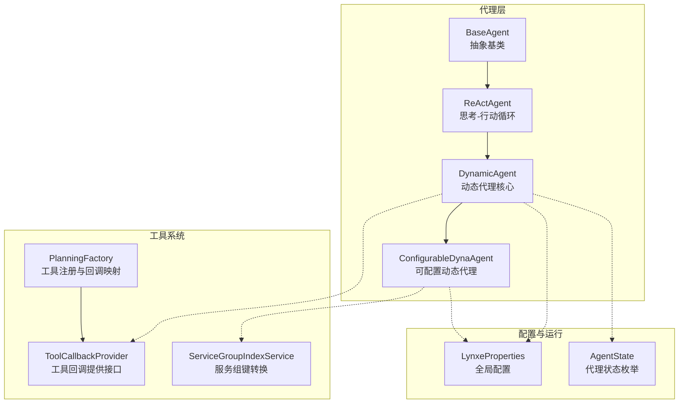
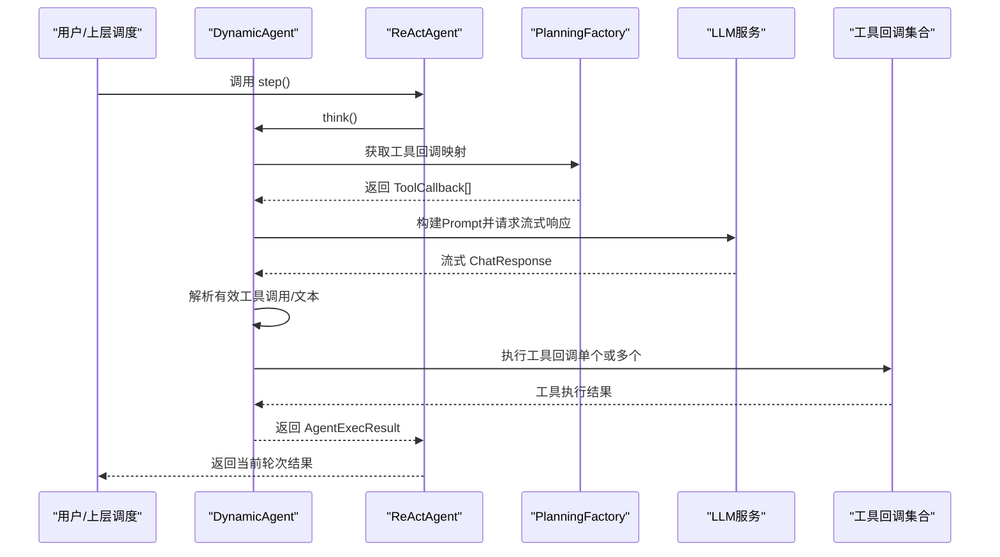
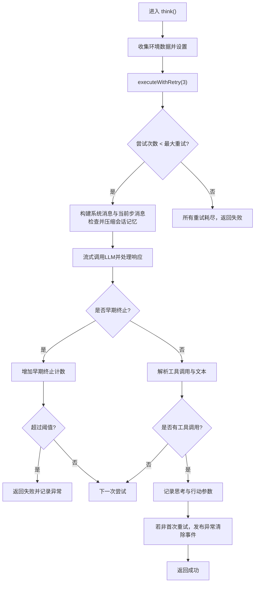
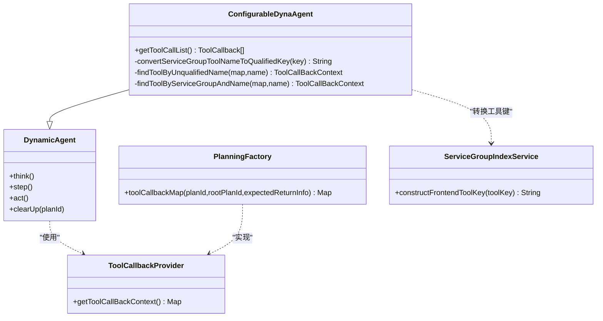
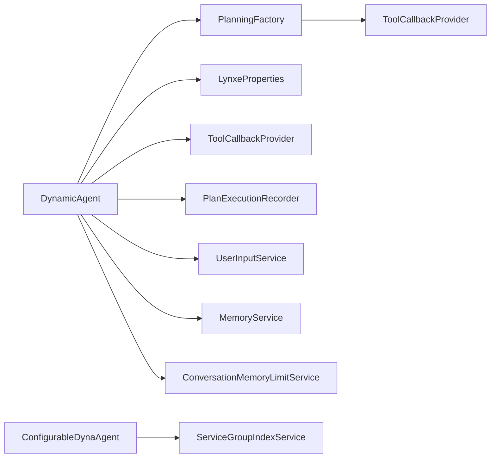

# 动态代理实现

<cite>
**本文引用的文件**
- [DynamicAgent.java](file://src/main/java/com/alibaba/cloud/ai/lynxe/agent/DynamicAgent.java)
- [ConfigurableDynaAgent.java](file://src/main/java/com/alibaba/cloud/ai/lynxe/agent/ConfigurableDynaAgent.java)
- [BaseAgent.java](file://src/main/java/com/alibaba/cloud/ai/lynxe/agent/BaseAgent.java)
- [ReActAgent.java](file://src/main/java/com/alibaba/cloud/ai/lynxe/agent/ReActAgent.java)
- [AgentState.java](file://src/main/java/com/alibaba/cloud/ai/lynxe/agent/AgentState.java)
- [ToolCallbackProvider.java](file://src/main/java/com/alibaba/cloud/ai/lynxe/agent/ToolCallbackProvider.java)
- [DynamicAgentDefinition.java](file://src/main/java/com/alibaba/cloud/ai/lynxe/agent/annotation/DynamicAgentDefinition.java)
- [PlanningFactory.java](file://src/main/java/com/alibaba/cloud/ai/lynxe/planning/PlanningFactory.java)
- [ServiceGroupIndexService.java](file://src/main/java/com/alibaba/cloud/ai/lynxe/runtime/service/ServiceGroupIndexService.java)
- [LynxeProperties.java](file://src/main/java/com/alibaba/cloud/ai/lynxe/config/LynxeProperties.java)
</cite>

## 目录
1. [简介](#简介)
2. [项目结构](#项目结构)
3. [核心组件](#核心组件)
4. [架构总览](#架构总览)
5. [详细组件分析](#详细组件分析)
6. [依赖分析](#依赖分析)
7. [性能考虑](#性能考虑)
8. [故障排除指南](#故障排除指南)
9. [结论](#结论)
10. [附录](#附录)

## 简介
本文件面向Lynxe平台的动态代理实现，系统性解析DynamicAgent与ConfigurableDynaAgent的设计原理、实现细节与运行机制。重点涵盖：
- 动态代理的工作流：思考（think）-行动（act）-记录与回放的循环
- 配置灵活性：通过注解与运行时参数动态注入工具集与提示词
- 工具系统交互：工具回调提供、工具选择与并发执行、表单输入与终止工具
- 运行时行为：重试机制、早期终止检测、内存压缩、中断与异常处理
- 性能优化：字符计数、流式响应、并行工具调用开关
- 使用示例、最佳实践与故障排除

## 项目结构
动态代理位于agent包中，围绕ReAct范式构建，并通过PlanningFactory注册工具回调，结合LynxeProperties进行全局配置。

图示来源
- [BaseAgent.java:70-96](file://src/main/java/com/alibaba/cloud/ai/lynxe/agent/BaseAgent.java#L70-L96)
- [ReActAgent.java:30-96](file://src/main/java/com/alibaba/cloud/ai/lynxe/agent/ReActAgent.java#L30-L96)
- [DynamicAgent.java:83-201](file://src/main/java/com/alibaba/cloud/ai/lynxe/agent/DynamicAgent.java#L83-L201)
- [ConfigurableDynaAgent.java:51-89](file://src/main/java/com/alibaba/cloud/ai/lynxe/agent/ConfigurableDynaAgent.java#L51-L89)
- [ToolCallbackProvider.java:22-26](file://src/main/java/com/alibaba/cloud/ai/lynxe/agent/ToolCallbackProvider.java#L22-L26)
- [PlanningFactory.java:240-393](file://src/main/java/com/alibaba/cloud/ai/lynxe/planning/PlanningFactory.java#L240-L393)
- [ServiceGroupIndexService.java:105-123](file://src/main/java/com/alibaba/cloud/ai/lynxe/runtime/service/ServiceGroupIndexService.java#L105-L123)
- [LynxeProperties.java:154-310](file://src/main/java/com/alibaba/cloud/ai/lynxe/config/LynxeProperties.java#L154-L310)
- [AgentState.java:18-34](file://src/main/java/com/alibaba/cloud/ai/lynxe/agent/AgentState.java#L18-L34)

章节来源
- [BaseAgent.java:70-96](file://src/main/java/com/alibaba/cloud/ai/lynxe/agent/BaseAgent.java#L70-L96)
- [ReActAgent.java:30-96](file://src/main/java/com/alibaba/cloud/ai/lynxe/agent/ReActAgent.java#L30-L96)
- [DynamicAgent.java:83-201](file://src/main/java/com/alibaba/cloud/ai/lynxe/agent/DynamicAgent.java#L83-L201)
- [ConfigurableDynaAgent.java:51-89](file://src/main/java/com/alibaba/cloud/ai/lynxe/agent/ConfigurableDynaAgent.java#L51-L89)
- [ToolCallbackProvider.java:22-26](file://src/main/java/com/alibaba/cloud/ai/lynxe/agent/ToolCallbackProvider.java#L22-L26)
- [PlanningFactory.java:240-393](file://src/main/java/com/alibaba/cloud/ai/lynxe/planning/PlanningFactory.java#L240-L393)
- [ServiceGroupIndexService.java:105-123](file://src/main/java/com/alibaba/cloud/ai/lynxe/runtime/service/ServiceGroupIndexService.java#L105-L123)
- [LynxeProperties.java:154-310](file://src/main/java/com/alibaba/cloud/ai/lynxe/config/LynxeProperties.java#L154-L310)
- [AgentState.java:18-34](file://src/main/java/com/alibaba/cloud/ai/lynxe/agent/AgentState.java#L18-L34)

## 核心组件
- BaseAgent：定义代理生命周期、最大步数、环境数据、异常包装与最终收尾逻辑
- ReActAgent：在BaseAgent之上实现交替的思考与行动步骤
- DynamicAgent：ReActAgent的具体实现，负责与LLM交互、工具选择、流式响应、重试与早期终止检测
- ConfigurableDynaAgent：在DynamicAgent基础上支持运行时动态配置可用工具集，自动补齐终止工具
- ToolCallbackProvider：工具回调提供接口，由PlanningFactory实现
- PlanningFactory：集中注册工具定义，生成工具回调映射，支持服务组前缀与前端格式转换
- ServiceGroupIndexService：服务组到索引映射与工具键转换（serviceGroup.toolName → serviceGroup_toolName）
- LynxeProperties：全局配置入口，包括最大步数、并行工具调用、对话记忆等
- AgentState：代理状态机（未开始、进行中、已完成、阻塞、失败、中断）

章节来源
- [BaseAgent.java:70-589](file://src/main/java/com/alibaba/cloud/ai/lynxe/agent/BaseAgent.java#L70-L589)
- [ReActAgent.java:30-96](file://src/main/java/com/alibaba/cloud/ai/lynxe/agent/ReActAgent.java#L30-L96)
- [DynamicAgent.java:83-658](file://src/main/java/com/alibaba/cloud/ai/lynxe/agent/DynamicAgent.java#L83-L658)
- [ConfigurableDynaAgent.java:51-339](file://src/main/java/com/alibaba/cloud/ai/lynxe/agent/ConfigurableDynaAgent.java#L51-L339)
- [ToolCallbackProvider.java:22-26](file://src/main/java/com/alibaba/cloud/ai/lynxe/agent/ToolCallbackProvider.java#L22-L26)
- [PlanningFactory.java:240-393](file://src/main/java/com/alibaba/cloud/ai/lynxe/planning/PlanningFactory.java#L240-L393)
- [ServiceGroupIndexService.java:105-123](file://src/main/java/com/alibaba/cloud/ai/lynxe/runtime/service/ServiceGroupIndexService.java#L105-L123)
- [LynxeProperties.java:154-310](file://src/main/java/com/alibaba/cloud/ai/lynxe/config/LynxeProperties.java#L154-L310)
- [AgentState.java:18-34](file://src/main/java/com/alibaba/cloud/ai/lynxe/agent/AgentState.java#L18-L34)

## 架构总览
动态代理以ReAct为核心，结合工具回调映射与流式响应，形成“思考-工具选择-并发执行-结果回放”的闭环。配置通过LynxeProperties与注解驱动，工具注册由PlanningFactory完成，键名转换由ServiceGroupIndexService统一。

图示来源
- [DynamicAgent.java:204-495](file://src/main/java/com/alibaba/cloud/ai/lynxe/agent/DynamicAgent.java#L204-L495)
- [ReActAgent.java:78-94](file://src/main/java/com/alibaba/cloud/ai/lynxe/agent/ReActAgent.java#L78-L94)
- [PlanningFactory.java:261-393](file://src/main/java/com/alibaba/cloud/ai/lynxe/planning/PlanningFactory.java#L261-L393)

## 详细组件分析

### DynamicAgent 设计与实现
- 继承关系：DynamicAgent 继承自 ReActAgent，后者继承自 BaseAgent
- 关键职责：
  - think阶段：构建系统消息与当前步环境消息，拼接历史与会话记忆，流式拉取LLM响应，解析工具调用与文本内容；支持重试、早期终止阈值与异常缓存
  - act阶段：根据工具数量选择单工具或并行执行；处理表单输入、终止与错误报告工具；执行后置流程与重复结果检测
  - 异常与中断：网络类可重试异常指数退避；任务中断抛出特定异常；失败时通过SystemErrorReportTool包装错误
  - 记忆与记录：维护代理消息列表、会话记忆压缩、记录思考与行动参数
- 重要特性：
  - 重试与早期终止：最多3次重试，连续多次仅文本输出则强制要求工具调用
  - 字符计数与流式响应：计算输入/输出字符数，提升用户体验与成本控制
  - 并发工具：通过并行执行服务与工具回调管理器实现多工具并发
  - 清理与回收：清理工具回调上下文、移除挂起表单输入

图示来源
- [DynamicAgent.java:235-495](file://src/main/java/com/alibaba/cloud/ai/lynxe/agent/DynamicAgent.java#L235-L495)

章节来源
- [DynamicAgent.java:83-658](file://src/main/java/com/alibaba/cloud/ai/lynxe/agent/DynamicAgent.java#L83-L658)

### ConfigurableDynaAgent 设计与实现
- 继承关系：ConfigurableDynaAgent 继承自 DynamicAgent
- 关键职责：
  - 可选的availableToolKeys为空时，自动从工具回调映射中补齐所有可用工具
  - 自动确保存在TerminableTool（若不存在则查找并添加TerminateTool），保证代理可终止
  - 支持服务组工具名转换（serviceGroup.toolName → serviceGroup_toolName），兼容旧版未带服务组前缀的工具名
  - 提供基于服务组与名称的高效查找，以及回退搜索策略
- 适配场景：
  - 运行时按需裁剪工具集
  - 前端传入“服务组.工具名”格式键，后端自动转换为内部执行键

图示来源
- [ConfigurableDynaAgent.java:51-339](file://src/main/java/com/alibaba/cloud/ai/lynxe/agent/ConfigurableDynaAgent.java#L51-L339)
- [DynamicAgent.java:83-201](file://src/main/java/com/alibaba/cloud/ai/lynxe/agent/DynamicAgent.java#L83-L201)
- [ToolCallbackProvider.java:22-26](file://src/main/java/com/alibaba/cloud/ai/lynxe/agent/ToolCallbackProvider.java#L22-L26)
- [PlanningFactory.java:240-393](file://src/main/java/com/alibaba/cloud/ai/lynxe/planning/PlanningFactory.java#L240-L393)
- [ServiceGroupIndexService.java:105-123](file://src/main/java/com/alibaba/cloud/ai/lynxe/runtime/service/ServiceGroupIndexService.java#L105-L123)

章节来源
- [ConfigurableDynaAgent.java:51-339](file://src/main/java/com/alibaba/cloud/ai/lynxe/agent/ConfigurableDynaAgent.java#L51-L339)

### 工具系统与交互模式
- 工具注册：PlanningFactory集中注册各类工具定义，生成工具回调映射，键采用“服务组_工具名”格式
- 工具回调提供：ToolCallbackProvider接口由PlanningFactory实现，返回工具回调上下文映射
- 工具调用策略：
  - 单工具：直接执行工具回调，处理表单输入、终止与错误报告
  - 多工具：通过并行执行服务与工具回调管理器并发执行，TerminateTool在所有并行完成后作为收尾
- 执行流程控制：
  - 中断检查：在think/act/工具执行前检查中断
  - 重复结果检测：记录最近工具结果，触发压缩
  - 错误处理：异常包装为SystemErrorReportTool，保留错误信息并继续执行

章节来源
- [PlanningFactory.java:240-393](file://src/main/java/com/alibaba/cloud/ai/lynxe/planning/PlanningFactory.java#L240-L393)
- [ToolCallbackProvider.java:22-26](file://src/main/java/com/alibaba/cloud/ai/lynxe/agent/ToolCallbackProvider.java#L22-L26)
- [DynamicAgent.java:617-777](file://src/main/java/com/alibaba/cloud/ai/lynxe/agent/DynamicAgent.java#L617-L777)

### 配置与运行时行为
- 全局配置：LynxeProperties提供最大步数、并行工具调用、会话记忆开关、读超时等
- 注解驱动：DynamicAgentDefinition用于声明代理名称、描述、下一步提示与可用工具键
- 状态管理：AgentState定义代理生命周期状态，贯穿run/step/act
- 重试与退避：指数退避延迟，最长60秒；网络相关异常可重试
- 早期终止保护：连续多次仅文本输出时强制要求工具调用

章节来源
- [LynxeProperties.java:154-310](file://src/main/java/com/alibaba/cloud/ai/lynxe/config/LynxeProperties.java#L154-L310)
- [DynamicAgentDefinition.java:25-35](file://src/main/java/com/alibaba/cloud/ai/lynxe/agent/annotation/DynamicAgentDefinition.java#L25-L35)
- [AgentState.java:18-34](file://src/main/java/com/alibaba/cloud/ai/lynxe/agent/AgentState.java#L18-L34)
- [DynamicAgent.java:497-518](file://src/main/java/com/alibaba/cloud/ai/lynxe/agent/DynamicAgent.java#L497-L518)

## 依赖分析
- 组件耦合：
  - DynamicAgent依赖LlmService、ToolCallingManager、StreamingResponseHandler、PlanExecutionRecorder、UserInputService、MemoryService、ConversationMemoryLimitService、ServiceGroupIndexService等
  - ConfigurableDynaAgent在DynamicAgent基础上依赖ServiceGroupIndexService进行工具键转换
- 外部集成点：
  - PlanningFactory集中管理工具注册与回调映射
  - LynxeProperties提供全局配置
- 潜在循环依赖：
  - 通过接口（ToolCallbackProvider）与服务分层避免直接循环依赖

图示来源
- [DynamicAgent.java:83-201](file://src/main/java/com/alibaba/cloud/ai/lynxe/agent/DynamicAgent.java#L83-L201)
- [ConfigurableDynaAgent.java:51-89](file://src/main/java/com/alibaba/cloud/ai/lynxe/agent/ConfigurableDynaAgent.java#L51-L89)
- [PlanningFactory.java:240-393](file://src/main/java/com/alibaba/cloud/ai/lynxe/planning/PlanningFactory.java#L240-L393)
- [ToolCallbackProvider.java:22-26](file://src/main/java/com/alibaba/cloud/ai/lynxe/agent/ToolCallbackProvider.java#L22-L26)

章节来源
- [DynamicAgent.java:83-201](file://src/main/java/com/alibaba/cloud/ai/lynxe/agent/DynamicAgent.java#L83-L201)
- [ConfigurableDynaAgent.java:51-89](file://src/main/java/com/alibaba/cloud/ai/lynxe/agent/ConfigurableDynaAgent.java#L51-L89)
- [PlanningFactory.java:240-393](file://src/main/java/com/alibaba/cloud/ai/lynxe/planning/PlanningFactory.java#L240-L393)
- [ToolCallbackProvider.java:22-26](file://src/main/java/com/alibaba/cloud/ai/lynxe/agent/ToolCallbackProvider.java#L22-L26)

## 性能考虑
- 字符计数：在发送LLM前计算消息总字符数，便于成本控制与上限预警
- 流式响应：使用StreamingResponseHandler合并内容，改善用户体验并减少等待时间
- 并行工具调用：通过LynxeProperties开启并行工具调用，提高吞吐；注意与TerminateTool的顺序约束
- 重试与退避：指数退避降低抖动，避免频繁重试导致的资源浪费
- 会话记忆压缩：在必要时压缩历史消息，降低输入长度与推理开销

章节来源
- [DynamicAgent.java:349-380](file://src/main/java/com/alibaba/cloud/ai/lynxe/agent/DynamicAgent.java#L349-L380)
- [DynamicAgent.java:361-368](file://src/main/java/com/alibaba/cloud/ai/lynxe/agent/DynamicAgent.java#L361-L368)
- [LynxeProperties.java:289-310](file://src/main/java/com/alibaba/cloud/ai/lynxe/config/LynxeProperties.java#L289-L310)

## 故障排除指南
- 早期终止问题：若模型持续仅输出文本而不调用工具，系统会累计早期终止计数并在阈值后失败。建议检查提示词与工具可用性
- 网络异常重试：网络相关异常（如DNS、连接超时）会被识别为可重试并进行指数退避；若仍失败，应检查网络与上游服务
- 中断处理：任务中断会抛出特定异常并返回INTERRUPTED状态，确保及时停止
- 错误包装：任何未捕获异常都会通过SystemErrorReportTool包装并记录，便于追踪
- 工具缺失：当工具回调上下文缺失时，代理会记录错误但仍尝试处理结果，避免完全中断

章节来源
- [DynamicAgent.java:235-495](file://src/main/java/com/alibaba/cloud/ai/lynxe/agent/DynamicAgent.java#L235-L495)
- [DynamicAgent.java:520-563](file://src/main/java/com/alibaba/cloud/ai/lynxe/agent/DynamicAgent.java#L520-L563)
- [DynamicAgent.java:692-702](file://src/main/java/com/alibaba/cloud/ai/lynxe/agent/DynamicAgent.java#L692-L702)

## 结论
DynamicAgent与ConfigurableDynaAgent共同构成了Lynxe平台灵活、可扩展且具备强健运行时行为的动态代理体系。通过ReAct范式、工具回调映射、流式响应与重试机制，代理能够在复杂任务中稳定地进行思考-行动循环；通过可配置工具集与服务组键转换，满足不同场景下的工具选择与前端交互需求。配合全局配置与状态机管理，动态代理在性能、可靠性与可维护性之间取得良好平衡。

## 附录

### 与静态代理的区别与适用场景
- 静态代理：工具集在编译期或初始化期固定，适合工具集稳定、变更较少的场景
- 动态代理：工具集可在运行时动态注入与裁剪，适合需要灵活工具组合、多租户隔离或前端交互的场景
- 适用场景：
  - 需要按需启用/禁用工具：使用ConfigurableDynaAgent
  - 需要流式体验与成本控制：使用DynamicAgent的流式响应与字符计数
  - 需要并发工具调用：开启LynxeProperties中的并行工具调用开关

章节来源
- [ConfigurableDynaAgent.java:51-201](file://src/main/java/com/alibaba/cloud/ai/lynxe/agent/ConfigurableDynaAgent.java#L51-L201)
- [LynxeProperties.java:289-310](file://src/main/java/com/alibaba/cloud/ai/lynxe/config/LynxeProperties.java#L289-L310)