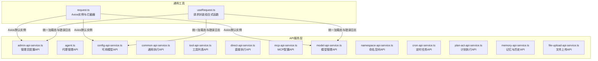
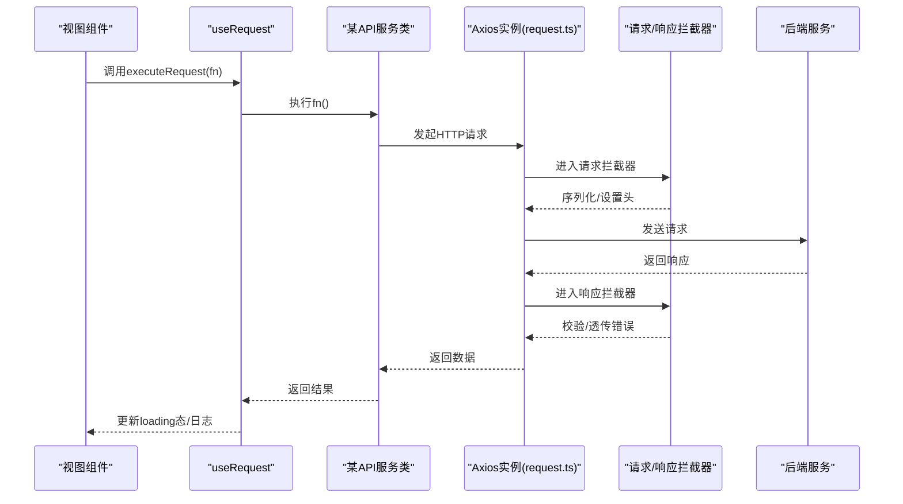
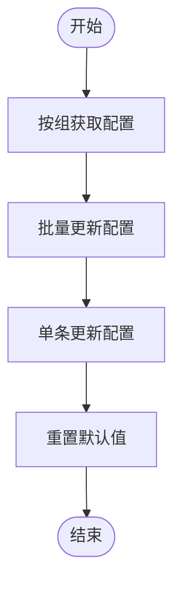
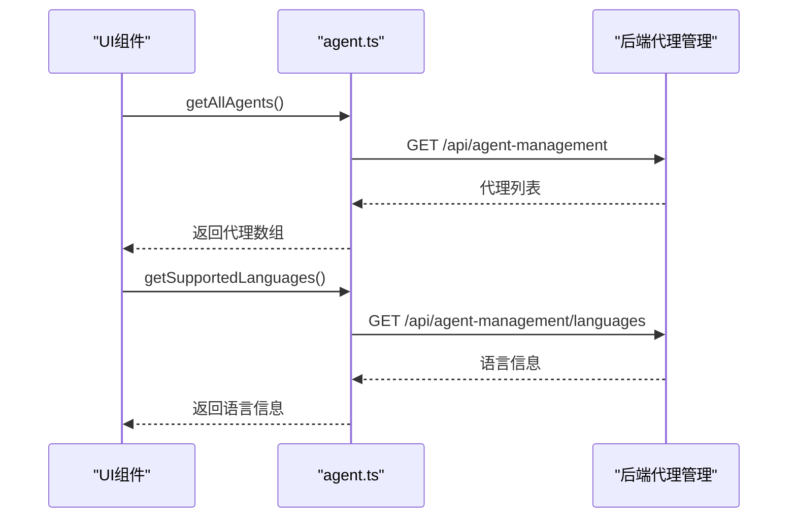
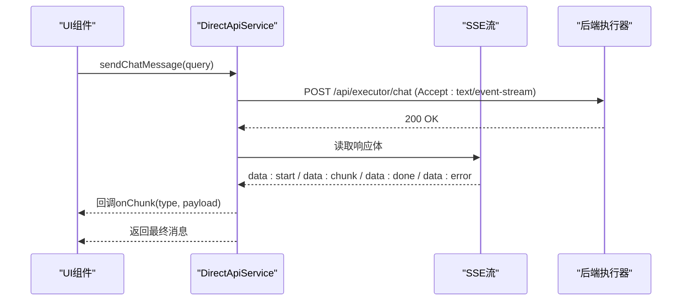
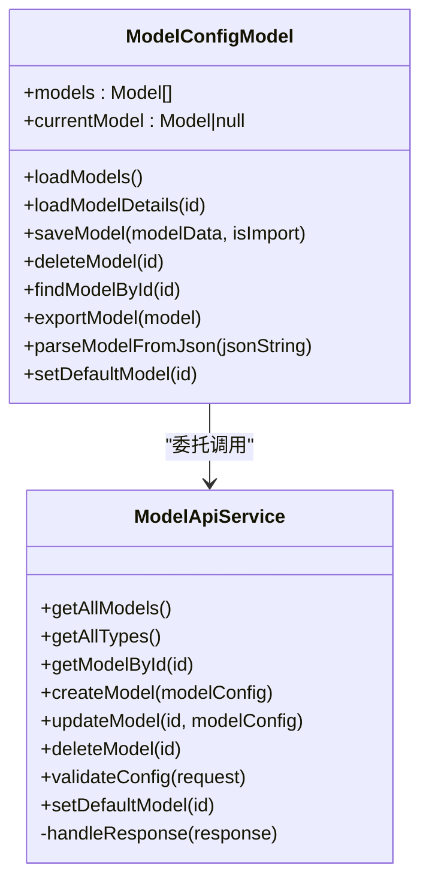
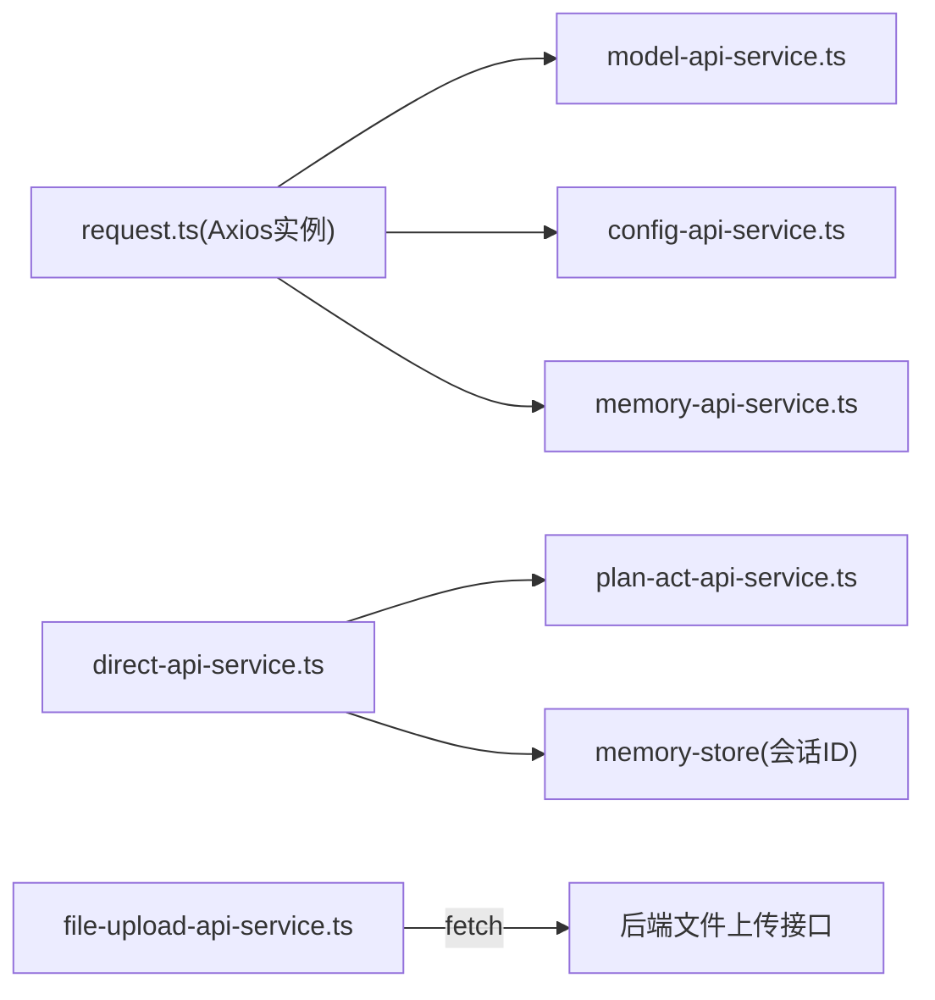

# API集成

<cite>
**本文引用的文件**   
- [admin-api-service.ts](file://ui-vue3/src/api/admin-api-service.ts)
- [agent.ts](file://ui-vue3/src/api/agent.ts)
- [config-api-service.ts](file://ui-vue3/src/api/config-api-service.ts)
- [common-api-service.ts](file://ui-vue3/src/api/common-api-service.ts)
- [tool-api-service.ts](file://ui-vue3/src/api/tool-api-service.ts)
- [direct-api-service.ts](file://ui-vue3/src/api/direct-api-service.ts)
- [mcp-api-service.ts](file://ui-vue3/src/api/mcp-api-service.ts)
- [model-api-service.ts](file://ui-vue3/src/api/model-api-service.ts)
- [namespace-api-service.ts](file://ui-vue3/src/api/namespace-api-service.ts)
- [cron-api-service.ts](file://ui-vue3/src/api/cron-api-service.ts)
- [plan-act-api-service.ts](file://ui-vue3/src/api/plan-act-api-service.ts)
- [memory-api-service.ts](file://ui-vue3/src/api/memory-api-service.ts)
- [file-upload-api-service.ts](file://ui-vue3/src/api/file-upload-api-service.ts)
- [request.ts](file://ui-vue3/src/utils/request.ts)
- [useRequest.ts](file://ui-vue3/src/composables/useRequest.ts)
</cite>

## 目录
1. [简介](#简介)
2. [项目结构](#项目结构)
3. [核心组件](#核心组件)
4. [架构总览](#架构总览)
5. [详细组件分析](#详细组件分析)
6. [依赖关系分析](#依赖关系分析)
7. [性能考虑](#性能考虑)
8. [故障排查指南](#故障排查指南)
9. [结论](#结论)
10. [附录](#附录)

## 简介
本文件面向Lynxe前端的API集成功能，系统性梳理RESTful API客户端的设计与实现，覆盖管理员配置、代理管理、模型与命名空间、计划执行、内存与对话历史、定时任务、MCP配置以及文件上传等模块。文档重点阐述：
- 各API服务模块的职责边界与数据契约
- HTTP请求拦截器、响应处理与错误管理机制
- 认证、请求重试与超时策略
- 最佳实践、缓存策略与性能优化技巧
- 前后端数据交换协议与接口规范

## 项目结构
前端API层位于ui-vue3/src/api目录，采用“按功能域分包”的组织方式，每个服务类封装对后端某一资源或能力的访问；同时在ui-vue3/src/utils与ui-vue3/src/composables中提供通用的HTTP客户端与请求封装。

图表来源
- [admin-api-service.ts:1-165](file://ui-vue3/src/api/admin-api-service.ts#L1-L165)
- [config-api-service.ts:1-32](file://ui-vue3/src/api/config-api-service.ts#L1-L32)
- [common-api-service.ts:1-149](file://ui-vue3/src/api/common-api-service.ts#L1-L149)
- [tool-api-service.ts:1-53](file://ui-vue3/src/api/tool-api-service.ts#L1-L53)
- [direct-api-service.ts:1-324](file://ui-vue3/src/api/direct-api-service.ts#L1-L324)
- [mcp-api-service.ts:1-235](file://ui-vue3/src/api/mcp-api-service.ts#L1-L235)
- [model-api-service.ts:1-386](file://ui-vue3/src/api/model-api-service.ts#L1-L386)
- [namespace-api-service.ts:1-129](file://ui-vue3/src/api/namespace-api-service.ts#L1-L129)
- [cron-api-service.ts:1-132](file://ui-vue3/src/api/cron-api-service.ts#L1-L132)
- [plan-act-api-service.ts:1-85](file://ui-vue3/src/api/plan-act-api-service.ts#L1-L85)
- [memory-api-service.ts:1-175](file://ui-vue3/src/api/memory-api-service.ts#L1-L175)
- [file-upload-api-service.ts:1-196](file://ui-vue3/src/api/file-upload-api-service.ts#L1-L196)
- [request.ts:1-65](file://ui-vue3/src/utils/request.ts#L1-L65)
- [useRequest.ts:1-40](file://ui-vue3/src/composables/useRequest.ts#L1-L40)

章节来源
- [admin-api-service.ts:1-165](file://ui-vue3/src/api/admin-api-service.ts#L1-L165)
- [config-api-service.ts:1-32](file://ui-vue3/src/api/config-api-service.ts#L1-L32)
- [common-api-service.ts:1-149](file://ui-vue3/src/api/common-api-service.ts#L1-L149)
- [tool-api-service.ts:1-53](file://ui-vue3/src/api/tool-api-service.ts#L1-L53)
- [direct-api-service.ts:1-324](file://ui-vue3/src/api/direct-api-service.ts#L1-L324)
- [mcp-api-service.ts:1-235](file://ui-vue3/src/api/mcp-api-service.ts#L1-L235)
- [model-api-service.ts:1-386](file://ui-vue3/src/api/model-api-service.ts#L1-L386)
- [namespace-api-service.ts:1-129](file://ui-vue3/src/api/namespace-api-service.ts#L1-L129)
- [cron-api-service.ts:1-132](file://ui-vue3/src/api/cron-api-service.ts#L1-L132)
- [plan-act-api-service.ts:1-85](file://ui-vue3/src/api/plan-act-api-service.ts#L1-L85)
- [memory-api-service.ts:1-175](file://ui-vue3/src/api/memory-api-service.ts#L1-L175)
- [file-upload-api-service.ts:1-196](file://ui-vue3/src/api/file-upload-api-service.ts#L1-L196)
- [request.ts:1-65](file://ui-vue3/src/utils/request.ts#L1-L65)
- [useRequest.ts:1-40](file://ui-vue3/src/composables/useRequest.ts#L1-L40)

## 核心组件
- 管理员配置API：提供配置项的分组查询、批量更新、单条更新、重置默认值等能力，返回统一的响应体结构。
- 代理管理API：提供代理列表、语言支持、重置/初始化代理、统计信息等接口。
- 可用模型API：通过Axios获取可用模型列表，支持覆盖默认baseURL以适配不同路由前缀。
- 通用执行API：封装执行详情查询、删除、表单提交、版本信息获取等，内置统一响应处理。
- 工具列表API：获取后端可用工具清单。
- 直接执行API：封装直接任务执行、SSE聊天流、按工具名异步执行、任务停止等。
- MCP配置API：提供MCP服务器的增删改查、启用/禁用、导入导出等。
- 模型管理API：提供模型的CRUD、校验、设为默认等，含本地状态模型封装。
- 命名空间API：提供命名空间的CRUD。
- 定时任务API：提供定时任务的CRUD与状态切换。
- 计划执行API：封装计划模板版本与列表查询，并委派到直接执行API。
- 内存与历史API：提供记忆、会话ID生成、历史记录查询等。
- 文件上传API：提供文件上传、查询已上传文件、删除文件、获取上传配置等。
- 通用HTTP客户端与拦截器：Axios实例化、请求/响应拦截器、统一JSON序列化与错误透传。
- 请求封装组合式函数：统一loading态与错误日志，简化调用侧逻辑。

章节来源
- [admin-api-service.ts:46-165](file://ui-vue3/src/api/admin-api-service.ts#L46-L165)
- [agent.ts:46-94](file://ui-vue3/src/api/agent.ts#L46-L94)
- [config-api-service.ts:14-32](file://ui-vue3/src/api/config-api-service.ts#L14-L32)
- [common-api-service.ts:21-149](file://ui-vue3/src/api/common-api-service.ts#L21-L149)
- [tool-api-service.ts:23-53](file://ui-vue3/src/api/tool-api-service.ts#L23-L53)
- [direct-api-service.ts:21-324](file://ui-vue3/src/api/direct-api-service.ts#L21-L324)
- [mcp-api-service.ts:56-235](file://ui-vue3/src/api/mcp-api-service.ts#L56-L235)
- [model-api-service.ts:58-386](file://ui-vue3/src/api/model-api-service.ts#L58-L386)
- [namespace-api-service.ts:25-129](file://ui-vue3/src/api/namespace-api-service.ts#L25-L129)
- [cron-api-service.ts:19-132](file://ui-vue3/src/api/cron-api-service.ts#L19-L132)
- [plan-act-api-service.ts:22-85](file://ui-vue3/src/api/plan-act-api-service.ts#L22-L85)
- [memory-api-service.ts:41-175](file://ui-vue3/src/api/memory-api-service.ts#L41-L175)
- [file-upload-api-service.ts:73-196](file://ui-vue3/src/api/file-upload-api-service.ts#L73-L196)
- [request.ts:26-65](file://ui-vue3/src/utils/request.ts#L26-L65)
- [useRequest.ts:4-40](file://ui-vue3/src/composables/useRequest.ts#L4-L40)

## 架构总览
前端API客户端采用“服务类+拦截器+组合式封装”的分层设计：
- 服务类：围绕后端资源进行封装，统一构造URL、方法、头与负载。
- 拦截器：Axios全局拦截器负责序列化、统一头、统一响应校验与错误透传。
- 组合式封装：useRequest提供统一的loading态与错误日志，便于在组件中复用。

图表来源
- [useRequest.ts:7-38](file://ui-vue3/src/composables/useRequest.ts#L7-L38)
- [request.ts:33-63](file://ui-vue3/src/utils/request.ts#L33-L63)
- [common-api-service.ts:112-122](file://ui-vue3/src/api/common-api-service.ts#L112-L122)

## 详细组件分析

### 管理员配置API（AdminApiService）
- 职责：配置项的分组查询、批量更新、单条更新、重置默认值。
- 数据契约：统一响应体包含success、message与可选data；配置项包含键、类型、描述、选项等。
- 错误处理：对非2xx响应抛出错误，捕获后返回统一失败对象或抛出异常。
- 使用建议：批量更新前先过滤未修改项；重置默认值用于恢复出厂设置。

图表来源
- [admin-api-service.ts:52-94](file://ui-vue3/src/api/admin-api-service.ts#L52-L94)
- [admin-api-service.ts:115-137](file://ui-vue3/src/api/admin-api-service.ts#L115-L137)
- [admin-api-service.ts:142-163](file://ui-vue3/src/api/admin-api-service.ts#L142-L163)

章节来源
- [admin-api-service.ts:46-165](file://ui-vue3/src/api/admin-api-service.ts#L46-L165)

### 代理管理API（agent.ts）
- 职责：获取代理列表、语言支持、重置/初始化代理、统计信息。
- 统一响应处理：handleResponse统一处理非2xx响应，优先解析JSON中的message字段。
- 使用建议：在切换语言时先调用重置/初始化接口，确保代理状态一致。

图表来源
- [agent.ts:46-94](file://ui-vue3/src/api/agent.ts#L46-L94)

章节来源
- [agent.ts:35-94](file://ui-vue3/src/api/agent.ts#L35-L94)

### 可用模型API（ConfigApiService）
- 职责：获取可用模型列表，覆盖默认baseURL以适配不同路由前缀。
- 注意：与通用Axios实例分离，避免与/api/v1冲突。

章节来源
- [config-api-service.ts:14-32](file://ui-vue3/src/api/config-api-service.ts#L14-L32)

### 通用执行API（CommonApiService）
- 职责：执行详情查询（带404空值处理）、删除、表单提交、版本信息获取。
- 统一响应处理：handleResponse统一解析错误消息，兼容无JSON响应场景。
- 版本信息：失败时返回默认值，保证UI稳定。

章节来源
- [common-api-service.ts:21-149](file://ui-vue3/src/api/common-api-service.ts#L21-L149)

### 工具列表API（ToolApiService）
- 职责：获取后端可用工具清单。
- 统一响应处理：handleResponse统一解析错误消息。

章节来源
- [tool-api-service.ts:23-53](file://ui-vue3/src/api/tool-api-service.ts#L23-L53)

### 直接执行API（DirectApiService）
- 职责：直接任务执行、SSE聊天流、按工具名异步执行、任务停止。
- SSE流处理：读取response.body，按"data:"事件解析，支持start/chunk/done/error事件。
- 参数拼装：自动注入conversationId、requestSource、replacementParams、uploadedFiles、uploadKey等。
- LLM检查：前置LLM可用性检查，失败则阻断请求。

图表来源
- [direct-api-service.ts:44-220](file://ui-vue3/src/api/direct-api-service.ts#L44-L220)

章节来源
- [direct-api-service.ts:21-324](file://ui-vue3/src/api/direct-api-service.ts#L21-L324)

### MCP配置API（McpApiService）
- 职责：MCP服务器的增删改查、启用/禁用、导入导出。
- 统一响应处理：对非2xx响应读取文本并抛出错误，返回统一失败对象。
- 保存策略：saveMcpServer根据是否包含id判断新增或更新。

章节来源
- [mcp-api-service.ts:56-235](file://ui-vue3/src/api/mcp-api-service.ts#L56-L235)

### 模型管理API（ModelApiService）
- 职责：模型CRUD、校验、设为默认。
- 统一响应处理：handleResponse统一解析错误消息。
- 本地状态模型：ModelConfigModel封装本地模型列表、当前模型、导入/导出、设为默认等。

图表来源
- [model-api-service.ts:58-242](file://ui-vue3/src/api/model-api-service.ts#L58-L242)
- [model-api-service.ts:248-382](file://ui-vue3/src/api/model-api-service.ts#L248-L382)

章节来源
- [model-api-service.ts:58-386](file://ui-vue3/src/api/model-api-service.ts#L58-L386)

### 命名空间API（NamespaceApiService）
- 职责：命名空间CRUD。
- 统一响应处理：handleResponse统一解析错误消息。

章节来源
- [namespace-api-service.ts:25-129](file://ui-vue3/src/api/namespace-api-service.ts#L25-L129)

### 定时任务API（CronApiService）
- 职责：定时任务CRUD与状态切换。
- 统一响应处理：handleResponse统一解析错误消息。

章节来源
- [cron-api-service.ts:19-132](file://ui-vue3/src/api/cron-api-service.ts#L19-L132)

### 计划执行API（PlanActApiService）
- 职责：计划模板版本与列表查询，委派到DirectApiService.executeByToolName。
- 参数处理：将rawParam注入replacementParams，便于后端统一参数处理。

章节来源
- [plan-act-api-service.ts:22-85](file://ui-vue3/src/api/plan-act-api-service.ts#L22-L85)

### 内存与历史API（MemoryApiService）
- 职责：记忆列表、单个记忆、创建/更新/删除、生成会话ID、查询会话历史。
- 统一响应处理：handleResponse统一解析错误消息。

章节来源
- [memory-api-service.ts:41-175](file://ui-vue3/src/api/memory-api-service.ts#L41-L175)

### 文件上传API（FileUploadApiService）
- 职责：文件上传、查询已上传文件、删除文件、获取上传配置。
- 表单上传：使用FormData，后端接收多文件。
- 统一响应处理：对非2xx响应抛出错误。

章节来源
- [file-upload-api-service.ts:73-196](file://ui-vue3/src/api/file-upload-api-service.ts#L73-L196)

### 通用HTTP客户端与拦截器（request.ts）
- Axios实例：baseURL="/api/v1"，timeout=30秒。
- 请求拦截器：序列化请求体为JSON，设置Content-Type为application/json。
- 响应拦截器：当code/status表示成功时透传data，否则reject data；错误时输出日志并reject data。

章节来源
- [request.ts:26-65](file://ui-vue3/src/utils/request.ts#L26-L65)

### 请求封装组合式函数（useRequest.ts）
- 功能：统一loading态与错误日志，支持传入成功/失败提示消息。
- 适用：所有需要统一loading态与错误日志的服务调用。

章节来源
- [useRequest.ts:4-40](file://ui-vue3/src/composables/useRequest.ts#L4-L40)

## 依赖关系分析
- 通用Axios实例被多个API服务共享（如模型、配置），但部分服务（如可用模型）选择覆盖baseURL以适配不同路由。
- DirectApiService与PlanActApiService存在调用关系：PlanActApiService委派到DirectApiService.executeByToolName。
- MemoryApiService依赖会话ID存储（memoryStore），用于携带conversationId。
- FileUploadApiService独立于Axios实例，直接使用fetch进行multipart上传。

图表来源
- [request.ts:26-65](file://ui-vue3/src/utils/request.ts#L26-L65)
- [model-api-service.ts:58-242](file://ui-vue3/src/api/model-api-service.ts#L58-L242)
- [config-api-service.ts:18-24](file://ui-vue3/src/api/config-api-service.ts#L18-L24)
- [memory-api-service.ts:42-175](file://ui-vue3/src/api/memory-api-service.ts#L42-L175)
- [direct-api-service.ts:21-324](file://ui-vue3/src/api/direct-api-service.ts#L21-L324)
- [plan-act-api-service.ts:22-85](file://ui-vue3/src/api/plan-act-api-service.ts#L22-L85)
- [file-upload-api-service.ts:79-109](file://ui-vue3/src/api/file-upload-api-service.ts#L79-L109)

章节来源
- [request.ts:26-65](file://ui-vue3/src/utils/request.ts#L26-L65)
- [direct-api-service.ts:56-64](file://ui-vue3/src/api/direct-api-service.ts#L56-L64)
- [memory-api-service.ts:68-77](file://ui-vue3/src/api/memory-api-service.ts#L68-L77)

## 性能考虑
- 请求序列化与头设置：统一在请求拦截器完成，减少重复代码，降低出错概率。
- SSE流读取：按行缓冲解析，避免一次性解码大块数据；仅在必要时累积消息。
- 404与空数据：通用执行API对404返回null，避免阻塞轮询；网络错误不抛异常，允许上层继续轮询。
- 超时控制：Axios默认30秒超时，可根据业务调整；SSE场景需结合轮询策略避免阻塞。
- 缓存策略：模型/命名空间/工具等静态数据可在组件内缓存；会话历史与执行详情建议按需拉取并设置合理刷新间隔。
- 并发控制：对高并发请求使用队列或节流，避免后端压力过大。

## 故障排查指南
- 统一错误处理
  - 通用响应处理：handleResponse优先解析JSON中的message字段，若无JSON则回退到状态码与状态文本。
  - 非2xx响应：直接抛出错误，便于上层捕获与提示。
- Axios拦截器
  - 请求拦截器：确保请求体为JSON字符串，Content-Type为application/json。
  - 响应拦截器：对非成功响应统一reject data，便于上层捕获错误信息。
- SSE流问题
  - 检查后端是否正确设置Accept: text/event-stream。
  - 确认事件格式为"data:"或"data: "，并正确解析JSON。
  - 若出现解析错误，查看日志中提取的原始数据片段。
- 文件上传
  - 确认后端接收多文件的FormData字段名为files。
  - 检查跨域与CORS配置，避免预检失败。
- LLM可用性检查
  - DirectApiService与PlanActApiService均前置LLM检查，若不可用则阻断请求并提示。

章节来源
- [common-api-service.ts:112-122](file://ui-vue3/src/api/common-api-service.ts#L112-L122)
- [request.ts:33-63](file://ui-vue3/src/utils/request.ts#L33-L63)
- [direct-api-service.ts:147-206](file://ui-vue3/src/api/direct-api-service.ts#L147-L206)
- [file-upload-api-service.ts:83-91](file://ui-vue3/src/api/file-upload-api-service.ts#L83-L91)

## 结论
Lynxe前端API集成功能通过服务类、Axios拦截器与组合式封装形成清晰的分层架构，既保证了各模块职责明确，又提供了统一的错误处理与用户体验。建议在后续迭代中进一步完善：
- 对高频接口增加本地缓存与失效策略
- 在SSE场景引入指数退避与重连机制
- 对长耗时任务增加进度上报与取消能力
- 统一认证令牌注入与刷新策略

## 附录
- 接口规范要点
  - 统一响应体：success、message、data
  - 错误消息：优先从后端返回的JSON中提取message
  - SSE事件：start/chunk/done/error
  - 文件上传：FormData字段名为files
- 最佳实践
  - 使用useRequest统一loading态与错误日志
  - 对SSE流进行严格的事件格式校验
  - 对高并发请求进行限流与去抖
  - 对404与网络错误区分对待，避免阻塞轮询