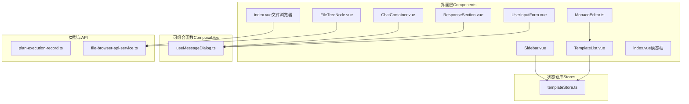
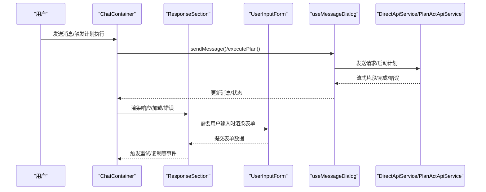
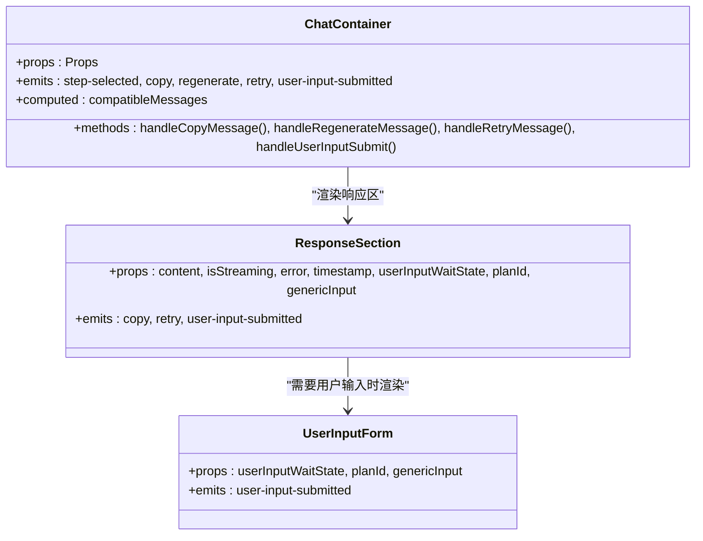
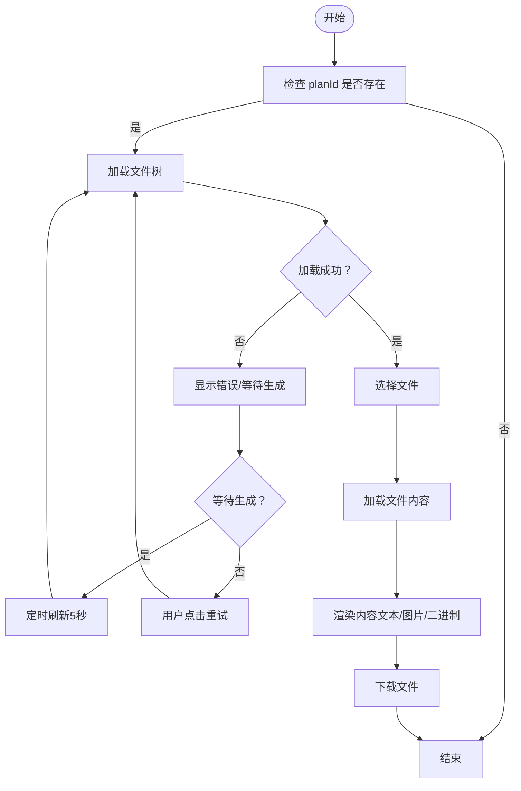
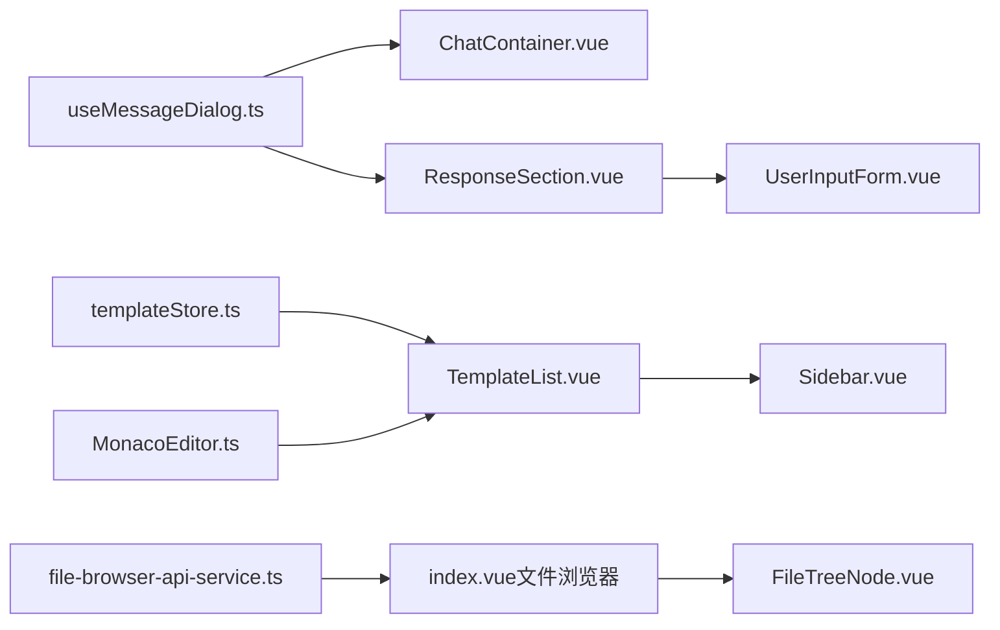

# UI组件库

<cite>
**本文档引用的文件**
- [ChatContainer.vue](file://ui-vue3/src/components/chat/ChatContainer.vue)
- [ResponseSection.vue](file://ui-vue3/src/components/chat/ResponseSection.vue)
- [UserInputForm.vue](file://ui-vue3/src/components/chat/UserInputForm.vue)
- [Sidebar.vue](file://ui-vue3/src/components/sidebar/Sidebar.vue)
- [TemplateList.vue](file://ui-vue3/src/components/sidebar/TemplateList.vue)
- [index.vue（模态框）](file://ui-vue3/src/components/modal/index.vue)
- [index.vue（文件浏览器）](file://ui-vue3/src/components/file-browser/index.vue)
- [FileTreeNode.vue](file://ui-vue3/src/components/file-browser/FileTreeNode.vue)
- [MonacoEditor.ts](file://ui-vue3/src/components/editor/MonacoEditor.ts)
- [useMessageDialog.ts](file://ui-vue3/src/composables/useMessageDialog.ts)
- [templateStore.ts](file://ui-vue3/src/stores/templateStore.ts)
- [plan-execution-record.ts](file://ui-vue3/src/types/plan-execution-record.ts)
- [file-browser-api-service.ts](file://ui-vue3/src/api/file-browser-api-service.ts)
</cite>

## 目录
1. [简介](#简介)
2. [项目结构](#项目结构)
3. [核心组件](#核心组件)
4. [架构总览](#架构总览)
5. [详细组件分析](#详细组件分析)
6. [依赖关系分析](#依赖关系分析)
7. [性能考量](#性能考量)
8. [故障排查指南](#故障排查指南)
9. [结论](#结论)
10. [附录](#附录)

## 简介
本文件为 Lynxe UI 组件库的系统化文档，聚焦聊天容器、侧边栏、模态框、编辑器与文件浏览器等关键组件。内容涵盖设计理念、实现模式、接口定义、事件处理、插槽设计、样式定制、主题适配、响应式布局、组件组合与复用策略、扩展指南以及与业务逻辑的数据流集成。

## 项目结构
UI 层采用 Vue 3 + TypeScript 构建，组件位于 ui-vue3/src/components 下，按功能域划分：chat、sidebar、modal、editor、file-browser 等；配套的可组合函数（composables）、状态仓库（stores）、类型定义（types）与 API 服务（api）分别位于对应目录中，形成清晰的分层与职责边界。

图示来源
- [ChatContainer.vue:1-541](file://ui-vue3/src/components/chat/ChatContainer.vue#L1-L541)
- [useMessageDialog.ts:1-1114](file://ui-vue3/src/composables/useMessageDialog.ts#L1-L1114)
- [Sidebar.vue:1-327](file://ui-vue3/src/components/sidebar/Sidebar.vue#L1-L327)
- [TemplateList.vue:1-918](file://ui-vue3/src/components/sidebar/TemplateList.vue#L1-L918)
- [index.vue（文件浏览器）:1-865](file://ui-vue3/src/components/file-browser/index.vue#L1-L865)
- [FileTreeNode.vue:1-388](file://ui-vue3/src/components/file-browser/FileTreeNode.vue#L1-L388)
- [MonacoEditor.ts:1-68](file://ui-vue3/src/components/editor/MonacoEditor.ts#L1-L68)
- [plan-execution-record.ts:1-296](file://ui-vue3/src/types/plan-execution-record.ts#L1-L296)
- [file-browser-api-service.ts:1-223](file://ui-vue3/src/api/file-browser-api-service.ts#L1-L223)

章节来源
- [ChatContainer.vue:1-541](file://ui-vue3/src/components/chat/ChatContainer.vue#L1-L541)
- [Sidebar.vue:1-327](file://ui-vue3/src/components/sidebar/Sidebar.vue#L1-L327)
- [index.vue（模态框）:1-270](file://ui-vue3/src/components/modal/index.vue#L1-L270)
- [index.vue（文件浏览器）:1-865](file://ui-vue3/src/components/file-browser/index.vue#L1-L865)
- [MonacoEditor.ts:1-68](file://ui-vue3/src/components/editor/MonacoEditor.ts#L1-L68)
- [useMessageDialog.ts:1-1114](file://ui-vue3/src/composables/useMessageDialog.ts#L1-L1114)
- [templateStore.ts:1-437](file://ui-vue3/src/stores/templateStore.ts#L1-L437)
- [plan-execution-record.ts:1-296](file://ui-vue3/src/types/plan-execution-record.ts#L1-L296)
- [file-browser-api-service.ts:1-223](file://ui-vue3/src/api/file-browser-api-service.ts#L1-L223)

## 核心组件
- 聊天容器（ChatContainer）：负责消息渲染、滚动行为、复制/重试/重新生成占位交互、用户输入表单桥接。
- 响应区（ResponseSection）：展示最终响应、加载占位、错误提示与复制/重试交互。
- 用户输入表单（UserInputForm）：在计划执行等待用户输入时，动态渲染多形态表单并提交。
- 侧边栏（Sidebar）：模板列表容器，提供新建模板、切换右侧面板标签页、加载模板列表。
- 模板列表（TemplateList）：模板组织、搜索、分组折叠、删除确认、相对时间显示。
- 文件浏览器（FileBrowser）：树形文件浏览、内容查看（文本/图片/二进制）、Markdown 渲染、自动刷新与下载。
- 文件树节点（FileTreeNode）：递归渲染树节点、右键菜单、展开/收起、路径复制。
- 模态框（Modal）：通用遮罩弹窗，支持键盘快捷键、插槽扩展。
- 编辑器（MonacoEditor）：基于 Monaco 的轻量封装，支持格式化、只读切换与自动布局。

章节来源
- [ChatContainer.vue:1-541](file://ui-vue3/src/components/chat/ChatContainer.vue#L1-L541)
- [ResponseSection.vue:1-556](file://ui-vue3/src/components/chat/ResponseSection.vue#L1-L556)
- [UserInputForm.vue:1-588](file://ui-vue3/src/components/chat/UserInputForm.vue#L1-L588)
- [Sidebar.vue:1-327](file://ui-vue3/src/components/sidebar/Sidebar.vue#L1-L327)
- [TemplateList.vue:1-918](file://ui-vue3/src/components/sidebar/TemplateList.vue#L1-L918)
- [index.vue（文件浏览器）:1-865](file://ui-vue3/src/components/file-browser/index.vue#L1-L865)
- [FileTreeNode.vue:1-388](file://ui-vue3/src/components/file-browser/FileTreeNode.vue#L1-L388)
- [index.vue（模态框）:1-270](file://ui-vue3/src/components/modal/index.vue#L1-L270)
- [MonacoEditor.ts:1-68](file://ui-vue3/src/components/editor/MonacoEditor.ts#L1-L68)

## 架构总览
组件通过可组合函数与状态仓库进行数据与流程控制，API 服务负责与后端交互。聊天相关由 useMessageDialog 单例统一管理消息对话、流式更新、计划执行状态与会话持久化；模板相关由 templateStore 管理模板列表、组织方式与分组折叠状态；文件浏览器通过独立 API 服务获取树与内容。

图示来源
- [ChatContainer.vue:1-541](file://ui-vue3/src/components/chat/ChatContainer.vue#L1-L541)
- [ResponseSection.vue:1-556](file://ui-vue3/src/components/chat/ResponseSection.vue#L1-L556)
- [UserInputForm.vue:1-588](file://ui-vue3/src/components/chat/UserInputForm.vue#L1-L588)
- [useMessageDialog.ts:1-1114](file://ui-vue3/src/composables/useMessageDialog.ts#L1-L1114)

## 详细组件分析

### 聊天容器（ChatContainer）
- 设计理念：纯展示组件，将消息渲染与滚动、点击处理、复制/重试/重新生成等交互解耦至可组合函数与子组件。
- 关键特性
  - 消息列表渲染：区分用户/助手消息，支持附件、时间戳、状态指示。
  - 计划执行详情：通过 ExecutionDetails 子组件展示步骤与输入等待状态。
  - 响应区桥接：通过 ResponseSection 渲染最终响应、加载与错误态，并暴露复制/重试/用户输入提交事件。
  - 滚动行为：自动滚动到底部，支持“回到底部”按钮。
  - 事件：step-selected（步骤选择）、copy/regenerate/retry（消息操作）、user-input-submitted（用户输入提交）。
- Props 接口：当前版本未定义 Props，保持最小化输入以降低耦合。
- 插槽设计：无具名插槽；通过事件与子组件组合实现功能扩展。
- 样式与主题：Less 变量化主题色、渐变背景、自定义滚动条与媒体查询适配移动端。
- 响应式：针对小屏设备调整尺寸与间距。

图示来源
- [ChatContainer.vue:1-541](file://ui-vue3/src/components/chat/ChatContainer.vue#L1-L541)
- [ResponseSection.vue:1-556](file://ui-vue3/src/components/chat/ResponseSection.vue#L1-L556)
- [UserInputForm.vue:1-588](file://ui-vue3/src/components/chat/UserInputForm.vue#L1-L588)

章节来源
- [ChatContainer.vue:1-541](file://ui-vue3/src/components/chat/ChatContainer.vue#L1-L541)
- [ResponseSection.vue:1-556](file://ui-vue3/src/components/chat/ResponseSection.vue#L1-L556)
- [UserInputForm.vue:1-588](file://ui-vue3/src/components/chat/UserInputForm.vue#L1-L588)

### 响应区（ResponseSection）
- 设计理念：将响应文本渲染、Markdown 处理、加载动画、错误提示与复制/重试交互集中在一个组件内，便于复用。
- 关键特性
  - 文本渲染：使用消息格式化工具对内容进行 Markdown/HTML 安全渲染。
  - 用户输入等待：当存在 userInputWaitState 且 waiting=true 时，渲染 UserInputForm。
  - 动作按钮：复制到剪贴板、重试。
  - 加载与错误：根据 isStreaming/error 显示不同状态。
- Props 接口
  - content?: string
  - isStreaming?: boolean
  - error?: string
  - timestamp?: Date
  - userInputWaitState?: UserInputWaitState
  - planId?: string
  - genericInput?: string
- 事件
  - copy
  - retry
  - user-input-submitted

章节来源
- [ResponseSection.vue:1-556](file://ui-vue3/src/components/chat/ResponseSection.vue#L1-L556)
- [plan-execution-record.ts:179-198](file://ui-vue3/src/types/plan-execution-record.ts#L179-L198)

### 用户输入表单（UserInputForm）
- 设计理念：在计划执行过程中，当后端返回等待用户输入的状态时，动态渲染多种表单控件（文本、邮箱、数字、密码、多行文本、下拉、复选、单选），并提交到后端。
- 关键特性
  - 动态表单：根据 formInputs 结构渲染不同类型的输入控件。
  - 表单描述：支持 Markdown 渲染。
  - 输入校验：根据 required 字段判断必填。
  - 提交：调用通用 API 提交表单数据，并触发外部事件。
- Props 接口
  - userInputWaitState?: UserInputWaitState
  - planId?: string
  - genericInput?: string
- 事件
  - user-input-submitted

章节来源
- [UserInputForm.vue:1-588](file://ui-vue3/src/components/chat/UserInputForm.vue#L1-L588)
- [plan-execution-record.ts:179-198](file://ui-vue3/src/types/plan-execution-record.ts#L179-L198)

### 侧边栏（Sidebar）
- 设计理念：作为模板管理入口，承载模板列表与新建模板能力，同时与右侧面板联动。
- 关键特性
  - 新建模板：根据模板配置选择默认计划类型，初始化模板并切换到配置标签页。
  - 加载模板：挂载时加载模板列表与可用工具。
  - 暴露方法：提供给父组件调用的 loadPlanTemplateList 与 toggleSidebar。
- Props 接口
  - width: number（百分比宽度）

章节来源
- [Sidebar.vue:1-327](file://ui-vue3/src/components/sidebar/Sidebar.vue#L1-L327)

### 模板列表（TemplateList）
- 设计理念：提供模板的组织、搜索、分组折叠与删除确认，配合 TemplateStore 实现本地持久化的分组与折叠状态。
- 关键特性
  - 组织方式：按时间、字母、分组时间、分组字母四种方式排序。
  - 搜索：关键词过滤，高亮匹配项。
  - 分组折叠：支持分组展开/收起，状态保存到 localStorage。
  - 删除确认：二次确认弹窗，防止误删。
  - 相对时间：显示“刚刚/分钟前/小时前/天前”等人性化时间。
- 与 Store 的协作
  - 使用 templateStore 管理模板列表、组织方式、分组折叠状态与服务组映射。
  - 通过 usePlanTemplateConfigSingleton 获取/设置当前模板与模板 ID。

章节来源
- [TemplateList.vue:1-918](file://ui-vue3/src/components/sidebar/TemplateList.vue#L1-L918)
- [templateStore.ts:1-437](file://ui-vue3/src/stores/templateStore.ts#L1-L437)

### 文件浏览器（FileBrowser）
- 设计理念：以树形结构展示计划产物文件，支持内容预览（文本/图片/二进制）、Markdown 渲染、下载与自动刷新。
- 关键特性
  - 文件树：懒加载子节点，支持展开/收起。
  - 内容查看：根据 MIME 类型与扩展名判断是否可直接渲染，支持 Markdown 格式化。
  - 自动刷新：当目录不存在时定时轮询，直到生成或手动刷新。
  - 错误处理：区分“等待生成”与“实际错误”，提供重试按钮。
  - 下载：支持直接下载文件。
- 与 API 的协作
  - 通过 FileBrowserApiService 封装树、内容与下载接口。
  - 支持判断文本文件、获取文件图标等工具方法。

图示来源
- [index.vue（文件浏览器）:1-865](file://ui-vue3/src/components/file-browser/index.vue#L1-L865)
- [file-browser-api-service.ts:1-223](file://ui-vue3/src/api/file-browser-api-service.ts#L1-L223)

章节来源
- [index.vue（文件浏览器）:1-865](file://ui-vue3/src/components/file-browser/index.vue#L1-L865)
- [FileTreeNode.vue:1-388](file://ui-vue3/src/components/file-browser/FileTreeNode.vue#L1-L388)
- [file-browser-api-service.ts:1-223](file://ui-vue3/src/api/file-browser-api-service.ts#L1-L223)

### 文件树节点（FileTreeNode）
- 设计理念：递归渲染树节点，支持右键菜单、展开/收起、下载、路径复制等交互。
- 关键特性
  - 递归渲染：children 为空时不渲染子节点，避免空展开。
  - 右键菜单：打开、下载、复制路径。
  - 图标映射：根据文件类型映射到 VS Code 图标集或通用图标。
  - 尺寸显示：文件节点显示大小。

章节来源
- [FileTreeNode.vue:1-388](file://ui-vue3/src/components/file-browser/FileTreeNode.vue#L1-L388)
- [file-browser-api-service.ts:179-223](file://ui-vue3/src/api/file-browser-api-service.ts#L179-L223)

### 模态框（Modal）
- 设计理念：通用遮罩弹窗，支持键盘 ESC 关闭、Enter 确认、插槽扩展、状态图标与标题。
- 关键特性
  - Teleport 到 body，避免层级问题。
  - 键盘事件：Esc 关闭、Enter 触发 confirm。
  - 插槽：默认插槽用于内容，footer 插槽用于自定义底部按钮。
  - 状态图标：支持状态类名与标题提示。

章节来源
- [index.vue（模态框）:1-270](file://ui-vue3/src/components/modal/index.vue#L1-L270)

### 编辑器（MonacoEditor）
- 设计理念：对 Monaco 进行轻量封装，提供创建编辑器、更新值、格式化文档与只读切换能力。
- 关键特性
  - 自动布局：automaticLayout=true，随容器变化自适应宽高。
  - 格式化：提供格式化动作，支持临时解除只读再恢复。
  - 主题：默认 vs-dark。

章节来源
- [MonacoEditor.ts:1-68](file://ui-vue3/src/components/editor/MonacoEditor.ts#L1-L68)

## 依赖关系分析
- 组件间依赖
  - ChatContainer 依赖 useMessageDialog 管理消息与计划执行状态。
  - ResponseSection 依赖 useMessageFormatting 进行内容渲染与时间格式化。
  - TemplateList 依赖 templateStore 与 usePlanTemplateConfigSingleton 管理模板列表与当前模板。
  - FileBrowser 依赖 FileBrowserApiService 进行树与内容获取。
- 外部依赖
  - Iconify 图标库、Monaco Editor、highlight.js（用于 Markdown 代码高亮）。
- 数据流
  - useMessageDialog 作为聊天与计划执行的单一事实来源，向 ChatContainer/ResponseSection/UserInputForm 下发状态与事件。
  - templateStore 与 TemplateList 共同维护模板列表与 UI 状态。
  - FileBrowserApiService 与 FileBrowser/ FileTreeNode 形成稳定的 API-视图层契约。

图示来源
- [useMessageDialog.ts:1-1114](file://ui-vue3/src/composables/useMessageDialog.ts#L1-L1114)
- [ChatContainer.vue:1-541](file://ui-vue3/src/components/chat/ChatContainer.vue#L1-L541)
- [ResponseSection.vue:1-556](file://ui-vue3/src/components/chat/ResponseSection.vue#L1-L556)
- [UserInputForm.vue:1-588](file://ui-vue3/src/components/chat/UserInputForm.vue#L1-L588)
- [templateStore.ts:1-437](file://ui-vue3/src/stores/templateStore.ts#L1-L437)
- [TemplateList.vue:1-918](file://ui-vue3/src/components/sidebar/TemplateList.vue#L1-L918)
- [Sidebar.vue:1-327](file://ui-vue3/src/components/sidebar/Sidebar.vue#L1-L327)
- [file-browser-api-service.ts:1-223](file://ui-vue3/src/api/file-browser-api-service.ts#L1-L223)
- [index.vue（文件浏览器）:1-865](file://ui-vue3/src/components/file-browser/index.vue#L1-L865)
- [FileTreeNode.vue:1-388](file://ui-vue3/src/components/file-browser/FileTreeNode.vue#L1-L388)
- [MonacoEditor.ts:1-68](file://ui-vue3/src/components/editor/MonacoEditor.ts#L1-L68)

章节来源
- [useMessageDialog.ts:1-1114](file://ui-vue3/src/composables/useMessageDialog.ts#L1-L1114)
- [templateStore.ts:1-437](file://ui-vue3/src/stores/templateStore.ts#L1-L437)
- [file-browser-api-service.ts:1-223](file://ui-vue3/src/api/file-browser-api-service.ts#L1-L223)

## 性能考量
- 渲染优化
  - ChatContainer 通过 computed 与 watchEffect 控制消息列表重渲染，避免不必要的 DOM 更新。
  - FileBrowser 对“等待生成”的目录采用定时轮询，减少无效请求。
- 交互体验
  - 自动滚动仅在非流式增量更新时触发，保证滚动体验稳定。
  - 模态框与文件树节点使用过渡动画与 hover 效果，提升反馈速度。
- 资源管理
  - Monaco 编辑器在更新值后延迟恢复只读状态，避免频繁写入导致的闪烁。
  - 文件内容按需加载，二进制与不可直接渲染的文件仅提供下载入口。

## 故障排查指南
- 聊天消息不显示或卡住
  - 检查 useMessageDialog 的 isLoading 与 streamingMessageId 状态，确认流式更新是否正确停止。
  - 确认后端返回的 conversationId/planId 是否被正确写入内存存储与对话对象。
- 文件浏览器空白或报错
  - 若提示“目录不存在”，确认计划是否已开始执行；等待生成期间会自动轮询。
  - 检查 FileBrowserApiService 的响应处理与 MIME 判断逻辑。
- 模板列表不刷新
  - 确认 TemplateList 的搜索关键词与组织方式是否影响了分组显示。
  - 检查 templateStore 的 loadPlanTemplateList 是否抛出异常并设置了错误信息。
- 用户输入表单无法提交
  - 检查 planId 是否传入，确保调用通用 API 提交。
  - 校验 formInputs 的 required 字段与必填项是否满足。

章节来源
- [useMessageDialog.ts:1-1114](file://ui-vue3/src/composables/useMessageDialog.ts#L1-L1114)
- [index.vue（文件浏览器）:1-865](file://ui-vue3/src/components/file-browser/index.vue#L1-L865)
- [TemplateList.vue:1-918](file://ui-vue3/src/components/sidebar/TemplateList.vue#L1-L918)
- [UserInputForm.vue:1-588](file://ui-vue3/src/components/chat/UserInputForm.vue#L1-L588)

## 结论
Lynxe UI 组件库通过清晰的分层与可组合函数，实现了聊天、模板管理、文件浏览与通用弹窗等核心场景。组件以事件驱动与状态共享为核心，结合响应式与主题化样式，既保证了可维护性，也提供了良好的用户体验。建议在后续迭代中进一步完善占位功能（如重新生成/重试）与错误兜底提示，持续优化大文件与长文本的渲染性能。

## 附录
- 组件组合与复用
  - ChatContainer 与 ResponseSection/ UserInputForm 的组合适用于所有聊天与计划执行场景。
  - TemplateList 与 Sidebar 的组合提供完整的模板管理入口。
  - FileBrowser 与 FileTreeNode 的组合提供一致的文件浏览体验。
- 扩展指南
  - 新增聊天功能：在 ChatContainer 中新增事件监听，在 useMessageDialog 中扩展状态与 API 调用。
  - 新增模板：在 TemplateList 中增加新的组织方式或筛选条件，同步更新 templateStore。
  - 新增文件类型：在 FileBrowserApiService 中扩展 isTextFile 与 getFileIcon 的映射。
- 主题与样式
  - 使用 Less 变量与媒体查询适配深色主题与移动端。
  - 通过 Iconify 图标库与 VS Code 图标集统一视觉风格。