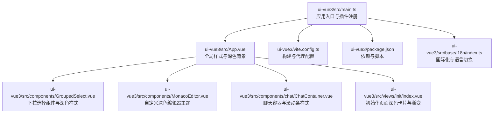
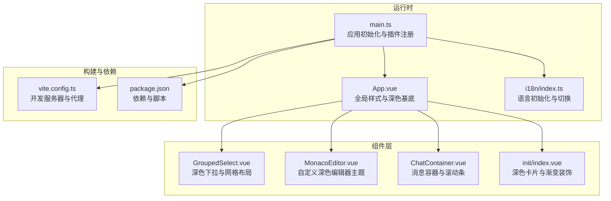
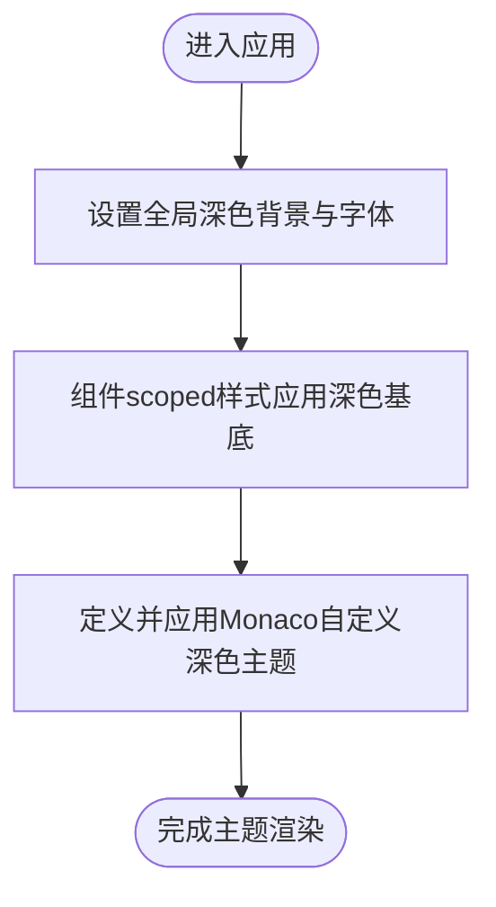
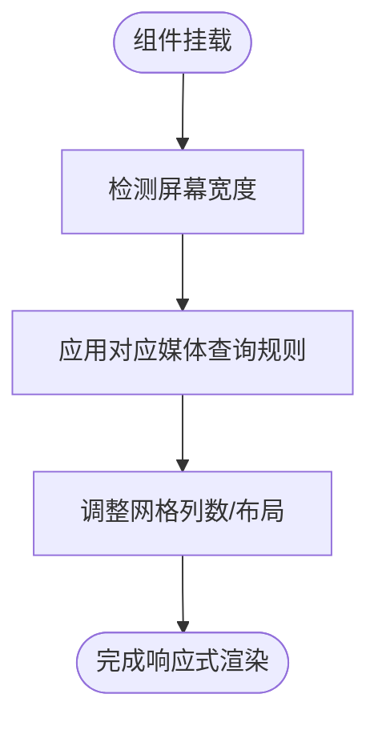
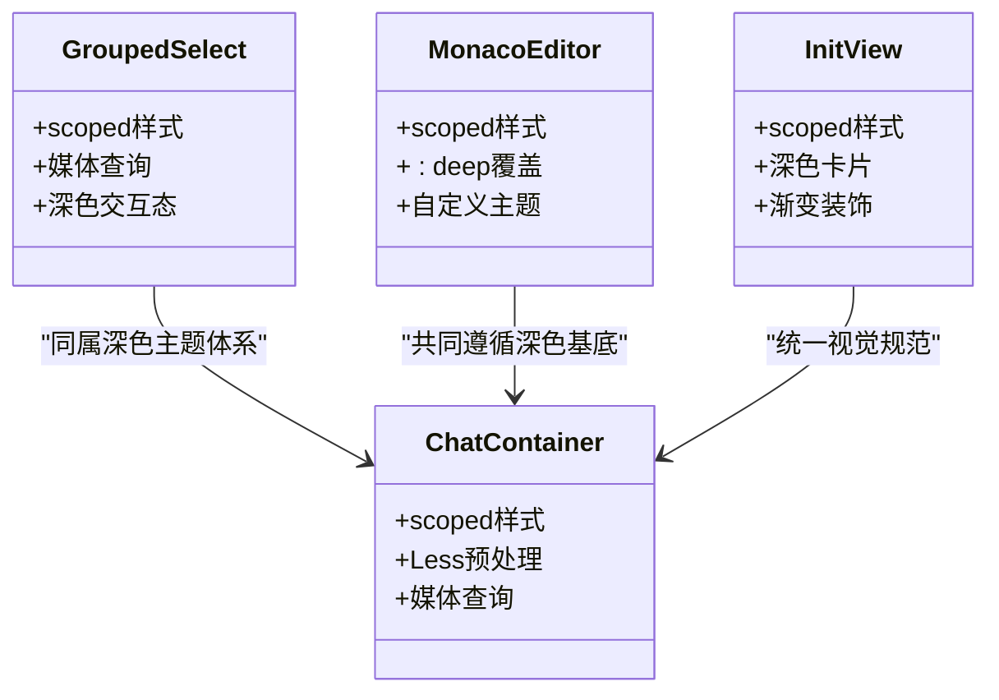
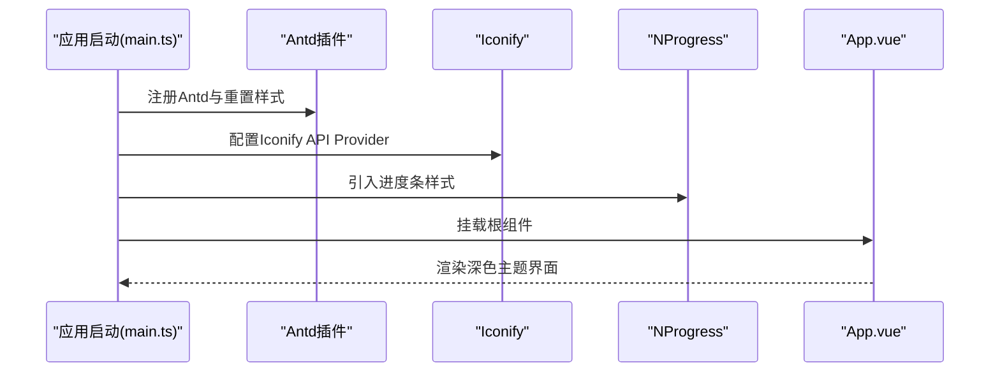
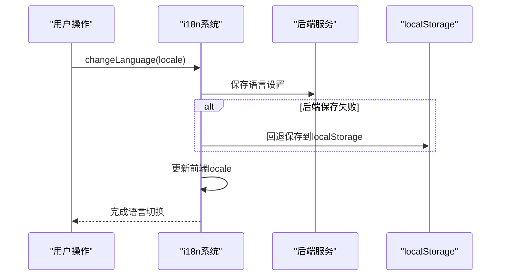
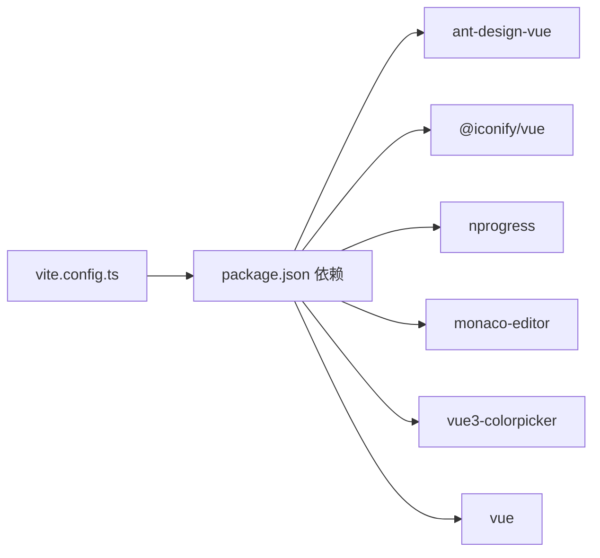

# 主题与样式

<cite>
**本文引用的文件**
- [ui-vue3/src/main.ts](file://ui-vue3/src/main.ts)
- [ui-vue3/vite.config.ts](file://ui-vue3/vite.config.ts)
- [ui-vue3/package.json](file://ui-vue3/package.json)
- [ui-vue3/src/App.vue](file://ui-vue3/src/App.vue)
- [ui-vue3/src/base/i18n/index.ts](file://ui-vue3/src/base/i18n/index.ts)
- [ui-vue3/src/components/GroupedSelect.vue](file://ui-vue3/src/components/GroupedSelect.vue)
- [ui-vue3/src/components/MonacoEditor.vue](file://ui-vue3/src/components/MonacoEditor.vue)
- [ui-vue3/src/components/chat/ChatContainer.vue](file://ui-vue3/src/components/chat/ChatContainer.vue)
- [ui-vue3/src/views/init/index.vue](file://ui-vue3/src/views/init/index.vue)
</cite>

## 目录
1. [简介](#简介)
2. [项目结构](#项目结构)
3. [核心组件](#核心组件)
4. [架构总览](#架构总览)
5. [详细组件分析](#详细组件分析)
6. [依赖关系分析](#依赖关系分析)
7. [性能考量](#性能考量)
8. [故障排查指南](#故障排查指南)
9. [结论](#结论)
10. [附录](#附录)

## 简介
本文件面向Lynxe前端主题与样式系统，聚焦于深色主题实现、颜色体系与视觉规范、响应式设计与移动端适配、组件样式隔离与模块化、样式性能优化、主题定制与品牌化建议，以及与第三方UI库（如Ant Design Vue）的集成与样式冲突治理。文档以Vue 3 + Vite工程为基础，结合源码中的实际样式与主题配置进行说明。

## 项目结构
Lynxe前端位于ui-vue3目录，采用Vue单页应用架构，使用Vite作为构建工具，Ant Design Vue提供基础UI能力，Less用于样式预处理，Monaco Editor提供代码编辑体验。主题与样式相关的关键位置包括：
- 应用根样式与全局滚动条、选择器样式定义在根组件中
- 组件级scoped样式与媒体查询实现响应式布局
- 自定义Monaco编辑器主题以匹配深色主题风格
- 国际化与语言切换逻辑影响文案与布局方向

**图表来源**
- [ui-vue3/src/main.ts:17-56](file://ui-vue3/src/main.ts#L17-L56)
- [ui-vue3/src/App.vue:26-76](file://ui-vue3/src/App.vue#L26-L76)
- [ui-vue3/vite.config.ts:23-70](file://ui-vue3/vite.config.ts#L23-L70)
- [ui-vue3/package.json:28-100](file://ui-vue3/package.json#L28-L100)
- [ui-vue3/src/components/GroupedSelect.vue:187-431](file://ui-vue3/src/components/GroupedSelect.vue#L187-L431)
- [ui-vue3/src/components/MonacoEditor.vue:72-101](file://ui-vue3/src/components/MonacoEditor.vue#L72-L101)
- [ui-vue3/src/components/chat/ChatContainer.vue:297-541](file://ui-vue3/src/components/chat/ChatContainer.vue#L297-L541)
- [ui-vue3/src/views/init/index.vue:500-800](file://ui-vue3/src/views/init/index.vue#L500-L800)
- [ui-vue3/src/base/i18n/index.ts:28-161](file://ui-vue3/src/base/i18n/index.ts#L28-L161)

**章节来源**
- [ui-vue3/src/main.ts:17-56](file://ui-vue3/src/main.ts#L17-L56)
- [ui-vue3/src/App.vue:26-76](file://ui-vue3/src/App.vue#L26-L76)
- [ui-vue3/vite.config.ts:23-70](file://ui-vue3/vite.config.ts#L23-L70)
- [ui-vue3/package.json:28-100](file://ui-vue3/package.json#L28-L100)

## 核心组件
- 应用根样式与深色主题基底：通过根组件设置全局字体、背景与滚动条样式，奠定深色基调。
- 下拉选择组件：实现深色背景、悬停与选中态的颜色与边框，配合媒体查询在小屏设备上自适应网格布局。
- 自定义Monaco编辑器主题：基于vs-dark扩展自定义语法高亮与编辑器背景，确保与整体深色主题一致。
- 聊天容器：自定义滚动条样式，支持流式消息的视觉反馈动画，并在小屏设备上调整内边距与按钮尺寸。
- 初始化视图：深色卡片、模糊背景、渐变装饰元素，营造沉浸式引导体验。
- 国际化与语言切换：维护本地存储语言偏好，初始化时优先从后端获取，回退到localStorage，保证主题与文案一致性。

**章节来源**
- [ui-vue3/src/App.vue:26-76](file://ui-vue3/src/App.vue#L26-L76)
- [ui-vue3/src/components/GroupedSelect.vue:187-431](file://ui-vue3/src/components/GroupedSelect.vue#L187-L431)
- [ui-vue3/src/components/MonacoEditor.vue:72-101](file://ui-vue3/src/components/MonacoEditor.vue#L72-L101)
- [ui-vue3/src/components/chat/ChatContainer.vue:297-541](file://ui-vue3/src/components/chat/ChatContainer.vue#L297-L541)
- [ui-vue3/src/views/init/index.vue:500-800](file://ui-vue3/src/views/init/index.vue#L500-L800)
- [ui-vue3/src/base/i18n/index.ts:28-161](file://ui-vue3/src/base/i18n/index.ts#L28-L161)

## 架构总览
Lynxe的样式架构围绕“深色主题基底 + 组件级样式隔离 + 响应式适配 + 第三方UI库集成”展开。应用启动时引入Ant Design Vue重置样式与图标库，随后加载NProgress与颜色选择器等插件。全局样式在根组件中统一设定，组件内部通过scoped样式与媒体查询实现局部主题与响应式行为。Monaco编辑器通过自定义主题确保代码编辑区与整体风格一致。

**图表来源**
- [ui-vue3/src/main.ts:17-56](file://ui-vue3/src/main.ts#L17-L56)
- [ui-vue3/src/App.vue:26-76](file://ui-vue3/src/App.vue#L26-L76)
- [ui-vue3/src/base/i18n/index.ts:28-161](file://ui-vue3/src/base/i18n/index.ts#L28-L161)
- [ui-vue3/src/components/GroupedSelect.vue:187-431](file://ui-vue3/src/components/GroupedSelect.vue#L187-L431)
- [ui-vue3/src/components/MonacoEditor.vue:72-101](file://ui-vue3/src/components/MonacoEditor.vue#L72-L101)
- [ui-vue3/src/components/chat/ChatContainer.vue:297-541](file://ui-vue3/src/components/chat/ChatContainer.vue#L297-L541)
- [ui-vue3/src/views/init/index.vue:500-800](file://ui-vue3/src/views/init/index.vue#L500-L800)
- [ui-vue3/vite.config.ts:23-70](file://ui-vue3/vite.config.ts#L23-L70)
- [ui-vue3/package.json:28-100](file://ui-vue3/package.json#L28-L100)

## 详细组件分析

### 深色主题与颜色系统
- 全局深色背景与文本：根组件设置body背景为深色，文字为高对比度白色；滚动条与选择器采用半透明白色系，提升可读性与层次感。
- 组件深色基底：下拉选择、编辑器、聊天容器等均采用深色背景与浅色文本，辅以强调色（如强调蓝）用于选中态与交互反馈。
- Monaco编辑器主题：在vs-dark基础上自定义语法高亮与编辑器背景，确保代码片段在深色环境下清晰可读。

**图表来源**
- [ui-vue3/src/App.vue:33-76](file://ui-vue3/src/App.vue#L33-L76)
- [ui-vue3/src/components/MonacoEditor.vue:72-101](file://ui-vue3/src/components/MonacoEditor.vue#L72-L101)

**章节来源**
- [ui-vue3/src/App.vue:33-76](file://ui-vue3/src/App.vue#L33-L76)
- [ui-vue3/src/components/MonacoEditor.vue:72-101](file://ui-vue3/src/components/MonacoEditor.vue#L72-L101)

### 响应式设计与移动端适配
- 组件级媒体查询：下拉选择组件在768px与480px断点调整网格列数；聊天容器在768px断点减少内边距与按钮尺寸；初始化视图在多处断点调整布局与间距。
- 视口与构建路径：Vite配置base为/ui，便于后端静态资源映射；开发服务器开启代理，便于联调后端接口。

**图表来源**
- [ui-vue3/src/components/GroupedSelect.vue:418-431](file://ui-vue3/src/components/GroupedSelect.vue#L418-L431)
- [ui-vue3/src/components/chat/ChatContainer.vue:522-541](file://ui-vue3/src/components/chat/ChatContainer.vue#L522-L541)
- [ui-vue3/src/views/init/index.vue:1146-1233](file://ui-vue3/src/views/init/index.vue#L1146-L1233)
- [ui-vue3/vite.config.ts:24-45](file://ui-vue3/vite.config.ts#L24-L45)

**章节来源**
- [ui-vue3/src/components/GroupedSelect.vue:418-431](file://ui-vue3/src/components/GroupedSelect.vue#L418-L431)
- [ui-vue3/src/components/chat/ChatContainer.vue:522-541](file://ui-vue3/src/components/chat/ChatContainer.vue#L522-L541)
- [ui-vue3/src/views/init/index.vue:1146-1233](file://ui-vue3/src/views/init/index.vue#L1146-L1233)
- [ui-vue3/vite.config.ts:24-45](file://ui-vue3/vite.config.ts#L24-L45)

### 组件样式隔离与CSS模块化
- scoped作用域：各组件样式通过scoped限定作用域，避免全局污染；例如下拉选择、编辑器、聊天容器与初始化视图均采用scoped样式。
- 深度选择器：编辑器组件使用深度选择器(:deep)对Monaco内部DOM进行样式覆盖，确保滚动条、行号、光标等细节与整体风格一致。
- Less预处理：聊天容器使用lang="less"，便于复用变量与嵌套规则，提升维护性。

**图表来源**
- [ui-vue3/src/components/GroupedSelect.vue:187-431](file://ui-vue3/src/components/GroupedSelect.vue#L187-L431)
- [ui-vue3/src/components/MonacoEditor.vue:146-196](file://ui-vue3/src/components/MonacoEditor.vue#L146-L196)
- [ui-vue3/src/components/chat/ChatContainer.vue:297-541](file://ui-vue3/src/components/chat/ChatContainer.vue#L297-L541)
- [ui-vue3/src/views/init/index.vue:500-800](file://ui-vue3/src/views/init/index.vue#L500-L800)

**章节来源**
- [ui-vue3/src/components/GroupedSelect.vue:187-431](file://ui-vue3/src/components/GroupedSelect.vue#L187-L431)
- [ui-vue3/src/components/MonacoEditor.vue:146-196](file://ui-vue3/src/components/MonacoEditor.vue#L146-L196)
- [ui-vue3/src/components/chat/ChatContainer.vue:297-541](file://ui-vue3/src/components/chat/ChatContainer.vue#L297-L541)
- [ui-vue3/src/views/init/index.vue:500-800](file://ui-vue3/src/views/init/index.vue#L500-L800)

### 与第三方UI库的集成与样式冲突治理
- Ant Design Vue：在入口文件引入其重置样式，避免默认样式覆盖应用深色主题；同时注册i18n、路由、颜色选择器等插件。
- 图标与进度条：引入Iconify API Provider与NProgress样式，确保图标与加载状态在深色背景下清晰可见。
- 冲突治理建议：
  - 使用scoped样式与深度选择器(:deep)精准覆盖第三方组件样式。
  - 在根组件统一设置全局字体与背景，避免第三方库默认样式破坏整体风格。
  - 对于需要跨组件共享的主题变量，可在根组件或公共样式中集中管理，减少重复覆盖。

**图表来源**
- [ui-vue3/src/main.ts:17-56](file://ui-vue3/src/main.ts#L17-L56)
- [ui-vue3/src/App.vue:26-76](file://ui-vue3/src/App.vue#L26-L76)

**章节来源**
- [ui-vue3/src/main.ts:17-56](file://ui-vue3/src/main.ts#L17-L56)
- [ui-vue3/src/App.vue:26-76](file://ui-vue3/src/App.vue#L26-L76)

### 主题切换机制与语言联动
- 语言初始化：优先从后端获取语言设置，失败则回退到localStorage，默认中文；成功后更新i18n与本地存储。
- 切换流程：切换语言时尝试保存至后端与localStorage，随后更新前端locale；初始化流程中可重置提示词与代理以匹配新语言。
- 主题一致性：语言切换不影响深色主题基底，但需确保文案与布局方向变化不影响视觉层级与对比度。

**图表来源**
- [ui-vue3/src/base/i18n/index.ts:56-122](file://ui-vue3/src/base/i18n/index.ts#L56-L122)

**章节来源**
- [ui-vue3/src/base/i18n/index.ts:56-122](file://ui-vue3/src/base/i18n/index.ts#L56-L122)

## 依赖关系分析
- 构建与开发：Vite配置base与代理，便于前后端联调；启用CSS与JS源图以便调试。
- 运行时依赖：Ant Design Vue、Iconify、NProgress、Monaco Editor、Vue3 ColorPicker等，均在入口文件中按需引入。
- 样式依赖：Less用于预处理，Antd重置样式确保第三方组件与自定义样式的兼容性。

**图表来源**
- [ui-vue3/vite.config.ts:23-70](file://ui-vue3/vite.config.ts#L23-L70)
- [ui-vue3/package.json:28-100](file://ui-vue3/package.json#L28-L100)

**章节来源**
- [ui-vue3/vite.config.ts:23-70](file://ui-vue3/vite.config.ts#L23-L70)
- [ui-vue3/package.json:28-100](file://ui-vue3/package.json#L28-L100)

## 性能考量
- 源码映射：开发环境启用CSS与JS源图，生产环境保留source map以便问题定位。
- 按需引入：仅在入口文件引入必要插件，避免无谓包体积增长。
- 组件样式隔离：通过scoped与深度选择器减少全局样式冲突，降低重绘成本。
- 媒体查询：在关键组件使用断点优化布局，减少大屏与小屏间的过度渲染。

[本节为通用性能建议，不直接分析具体文件]

## 故障排查指南
- 深色主题异常
  - 检查根组件全局样式是否被覆盖；确认Antd重置样式已正确引入。
  - 若Monaco编辑器主题不生效，检查自定义主题定义与更新选项调用顺序。
- 响应式布局错乱
  - 确认媒体查询断点与组件内样式是否匹配；检查容器宽度与网格列数计算。
- 第三方UI库样式冲突
  - 使用深度选择器(:deep)对目标DOM进行覆盖；避免在全局样式中硬编码第三方组件选择器。
- 语言切换后文案不一致
  - 确认后端语言设置接口可用；检查localStorage键值与i18n初始化流程。

**章节来源**
- [ui-vue3/src/App.vue:26-76](file://ui-vue3/src/App.vue#L26-L76)
- [ui-vue3/src/components/MonacoEditor.vue:72-101](file://ui-vue3/src/components/MonacoEditor.vue#L72-L101)
- [ui-vue3/src/base/i18n/index.ts:128-161](file://ui-vue3/src/base/i18n/index.ts#L128-L161)

## 结论
Lynxe的主题与样式系统以深色为主题基底，通过组件级scoped样式与媒体查询实现响应式适配，结合自定义Monaco编辑器主题与Ant Design Vue集成，形成统一且可扩展的视觉体系。国际化与语言切换流程确保主题与文案的一致性。建议在后续迭代中进一步沉淀主题变量与视觉规范，完善品牌化定制能力，并持续优化第三方库集成与样式冲突治理策略。

[本节为总结性内容，不直接分析具体文件]

## 附录
- 主题定制与品牌化建议
  - 提取主题变量：将常用颜色、字号、间距、圆角等抽象为变量，集中管理于根组件或样式文件。
  - 品牌色彩：在强调色与辅助色层面融入品牌识别，保持与深色基底的高对比度。
  - 可访问性：确保文本与背景的对比度满足WCAG标准，提供高对比度模式开关。
- 样式覆盖方法
  - 使用scoped与深度选择器(:deep)进行精确覆盖；避免全局通配符污染。
  - 对第三方组件的覆盖尽量集中在组件内部，减少对外部的影响。
- 与第三方UI库的集成
  - 优先使用官方提供的主题变量与样式钩子；若需深度定制，采用深度选择器并做好版本升级兼容测试。

[本节为通用指导内容，不直接分析具体文件]