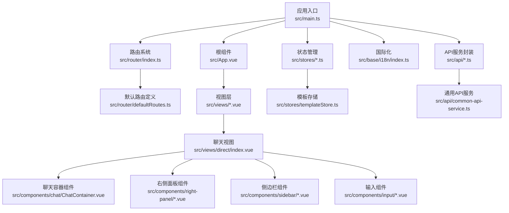
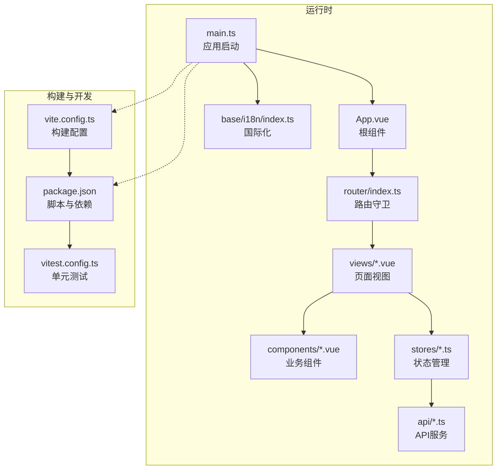
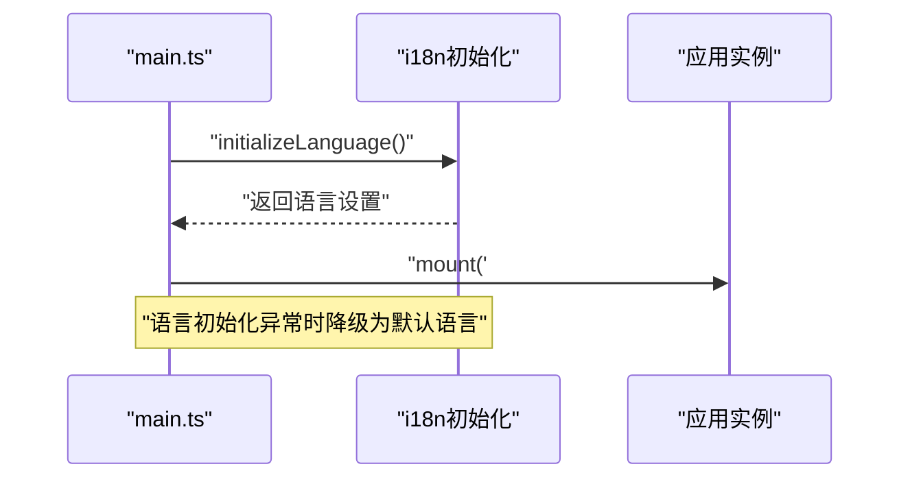
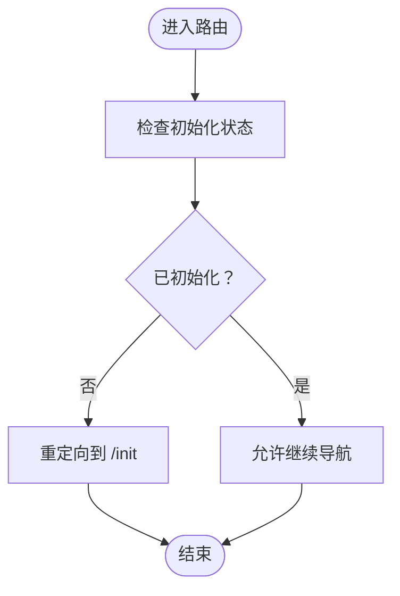
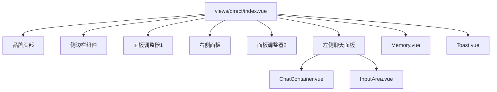
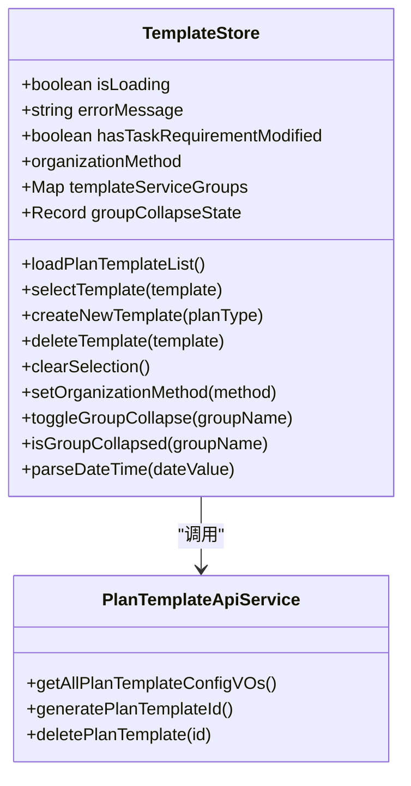
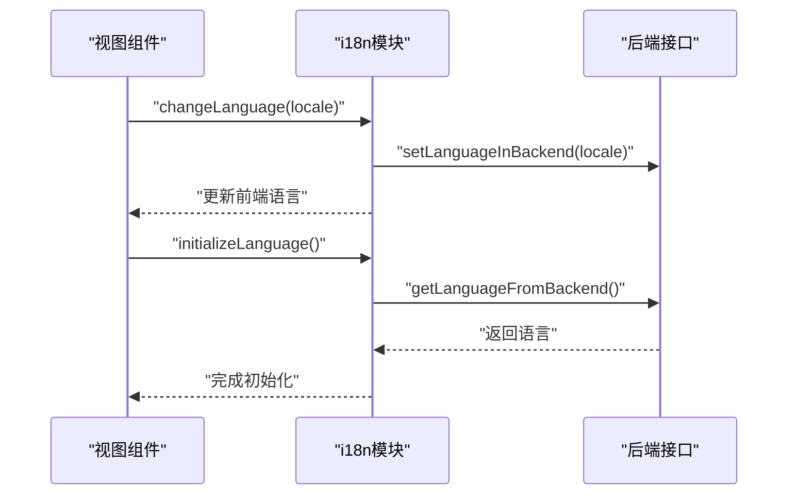
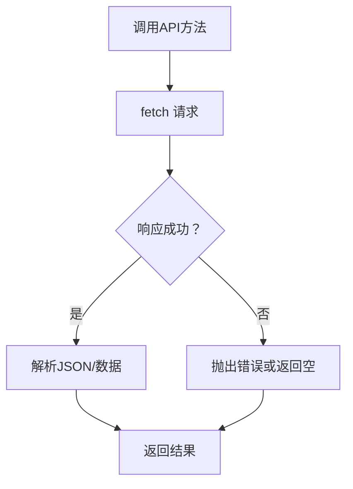
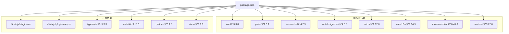

# 前端架构设计

<cite>
**本文档引用的文件**
- [package.json](file://ui-vue3/package.json)
- [vite.config.ts](file://ui-vue3/vite.config.ts)
- [main.ts](file://ui-vue3/src/main.ts)
- [App.vue](file://ui-vue3/src/App.vue)
- [router/index.ts](file://ui-vue3/src/router/index.ts)
- [router/defaultRoutes.ts](file://ui-vue3/src/router/defaultRoutes.ts)
- [tsconfig.json](file://ui-vue3/tsconfig.json)
- [views/direct/index.vue](file://ui-vue3/src/views/direct/index.vue)
- [components/chat/ChatContainer.vue](file://ui-vue3/src/components/chat/ChatContainer.vue)
- [stores/templateStore.ts](file://ui-vue3/src/stores/templateStore.ts)
- [api/common-api-service.ts](file://ui-vue3/src/api/common-api-service.ts)
- [composables/useRequest.ts](file://ui-vue3/src/composables/useRequest.ts)
- [base/i18n/index.ts](file://ui-vue3/src/base/i18n/index.ts)
- [vitest.config.ts](file://ui-vue3/vitest.config.ts)
</cite>

## 目录
1. [引言](#引言)
2. [项目结构](#项目结构)
3. [核心组件](#核心组件)
4. [架构总览](#架构总览)
5. [详细组件分析](#详细组件分析)
6. [依赖关系分析](#依赖关系分析)
7. [性能考虑](#性能考虑)
8. [故障排除指南](#故障排除指南)
9. [结论](#结论)
10. [附录](#附录)

## 引言
本文件面向Lynxe前端架构设计，聚焦于基于Vue.js 3的单页应用（SPA）整体架构与实现细节。文档从应用入口、路由系统、状态管理、国际化、API封装、组件层次结构、构建与开发工具链等维度进行系统性梳理，并结合实际源码路径给出可视化图示与实操建议，帮助开发者快速理解并高效扩展前端能力。

## 项目结构
前端位于ui-vue3目录，采用Vite作为构建工具，使用TypeScript与Vue 3 Composition API，配合Pinia进行状态管理、Ant Design Vue提供UI基础组件、vue-router负责路由导航。项目通过别名@指向src目录，便于模块化组织与导入。

**图表来源**
- [main.ts:1-57](file://ui-vue3/src/main.ts#L1-L57)
- [App.vue:1-77](file://ui-vue3/src/App.vue#L1-L77)
- [router/index.ts:1-62](file://ui-vue3/src/router/index.ts#L1-L62)
- [router/defaultRoutes.ts:1-109](file://ui-vue3/src/router/defaultRoutes.ts#L1-L109)
- [views/direct/index.vue:1-881](file://ui-vue3/src/views/direct/index.vue#L1-L881)
- [components/chat/ChatContainer.vue:1-541](file://ui-vue3/src/components/chat/ChatContainer.vue#L1-L541)
- [stores/templateStore.ts:1-437](file://ui-vue3/src/stores/templateStore.ts#L1-L437)
- [api/common-api-service.ts:1-149](file://ui-vue3/src/api/common-api-service.ts#L1-L149)

**章节来源**
- [package.json:1-100](file://ui-vue3/package.json#L1-L100)
- [vite.config.ts:1-71](file://ui-vue3/vite.config.ts#L1-L71)
- [tsconfig.json:1-15](file://ui-vue3/tsconfig.json#L1-L15)

## 核心组件
- 应用入口与插件注册：在入口文件中完成Pinia、Ant Design Vue、国际化、路由等插件的安装与初始化，并在语言初始化完成后挂载应用。
- 路由系统：采用Hash模式，结合全局前置守卫实现初始化检查与页面跳转控制。
- 视图与组件：以视图为单位组织页面布局，组件按功能拆分，如聊天容器、输入区、侧边栏、右侧面板等。
- 状态管理：使用Pinia进行模块化状态管理，模板存储负责计划模板列表与分组排序逻辑。
- 国际化：基于vue-i18n实现多语言切换，支持后端与本地存储双通道持久化。
- API封装：统一的API服务类提供版本查询、执行记录获取、表单提交等方法，集中处理错误与响应格式。

**章节来源**
- [main.ts:16-57](file://ui-vue3/src/main.ts#L16-L57)
- [router/index.ts:17-62](file://ui-vue3/src/router/index.ts#L17-L62)
- [router/defaultRoutes.ts:17-109](file://ui-vue3/src/router/defaultRoutes.ts#L17-L109)
- [views/direct/index.vue:104-628](file://ui-vue3/src/views/direct/index.vue#L104-L628)
- [components/chat/ChatContainer.vue:125-295](file://ui-vue3/src/components/chat/ChatContainer.vue#L125-L295)
- [stores/templateStore.ts:23-241](file://ui-vue3/src/stores/templateStore.ts#L23-L241)
- [base/i18n/index.ts:17-161](file://ui-vue3/src/base/i18n/index.ts#L17-L161)
- [api/common-api-service.ts:21-149](file://ui-vue3/src/api/common-api-service.ts#L21-L149)

## 架构总览
下图展示前端从入口到视图、组件、状态与API的交互关系，以及国际化与路由的协作方式。

**图表来源**
- [main.ts:16-57](file://ui-vue3/src/main.ts#L16-L57)
- [App.vue:16-24](file://ui-vue3/src/App.vue#L16-L24)
- [router/index.ts:17-62](file://ui-vue3/src/router/index.ts#L17-L62)
- [views/direct/index.vue:104-628](file://ui-vue3/src/views/direct/index.vue#L104-L628)
- [stores/templateStore.ts:23-241](file://ui-vue3/src/stores/templateStore.ts#L23-L241)
- [api/common-api-service.ts:21-149](file://ui-vue3/src/api/common-api-service.ts#L21-L149)
- [base/i18n/index.ts:17-161](file://ui-vue3/src/base/i18n/index.ts#L17-L161)
- [vite.config.ts:16-71](file://ui-vue3/vite.config.ts#L16-L71)
- [package.json:6-27](file://ui-vue3/package.json#L6-L27)
- [vitest.config.ts:17-31](file://ui-vue3/vitest.config.ts#L17-L31)

## 详细组件分析

### 应用入口与初始化流程
应用入口负责插件安装、国际化初始化与应用挂载。国际化初始化优先尝试从后端获取语言设置，失败则回退至本地存储或默认值；随后挂载应用，确保消息对话与计划执行等单例在任何路由下均可正常工作。

**图表来源**
- [main.ts:42-57](file://ui-vue3/src/main.ts#L42-L57)
- [base/i18n/index.ts:128-160](file://ui-vue3/src/base/i18n/index.ts#L128-L160)

**章节来源**
- [main.ts:16-57](file://ui-vue3/src/main.ts#L16-L57)
- [base/i18n/index.ts:17-161](file://ui-vue3/src/base/i18n/index.ts#L17-L161)

### 路由系统与全局守卫
路由采用Hash模式，基础路径为/ui。全局前置守卫在每次导航前检查系统初始化状态：若未初始化则重定向至初始化页面；若已初始化则保存状态至本地存储。该机制保证用户始终处于正确的引导流程。

**图表来源**
- [router/index.ts:26-61](file://ui-vue3/src/router/index.ts#L26-L61)
- [router/defaultRoutes.ts:28-82](file://ui-vue3/src/router/defaultRoutes.ts#L28-L82)

**章节来源**
- [router/index.ts:17-62](file://ui-vue3/src/router/index.ts#L17-L62)
- [router/defaultRoutes.ts:17-109](file://ui-vue3/src/router/defaultRoutes.ts#L17-L109)

### 视图与组件层次
direct视图作为主界面，包含品牌头部、侧边栏、右侧配置/预览面板与聊天区域。聊天容器负责消息渲染、滚动行为与复制/重试占位逻辑；输入区与记忆选择器分别处理用户输入与历史会话恢复。

**图表来源**
- [views/direct/index.vue:19-102](file://ui-vue3/src/views/direct/index.vue#L19-L102)
- [components/chat/ChatContainer.vue:16-123](file://ui-vue3/src/components/chat/ChatContainer.vue#L16-L123)

**章节来源**
- [views/direct/index.vue:104-628](file://ui-vue3/src/views/direct/index.vue#L104-L628)
- [components/chat/ChatContainer.vue:125-295](file://ui-vue3/src/components/chat/ChatContainer.vue#L125-L295)

### 状态管理与模板存储
模板存储负责计划模板列表的加载、分组与排序，同时维护分组折叠状态与组织方式。其内部通过单例访问模板配置，避免重复请求与状态分散。

**图表来源**
- [stores/templateStore.ts:23-241](file://ui-vue3/src/stores/templateStore.ts#L23-L241)
- [stores/templateStore.ts:134-167](file://ui-vue3/src/stores/templateStore.ts#L134-L167)

**章节来源**
- [stores/templateStore.ts:1-437](file://ui-vue3/src/stores/templateStore.ts#L1-L437)

### 国际化与语言切换
国际化模块支持从后端获取语言设置，若失败则回退至本地存储或默认值；同时提供语言切换方法，可在初始化阶段重置提示词与代理初始化。

**图表来源**
- [base/i18n/index.ts:56-160](file://ui-vue3/src/base/i18n/index.ts#L56-L160)

**章节来源**
- [base/i18n/index.ts:17-161](file://ui-vue3/src/base/i18n/index.ts#L17-L161)

### API封装与请求执行
通用API服务封装了执行详情查询、删除、表单提交与版本信息获取等方法，统一处理HTTP状态码与JSON解析；组合式函数useRequest提供加载状态与错误日志的统一处理。

**图表来源**
- [api/common-api-service.ts:21-149](file://ui-vue3/src/api/common-api-service.ts#L21-L149)
- [composables/useRequest.ts:4-40](file://ui-vue3/src/composables/useRequest.ts#L4-L40)

**章节来源**
- [api/common-api-service.ts:1-149](file://ui-vue3/src/api/common-api-service.ts#L1-L149)
- [composables/useRequest.ts:1-40](file://ui-vue3/src/composables/useRequest.ts#L1-L40)

## 依赖关系分析
前端依赖以Vue 3为核心，搭配Ant Design Vue、Pinia、vue-router、axios、marked、monaco-editor等生态库；构建工具链由Vite主导，TypeScript提供类型安全，ESLint与Prettier保障代码质量。

**图表来源**
- [package.json:28-98](file://ui-vue3/package.json#L28-L98)

**章节来源**
- [package.json:1-100](file://ui-vue3/package.json#L1-L100)

## 性能考虑
- 代码分割与懒加载：路由与视图普遍采用动态导入实现按需加载，减少首屏体积。
- 组件职责分离：聊天容器仅负责展示，消息处理与滚动行为通过组合式函数解耦，降低组件复杂度。
- 状态集中管理：模板存储统一管理模板列表与分组状态，避免重复请求与状态分散。
- 源码映射：生产构建开启source map便于问题定位，开发构建启用CSS source map提升调试体验。
- 依赖锁定与覆盖：通过pnpm overrides固定关键依赖版本，减少兼容性问题。

**章节来源**
- [router/defaultRoutes.ts:49-71](file://ui-vue3/src/router/defaultRoutes.ts#L49-L71)
- [components/chat/ChatContainer.vue:125-295](file://ui-vue3/src/components/chat/ChatContainer.vue#L125-L295)
- [stores/templateStore.ts:134-167](file://ui-vue3/src/stores/templateStore.ts#L134-L167)
- [vite.config.ts:25-31](file://ui-vue3/vite.config.ts#L25-L31)
- [package.json:86-98](file://ui-vue3/package.json#L86-L98)

## 故障排除指南
- 初始化检查失败：路由守卫在无法获取后端状态时回退至本地存储判断，若仍失败则保持在当前页面。可检查后端初始化接口与网络代理配置。
- 语言初始化异常：国际化初始化失败会降级为默认语言并继续挂载应用。建议检查后端语言接口与本地存储权限。
- API请求失败：通用API服务对非2xx响应抛出错误并记录日志，调用方应捕获并提示用户。可结合浏览器网络面板与后端日志排查。
- 单元测试环境：Vitest使用jsdom环境，测试范围排除E2E目录，确保测试隔离与速度。

**章节来源**
- [router/index.ts:48-59](file://ui-vue3/src/router/index.ts#L48-L59)
- [base/i18n/index.ts:141-160](file://ui-vue3/src/base/i18n/index.ts#L141-L160)
- [api/common-api-service.ts:32-53](file://ui-vue3/src/api/common-api-service.ts#L32-L53)
- [vitest.config.ts:24-30](file://ui-vue3/vitest.config.ts#L24-L30)

## 结论
Lynxe前端采用模块化、组件化的架构设计，结合Vue 3 Composition API与Pinia实现清晰的状态管理与职责分离；路由系统通过全局守卫保障初始化流程；国际化与API封装提升了跨模块一致性与可维护性。配合Vite构建工具链与完善的开发脚本，前端具备良好的开发体验与可扩展性。

## 附录
- 开发命令速查
  - 启动开发服务器：`pnpm dev`
  - 预览生产构建：`pnpm preview`
  - 单元测试：`pnpm test:unit`
  - E2E测试：`pnpm test:e2e` 或 `pnpm test:e2e:dev`
  - 类型检查：`pnpm type-check` / `pnpm type-check:watch`
  - 代码格式化：`pnpm format`
  - ESLint检查：`pnpm lint:check`
- 构建配置要点
  - 基础路径：`/ui`
  - 输出目录：`./ui`
  - 开发代理：将`/api`与`/admin`转发至后端服务
  - 别名：`@` 指向 `src`

**章节来源**
- [package.json:6-27](file://ui-vue3/package.json#L6-L27)
- [vite.config.ts:24-45](file://ui-vue3/vite.config.ts#L24-L45)