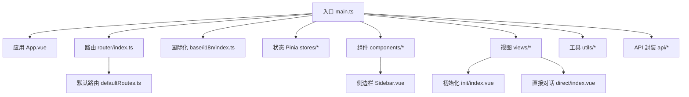
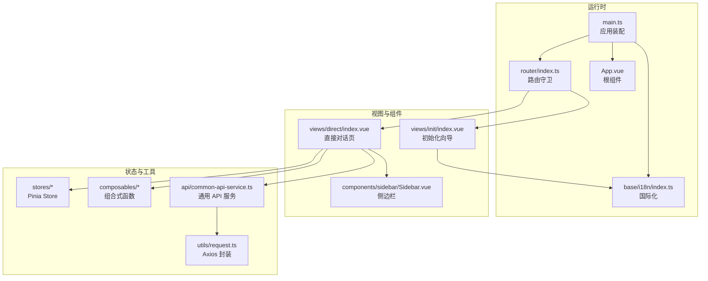
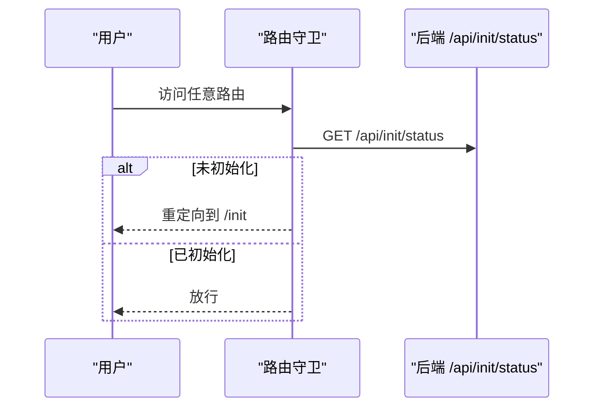
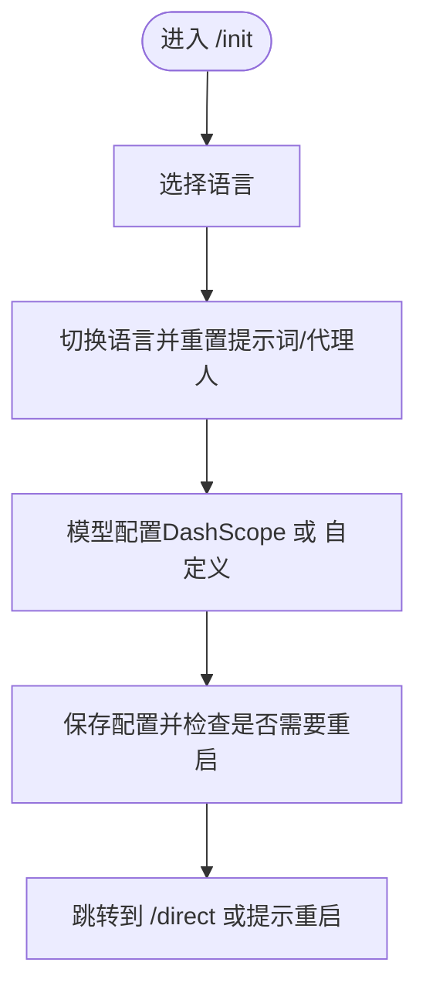
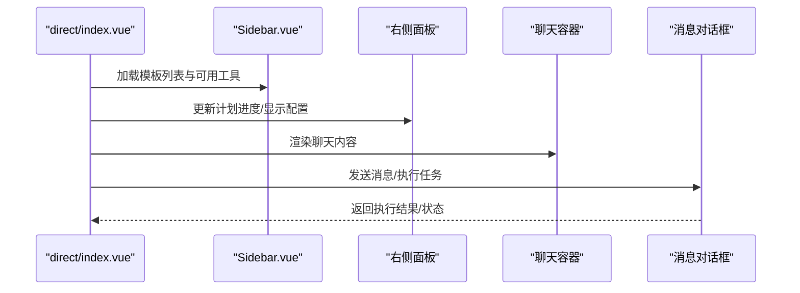
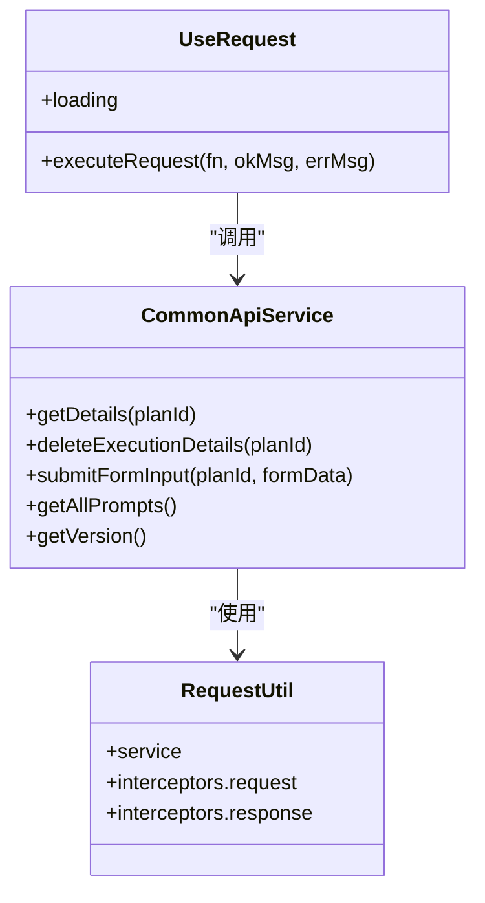
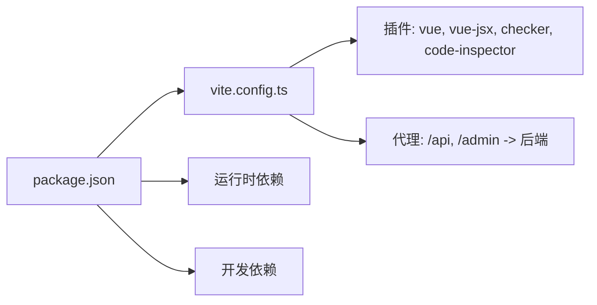

# 前端界面

<cite>
**本文引用的文件**   
- [package.json](file://ui-vue3/package.json)
- [main.ts](file://ui-vue3/src/main.ts)
- [vite.config.ts](file://ui-vue3/vite.config.ts)
- [router/index.ts](file://ui-vue3/src/router/index.ts)
- [router/defaultRoutes.ts](file://ui-vue3/src/router/defaultRoutes.ts)
- [App.vue](file://ui-vue3/src/App.vue)
- [base/i18n/index.ts](file://ui-vue3/src/base/i18n/index.ts)
- [composables/useRequest.ts](file://ui-vue3/src/composables/useRequest.ts)
- [views/init/index.vue](file://ui-vue3/src/views/init/index.vue)
- [views/direct/index.vue](file://ui-vue3/src/views/direct/index.vue)
- [components/sidebar/Sidebar.vue](file://ui-vue3/src/components/sidebar/Sidebar.vue)
- [api/common-api-service.ts](file://ui-vue3/src/api/common-api-service.ts)
- [utils/request.ts](file://ui-vue3/src/utils/request.ts)
</cite>

## 目录
1. [简介](#简介)
2. [项目结构](#项目结构)
3. [核心组件](#核心组件)
4. [架构总览](#架构总览)
5. [组件详解](#组件详解)
6. [依赖关系分析](#依赖关系分析)
7. [性能考量](#性能考量)
8. [故障排查指南](#故障排查指南)
9. [结论](#结论)
10. [附录](#附录)

## 简介
本文件面向 Lynxe 前端界面，系统化梳理基于 Vue 3 的前端架构与实现细节，覆盖路由配置、状态管理、组件层次、国际化、主题与可访问性、前后端集成、数据绑定与异步处理、开发与构建流程以及部署策略等。文档以“渐进式复杂度”呈现，既适合初学者理解整体结构，也便于资深开发者深入分析具体模块。

## 项目结构
前端位于 ui-vue3 目录，采用 Vite + Vue 3 + TypeScript 技术栈，使用 Pinia 进行状态管理，Ant Design Vue 提供基础 UI 组件库，配合自定义组件与业务视图构成完整的交互界面。

图表来源
- [main.ts:1-57](file://ui-vue3/src/main.ts#L1-L57)
- [App.vue:1-77](file://ui-vue3/src/App.vue#L1-L77)
- [router/index.ts:1-62](file://ui-vue3/src/router/index.ts#L1-L62)
- [router/defaultRoutes.ts:1-109](file://ui-vue3/src/router/defaultRoutes.ts#L1-L109)
- [base/i18n/index.ts:1-161](file://ui-vue3/src/base/i18n/index.ts#L1-L161)

章节来源
- [package.json:1-100](file://ui-vue3/package.json#L1-L100)
- [vite.config.ts:1-71](file://ui-vue3/vite.config.ts#L1-L71)
- [main.ts:1-57](file://ui-vue3/src/main.ts#L1-L57)

## 核心组件
- 应用入口与插件注册：在入口中完成 Pinia、Vue Router、Ant Design Vue、国际化、颜色选择器等插件的安装与全局样式引入，并在挂载前完成语言初始化。
- 路由系统：采用 Hash 模式，结合全局前置守卫进行系统初始化检查；默认路由表按模块化组织，支持懒加载视图组件。
- 国际化：基于 vue-i18n，支持本地存储与后端双通道语言持久化，提供切换语言并重置提示词与代理人的能力。
- 视图层：初始化页面负责引导用户完成语言与模型配置；直接对话页提供三栏布局（模板/配置预览、侧边栏、聊天面板），并内置面板拖拽调整宽度。
- 组件层：通用组件如侧边栏、输入区、编辑器、模态框等，均通过组合式函数与 Pinia Store 解耦业务逻辑。
- 工具与 API：统一的请求封装与通用 API 服务，提供版本查询、执行记录详情、表单提交等能力。

章节来源
- [main.ts:17-57](file://ui-vue3/src/main.ts#L17-L57)
- [router/index.ts:26-61](file://ui-vue3/src/router/index.ts#L26-L61)
- [router/defaultRoutes.ts:28-82](file://ui-vue3/src/router/defaultRoutes.ts#L28-L82)
- [base/i18n/index.ts:42-160](file://ui-vue3/src/base/i18n/index.ts#L42-L160)
- [views/init/index.vue:1-800](file://ui-vue3/src/views/init/index.vue#L1-L800)
- [views/direct/index.vue:1-881](file://ui-vue3/src/views/direct/index.vue#L1-L881)
- [components/sidebar/Sidebar.vue:1-327](file://ui-vue3/src/components/sidebar/Sidebar.vue#L1-L327)
- [api/common-api-service.ts:21-148](file://ui-vue3/src/api/common-api-service.ts#L21-L148)
- [utils/request.ts:26-64](file://ui-vue3/src/utils/request.ts#L26-L64)

## 架构总览
前端采用“入口装配 + 路由驱动 + 组合式函数 + Pinia Store”的分层架构。入口负责插件与全局初始化；路由负责页面级导航与守卫；视图与组件负责交互与展示；API 层负责与后端通信；工具层提供通用能力。

图表来源
- [main.ts:17-57](file://ui-vue3/src/main.ts#L17-L57)
- [router/index.ts:17-61](file://ui-vue3/src/router/index.ts#L17-L61)
- [base/i18n/index.ts:42-160](file://ui-vue3/src/base/i18n/index.ts#L42-L160)
- [views/init/index.vue:1-800](file://ui-vue3/src/views/init/index.vue#L1-L800)
- [views/direct/index.vue:1-881](file://ui-vue3/src/views/direct/index.vue#L1-L881)
- [components/sidebar/Sidebar.vue:1-327](file://ui-vue3/src/components/sidebar/Sidebar.vue#L1-L327)
- [api/common-api-service.ts:21-148](file://ui-vue3/src/api/common-api-service.ts#L21-L148)
- [utils/request.ts:26-64](file://ui-vue3/src/utils/request.ts#L26-L64)

## 组件详解

### 路由与导航
- 历史模式：使用 Hash 模式，路径前缀为 /ui，适配后端静态资源映射。
- 全局守卫：在进入任意路由前检查系统初始化状态，未初始化则跳转到初始化页；成功初始化后写入本地缓存。
- 默认路由：首页重定向至初始化或直接对话页；提供错误页兜底。

图表来源
- [router/index.ts:26-61](file://ui-vue3/src/router/index.ts#L26-L61)

章节来源
- [router/index.ts:17-61](file://ui-vue3/src/router/index.ts#L17-L61)
- [router/defaultRoutes.ts:28-82](file://ui-vue3/src/router/defaultRoutes.ts#L28-L82)

### 初始化流程与国际化
- 初始化页提供两步流程：语言选择与模型配置；支持 DashScope 与自定义兼容 OpenAI 的模式。
- 国际化：启动时优先从后端获取语言设置，失败回退到本地存储；支持切换语言并重置提示词与代理人，保证多语言一致性。

图表来源
- [views/init/index.vue:344-470](file://ui-vue3/src/views/init/index.vue#L344-L470)
- [base/i18n/index.ts:56-122](file://ui-vue3/src/base/i18n/index.ts#L56-L122)

章节来源
- [views/init/index.vue:1-800](file://ui-vue3/src/views/init/index.vue#L1-L800)
- [base/i18n/index.ts:42-160](file://ui-vue3/src/base/i18n/index.ts#L42-L160)

### 直接对话页布局与交互
- 布局：三栏结构（模板/配置预览、侧边栏、聊天面板），支持拖拽调整宽度并持久化。
- 交互：监听计划执行记录变化，动态更新配置/预览面板进度；支持记忆选择、新会话、定时任务等操作。
- 面板尺寸：提供双面板拖拽与双击重置功能，尺寸保存于本地存储。

图表来源
- [views/direct/index.vue:156-387](file://ui-vue3/src/views/direct/index.vue#L156-L387)
- [components/sidebar/Sidebar.vue:90-93](file://ui-vue3/src/components/sidebar/Sidebar.vue#L90-L93)

章节来源
- [views/direct/index.vue:1-881](file://ui-vue3/src/views/direct/index.vue#L1-L881)
- [components/sidebar/Sidebar.vue:1-327](file://ui-vue3/src/components/sidebar/Sidebar.vue#L1-L327)

### 侧边栏组件
- 职责：承载模板列表、新建模板、工具加载与右侧面板联动。
- 生命周期：挂载时加载模板与可用工具；暴露方法供父组件调用。
- 交互：点击新建模板后自动切换到配置标签页并刷新工具列表。

章节来源
- [components/sidebar/Sidebar.vue:50-100](file://ui-vue3/src/components/sidebar/Sidebar.vue#L50-L100)

### 请求与 API 封装
- 通用 API 服务：封装执行记录详情、删除、表单提交、提示词列表、版本信息等接口。
- Axios 封装：统一请求拦截器与响应拦截器，对请求体序列化、统一 Content-Type、统一封装响应校验与错误处理。
- useRequest 组合式函数：提供统一的 loading 状态与错误日志，便于在组件中复用。

图表来源
- [api/common-api-service.ts:21-148](file://ui-vue3/src/api/common-api-service.ts#L21-L148)
- [utils/request.ts:26-64](file://ui-vue3/src/utils/request.ts#L26-L64)
- [composables/useRequest.ts:4-39](file://ui-vue3/src/composables/useRequest.ts#L4-L39)

章节来源
- [api/common-api-service.ts:1-149](file://ui-vue3/src/api/common-api-service.ts#L1-L149)
- [utils/request.ts:1-65](file://ui-vue3/src/utils/request.ts#L1-L65)
- [composables/useRequest.ts:1-40](file://ui-vue3/src/composables/useRequest.ts#L1-L40)

## 依赖关系分析
- 依赖管理：使用 pnpm 并通过 overrides 约束关键包版本，确保兼容性。
- 开发工具链：Vite 提供开发服务器与代理；ESLint/Prettier/Vitest/Cypress 等保障代码质量与测试覆盖。
- 运行时依赖：Ant Design Vue、vue-i18n、Monaco Editor、NProgress、highlight.js、axios、dayjs 等。

图表来源
- [package.json:28-98](file://ui-vue3/package.json#L28-L98)
- [vite.config.ts:16-70](file://ui-vue3/vite.config.ts#L16-L70)

章节来源
- [package.json:1-100](file://ui-vue3/package.json#L1-L100)
- [vite.config.ts:1-71](file://ui-vue3/vite.config.ts#L1-L71)

## 性能考量
- 懒加载与按需加载：路由与视图组件均采用动态导入，减少首屏体积。
- 资源优化：生产构建开启 Source Map；CSS 开启 Source Map；开发服务器启用自动打开浏览器与外网访问。
- 交互优化：NProgress 提供加载进度反馈；滚动条与选择样式优化提升可读性。
- 可访问性：组件使用语义化标签与可聚焦元素，避免仅用视觉提示；图标使用语义化名称。

章节来源
- [router/defaultRoutes.ts:48-58](file://ui-vue3/src/router/defaultRoutes.ts#L48-L58)
- [vite.config.ts:24-45](file://ui-vue3/vite.config.ts#L24-L45)
- [App.vue:49-76](file://ui-vue3/src/App.vue#L49-L76)

## 故障排查指南
- 初始化失败：检查 /api/init/status 与 /api/init/save 接口连通性；确认浏览器控制台网络错误与后端日志。
- 语言切换异常：确认后端语言接口与本地存储键值；若后端不可用，前端会回退到本地存储。
- 面板拖拽失效：检查事件监听是否正确绑定与解绑；确认本地存储读取与写入。
- 请求失败：查看 Axios 拦截器输出；核对 /api 前缀与代理配置；关注响应状态码与错误信息。

章节来源
- [views/init/index.vue:424-470](file://ui-vue3/src/views/init/index.vue#L424-L470)
- [base/i18n/index.ts:128-160](file://ui-vue3/src/base/i18n/index.ts#L128-L160)
- [views/direct/index.vue:390-555](file://ui-vue3/src/views/direct/index.vue#L390-L555)
- [utils/request.ts:33-63](file://ui-vue3/src/utils/request.ts#L33-L63)

## 结论
Lynxe 前端以清晰的分层架构与模块化设计实现了良好的可维护性与扩展性。通过路由守卫、国际化、统一 API 封装与组合式函数，前端在复杂交互场景下仍保持高内聚低耦合。建议后续持续完善测试覆盖、增强主题与无障碍支持，并在 CI 中强化类型检查与格式化校验。

## 附录

### 开发与构建
- 开发命令：dev（Vite）、dev:server（Spring Boot）、dev:strict（严格模式）
- 构建命令：build（类型检查 + 打包）、preview（预览）
- 测试命令：test:unit（单元测试）、test:e2e / test:e2e:dev（端到端测试）
- 质量工具：lint（ESLint 自动修复）、format（Prettier 格式化）

章节来源
- [package.json:6-27](file://ui-vue3/package.json#L6-L27)

### 部署策略
- 构建产物：Vite 输出目录为 ./ui，基础路径为 /ui，需确保后端静态资源映射一致。
- 代理配置：开发环境通过 Vite 代理 /api 与 /admin 到后端；生产环境由后端统一反向代理前端静态资源。

章节来源
- [vite.config.ts:24-45](file://ui-vue3/vite.config.ts#L24-L45)