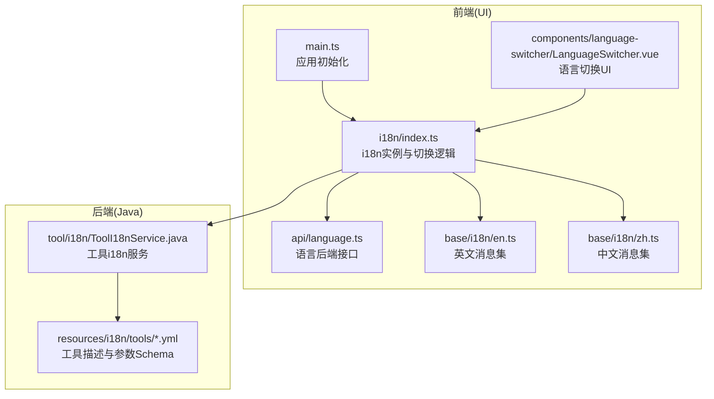
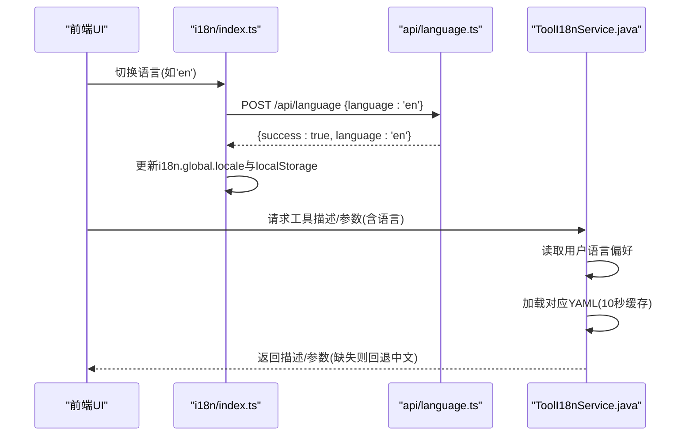
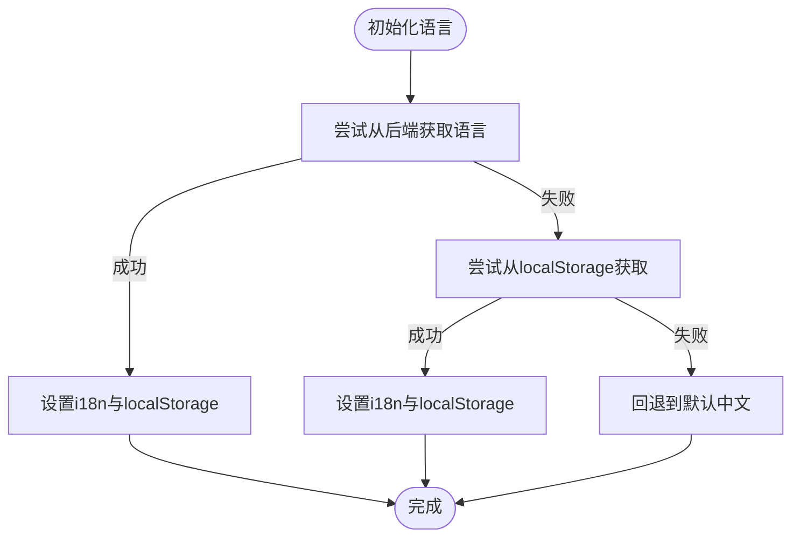
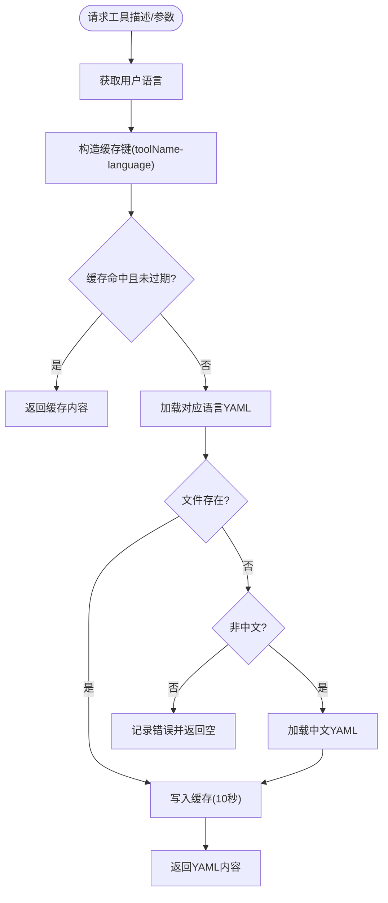
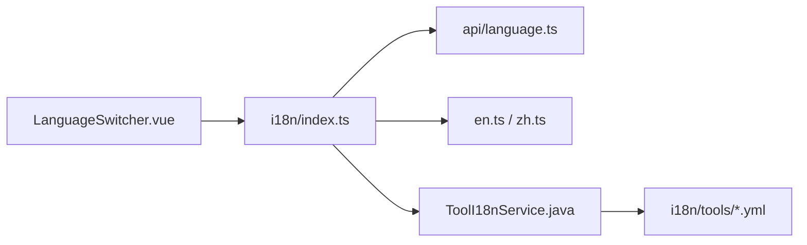

# 国际化支持

<cite>
**本文引用的文件**
- [ToolI18nService.java](file://src/main/java/com/alibaba/cloud/ai/lynxe/tool/i18n/ToolI18nService.java)
- [index.ts](file://ui-vue3/src/base/i18n/index.ts)
- [en.ts](file://ui-vue3/src/base/i18n/en.ts)
- [zh.ts](file://ui-vue3/src/base/i18n/zh.ts)
- [language.ts](file://ui-vue3/src/api/language.ts)
- [LanguageSwitcher.vue](file://ui-vue3/src/components/language-switcher/LanguageSwitcher.vue)
- [bash-en.yml](file://src/main/resources/i18n/tools/bash-en.yml)
- [bash-zh.yml](file://src/main/resources/i18n/tools/bash-zh.yml)
- [main.ts](file://ui-vue3/src/main.ts)
- [application.yml](file://src/main/resources/application.yml)
</cite>

## 目录
1. [简介](#简介)
2. [项目结构](#项目结构)
3. [核心组件](#核心组件)
4. [架构总览](#架构总览)
5. [详细组件分析](#详细组件分析)
6. [依赖分析](#依赖分析)
7. [性能考量](#性能考量)
8. [故障排查指南](#故障排查指南)
9. [结论](#结论)
10. [附录](#附录)

## 简介
本文件面向Lynxe国际化支持系统，系统性梳理前后端i18n架构与实现机制，涵盖语言包结构、翻译键值管理、动态语言切换、工具描述与参数的动态加载、语言检测与默认策略、以及与后端配置的集成与动态资源加载。文档同时提供最佳实践、维护建议与性能优化策略，帮助开发者高效扩展与维护多语言能力。

## 项目结构
Lynxe的国际化能力由前端Vue i18n与后端工具描述i18n两部分组成：
- 前端：基于vue-i18n的静态消息集与动态语言切换组件，支持本地持久化与后端同步。
- 后端：基于SnakeYAML的工具描述与参数Schema动态加载，结合用户语言偏好提供对应语言的工具元信息。

**图表来源**
- [main.ts:48-56](file://ui-vue3/src/main.ts#L48-L56)
- [index.ts:42-50](file://ui-vue3/src/base/i18n/index.ts#L42-L50)
- [language.ts:35-82](file://ui-vue3/src/api/language.ts#L35-L82)
- [LanguageSwitcher.vue:70-129](file://ui-vue3/src/components/language-switcher/LanguageSwitcher.vue#L70-L129)
- [ToolI18nService.java:34-77](file://src/main/java/com/alibaba/cloud/ai/lynxe/tool/i18n/ToolI18nService.java#L34-L77)
- [bash-en.yml:1-33](file://src/main/resources/i18n/tools/bash-en.yml#L1-L33)
- [bash-zh.yml:1-33](file://src/main/resources/i18n/tools/bash-zh.yml#L1-L33)

**章节来源**
- [main.ts:48-56](file://ui-vue3/src/main.ts#L48-L56)
- [index.ts:42-50](file://ui-vue3/src/base/i18n/index.ts#L42-L50)
- [language.ts:35-82](file://ui-vue3/src/api/language.ts#L35-L82)
- [LanguageSwitcher.vue:70-129](file://ui-vue3/src/components/language-switcher/LanguageSwitcher.vue#L70-L129)
- [ToolI18nService.java:34-77](file://src/main/java/com/alibaba/cloud/ai/lynxe/tool/i18n/ToolI18nService.java#L34-L77)
- [bash-en.yml:1-33](file://src/main/resources/i18n/tools/bash-en.yml#L1-L33)
- [bash-zh.yml:1-33](file://src/main/resources/i18n/tools/bash-zh.yml#L1-L33)

## 核心组件
- 前端i18n与切换
  - 使用vue-i18n创建i18n实例，内置中英消息集；通过localStorage与后端共同决定初始语言；提供changeLanguage与changeLanguageWithAgentReset用于切换与重置。
  - 语言切换组件LanguageSwitcher提供下拉菜单与图标，调用i18n切换逻辑，并处理点击外部关闭与Esc关闭。
- 后端工具i18n
  - ToolI18nService按用户语言加载对应工具的描述与参数Schema，采用10秒缓存提升性能；若目标语言缺失则回退至中文；异常与缺失均记录日志并返回空字符串或null。
- 工具语言包
  - 工具描述与参数Schema以YAML形式存放于resources/i18n/tools，文件命名规则为“工具名-语言.yml”，如bash-en.yml、bash-zh.yml。

**章节来源**
- [index.ts:42-50](file://ui-vue3/src/base/i18n/index.ts#L42-L50)
- [index.ts:56-74](file://ui-vue3/src/base/i18n/index.ts#L56-L74)
- [index.ts:80-122](file://ui-vue3/src/base/i18n/index.ts#L80-L122)
- [index.ts:128-160](file://ui-vue3/src/base/i18n/index.ts#L128-L160)
- [LanguageSwitcher.vue:70-129](file://ui-vue3/src/components/language-switcher/LanguageSwitcher.vue#L70-L129)
- [ToolI18nService.java:34-77](file://src/main/java/com/alibaba/cloud/ai/lynxe/tool/i18n/ToolI18nService.java#L34-L77)
- [ToolI18nService.java:126-183](file://src/main/java/com/alibaba/cloud/ai/lynxe/tool/i18n/ToolI18nService.java#L126-L183)
- [ToolI18nService.java:191-210](file://src/main/java/com/alibaba/cloud/ai/lynxe/tool/i18n/ToolI18nService.java#L191-L210)
- [bash-en.yml:1-33](file://src/main/resources/i18n/tools/bash-en.yml#L1-L33)
- [bash-zh.yml:1-33](file://src/main/resources/i18n/tools/bash-zh.yml#L1-L33)

## 架构总览
前端与后端的国际化协作流程如下：
- 应用启动时，前端先尝试从后端获取语言偏好，失败则回退到localStorage，最终回退到默认中文。
- 用户在前端切换语言时，先调用后端接口保存，再更新i18n与localStorage；若后端保存失败，仍保证前端可用。
- 工具描述与参数Schema由后端按用户语言动态加载，若目标语言缺失则回退中文；前端通过ToolI18nService提供的接口获取描述与参数。

**图表来源**
- [index.ts:56-74](file://ui-vue3/src/base/i18n/index.ts#L56-L74)
- [language.ts:61-82](file://ui-vue3/src/api/language.ts#L61-L82)
- [ToolI18nService.java:126-183](file://src/main/java/com/alibaba/cloud/ai/lynxe/tool/i18n/ToolI18nService.java#L126-L183)

**章节来源**
- [index.ts:56-74](file://ui-vue3/src/base/i18n/index.ts#L56-L74)
- [language.ts:61-82](file://ui-vue3/src/api/language.ts#L61-L82)
- [ToolI18nService.java:126-183](file://src/main/java/com/alibaba/cloud/ai/lynxe/tool/i18n/ToolI18nService.java#L126-L183)

## 详细组件分析

### 前端i18n与语言切换
- 初始化策略
  - 优先从后端获取语言；失败则从localStorage获取；最终回退到默认中文。
- 切换策略
  - 先写后端，再更新i18n与localStorage；后端失败仅记录告警，不影响前端使用。
- 与Agent/提示词重置
  - 提供changeLanguageWithAgentReset，在切换语言后重置提示词并初始化Agent，保证界面与Agent一致。

**图表来源**
- [index.ts:128-160](file://ui-vue3/src/base/i18n/index.ts#L128-L160)

**章节来源**
- [index.ts:128-160](file://ui-vue3/src/base/i18n/index.ts#L128-L160)
- [index.ts:56-74](file://ui-vue3/src/base/i18n/index.ts#L56-L74)
- [index.ts:80-122](file://ui-vue3/src/base/i18n/index.ts#L80-L122)

### 后端工具i18n服务
- 语言选择
  - 从UserService获取当前语言；为空则默认中文。
- 资源加载
  - 以“工具名-语言.yml”为路径加载YAML；使用SnakeYAML解析为Map。
- 缓存策略
  - 10秒TTL的并发Map缓存；过期则重建；命中则直接返回。
- 回退机制
  - 若目标语言文件不存在，尝试加载中文；均失败则记录错误并返回空/空内容。

**图表来源**
- [ToolI18nService.java:126-183](file://src/main/java/com/alibaba/cloud/ai/lynxe/tool/i18n/ToolI18nService.java#L126-L183)
- [ToolI18nService.java:191-210](file://src/main/java/com/alibaba/cloud/ai/lynxe/tool/i18n/ToolI18nService.java#L191-L210)

**章节来源**
- [ToolI18nService.java:126-183](file://src/main/java/com/alibaba/cloud/ai/lynxe/tool/i18n/ToolI18nService.java#L126-L183)
- [ToolI18nService.java:191-210](file://src/main/java/com/alibaba/cloud/ai/lynxe/tool/i18n/ToolI18nService.java#L191-L210)

### 工具语言包结构
- 文件命名规范
  - 工具名-语言.yml，如bash-en.yml、bash-zh.yml。
- 内容结构
  - 包含description与parameters两个顶级键，分别对应工具描述与参数Schema。
- 示例
  - bash-en.yml与bash-zh.yml展示了同一工具在中英文下的描述与参数Schema。

**章节来源**
- [bash-en.yml:1-33](file://src/main/resources/i18n/tools/bash-en.yml#L1-L33)
- [bash-zh.yml:1-33](file://src/main/resources/i18n/tools/bash-zh.yml#L1-L33)

### 语言切换UI组件
- 组件职责
  - 展示当前语言与下拉选项；点击切换时调用i18n切换逻辑；支持点击外部与Esc关闭。
- 交互细节
  - 切换期间显示加载态；当前语言高亮；禁用重复切换。

**章节来源**
- [LanguageSwitcher.vue:70-129](file://ui-vue3/src/components/language-switcher/LanguageSwitcher.vue#L70-L129)

## 依赖分析
- 前端依赖
  - vue-i18n：提供多语言能力与响应式locale。
  - localStorage：持久化语言偏好，作为后端不可用时的后备。
  - 后端API：提供语言读写接口，便于统一管理。
- 后端依赖
  - SnakeYAML：解析YAML文件。
  - ClassPathResource：从classpath加载资源。
  - UserService：获取用户语言偏好。

**图表来源**
- [LanguageSwitcher.vue:70-129](file://ui-vue3/src/components/language-switcher/LanguageSwitcher.vue#L70-L129)
- [index.ts:42-50](file://ui-vue3/src/base/i18n/index.ts#L42-L50)
- [language.ts:35-82](file://ui-vue3/src/api/language.ts#L35-L82)
- [ToolI18nService.java:34-77](file://src/main/java/com/alibaba/cloud/ai/lynxe/tool/i18n/ToolI18nService.java#L34-L77)
- [bash-en.yml:1-33](file://src/main/resources/i18n/tools/bash-en.yml#L1-L33)

**章节来源**
- [LanguageSwitcher.vue:70-129](file://ui-vue3/src/components/language-switcher/LanguageSwitcher.vue#L70-L129)
- [index.ts:42-50](file://ui-vue3/src/base/i18n/index.ts#L42-L50)
- [language.ts:35-82](file://ui-vue3/src/api/language.ts#L35-L82)
- [ToolI18nService.java:34-77](file://src/main/java/com/alibaba/cloud/ai/lynxe/tool/i18n/ToolI18nService.java#L34-L77)

## 性能考量
- 前端
  - i18n消息集为静态常量，切换时仅变更locale与localStorage，开销极低。
  - 语言初始化采用异步，失败回退默认语言，不影响首屏渲染。
- 后端
  - ToolI18nService对YAML加载使用10秒TTL缓存，显著降低重复读取成本。
  - YAML解析采用SnakeYAML，解析轻量，适合频繁调用场景。
- 建议
  - 对高频工具的描述与参数可考虑在业务层进一步缓存，避免重复解析。
  - 对YAML文件体积进行控制，避免过大导致解析与传输开销上升。

[本节为通用性能讨论，不直接分析具体文件]

## 故障排查指南
- 前端语言初始化失败
  - 现象：应用启动后仍使用默认语言。
  - 排查：检查后端语言接口是否可达；确认localStorage中是否存在有效语言键。
- 语言切换后界面未更新
  - 现象：切换语言后UI未变化。
  - 排查：确认i18n.global.locale与localStorage是否同步更新；检查组件是否使用$locale响应式。
- 工具描述/参数为空
  - 现象：工具面板显示为空或报错。
  - 排查：确认对应工具的YAML文件是否存在；检查语言是否为“zh/en”；查看后端日志是否有加载失败记录。
- 后端保存语言失败
  - 现象：前端仍能切换，但刷新后回到原语言。
  - 排查：确认后端接口返回状态；检查跨域与鉴权配置。

**章节来源**
- [index.ts:128-160](file://ui-vue3/src/base/i18n/index.ts#L128-L160)
- [ToolI18nService.java:126-183](file://src/main/java/com/alibaba/cloud/ai/lynxe/tool/i18n/ToolI18nService.java#L126-L183)
- [language.ts:61-82](file://ui-vue3/src/api/language.ts#L61-L82)

## 结论
Lynxe的国际化体系以“前端vue-i18n + 后端工具描述动态加载”为核心，实现了界面与工具元信息的双层多语言支持。前端通过后端与localStorage双重保障语言初始化，提供流畅的动态切换体验；后端通过10秒缓存与中文回退机制，兼顾性能与稳定性。整体架构清晰、耦合度低、扩展性强，适合持续演进与大规模工具国际化。

[本节为总结性内容，不直接分析具体文件]

## 附录

### 语言检测与默认策略
- 前端
  - 初始化顺序：后端 → localStorage → 默认中文。
- 后端
  - 从UserService获取语言；为空则默认中文。

**章节来源**
- [index.ts:128-160](file://ui-vue3/src/base/i18n/index.ts#L128-L160)
- [ToolI18nService.java:126-132](file://src/main/java/com/alibaba/cloud/ai/lynxe/tool/i18n/ToolI18nService.java#L126-L132)

### 语言存储策略
- 前端
  - localStorage键名：LOCAL_STORAGE_LOCALE；值为'zh'或'en'。
- 后端
  - 通过/api/language接口读写语言偏好；ToolI18nService从UserService获取当前语言。

**章节来源**
- [index.ts:26-29](file://ui-vue3/src/base/i18n/index.ts#L26-L29)
- [language.ts:35-82](file://ui-vue3/src/api/language.ts#L35-L82)
- [ToolI18nService.java:126-128](file://src/main/java/com/alibaba/cloud/ai/lynxe/tool/i18n/ToolI18nService.java#L126-L128)

### 与后端配置的集成
- 后端配置
  - application.yml中未显式声明i18n相关配置，国际化能力主要通过ToolI18nService与工具YAML实现。
- 前端初始化
  - main.ts在挂载前调用initializeLanguage，确保i18n在路由与组件渲染前完成初始化。

**章节来源**
- [application.yml:1-97](file://src/main/resources/application.yml#L1-L97)
- [main.ts:48-56](file://ui-vue3/src/main.ts#L48-L56)