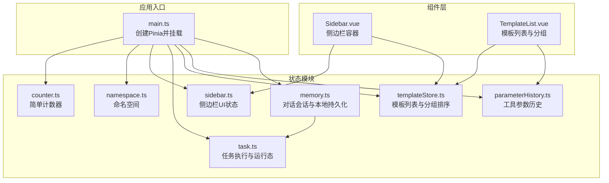
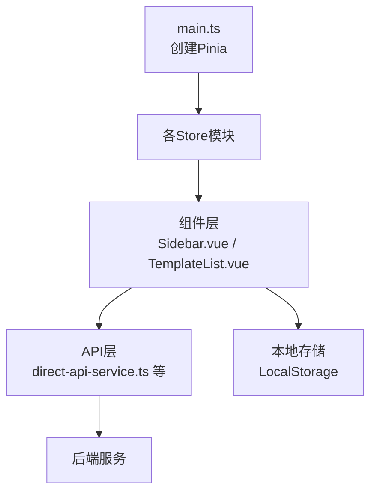
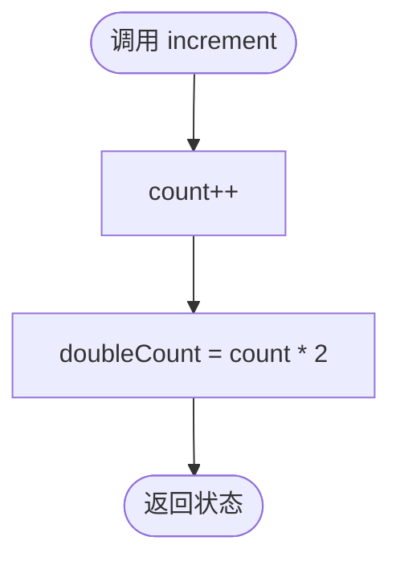
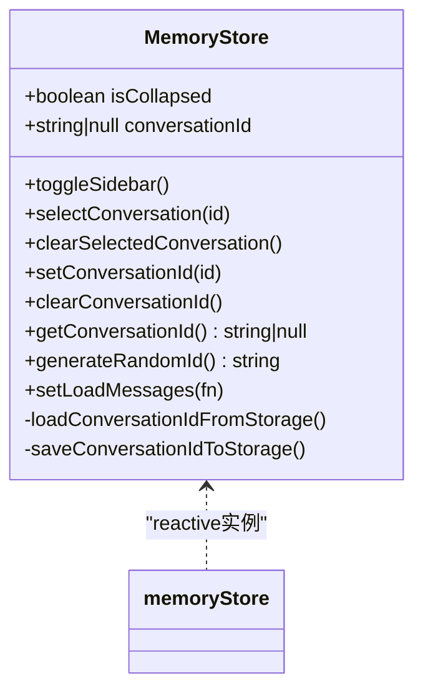
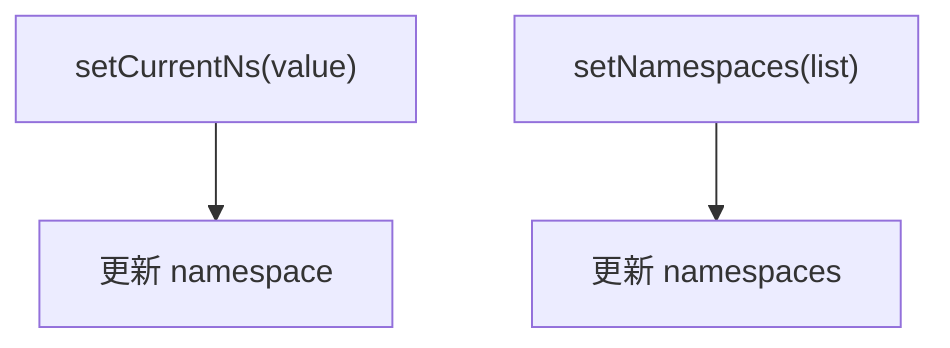
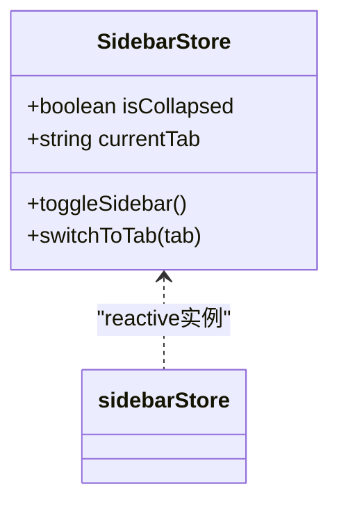
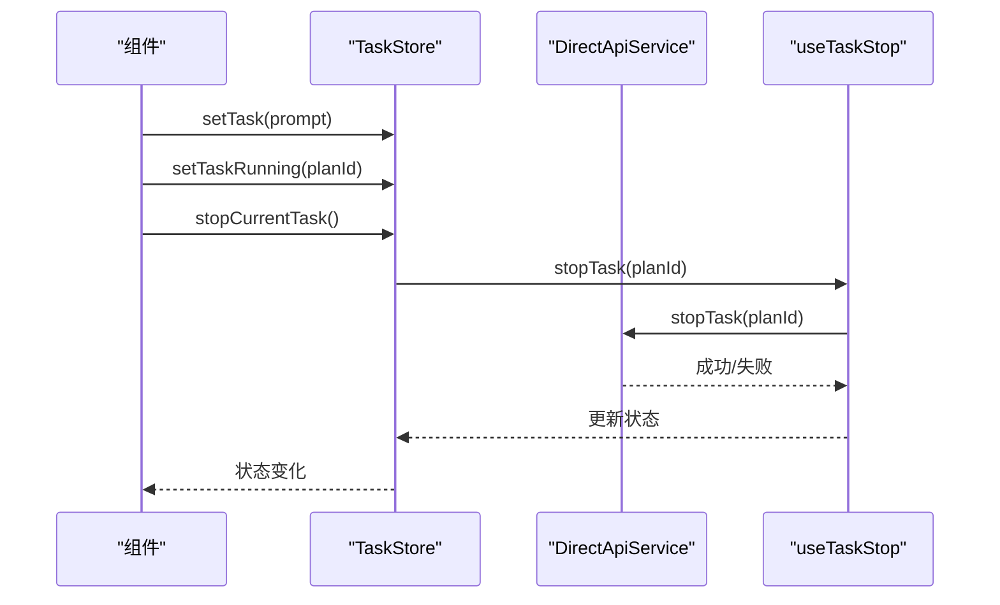
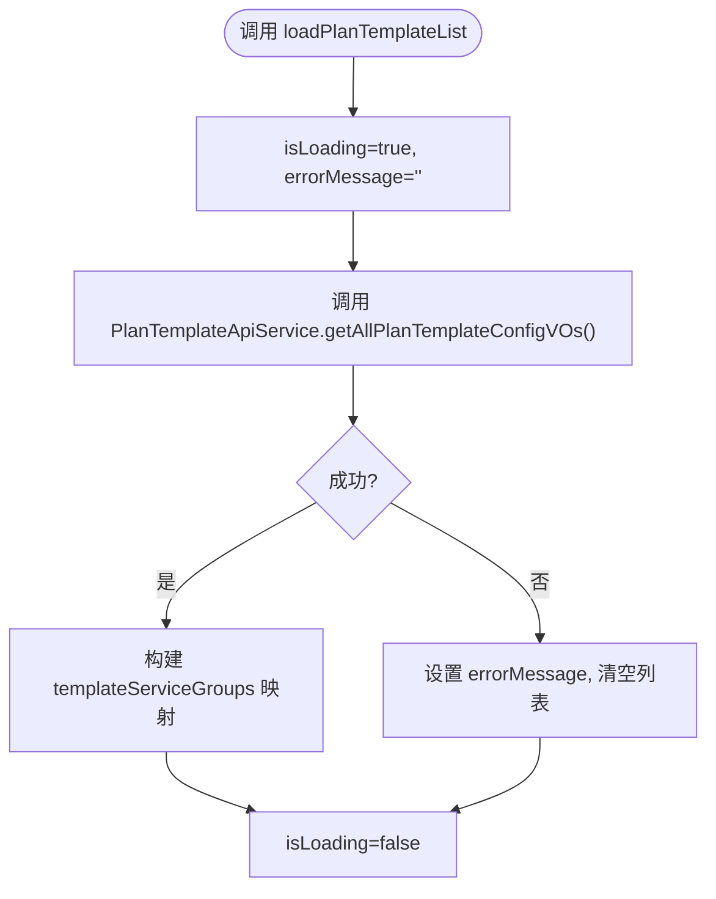
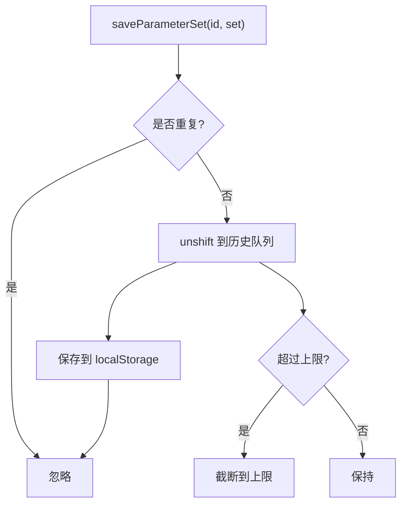
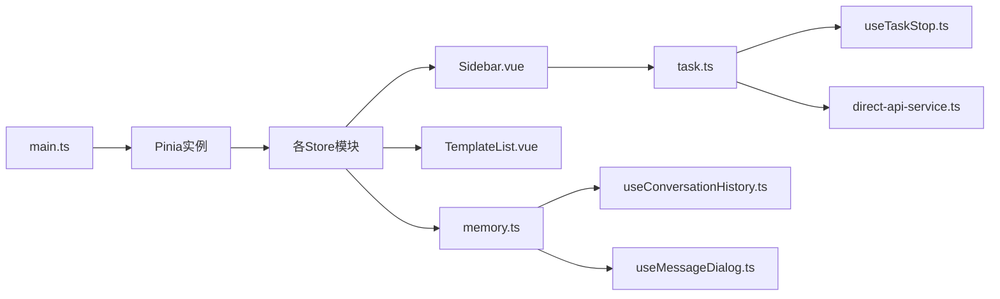

# 状态管理

<cite>
**本文引用的文件**
- [main.ts](file://ui-vue3/src/main.ts)
- [counter.ts](file://ui-vue3/src/stores/counter.ts)
- [memory.ts](file://ui-vue3/src/stores/memory.ts)
- [namespace.ts](file://ui-vue3/src/stores/namespace.ts)
- [sidebar.ts](file://ui-vue3/src/stores/sidebar.ts)
- [task.ts](file://ui-vue3/src/stores/task.ts)
- [templateStore.ts](file://ui-vue3/src/stores/templateStore.ts)
- [parameterHistory.ts](file://ui-vue3/src/stores/parameterHistory.ts)
- [Sidebar.vue](file://ui-vue3/src/components/sidebar/Sidebar.vue)
- [TemplateList.vue](file://ui-vue3/src/components/sidebar/TemplateList.vue)
- [useTaskStop.ts](file://ui-vue3/src/composables/useTaskStop.ts)
- [direct-api-service.ts](file://ui-vue3/src/api/direct-api-service.ts)
- [useConversationHistory.ts](file://ui-vue3/src/composables/useConversationHistory.ts)
- [useMessageDialog.ts](file://ui-vue3/src/composables/useMessageDialog.ts)
</cite>

## 目录
1. [简介](#简介)
2. [项目结构](#项目结构)
3. [核心组件](#核心组件)
4. [架构总览](#架构总览)
5. [详细组件分析](#详细组件分析)
6. [依赖关系分析](#依赖关系分析)
7. [性能考量](#性能考量)
8. [故障排查指南](#故障排查指南)
9. [结论](#结论)
10. [附录](#附录)

## 简介
本文件面向Lynxe前端（Vue 3 + Pinia）的状态管理系统，系统性梳理并解释Pinia Store架构与设计模式，覆盖以下主题：
- Store模块职责与边界：计数器、内存会话、命名空间、侧边栏、任务、模板、参数历史等
- 状态持久化策略：LocalStorage与服务端API协同
- 响应式数据绑定与状态同步机制
- 状态变更追踪、副作用处理与异步状态管理
- 最佳实践与性能优化建议
- 状态与组件解耦设计与数据流

## 项目结构
前端状态管理位于 ui-vue3/src/stores 目录，采用按功能域划分的模块化组织方式；应用通过 main.ts 初始化 Pinia 并挂载到根实例。

图表来源
- [main.ts:39-42](file://ui-vue3/src/main.ts#L39-L42)
- [counter.ts:20-28](file://ui-vue3/src/stores/counter.ts#L20-L28)
- [namespace.ts:20-32](file://ui-vue3/src/stores/namespace.ts#L20-L32)
- [sidebar.ts:21-36](file://ui-vue3/src/stores/sidebar.ts#L21-L36)
- [task.ts:29-186](file://ui-vue3/src/stores/task.ts#L29-L186)
- [templateStore.ts:23-241](file://ui-vue3/src/stores/templateStore.ts#L23-L241)
- [parameterHistory.ts:22-244](file://ui-vue3/src/stores/parameterHistory.ts#L22-L244)
- [memory.ts:22-127](file://ui-vue3/src/stores/memory.ts#L22-L127)
- [Sidebar.vue:44-99](file://ui-vue3/src/components/sidebar/Sidebar.vue#L44-L99)
- [TemplateList.vue:215-427](file://ui-vue3/src/components/sidebar/TemplateList.vue#L215-L427)

章节来源
- [main.ts:39-42](file://ui-vue3/src/main.ts#L39-L42)

## 核心组件
- 计数器（counter）
  - 使用组合式 Store 模式，暴露响应式状态与派生计算，适合演示与轻量状态。
- 内存（memory）
  - 面向会话的类式 Store，封装LocalStorage持久化、定时刷新、会话选择等逻辑。
- 命名空间（namespace）
  - 轻量 Store，维护当前命名空间与可用命名空间列表。
- 侧边栏（sidebar）
  - 类式 Store，仅维护UI状态（折叠/展开、当前标签页），便于组件直接复用。
- 任务（task）
  - 组合式 Store，管理任务输入、运行态、停止、访问记录等，并通过自定义事件与全局事件总线交互。
- 模板（templateStore）
  - 复杂业务 Store，封装模板加载、分组排序、组织方式、分组折叠状态、日期解析、与后端API交互等。
- 参数历史（parameterHistory）
  - 类式 Store，按工具维度保存参数历史，支持去重、导航索引、最大长度限制与持久化。

章节来源
- [counter.ts:20-28](file://ui-vue3/src/stores/counter.ts#L20-L28)
- [memory.ts:22-127](file://ui-vue3/src/stores/memory.ts#L22-L127)
- [namespace.ts:20-32](file://ui-vue3/src/stores/namespace.ts#L20-L32)
- [sidebar.ts:21-36](file://ui-vue3/src/stores/sidebar.ts#L21-L36)
- [task.ts:29-186](file://ui-vue3/src/stores/task.ts#L29-L186)
- [templateStore.ts:23-241](file://ui-vue3/src/stores/templateStore.ts#L23-L241)
- [parameterHistory.ts:22-244](file://ui-vue3/src/stores/parameterHistory.ts#L22-L244)

## 架构总览
Pinia 在应用启动时被创建并注入，各 Store 以“模块化”形式存在，组件通过组合式 API 或直接 reactive 实例消费状态。模板与参数历史 Store 通过单例配置对象与API服务协作，形成“状态 + 行为”的统一封装。

图表来源
- [main.ts:39-42](file://ui-vue3/src/main.ts#L39-L42)
- [Sidebar.vue:44-99](file://ui-vue3/src/components/sidebar/Sidebar.vue#L44-L99)
- [TemplateList.vue:215-427](file://ui-vue3/src/components/sidebar/TemplateList.vue#L215-L427)
- [direct-api-service.ts:66-71](file://ui-vue3/src/api/direct-api-service.ts#L66-L71)

## 详细组件分析

### 计数器（counter）
- 设计模式：组合式 Store（defineStore + 返回可返回值）
- 关键点：基础响应式计数与派生计算，适合入门示例与演示。

图表来源
- [counter.ts:20-28](file://ui-vue3/src/stores/counter.ts#L20-L28)

章节来源
- [counter.ts:20-28](file://ui-vue3/src/stores/counter.ts#L20-L28)

### 内存（memory）
- 设计模式：类式 Store + reactive 包装
- 关键点：构造函数中从LocalStorage恢复会话ID；切换侧边栏时开启/关闭定时刷新；提供选择/清空会话的方法。
- 持久化：localStorage 键为 currentConversationId；异常捕获与日志输出。

图表来源
- [memory.ts:22-127](file://ui-vue3/src/stores/memory.ts#L22-L127)

章节来源
- [memory.ts:22-127](file://ui-vue3/src/stores/memory.ts#L22-L127)
- [useConversationHistory.ts:185-185](file://ui-vue3/src/composables/useConversationHistory.ts#L185-L185)
- [useMessageDialog.ts:333-333](file://ui-vue3/src/composables/useMessageDialog.ts#L333-L333)

### 命名空间（namespace）
- 设计模式：组合式 Store
- 关键点：当前命名空间与命名空间列表的设置；简单易扩展。

图表来源
- [namespace.ts:20-32](file://ui-vue3/src/stores/namespace.ts#L20-L32)

章节来源
- [namespace.ts:20-32](file://ui-vue3/src/stores/namespace.ts#L20-L32)

### 侧边栏（sidebar）
- 设计模式：类式 Store + reactive 包装
- 关键点：UI状态（折叠/展开、当前标签）；组件直接复用。

图表来源
- [sidebar.ts:21-36](file://ui-vue3/src/stores/sidebar.ts#L21-L36)

章节来源
- [sidebar.ts:21-36](file://ui-vue3/src/stores/sidebar.ts#L21-L36)
- [Sidebar.vue:98-98](file://ui-vue3/src/components/sidebar/Sidebar.vue#L98-L98)

### 任务（task）
- 设计模式：组合式 Store
- 关键点：任务输入、运行态标记、停止逻辑（共享组合式）、访问记录持久化、计划执行请求事件。
- 异步与副作用：与后端API交互、自定义事件广播、localStorage写入。

图表来源
- [task.ts:149-159](file://ui-vue3/src/stores/task.ts#L149-L159)
- [useTaskStop.ts:42-79](file://ui-vue3/src/composables/useTaskStop.ts#L42-L79)
- [direct-api-service.ts:66-71](file://ui-vue3/src/api/direct-api-service.ts#L66-L71)

章节来源
- [task.ts:29-186](file://ui-vue3/src/stores/task.ts#L29-L186)
- [useTaskStop.ts:25-86](file://ui-vue3/src/composables/useTaskStop.ts#L25-L86)
- [direct-api-service.ts:66-71](file://ui-vue3/src/api/direct-api-service.ts#L66-L71)

### 模板（templateStore）
- 设计模式：类式 Store + reactive 包装 + computed 属性
- 关键点：模板列表加载、组织方式（时间/字母/分组+时间/字母）、分组折叠状态、日期解析、与后端API交互、错误与加载状态。
- 持久化：组织方式与分组折叠状态保存至 localStorage；模板列表来自后端配置单例。

图表来源
- [templateStore.ts:134-167](file://ui-vue3/src/stores/templateStore.ts#L134-L167)

章节来源
- [templateStore.ts:23-241](file://ui-vue3/src/stores/templateStore.ts#L23-L241)
- [TemplateList.vue:276-312](file://ui-vue3/src/components/sidebar/TemplateList.vue#L276-L312)

### 参数历史（parameterHistory）
- 设计模式：类式 Store + reactive 包装
- 关键点：按工具维度保存参数历史，最多保留N条；去重、导航索引、持久化；支持清空单工具或全部历史。

图表来源
- [parameterHistory.ts:114-147](file://ui-vue3/src/stores/parameterHistory.ts#L114-L147)

章节来源
- [parameterHistory.ts:22-244](file://ui-vue3/src/stores/parameterHistory.ts#L22-L244)

## 依赖关系分析
- 应用入口依赖：main.ts 创建 Pinia 并注入全局。
- 组件依赖：Sidebar.vue 依赖 sidebarStore 与 templateStore；TemplateList.vue 依赖 templateStore 与参数历史 Store。
- 任务依赖：task Store 依赖 useTaskStop 组合式；DirectApiService 提供停止任务能力。
- 会话依赖：memory Store 与多个组合式（如 useConversationHistory、useMessageDialog）协作，贯穿消息对话流程。

图表来源
- [main.ts:39-42](file://ui-vue3/src/main.ts#L39-L42)
- [Sidebar.vue:44-99](file://ui-vue3/src/components/sidebar/Sidebar.vue#L44-L99)
- [TemplateList.vue:215-427](file://ui-vue3/src/components/sidebar/TemplateList.vue#L215-L427)
- [task.ts:19-19](file://ui-vue3/src/stores/task.ts#L19-L19)
- [useTaskStop.ts:17-18](file://ui-vue3/src/composables/useTaskStop.ts#L17-L18)
- [direct-api-service.ts:66-71](file://ui-vue3/src/api/direct-api-service.ts#L66-L71)
- [memory.ts:22-127](file://ui-vue3/src/stores/memory.ts#L22-L127)
- [useConversationHistory.ts:185-185](file://ui-vue3/src/composables/useConversationHistory.ts#L185-L185)
- [useMessageDialog.ts:333-333](file://ui-vue3/src/composables/useMessageDialog.ts#L333-L333)

章节来源
- [main.ts:39-42](file://ui-vue3/src/main.ts#L39-L42)
- [Sidebar.vue:44-99](file://ui-vue3/src/components/sidebar/Sidebar.vue#L44-L99)
- [TemplateList.vue:215-427](file://ui-vue3/src/components/sidebar/TemplateList.vue#L215-L427)

## 性能考量
- 响应式粒度控制
  - 将UI状态（如 sidebarStore）与业务状态（如 templateStore）分离，避免无关渲染。
- 计算属性与缓存
  - templateStore 的 computed 属性基于组织方式与分组映射，减少重复计算；在切换组织方式时仅重新计算。
- 异步加载与节流
  - memory Store 在侧边栏展开时启用定时刷新，注意清理 interval，避免内存泄漏。
- 持久化策略
  - localStorage 读写需在 try/catch 中进行，避免阻塞主线程；批量写入合并策略可降低抖动。
- 组件订阅最小化
  - 组件仅订阅所需状态，避免过度依赖全局 Store 导致不必要的重渲染。

## 故障排查指南
- 会话恢复失败
  - 现象：进入页面后未恢复上次会话。
  - 排查：检查 localStorage 中 currentConversationId 键是否存在；确认 memoryStore 的构造函数是否正确读取。
- 定时刷新不生效
  - 现象：展开侧边栏后未自动刷新。
  - 排查：确认 toggleSidebar 是否被调用；检查 intervalId 是否被清理；确保 setLoadMessages 已设置。
- 任务停止无效
  - 现象：点击停止按钮无反应。
  - 排查：确认 hasRunningTask 与 currentTask.planId 是否存在；检查 useTaskStop 的 canStop 条件；核对 DirectApiService 的 stopTask 调用结果。
- 模板列表为空或报错
  - 现象：模板列表加载失败或显示错误信息。
  - 排查：查看 templateStore 的 errorMessage；确认 PlanTemplateApiService 可用；检查网络请求与权限。
- 参数历史重复或过多
  - 现象：历史记录重复或超出上限未截断。
  - 排查：确认 isDuplicate 与 areParameterSetsEqual 的比较逻辑；检查 MAX_HISTORY_SIZE 与 splice 截断。

章节来源
- [memory.ts:32-50](file://ui-vue3/src/stores/memory.ts#L32-L50)
- [memory.ts:69-79](file://ui-vue3/src/stores/memory.ts#L69-L79)
- [task.ts:149-159](file://ui-vue3/src/stores/task.ts#L149-L159)
- [useTaskStop.ts:32-34](file://ui-vue3/src/composables/useTaskStop.ts#L32-L34)
- [templateStore.ts:134-167](file://ui-vue3/src/stores/templateStore.ts#L134-L167)
- [parameterHistory.ts:114-147](file://ui-vue3/src/stores/parameterHistory.ts#L114-L147)

## 结论
Lynxe 的状态管理采用“模块化 Store + 组合式/类式封装”的混合模式，既满足轻量场景（计数器、命名空间、侧边栏UI），也覆盖复杂业务（模板列表、参数历史、任务运行态）。通过 Pinia 的响应式与组合式 API，结合 localStorage 与后端 API，实现了清晰的状态边界、良好的可维护性与可观测性。建议在后续迭代中进一步完善日志埋点、错误边界与性能监控，持续优化渲染与异步流程。

## 附录
- 状态持久化清单
  - memory：currentConversationId
  - templateStore：sidebarOrganizationMethod、sidebarGroupCollapseState
  - parameterHistory：parameterHistory、toolHistoryIndices
- 与组件解耦要点
  - 通过组合式 API 或 reactive 实例暴露状态，组件仅依赖接口而非具体实现细节。
- 数据流向建议
  - 输入 → Store（校验/去重/持久化）→ 计算属性/派生状态 → 组件渲染；异步操作通过 API 服务与事件总线解耦。