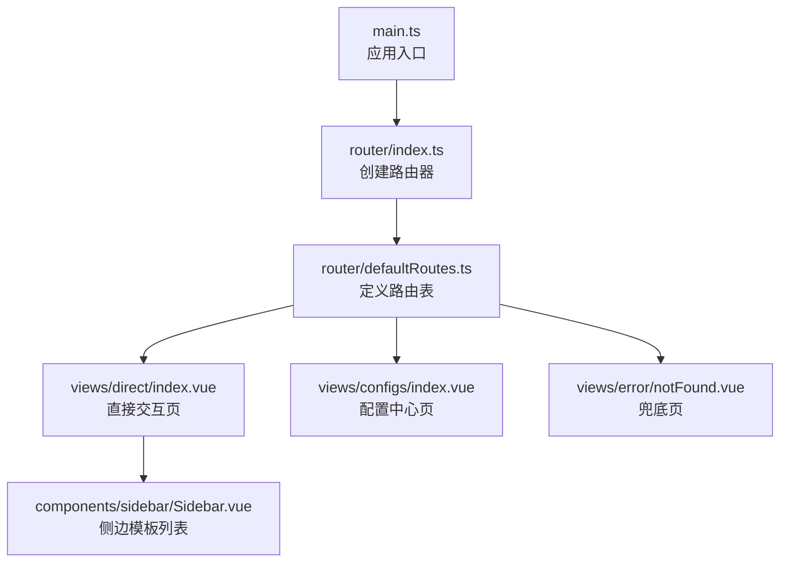
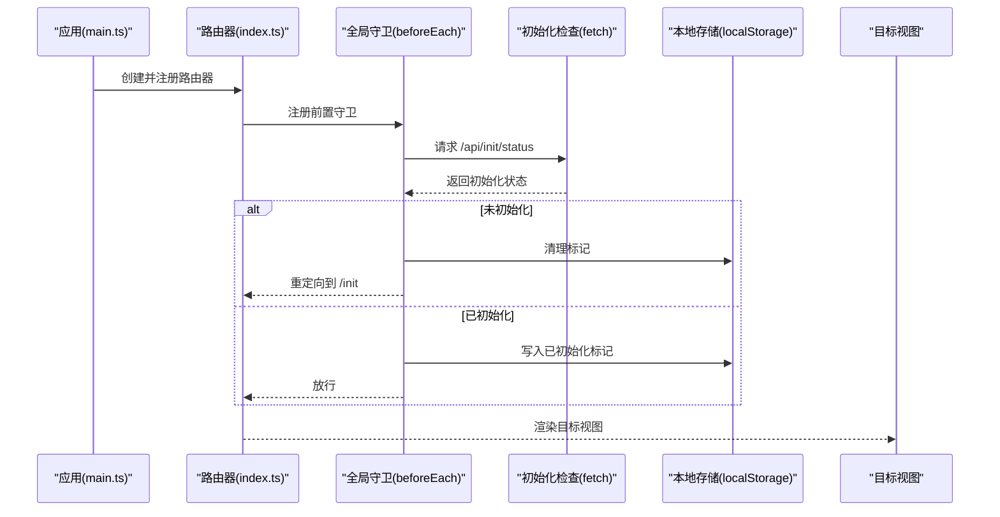
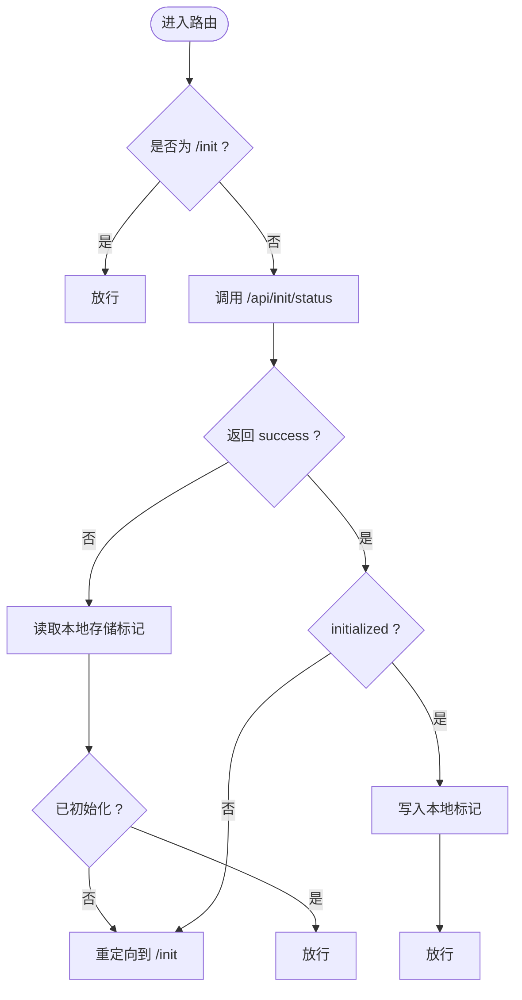
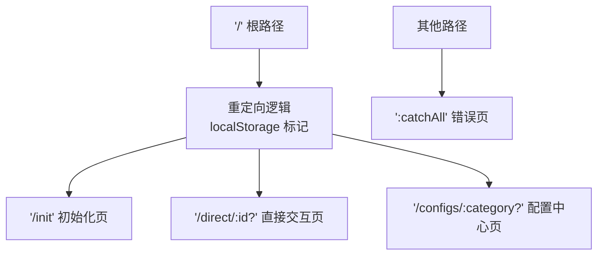
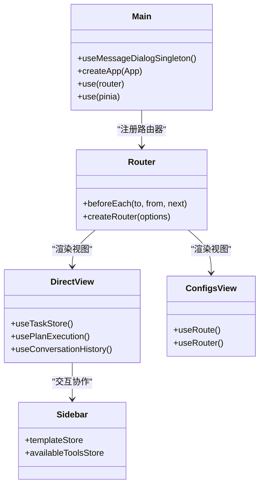
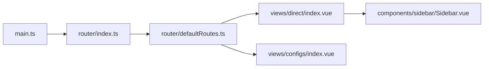

# 路由与导航

<cite>
**本文引用的文件**
- [ui-vue3/src/router/index.ts](file://ui-vue3/src/router/index.ts)
- [ui-vue3/src/router/defaultRoutes.ts](file://ui-vue3/src/router/defaultRoutes.ts)
- [ui-vue3/src/views/direct/index.vue](file://ui-vue3/src/views/direct/index.vue)
- [ui-vue3/src/views/configs/index.vue](file://ui-vue3/src/views/configs/index.vue)
- [ui-vue3/src/components/sidebar/Sidebar.vue](file://ui-vue3/src/components/sidebar/Sidebar.vue)
- [ui-vue3/src/main.ts](file://ui-vue3/src/main.ts)
</cite>

## 目录
1. [简介](#简介)
2. [项目结构](#项目结构)
3. [核心组件](#核心组件)
4. [架构总览](#架构总览)
5. [详细组件分析](#详细组件分析)
6. [依赖关系分析](#依赖关系分析)
7. [性能考虑](#性能考虑)
8. [故障排查指南](#故障排查指南)
9. [结论](#结论)
10. [附录](#附录)

## 简介
本文件面向 Lynxe 的前端路由与导航体系，围绕 Vue Router 的配置、路由守卫、动态与嵌套路由、懒加载策略、导航菜单与面包屑思路、页面切换动画、权限与路由元信息、以及与 Pinia 状态管理的集成进行系统化技术说明。文档同时给出关键流程的时序图与类图，帮助读者快速理解并扩展该路由体系。

## 项目结构
Lynxe 前端路由位于 ui-vue3/src/router 下，采用 Hash 模式与按需加载（懒加载）相结合的方式组织路由表，并通过全局前置守卫完成初始化检查与基础跳转逻辑。主应用在入口处挂载路由与状态管理，确保导航与状态同步。

图表来源
- [ui-vue3/src/main.ts:42](file://ui-vue3/src/main.ts#L42)
- [ui-vue3/src/router/index.ts:17-24](file://ui-vue3/src/router/index.ts#L17-L24)
- [ui-vue3/src/router/defaultRoutes.ts:28-82](file://ui-vue3/src/router/defaultRoutes.ts#L28-L82)

章节来源
- [ui-vue3/src/router/index.ts:17-62](file://ui-vue3/src/router/index.ts#L17-L62)
- [ui-vue3/src/router/defaultRoutes.ts:17-109](file://ui-vue3/src/router/defaultRoutes.ts#L17-L109)
- [ui-vue3/src/main.ts:39-56](file://ui-vue3/src/main.ts#L39-L56)

## 核心组件
- 路由器创建与历史记录模式：使用 Hash 模式，路径前缀为 /ui，便于部署与兼容性。
- 全局前置守卫：统一检查系统初始化状态，未初始化则强制跳转至初始化页；已初始化则写入本地缓存以提升后续访问速度。
- 路由表：根路径重定向到初始化或直接交互页；配置中心支持动态分类参数；兜底页处理未知路径。
- 视图层：直接交互页负责聊天面板、侧边模板与右侧面板协作；配置中心页提供多分类导航与详情区域。

章节来源
- [ui-vue3/src/router/index.ts:20-59](file://ui-vue3/src/router/index.ts#L20-L59)
- [ui-vue3/src/router/defaultRoutes.ts:28-82](file://ui-vue3/src/router/defaultRoutes.ts#L28-L82)
- [ui-vue3/src/views/direct/index.vue:104-126](file://ui-vue3/src/views/direct/index.vue#L104-L126)
- [ui-vue3/src/views/configs/index.vue:70-95](file://ui-vue3/src/views/configs/index.vue#L70-L95)

## 架构总览
下图展示从应用启动到路由导航的关键交互，包括路由器创建、全局守卫执行、路由表解析与视图渲染。

图表来源
- [ui-vue3/src/main.ts:42](file://ui-vue3/src/main.ts#L42)
- [ui-vue3/src/router/index.ts:27-59](file://ui-vue3/src/router/index.ts#L27-L59)

## 详细组件分析

### 路由器与全局守卫
- 历史记录模式：使用 Hash 模式，基础路径为 /ui，避免后端路由不一致问题。
- 初始化检查：除初始化页自身外，所有路由进入前都会请求后端初始化状态；失败时回退到本地存储判断。
- 本地缓存：成功初始化后写入标记，后续无需网络即可判定已初始化。

图表来源
- [ui-vue3/src/router/index.ts:27-59](file://ui-vue3/src/router/index.ts#L27-L59)

章节来源
- [ui-vue3/src/router/index.ts:17-24](file://ui-vue3/src/router/index.ts#L17-L24)
- [ui-vue3/src/router/index.ts:27-59](file://ui-vue3/src/router/index.ts#L27-L59)

### 路由层级结构与嵌套路由
- 根路径重定向：根据本地初始化标记决定跳转到初始化页或直接交互页。
- 子路由：初始化页、直接交互页、配置中心页作为根路径子路由存在。
- 兜底页：任意未匹配路径统一跳转到错误页，保证用户体验。

图表来源
- [ui-vue3/src/router/defaultRoutes.ts:28-82](file://ui-vue3/src/router/defaultRoutes.ts#L28-L82)

章节来源
- [ui-vue3/src/router/defaultRoutes.ts:28-82](file://ui-vue3/src/router/defaultRoutes.ts#L28-L82)

### 动态路由与参数传递
- 直接交互页支持可选 ID 参数，用于携带任务标识或上下文。
- 配置中心页支持可选分类参数，用于定位到具体配置模块。
- 路由表中对路径与重定向进行拼接与规范化处理，确保父子路由组合正确。

章节来源
- [ui-vue3/src/router/defaultRoutes.ts:56-71](file://ui-vue3/src/router/defaultRoutes.ts#L56-L71)
- [ui-vue3/src/router/defaultRoutes.ts:84-109](file://ui-vue3/src/router/defaultRoutes.ts#L84-L109)

### 导航菜单与面包屑思路
- 配置中心页提供左侧导航栏，基于分类键值切换右侧详情组件，形成“菜单-详情”的导航结构。
- 面包屑建议：可在路由元信息中增加面包屑数组字段，结合当前路由参数动态生成；当前仓库未实现具体面包屑组件，可按此思路扩展。

章节来源
- [ui-vue3/src/views/configs/index.vue:38-66](file://ui-vue3/src/views/configs/index.vue#L38-L66)
- [ui-vue3/src/views/configs/index.vue:136-153](file://ui-vue3/src/views/configs/index.vue#L136-L153)

### 页面切换动画
- 当前路由配置未显式声明过渡动画；如需页面切换动画，可在路由视图上包裹过渡组件并设置过渡类名，或在全局样式中引入页面切换动效。

章节来源
- [ui-vue3/src/router/index.ts:17-24](file://ui-vue3/src/router/index.ts#L17-L24)

### 路由懒加载策略
- 使用函数式懒加载导入视图组件，按需加载，降低首屏体积。
- 建议：对大型侧边组件（如模板列表）也可采用懒加载，进一步优化性能。

章节来源
- [ui-vue3/src/router/defaultRoutes.ts:49](file://ui-vue3/src/router/defaultRoutes.ts#L49)
- [ui-vue3/src/router/defaultRoutes.ts:58](file://ui-vue3/src/router/defaultRoutes.ts#L58)
- [ui-vue3/src/router/defaultRoutes.ts:67](file://ui-vue3/src/router/defaultRoutes.ts#L67)

### 权限控制与路由元信息
- 当前未实现细粒度权限校验；可在全局守卫中扩展用户角色与路由元信息的匹配逻辑，实现白名单/黑名单控制。
- 路由元信息：根路径设置 skip 字段，用于标记跳过某些处理流程；配置中心页设置图标等元数据。

章节来源
- [ui-vue3/src/router/defaultRoutes.ts:42-44](file://ui-vue3/src/router/defaultRoutes.ts#L42-L44)
- [ui-vue3/src/router/defaultRoutes.ts:69](file://ui-vue3/src/router/defaultRoutes.ts#L69)

### 与状态管理的集成
- 应用入口提前初始化消息对话单例，确保计划执行跟踪在任意路由下均可用。
- 视图层通过 Pinia Store 管理任务、记忆体、模板等状态，路由仅负责导航，状态与导航解耦。

图表来源
- [ui-vue3/src/main.ts:42-46](file://ui-vue3/src/main.ts#L42-L46)
- [ui-vue3/src/router/index.ts:27-59](file://ui-vue3/src/router/index.ts#L27-L59)
- [ui-vue3/src/views/direct/index.vue:111-118](file://ui-vue3/src/views/direct/index.vue#L111-L118)
- [ui-vue3/src/views/configs/index.vue:72-73](file://ui-vue3/src/views/configs/index.vue#L72-L73)
- [ui-vue3/src/components/sidebar/Sidebar.vue:44-45](file://ui-vue3/src/components/sidebar/Sidebar.vue#L44-L45)

章节来源
- [ui-vue3/src/main.ts:42-46](file://ui-vue3/src/main.ts#L42-L46)
- [ui-vue3/src/views/direct/index.vue:111-118](file://ui-vue3/src/views/direct/index.vue#L111-L118)
- [ui-vue3/src/views/configs/index.vue:72-73](file://ui-vue3/src/views/configs/index.vue#L72-L73)
- [ui-vue3/src/components/sidebar/Sidebar.vue:44-45](file://ui-vue3/src/components/sidebar/Sidebar.vue#L44-L45)

## 依赖关系分析
- 路由器依赖路由表与全局守卫；路由表依赖视图组件的懒加载导入。
- 视图层依赖状态管理与工具组合式函数，路由仅承担导航职责。
- 应用入口统一注册路由器与状态管理，保证全局一致性。

图表来源
- [ui-vue3/src/main.ts:42](file://ui-vue3/src/main.ts#L42)
- [ui-vue3/src/router/index.ts:17-24](file://ui-vue3/src/router/index.ts#L17-L24)
- [ui-vue3/src/router/defaultRoutes.ts:28-82](file://ui-vue3/src/router/defaultRoutes.ts#L28-L82)

章节来源
- [ui-vue3/src/main.ts:42](file://ui-vue3/src/main.ts#L42)
- [ui-vue3/src/router/index.ts:17-24](file://ui-vue3/src/router/index.ts#L17-L24)
- [ui-vue3/src/router/defaultRoutes.ts:28-82](file://ui-vue3/src/router/defaultRoutes.ts#L28-L82)

## 性能考虑
- 懒加载：视图与组件按需加载，减少首屏资源压力。
- 本地缓存：初始化状态写入本地存储，避免重复网络请求。
- 组件拆分：侧边模板列表等重型组件可进一步拆分与懒加载。
- 过渡动画：如启用页面切换动画，建议使用轻量级过渡并限制复杂效果，避免阻塞主线程。

## 故障排查指南
- 初始化检查失败：若网络异常导致无法获取初始化状态，将回退到本地存储判断。请检查 /api/init/status 接口连通性与返回格式。
- 未初始化跳转：若频繁被重定向到初始化页，请确认后端初始化流程与本地标记一致性。
- 路由不生效：检查路由表中的路径拼接与重定向逻辑，确保父子路由组合正确。
- 视图空白：确认懒加载组件路径正确且构建产物包含对应 chunk。

章节来源
- [ui-vue3/src/router/index.ts:48-56](file://ui-vue3/src/router/index.ts#L48-L56)
- [ui-vue3/src/router/defaultRoutes.ts:84-109](file://ui-vue3/src/router/defaultRoutes.ts#L84-L109)

## 结论
Lynxe 的路由体系以 Hash 模式与懒加载为核心，配合全局守卫完成初始化检查与基础跳转。路由表清晰地划分了根路径、子路由与兜底页，视图层通过 Pinia 与组合式函数实现状态与导航的解耦。未来可在权限控制、路由元信息与面包屑方面进一步完善，并持续优化懒加载与动画性能。

## 附录
- SEO 友好建议：若需要搜索引擎抓取，可考虑迁移到 History 模式并配置服务端回退；当前 Hash 模式不利于 SEO。
- 路由元信息扩展：建议在路由元信息中增加标题、面包屑、权限标识等字段，便于统一处理导航与权限。