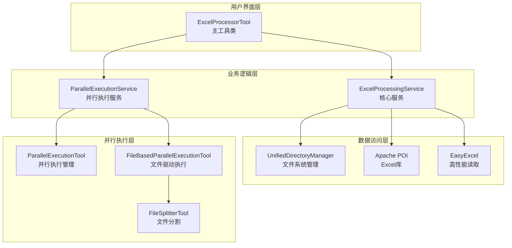
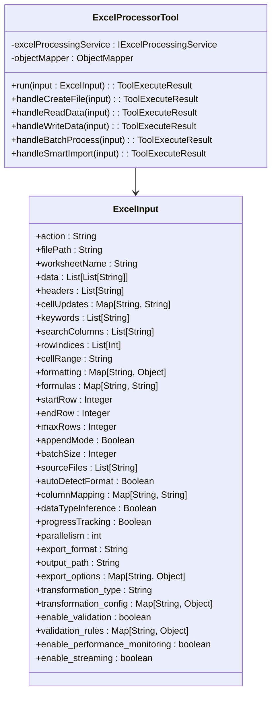
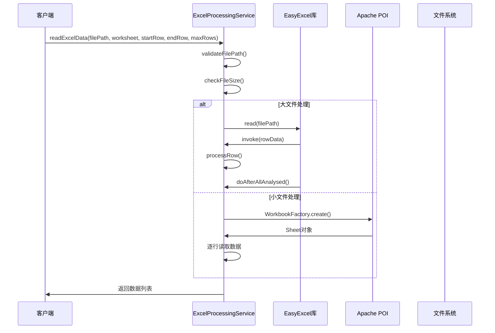
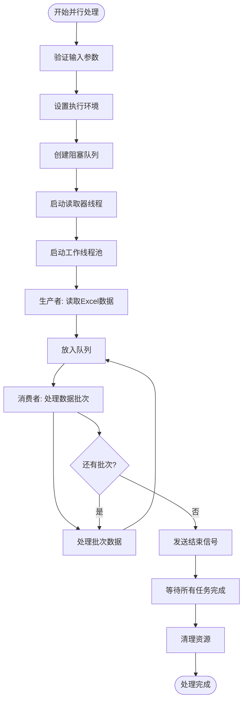
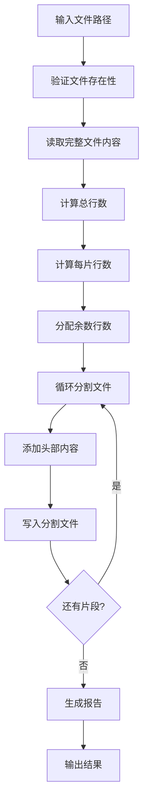
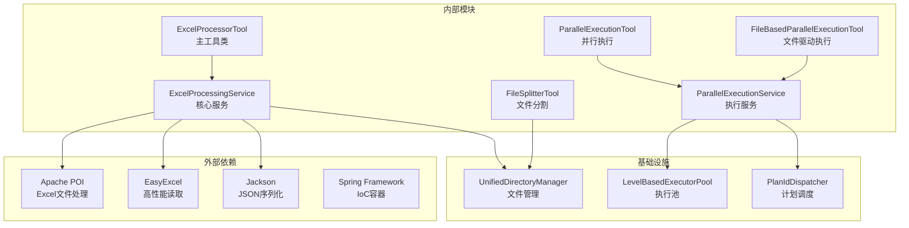

# Excel处理工具

<cite>
**本文档引用的文件**
- [ExcelProcessorTool.java](file://src/main/java/com/alibaba/cloud/ai/lynxe/tool/excelProcessor/ExcelProcessorTool.java)
- [ExcelProcessingService.java](file://src/main/java/com/alibaba/cloud/ai/lynxe/tool/excelProcessor/ExcelProcessingService.java)
- [IExcelProcessingService.java](file://src/main/java/com/alibaba/cloud/ai/lynxe/tool/excelProcessor/IExcelProcessingService.java)
- [ExcelProcessorConfiguration.java](file://src/main/java/com/alibaba/cloud/ai/lynxe/config/ExcelProcessorConfiguration.java)
- [ParallelExecutionTool.java](file://src/main/java/com/alibaba/cloud/ai/lynxe/tool/mapreduce/ParallelExecutionTool.java)
- [FileBasedParallelExecutionTool.java](file://src/main/java/com/alibaba/cloud/ai/lynxe/tool/mapreduce/FileBasedParallelExecutionTool.java)
- [ParallelExecutionService.java](file://src/main/java/com/alibaba/cloud/ai/lynxe/tool/mapreduce/ParallelExecutionService.java)
- [FileSplitterTool.java](file://src/main/java/com/alibaba/cloud/ai/lynxe/tool/mapreduce/FileSplitterTool.java)
- [application.yml](file://src/main/resources/application.yml)
</cite>

## 目录
1. [简介](#简介)
2. [项目结构](#项目结构)
3. [核心组件](#核心组件)
4. [架构概览](#架构概览)
5. [详细组件分析](#详细组件分析)
6. [依赖关系分析](#依赖关系分析)
7. [性能考虑](#性能考虑)
8. [故障排除指南](#故障排除指南)
9. [结论](#结论)

## 简介

Lynxe Excel处理工具模块是一个功能强大的Excel文件处理解决方案，集成了Apache POI和EasyExcel库，提供了完整的Excel文件操作能力。该模块支持大规模数据处理、并行执行模式、智能文件分割和格式转换等功能。

主要特性包括：
- 支持Excel文件的完整生命周期管理（创建、读取、写入、更新、删除）
- 大数据文件的流式处理和内存优化
- 并行执行模式和MapReduce架构应用
- 智能文件分割和负载均衡机制
- 多种数据格式转换和导出功能
- 完善的错误处理和性能监控

## 项目结构

Excel处理工具模块位于`src/main/java/com/alibaba/cloud/ai/lynxe/tool/excelProcessor/`目录下，包含以下核心文件：

**图表来源**
- [ExcelProcessorTool.java:1-1426](file://src/main/java/com/alibaba/cloud/ai/lynxe/tool/excelProcessor/ExcelProcessorTool.java#L1-L1426)
- [ExcelProcessingService.java:1-1722](file://src/main/java/com/alibaba/cloud/ai/lynxe/tool/excelProcessor/ExcelProcessingService.java#L1-L1722)
- [ParallelExecutionTool.java:1-608](file://src/main/java/com/alibaba/cloud/ai/lynxe/tool/mapreduce/ParallelExecutionTool.java#L1-L608)

**章节来源**
- [ExcelProcessorTool.java:1-1426](file://src/main/java/com/alibaba/cloud/ai/lynxe/tool/excelProcessor/ExcelProcessorTool.java#L1-L1426)
- [ExcelProcessingService.java:1-1722](file://src/main/java/com/alibaba/cloud/ai/lynxe/tool/excelProcessor/ExcelProcessingService.java#L1-L1722)

## 核心组件

### ExcelProcessorTool 主工具类

ExcelProcessorTool是整个Excel处理模块的入口点，提供了丰富的Excel操作功能：

**核心功能特性：**
- 支持15种不同的Excel操作动作
- 智能导入功能，支持多文件合并和数据类型推断
- 增强批处理功能，包含进度跟踪和错误处理
- CSV文件读取和转换功能
- 并行批处理和流式处理支持

**支持的操作动作：**
- 基础操作：create_file, create_table, get_structure, read_data, write_data
- 数据操作：update_cells, search_data, delete_rows
- 格式化：format_cells, add_formulas
- 高级功能：batch_process, smart_import, read_csv
- 扩展功能：parallel_batch_process, transform_aggregate, stream_process, validate_clean, export_data

**章节来源**
- [ExcelProcessorTool.java:50-53](file://src/main/java/com/alibaba/cloud/ai/lynxe/tool/excelProcessor/ExcelProcessorTool.java#L50-L53)
- [ExcelProcessorTool.java:458-499](file://src/main/java/com/alibaba/cloud/ai/lynxe/tool/excelProcessor/ExcelProcessorTool.java#L458-L499)

### ExcelProcessingService 核心服务

ExcelProcessingService实现了IExcelProcessingService接口，提供了完整的Excel文件处理能力：

**关键特性：**
- 支持.xlsx, .xls, .csv三种文件格式
- 内存优化的大文件处理（超过10MB使用流式读取）
- SXSSFWorkbook用于大数据量写入
- 完整的文件路径验证和安全管理
- 性能监控和状态跟踪

**内存管理策略：**
- 小文件使用标准XSSFWorkbook
- 大文件使用SXSSFWorkbook（内存窗口1000行）
- 流式读取避免内存溢出
- 自动资源清理和文件句柄释放

**章节来源**
- [ExcelProcessingService.java:76-84](file://src/main/java/com/alibaba/cloud/ai/lynxe/tool/excelProcessor/ExcelProcessingService.java#L76-L84)
- [ExcelProcessingService.java:340-344](file://src/main/java/com/alibaba/cloud/ai/lynxe/tool/excelProcessor/ExcelProcessingService.java#L340-L344)

## 架构概览

Excel处理工具模块采用分层架构设计，结合了传统文件处理和现代并行计算技术：

**图表来源**
- [ExcelProcessorTool.java:426-428](file://src/main/java/com/alibaba/cloud/ai/lynxe/tool/excelProcessor/ExcelProcessorTool.java#L426-L428)
- [ExcelProcessingService.java:100-102](file://src/main/java/com/alibaba/cloud/ai/lynxe/tool/excelProcessor/ExcelProcessingService.java#L100-L102)
- [ParallelExecutionService.java:56-62](file://src/main/java/com/alibaba/cloud/ai/lynxe/tool/mapreduce/ParallelExecutionService.java#L56-L62)

## 详细组件分析

### ExcelProcessorTool 详细分析

ExcelProcessorTool作为主工具类，采用了工厂模式和策略模式相结合的设计：

**图表来源**
- [ExcelProcessorTool.java:34-428](file://src/main/java/com/alibaba/cloud/ai/lynxe/tool/excelProcessor/ExcelProcessorTool.java#L34-L428)
- [ExcelProcessorTool.java:86-424](file://src/main/java/com/alibaba/cloud/ai/lynxe/tool/excelProcessor/ExcelProcessorTool.java#L86-L424)

**处理流程分析：**

1. **输入验证阶段**：检查必需参数和文件类型支持
2. **动作路由阶段**：根据action参数分发到对应处理方法
3. **执行阶段**：调用ExcelProcessingService执行具体操作
4. **结果封装阶段**：将处理结果封装为ToolExecuteResult

**章节来源**
- [ExcelProcessorTool.java:431-506](file://src/main/java/com/alibaba/cloud/ai/lynxe/tool/excelProcessor/ExcelProcessorTool.java#L431-L506)

### ExcelProcessingService 详细分析

ExcelProcessingService提供了完整的Excel文件处理能力，采用了多种优化策略：

**图表来源**
- [ExcelProcessingService.java:231-274](file://src/main/java/com/alibaba/cloud/ai/lynxe/tool/excelProcessor/ExcelProcessingService.java#L231-L274)
- [ExcelProcessingService.java:276-321](file://src/main/java/com/alibaba/cloud/ai/lynxe/tool/excelProcessor/ExcelProcessingService.java#L276-L321)

**内存优化策略：**
- **大文件检测**：超过10MB的文件自动使用流式处理
- **SXSSFWorkbook**：大文件写入时使用滚动窗口减少内存占用
- **原子计数器**：使用AtomicInteger确保线程安全
- **资源管理**：try-with-resources确保资源及时释放

**章节来源**
- [ExcelProcessingService.java:242-245](file://src/main/java/com/alibaba/cloud/ai/lynxe/tool/excelProcessor/ExcelProcessingService.java#L242-L245)
- [ExcelProcessingService.java:418-488](file://src/main/java/com/alibaba/cloud/ai/lynxe/tool/excelProcessor/ExcelProcessingService.java#L418-L488)

### 并行执行架构分析

并行执行模块基于Producer-Consumer模式实现了高效的批处理能力：

**图表来源**
- [ExcelProcessingService.java:509-633](file://src/main/java/com/alibaba/cloud/ai/lynxe/tool/excelProcessor/ExcelProcessingService.java#L509-L633)
- [ParallelExecutionTool.java:397-504](file://src/main/java/com/alibaba/cloud/ai/lynxe/tool/mapreduce/ParallelExecutionTool.java#L397-L504)

**并行执行优势：**
- **负载均衡**：多个工作线程自动分配任务
- **内存效率**：批次处理避免大量数据同时驻留内存
- **错误隔离**：单个批次失败不影响其他批次
- **进度跟踪**：实时监控处理进度和状态

**章节来源**
- [ExcelProcessingService.java:509-633](file://src/main/java/com/alibaba/cloud/ai/lynxe/tool/excelProcessor/ExcelProcessingService.java#L509-L633)
- [ParallelExecutionTool.java:288-317](file://src/main/java/com/alibaba/cloud/ai/lynxe/tool/mapreduce/ParallelExecutionTool.java#L288-L317)

### 文件分割策略分析

FileSplitterTool提供了智能的文件分割功能，特别适用于大文件的并行处理：

**图表来源**
- [FileSplitterTool.java:278-367](file://src/main/java/com/alibaba/cloud/ai/lynxe/tool/mapreduce/FileSplitterTool.java#L278-L367)

**分割算法特点：**
- **均匀分布**：余数平均分配到前面的片段中
- **保持完整性**：按行分割确保内容完整性
- **索引命名**：自动生成带序号的文件名
- **头部保留**：可选的头部内容复制到每个片段

**章节来源**
- [FileSplitterTool.java:288-310](file://src/main/java/com/alibaba/cloud/ai/lynxe/tool/mapreduce/FileSplitterTool.java#L288-L310)

## 依赖关系分析

Excel处理工具模块的依赖关系清晰明确，遵循了依赖倒置原则：

**图表来源**
- [ExcelProcessorTool.java:28-32](file://src/main/java/com/alibaba/cloud/ai/lynxe/tool/excelProcessor/ExcelProcessorTool.java#L28-L32)
- [ExcelProcessingService.java:64-69](file://src/main/java/com/alibaba/cloud/ai/lynxe/tool/excelProcessor/ExcelProcessingService.java#L64-L69)
- [ParallelExecutionService.java:29-37](file://src/main/java/com/alibaba/cloud/ai/lynxe/tool/mapreduce/ParallelExecutionService.java#L29-L37)

**依赖管理策略：**
- **版本控制**：通过Maven管理依赖版本
- **条件装配**：使用@ConditionalOnMissingBean避免重复装配
- **接口抽象**：通过接口实现松耦合设计
- **资源隔离**：独立的执行池避免资源竞争

**章节来源**
- [ExcelProcessorConfiguration.java:39-43](file://src/main/java/com/alibaba/cloud/ai/lynxe/config/ExcelProcessorConfiguration.java#L39-L43)
- [application.yml:1-97](file://src/main/resources/application.yml#L1-L97)

## 性能考虑

### 内存优化策略

Excel处理工具模块采用了多层次的内存优化策略：

**1. 文件大小自适应处理**
- 小文件（≤10MB）：使用标准XSSFWorkbook，支持随机访问
- 大文件（>10MB）：使用SXSSFWorkbook，限制内存中的行数

**2. 流式处理机制**
- EasyExcel流式读取，逐行处理避免内存累积
- 分批处理大数据集，控制内存使用峰值

**3. 资源管理优化**
- 自动资源清理，确保文件句柄及时释放
- 连接池配置优化数据库连接性能

### 并行处理优化

**1. 线程池配置**
- CPU密集型任务：使用可用处理器数量作为并行度
- IO密集型任务：适当增加并行度提高吞吐量

**2. 负载均衡机制**
- 动态任务分配，避免某些线程过载
- 批次大小优化，平衡处理效率和内存使用

**3. 错误恢复策略**
- 单个任务失败不影响整体执行
- 自动重试机制和错误日志记录

### 大数据处理策略

**1. 分段处理**
- 文件分割工具支持大文件的智能分割
- 并行执行支持多文件同时处理

**2. 缓存机制**
- 文件状态缓存减少重复I/O操作
- 处理结果缓存支持增量处理

**3. 监控指标**
- 实时性能监控和告警
- 处理进度跟踪和统计信息

**章节来源**
- [ExcelProcessingService.java:82-84](file://src/main/java/com/alibaba/cloud/ai/lynxe/tool/excelProcessor/ExcelProcessingService.java#L82-L84)
- [ExcelProcessingService.java:517-518](file://src/main/java/com/alibaba/cloud/ai/lynxe/tool/excelProcessor/ExcelProcessingService.java#L517-L518)

## 故障排除指南

### 常见问题及解决方案

**1. 文件格式不支持**
- **症状**：抛出"Unsupported file type"异常
- **原因**：文件扩展名不在支持列表中
- **解决**：确认文件扩展名为.xlsx, .xls, .csv之一

**2. 内存不足错误**
- **症状**：OutOfMemoryError或内存溢出
- **原因**：处理超大文件时内存不足
- **解决**：使用流式处理或增加JVM堆内存

**3. 文件路径错误**
- **症状**：文件不存在或权限不足
- **原因**：相对路径解析错误或权限问题
- **解决**：使用绝对路径或检查文件权限

**4. 并行执行异常**
- **症状**：部分任务失败但整体成功
- **原因**：单个任务处理异常
- **解决**：检查任务参数和数据质量

### 调试和监控

**1. 日志配置**
- 启用DEBUG级别日志查看详细处理过程
- 关注性能指标和错误信息

**2. 性能监控**
- 监控内存使用情况
- 跟踪处理时间和吞吐量

**3. 错误处理**
- 捕获并记录详细错误信息
- 提供友好的错误提示

**章节来源**
- [ExcelProcessingService.java:105-113](file://src/main/java/com/alibaba/cloud/ai/lynxe/tool/excelProcessor/ExcelProcessingService.java#L105-L113)
- [ExcelProcessorTool.java:502-505](file://src/main/java/com/alibaba/cloud/ai/lynxe/tool/excelProcessor/ExcelProcessorTool.java#L502-L505)

## 结论

Lynxe Excel处理工具模块是一个设计精良、功能全面的Excel文件处理解决方案。其主要优势包括：

**技术创新点：**
- **混合架构**：结合传统文件处理和现代并行计算技术
- **智能优化**：根据文件大小自动选择最优处理策略
- **内存友好**：多层内存优化确保大文件处理稳定性
- **扩展性强**：模块化设计支持功能扩展和定制

**应用场景：**
- 大规模数据导入导出
- 复杂报表生成和处理
- 数据清洗和格式转换
- 批量文件处理和自动化

**未来发展：**
- 支持更多文件格式和数据源
- 增强机器学习和数据分析功能
- 优化云端部署和分布式处理
- 提供更丰富的可视化和交互功能

该模块为Lynxe平台提供了强大的数据处理能力，是构建复杂数据处理应用的理想选择。