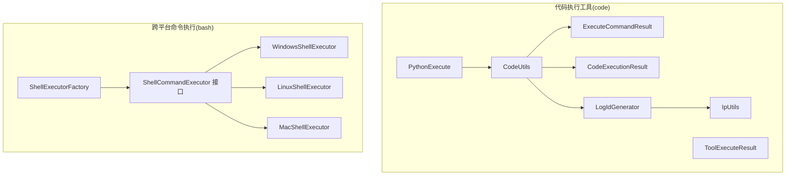
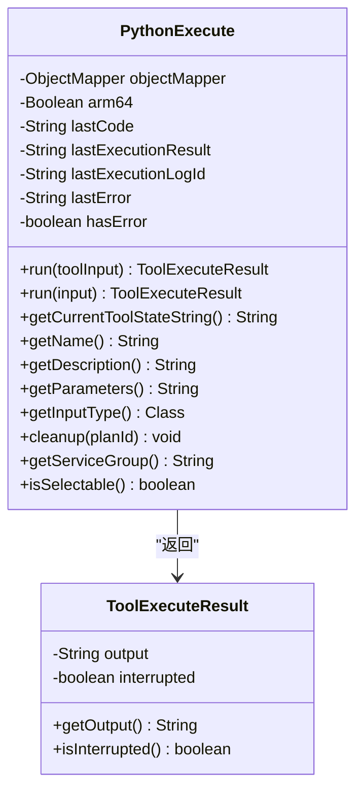
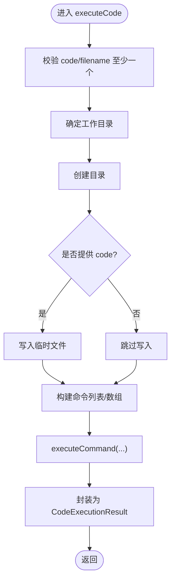
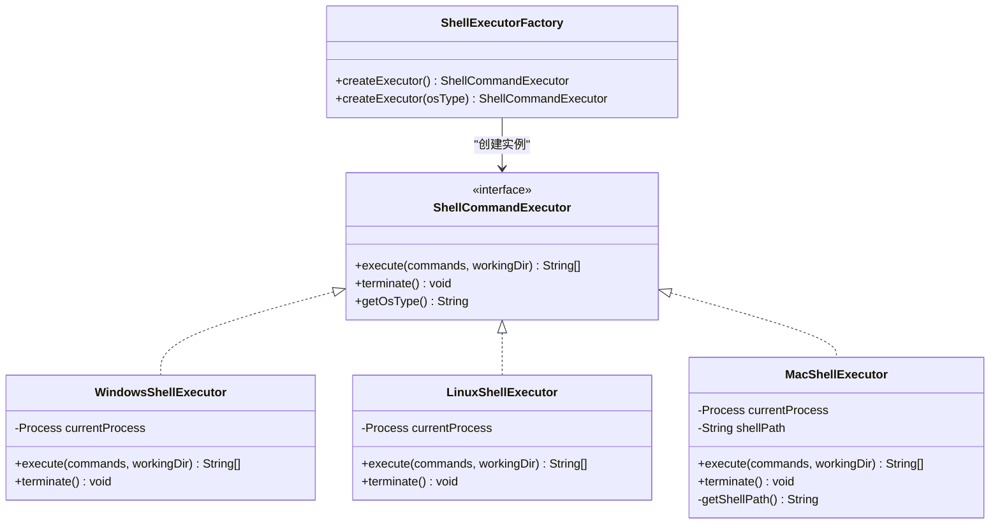
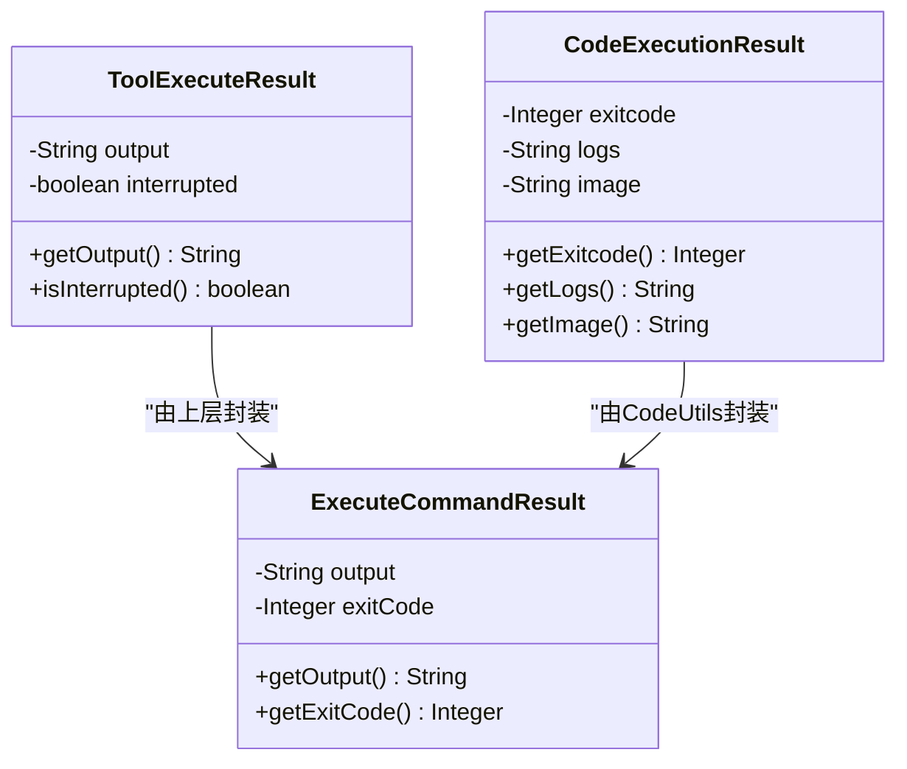
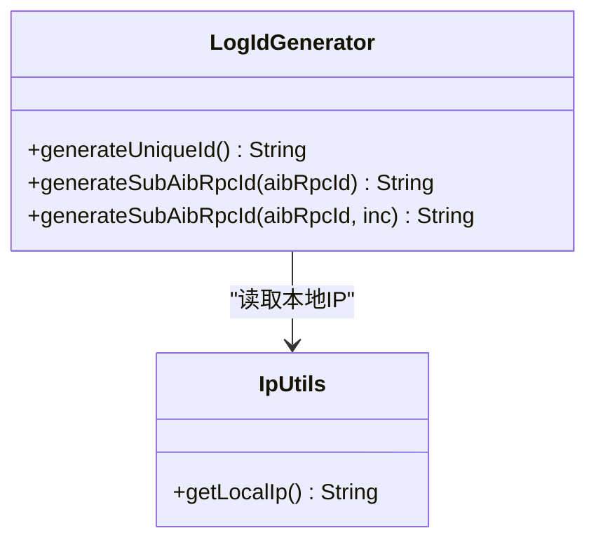
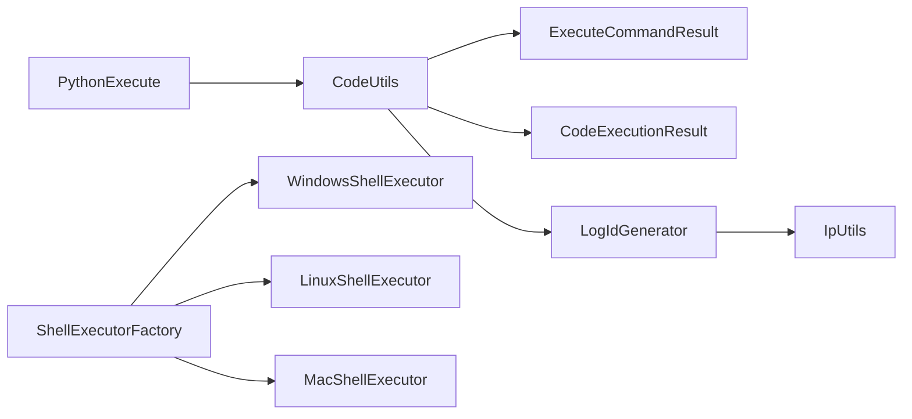

# 代码执行工具

<cite>
**本文引用的文件**
- [PythonExecute.java](file://src/main/java/com/alibaba/cloud/ai/lynxe/tool/code/PythonExecute.java)
- [CodeUtils.java](file://src/main/java/com/alibaba/cloud/ai/lynxe/tool/code/CodeUtils.java)
- [ToolExecuteResult.java](file://src/main/java/com/alibaba/cloud/ai/lynxe/tool/code/ToolExecuteResult.java)
- [CodeExecutionResult.java](file://src/main/java/com/alibaba/cloud/ai/lynxe/tool/code/CodeExecutionResult.java)
- [ExecuteCommandResult.java](file://src/main/java/com/alibaba/cloud/ai/lynxe/tool/code/ExecuteCommandResult.java)
- [LogIdGenerator.java](file://src/main/java/com/alibaba/cloud/ai/lynxe/tool/code/LogIdGenerator.java)
- [IpUtils.java](file://src/main/java/com/alibaba/cloud/ai/lynxe/tool/code/IpUtils.java)
- [ShellCommandExecutor.java](file://src/main/java/com/alibaba/cloud/ai/lynxe/tool/bash/ShellCommandExecutor.java)
- [LinuxShellExecutor.java](file://src/main/java/com/alibaba/cloud/ai/lynxe/tool/bash/LinuxShellExecutor.java)
- [MacShellExecutor.java](file://src/main/java/com/alibaba/cloud/ai/lynxe/tool/bash/MacShellExecutor.java)
- [WindowsShellExecutor.java](file://src/main/java/com/alibaba/cloud/ai/lynxe/tool/bash/WindowsShellExecutor.java)
- [ShellExecutorFactory.java](file://src/main/java/com/alibaba/cloud/ai/lynxe/tool/bash/ShellExecutorFactory.java)
- [application.yml](file://src/main/resources/application.yml)
- [pom.xml](file://pom.xml)
</cite>

## 目录
1. [简介](#简介)
2. [项目结构](#项目结构)
3. [核心组件](#核心组件)
4. [架构总览](#架构总览)
5. [组件详解](#组件详解)
6. [依赖关系分析](#依赖关系分析)
7. [性能与安全](#性能与安全)
8. [故障排查指南](#故障排查指南)
9. [结论](#结论)
10. [附录](#附录)

## 简介
本文件面向Lynxe的“代码执行工具”模块，系统化梳理Python代码执行、跨平台命令执行、结果封装与状态管理、日志与标识生成、以及安全与资源控制策略。重点覆盖以下能力：
- PythonExecute：基于Python运行时的代码执行工具，支持JSON参数解析、错误提取与输出封装。
- CodeUtils：通用代码执行工具集，负责代码落盘、语言分支、命令执行与结果聚合。
- ShellCommandExecutor及其平台实现：统一接口与工厂，屏蔽Windows/Linux/Mac差异，提供超时与终止控制。
- 结果封装：ToolExecuteResult、CodeExecutionResult、ExecuteCommandResult三类结果模型。
- 安全与资源：日志ID生成、环境变量隔离、超时与中断策略、编码适配。

## 项目结构
围绕“代码执行工具”的关键文件组织如下：
- 工具层（code包）：PythonExecute、CodeUtils、ToolExecuteResult、CodeExecutionResult、ExecuteCommandResult、LogIdGenerator、IpUtils
- 平台执行器（bash包）：ShellCommandExecutor接口及Windows/Linux/Mac实现、ShellExecutorFactory工厂
- 配置与依赖：application.yml（运行参数）、pom.xml（依赖）

图表来源
- [PythonExecute.java:1-246](file://src/main/java/com/alibaba/cloud/ai/lynxe/tool/code/PythonExecute.java#L1-L246)
- [CodeUtils.java:1-220](file://src/main/java/com/alibaba/cloud/ai/lynxe/tool/code/CodeUtils.java#L1-L220)
- [ToolExecuteResult.java:1-60](file://src/main/java/com/alibaba/cloud/ai/lynxe/tool/code/ToolExecuteResult.java#L1-L60)
- [CodeExecutionResult.java:1-51](file://src/main/java/com/alibaba/cloud/ai/lynxe/tool/code/CodeExecutionResult.java#L1-L51)
- [ExecuteCommandResult.java:1-41](file://src/main/java/com/alibaba/cloud/ai/lynxe/tool/code/ExecuteCommandResult.java#L1-L41)
- [LogIdGenerator.java:1-154](file://src/main/java/com/alibaba/cloud/ai/lynxe/tool/code/LogIdGenerator.java#L1-L154)
- [IpUtils.java:1-68](file://src/main/java/com/alibaba/cloud/ai/lynxe/tool/code/IpUtils.java#L1-L68)
- [ShellCommandExecutor.java:1-57](file://src/main/java/com/alibaba/cloud/ai/lynxe/tool/bash/ShellCommandExecutor.java#L1-L57)
- [WindowsShellExecutor.java:1-166](file://src/main/java/com/alibaba/cloud/ai/lynxe/tool/bash/WindowsShellExecutor.java#L1-L166)
- [LinuxShellExecutor.java:1-166](file://src/main/java/com/alibaba/cloud/ai/lynxe/tool/bash/LinuxShellExecutor.java#L1-L166)
- [MacShellExecutor.java:1-231](file://src/main/java/com/alibaba/cloud/ai/lynxe/tool/bash/MacShellExecutor.java#L1-L231)
- [ShellExecutorFactory.java:1-60](file://src/main/java/com/alibaba/cloud/ai/lynxe/tool/bash/ShellExecutorFactory.java#L1-L60)

章节来源
- [PythonExecute.java:1-246](file://src/main/java/com/alibaba/cloud/ai/lynxe/tool/code/PythonExecute.java#L1-L246)
- [CodeUtils.java:1-220](file://src/main/java/com/alibaba/cloud/ai/lynxe/tool/code/CodeUtils.java#L1-L220)
- [ShellCommandExecutor.java:1-57](file://src/main/java/com/alibaba/cloud/ai/lynxe/tool/bash/ShellCommandExecutor.java#L1-L57)

## 核心组件
- PythonExecute：对外暴露“python_execute”工具，接收JSON输入，解析出code字段，调用CodeUtils执行，并对Python常见异常进行识别与错误归因，最终以ToolExecuteResult返回。
- CodeUtils：负责将代码写入临时文件，按语言选择执行路径（如python3、sh），通过executeCommand统一执行并收集输出，封装为CodeExecutionResult。
- ShellCommandExecutor：跨平台命令执行接口，定义execute与terminate方法，工厂ShellExecutorFactory根据系统类型返回对应实现。
- 结果封装：
  - ToolExecuteResult：工具输出与中断标记
  - CodeExecutionResult：执行退出码与日志
  - ExecuteCommandResult：底层命令执行输出与退出码
- 日志与标识：LogIdGenerator生成全局唯一且URL安全的ID；IpUtils提供本地IP辅助。

章节来源
- [PythonExecute.java:103-228](file://src/main/java/com/alibaba/cloud/ai/lynxe/tool/code/PythonExecute.java#L103-L228)
- [CodeUtils.java:92-163](file://src/main/java/com/alibaba/cloud/ai/lynxe/tool/code/CodeUtils.java#L92-L163)
- [ToolExecuteResult.java:18-60](file://src/main/java/com/alibaba/cloud/ai/lynxe/tool/code/ToolExecuteResult.java#L18-L60)
- [CodeExecutionResult.java:18-51](file://src/main/java/com/alibaba/cloud/ai/lynxe/tool/code/CodeExecutionResult.java#L18-L51)
- [ExecuteCommandResult.java:18-41](file://src/main/java/com/alibaba/cloud/ai/lynxe/tool/code/ExecuteCommandResult.java#L18-L41)
- [LogIdGenerator.java:82-103](file://src/main/java/com/alibaba/cloud/ai/lynxe/tool/code/LogIdGenerator.java#L82-L103)
- [IpUtils.java:31-33](file://src/main/java/com/alibaba/cloud/ai/lynxe/tool/code/IpUtils.java#L31-L33)

## 架构总览
下图展示从工具调用到跨平台执行的关键流程与组件交互。

```mermaid
sequenceDiagram
participant T as "调用方"
participant PE as "PythonExecute"
participant CU as "CodeUtils"
participant OS as "ShellExecutorFactory/平台执行器"
participant CMD as "ExecuteCommandResult"
T->>PE : "传入JSON参数"
PE->>PE : "解析code字段"
PE->>CU : "executeCode(code, lang, filename, arm64, kwargs)"
CU->>OS : "选择平台执行器"
OS-->>CU : "返回执行器实例"
CU->>CU : "写入临时文件/构造命令"
CU->>CMD : "executeCommand(...)"
CMD-->>CU : "返回输出与退出码"
CU-->>PE : "封装为CodeExecutionResult"
PE-->>T : "返回ToolExecuteResult"
```

图表来源
- [PythonExecute.java:103-228](file://src/main/java/com/alibaba/cloud/ai/lynxe/tool/code/PythonExecute.java#L103-L228)
- [CodeUtils.java:139-163](file://src/main/java/com/alibaba/cloud/ai/lynxe/tool/code/CodeUtils.java#L139-L163)
- [ShellExecutorFactory.java:28-39](file://src/main/java/com/alibaba/cloud/ai/lynxe/tool/bash/ShellExecutorFactory.java#L28-L39)
- [ExecuteCommandResult.java:18-41](file://src/main/java/com/alibaba/cloud/ai/lynxe/tool/code/ExecuteCommandResult.java#L18-L41)

## 组件详解

### PythonExecute：Python代码执行机制与错误处理
- 输入解析：支持字符串或对象输入，优先从JSON中提取code字段；记录最近一次执行的代码、日志ID、错误信息与输出。
- 执行路径：调用CodeUtils.executeCode，指定语言为python，文件名带.logId后缀，可选arm64架构参数。
- 错误识别：若输出包含常见Python异常关键字，则标记失败并提取错误摘要。
- 输出封装：返回ToolExecuteResult，便于上层工具链消费。

图表来源
- [PythonExecute.java:27-246](file://src/main/java/com/alibaba/cloud/ai/lynxe/tool/code/PythonExecute.java#L27-L246)
- [ToolExecuteResult.java:18-60](file://src/main/java/com/alibaba/cloud/ai/lynxe/tool/code/ToolExecuteResult.java#L18-L60)

章节来源
- [PythonExecute.java:75-145](file://src/main/java/com/alibaba/cloud/ai/lynxe/tool/code/PythonExecute.java#L75-L145)
- [PythonExecute.java:163-228](file://src/main/java/com/alibaba/cloud/ai/lynxe/tool/code/PythonExecute.java#L163-L228)

### CodeUtils：代码执行与命令封装
- 代码落盘：根据工作目录创建文件，必要时自动生成临时文件名（MD5哈希+语言扩展名）。
- 语言分支：针对python与sh分别构造命令（如python3、sh），支持ARM架构切换。
- 命令执行：通过executeCommand启动进程，分别读取标准输出与错误流，等待退出码。
- 结果聚合：封装为CodeExecutionResult，包含退出码与日志。

图表来源
- [CodeUtils.java:92-163](file://src/main/java/com/alibaba/cloud/ai/lynxe/tool/code/CodeUtils.java#L92-L163)
- [CodeUtils.java:169-201](file://src/main/java/com/alibaba/cloud/ai/lynxe/tool/code/CodeUtils.java#L169-L201)

章节来源
- [CodeUtils.java:92-163](file://src/main/java/com/alibaba/cloud/ai/lynxe/tool/code/CodeUtils.java#L92-L163)
- [CodeUtils.java:169-201](file://src/main/java/com/alibaba/cloud/ai/lynxe/tool/code/CodeUtils.java#L169-L201)

### ShellCommandExecutor 及平台实现：跨平台命令执行
- 接口职责：统一execute(命令列表, 工作目录)与terminate()，并提供默认系统类型判定。
- WindowsShellExecutor：使用cmd.exe，处理后台命令（start /B），GBK编码输出，taskkill强制终止。
- LinuxShellExecutor：使用/bin/bash，设置多环境变量禁用分页器，UTF-8输出，SIGINT/SIGTERM组合终止。
- MacShellExecutor：动态检测zsh优先、bash回退，设置相同环境变量，UTF-8输出，SIGINT/SIGTERM组合终止。
- ShellExecutorFactory：依据系统属性或显式osType创建对应执行器。

图表来源
- [ShellCommandExecutor.java:24-56](file://src/main/java/com/alibaba/cloud/ai/lynxe/tool/bash/ShellCommandExecutor.java#L24-L56)
- [WindowsShellExecutor.java:36-166](file://src/main/java/com/alibaba/cloud/ai/lynxe/tool/bash/WindowsShellExecutor.java#L36-L166)
- [LinuxShellExecutor.java:36-166](file://src/main/java/com/alibaba/cloud/ai/lynxe/tool/bash/LinuxShellExecutor.java#L36-L166)
- [MacShellExecutor.java:36-231](file://src/main/java/com/alibaba/cloud/ai/lynxe/tool/bash/MacShellExecutor.java#L36-L231)
- [ShellExecutorFactory.java:22-59](file://src/main/java/com/alibaba/cloud/ai/lynxe/tool/bash/ShellExecutorFactory.java#L22-L59)

章节来源
- [ShellCommandExecutor.java:24-56](file://src/main/java/com/alibaba/cloud/ai/lynxe/tool/bash/ShellCommandExecutor.java#L24-L56)
- [WindowsShellExecutor.java:47-103](file://src/main/java/com/alibaba/cloud/ai/lynxe/tool/bash/WindowsShellExecutor.java#L47-L103)
- [LinuxShellExecutor.java:47-107](file://src/main/java/com/alibaba/cloud/ai/lynxe/tool/bash/LinuxShellExecutor.java#L47-L107)
- [MacShellExecutor.java:50-111](file://src/main/java/com/alibaba/cloud/ai/lynxe/tool/bash/MacShellExecutor.java#L50-L111)
- [ShellExecutorFactory.java:28-57](file://src/main/java/com/alibaba/cloud/ai/lynxe/tool/bash/ShellExecutorFactory.java#L28-L57)

### 结果封装与状态管理
- ToolExecuteResult：承载工具输出与中断标记，便于上层判断是否需要进一步处理。
- CodeExecutionResult：封装执行退出码与日志，作为代码执行的统一结果载体。
- ExecuteCommandResult：底层命令执行结果，包含输出与退出码，供CodeUtils聚合。

图表来源
- [ToolExecuteResult.java:18-60](file://src/main/java/com/alibaba/cloud/ai/lynxe/tool/code/ToolExecuteResult.java#L18-L60)
- [CodeExecutionResult.java:18-51](file://src/main/java/com/alibaba/cloud/ai/lynxe/tool/code/CodeExecutionResult.java#L18-L51)
- [ExecuteCommandResult.java:18-41](file://src/main/java/com/alibaba/cloud/ai/lynxe/tool/code/ExecuteCommandResult.java#L18-L41)

章节来源
- [ToolExecuteResult.java:18-60](file://src/main/java/com/alibaba/cloud/ai/lynxe/tool/code/ToolExecuteResult.java#L18-L60)
- [CodeExecutionResult.java:18-51](file://src/main/java/com/alibaba/cloud/ai/lynxe/tool/code/CodeExecutionResult.java#L18-L51)
- [ExecuteCommandResult.java:18-41](file://src/main/java/com/alibaba/cloud/ai/lynxe/tool/code/ExecuteCommandResult.java#L18-L41)

### 日志ID与IP工具
- LogIdGenerator：生成全局唯一、URL安全的ID，包含版本、时间戳、IP与序列号，确保在分布式场景下的可区分性。
- IpUtils：提供本地IP获取能力，用于日志ID生成中的IP字段。

图表来源
- [LogIdGenerator.java:31-154](file://src/main/java/com/alibaba/cloud/ai/lynxe/tool/code/LogIdGenerator.java#L31-L154)
- [IpUtils.java:24-68](file://src/main/java/com/alibaba/cloud/ai/lynxe/tool/code/IpUtils.java#L24-L68)

章节来源
- [LogIdGenerator.java:82-103](file://src/main/java/com/alibaba/cloud/ai/lynxe/tool/code/LogIdGenerator.java#L82-L103)
- [IpUtils.java:31-33](file://src/main/java/com/alibaba/cloud/ai/lynxe/tool/code/IpUtils.java#L31-L33)

## 依赖关系分析
- 内部依赖：PythonExecute依赖CodeUtils与LogIdGenerator；CodeUtils依赖ExecuteCommandResult与CodeExecutionResult；平台执行器依赖ShellExecutorFactory。
- 外部依赖：pom.xml声明了Spring Boot、Spring Web/WebFlux、Jackson、JSoup、Playwright等运行期依赖；application.yml提供运行参数与日志级别。

图表来源
- [PythonExecute.java:103-228](file://src/main/java/com/alibaba/cloud/ai/lynxe/tool/code/PythonExecute.java#L103-L228)
- [CodeUtils.java:92-163](file://src/main/java/com/alibaba/cloud/ai/lynxe/tool/code/CodeUtils.java#L92-L163)
- [LogIdGenerator.java:82-103](file://src/main/java/com/alibaba/cloud/ai/lynxe/tool/code/LogIdGenerator.java#L82-L103)
- [ShellExecutorFactory.java:28-39](file://src/main/java/com/alibaba/cloud/ai/lynxe/tool/bash/ShellExecutorFactory.java#L28-L39)

章节来源
- [pom.xml:60-200](file://pom.xml#L60-L200)
- [application.yml:1-97](file://src/main/resources/application.yml#L1-L97)

## 性能与安全
- 超时控制：平台执行器对前台命令设置默认超时（秒级），超时后尝试发送中断信号并重试为后台任务，避免阻塞。
- 中断策略：统一采用SIGINT（Ctrl+C）优先，若无响应则强制destroyForcibly；Windows使用taskkill确保子进程树清理。
- 编码适配：Windows使用GBK输出编码，其他平台使用UTF-8，避免乱码影响日志解析。
- 环境隔离：设置LANG、PATH、禁用分页器等环境变量，减少外部干扰；平台特定环境变量增强稳定性。
- 资源限制：当前实现未内置CPU/内存硬限制，建议结合容器或系统级限制策略使用。
- 安全策略：仅允许受控命令执行，不暴露敏感系统接口；日志ID具备唯一性与可追踪性；建议配合沙箱或受限用户运行。

章节来源
- [LinuxShellExecutor.java:82-96](file://src/main/java/com/alibaba/cloud/ai/lynxe/tool/bash/LinuxShellExecutor.java#L82-L96)
- [WindowsShellExecutor.java:79-97](file://src/main/java/com/alibaba/cloud/ai/lynxe/tool/bash/WindowsShellExecutor.java#L79-L97)
- [MacShellExecutor.java:85-99](file://src/main/java/com/alibaba/cloud/ai/lynxe/tool/bash/MacShellExecutor.java#L85-L99)
- [CodeUtils.java:169-201](file://src/main/java/com/alibaba/cloud/ai/lynxe/tool/code/CodeUtils.java#L169-L201)

## 故障排查指南
- Python执行失败：
  - 检查输出中是否包含语法/缩进/名称/类型/值/导入错误等关键字，PythonExecute会据此标记失败并提取错误摘要。
  - 确认python3可用与权限，必要时指定ARM架构参数。
- 命令执行异常：
  - 查看平台执行器的日志输出与退出码；Windows注意GBK编码问题；Linux/Mac注意UTF-8编码。
  - 使用空命令获取当前进程的额外日志，或发送“ctrl+c”触发终止。
- 超时与卡死：
  - 前台命令超时后会自动转为后台重试；若仍失败，检查命令本身是否阻塞或依赖交互。
- 日志与追踪：
  - 使用LogIdGenerator生成的ID定位执行记录；结合应用日志级别调整DEBUG以获取更详细信息。

章节来源
- [PythonExecute.java:120-139](file://src/main/java/com/alibaba/cloud/ai/lynxe/tool/code/PythonExecute.java#L120-L139)
- [LinuxShellExecutor.java:129-163](file://src/main/java/com/alibaba/cloud/ai/lynxe/tool/bash/LinuxShellExecutor.java#L129-L163)
- [WindowsShellExecutor.java:125-163](file://src/main/java/com/alibaba/cloud/ai/lynxe/tool/bash/WindowsShellExecutor.java#L125-L163)
- [MacShellExecutor.java:194-228](file://src/main/java/com/alibaba/cloud/ai/lynxe/tool/bash/MacShellExecutor.java#L194-L228)
- [LogIdGenerator.java:82-103](file://src/main/java/com/alibaba/cloud/ai/lynxe/tool/code/LogIdGenerator.java#L82-L103)
- [application.yml:46-58](file://src/main/resources/application.yml#L46-L58)

## 结论
该模块通过清晰的职责划分与跨平台抽象，实现了可控、可观测、可恢复的代码与命令执行能力。PythonExecute聚焦于Python执行与错误归因，CodeUtils提供通用执行与结果聚合，平台执行器屏蔽系统差异并提供超时与中断保障。建议在生产环境中结合容器与系统级限制，强化安全与稳定性。

## 附录
- 使用示例（步骤说明）
  - Python执行：准备包含code字段的JSON，调用PythonExecute.run；读取ToolExecuteResult的输出与中断标记。
  - 跨平台命令：通过ShellExecutorFactory创建执行器，调用execute传入命令列表与工作目录；必要时调用terminate终止。
- 调试技巧
  - 提升日志级别至DEBUG，关注平台执行器输出与退出码；
  - 对Windows命令输出进行编码确认，避免乱码；
  - 使用空命令获取实时日志，使用“ctrl+c”快速终止长时间运行任务。