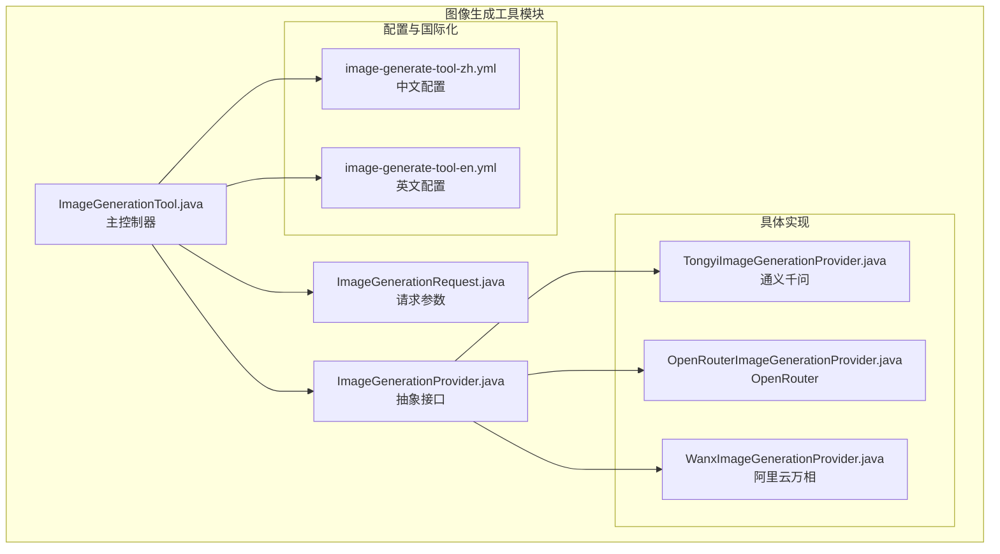
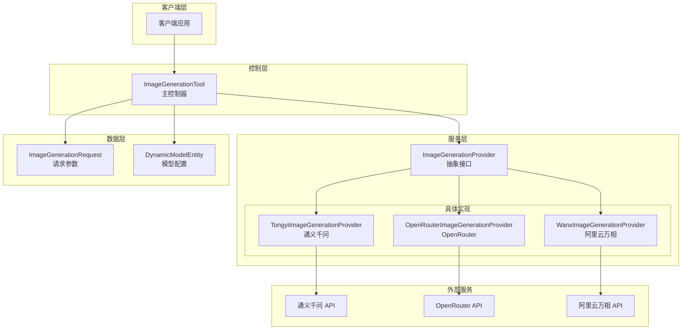
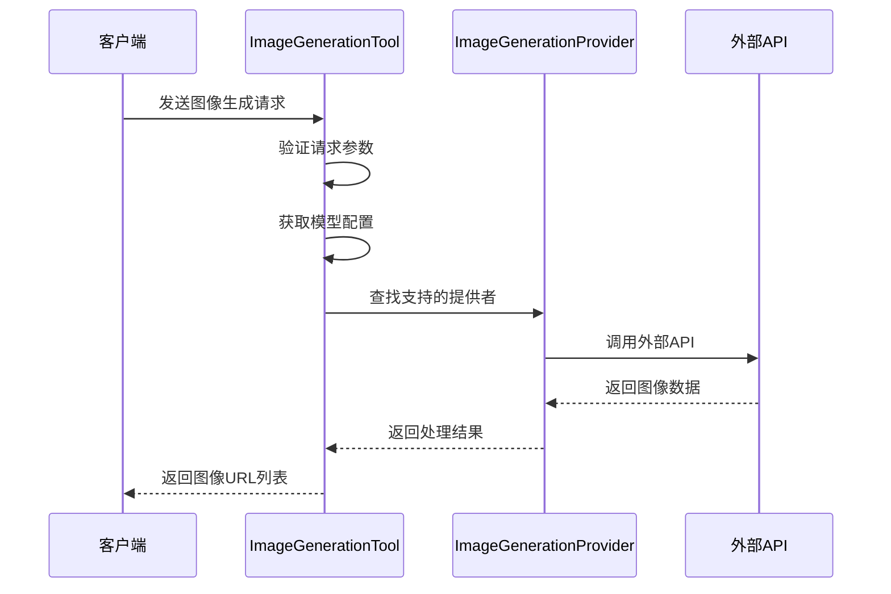
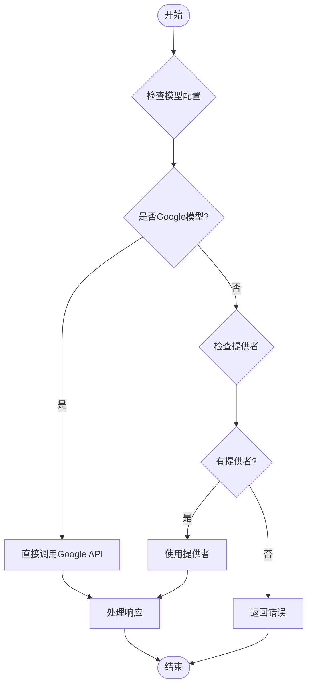
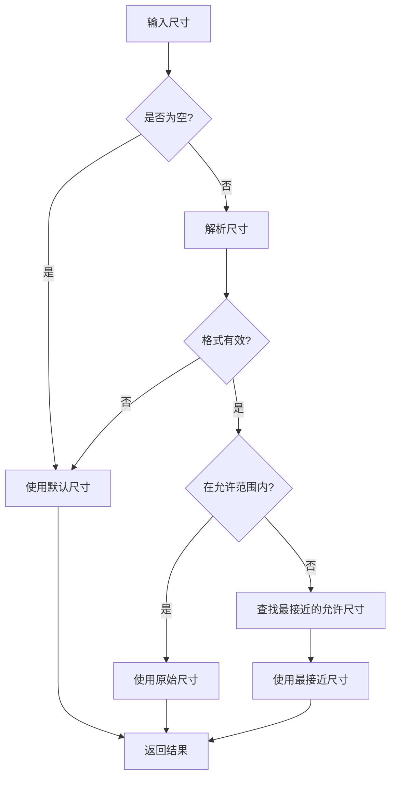
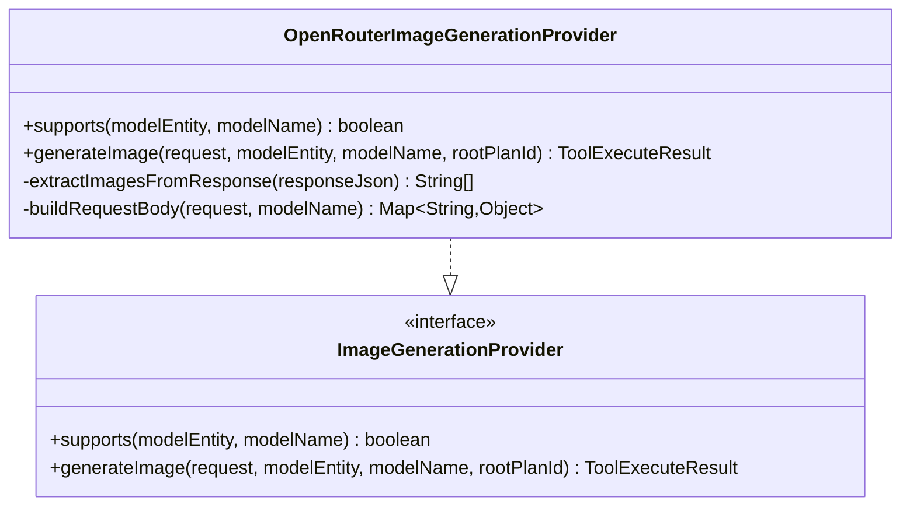
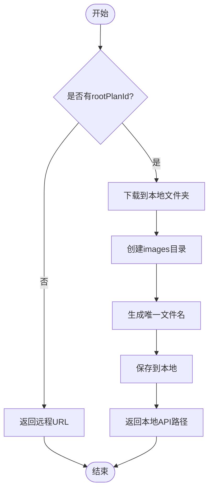
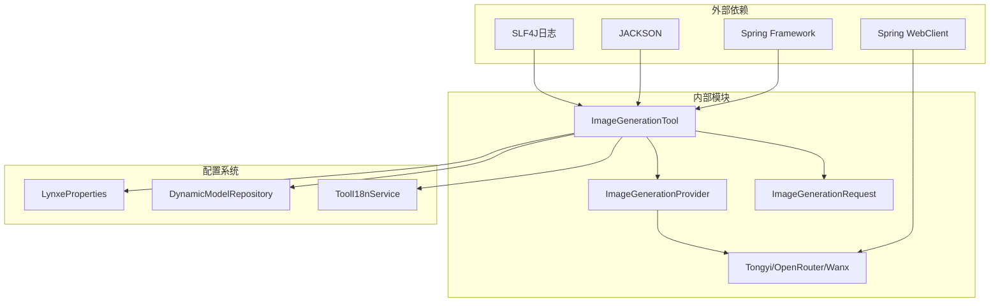

# 图像生成工具

<cite>
**本文档引用的文件**
- [ImageGenerationTool.java](file://src/main/java/com/alibaba/cloud/ai/lynxe/tool/image/ImageGenerationTool.java)
- [ImageGenerationProvider.java](file://src/main/java/com/alibaba/cloud/ai/lynxe/tool/image/ImageGenerationProvider.java)
- [ImageGenerationRequest.java](file://src/main/java/com/alibaba/cloud/ai/lynxe/tool/image/ImageGenerationRequest.java)
- [TongyiImageGenerationProvider.java](file://src/main/java/com/alibaba/cloud/ai/lynxe/tool/image/TongyiImageGenerationProvider.java)
- [OpenRouterImageGenerationProvider.java](file://src/main/java/com/alibaba/cloud/ai/lynxe/tool/image/OpenRouterImageGenerationProvider.java)
- [WanxImageGenerationProvider.java](file://src/main/java/com/alibaba/cloud/ai/lynxe/tool/image/WanxImageGenerationProvider.java)
- [image-generate-tool-zh.yml](file://src/main/resources/i18n/tools/image-generate-tool-zh.yml)
- [image-generate-tool-en.yml](file://src/main/resources/i18n/tools/image-generate-tool-en.yml)
- [application.yml](file://src/main/resources/application.yml)
</cite>

## 目录
1. [简介](#简介)
2. [项目结构](#项目结构)
3. [核心组件](#核心组件)
4. [架构概览](#架构概览)
5. [详细组件分析](#详细组件分析)
6. [依赖关系分析](#依赖关系分析)
7. [性能考虑](#性能考虑)
8. [故障排除指南](#故障排除指南)
9. [结论](#结论)

## 简介

Lynxe 图像生成工具模块是一个基于 Spring Boot 的图像生成解决方案，提供了统一的图像生成接口和多供应商支持机制。该模块支持多种图像生成服务提供商，包括阿里巴巴通义千问、OpenRouter 和阿里云万相等，为用户提供灵活的图像生成能力。

该工具模块采用插件化架构设计，通过抽象接口 ImageGenerationProvider 定义了统一的图像生成接口，不同的具体实现类负责处理特定供应商的 API 集成。模块还提供了完整的错误处理机制、配置管理和国际化支持。

## 项目结构

图像生成工具模块位于 `src/main/java/com/alibaba/cloud/ai/lynxe/tool/image/` 目录下，包含以下核心文件：

**图表来源**
- [ImageGenerationTool.java:1-642](file://src/main/java/com/alibaba/cloud/ai/lynxe/tool/image/ImageGenerationTool.java#L1-L642)
- [ImageGenerationProvider.java:1-49](file://src/main/java/com/alibaba/cloud/ai/lynxe/tool/image/ImageGenerationProvider.java#L1-L49)

**章节来源**
- [ImageGenerationTool.java:16-66](file://src/main/java/com/alibaba/cloud/ai/lynxe/tool/image/ImageGenerationTool.java#L16-L66)
- [application.yml:1-97](file://src/main/resources/application.yml#L1-L97)

## 核心组件

### ImageGenerationTool 主控制器

ImageGenerationTool 是整个图像生成模块的核心控制器，负责协调各个供应商的图像生成服务。它实现了 AbstractBaseTool 接口，并提供了完整的图像生成生命周期管理。

主要功能特性：
- **多供应商路由**：根据模型配置自动选择合适的图像生成提供者
- **统一接口**：对外提供一致的图像生成接口
- **错误处理**：提供详细的错误信息和故障排除指导
- **状态管理**：维护工具的当前状态信息

### ImageGenerationProvider 抽象接口

定义了所有图像生成提供者的统一接口规范，确保不同供应商的实现具有相同的调用方式和返回格式。

关键方法：
- `supports()`：检查提供者是否支持特定的模型配置
- `generateImage()`：执行实际的图像生成操作

### ImageGenerationRequest 请求参数

标准化的图像生成请求参数结构，支持基本的图像生成配置选项。

**章节来源**
- [ImageGenerationTool.java:39-91](file://src/main/java/com/alibaba/cloud/ai/lynxe/tool/image/ImageGenerationTool.java#L39-L91)
- [ImageGenerationProvider.java:21-48](file://src/main/java/com/alibaba/cloud/ai/lynxe/tool/image/ImageGenerationProvider.java#L21-L48)
- [ImageGenerationRequest.java:20-104](file://src/main/java/com/alibaba/cloud/ai/lynxe/tool/image/ImageGenerationRequest.java#L20-L104)

## 架构概览

图像生成工具模块采用了分层架构设计，通过抽象接口实现松耦合的供应商集成：

**图表来源**
- [ImageGenerationTool.java:94-164](file://src/main/java/com/alibaba/cloud/ai/lynxe/tool/image/ImageGenerationTool.java#L94-L164)
- [ImageGenerationProvider.java:25-46](file://src/main/java/com/alibaba/cloud/ai/lynxe/tool/image/ImageGenerationProvider.java#L25-L46)

## 详细组件分析

### ImageGenerationTool 详细分析

#### 核心处理流程

**图表来源**
- [ImageGenerationTool.java:94-164](file://src/main/java/com/alibaba/cloud/ai/lynxe/tool/image/ImageGenerationTool.java#L94-L164)

#### 错误处理机制

ImageGenerationTool 提供了多层次的错误处理机制：

1. **参数验证错误**：检查必需的提示词参数
2. **模型配置错误**：验证模型是否存在且配置正确
3. **供应商不支持**：当没有合适的提供者时的降级处理
4. **API 调用错误**：处理外部 API 调用过程中的异常

#### Google 直接 API 支持

模块还支持直接调用 Google Generative Language API，无需中间层提供者：

**图表来源**
- [ImageGenerationTool.java:136-147](file://src/main/java/com/alibaba/cloud/ai/lynxe/tool/image/ImageGenerationTool.java#L136-L147)

**章节来源**
- [ImageGenerationTool.java:94-642](file://src/main/java/com/alibaba/cloud/ai/lynxe/tool/image/ImageGenerationTool.java#L94-L642)

### TongyiImageGenerationProvider 分析

#### 支持的模型类型

通义千问提供者专门处理阿里巴巴通义千问系列的图像生成和编辑模型：

- **图像生成模型**：qwen-image-plus, qwen-image
- **图像编辑模型**：qwen-image-edit-plus, qwen-image-edit-plus-2025-10-30, qwen-image-edit

#### 尺寸验证和映射

通义千问 API 对图像尺寸有严格的限制：

**图表来源**
- [TongyiImageGenerationProvider.java:332-403](file://src/main/java/com/alibaba/cloud/ai/lynxe/tool/image/TongyiImageGenerationProvider.java#L332-L403)

#### API 集成特点

- **区域支持**：支持北京和新加坡两个区域的 DashScope 服务
- **认证方式**：使用 Bearer Token 认证
- **响应格式**：从 `output.choices[].message.content[].image` 字段提取图像 URL

**章节来源**
- [TongyiImageGenerationProvider.java:41-107](file://src/main/java/com/alibaba/cloud/ai/lynxe/tool/image/TongyiImageGenerationProvider.java#L41-L107)
- [TongyiImageGenerationProvider.java:109-271](file://src/main/java/com/alibaba/cloud/ai/lynxe/tool/image/TongyiImageGenerationProvider.java#L109-L271)

### OpenRouterImageGenerationProvider 分析

#### 支持的模型类型

OpenRouter 提供者支持多种主流的图像生成模型：

- **Google Gemini 系列**：gemini-3-pro-image-preview, gemini-2.5-flash-image 等
- **OpenAI GPT 系列**：gpt-5-image, gpt-5-image-mini 等
- **Sourceful Riverflow 系列**：riverflow-v2-max-preview
- **Black Forest Labs FLUX 系列**：flux.2-pro

#### 模态化生成

OpenRouter 的一个独特特性是支持模态化生成（modalities），允许在同一请求中同时生成文本和图像：

**图表来源**
- [OpenRouterImageGenerationProvider.java:40-53](file://src/main/java/com/alibaba/cloud/ai/lynxe/tool/image/OpenRouterImageGenerationProvider.java#L40-L53)
- [ImageGenerationProvider.java:25-46](file://src/main/java/com/alibaba/cloud/ai/lynxe/tool/image/ImageGenerationProvider.java#L25-L46)

#### 请求构建流程

OpenRouter 的请求构建相对简单，主要是添加 `modalities` 参数：

1. 设置模型名称
2. 构建用户消息内容
3. 添加 `modalities: ["image", "text"]` 参数
4. 发送聊天完成请求

**章节来源**
- [OpenRouterImageGenerationProvider.java:55-125](file://src/main/java/com/alibaba/cloud/ai/lynxe/tool/image/OpenRouterImageGenerationProvider.java#L55-L125)
- [OpenRouterImageGenerationProvider.java:127-258](file://src/main/java/com/alibaba/cloud/ai/lynxe/tool/image/OpenRouterImageGenerationProvider.java#L127-L258)

### WanxImageGenerationProvider 分析

#### 支持的模型类型

阿里云万相提供者支持广泛的图像生成和编辑模型：

- **文本到图像模型 V2**：wan2.6-t2i, wan2.5-t2i-preview, wan2.2-t2i-plus 等
- **文本到图像模型 V1**：wanx-v1
- **图像生成和编辑 2.6**：wan2.6-image
- **通用图像编辑 2.5**：wan2.5-i2i-preview
- **其他专用模型**：草图转图像、局部重绘、背景生成等

#### 高级功能

Wanx 提供者具有独特的本地文件下载功能：

**图表来源**
- [WanxImageGenerationProvider.java:426-505](file://src/main/java/com/alibaba/cloud/ai/lynxe/tool/image/WanxImageGenerationProvider.java#L426-L505)

#### 智能尺寸调整

Wanx 提供者能够根据模型版本智能调整图像尺寸：

- **新模型**（wan2.6-t2i, wan2.5-t2i-preview）：总像素数在 589824 到 2073600 之间，纵横比 1:4 到 4:1
- **旧模型**（wan2.2 及以下）：宽度和高度在 512 到 1440 像素之间

**章节来源**
- [WanxImageGenerationProvider.java:52-173](file://src/main/java/com/alibaba/cloud/ai/lynxe/tool/image/WanxImageGenerationProvider.java#L52-L173)
- [WanxImageGenerationProvider.java:175-365](file://src/main/java/com/alibaba/cloud/ai/lynxe/tool/image/WanxImageGenerationProvider.java#L175-L365)
- [WanxImageGenerationProvider.java:507-622](file://src/main/java/com/alibaba/cloud/ai/lynxe/tool/image/WanxImageGenerationProvider.java#L507-L622)

### ImageGenerationRequest 参数规范

图像生成请求参数遵循标准的 JSON Schema 规范：

| 参数名 | 类型 | 必填 | 默认值 | 描述 |
|--------|------|------|--------|------|
| prompt | string | 是 | - | 描述图像内容的文本提示 |
| model | string | 否 | 配置中的默认模型 | 指定使用的图像生成模型 |
| size | string | 否 | 1024x1024 | 图像尺寸，支持多种预设值 |
| quality | string | 否 | standard | 图像质量设置 |
| n | integer | 否 | 1 | 要生成的图像数量 |

**章节来源**
- [ImageGenerationRequest.java:23-104](file://src/main/java/com/alibaba/cloud/ai/lynxe/tool/image/ImageGenerationRequest.java#L23-L104)
- [image-generate-tool-zh.yml:7-38](file://src/main/resources/i18n/tools/image-generate-tool-zh.yml#L7-L38)
- [image-generate-tool-en.yml:7-38](file://src/main/resources/i18n/tools/image-generate-tool-en.yml#L7-L38)

## 依赖关系分析

图像生成工具模块的依赖关系相对简洁，主要依赖于 Spring Framework 的核心功能：

**图表来源**
- [ImageGenerationTool.java:23-66](file://src/main/java/com/alibaba/cloud/ai/lynxe/tool/image/ImageGenerationTool.java#L23-L66)
- [TongyiImageGenerationProvider.java:23-54](file://src/main/java/com/alibaba/cloud/ai/lynxe/tool/image/TongyiImageGenerationProvider.java#L23-L54)

**章节来源**
- [ImageGenerationTool.java:23-66](file://src/main/java/com/alibaba/cloud/ai/lynxe/tool/image/ImageGenerationTool.java#L23-L66)
- [TongyiImageGenerationProvider.java:23-54](file://src/main/java/com/alibaba/cloud/ai/lynxe/tool/image/TongyiImageGenerationProvider.java#L23-L54)

## 性能考虑

### 缓存机制

虽然当前实现没有显式的缓存机制，但可以通过以下方式优化性能：

1. **响应缓存**：对相同提示词的图像生成结果进行缓存
2. **连接池复用**：利用 Spring WebClient 的连接池功能
3. **异步处理**：对于耗时较长的图像生成任务可以考虑异步处理

### 错误恢复策略

模块提供了完善的错误恢复机制：

- **HTML 响应检测**：自动识别 API 返回 HTML 而非 JSON 的情况
- **模态化错误处理**：针对 OpenRouter 的模态化配置错误提供专门的诊断信息
- **降级策略**：当首选提供者不可用时自动尝试其他可用的提供者

### 资源管理

- **连接管理**：合理管理 HTTP 连接，避免资源泄漏
- **内存使用**：对于大型图像文件，考虑流式处理而非完全加载到内存
- **文件清理**：定期清理临时生成的图像文件

## 故障排除指南

### 常见问题及解决方案

#### HTML 响应错误

当 API 返回 HTML 而非 JSON 时，通常表示配置错误：

**症状**：错误消息包含 "text/html" 字样

**可能原因**：
1. API 密钥无效或未正确加载
2. 基础 URL 配置错误
3. 网络代理导致的重定向

**解决步骤**：
1. 验证 API 密钥的有效性
2. 检查模型配置中的基础 URL
3. 确认网络连接和代理设置

#### 模态化配置错误

OpenRouter 特有的错误，通常发生在模型不支持图像生成时：

**症状**：错误消息包含 "modalities" 或 "modality"

**解决方法**：
1. 验证模型是否支持图像生成
2. 检查模型的输出模态配置
3. 使用专门的图像生成模型

#### Google API 集成问题

直接调用 Google API 时的常见问题：

**症状**：API 调用失败或返回错误

**解决方法**：
1. 确认 Google API 密钥具有 Generative Language API 权限
2. 验证模型名称的正确性
3. 检查 API 基础 URL 的配置

**章节来源**
- [ImageGenerationTool.java:478-607](file://src/main/java/com/alibaba/cloud/ai/lynxe/tool/image/ImageGenerationTool.java#L478-L607)

## 结论

Lynxe 图像生成工具模块是一个设计精良的多供应商图像生成解决方案。其主要优势包括：

1. **模块化设计**：通过抽象接口实现了良好的可扩展性
2. **多供应商支持**：支持通义千问、OpenRouter、阿里云万相等多个主流服务
3. **完善的错误处理**：提供了详细的错误诊断和故障排除指导
4. **灵活的配置**：支持动态模型配置和国际化支持

该模块为开发者提供了统一的图像生成接口，简化了与多个图像生成服务的集成工作。通过合理的架构设计和完善的错误处理机制，该模块能够在生产环境中稳定运行，并为用户提供高质量的图像生成服务。

未来可以考虑的改进方向包括：添加响应缓存机制、实现异步图像生成处理、增强性能监控和指标收集等功能。