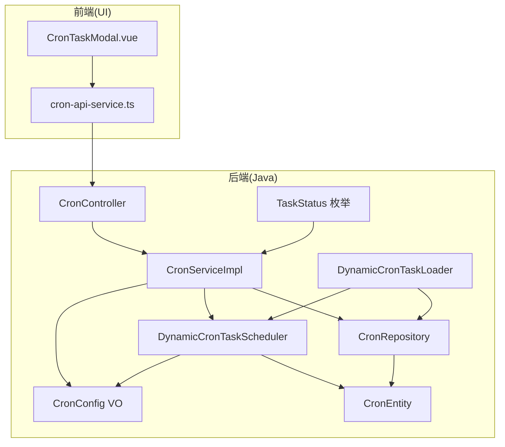
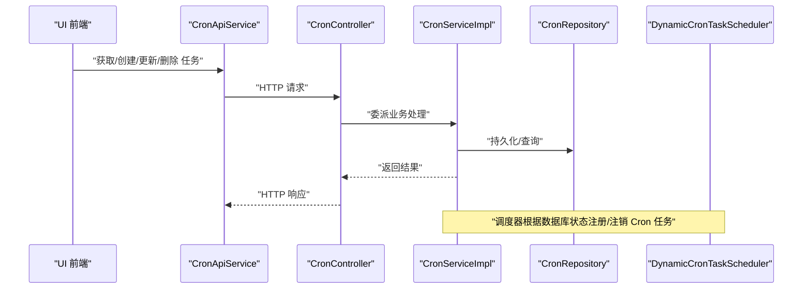
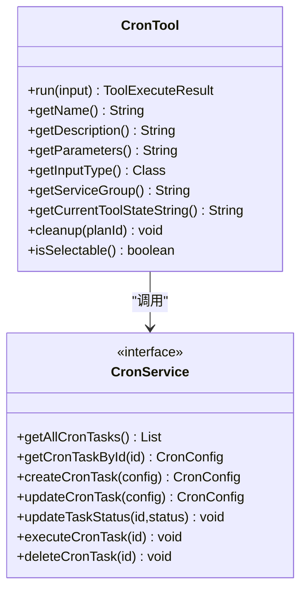
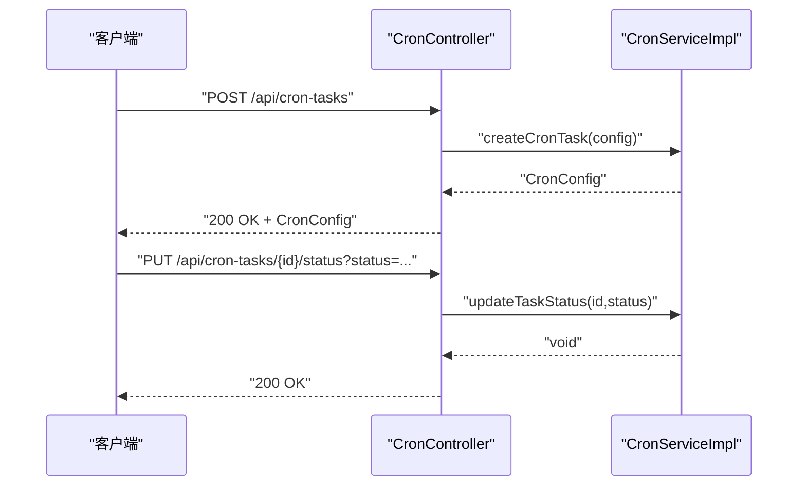
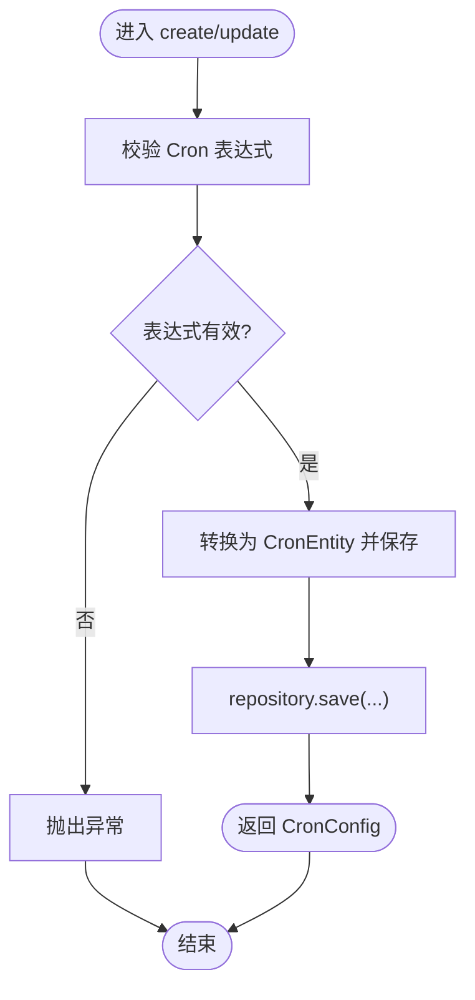
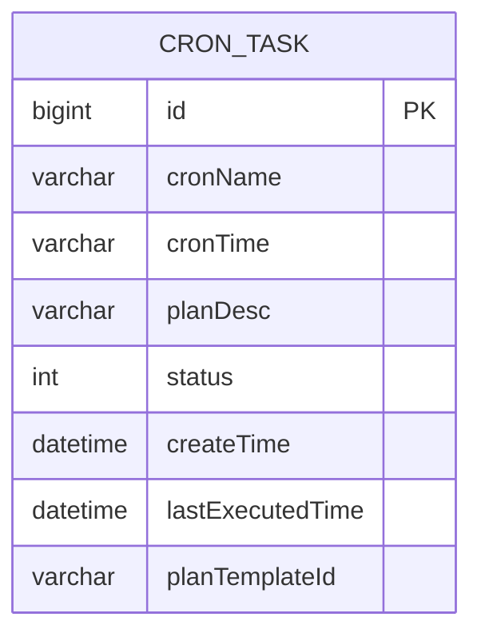
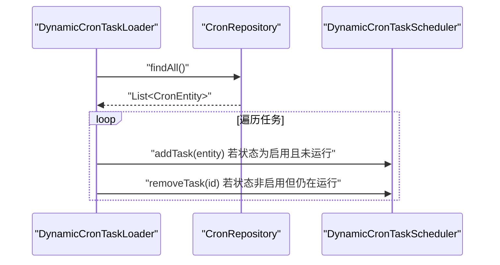
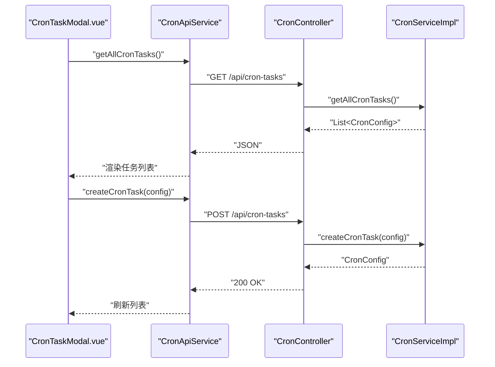
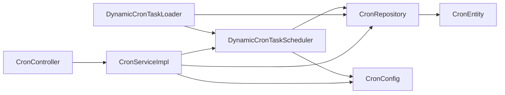

# 定时任务工具

<cite>
**本文引用的文件**
- [CronTool.java](file://src/main/java/com/alibaba/cloud/ai/lynxe/tool/cron/CronTool.java)
- [CronController.java](file://src/main/java/com/alibaba/cloud/ai/lynxe/cron/controller/CronController.java)
- [CronService.java](file://src/main/java/com/alibaba/cloud/ai/lynxe/cron/service/CronService.java)
- [CronServiceImpl.java](file://src/main/java/com/alibaba/cloud/ai/lynxe/cron/service/impl/CronServiceImpl.java)
- [CronEntity.java](file://src/main/java/com/alibaba/cloud/ai/lynxe/cron/entity/CronEntity.java)
- [CronRepository.java](file://src/main/java/com/alibaba/cloud/ai/lynxe/cron/repository/CronRepository.java)
- [TaskStatus.java](file://src/main/java/com/alibaba/cloud/ai/lynxe/cron/enums/TaskStatus.java)
- [CronConfig.java](file://src/main/java/com/alibaba/cloud/ai/lynxe/cron/vo/CronConfig.java)
- [DynamicCronTaskScheduler.java](file://src/main/java/com/alibaba/cloud/ai/lynxe/cron/scheduler/DynamicCronTaskScheduler.java)
- [DynamicCronTaskLoader.java](file://src/main/java/com/alibaba/cloud/ai/lynxe/cron/scheduler/DynamicCronTaskLoader.java)
- [cron-tool-zh.yml](file://src/main/resources/i18n/tools/cron-tool-zh.yml)
- [cron-tool-en.yml](file://src/main/resources/i18n/tools/cron-tool-en.yml)
- [cron-api-service.ts](file://ui-vue3/src/api/cron-api-service.ts)
- [CronTaskModal.vue](file://ui-vue3/src/components/cron-task-modal/CronTaskModal.vue)
</cite>

## 目录
1. [简介](#简介)
2. [项目结构](#项目结构)
3. [核心组件](#核心组件)
4. [架构总览](#架构总览)
5. [详细组件分析](#详细组件分析)
6. [依赖分析](#依赖分析)
7. [性能考虑](#性能考虑)
8. [故障排查指南](#故障排查指南)
9. [结论](#结论)
10. [附录](#附录)

## 简介
本文件为 Lynxe 定时任务工具的功能文档，聚焦 CronTool 的 Cron 表达式解析与任务调度机制，系统阐述定时任务的创建、修改、删除与执行监控；覆盖任务历史记录、状态跟踪与错误处理；提供 Cron 表达式的语法说明、验证规则与最佳实践；解释安全控制、权限管理与资源限制；并给出性能监控、日志记录与故障恢复机制的建议与实现要点。

## 项目结构
定时任务模块采用分层设计：前端通过 API 服务调用后端 REST 接口；后端控制器接收请求，委派给服务层进行业务处理；服务层负责校验与持久化，并与调度器交互；调度器基于数据库中的任务配置动态注册/注销 Spring TaskScheduler 的 Cron 任务；实体与仓库负责数据模型与查询。

**图表来源**
- [CronController.java:36-94](file://src/main/java/com/alibaba/cloud/ai/lynxe/cron/controller/CronController.java#L36-L94)
- [CronServiceImpl.java:33-142](file://src/main/java/com/alibaba/cloud/ai/lynxe/cron/service/impl/CronServiceImpl.java#L33-L142)
- [CronRepository.java:25-34](file://src/main/java/com/alibaba/cloud/ai/lynxe/cron/repository/CronRepository.java#L25-L34)
- [CronEntity.java:30-144](file://src/main/java/com/alibaba/cloud/ai/lynxe/cron/entity/CronEntity.java#L30-L144)
- [TaskStatus.java:21-59](file://src/main/java/com/alibaba/cloud/ai/lynxe/cron/enums/TaskStatus.java#L21-L59)
- [CronConfig.java:24-108](file://src/main/java/com/alibaba/cloud/ai/lynxe/cron/vo/CronConfig.java#L24-L108)
- [DynamicCronTaskScheduler.java:51-337](file://src/main/java/com/alibaba/cloud/ai/lynxe/cron/scheduler/DynamicCronTaskScheduler.java#L51-L337)
- [DynamicCronTaskLoader.java:33-109](file://src/main/java/com/alibaba/cloud/ai/lynxe/cron/scheduler/DynamicCronTaskLoader.java#L33-L109)

**章节来源**
- [CronController.java:36-94](file://src/main/java/com/alibaba/cloud/ai/lynxe/cron/controller/CronController.java#L36-L94)
- [CronServiceImpl.java:33-142](file://src/main/java/com/alibaba/cloud/ai/lynxe/cron/service/impl/CronServiceImpl.java#L33-L142)
- [CronRepository.java:25-34](file://src/main/java/com/alibaba/cloud/ai/lynxe/cron/repository/CronRepository.java#L25-L34)
- [CronEntity.java:30-144](file://src/main/java/com/alibaba/cloud/ai/lynxe/cron/entity/CronEntity.java#L30-L144)
- [TaskStatus.java:21-59](file://src/main/java/com/alibaba/cloud/ai/lynxe/cron/enums/TaskStatus.java#L21-L59)
- [CronConfig.java:24-108](file://src/main/java/com/alibaba/cloud/ai/lynxe/cron/vo/CronConfig.java#L24-L108)
- [DynamicCronTaskScheduler.java:51-337](file://src/main/java/com/alibaba/cloud/ai/lynxe/cron/scheduler/DynamicCronTaskScheduler.java#L51-L337)
- [DynamicCronTaskLoader.java:33-109](file://src/main/java/com/alibaba/cloud/ai/lynxe/cron/scheduler/DynamicCronTaskLoader.java#L33-L109)

## 核心组件
- CronTool：作为工具入口，接收用户输入的 cron 名称、cron 表达式与计划描述，封装为 CronConfig 并调用 CronService 创建任务。
- CronController：提供 REST API，支持获取全部任务、按 ID 获取、创建、更新、更新状态、手动执行与删除。
- CronService/CronServiceImpl：定义与实现任务 CRUD、状态更新、手动执行、删除以及 Cron 表达式校验。
- CronEntity/CronRepository：映射数据库表 cron_task，提供基础查询能力。
- TaskStatus：任务状态枚举（启用/禁用）。
- CronConfig：对外 VO，承载任务字段（含计划模板 ID 字段）。
- DynamicCronTaskScheduler：调度器，基于 Spring TaskScheduler 注册/注销 Cron 任务，执行时更新最后执行时间并触发计划执行。
- DynamicCronTaskLoader：启动加载与周期同步，从数据库加载启用的任务并保持运行中任务与数据库状态一致。

**章节来源**
- [CronTool.java:27-156](file://src/main/java/com/alibaba/cloud/ai/lynxe/tool/cron/CronTool.java#L27-L156)
- [CronController.java:36-94](file://src/main/java/com/alibaba/cloud/ai/lynxe/cron/controller/CronController.java#L36-L94)
- [CronService.java:22-38](file://src/main/java/com/alibaba/cloud/ai/lynxe/cron/service/CronService.java#L22-L38)
- [CronServiceImpl.java:33-142](file://src/main/java/com/alibaba/cloud/ai/lynxe/cron/service/impl/CronServiceImpl.java#L33-L142)
- [CronEntity.java:30-144](file://src/main/java/com/alibaba/cloud/ai/lynxe/cron/entity/CronEntity.java#L30-L144)
- [CronRepository.java:25-34](file://src/main/java/com/alibaba/cloud/ai/lynxe/cron/repository/CronRepository.java#L25-L34)
- [TaskStatus.java:21-59](file://src/main/java/com/alibaba/cloud/ai/lynxe/cron/enums/TaskStatus.java#L21-L59)
- [CronConfig.java:24-108](file://src/main/java/com/alibaba/cloud/ai/lynxe/cron/vo/CronConfig.java#L24-L108)
- [DynamicCronTaskScheduler.java:51-337](file://src/main/java/com/alibaba/cloud/ai/lynxe/cron/scheduler/DynamicCronTaskScheduler.java#L51-L337)
- [DynamicCronTaskLoader.java:33-109](file://src/main/java/com/alibaba/cloud/ai/lynxe/cron/scheduler/DynamicCronTaskLoader.java#L33-L109)

## 架构总览
下图展示从 UI 到后端的典型调用链路与关键对象交互：

**图表来源**
- [cron-api-service.ts:19-131](file://ui-vue3/src/api/cron-api-service.ts#L19-L131)
- [CronController.java:36-94](file://src/main/java/com/alibaba/cloud/ai/lynxe/cron/controller/CronController.java#L36-L94)
- [CronServiceImpl.java:33-142](file://src/main/java/com/alibaba/cloud/ai/lynxe/cron/service/impl/CronServiceImpl.java#L33-L142)
- [CronRepository.java:25-34](file://src/main/java/com/alibaba/cloud/ai/lynxe/cron/repository/CronRepository.java#L25-L34)
- [DynamicCronTaskScheduler.java:51-337](file://src/main/java/com/alibaba/cloud/ai/lynxe/cron/scheduler/DynamicCronTaskScheduler.java#L51-L337)

## 详细组件分析

### CronTool 组件
- 职责：将用户输入封装为 CronConfig，调用 CronService 创建任务，并返回执行结果。
- 关键点：
  - 输入参数包括任务名、Cron 表达式与计划描述。
  - 将输入映射到 CronConfig 后设置初始状态为“启用”。
  - 使用 ObjectMapper 输出结构化结果，便于前端展示。
  - 国际化参数与描述由 ToolI18nService 提供。

**图表来源**
- [CronTool.java:27-156](file://src/main/java/com/alibaba/cloud/ai/lynxe/tool/cron/CronTool.java#L27-L156)
- [CronService.java:22-38](file://src/main/java/com/alibaba/cloud/ai/lynxe/cron/service/CronService.java#L22-L38)

**章节来源**
- [CronTool.java:88-112](file://src/main/java/com/alibaba/cloud/ai/lynxe/tool/cron/CronTool.java#L88-L112)
- [cron-tool-zh.yml:1-24](file://src/main/resources/i18n/tools/cron-tool-zh.yml#L1-L24)
- [cron-tool-en.yml:1-24](file://src/main/resources/i18n/tools/cron-tool-en.yml#L1-L24)

### CronController 组件
- 职责：暴露 REST API，处理任务的增删改查与状态变更、手动执行。
- 关键点：
  - GET /api/cron-tasks：列出所有任务。
  - GET /api/cron-tasks/{id}：按 ID 查询。
  - POST /api/cron-tasks：创建任务。
  - PUT /api/cron-tasks/{id}：更新任务。
  - PUT /api/cron-tasks/{id}/status?status=...：更新状态。
  - POST /api/cron-tasks/{id}/execute：手动执行一次。
  - DELETE /api/cron-tasks/{id}：删除任务。
  - 对非法参数返回 400。

**图表来源**
- [CronController.java:44-92](file://src/main/java/com/alibaba/cloud/ai/lynxe/cron/controller/CronController.java#L44-L92)
- [CronServiceImpl.java:59-91](file://src/main/java/com/alibaba/cloud/ai/lynxe/cron/service/impl/CronServiceImpl.java#L59-L91)

**章节来源**
- [CronController.java:44-92](file://src/main/java/com/alibaba/cloud/ai/lynxe/cron/controller/CronController.java#L44-L92)

### CronService/CronServiceImpl 组件
- 职责：业务逻辑与数据访问协调者。
- 关键点：
  - 创建/更新任务前对 Cron 表达式进行校验（使用 Spring CronExpression）。
  - 更新任务会移除旧任务并等待调度器重新加载。
  - 手动执行委托给调度器。
  - 删除直接删除数据库记录。

**图表来源**
- [CronServiceImpl.java:128-140](file://src/main/java/com/alibaba/cloud/ai/lynxe/cron/service/impl/CronServiceImpl.java#L128-L140)
- [CronServiceImpl.java:59-91](file://src/main/java/com/alibaba/cloud/ai/lynxe/cron/service/impl/CronServiceImpl.java#L59-L91)

**章节来源**
- [CronService.java:22-38](file://src/main/java/com/alibaba/cloud/ai/lynxe/cron/service/CronService.java#L22-L38)
- [CronServiceImpl.java:59-140](file://src/main/java/com/alibaba/cloud/ai/lynxe/cron/service/impl/CronServiceImpl.java#L59-L140)

### 数据模型与仓库
- CronEntity：映射 cron_task 表，包含任务名、Cron 表达式、计划描述、状态、创建时间、最后执行时间与计划模板 ID。
- CronRepository：提供按 cronTime、planDesc、cronName 的模糊查询能力。
- TaskStatus：启用/禁用两种状态码。

**图表来源**
- [CronEntity.java:30-144](file://src/main/java/com/alibaba/cloud/ai/lynxe/cron/entity/CronEntity.java#L30-L144)
- [CronRepository.java:25-34](file://src/main/java/com/alibaba/cloud/ai/lynxe/cron/repository/CronRepository.java#L25-L34)
- [TaskStatus.java:21-59](file://src/main/java/com/alibaba/cloud/ai/lynxe/cron/enums/TaskStatus.java#L21-L59)

**章节来源**
- [CronEntity.java:30-144](file://src/main/java/com/alibaba/cloud/ai/lynxe/cron/entity/CronEntity.java#L30-L144)
- [CronRepository.java:25-34](file://src/main/java/com/alibaba/cloud/ai/lynxe/cron/repository/CronRepository.java#L25-L34)
- [TaskStatus.java:21-59](file://src/main/java/com/alibaba/cloud/ai/lynxe/cron/enums/TaskStatus.java#L21-L59)

### 调度器与加载器
- DynamicCronTaskScheduler：
  - 将 CronEntity 注册为 Spring Cron 任务，使用 CronTrigger。
  - 执行前更新 lastExecutedTime；支持按模板或直接计划执行。
  - 提供按 ID 立即执行的能力。
- DynamicCronTaskLoader：
  - 应用启动时加载所有启用任务。
  - 每 10 秒同步数据库与运行中任务集合，确保状态一致。

**图表来源**
- [DynamicCronTaskLoader.java:53-82](file://src/main/java/com/alibaba/cloud/ai/lynxe/cron/scheduler/DynamicCronTaskLoader.java#L53-L82)
- [DynamicCronTaskScheduler.java:161-182](file://src/main/java/com/alibaba/cloud/ai/lynxe/cron/scheduler/DynamicCronTaskScheduler.java#L161-L182)

**章节来源**
- [DynamicCronTaskScheduler.java:87-110](file://src/main/java/com/alibaba/cloud/ai/lynxe/cron/scheduler/DynamicCronTaskScheduler.java#L87-L110)
- [DynamicCronTaskScheduler.java:161-211](file://src/main/java/com/alibaba/cloud/ai/lynxe/cron/scheduler/DynamicCronTaskScheduler.java#L161-L211)
- [DynamicCronTaskLoader.java:47-82](file://src/main/java/com/alibaba/cloud/ai/lynxe/cron/scheduler/DynamicCronTaskLoader.java#L47-L82)

### 前端交互与 API 服务
- cron-api-service.ts：封装 /api/cron-tasks 的 GET/POST/PUT/DELETE 与状态更新接口。
- CronTaskModal.vue：提供任务列表、详情、创建/编辑、启用/禁用、删除、手动执行等交互；支持复制 Cron 表达式、AI 助手生成模板等。

**图表来源**
- [cron-api-service.ts:24-68](file://ui-vue3/src/api/cron-api-service.ts#L24-L68)
- [CronController.java:44-57](file://src/main/java/com/alibaba/cloud/ai/lynxe/cron/controller/CronController.java#L44-L57)
- [CronServiceImpl.java:47-76](file://src/main/java/com/alibaba/cloud/ai/lynxe/cron/service/impl/CronServiceImpl.java#L47-L76)

**章节来源**
- [cron-api-service.ts:19-131](file://ui-vue3/src/api/cron-api-service.ts#L19-L131)
- [CronTaskModal.vue:276-337](file://ui-vue3/src/components/cron-task-modal/CronTaskModal.vue#L276-L337)

## 依赖分析
- 控制器依赖服务接口，服务实现依赖仓库与调度器。
- 调度器依赖 TaskScheduler、仓库、计划工厂与协调器。
- 加载器依赖仓库与调度器，周期性同步任务状态。
- 实体与 VO 之间存在映射关系，保证持久化与对外传输的一致性。

**图表来源**
- [CronController.java:36-94](file://src/main/java/com/alibaba/cloud/ai/lynxe/cron/controller/CronController.java#L36-L94)
- [CronServiceImpl.java:33-142](file://src/main/java/com/alibaba/cloud/ai/lynxe/cron/service/impl/CronServiceImpl.java#L33-L142)
- [DynamicCronTaskScheduler.java:51-85](file://src/main/java/com/alibaba/cloud/ai/lynxe/cron/scheduler/DynamicCronTaskScheduler.java#L51-L85)
- [DynamicCronTaskLoader.java:33-45](file://src/main/java/com/alibaba/cloud/ai/lynxe/cron/scheduler/DynamicCronTaskLoader.java#L33-L45)
- [CronRepository.java:25-34](file://src/main/java/com/alibaba/cloud/ai/lynxe/cron/repository/CronRepository.java#L25-L34)
- [CronEntity.java:30-144](file://src/main/java/com/alibaba/cloud/ai/lynxe/cron/entity/CronEntity.java#L30-L144)
- [CronConfig.java:24-108](file://src/main/java/com/alibaba/cloud/ai/lynxe/cron/vo/CronConfig.java#L24-L108)

**章节来源**
- [CronController.java:36-94](file://src/main/java/com/alibaba/cloud/ai/lynxe/cron/controller/CronController.java#L36-L94)
- [CronServiceImpl.java:33-142](file://src/main/java/com/alibaba/cloud/ai/lynxe/cron/service/impl/CronServiceImpl.java#L33-L142)
- [DynamicCronTaskScheduler.java:51-85](file://src/main/java/com/alibaba/cloud/ai/lynxe/cron/scheduler/DynamicCronTaskScheduler.java#L51-L85)
- [DynamicCronTaskLoader.java:33-45](file://src/main/java/com/alibaba/cloud/ai/lynxe/cron/scheduler/DynamicCronTaskLoader.java#L33-L45)

## 性能考虑
- 调度器并发：使用 ConcurrentHashMap 存储运行中的任务，避免锁竞争；按需注册/注销，降低无效调度开销。
- 同步频率：每 10 秒同步一次数据库与运行中任务集合，平衡一致性与性能。
- Cron 表达式校验：在创建/更新阶段完成，避免调度器运行期失败重试。
- 计划执行：按模板执行时解析最新版本计划 JSON，建议缓存热点模板以减少 IO。
- 日志与监控：建议结合应用监控体系记录任务执行耗时、失败率与队列长度。

## 故障排查指南
- Cron 表达式无效：服务层在创建/更新时校验，若非法会抛出异常并记录错误日志。请检查表达式格式与参数数量。
- 任务未执行：确认任务状态为启用；检查调度器是否成功注册；查看同步任务是否被移除。
- 手动执行失败：确认任务 ID 存在；查看调度器执行日志；检查计划模板是否存在且可解析。
- 删除失败：确认 ID 类型正确；检查是否存在外键约束或业务拦截。

**章节来源**
- [CronServiceImpl.java:128-140](file://src/main/java/com/alibaba/cloud/ai/lynxe/cron/service/impl/CronServiceImpl.java#L128-L140)
- [DynamicCronTaskScheduler.java:161-182](file://src/main/java/com/alibaba/cloud/ai/lynxe/cron/scheduler/DynamicCronTaskScheduler.java#L161-L182)
- [CronController.java:72-92](file://src/main/java/com/alibaba/cloud/ai/lynxe/cron/controller/CronController.java#L72-L92)

## 结论
Lynxe 定时任务工具通过清晰的分层设计与 Spring 调度能力，实现了对 Cron 表达式的可靠解析与任务生命周期管理。前后端协作完善，具备良好的扩展性与可观测性。建议在生产环境中配合完善的监控与告警体系，持续优化 Cron 表达式与计划模板，确保任务稳定高效运行。

## 附录

### Cron 表达式语法与最佳实践
- 语法说明：表达式通常包含秒、分、时、日、月、周几等字段；具体字段数量与取值范围遵循标准规范。
- 验证规则：后端在创建/更新时使用 CronExpression 进行严格校验；前端可提供即时提示以提升体验。
- 最佳实践：
  - 使用稳定的时区与服务器时间基准。
  - 避免过于密集的调度频率，预留执行窗口与缓冲。
  - 对关键任务设置健康检查与告警阈值。
  - 对计划模板进行版本化管理，确保执行一致性。

**章节来源**
- [CronServiceImpl.java:128-140](file://src/main/java/com/alibaba/cloud/ai/lynxe/cron/service/impl/CronServiceImpl.java#L128-L140)
- [cron-tool-zh.yml:12-14](file://src/main/resources/i18n/tools/cron-tool-zh.yml#L12-L14)
- [cron-tool-en.yml:12-14](file://src/main/resources/i18n/tools/cron-tool-en.yml#L12-L14)

### 任务状态与权限管理
- 状态管理：通过 TaskStatus 枚举控制启用/禁用；控制器提供状态更新接口。
- 权限控制：当前控制器未内置鉴权逻辑，建议在网关或控制器层增加认证与授权策略。
- 资源限制：可通过线程池与调度器配置限制并发任务数；对计划执行设置超时与重试上限。

**章节来源**
- [TaskStatus.java:21-59](file://src/main/java/com/alibaba/cloud/ai/lynxe/cron/enums/TaskStatus.java#L21-L59)
- [CronController.java:65-70](file://src/main/java/com/alibaba/cloud/ai/lynxe/cron/controller/CronController.java#L65-L70)

### 执行监控与日志记录
- 执行记录：每次任务执行会更新 lastExecutedTime；建议扩展记录执行结果与耗时。
- 日志记录：调度器与服务层均输出关键日志；建议统一日志格式与级别。
- 故障恢复：调度器在异常时记录错误并继续运行；建议增加重试策略与死信队列。

**章节来源**
- [DynamicCronTaskScheduler.java:91-110](file://src/main/java/com/alibaba/cloud/ai/lynxe/cron/scheduler/DynamicCronTaskScheduler.java#L91-L110)
- [CronServiceImpl.java:60-76](file://src/main/java/com/alibaba/cloud/ai/lynxe/cron/service/impl/CronServiceImpl.java#L60-L76)