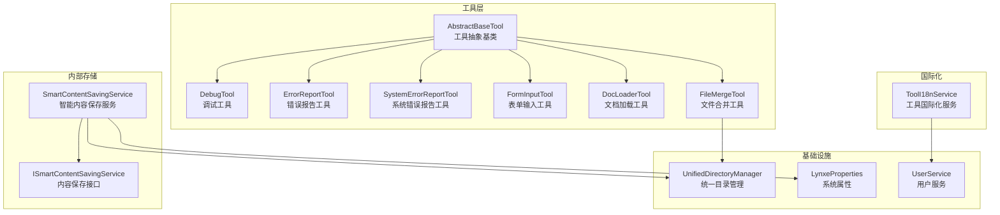
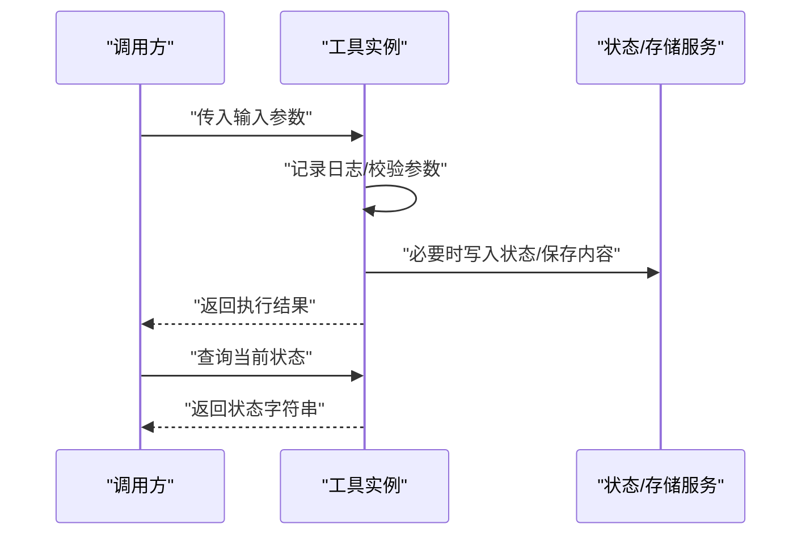
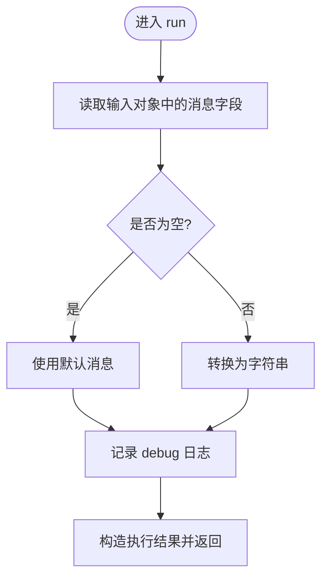
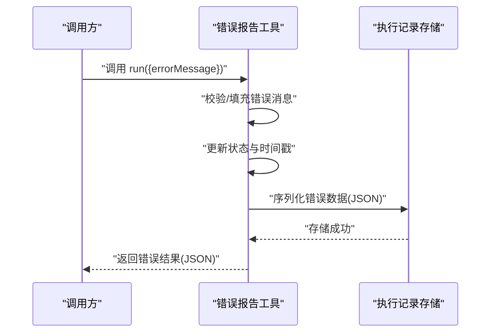
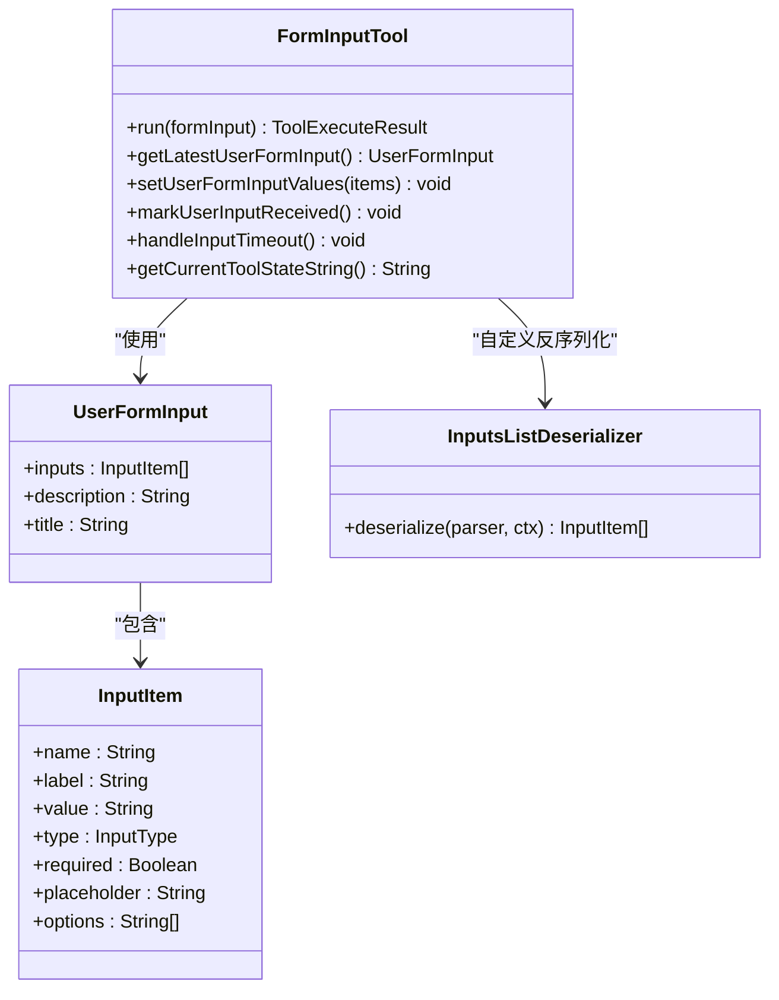
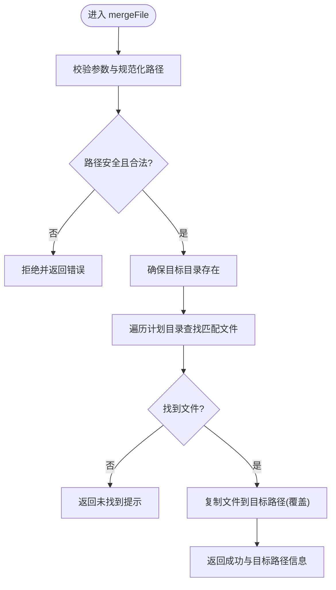
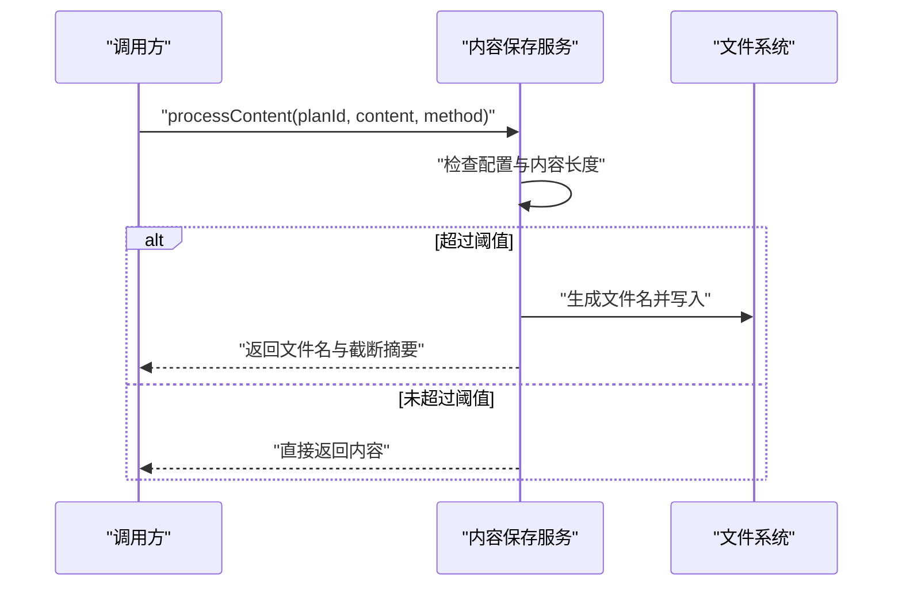
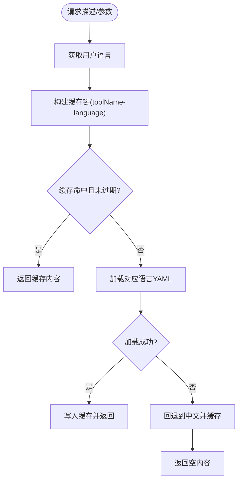
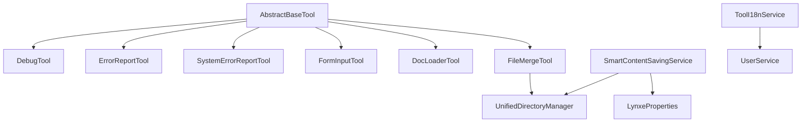

# 实用工具集合

<cite>
**本文引用的文件**
- [DebugTool.java](file://src/main/java/com/alibaba/cloud/ai/lynxe/tool/DebugTool.java)
- [ErrorReportTool.java](file://src/main/java/com/alibaba/cloud/ai/lynxe/tool/ErrorReportTool.java)
- [SystemErrorReportTool.java](file://src/main/java/com/alibaba/cloud/ai/lynxe/tool/SystemErrorReportTool.java)
- [FormInputTool.java](file://src/main/java/com/alibaba/cloud/ai/lynxe/tool/FormInputTool.java)
- [DocLoaderTool.java](file://src/main/java/com/alibaba/cloud/ai/lynxe/tool/DocLoaderTool.java)
- [FileMergeTool.java](file://src/main/java/com/alibaba/cloud/ai/lynxe/tool/innerStorage/FileMergeTool.java)
- [ISmartContentSavingService.java](file://src/main/java/com/alibaba/cloud/ai/lynxe/tool/innerStorage/ISmartContentSavingService.java)
- [SmartContentSavingService.java](file://src/main/java/com/alibaba/cloud/ai/lynxe/tool/innerStorage/SmartContentSavingService.java)
- [ToolI18nService.java](file://src/main/java/com/alibaba/cloud/ai/lynxe/tool/i18n/ToolI18nService.java)
- [AbstractBaseTool.java](file://src/main/java/com/alibaba/cloud/ai/lynxe/tool/AbstractBaseTool.java)
- [UnifiedDirectoryManager.java](file://src/main/java/com/alibaba/cloud/ai/lynxe/tool/filesystem/UnifiedDirectoryManager.java)
- [LynxeProperties.java](file://src/main/java/com/alibaba/cloud/ai/lynxe/config/LynxeProperties.java)
- [UserService.java](file://src/main/java/com/alibaba/cloud/ai/lynxe/user/service/UserService.java)
</cite>

## 目录
1. [简介](#简介)
2. [项目结构](#项目结构)
3. [核心组件](#核心组件)
4. [架构总览](#架构总览)
5. [详细组件分析](#详细组件分析)
6. [依赖分析](#依赖分析)
7. [性能考虑](#性能考虑)
8. [故障排查指南](#故障排查指南)
9. [结论](#结论)
10. [附录](#附录)

## 简介
本文件为 Lynxe 实用工具集合的功能文档，重点覆盖以下工具与能力：
- 调试与日志：DebugTool 的调试输出与日志记录机制
- 错误报告与系统诊断：ErrorReportTool（可终止）与 SystemErrorReportTool（不可终止）的错误上报与执行记录
- 表单输入处理：FormInputTool 的表单定义、数据收集与状态管理
- 文档加载：DocLoaderTool 的文档内容提取（当前为占位实现）
- 文件上传与存储：UploadedFileLoaderTool 的上传处理与存储管理（当前为占位实现）
- 文件合并：FileMergeTool 的文件合并策略与安全校验
- 内容保存：SmartContentSavingService 的智能内容保存与截断摘要生成
- 国际化：ToolI18nService 的多语言描述与参数加载
- 工具基类：AbstractBaseTool 的统一接口与上下文管理

## 项目结构
工具模块位于后端 Java 源码中，按功能域分层组织：
- tool：通用工具抽象与具体工具实现
- tool/innerStorage：内部存储与内容保存服务
- tool/i18n：工具国际化服务
- tool/filesystem：文件系统与目录管理（用于存储与合并）
- config：系统配置（如智能保存开关）
- user/service：用户服务（用于语言偏好）

**图表来源**
- [AbstractBaseTool.java:30-193](file://src/main/java/com/alibaba/cloud/ai/lynxe/tool/AbstractBaseTool.java#L30-L193)
- [DebugTool.java:30-119](file://src/main/java/com/alibaba/cloud/ai/lynxe/tool/DebugTool.java#L30-L119)
- [ErrorReportTool.java:31-184](file://src/main/java/com/alibaba/cloud/ai/lynxe/tool/ErrorReportTool.java#L31-L184)
- [SystemErrorReportTool.java:33-178](file://src/main/java/com/alibaba/cloud/ai/lynxe/tool/SystemErrorReportTool.java#L33-L178)
- [FormInputTool.java:39-471](file://src/main/java/com/alibaba/cloud/ai/lynxe/tool/FormInputTool.java#L39-L471)
- [DocLoaderTool.java:30-217](file://src/main/java/com/alibaba/cloud/ai/lynxe/tool/DocLoaderTool.java#L30-L217)
- [FileMergeTool.java:36-320](file://src/main/java/com/alibaba/cloud/ai/lynxe/tool/innerStorage/FileMergeTool.java#L36-L320)
- [ISmartContentSavingService.java:24-42](file://src/main/java/com/alibaba/cloud/ai/lynxe/tool/innerStorage/ISmartContentSavingService.java#L24-L42)
- [SmartContentSavingService.java:34-181](file://src/main/java/com/alibaba/cloud/ai/lynxe/tool/innerStorage/SmartContentSavingService.java#L34-L181)
- [ToolI18nService.java:35-221](file://src/main/java/com/alibaba/cloud/ai/lynxe/tool/i18n/ToolI18nService.java#L35-L221)
- [UnifiedDirectoryManager.java](file://src/main/java/com/alibaba/cloud/ai/lynxe/tool/filesystem/UnifiedDirectoryManager.java)
- [LynxeProperties.java](file://src/main/java/com/alibaba/cloud/ai/lynxe/config/LynxeProperties.java)
- [UserService.java](file://src/main/java/com/alibaba/cloud/ai/lynxe/user/service/UserService.java)

**章节来源**
- [AbstractBaseTool.java:30-193](file://src/main/java/com/alibaba/cloud/ai/lynxe/tool/AbstractBaseTool.java#L30-L193)
- [ToolI18nService.java:35-221](file://src/main/java/com/alibaba/cloud/ai/lynxe/tool/i18n/ToolI18nService.java#L35-L221)

## 核心组件
- 工具抽象基类：提供计划 ID 上下文、服务组描述拼接、状态字符串获取与异常兜底等通用能力
- 调试工具：接收消息参数，记录 info/debug 日志，并直接返回结果
- 错误报告工具：记录错误消息与时间戳，序列化为 JSON 存储；可终止执行
- 系统错误报告工具：与上类似但不终止执行，供系统内部使用
- 表单输入工具：定义输入项类型、描述与标题；支持用户提交值回填与超时处理
- 文档加载工具：当前为占位实现（保留未来扩展 PDF 等文档解析）
- 文件合并工具：在计划目录内按名称匹配文件并复制到目标相对路径，含安全校验
- 内容保存服务：根据长度阈值自动落盘并生成截断摘要，支持配置开关
- 国际化服务：基于用户语言从资源目录加载工具描述与参数 JSON

**章节来源**
- [DebugTool.java:30-119](file://src/main/java/com/alibaba/cloud/ai/lynxe/tool/DebugTool.java#L30-L119)
- [ErrorReportTool.java:31-184](file://src/main/java/com/alibaba/cloud/ai/lynxe/tool/ErrorReportTool.java#L31-L184)
- [SystemErrorReportTool.java:33-178](file://src/main/java/com/alibaba/cloud/ai/lynxe/tool/SystemErrorReportTool.java#L33-L178)
- [FormInputTool.java:39-471](file://src/main/java/com/alibaba/cloud/ai/lynxe/tool/FormInputTool.java#L39-L471)
- [DocLoaderTool.java:30-217](file://src/main/java/com/alibaba/cloud/ai/lynxe/tool/DocLoaderTool.java#L30-L217)
- [FileMergeTool.java:36-320](file://src/main/java/com/alibaba/cloud/ai/lynxe/tool/innerStorage/FileMergeTool.java#L36-L320)
- [ISmartContentSavingService.java:24-42](file://src/main/java/com/alibaba/cloud/ai/lynxe/tool/innerStorage/ISmartContentSavingService.java#L24-L42)
- [SmartContentSavingService.java:34-181](file://src/main/java/com/alibaba/cloud/ai/lynxe/tool/innerStorage/SmartContentSavingService.java#L34-L181)
- [ToolI18nService.java:35-221](file://src/main/java/com/alibaba/cloud/ai/lynxe/tool/i18n/ToolI18nService.java#L35-L221)

## 架构总览
工具体系以抽象基类为核心，围绕“输入-执行-结果-状态”形成统一模型。国际化服务通过用户语言动态加载工具描述与参数；内容保存服务在长文本场景下自动落盘并返回摘要；文件合并工具在受控的计划目录内进行安全复制。

**图表来源**
- [AbstractBaseTool.java:85-144](file://src/main/java/com/alibaba/cloud/ai/lynxe/tool/AbstractBaseTool.java#L85-L144)
- [SmartContentSavingService.java:108-163](file://src/main/java/com/alibaba/cloud/ai/lynxe/tool/innerStorage/SmartContentSavingService.java#L108-L163)

## 详细组件分析

### DebugTool 调试工具
- 功能要点
  - 接收包含消息键的对象输入，若为空则使用默认提示
  - 记录 info 与 debug 级别日志，便于链路追踪
  - 直接返回消息作为执行结果
  - 使用国际化服务加载描述与参数说明
- 典型使用场景
  - 在复杂流程中插入临时调试点
  - 输出关键中间变量或上下文信息
- 配置与扩展
  - 可通过国际化资源文件自定义描述与参数
  - 支持设置服务组与选择性启用

**图表来源**
- [DebugTool.java:43-64](file://src/main/java/com/alibaba/cloud/ai/lynxe/tool/DebugTool.java#L43-L64)

**章节来源**
- [DebugTool.java:30-119](file://src/main/java/com/alibaba/cloud/ai/lynxe/tool/DebugTool.java#L30-L119)
- [ToolI18nService.java:84-119](file://src/main/java/com/alibaba/cloud/ai/lynxe/tool/i18n/ToolI18nService.java#L84-L119)

### ErrorReportTool 与 SystemErrorReportTool 错误报告工具
- 功能要点
  - 提取输入中的错误消息，为空时使用默认提示
  - 记录时间戳并序列化为 JSON，便于执行记录展示
  - ErrorReportTool 实现可终止接口，适合向用户显式反馈错误并停止执行
  - SystemErrorReportTool 不终止执行，适合系统内部记录
- 处理流程
  - 输入校验与默认值填充
  - 状态更新（错误标记、时间戳）
  - JSON 序列化失败时回退为简单字符串
  - 返回可直接显示的错误信息

**图表来源**
- [ErrorReportTool.java:100-128](file://src/main/java/com/alibaba/cloud/ai/lynxe/tool/ErrorReportTool.java#L100-L128)
- [SystemErrorReportTool.java:102-131](file://src/main/java/com/alibaba/cloud/ai/lynxe/tool/SystemErrorReportTool.java#L102-L131)

**章节来源**
- [ErrorReportTool.java:31-184](file://src/main/java/com/alibaba/cloud/ai/lynxe/tool/ErrorReportTool.java#L31-L184)
- [SystemErrorReportTool.java:33-178](file://src/main/java/com/alibaba/cloud/ai/lynxe/tool/SystemErrorReportTool.java#L33-L178)

### FormInputTool 表单输入处理
- 数据模型
  - 输入类型枚举：文本、数字、邮箱、密码、多行文本、选择框、复选框、单选框
  - 输入项：名称、标签、值、类型、是否必填、占位符、选项列表
  - 用户表单输入：标题、描述、输入项列表
- 处理逻辑
  - 初始化空值，确保前端绑定可用
  - 设置等待用户输入状态
  - 自定义反序列化器兼容多种输入格式（数组/字符串/单对象）
  - 支持用户提交值回填与超时清理
- 状态管理
  - 状态枚举：等待输入、已接收、已超时
  - 当超时时清空当前表单定义

**图表来源**
- [FormInputTool.java:39-471](file://src/main/java/com/alibaba/cloud/ai/lynxe/tool/FormInputTool.java#L39-L471)

**章节来源**
- [FormInputTool.java:39-471](file://src/main/java/com/alibaba/cloud/ai/lynxe/tool/FormInputTool.java#L39-L471)

### DocLoaderTool 文档加载工具
- 当前状态
  - 代码处于注释占位状态，保留未来扩展（如 PDF 解析）
- 设计思路
  - 定义输入参数（文件类型、文件路径）
  - 基于工具定义回调集成 Spring AI 工具生态
  - 维护最近操作状态以便诊断

**章节来源**
- [DocLoaderTool.java:30-217](file://src/main/java/com/alibaba/cloud/ai/lynxe/tool/DocLoaderTool.java#L30-L217)

### UploadedFileLoaderTool 文件上传处理与存储管理
- 当前状态
  - 代码处于注释占位状态，保留未来扩展（上传、验证、存储）
- 设计思路
  - 接收上传文件输入，进行类型与大小校验
  - 将文件写入受控目录，生成访问路径
  - 记录上传状态与元信息，便于后续流程使用

**章节来源**
- [DocLoaderTool.java:30-217](file://src/main/java/com/alibaba/cloud/ai/lynxe/tool/DocLoaderTool.java#L30-L217)

### FileMergeTool 文件合并策略
- 功能概述
  - 在当前计划根目录内按文件名片段匹配单个文件
  - 复制到指定目标相对路径（仅允许相对路径，禁止绝对路径与路径穿越）
  - 确保目标目录位于计划目录范围内
- 关键流程
  - 参数校验与路径规范化
  - 目标路径安全性检查
  - 文件查找与复制（覆盖现有文件）
  - 返回合并结果与目标路径信息

**图表来源**
- [FileMergeTool.java:161-229](file://src/main/java/com/alibaba/cloud/ai/lynxe/tool/innerStorage/FileMergeTool.java#L161-L229)

**章节来源**
- [FileMergeTool.java:36-320](file://src/main/java/com/alibaba/cloud/ai/lynxe/tool/innerStorage/FileMergeTool.java#L36-L320)
- [UnifiedDirectoryManager.java](file://src/main/java/com/alibaba/cloud/ai/lynxe/tool/filesystem/UnifiedDirectoryManager.java)

### SmartContentSavingService 内容保存机制
- 触发条件
  - 配置开关开启
  - 内容长度超过阈值
- 执行策略
  - 自动生成带随机数的文件名并保存至计划根目录
  - 生成截断摘要（前后固定长度拼接）
  - 异常时回退为直接返回截断内容
- 结果封装
  - 返回包含文件名与摘要的结果对象
  - 提供综合结果字符串，包含完整输出引用

**图表来源**
- [SmartContentSavingService.java:108-163](file://src/main/java/com/alibaba/cloud/ai/lynxe/tool/innerStorage/SmartContentSavingService.java#L108-L163)
- [LynxeProperties.java](file://src/main/java/com/alibaba/cloud/ai/lynxe/config/LynxeProperties.java)

**章节来源**
- [ISmartContentSavingService.java:24-42](file://src/main/java/com/alibaba/cloud/ai/lynxe/tool/innerStorage/ISmartContentSavingService.java#L24-L42)
- [SmartContentSavingService.java:34-181](file://src/main/java/com/alibaba/cloud/ai/lynxe/tool/innerStorage/SmartContentSavingService.java#L34-L181)

### ToolI18nService 国际化支持
- 语言选择
  - 优先使用用户语言偏好，否则回退到中文
- 缓存机制
  - 基于工具名与语言组合缓存 YAML 内容，10 秒过期
- 加载流程
  - 从资源目录按约定命名加载 YAML
  - 提取 description 与 parameters 字段
  - 异常时记录日志并返回空字符串

**图表来源**
- [ToolI18nService.java:126-183](file://src/main/java/com/alibaba/cloud/ai/lynxe/tool/i18n/ToolI18nService.java#L126-L183)

**章节来源**
- [ToolI18nService.java:35-221](file://src/main/java/com/alibaba/cloud/ai/lynxe/tool/i18n/ToolI18nService.java#L35-L221)
- [UserService.java](file://src/main/java/com/alibaba/cloud/ai/lynxe/user/service/UserService.java)

## 依赖分析
- 工具基类依赖
  - 统一的计划 ID 上下文与状态字符串异常兜底
- 文件合并工具依赖
  - 统一目录管理器用于定位计划根目录
  - IO 操作与路径安全校验
- 内容保存服务依赖
  - 系统属性控制智能保存开关
  - 统一目录管理器确保落盘目录存在
- 国际化服务依赖
  - 用户服务提供语言偏好
  - SnakeYAML 解析工具资源

**图表来源**
- [AbstractBaseTool.java:30-193](file://src/main/java/com/alibaba/cloud/ai/lynxe/tool/AbstractBaseTool.java#L30-L193)
- [FileMergeTool.java:36-320](file://src/main/java/com/alibaba/cloud/ai/lynxe/tool/innerStorage/FileMergeTool.java#L36-L320)
- [SmartContentSavingService.java:34-181](file://src/main/java/com/alibaba/cloud/ai/lynxe/tool/innerStorage/SmartContentSavingService.java#L34-L181)
- [ToolI18nService.java:35-221](file://src/main/java/com/alibaba/cloud/ai/lynxe/tool/i18n/ToolI18nService.java#L35-L221)

**章节来源**
- [AbstractBaseTool.java:30-193](file://src/main/java/com/alibaba/cloud/ai/lynxe/tool/AbstractBaseTool.java#L30-L193)
- [FileMergeTool.java:36-320](file://src/main/java/com/alibaba/cloud/ai/lynxe/tool/innerStorage/FileMergeTool.java#L36-L320)
- [SmartContentSavingService.java:34-181](file://src/main/java/com/alibaba/cloud/ai/lynxe/tool/innerStorage/SmartContentSavingService.java#L34-L181)
- [ToolI18nService.java:35-221](file://src/main/java/com/alibaba/cloud/ai/lynxe/tool/i18n/ToolI18nService.java#L35-L221)

## 性能考虑
- 日志级别与频率
  - 调试工具使用 info/debug 级别日志，避免高频打印影响性能
- JSON 序列化
  - 错误报告工具在序列化失败时回退为简单字符串，降低异常开销
- 内容保存阈值
  - 长度阈值与截断长度可平衡存储与传输成本
- 缓存策略
  - 国际化服务 10 秒缓存减少重复 IO
- 文件操作
  - 合并工具仅复制单文件，避免大文件扫描与并发竞争

## 故障排查指南
- 调试工具
  - 若未输出预期日志，检查输入对象是否包含消息键
  - 查看日志级别配置，确认 debug/info 是否启用
- 错误报告工具
  - JSON 序列化失败时会回退为简单字符串，检查输入是否为空
  - 若需终止执行，请使用 ErrorReportTool 并确保调用方支持终止逻辑
- 表单输入工具
  - 用户提交值未生效时，确认表单定义是否存在以及标签匹配
  - 超时后当前表单定义会被清空，注意在超时前完成数据回填
- 文件合并工具
  - 返回“绝对路径被拒绝”或“路径越界”时，检查目标路径是否为相对路径且位于计划目录内
  - 返回“未找到文件”时，确认文件名片段是否正确
- 内容保存服务
  - 若未落盘，检查系统属性开关与内容长度阈值
  - IO 异常时会回退为直接返回截断内容，查看日志定位具体原因
- 国际化服务
  - 描述或参数为空时，检查资源文件命名与语言偏好是否匹配

**章节来源**
- [DebugTool.java:43-64](file://src/main/java/com/alibaba/cloud/ai/lynxe/tool/DebugTool.java#L43-L64)
- [ErrorReportTool.java:117-128](file://src/main/java/com/alibaba/cloud/ai/lynxe/tool/ErrorReportTool.java#L117-L128)
- [FormInputTool.java:307-342](file://src/main/java/com/alibaba/cloud/ai/lynxe/tool/FormInputTool.java#L307-L342)
- [FileMergeTool.java:170-183](file://src/main/java/com/alibaba/cloud/ai/lynxe/tool/innerStorage/FileMergeTool.java#L170-L183)
- [SmartContentSavingService.java:152-157](file://src/main/java/com/alibaba/cloud/ai/lynxe/tool/innerStorage/SmartContentSavingService.java#L152-L157)
- [ToolI18nService.java:191-209](file://src/main/java/com/alibaba/cloud/ai/lynxe/tool/i18n/ToolI18nService.java#L191-L209)

## 结论
本实用工具集合以抽象基类为核心，提供了调试、错误报告、表单输入、文档加载、文件合并、内容保存与国际化等能力。通过统一的状态管理与异常兜底，工具在复杂执行流程中保持稳定与可观测。建议在生产环境中结合配置开关与日志策略，合理使用智能内容保存与文件合并的安全校验，确保性能与安全的平衡。

## 附录
- 使用场景建议
  - 调试：在关键节点插入 DebugTool 快速定位问题
  - 错误：ErrorReportTool 用于用户可见错误，SystemErrorReportTool 用于系统内部记录
  - 表单：FormInputTool 适配多类型输入，配合前端表单组件
  - 文档：DocLoaderTool 为未来 PDF 等文档解析预留
  - 文件：FileMergeTool 限定在计划目录内的安全复制
  - 内容：SmartContentSavingService 在长文本场景下提升传输效率
  - 国际化：ToolI18nService 动态加载多语言描述与参数
- 配置选项
  - 智能内容保存开关：由系统属性控制
  - 文件合并目标路径：仅允许相对路径，禁止绝对路径与路径穿越
  - 国际化缓存：10 秒过期，支持回退到中文
- 扩展方式
  - 新增工具：继承抽象基类，实现 run 方法与描述/参数国际化
  - 新增内容保存策略：实现内容保存接口并注册为服务
  - 新增文件操作：基于统一目录管理器扩展安全的文件操作