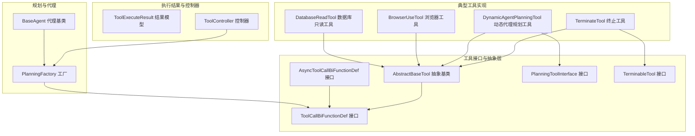
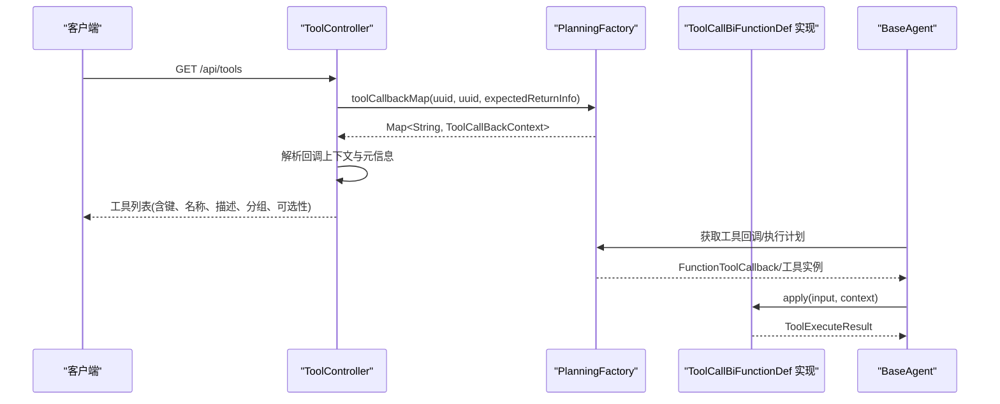
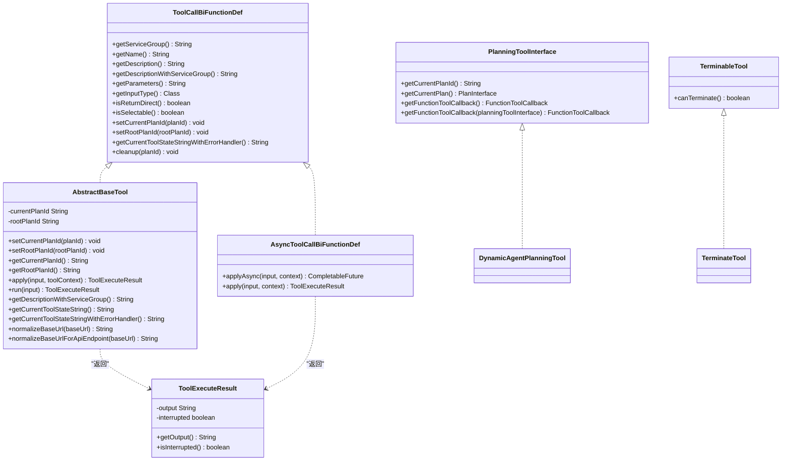
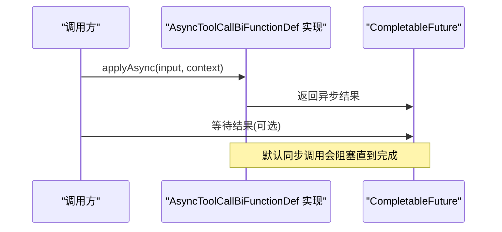
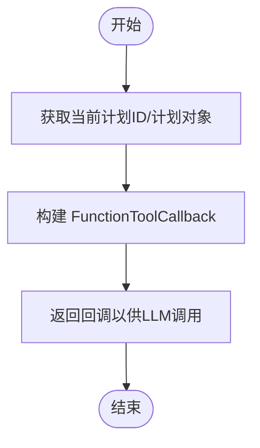
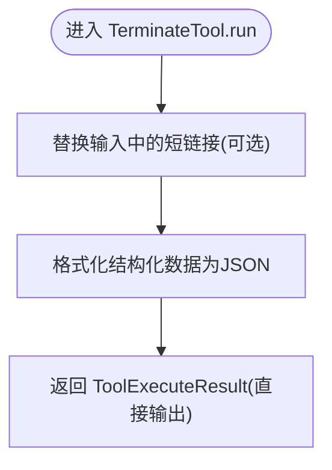
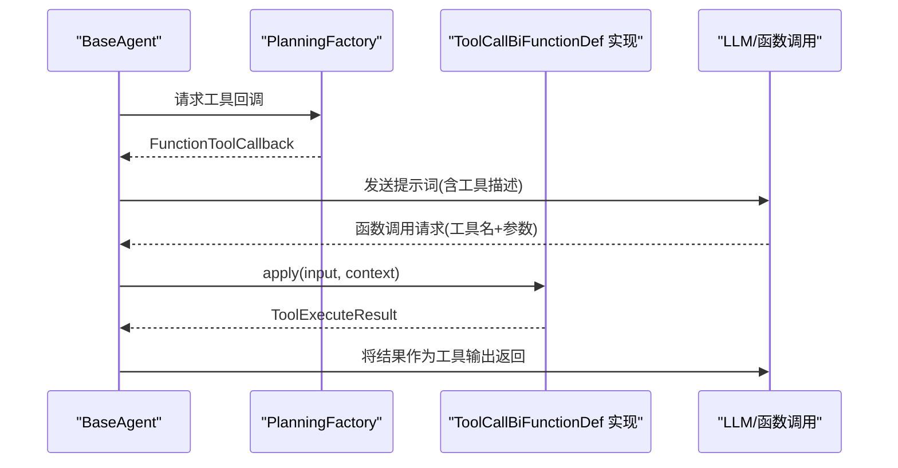
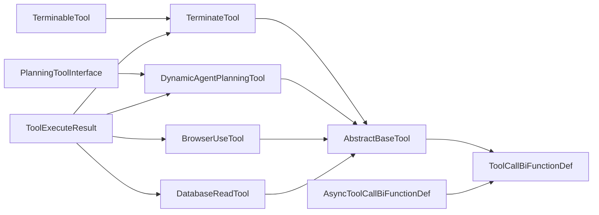

# 工具基础设计

<cite>
**本文引用的文件**
- [AbstractBaseTool.java](file://src/main/java/com/alibaba/cloud/ai/lynxe/tool/AbstractBaseTool.java)
- [ToolCallBiFunctionDef.java](file://src/main/java/com/alibaba/cloud/ai/lynxe/tool/ToolCallBiFunctionDef.java)
- [AsyncToolCallBiFunctionDef.java](file://src/main/java/com/alibaba/cloud/ai/lynxe/tool/AsyncToolCallBiFunctionDef.java)
- [PlanningToolInterface.java](file://src/main/java/com/alibaba/cloud/ai/lynxe/tool/PlanningToolInterface.java)
- [TerminableTool.java](file://src/main/java/com/alibaba/cloud/ai/lynxe/tool/TerminableTool.java)
- [ToolExecuteResult.java](file://src/main/java/com/alibaba/cloud/ai/lynxe/tool/code/ToolExecuteResult.java)
- [ToolController.java](file://src/main/java/com/alibaba/cloud/ai/lynxe/tool/controller/ToolController.java)
- [TerminateTool.java](file://src/main/java/com/alibaba/cloud/ai/lynxe/tool/TerminateTool.java)
- [DynamicAgentPlanningTool.java](file://src/main/java/com/alibaba/cloud/ai/lynxe/tool/DynamicAgentPlanningTool.java)
- [BrowserUseTool.java](file://src/main/java/com/alibaba/cloud/ai/lynxe/tool/browser/BrowserUseTool.java)
- [DatabaseReadTool.java](file://src/main/java/com/alibaba/cloud/ai/lynxe/tool/database/DatabaseReadTool.java)
- [PlanningFactory.java](file://src/main/java/com/alibaba/cloud/ai/lynxe/planning/PlanningFactory.java)
- [BaseAgent.java](file://src/main/java/com/alibaba/cloud/ai/lynxe/agent/BaseAgent.java)
</cite>

## 目录
1. [引言](#引言)
2. [项目结构](#项目结构)
3. [核心组件](#核心组件)
4. [架构总览](#架构总览)
5. [详细组件分析](#详细组件分析)
6. [依赖分析](#依赖分析)
7. [性能考虑](#性能考虑)
8. [故障排查指南](#故障排查指南)
9. [结论](#结论)
10. [附录](#附录)

## 引言
本文件面向Lynxe工具基础设计，系统化阐述抽象基类AbstractBaseTool的设计理念、核心接口规范（ToolCallBiFunctionDef、AsyncToolCallBiFunctionDef）、工具生命周期管理、异步调用机制、计划执行中的规划工具接口（PlanningToolInterface）以及可终止工具（TerminableTool）的终止机制。同时给出参数校验、返回值处理、错误传播策略、最佳实践、性能优化建议与扩展模式，并解释工具与代理系统的集成方式与调用协议。

## 项目结构
围绕“工具”主题，核心代码位于tool包及其子包中，配套控制器、工厂与代理层协同工作：
- 接口与抽象基类：ToolCallBiFunctionDef、AbstractBaseTool、AsyncToolCallBiFunctionDef、PlanningToolInterface、TerminableTool
- 执行结果模型：ToolExecuteResult
- 控制器：ToolController，用于对外暴露可用工具清单
- 典型工具实现：TerminateTool、DynamicAgentPlanningTool、BrowserUseTool、DatabaseReadTool
- 规划与工厂：PlanningFactory，负责工具注册与回调上下文构建
- 代理层：BaseAgent，承载工具调用、状态管理与执行流程

图表来源
- [ToolCallBiFunctionDef.java:29-106](file://src/main/java/com/alibaba/cloud/ai/lynxe/tool/ToolCallBiFunctionDef.java#L29-L106)
- [AbstractBaseTool.java:30-192](file://src/main/java/com/alibaba/cloud/ai/lynxe/tool/AbstractBaseTool.java#L30-L192)
- [AsyncToolCallBiFunctionDef.java:32-57](file://src/main/java/com/alibaba/cloud/ai/lynxe/tool/AsyncToolCallBiFunctionDef.java#L32-L57)
- [PlanningToolInterface.java:26-53](file://src/main/java/com/alibaba/cloud/ai/lynxe/tool/PlanningToolInterface.java#L26-L53)
- [TerminableTool.java:22-30](file://src/main/java/com/alibaba/cloud/ai/lynxe/tool/TerminableTool.java#L22-L30)
- [ToolExecuteResult.java:18-59](file://src/main/java/com/alibaba/cloud/ai/lynxe/tool/code/ToolExecuteResult.java#L18-L59)
- [ToolController.java:42-112](file://src/main/java/com/alibaba/cloud/ai/lynxe/tool/controller/ToolController.java#L42-L112)
- [TerminateTool.java:35-454](file://src/main/java/com/alibaba/cloud/ai/lynxe/tool/TerminateTool.java#L35-L454)
- [DynamicAgentPlanningTool.java:31-352](file://src/main/java/com/alibaba/cloud/ai/lynxe/tool/DynamicAgentPlanningTool.java#L31-L352)
- [BrowserUseTool.java:37-200](file://src/main/java/com/alibaba/cloud/ai/lynxe/tool/browser/BrowserUseTool.java#L37-L200)
- [DatabaseReadTool.java:35-165](file://src/main/java/com/alibaba/cloud/ai/lynxe/tool/database/DatabaseReadTool.java#L35-L165)
- [PlanningFactory.java:113-426](file://src/main/java/com/alibaba/cloud/ai/lynxe/planning/PlanningFactory.java#L113-L426)
- [BaseAgent.java:70-589](file://src/main/java/com/alibaba/cloud/ai/lynxe/agent/BaseAgent.java#L70-L589)

章节来源
- [ToolController.java:42-112](file://src/main/java/com/alibaba/cloud/ai/lynxe/tool/controller/ToolController.java#L42-L112)
- [PlanningFactory.java:113-200](file://src/main/java/com/alibaba/cloud/ai/lynxe/planning/PlanningFactory.java#L113-L200)

## 核心组件
本节聚焦抽象基类与核心接口，阐明设计理念与职责边界。

- 抽象基类AbstractBaseTool
  - 设计理念：统一工具执行上下文（当前计划ID、根计划ID），提供默认apply委托到run的适配，封装描述拼接、状态字符串安全获取与URL规范化等通用能力。
  - 生命周期：通过setCurrentPlanId/setRootPlanId注入执行上下文；cleanup由具体工具实现资源清理。
  - 安全增强：getCurrentToolStateStringWithErrorHandler对状态获取异常进行吞吐式降级，避免中断执行流。
  - URL处理：normalizeBaseUrl与normalizeBaseUrlForApiEndpoint避免重复路径段，提升外部API兼容性。

- 工具接口ToolCallBiFunctionDef
  - 角色：定义工具元信息（名称、分组、描述、参数Schema、输入类型、是否直接返回、是否可选择）、执行入口（apply）、上下文注入（planId/rootPlanId）、清理（cleanup）与状态获取（带异常保护）。
  - 参数Schema：getParameters返回JSON Schema，供LLM函数调用与前端展示。
  - 返回语义：isReturnDirect控制是否直接作为最终输出返回给调用方。

- 异步接口AsyncToolCallBiFunctionDef
  - 角色：在ToolCallBiFunctionDef基础上提供applyAsync，返回CompletableFuture，避免阻塞线程池，支持嵌套并行场景下的资源利用。
  - 向后兼容：默认同步实现通过join等待异步完成，保持既有调用方行为不变。

- 规划工具接口PlanningToolInterface
  - 角色：面向计划执行的工具接口，提供当前计划ID、当前执行计划对象、函数式工具回调（FunctionToolCallback）的获取方法，便于与LLM集成。

- 可终止工具接口TerminableTool
  - 角色：提供canTerminate判断工具是否可终止，用于执行中断或提前结束流程。

章节来源
- [AbstractBaseTool.java:30-192](file://src/main/java/com/alibaba/cloud/ai/lynxe/tool/AbstractBaseTool.java#L30-L192)
- [ToolCallBiFunctionDef.java:29-106](file://src/main/java/com/alibaba/cloud/ai/lynxe/tool/ToolCallBiFunctionDef.java#L29-L106)
- [AsyncToolCallBiFunctionDef.java:32-57](file://src/main/java/com/alibaba/cloud/ai/lynxe/tool/AsyncToolCallBiFunctionDef.java#L32-L57)
- [PlanningToolInterface.java:26-53](file://src/main/java/com/alibaba/cloud/ai/lynxe/tool/PlanningToolInterface.java#L26-L53)
- [TerminableTool.java:22-30](file://src/main/java/com/alibaba/cloud/ai/lynxe/tool/TerminableTool.java#L22-L30)

## 架构总览
下图展示工具基础设计在系统中的位置与交互关系：控制器从工厂获取工具回调上下文，代理层通过工厂与工具接口协作，规划工具与终止工具分别承担计划生成与执行终止的关键职责。

图表来源
- [ToolController.java:58-110](file://src/main/java/com/alibaba/cloud/ai/lynxe/tool/controller/ToolController.java#L58-L110)
- [PlanningFactory.java:113-200](file://src/main/java/com/alibaba/cloud/ai/lynxe/planning/PlanningFactory.java#L113-L200)
- [BaseAgent.java:70-200](file://src/main/java/com/alibaba/cloud/ai/lynxe/agent/BaseAgent.java#L70-L200)

## 详细组件分析

### 抽象基类与接口类图

图表来源
- [ToolCallBiFunctionDef.java:29-106](file://src/main/java/com/alibaba/cloud/ai/lynxe/tool/ToolCallBiFunctionDef.java#L29-L106)
- [AbstractBaseTool.java:30-192](file://src/main/java/com/alibaba/cloud/ai/lynxe/tool/AbstractBaseTool.java#L30-L192)
- [AsyncToolCallBiFunctionDef.java:32-57](file://src/main/java/com/alibaba/cloud/ai/lynxe/tool/AsyncToolCallDef.java#L32-L57)
- [PlanningToolInterface.java:26-53](file://src/main/java/com/alibaba/cloud/ai/lynxe/tool/PlanningToolInterface.java#L26-L53)
- [TerminableTool.java:22-30](file://src/main/java/com/alibaba/cloud/ai/lynxe/tool/TerminableTool.java#L22-L30)
- [ToolExecuteResult.java:18-59](file://src/main/java/com/alibaba/cloud/ai/lynxe/tool/code/ToolExecuteResult.java#L18-L59)
- [DynamicAgentPlanningTool.java:31-352](file://src/main/java/com/alibaba/cloud/ai/lynxe/tool/DynamicAgentPlanningTool.java#L31-L352)
- [TerminateTool.java:35-454](file://src/main/java/com/alibaba/cloud/ai/lynxe/tool/TerminateTool.java#L35-L454)

章节来源
- [AbstractBaseTool.java:30-192](file://src/main/java/com/alibaba/cloud/ai/lynxe/tool/AbstractBaseTool.java#L30-L192)
- [ToolCallBiFunctionDef.java:29-106](file://src/main/java/com/alibaba/cloud/ai/lynxe/tool/ToolCallBiFunctionDef.java#L29-L106)
- [AsyncToolCallBiFunctionDef.java:32-57](file://src/main/java/com/alibaba/cloud/ai/lynxe/tool/AsyncToolCallBiFunctionDef.java#L32-L57)
- [PlanningToolInterface.java:26-53](file://src/main/java/com/alibaba/cloud/ai/lynxe/tool/PlanningToolInterface.java#L26-L53)
- [TerminableTool.java:22-30](file://src/main/java/com/alibaba/cloud/ai/lynxe/tool/TerminableTool.java#L22-L30)
- [ToolExecuteResult.java:18-59](file://src/main/java/com/alibaba/cloud/ai/lynxe/tool/code/ToolExecuteResult.java#L18-L59)

### 异步调用机制（AsyncToolCallBiFunctionDef）
- 设计动机：避免同步阻塞导致线程池饥饿，支持嵌套并行执行场景下的资源高效利用。
- 默认实现：同步apply通过join等待异步任务完成，保证向后兼容。
- 使用建议：优先实现applyAsync，确保长耗时或IO密集型工具不阻塞主线程。

图表来源
- [AsyncToolCallBiFunctionDef.java:32-57](file://src/main/java/com/alibaba/cloud/ai/lynxe/tool/AsyncToolCallBiFunctionDef.java#L32-L57)

章节来源
- [AsyncToolCallBiFunctionDef.java:32-57](file://src/main/java/com/alibaba/cloud/ai/lynxe/tool/AsyncToolCallBiFunctionDef.java#L32-L57)

### 计划执行中的规划工具（PlanningToolInterface）
- 职责：提供当前计划ID与执行计划对象，构造FunctionToolCallback以对接LLM函数调用。
- 典型实现：DynamicAgentPlanningTool通过内部输入类与步骤定义，构建动态代理执行计划，并以returnDirect=true的方式直接返回结果。

图表来源
- [PlanningToolInterface.java:26-53](file://src/main/java/com/alibaba/cloud/ai/lynxe/tool/PlanningToolInterface.java#L26-L53)
- [DynamicAgentPlanningTool.java:31-352](file://src/main/java/com/alibaba/cloud/ai/lynxe/tool/DynamicAgentPlanningTool.java#L31-L352)

章节来源
- [PlanningToolInterface.java:26-53](file://src/main/java/com/alibaba/cloud/ai/lynxe/tool/PlanningToolInterface.java#L26-L53)
- [DynamicAgentPlanningTool.java:31-352](file://src/main/java/com/alibaba/cloud/ai/lynxe/tool/DynamicAgentPlanningTool.java#L31-L352)

### 终止机制（TerminableTool 与 TerminateTool）
- 终止接口：canTerminate用于判断工具是否可终止，常用于提前结束执行流程。
- 终止工具：TerminateTool实现TerminableTool，提供结构化终止消息生成与短链路替换逻辑，支持国际化参数与描述，isReturnDirect=true以便直接输出终止结果。

图表来源
- [TerminateTool.java:210-220](file://src/main/java/com/alibaba/cloud/ai/lynxe/tool/TerminateTool.java#L210-L220)
- [TerminableTool.java:22-30](file://src/main/java/com/alibaba/cloud/ai/lynxe/tool/TerminableTool.java#L22-L30)

章节来源
- [TerminateTool.java:35-454](file://src/main/java/com/alibaba/cloud/ai/lynxe/tool/TerminateTool.java#L35-L454)
- [TerminableTool.java:22-30](file://src/main/java/com/alibaba/cloud/ai/lynxe/tool/TerminableTool.java#L22-L30)

### 工具接口规范、参数验证、返回值处理与错误传播
- 接口规范
  - 元信息：服务分组、工具名、描述、参数Schema（JSON）、输入类型、是否直接返回、是否可选择。
  - 执行入口：apply(input, ToolContext) -> ToolExecuteResult；异步版本applyAsync返回CompletableFuture。
  - 生命周期：setCurrentPlanId/setRootPlanId注入上下文；cleanup(planId)清理资源。
  - 状态获取：getCurrentToolStateStringWithErrorHandler对异常进行吞吐式降级。
- 参数验证
  - 工具实现内部应校验必填参数与类型，不符合要求时返回ToolExecuteResult携带错误信息，避免抛出未捕获异常。
  - 示例：数据库只读工具对SQL类型进行限制，浏览器工具对驱动有效性与页面可用性进行前置检查。
- 返回值处理
  - ToolExecuteResult包含output与interrupted字段，支持标记执行被中断。
  - isReturnDirect=true时，结果直接作为最终输出返回给调用方。
- 错误传播
  - 工具内部异常通过返回错误消息的方式传播，避免影响代理层执行流程。
  - 状态获取异常通过getCurrentToolStateStringWithErrorHandler吞吐式处理。

章节来源
- [ToolCallBiFunctionDef.java:29-106](file://src/main/java/com/alibaba/cloud/ai/lynxe/tool/ToolCallBiFunctionDef.java#L29-L106)
- [AbstractBaseTool.java:85-144](file://src/main/java/com/alibaba/cloud/ai/lynxe/tool/AbstractBaseTool.java#L85-L144)
- [ToolExecuteResult.java:18-59](file://src/main/java/com/alibaba/cloud/ai/lynxe/tool/code/ToolExecuteResult.java#L18-L59)
- [DatabaseReadTool.java:87-120](file://src/main/java/com/alibaba/cloud/ai/lynxe/tool/database/DatabaseReadTool.java#L87-L120)
- [BrowserUseTool.java:113-148](file://src/main/java/com/alibaba/cloud/ai/lynxe/tool/browser/BrowserUseTool.java#L113-L148)

### 工具开发最佳实践
- 统一继承AbstractBaseTool，复用上下文注入与状态获取异常处理。
- 明确定义参数Schema（JSON），确保LLM函数调用与前端展示一致。
- 长耗时或IO密集型工具优先实现applyAsync，避免阻塞线程池。
- 在run中进行严格的参数校验与前置检查，失败时返回ToolExecuteResult而非抛异常。
- 对外暴露工具时，通过PlanningFactory构建回调上下文，由ToolController统一导出。

章节来源
- [AbstractBaseTool.java:30-192](file://src/main/java/com/alibaba/cloud/ai/lynxe/tool/AbstractBaseTool.java#L30-L192)
- [ToolCallBiFunctionDef.java:29-106](file://src/main/java/com/alibaba/cloud/ai/lynxe/tool/ToolCallBiFunctionDef.java#L29-L106)
- [PlanningFactory.java:113-200](file://src/main/java/com/alibaba/cloud/ai/lynxe/planning/PlanningFactory.java#L113-L200)
- [ToolController.java:58-110](file://src/main/java/com/alibaba/cloud/ai/lynxe/tool/controller/ToolController.java#L58-L110)

### 性能优化建议
- 异步化：优先采用AsyncToolCallBiFunctionDef，减少线程阻塞，提高并发吞吐。
- 资源池化：浏览器、数据库等外部资源通过工厂或服务池管理，避免重复初始化。
- 内容智能处理：对长文本或大结果采用智能截断与存储策略，降低传输与渲染开销。
- URL规范化：使用AbstractBaseTool提供的URL规范化方法，避免重复路径段导致的额外请求。

章节来源
- [AsyncToolCallBiFunctionDef.java:32-57](file://src/main/java/com/alibaba/cloud/ai/lynxe/tool/AsyncToolCallBiFunctionDef.java#L32-L57)
- [AbstractBaseTool.java:151-190](file://src/main/java/com/alibaba/cloud/ai/lynxe/tool/AbstractBaseTool.java#L151-L190)
- [BrowserUseTool.java:177-199](file://src/main/java/com/alibaba/cloud/ai/lynxe/tool/browser/BrowserUseTool.java#L177-L199)

### 扩展模式
- 新增工具：继承AbstractBaseTool，实现run与元信息方法，必要时实现TerminableTool或PlanningToolInterface。
- 异步工具：实现AsyncToolCallBiFunctionDef，提供applyAsync并按需实现apply默认回退。
- 规划工具：实现PlanningToolInterface，提供FunctionToolCallback以接入LLM函数调用。
- 终止工具：实现TerminableTool，提供canTerminate与结构化终止消息生成。

章节来源
- [AbstractBaseTool.java:30-192](file://src/main/java/com/alibaba/cloud/ai/lynxe/tool/AbstractBaseTool.java#L30-L192)
- [AsyncToolCallBiFunctionDef.java:32-57](file://src/main/java/com/alibaba/cloud/ai/lynxe/tool/AsyncToolCallBiFunctionDef.java#L32-L57)
- [PlanningToolInterface.java:26-53](file://src/main/java/com/alibaba/cloud/ai/lynxe/tool/PlanningToolInterface.java#L26-L53)
- [TerminableTool.java:22-30](file://src/main/java/com/alibaba/cloud/ai/lynxe/tool/TerminableTool.java#L22-L30)

### 与代理系统的集成与调用协议
- 工具注册与回调：PlanningFactory聚合各类工具，构建回调上下文，供代理层调用。
- 代理执行：BaseAgent在执行循环中通过工具回调执行工具，接收ToolExecuteResult并推进下一步。
- 协议要点：工具通过ToolCallBiFunctionDef/AsyncToolCallBiFunctionDef暴露统一接口；代理通过PlanningFactory获取FunctionToolCallback；工具通过isReturnDirect控制输出形态。

图表来源
- [PlanningFactory.java:113-200](file://src/main/java/com/alibaba/cloud/ai/lynxe/planning/PlanningFactory.java#L113-L200)
- [BaseAgent.java:70-200](file://src/main/java/com/alibaba/cloud/ai/lynxe/agent/BaseAgent.java#L70-L200)

章节来源
- [PlanningFactory.java:113-200](file://src/main/java/com/alibaba/cloud/ai/lynxe/planning/PlanningFactory.java#L113-L200)
- [BaseAgent.java:70-200](file://src/main/java/com/alibaba/cloud/ai/lynxe/agent/BaseAgent.java#L70-L200)

## 依赖分析
- 组件内聚：AbstractBaseTool高内聚地封装了工具通用能力，具体工具仅关注业务逻辑。
- 组件耦合：工具实现依赖于外部服务（如浏览器、数据库、短链路服务），通过构造注入解耦。
- 外部依赖：Spring AI工具回调、Jackson序列化、SLF4J日志等。

图表来源
- [AbstractBaseTool.java:30-192](file://src/main/java/com/alibaba/cloud/ai/lynxe/tool/AbstractBaseTool.java#L30-L192)
- [ToolCallBiFunctionDef.java:29-106](file://src/main/java/com/alibaba/cloud/ai/lynxe/tool/ToolCallBiFunctionDef.java#L29-L106)
- [AsyncToolCallBiFunctionDef.java:32-57](file://src/main/java/com/alibaba/cloud/ai/lynxe/tool/AsyncToolCallBiFunctionDef.java#L32-L57)
- [PlanningToolInterface.java:26-53](file://src/main/java/com/alibaba/cloud/ai/lynxe/tool/PlanningToolInterface.java#L26-L53)
- [TerminableTool.java:22-30](file://src/main/java/com/alibaba/cloud/ai/lynxe/tool/TerminableTool.java#L22-L30)
- [ToolExecuteResult.java:18-59](file://src/main/java/com/alibaba/cloud/ai/lynxe/tool/code/ToolExecuteResult.java#L18-L59)
- [TerminateTool.java:35-454](file://src/main/java/com/alibaba/cloud/ai/lynxe/tool/TerminateTool.java#L35-L454)
- [DynamicAgentPlanningTool.java:31-352](file://src/main/java/com/alibaba/cloud/ai/lynxe/tool/DynamicAgentPlanningTool.java#L31-L352)
- [BrowserUseTool.java:37-200](file://src/main/java/com/alibaba/cloud/ai/lynxe/tool/browser/BrowserUseTool.java#L37-L200)
- [DatabaseReadTool.java:35-165](file://src/main/java/com/alibaba/cloud/ai/lynxe/tool/database/DatabaseReadTool.java#L35-L165)

章节来源
- [PlanningFactory.java:113-200](file://src/main/java/com/alibaba/cloud/ai/lynxe/planning/PlanningFactory.java#L113-L200)

## 性能考虑
- 异步优先：长耗时操作（网络请求、文件IO、图像识别）应使用异步接口，避免阻塞线程池。
- 资源复用：浏览器驱动、数据库连接、文件句柄等通过工厂或服务池统一管理，减少频繁创建销毁。
- 结果优化：对大文本采用智能截断与内容存储，降低内存与网络压力。
- URL处理：使用URL规范化方法避免重复路径段，减少无效请求。

## 故障排查指南
- 工具不可用或状态异常
  - 检查工具实现的getCurrentToolStateStringWithErrorHandler是否正常返回状态或错误信息。
  - 确认工具是否正确注入currentPlanId/rootPlanId。
- 工具执行报错
  - 查看工具run内部是否返回ToolExecuteResult错误消息而非抛出异常。
  - 关注浏览器工具的驱动有效性与页面可用性检查。
- 终止工具无法终止
  - 确认canTerminate返回true且isReturnDirect设置为true。
  - 检查TerminateTool的输入参数与短链路替换逻辑。

章节来源
- [AbstractBaseTool.java:128-144](file://src/main/java/com/alibaba/cloud/ai/lynxe/tool/AbstractBaseTool.java#L128-L144)
- [BrowserUseTool.java:127-148](file://src/main/java/com/alibaba/cloud/ai/lynxe/tool/browser/BrowserUseTool.java#L127-L148)
- [TerminateTool.java:444-447](file://src/main/java/com/alibaba/cloud/ai/lynxe/tool/TerminateTool.java#L444-L447)

## 结论
Lynxe工具基础设计通过抽象基类与统一接口，提供了清晰的工具生命周期管理、参数与返回值规范、错误传播策略与异步执行能力。结合规划工具接口与终止机制，工具体系能够与代理系统高效集成，满足复杂计划执行与即时终止需求。遵循本文最佳实践与性能建议，可进一步提升工具的稳定性、可维护性与执行效率。

## 附录
- 工具控制器：ToolController通过PlanningFactory导出工具清单，包含键、名称、描述、分组与可选性等元信息。
- 工具实现参考：TerminateTool、DynamicAgentPlanningTool、BrowserUseTool、DatabaseReadTool等均体现了上述设计原则与实践模式。

章节来源
- [ToolController.java:58-110](file://src/main/java/com/alibaba/cloud/ai/lynxe/tool/controller/ToolController.java#L58-L110)
- [TerminateTool.java:35-454](file://src/main/java/com/alibaba/cloud/ai/lynxe/tool/TerminateTool.java#L35-L454)
- [DynamicAgentPlanningTool.java:31-352](file://src/main/java/com/alibaba/cloud/ai/lynxe/tool/DynamicAgentPlanningTool.java#L31-L352)
- [BrowserUseTool.java:37-200](file://src/main/java/com/alibaba/cloud/ai/lynxe/tool/browser/BrowserUseTool.java#L37-L200)
- [DatabaseReadTool.java:35-165](file://src/main/java/com/alibaba/cloud/ai/lynxe/tool/database/DatabaseReadTool.java#L35-L165)