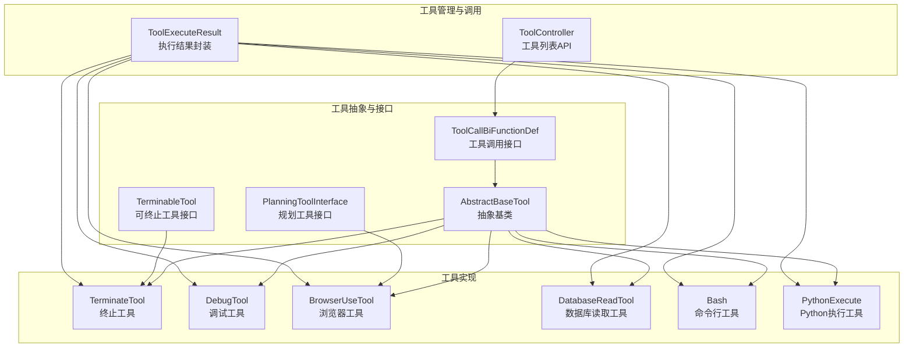
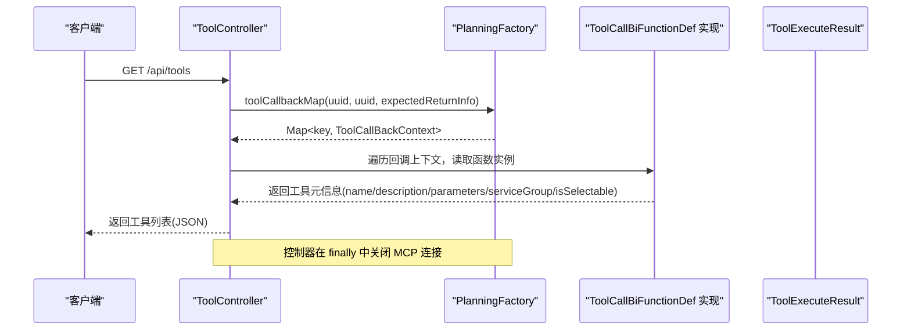
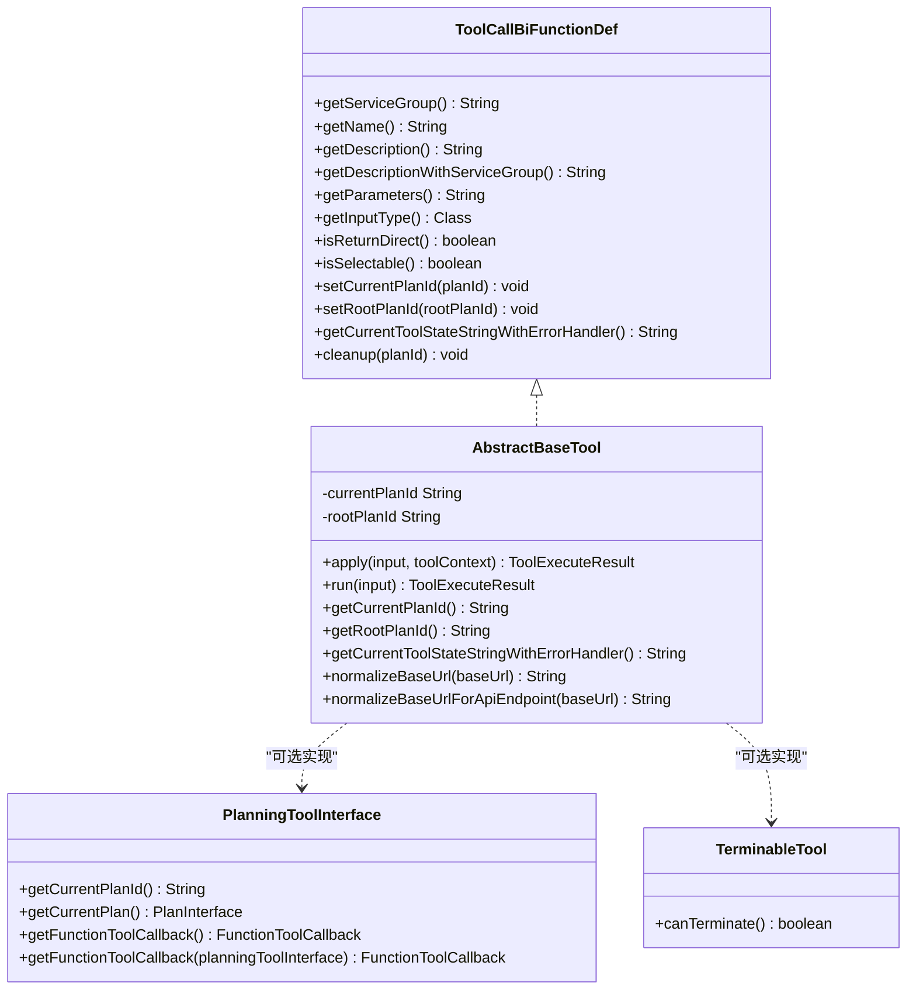
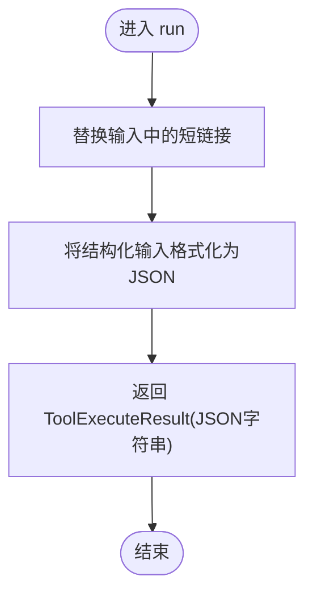
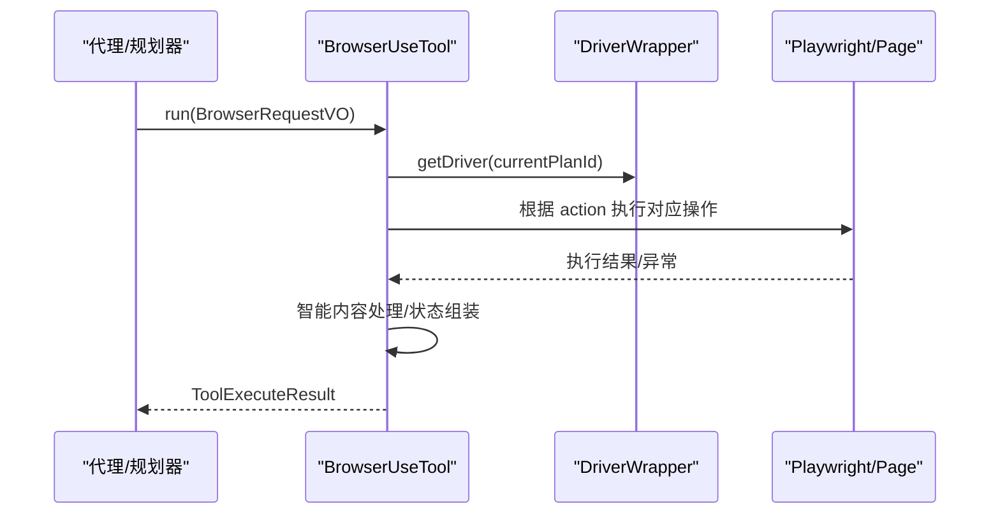
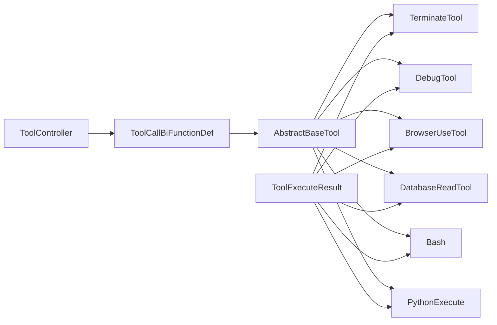

# 工具系统

<cite>
**本文引用的文件**
- [AbstractBaseTool.java](file://src/main/java/com/alibaba/cloud/ai/lynxe/tool/AbstractBaseTool.java)
- [ToolCallBiFunctionDef.java](file://src/main/java/com/alibaba/cloud/ai/lynxe/tool/ToolCallBiFunctionDef.java)
- [PlanningToolInterface.java](file://src/main/java/com/alibaba/cloud/ai/lynxe/tool/PlanningToolInterface.java)
- [TerminableTool.java](file://src/main/java/com/alibaba/cloud/ai/lynxe/tool/TerminableTool.java)
- [TerminateTool.java](file://src/main/java/com/alibaba/cloud/ai/lynxe/tool/TerminateTool.java)
- [DebugTool.java](file://src/main/java/com/alibaba/cloud/ai/lynxe/tool/DebugTool.java)
- [ToolController.java](file://src/main/java/com/alibaba/cloud/ai/lynxe/tool/controller/ToolController.java)
- [ToolExecuteResult.java](file://src/main/java/com/alibaba/cloud/ai/lynxe/tool/code/ToolExecuteResult.java)
- [BrowserUseTool.java](file://src/main/java/com/alibaba/cloud/ai/lynxe/tool/browser/BrowserUseTool.java)
- [DatabaseReadTool.java](file://src/main/java/com/alibaba/cloud/ai/lynxe/tool/database/DatabaseReadTool.java)
- [Bash.java](file://src/main/java/com/alibaba/cloud/ai/lynxe/tool/bash/Bash.java)
- [PythonExecute.java](file://src/main/java/com/alibaba/cloud/ai/lynxe/tool/code/PythonExecute.java)
</cite>

## 目录
1. [简介](#简介)
2. [项目结构](#项目结构)
3. [核心组件](#核心组件)
4. [架构总览](#架构总览)
5. [详细组件分析](#详细组件分析)
6. [依赖关系分析](#依赖关系分析)
7. [性能考量](#性能考量)
8. [故障排查指南](#故障排查指南)
9. [结论](#结论)
10. [附录](#附录)

## 简介
本文件系统性梳理 Lynxe 工具系统的设计理念、接口规范、参数与返回值约定、执行流程、错误处理与异常管理，并给出工具开发指南、最佳实践与扩展模式。同时对工具分类（浏览器工具、文件/目录工具、数据库工具、代码执行工具等）进行说明，解释工具与代理系统的集成方式与调用机制，并覆盖工具配置、权限控制与安全考虑。

## 项目结构
工具系统位于后端模块的 tool 包下，采用“抽象基类 + 接口契约 + 具体工具实现”的分层设计。控制器通过工厂或服务装配工具集合，向代理/规划器暴露统一的工具清单与回调上下文；具体工具实现遵循统一的输入/输出与状态接口，确保可插拔与可扩展。

图表来源
- [ToolCallBiFunctionDef.java:29-106](file://src/main/java/com/alibaba/cloud/ai/lynxe/tool/ToolCallBiFunctionDef.java#L29-L106)
- [AbstractBaseTool.java:30-192](file://src/main/java/com/alibaba/cloud/ai/lynxe/tool/AbstractBaseTool.java#L30-L192)
- [PlanningToolInterface.java:26-53](file://src/main/java/com/alibaba/cloud/ai/lynxe/tool/PlanningToolInterface.java#L26-L53)
- [TerminableTool.java:22-30](file://src/main/java/com/alibaba/cloud/ai/lynxe/tool/TerminableTool.java#L22-L30)
- [TerminateTool.java:35-454](file://src/main/java/com/alibaba/cloud/ai/lynxe/tool/TerminateTool.java#L35-L454)
- [DebugTool.java:30-118](file://src/main/java/com/alibaba/cloud/ai/lynxe/tool/DebugTool.java#L30-L118)
- [BrowserUseTool.java:37-674](file://src/main/java/com/alibaba/cloud/ai/lynxe/tool/browser/BrowserUseTool.java#L37-L674)
- [DatabaseReadTool.java:35-165](file://src/main/java/com/alibaba/cloud/ai/lynxe/tool/database/DatabaseReadTool.java#L35-L165)
- [Bash.java:36-352](file://src/main/java/com/alibaba/cloud/ai/lynxe/tool/bash/Bash.java#L36-L352)
- [PythonExecute.java:27-245](file://src/main/java/com/alibaba/cloud/ai/lynxe/tool/code/PythonExecute.java#L27-L245)
- [ToolController.java:41-112](file://src/main/java/com/alibaba/cloud/ai/lynxe/tool/controller/ToolController.java#L41-L112)
- [ToolExecuteResult.java:18-59](file://src/main/java/com/alibaba/cloud/ai/lynxe/tool/code/ToolExecuteResult.java#L18-L59)

章节来源
- [ToolController.java:41-112](file://src/main/java/com/alibaba/cloud/ai/lynxe/tool/controller/ToolController.java#L41-L112)

## 核心组件
- 工具调用接口：定义工具名称、描述、参数模式、输入类型、是否直接返回、是否可选择、计划上下文注入、清理方法等统一契约。
- 抽象基类：提供通用能力（计划ID/根计划ID、统一 apply 调用、状态字符串容错获取、URL 规范化工具方法等），子类聚焦业务执行。
- 规划工具接口：面向规划器/代理的回调封装，便于在不同规划阶段注入工具能力。
- 可终止工具接口：为工具提供可中断能力检查，配合终止工具形成闭环。
- 执行结果封装：统一输出内容与中断标记，便于上层消费与后续处理。

章节来源
- [ToolCallBiFunctionDef.java:29-106](file://src/main/java/com/alibaba/cloud/ai/lynxe/tool/ToolCallBiFunctionDef.java#L29-L106)
- [AbstractBaseTool.java:30-192](file://src/main/java/com/alibaba/cloud/ai/lynxe/tool/AbstractBaseTool.java#L30-L192)
- [PlanningToolInterface.java:26-53](file://src/main/java/com/alibaba/cloud/ai/lynxe/tool/PlanningToolInterface.java#L26-L53)
- [TerminableTool.java:22-30](file://src/main/java/com/alibaba/cloud/ai/lynxe/tool/TerminableTool.java#L22-L30)
- [ToolExecuteResult.java:18-59](file://src/main/java/com/alibaba/cloud/ai/lynxe/tool/code/ToolExecuteResult.java#L18-L59)

## 架构总览
工具系统通过控制器聚合工具清单，结合规划工厂生成工具回调上下文，供代理/规划器按需调用。工具内部通过统一的输入类型与返回封装，确保与 LLM/代理层的交互一致性。

图表来源
- [ToolController.java:58-110](file://src/main/java/com/alibaba/cloud/ai/lynxe/tool/controller/ToolController.java#L58-L110)

章节来源
- [ToolController.java:41-112](file://src/main/java/com/alibaba/cloud/ai/lynxe/tool/controller/ToolController.java#L41-L112)

## 详细组件分析

### 工具抽象与接口
- ToolCallBiFunctionDef：定义工具的统一契约，包括服务组、名称、描述、参数模式、输入类型、是否直接返回、是否可选择、计划上下文设置、状态字符串容错获取、清理方法等。
- AbstractBaseTool：继承工具调用接口，提供统一的 apply 适配、计划ID/根计划ID注入、状态字符串容错获取、URL 规范化工具方法等；子类仅需实现 run 方法即可完成业务逻辑。
- PlanningToolInterface：面向规划器的回调封装，提供当前计划ID/计划对象、函数工具回调获取等能力。
- TerminableTool：为工具提供 canTerminate 能力，便于在特定状态下主动终止。

图表来源
- [ToolCallBiFunctionDef.java:29-106](file://src/main/java/com/alibaba/cloud/ai/lynxe/tool/ToolCallBiFunctionDef.java#L29-L106)
- [AbstractBaseTool.java:30-192](file://src/main/java/com/alibaba/cloud/ai/lynxe/tool/AbstractBaseTool.java#L30-L192)
- [PlanningToolInterface.java:26-53](file://src/main/java/com/alibaba/cloud/ai/lynxe/tool/PlanningToolInterface.java#L26-L53)
- [TerminableTool.java:22-30](file://src/main/java/com/alibaba/cloud/ai/lynxe/tool/TerminableTool.java#L22-L30)

章节来源
- [ToolCallBiFunctionDef.java:29-106](file://src/main/java/com/alibaba/cloud/ai/lynxe/tool/ToolCallBiFunctionDef.java#L29-L106)
- [AbstractBaseTool.java:30-192](file://src/main/java/com/alibaba/cloud/ai/lynxe/tool/AbstractBaseTool.java#L30-L192)
- [PlanningToolInterface.java:26-53](file://src/main/java/com/alibaba/cloud/ai/lynxe/tool/PlanningToolInterface.java#L26-L53)
- [TerminableTool.java:22-30](file://src/main/java/com/alibaba/cloud/ai/lynxe/tool/TerminableTool.java#L22-L30)

### 终止工具（TerminateTool）
- 设计目标：在执行步骤结束时，以结构化数据形式输出总结信息，支持动态参数模式生成与短链接替换。
- 关键点：
  - 动态参数模式：根据期望返回列生成 JSON Schema 参数定义。
  - 短链接替换：在输入中识别并替换短链接为真实地址，受全局开关控制。
  - 结果格式：将输入结构转换为 JSON 字符串，作为最终输出。
  - 直接返回：isReturnDirect 返回 true，表示结果可直接用于后续处理。
  - 可终止：实现 TerminableTool，canTerminate 始终返回 true。

图表来源
- [TerminateTool.java:211-220](file://src/main/java/com/alibaba/cloud/ai/lynxe/tool/TerminateTool.java#L211-L220)

章节来源
- [TerminateTool.java:35-454](file://src/main/java/com/alibaba/cloud/ai/lynxe/tool/TerminateTool.java#L35-L454)

### 调试工具（DebugTool）
- 设计目标：接收消息并直接返回，便于调试与日志输出。
- 关键点：
  - 输入提取：从 Map 中读取 message 字段，若非字符串则转为字符串。
  - 直接返回：isReturnDirect 返回 true。
  - 状态展示：提供当前工具状态字符串，包含工具名与计划ID。

章节来源
- [DebugTool.java:30-118](file://src/main/java/com/alibaba/cloud/ai/lynxe/tool/DebugTool.java#L30-L118)

### 浏览器工具（BrowserUseTool）
- 设计目标：通过 Playwright 提供浏览器自动化能力，支持导航、点击、输入、截图、滚动、标签页管理、下载、JS 执行、页面内容导出等。
- 关键点：
  - 驱动管理：通过 ChromeDriverService 获取/校验驱动与当前页面有效性。
  - 行为分发：根据 action 分派到具体动作执行器，统一处理超时与 Playwright 异常。
  - 智能内容处理：对长文本（如 get_text、execute_js）使用智能存储服务进行截断/压缩。
  - 状态获取：提供 getCurrentState 获取当前 URL、标题、标签页、可交互元素快照等。
  - 清理资源：cleanup 释放对应计划的浏览器资源。
  - 可选择：isSelectable 返回 true。

图表来源
- [BrowserUseTool.java:113-295](file://src/main/java/com/alibaba/cloud/ai/lynxe/tool/browser/BrowserUseTool.java#L113-L295)

章节来源
- [BrowserUseTool.java:37-674](file://src/main/java/com/alibaba/cloud/ai/lynxe/tool/browser/BrowserUseTool.java#L37-L674)

### 数据库工具（DatabaseReadTool）
- 设计目标：提供只读数据库查询能力，支持 SQL 执行、表名获取、SQL 导出为 JSON 文件等。
- 关键点：
  - 动作分发：根据 action 调用相应动作执行器（如 ExecuteSqlAction、GetTableNameAction、ExecuteSqlToJsonFileAction）。
  - 安全限制：只允许 SELECT 查询，拒绝非只读语句。
  - 状态展示：列出已配置的数据源信息。
  - 可选择：isSelectable 返回 true。

章节来源
- [DatabaseReadTool.java:35-165](file://src/main/java/com/alibaba/cloud/ai/lynxe/tool/database/DatabaseReadTool.java#L35-L165)

### 命令行工具（Bash）
- 设计目标：跨平台执行命令，限制在根计划目录内，防止路径逃逸。
- 关键点：
  - 路径验证：严格校验绝对路径、cd 目标与包含 .. 的路径，确保所有访问均在 root-plan-folder 内。
  - 工作目录：优先使用 rootPlanDirectory 作为工作目录，否则回退到默认工作目录。
  - 智能内容处理：对大输出进行智能截断/保存。
  - 状态展示：显示工作目录、最近命令与结果。
  - 可选择：isSelectable 返回 true。

章节来源
- [Bash.java:36-352](file://src/main/java/com/alibaba/cloud/ai/lynxe/tool/bash/Bash.java#L36-L352)

### Python 执行工具（PythonExecute）
- 设计目标：执行 Python 代码字符串，捕获标准输出与错误信息。
- 关键点：
  - 输入解析：支持字符串或对象输入，提取 code 字段。
  - 执行与日志：生成唯一日志ID，执行后提取日志与错误信息。
  - 错误识别：基于常见 Python 错误关键字判断执行是否失败。
  - 可选择：isSelectable 返回 true。

章节来源
- [PythonExecute.java:27-245](file://src/main/java/com/alibaba/cloud/ai/lynxe/tool/code/PythonExecute.java#L27-L245)

## 依赖关系分析
- 工具接口与抽象基类解耦了工具行为与通用能力，子类仅关注 run 逻辑。
- 控制器通过规划工厂获取工具回调上下文，避免直接依赖具体工具实现，提升可扩展性。
- 工具内部广泛使用智能内容处理服务与统一目录管理，保障大输出与路径安全。
- 终止工具与可终止接口形成“可中断”闭环，便于在复杂流程中优雅退出。

图表来源
- [ToolCallBiFunctionDef.java:29-106](file://src/main/java/com/alibaba/cloud/ai/lynxe/tool/ToolCallBiFunctionDef.java#L29-L106)
- [AbstractBaseTool.java:30-192](file://src/main/java/com/alibaba/cloud/ai/lynxe/tool/AbstractBaseTool.java#L30-L192)
- [ToolController.java:41-112](file://src/main/java/com/alibaba/cloud/ai/lynxe/tool/controller/ToolController.java#L41-L112)
- [ToolExecuteResult.java:18-59](file://src/main/java/com/alibaba/cloud/ai/lynxe/tool/code/ToolExecuteResult.java#L18-L59)
- [TerminateTool.java:35-454](file://src/main/java/com/alibaba/cloud/ai/lynxe/tool/TerminateTool.java#L35-L454)
- [DebugTool.java:30-118](file://src/main/java/com/alibaba/cloud/ai/lynxe/tool/DebugTool.java#L30-L118)
- [BrowserUseTool.java:37-674](file://src/main/java/com/alibaba/cloud/ai/lynxe/tool/browser/BrowserUseTool.java#L37-L674)
- [DatabaseReadTool.java:35-165](file://src/main/java/com/alibaba/cloud/ai/lynxe/tool/database/DatabaseReadTool.java#L35-L165)
- [Bash.java:36-352](file://src/main/java/com/alibaba/cloud/ai/lynxe/tool/bash/Bash.java#L36-L352)
- [PythonExecute.java:27-245](file://src/main/java/com/alibaba/cloud/ai/lynxe/tool/code/PythonExecute.java#L27-L245)

## 性能考量
- 大输出处理：浏览器工具与 Bash 工具在长输出场景下使用智能内容处理服务进行截断/压缩，降低内存与传输压力。
- 超时与重试：浏览器工具对部分操作提供有限重试策略，兼顾稳定性与响应时间。
- 资源清理：工具在 cleanup 中释放浏览器驱动、临时文件等资源，避免资源泄漏。
- 参数模式生成：终止工具按期望列动态生成参数模式，减少前端/LLM 的理解负担。

## 故障排查指南
- 工具状态获取异常：抽象基类提供状态字符串容错获取方法，出现异常时返回可读错误信息而非中断流程。
- 浏览器工具异常：
  - 超时：捕获 Playwright 超时错误并返回明确提示。
  - 驱动不可用：校验驱动与页面有效性，返回可用性提示。
  - 未知动作：返回“未知动作”提示，便于定位调用问题。
- 命令行工具路径逃逸：
  - 严格校验绝对路径与 cd 目标，拒绝越权访问并给出明确错误信息。
- Python 执行错误：
  - 基于常见错误关键字识别执行失败，记录错误详情与日志ID，便于定位问题。

章节来源
- [AbstractBaseTool.java:128-144](file://src/main/java/com/alibaba/cloud/ai/lynxe/tool/AbstractBaseTool.java#L128-L144)
- [BrowserUseTool.java:144-294](file://src/main/java/com/alibaba/cloud/ai/lynxe/tool/browser/BrowserUseTool.java#L144-L294)
- [Bash.java:172-258](file://src/main/java/com/alibaba/cloud/ai/lynxe/tool/bash/Bash.java#L172-L258)
- [PythonExecute.java:134-144](file://src/main/java/com/alibaba/cloud/ai/lynxe/tool/code/PythonExecute.java#L134-L144)

## 结论
Lynxe 工具系统通过清晰的抽象与接口契约，实现了工具的高内聚、低耦合与强扩展性。统一的执行结果封装与状态容错机制，保证了在复杂执行流程中的稳定性与可观测性。通过控制器与规划工厂的协作，工具能够被代理/规划器以一致的方式发现、调用与管理。建议在新增工具时遵循现有接口与抽象基类，确保参数模式、状态展示与资源清理的一致性。

## 附录

### 工具接口规范与参数定义
- 工具名称与描述：由工具实现提供本地化描述与参数模式。
- 参数模式：推荐使用 JSON Schema 描述必填字段与类型，终止工具支持动态生成。
- 输入类型：通过 getInputType 暴露具体输入类，便于序列化/反序列化。
- 是否直接返回：isReturnDirect 控制结果是否直接参与后续处理。
- 是否可选择：isSelectable 控制前端是否可选中该工具。

章节来源
- [ToolCallBiFunctionDef.java:29-106](file://src/main/java/com/alibaba/cloud/ai/lynxe/tool/ToolCallBiFunctionDef.java#L29-L106)
- [TerminateTool.java:401-415](file://src/main/java/com/alibaba/cloud/ai/lynxe/tool/TerminateTool.java#L401-L415)

### 工具执行流程与返回值约定
- 执行入口：统一通过 apply 或 run 执行；抽象基类提供 apply 到 run 的适配。
- 返回值：ToolExecuteResult 封装输出内容与中断标记；终止工具通常直接返回。
- 状态字符串：提供 getCurrentToolStateString 与容错版本，便于监控与诊断。

章节来源
- [AbstractBaseTool.java:85-96](file://src/main/java/com/alibaba/cloud/ai/lynxe/tool/AbstractBaseTool.java#L85-L96)
- [ToolExecuteResult.java:18-59](file://src/main/java/com/alibaba/cloud/ai/lynxe/tool/code/ToolExecuteResult.java#L18-L59)

### 工具分类说明
- 浏览器工具：BrowserUseTool，支持导航、交互、截图、下载、JS 执行等。
- 文件/目录工具：Bash、BrowserUseTool（下载）、DatabaseReadTool（导出为 JSON 文件）。
- 数据库工具：DatabaseReadTool（只读查询、表名获取、导出）。
- 代码执行工具：PythonExecute（Python 代码执行）。
- 终止工具：TerminateTool（结构化终止输出）。
- 调试工具：DebugTool（直接返回消息）。

章节来源
- [BrowserUseTool.java:37-674](file://src/main/java/com/alibaba/cloud/ai/lynxe/tool/browser/BrowserUseTool.java#L37-L674)
- [Bash.java:36-352](file://src/main/java/com/alibaba/cloud/ai/lynxe/tool/bash/Bash.java#L36-L352)
- [DatabaseReadTool.java:35-165](file://src/main/java/com/alibaba/cloud/ai/lynxe/tool/database/DatabaseReadTool.java#L35-L165)
- [PythonExecute.java:27-245](file://src/main/java/com/alibaba/cloud/ai/lynxe/tool/code/PythonExecute.java#L27-L245)
- [TerminateTool.java:35-454](file://src/main/java/com/alibaba/cloud/ai/lynxe/tool/TerminateTool.java#L35-L454)
- [DebugTool.java:30-118](file://src/main/java/com/alibaba/cloud/ai/lynxe/tool/DebugTool.java#L30-L118)

### 工具与代理系统的集成与调用机制
- 工具清单：ToolController 通过规划工厂生成工具回调上下文，组装工具元信息返回给前端/代理。
- 回调注入：规划工具接口提供函数工具回调，便于在不同规划阶段注入工具能力。
- 上下文传递：工具通过 setCurrentPlanId/setRootPlanId 注入计划上下文，支持资源隔离与清理。

章节来源
- [ToolController.java:58-110](file://src/main/java/com/alibaba/cloud/ai/lynxe/tool/controller/ToolController.java#L58-L110)
- [PlanningToolInterface.java:26-53](file://src/main/java/com/alibaba/cloud/ai/lynxe/tool/PlanningToolInterface.java#L26-L53)
- [AbstractBaseTool.java:55-63](file://src/main/java/com/alibaba/cloud/ai/lynxe/tool/AbstractBaseTool.java#L55-L63)

### 工具配置、权限控制与安全考虑
- 路径安全：Bash 工具严格校验命令中的绝对路径、cd 目标与包含 .. 的路径，确保所有访问在 root-plan-folder 内。
- 短链接替换：终止工具与浏览器工具支持短链接替换，受全局开关控制，避免泄露内部地址。
- 只读限制：数据库工具仅允许 SELECT 查询，拒绝写操作。
- 超时与重试：浏览器工具对部分操作提供有限重试，避免长时间阻塞。
- 资源清理：工具在 cleanup 中释放浏览器驱动、临时文件等资源，避免资源泄漏。

章节来源
- [Bash.java:172-258](file://src/main/java/com/alibaba/cloud/ai/lynxe/tool/bash/Bash.java#L172-L258)
- [TerminateTool.java:227-262](file://src/main/java/com/alibaba/cloud/ai/lynxe/tool/TerminateTool.java#L227-L262)
- [BrowserUseTool.java:234-251](file://src/main/java/com/alibaba/cloud/ai/lynxe/tool/browser/BrowserUseTool.java#L234-L251)
- [DatabaseReadTool.java:94-114](file://src/main/java/com/alibaba/cloud/ai/lynxe/tool/database/DatabaseReadTool.java#L94-L114)