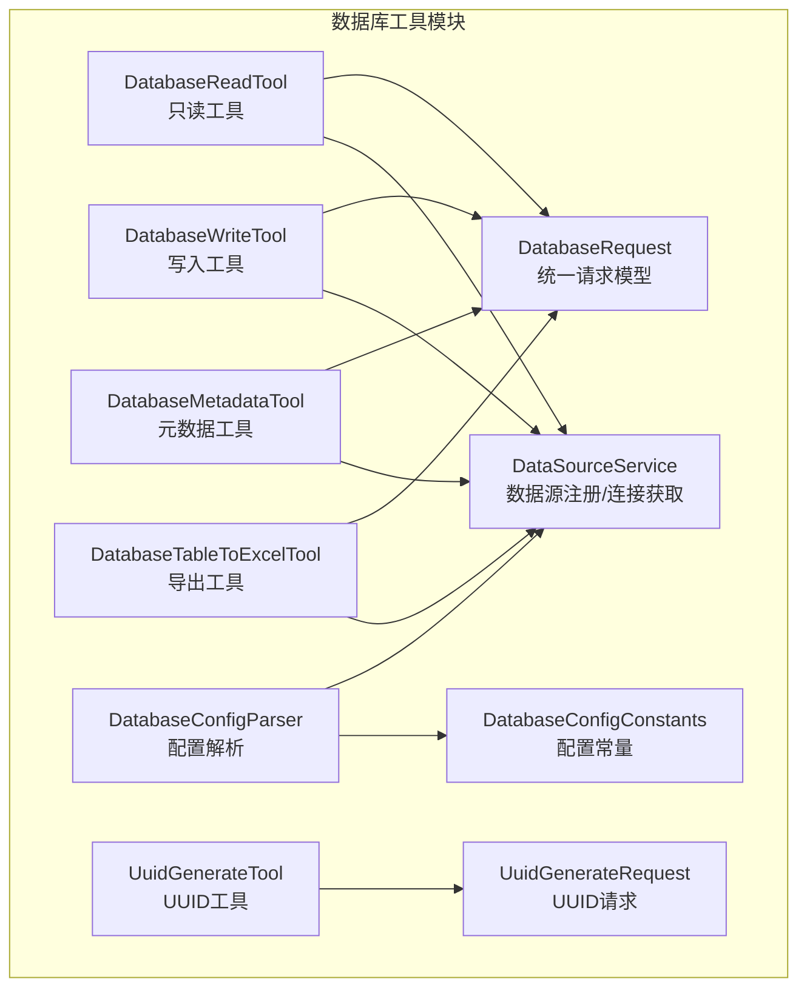
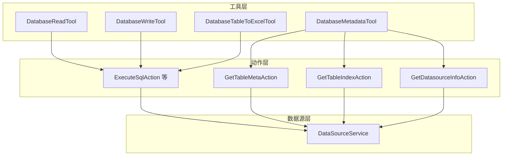
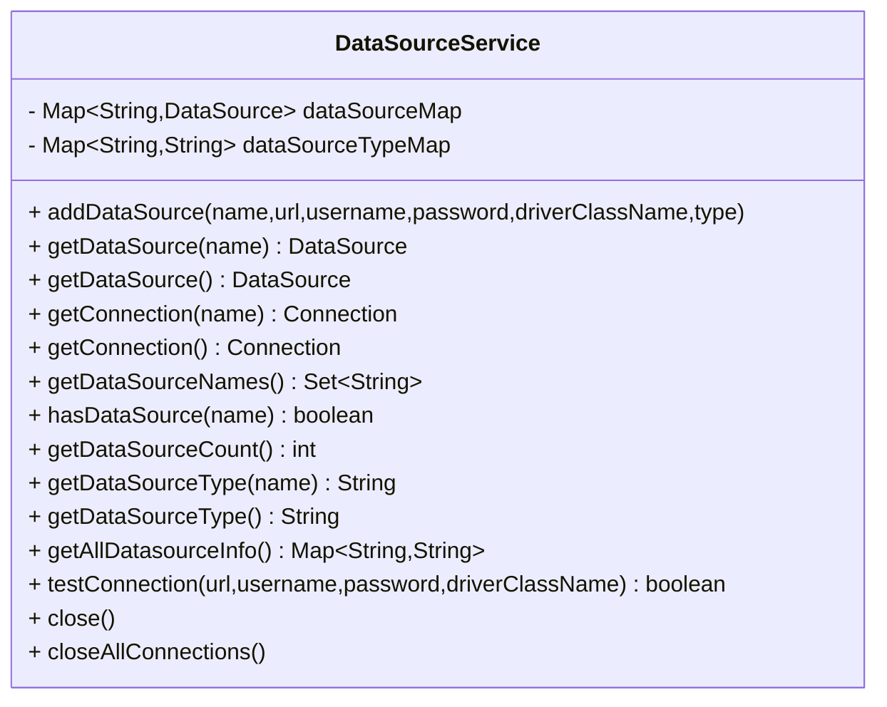
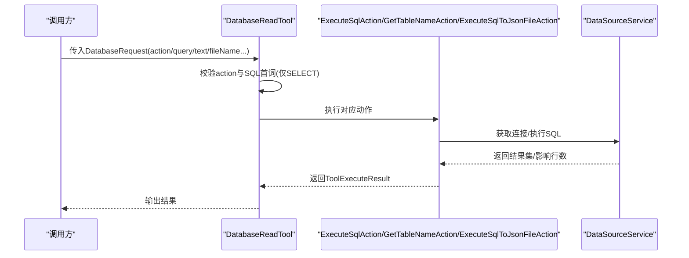
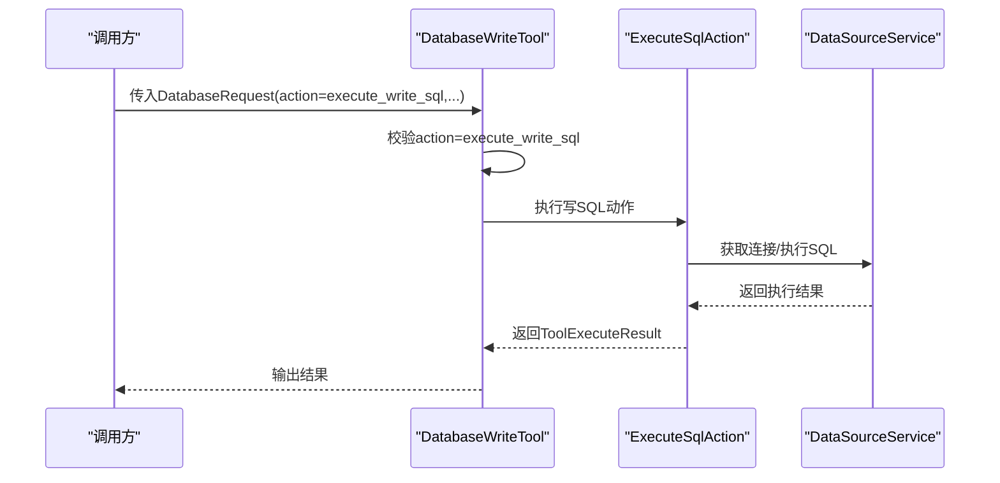
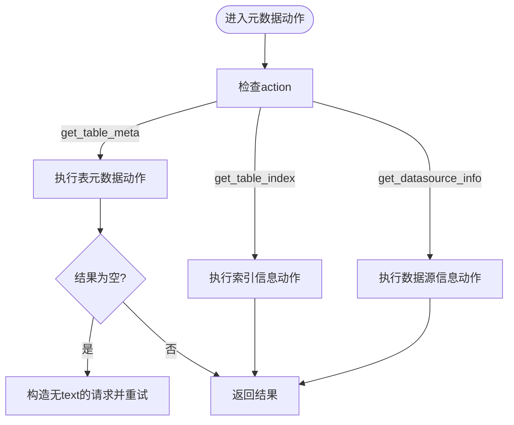
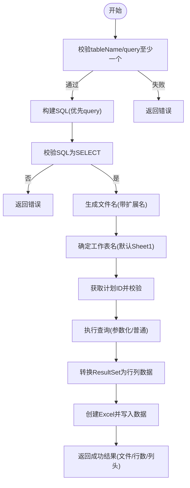
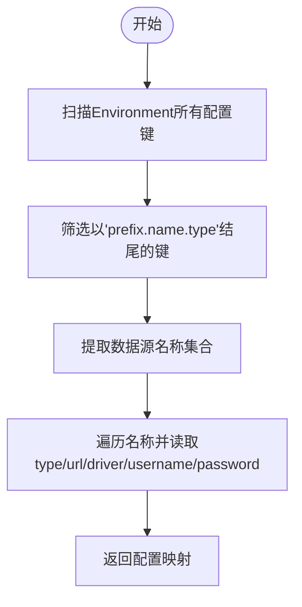
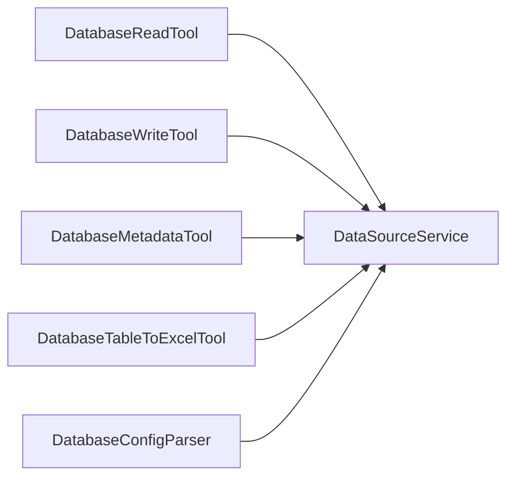

# 数据库工具

<cite>
**本文引用的文件**
- [DataSourceService.java](file://src/main/java/com/alibaba/cloud/ai/lynxe/tool/database/DataSourceService.java)
- [DatabaseReadTool.java](file://src/main/java/com/alibaba/cloud/ai/lynxe/tool/database/DatabaseReadTool.java)
- [DatabaseWriteTool.java](file://src/main/java/com/alibaba/cloud/ai/lynxe/tool/database/DatabaseWriteTool.java)
- [DatabaseMetadataTool.java](file://src/main/java/com/alibaba/cloud/ai/lynxe/tool/database/DatabaseMetadataTool.java)
- [DatabaseTableToExcelTool.java](file://src/main/java/com/alibaba/cloud/ai/lynxe/tool/database/DatabaseTableToExcelTool.java)
- [DatabaseRequest.java](file://src/main/java/com/alibaba/cloud/ai/lynxe/tool/database/DatabaseRequest.java)
- [DatabaseConfigConstants.java](file://src/main/java/com/alibaba/cloud/ai/lynxe/tool/database/DatabaseConfigConstants.java)
- [DatabaseConfigParser.java](file://src/main/java/com/alibaba/cloud/ai/lynxe/tool/database/DatabaseConfigParser.java)
- [UuidGenerateTool.java](file://src/main/java/com/alibaba/cloud/ai/lynxe/tool/database/UuidGenerateTool.java)
- [UuidGenerateRequest.java](file://src/main/java/com/alibaba/cloud/ai/lynxe/tool/database/UuidGenerateRequest.java)
</cite>

## 目录
1. [简介](#简介)
2. [项目结构](#项目结构)
3. [核心组件](#核心组件)
4. [架构总览](#架构总览)
5. [详细组件分析](#详细组件分析)
6. [依赖分析](#依赖分析)
7. [性能考虑](#性能考虑)
8. [故障排查指南](#故障排查指南)
9. [结论](#结论)
10. [附录](#附录)

## 简介
本文件面向Lynxe数据库工具模块，系统性梳理以下能力与实现要点：
- DataSourceService：数据源管理与连接获取（基于Spring JDBC的DriverManagerDataSource）。
- DatabaseReadTool、DatabaseWriteTool：读写分离与事务边界控制（只读工具限制非SELECT，写工具通过统一动作执行器执行）。
- DatabaseMetadataTool：元数据查询（表元数据、索引信息、数据源信息），并提供状态展示。
- DatabaseTableToExcelTool：将表或查询结果导出为Excel，支持参数化查询与文件落盘。
- DatabaseRequest：统一的数据库操作请求模型。
- 配置解析：DatabaseConfigConstants、DatabaseConfigParser用于从环境动态发现与解析多数据源配置。
- 安全与性能：只读限制、参数化查询、连接测试、状态监控与清理。

## 项目结构
数据库工具位于工具层的database包内，围绕“工具 + 请求模型 + 配置解析”的分层组织，便于在不同服务组中复用数据源与动作执行器。

图表来源
- [DataSourceService.java:1-215](file://src/main/java/com/alibaba/cloud/ai/lynxe/tool/database/DataSourceService.java#L1-L215)
- [DatabaseReadTool.java:1-166](file://src/main/java/com/alibaba/cloud/ai/lynxe/tool/database/DatabaseReadTool.java#L1-L166)
- [DatabaseWriteTool.java:1-142](file://src/main/java/com/alibaba/cloud/ai/lynxe/tool/database/DatabaseWriteTool.java#L1-L142)
- [DatabaseMetadataTool.java:1-188](file://src/main/java/com/alibaba/cloud/ai/lynxe/tool/database/DatabaseMetadataTool.java#L1-L188)
- [DatabaseTableToExcelTool.java:1-427](file://src/main/java/com/alibaba/cloud/ai/lynxe/tool/database/DatabaseTableToExcelTool.java#L1-L427)
- [DatabaseRequest.java:1-202](file://src/main/java/com/alibaba/cloud/ai/lynxe/tool/database/DatabaseRequest.java#L1-L202)
- [DatabaseConfigConstants.java:1-50](file://src/main/java/com/alibaba/cloud/ai/lynxe/tool/database/DatabaseConfigConstants.java#L1-L50)
- [DatabaseConfigParser.java:1-194](file://src/main/java/com/alibaba/cloud/ai/lynxe/tool/database/DatabaseConfigParser.java#L1-L194)
- [UuidGenerateTool.java:1-122](file://src/main/java/com/alibaba/cloud/ai/lynxe/tool/database/UuidGenerateTool.java#L1-L122)
- [UuidGenerateRequest.java:1-52](file://src/main/java/com/alibaba/cloud/ai/lynxe/tool/database/UuidGenerateRequest.java#L1-L52)

章节来源
- [DatabaseReadTool.java:1-166](file://src/main/java/com/alibaba/cloud/ai/lynxe/tool/database/DatabaseReadTool.java#L1-L166)
- [DatabaseWriteTool.java:1-142](file://src/main/java/com/alibaba/cloud/ai/lynxe/tool/database/DatabaseWriteTool.java#L1-L142)
- [DatabaseMetadataTool.java:1-188](file://src/main/java/com/alibaba/cloud/ai/lynxe/tool/database/DatabaseMetadataTool.java#L1-L188)
- [DatabaseTableToExcelTool.java:1-427](file://src/main/java/com/alibaba/cloud/ai/lynxe/tool/database/DatabaseTableToExcelTool.java#L1-L427)
- [DatabaseRequest.java:1-202](file://src/main/java/com/alibaba/cloud/ai/lynxe/tool/database/DatabaseRequest.java#L1-L202)
- [DatabaseConfigConstants.java:1-50](file://src/main/java/com/alibaba/cloud/ai/lynxe/tool/database/DatabaseConfigConstants.java#L1-L50)
- [DatabaseConfigParser.java:1-194](file://src/main/java/com/alibaba/cloud/ai/lynxe/tool/database/DatabaseConfigParser.java#L1-L194)
- [DataSourceService.java:1-215](file://src/main/java/com/alibaba/cloud/ai/lynxe/tool/database/DataSourceService.java#L1-L215)

## 核心组件
- DataSourceService：负责多数据源注册、类型映射、默认连接获取、连接测试与资源关闭提示。
- DatabaseReadTool：只读模式，限制仅允许SELECT语句；支持执行SQL、获取表名、导出JSON文件。
- DatabaseWriteTool：写入模式，统一通过动作执行器执行SQL；仅支持写操作动作。
- DatabaseMetadataTool：元数据查询入口，支持表元数据、索引信息、数据源信息；提供状态展示。
- DatabaseTableToExcelTool：将表或查询结果导出为Excel，支持参数化查询与文件路径安全校验。
- DatabaseRequest：统一请求模型，承载动作类型、SQL、文本过滤、数据源名称、参数列表、输出文件名等。
- DatabaseConfigConstants/DatabaseConfigParser：配置前缀、属性名常量与动态解析多数据源配置的能力。
- UuidGenerateTool/UuidGenerateRequest：辅助工具，用于生成UUID字符串。

章节来源
- [DataSourceService.java:1-215](file://src/main/java/com/alibaba/cloud/ai/lynxe/tool/database/DataSourceService.java#L1-L215)
- [DatabaseReadTool.java:1-166](file://src/main/java/com/alibaba/cloud/ai/lynxe/tool/database/DatabaseReadTool.java#L1-L166)
- [DatabaseWriteTool.java:1-142](file://src/main/java/com/alibaba/cloud/ai/lynxe/tool/database/DatabaseWriteTool.java#L1-L142)
- [DatabaseMetadataTool.java:1-188](file://src/main/java/com/alibaba/cloud/ai/lynxe/tool/database/DatabaseMetadataTool.java#L1-L188)
- [DatabaseTableToExcelTool.java:1-427](file://src/main/java/com/alibaba/cloud/ai/lynxe/tool/database/DatabaseTableToExcelTool.java#L1-L427)
- [DatabaseRequest.java:1-202](file://src/main/java/com/alibaba/cloud/ai/lynxe/tool/database/DatabaseRequest.java#L1-L202)
- [DatabaseConfigConstants.java:1-50](file://src/main/java/com/alibaba/cloud/ai/lynxe/tool/database/DatabaseConfigConstants.java#L1-L50)
- [DatabaseConfigParser.java:1-194](file://src/main/java/com/alibaba/cloud/ai/lynxe/tool/database/DatabaseConfigParser.java#L1-L194)
- [UuidGenerateTool.java:1-122](file://src/main/java/com/alibaba/cloud/ai/lynxe/tool/database/UuidGenerateTool.java#L1-L122)
- [UuidGenerateRequest.java:1-52](file://src/main/java/com/alibaba/cloud/ai/lynxe/tool/database/UuidGenerateRequest.java#L1-L52)

## 架构总览
数据库工具采用“工具-动作-数据源”的分层设计：
- 工具层：DatabaseReadTool、DatabaseWriteTool、DatabaseMetadataTool、DatabaseTableToExcelTool。
- 动作层：通过具体动作类执行SQL、元数据查询、索引查询、数据源信息查询等（动作类由各工具内部实例化调用）。
- 数据源层：DataSourceService统一管理数据源与连接，支持按名称获取连接与类型映射。
- 配置层：DatabaseConfigConstants定义配置键规范，DatabaseConfigParser从Environment动态解析多数据源配置。

图表来源
- [DatabaseReadTool.java:1-166](file://src/main/java/com/alibaba/cloud/ai/lynxe/tool/database/DatabaseReadTool.java#L1-L166)
- [DatabaseWriteTool.java:1-142](file://src/main/java/com/alibaba/cloud/ai/lynxe/tool/database/DatabaseWriteTool.java#L1-L142)
- [DatabaseMetadataTool.java:1-188](file://src/main/java/com/alibaba/cloud/ai/lynxe/tool/database/DatabaseMetadataTool.java#L1-L188)
- [DatabaseTableToExcelTool.java:1-427](file://src/main/java/com/alibaba/cloud/ai/lynxe/tool/database/DatabaseTableToExcelTool.java#L1-L427)
- [DataSourceService.java:1-215](file://src/main/java/com/alibaba/cloud/ai/lynxe/tool/database/DataSourceService.java#L1-L215)

## 详细组件分析

### DataSourceService 数据源服务
- 职责
  - 注册命名数据源（名称、URL、用户名、密码、驱动类名、类型）。
  - 按名称或默认获取DataSource与Connection。
  - 提供数据源类型映射、可用数据源集合、连接测试、状态字符串。
- 连接池
  - 使用Spring JDBC的DriverManagerDataSource，默认不内置连接池；可通过扩展替换为HikariCP等实现。
- 关键点
  - 默认连接获取优先使用第一个可用数据源。
  - 类型映射用于工具状态展示与配置识别。
  - 提供testConnection用于连通性验证。

图表来源
- [DataSourceService.java:1-215](file://src/main/java/com/alibaba/cloud/ai/lynxe/tool/database/DataSourceService.java#L1-L215)

章节来源
- [DataSourceService.java:1-215](file://src/main/java/com/alibaba/cloud/ai/lynxe/tool/database/DataSourceService.java#L1-L215)

### DatabaseReadTool 只读工具
- 职责
  - 限制只读：非SELECT语句拒绝执行。
  - 支持动作：执行SQL、获取表名、将SQL结果导出为JSON文件。
- 读写分离
  - 通过动作白名单与SQL首词校验实现逻辑上的读写分离。
- 事务处理
  - 工具本身不开启事务；具体事务由上层调用方或数据库端控制。

图表来源
- [DatabaseReadTool.java:1-166](file://src/main/java/com/alibaba/cloud/ai/lynxe/tool/database/DatabaseReadTool.java#L1-L166)
- [DataSourceService.java:1-215](file://src/main/java/com/alibaba/cloud/ai/lynxe/tool/database/DataSourceService.java#L1-L215)

章节来源
- [DatabaseReadTool.java:1-166](file://src/main/java/com/alibaba/cloud/ai/lynxe/tool/database/DatabaseReadTool.java#L1-L166)

### DatabaseWriteTool 写入工具
- 职责
  - 仅支持写操作动作（如执行写SQL）。
  - 统一通过动作执行器执行，不进行SQL首词限制。
- 事务处理
  - 工具层不显式开启事务；写入行为遵循数据库默认事务语义。

图表来源
- [DatabaseWriteTool.java:1-142](file://src/main/java/com/alibaba/cloud/ai/lynxe/tool/database/DatabaseWriteTool.java#L1-L142)
- [DataSourceService.java:1-215](file://src/main/java/com/alibaba/cloud/ai/lynxe/tool/database/DataSourceService.java#L1-L215)

章节来源
- [DatabaseWriteTool.java:1-142](file://src/main/java/com/alibaba/cloud/ai/lynxe/tool/database/DatabaseWriteTool.java#L1-L142)

### DatabaseMetadataTool 元数据工具
- 职责
  - 表元数据：支持模糊匹配后回退到全量查询。
  - 索引信息：获取表索引详情。
  - 数据源信息：返回当前可用数据源及类型。
- 状态展示
  - 展示可用数据源、默认类型、连接状态（逐个尝试连接）。

图表来源
- [DatabaseMetadataTool.java:1-188](file://src/main/java/com/alibaba/cloud/ai/lynxe/tool/database/DatabaseMetadataTool.java#L1-L188)

章节来源
- [DatabaseMetadataTool.java:1-188](file://src/main/java/com/alibaba/cloud/ai/lynxe/tool/database/DatabaseMetadataTool.java#L1-L188)

### DatabaseTableToExcelTool 导出工具
- 职责
  - 将表或自定义查询导出为Excel（.xlsx/.xls）。
  - 支持参数化查询、工作表命名、文件名生成与安全路径校验。
- 处理流程
  - 校验输入（表名或查询二选一）、构建SQL（默认SELECT *）、校验仅SELECT。
  - 生成文件名与工作表名（默认Sheet1）。
  - 执行查询并转换为List<List<String>>（首行为列头）。
  - 写入Excel并返回结果摘要。

图表来源
- [DatabaseTableToExcelTool.java:1-427](file://src/main/java/com/alibaba/cloud/ai/lynxe/tool/database/DatabaseTableToExcelTool.java#L1-L427)

章节来源
- [DatabaseTableToExcelTool.java:1-427](file://src/main/java/com/alibaba/cloud/ai/lynxe/tool/database/DatabaseTableToExcelTool.java#L1-L427)

### DatabaseRequest 统一请求模型
- 字段
  - action：动作类型（如执行SQL、获取表名、元数据、索引、数据源信息等）。
  - query：SQL语句。
  - text：文本过滤条件（用于表名、元数据筛选）。
  - datasourceName：目标数据源名称（可空，使用默认）。
  - parameters：参数化查询参数列表。
  - fileName：保存JSON结果的文件名（用于读取动作导出）。
- 作用
  - 作为所有数据库工具的输入载体，统一参数结构。

章节来源
- [DatabaseRequest.java:1-202](file://src/main/java/com/alibaba/cloud/ai/lynxe/tool/database/DatabaseRequest.java#L1-L202)

### 配置解析：DatabaseConfigConstants 与 DatabaseConfigParser
- DatabaseConfigConstants
  - 定义配置前缀与属性名常量（type、enable、url、driver-class-name、username、password）。
- DatabaseConfigParser
  - 从Environment扫描配置键，发现以指定前缀开头且以“.type”结尾的数据源键，提取数据源名称。
  - 解析每个数据源的完整配置（type、enable、url、driverClassName、username、password）。
  - 提供单个数据源配置读取方法。

图表来源
- [DatabaseConfigConstants.java:1-50](file://src/main/java/com/alibaba/cloud/ai/lynxe/tool/database/DatabaseConfigConstants.java#L1-L50)
- [DatabaseConfigParser.java:1-194](file://src/main/java/com/alibaba/cloud/ai/lynxe/tool/database/DatabaseConfigParser.java#L1-L194)

章节来源
- [DatabaseConfigConstants.java:1-50](file://src/main/java/com/alibaba/cloud/ai/lynxe/tool/database/DatabaseConfigConstants.java#L1-L50)
- [DatabaseConfigParser.java:1-194](file://src/main/java/com/alibaba/cloud/ai/lynxe/tool/database/DatabaseConfigParser.java#L1-L194)

### 辅助工具：UuidGenerateTool 与 UuidGenerateRequest
- 用途
  - 生成标准UUID字符串，便于测试或占位使用。
- 输入
  - 仅支持action=generate_uuid。
- 输出
  - 返回UUID字符串。

章节来源
- [UuidGenerateTool.java:1-122](file://src/main/java/com/alibaba/cloud/ai/lynxe/tool/database/UuidGenerateTool.java#L1-L122)
- [UuidGenerateRequest.java:1-52](file://src/main/java/com/alibaba/cloud/ai/lynxe/tool/database/UuidGenerateRequest.java#L1-L52)

## 依赖分析
- 工具对数据源服务的依赖
  - DatabaseReadTool、DatabaseWriteTool、DatabaseMetadataTool、DatabaseTableToExcelTool均依赖DataSourceService获取连接。
- 动作类依赖
  - 各工具内部实例化动作类执行具体任务（如ExecuteSqlAction、GetTableMetaAction等）。
- 配置解析依赖
  - DatabaseConfigParser依赖Environment读取配置，DataSourceService用于注册解析到的数据源。

图表来源
- [DatabaseReadTool.java:1-166](file://src/main/java/com/alibaba/cloud/ai/lynxe/tool/database/DatabaseReadTool.java#L1-L166)
- [DatabaseWriteTool.java:1-142](file://src/main/java/com/alibaba/cloud/ai/lynxe/tool/database/DatabaseWriteTool.java#L1-L142)
- [DatabaseMetadataTool.java:1-188](file://src/main/java/com/alibaba/cloud/ai/lynxe/tool/database/DatabaseMetadataTool.java#L1-L188)
- [DatabaseTableToExcelTool.java:1-427](file://src/main/java/com/alibaba/cloud/ai/lynxe/tool/database/DatabaseTableToExcelTool.java#L1-L427)
- [DatabaseConfigParser.java:1-194](file://src/main/java/com/alibaba/cloud/ai/lynxe/tool/database/DatabaseConfigParser.java#L1-L194)
- [DataSourceService.java:1-215](file://src/main/java/com/alibaba/cloud/ai/lynxe/tool/database/DataSourceService.java#L1-L215)

章节来源
- [DatabaseReadTool.java:1-166](file://src/main/java/com/alibaba/cloud/ai/lynxe/tool/database/DatabaseReadTool.java#L1-L166)
- [DatabaseWriteTool.java:1-142](file://src/main/java/com/alibaba/cloud/ai/lynxe/tool/database/DatabaseWriteTool.java#L1-L142)
- [DatabaseMetadataTool.java:1-188](file://src/main/java/com/alibaba/cloud/ai/lynxe/tool/database/DatabaseMetadataTool.java#L1-L188)
- [DatabaseTableToExcelTool.java:1-427](file://src/main/java/com/alibaba/cloud/ai/lynxe/tool/database/DatabaseTableToExcelTool.java#L1-L427)
- [DatabaseConfigParser.java:1-194](file://src/main/java/com/alibaba/cloud/ai/lynxe/tool/database/DatabaseConfigParser.java#L1-L194)
- [DataSourceService.java:1-215](file://src/main/java/com/alibaba/cloud/ai/lynxe/tool/database/DataSourceService.java#L1-L215)

## 性能考虑
- 连接管理
  - 当前使用DriverManagerDataSource，无内置连接池；建议在生产环境替换为HikariCP等连接池实现，以提升并发与资源利用率。
- 查询与导出
  - 导出工具将结果一次性加载到内存，大表导出会占用较多内存；建议对超大数据集分页或流式处理。
- 参数化查询
  - 导出工具与读写工具均支持参数化查询，避免拼接SQL带来的性能与安全问题。
- 连接测试
  - 提供testConnection能力，可在配置阶段快速验证连通性，减少运行时失败概率。

## 故障排查指南
- 无可用数据源
  - 现象：获取连接抛出异常或返回空。
  - 排查：确认DataSourceService是否已注册数据源；检查配置解析是否正确。
- SQL非SELECT被拒绝
  - 现象：只读工具返回“仅允许SELECT”。
  - 排查：确认SQL首词为SELECT；或改用写工具执行。
- 文件路径异常
  - 现象：导出失败或文件未生成。
  - 排查：检查计划ID、文件名与相对路径；确保路径未越权（工具内部有路径规范化与安全校验）。
- 连接失败
  - 现象：状态展示或连接测试失败。
  - 排查：核对URL、用户名、密码与驱动类名；使用testConnection验证连通性。
- 动作未知
  - 现象：返回“未知动作”。
  - 排查：确认action值是否在工具支持范围内。

章节来源
- [DataSourceService.java:1-215](file://src/main/java/com/alibaba/cloud/ai/lynxe/tool/database/DataSourceService.java#L1-L215)
- [DatabaseReadTool.java:1-166](file://src/main/java/com/alibaba/cloud/ai/lynxe/tool/database/DatabaseReadTool.java#L1-L166)
- [DatabaseTableToExcelTool.java:1-427](file://src/main/java/com/alibaba/cloud/ai/lynxe/tool/database/DatabaseTableToExcelTool.java#L1-L427)

## 结论
Lynxe数据库工具模块通过清晰的职责划分与统一的请求模型，提供了从数据源管理、只读/写入操作、元数据查询到表格导出的完整能力。当前实现强调安全性（只读限制、参数化查询、路径校验）与可观测性（状态展示、连接测试）。建议在生产环境中引入连接池与分页/流式导出策略，以进一步提升性能与稳定性。

## 附录
- 服务组标识：所有数据库工具均归属“database-service-group”，便于统一调度与管理。
- 国际化：工具描述与参数通过ToolI18nService加载，支持多语言展示。
- 清理与状态：工具均实现cleanup与getCurrentToolStateString，便于生命周期管理与运维观测。