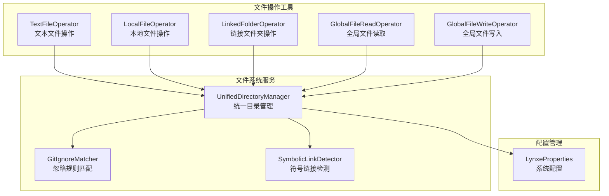
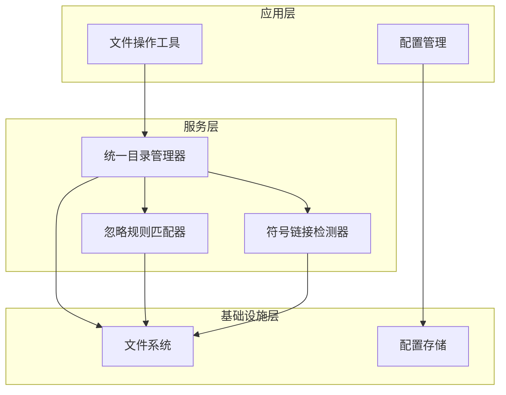
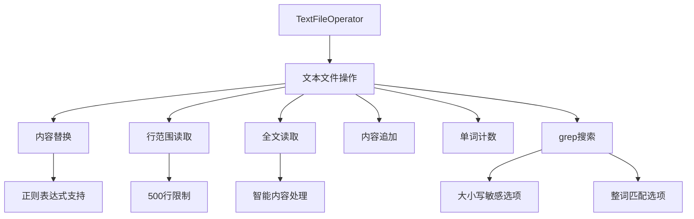
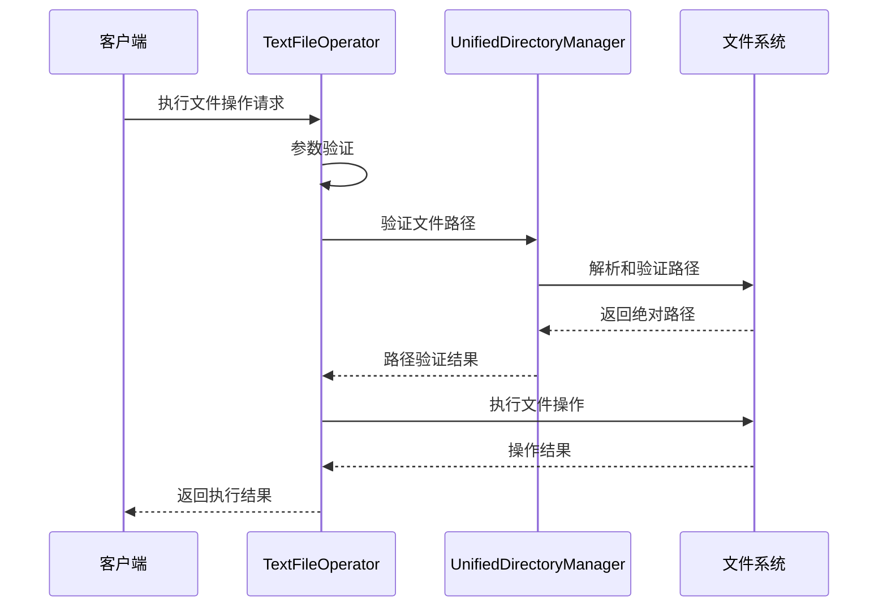
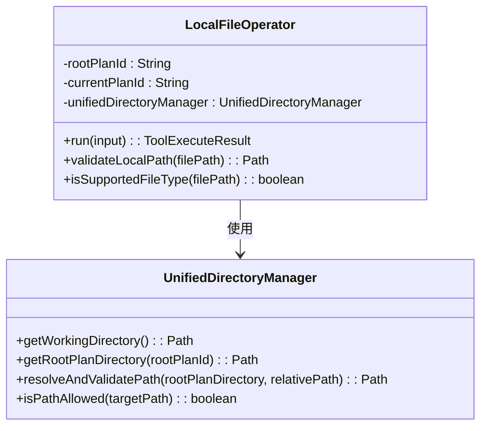
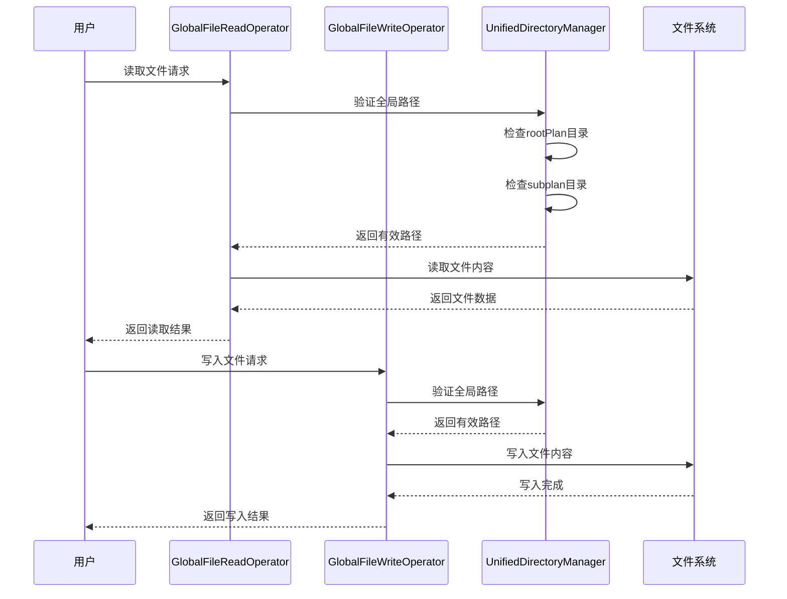
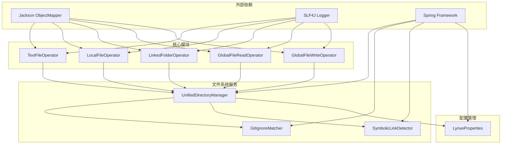

# 文件处理工具

<cite>
**本文档引用的文件**
- [TextFileOperator.java](file://src/main/java/com/alibaba/cloud/ai/lynxe/tool/textOperator/TextFileOperator.java)
- [LocalFileOperator.java](file://src/main/java/com/alibaba/cloud/ai/lynxe/tool/textOperator/LocalFileOperator.java)
- [LinkedFolderOperator.java](file://src/main/java/com/alibaba/cloud/ai/lynxe/tool/textOperator/LinkedFolderOperator.java)
- [GlobalFileReadOperator.java](file://src/main/java/com/alibaba/cloud/ai/lynxe/tool/textOperator/GlobalFileReadOperator.java)
- [GlobalFileWriteOperator.java](file://src/main/java/com/alibaba/cloud/ai/lynxe/tool/textOperator/GlobalFileWriteOperator.java)
- [UnifiedDirectoryManager.java](file://src/main/java/com/alibaba/cloud/ai/lynxe/tool/filesystem/UnifiedDirectoryManager.java)
- [GitIgnoreMatcher.java](file://src/main/java/com/alibaba/cloud/ai/lynxe/tool/filesystem/GitIgnoreMatcher.java)
- [SymbolicLinkDetector.java](file://src/main/java/com/alibaba/cloud/ai/lynxe/tool/filesystem/SymbolicLinkDetector.java)
- [LynxeProperties.java](file://src/main/java/com/alibaba/cloud/ai/lynxe/config/LynxeProperties.java)
</cite>

## 目录
1. [简介](#简介)
2. [项目结构](#项目结构)
3. [核心组件](#核心组件)
4. [架构概览](#架构概览)
5. [详细组件分析](#详细组件分析)
6. [依赖关系分析](#依赖关系分析)
7. [性能考虑](#性能考虑)
8. [故障排除指南](#故障排除指南)
9. [结论](#结论)

## 简介

Lynxe文件处理工具模块是一个功能强大的文件管理系统，提供了多种文件操作能力。该模块的核心设计理念是通过统一的目录管理器实现安全的文件访问控制，同时提供灵活的文件操作工具来满足不同的使用场景。

该系统主要包含以下几类文件操作工具：
- 文本文件处理工具：支持文本文件的各种操作，包括读取、写入、替换、搜索等
- 本地文件管理工具：提供受限范围内的文件操作，确保安全性
- 链接文件夹操作工具：允许访问外部文件夹，实现跨目录的文件访问
- 全局文件读写工具：提供跨计划的文件访问能力

## 项目结构

文件处理工具模块位于`src/main/java/com/alibaba/cloud/ai/lynxe/tool/`目录下，采用按功能分层的组织方式：

**图表来源**
- [TextFileOperator.java:1-998](file://src/main/java/com/alibaba/cloud/ai/lynxe/tool/textOperator/TextFileOperator.java#L1-L998)
- [UnifiedDirectoryManager.java:1-715](file://src/main/java/com/alibaba/cloud/ai/lynxe/tool/filesystem/UnifiedDirectoryManager.java#L1-L715)

**章节来源**
- [TextFileOperator.java:1-998](file://src/main/java/com/alibaba/cloud/ai/lynxe/tool/textOperator/TextFileOperator.java#L1-L998)
- [LocalFileOperator.java:1-1126](file://src/main/java/com/alibaba/cloud/ai/lynxe/tool/textOperator/LocalFileOperator.java#L1-L1126)
- [LinkedFolderOperator.java:1-790](file://src/main/java/com/alibaba/cloud/ai/lynxe/tool/textOperator/LinkedFolderOperator.java#L1-L790)

## 核心组件

### 统一目录管理器 (UnifiedDirectoryManager)

UnifiedDirectoryManager是整个文件系统的核心组件，负责管理所有文件系统的访问权限和路径解析。它提供了以下关键功能：

- **路径验证**：确保所有文件操作都在允许的安全范围内进行
- **符号链接管理**：安全地处理符号链接，防止循环引用和路径遍历攻击
- **工作目录管理**：统一管理扩展目录、内部存储目录和计划目录
- **外部文件夹链接**：为链接文件夹操作提供安全的外部访问接口

### 忽略规则匹配器 (GitIgnoreMatcher)

GitIgnoreMatcher实现了完整的.gitignore文件解析和匹配功能，支持：
- 多种通配符模式（*、?、**）
- 目录专用模式和否定模式
- 路径相对匹配
- 缓存机制提高性能

### 符号链接检测器 (SymbolicLinkDetector)

SymbolicLinkDetector专门用于检测和处理符号链接，防止潜在的安全问题：
- 检测循环引用
- 验证符号链接目标的有效性
- 提供安全的目录遍历机制

**章节来源**
- [UnifiedDirectoryManager.java:1-715](file://src/main/java/com/alibaba/cloud/ai/lynxe/tool/filesystem/UnifiedDirectoryManager.java#L1-L715)
- [GitIgnoreMatcher.java:1-558](file://src/main/java/com/alibaba/cloud/ai/lynxe/tool/filesystem/GitIgnoreMatcher.java#L1-L558)
- [SymbolicLinkDetector.java:1-277](file://src/main/java/com/alibaba/cloud/ai/lynxe/tool/filesystem/SymbolicLinkDetector.java#L1-L277)

## 架构概览

文件处理工具模块采用分层架构设计，确保了良好的可维护性和扩展性：

**图表来源**
- [UnifiedDirectoryManager.java:37-715](file://src/main/java/com/alibaba/cloud/ai/lynxe/tool/filesystem/UnifiedDirectoryManager.java#L37-L715)
- [LynxeProperties.java:26-654](file://src/main/java/com/alibaba/cloud/ai/lynxe/config/LynxeProperties.java#L26-L654)

### 安全架构设计

系统采用了多层安全防护机制：

1. **路径验证层**：所有文件路径在进入系统前都经过严格的验证
2. **符号链接防护**：防止符号链接攻击和循环引用
3. **权限控制层**：基于计划ID的访问控制
4. **忽略规则层**：支持.gitignore文件的忽略规则

## 详细组件分析

### TextFileOperator 分析

TextFileOperator是最复杂的文件操作工具，提供了丰富的文本文件处理功能：

#### 核心功能特性

**图表来源**
- [TextFileOperator.java:172-771](file://src/main/java/com/alibaba/cloud/ai/lynxe/tool/textOperator/TextFileOperator.java#L172-L771)

#### 文件操作流程

**图表来源**
- [TextFileOperator.java:342-409](file://src/main/java/com/alibaba/cloud/ai/lynxe/tool/textOperator/TextFileOperator.java#L342-L409)
- [UnifiedDirectoryManager.java:249-276](file://src/main/java/com/alibaba/cloud/ai/lynxe/tool/filesystem/UnifiedDirectoryManager.java#L249-L276)

#### 支持的文件类型

TextFileOperator支持广泛的文本文件格式，包括但不限于：
- 编程语言文件：Java、Python、JavaScript、C++等
- 标记语言：HTML、CSS、XML、JSON、YAML等
- 配置文件：Properties、Toml、Env等
- 日志文件：Log、CSV等

**章节来源**
- [TextFileOperator.java:1-998](file://src/main/java/com/alibaba/cloud/ai/lynxe/tool/textOperator/TextFileOperator.java#L1-L998)

### LocalFileOperator 分析

LocalFileOperator提供了受限范围内的文件操作，强调安全性和隔离性：

#### 安全特性

**图表来源**
- [LocalFileOperator.java:43-429](file://src/main/java/com/alibaba/cloud/ai/lynxe/tool/textOperator/LocalFileOperator.java#L43-L429)
- [UnifiedDirectoryManager.java:135-167](file://src/main/java/com/alibaba/cloud/ai/lynxe/tool/filesystem/UnifiedDirectoryManager.java#L135-L167)

#### 操作限制

LocalFileOperator的主要限制包括：
- 仅能访问当前计划目录
- 不支持跨目录文件操作
- 自动创建不存在的文件
- 支持短URL替换功能

**章节来源**
- [LocalFileOperator.java:1-1126](file://src/main/java/com/alibaba/cloud/ai/lynxe/tool/textOperator/LocalFileOperator.java#L1-L1126)

### LinkedFolderOperator 分析

LinkedFolderOperator专门用于访问外部文件夹，提供了安全的跨目录文件访问能力：

#### 外部访问机制

**图表来源**
- [LinkedFolderOperator.java:262-313](file://src/main/java/com/alibaba/cloud/ai/lynxe/tool/textOperator/LinkedFolderOperator.java#L262-L313)
- [UnifiedDirectoryManager.java:99-124](file://src/main/java/com/alibaba/cloud/ai/lynxe/tool/filesystem/UnifiedDirectoryManager.java#L99-L124)

#### 配置要求

要使用LinkedFolderOperator，需要在系统配置中设置：
- `lynxe.general.externalLinkedFolder`: 外部文件夹的绝对路径
- 系统会自动创建符号链接`rootPlanId/linked_external`指向外部文件夹

**章节来源**
- [LinkedFolderOperator.java:1-790](file://src/main/java/com/alibaba/cloud/ai/lynxe/tool/textOperator/LinkedFolderOperator.java#L1-L790)

### GlobalFileReadOperator 和 GlobalFileWriteOperator 分析

这两个工具提供了跨计划的文件访问能力，是Lynxe系统中最重要的文件操作工具：

#### 全局访问机制

**图表来源**
- [GlobalFileReadOperator.java:385-456](file://src/main/java/com/alibaba/cloud/ai/lynxe/tool/textOperator/GlobalFileReadOperator.java#L385-L456)
- [GlobalFileWriteOperator.java:504-541](file://src/main/java/com/alibaba/cloud/ai/lynxe/tool/textOperator/GlobalFileWriteOperator.java#L504-L541)

#### 路径解析策略

全局文件操作采用智能路径解析策略：
1. 首先检查根计划目录
2. 如果未找到，检查子计划目录
3. 如果仍未找到，返回根计划目录路径（用于创建新文件）

**章节来源**
- [GlobalFileReadOperator.java:1-527](file://src/main/java/com/alibaba/cloud/ai/lynxe/tool/textOperator/GlobalFileReadOperator.java#L1-L527)
- [GlobalFileWriteOperator.java:1-587](file://src/main/java/com/alibaba/cloud/ai/lynxe/tool/textOperator/GlobalFileWriteOperator.java#L1-L587)

## 依赖关系分析

文件处理工具模块的依赖关系清晰明确，遵循了依赖倒置原则：

**图表来源**
- [UnifiedDirectoryManager.java:16-31](file://src/main/java/com/alibaba/cloud/ai/lynxe/tool/filesystem/UnifiedDirectoryManager.java#L16-L31)
- [TextFileOperator.java:158-170](file://src/main/java/com/alibaba/cloud/ai/lynxe/tool/textOperator/TextFileOperator.java#L158-L170)

### 关键依赖说明

1. **Jackson ObjectMapper**：用于JSON序列化和反序列化
2. **SLF4J Logger**：提供统一的日志记录接口
3. **Spring Framework**：提供依赖注入和配置管理
4. **LynxeProperties**：系统配置管理

**章节来源**
- [UnifiedDirectoryManager.java:1-715](file://src/main/java/com/alibaba/cloud/ai/lynxe/tool/filesystem/UnifiedDirectoryManager.java#L1-L715)
- [LynxeProperties.java:1-654](file://src/main/java/com/alibaba/cloud/ai/lynxe/config/LynxeProperties.java#L1-L654)

## 性能考虑

文件处理工具模块在设计时充分考虑了性能优化：

### 缓存策略

1. **忽略规则缓存**：GitIgnoreMatcher使用Map缓存已解析的忽略规则
2. **路径验证缓存**：UnifiedDirectoryManager缓存路径验证结果
3. **符号链接信息缓存**：SymbolicLinkDetector缓存符号链接检测结果

### 异步处理

- 大文件读取采用流式处理，避免内存溢出
- 批量文件操作支持异步执行
- 缓冲区管理优化I/O性能

### 内存管理

- 及时释放文件句柄和缓冲区
- 大对象及时垃圾回收
- 避免不必要的字符串复制

## 故障排除指南

### 常见问题及解决方案

#### 文件访问权限问题

**问题描述**：文件操作失败，提示权限不足

**可能原因**：
1. 文件路径超出允许范围
2. 符号链接指向不受信任的位置
3. 外部文件夹链接配置错误

**解决方法**：
1. 检查文件路径是否在允许范围内
2. 验证符号链接的有效性
3. 重新配置外部文件夹链接

#### 文件过大导致的问题

**问题描述**：大文件读取或写入超时

**解决方法**：
1. 使用分页读取（offset和limit参数）
2. 启用智能内容保存功能
3. 调整系统超时设置

#### 编码问题

**问题描述**：文件内容显示乱码

**解决方法**：
1. 确认文件编码格式
2. 使用适当的字符集转换
3. 检查系统默认编码设置

**章节来源**
- [GlobalFileReadOperator.java:406-414](file://src/main/java/com/alibaba/cloud/ai/lynxe/tool/textOperator/GlobalFileReadOperator.java#L406-L414)
- [LynxeProperties.java:366-382](file://src/main/java/com/alibaba/cloud/ai/lynxe/config/LynxeProperties.java#L366-L382)

## 结论

Lynxe文件处理工具模块通过精心设计的架构和严格的安全控制，为用户提供了强大而安全的文件操作能力。模块的主要优势包括：

1. **多层次安全防护**：从路径验证到符号链接检测，确保文件系统安全
2. **灵活的访问控制**：支持不同级别的文件访问权限
3. **高性能设计**：通过缓存和流式处理优化性能
4. **易扩展性**：清晰的架构设计便于功能扩展

该模块为Lynxe系统提供了坚实的文件操作基础，能够满足各种复杂的文件处理需求，同时确保了系统的安全性和稳定性。