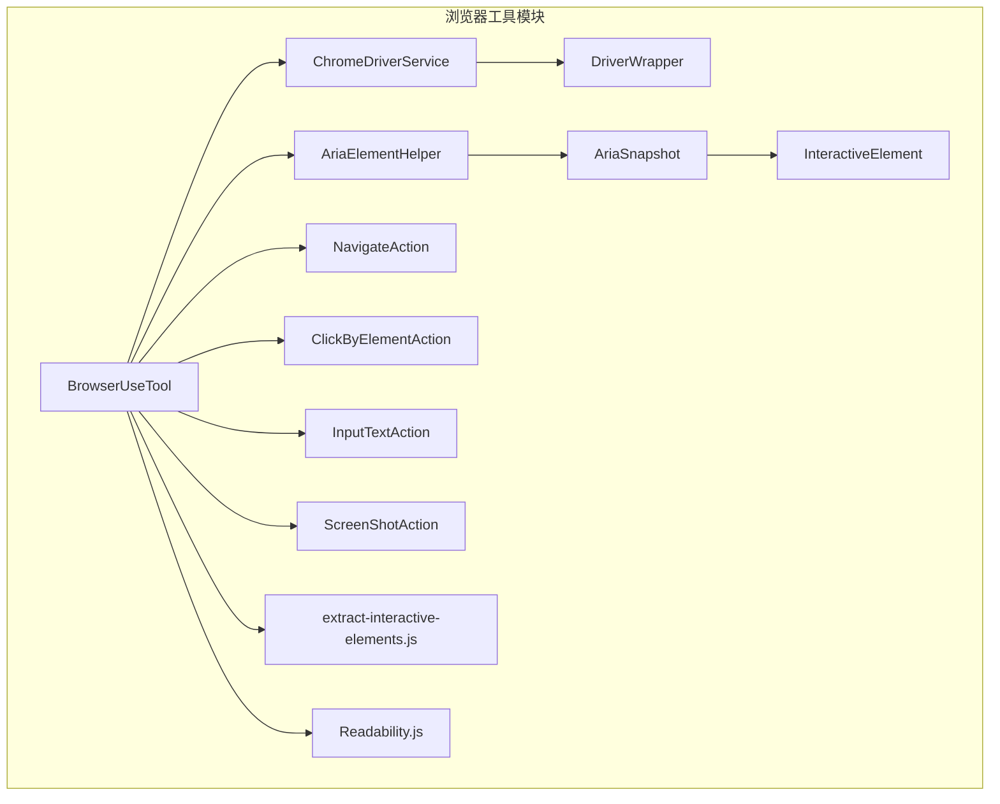
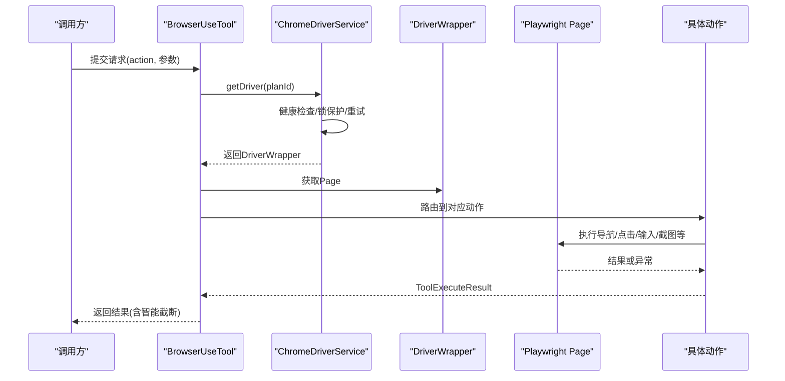
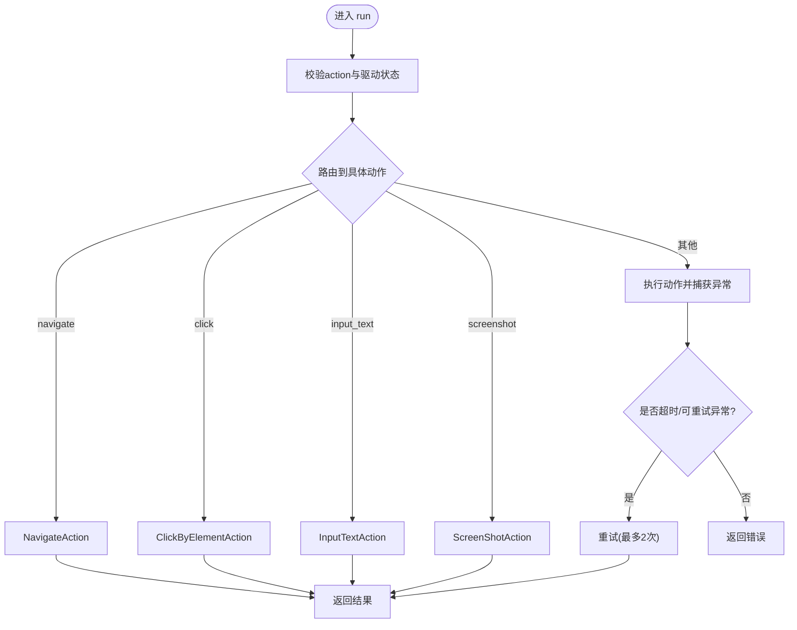
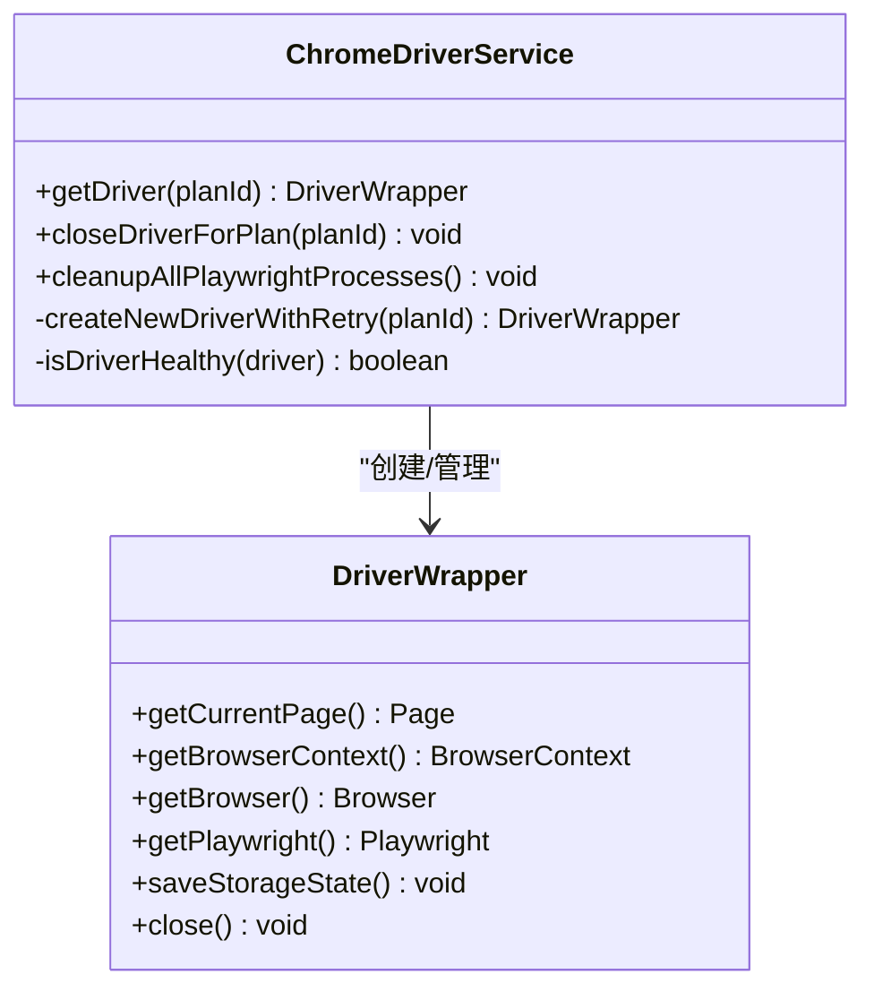
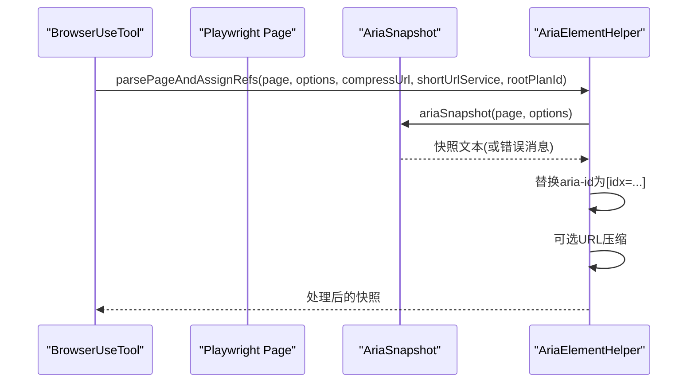
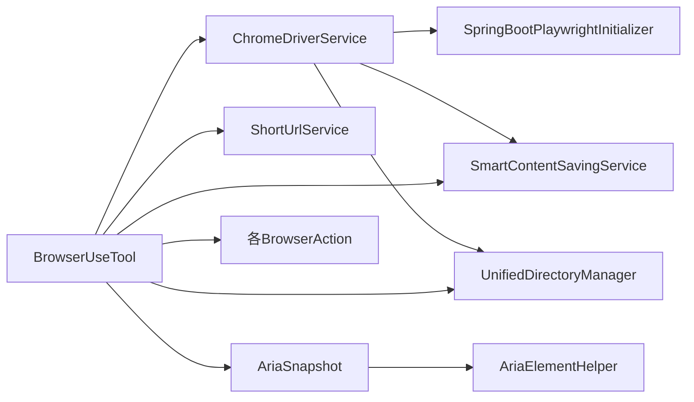

# 浏览器工具

<cite>
**本文引用的文件**   
- [BrowserUseTool.java](file://src/main/java/com/alibaba/cloud/ai/lynxe/tool/browser/BrowserUseTool.java)
- [ChromeDriverService.java](file://src/main/java/com/alibaba/cloud/ai/lynxe/tool/browser/ChromeDriverService.java)
- [DriverWrapper.java](file://src/main/java/com/alibaba/cloud/ai/lynxe/tool/browser/DriverWrapper.java)
- [IChromeDriverService.java](file://src/main/java/com/alibaba/cloud/ai/lynxe/tool/browser/IChromeDriverService.java)
- [SpringBootPlaywrightInitializer.java](file://src/main/java/com/alibaba/cloud/ai/lynxe/tool/browser/SpringBootPlaywrightInitializer.java)
- [AriaElementHelper.java](file://src/main/java/com/alibaba/cloud/ai/lynxe/tool/browser/AriaElementHelper.java)
- [AriaSnapshot.java](file://src/main/java/com/alibaba/cloud/ai/lynxe/tool/browser/AriaSnapshot.java)
- [InteractiveElement.java](file://src/main/java/com/alibaba/cloud/ai/lynxe/tool/browser/InteractiveElement.java)
- [NavigateAction.java](file://src/main/java/com/alibaba/cloud/ai/lynxe/tool/browser/actions/NavigateAction.java)
- [ClickByElementAction.java](file://src/main/java/com/alibaba/cloud/ai/lynxe/tool/browser/actions/ClickByElementAction.java)
- [InputTextAction.java](file://src/main/java/com/alibaba/cloud/ai/lynxe/tool/browser/actions/InputTextAction.java)
- [ScreenShotAction.java](file://src/main/java/com/alibaba/cloud/ai/lynxe/tool/browser/actions/ScreenShotAction.java)
- [extract-interactive-elements.js](file://src/main/resources/tool/extract-interactive-elements.js)
- [Readability.js](file://src/main/resources/tool/Readability.js)
</cite>

## 目录
1. [简介](#简介)
2. [项目结构](#项目结构)
3. [核心组件](#核心组件)
4. [架构总览](#架构总览)
5. [详细组件分析](#详细组件分析)
6. [依赖关系分析](#依赖关系分析)
7. [性能考量](#性能考量)
8. [故障排除指南](#故障排除指南)
9. [结论](#结论)
10. [附录](#附录)

## 简介
本文件面向Lynxe浏览器工具模块，系统化阐述BrowserUseTool与Playwright集成机制、ChromeDriverService的浏览器管理与资源清理、各类BrowserAction（导航、点击、输入、截图等）的实现细节，并深入解析AriaElementHelper的可访问性元素识别与InteractiveElement的交互处理流程。同时提供浏览器自动化最佳实践、性能优化建议与常见问题排查方法，涵盖安全限制、跨域处理与会话管理等关键主题。

## 项目结构
浏览器工具位于后端模块的tool/browser路径下，采用“服务层 + 工具层 + 动作层”的分层设计：
- 服务层：ChromeDriverService负责浏览器生命周期管理、上下文隔离与资源回收；DriverWrapper封装Playwright实例的关闭顺序与存储状态持久化。
- 工具层：BrowserUseTool作为统一入口，调度各动作并进行重试、超时与智能内容处理；AriaElementHelper与AriaSnapshot负责生成可交互元素快照；InteractiveElement承载定位器与元素信息。
- 动作层：NavigateAction、ClickByElementAction、InputTextAction、ScreenShotAction等具体动作实现。
- 资源脚本：extract-interactive-elements.js用于在页面侧提取可交互元素；Readability.js用于网页正文抽取（在写入当前网页内容等场景使用）。

图表来源
- [BrowserUseTool.java:113-295](file://src/main/java/com/alibaba/cloud/ai/lynxe/tool/browser/BrowserUseTool.java#L113-L295)
- [ChromeDriverService.java:105-157](file://src/main/java/com/alibaba/cloud/ai/lynxe/tool/browser/ChromeDriverService.java#L105-L157)
- [DriverWrapper.java:37-84](file://src/main/java/com/alibaba/cloud/ai/lynxe/tool/browser/DriverWrapper.java#L37-L84)
- [AriaElementHelper.java:79-132](file://src/main/java/com/alibaba/cloud/ai/lynxe/tool/browser/AriaElementHelper.java#L79-L132)
- [AriaSnapshot.java:64-131](file://src/main/java/com/alibaba/cloud/ai/lynxe/tool/browser/AriaSnapshot.java#L64-L131)
- [InteractiveElement.java:26-63](file://src/main/java/com/alibaba/cloud/ai/lynxe/tool/browser/InteractiveElement.java#L26-L63)
- [NavigateAction.java:32-75](file://src/main/java/com/alibaba/cloud/ai/lynxe/tool/browser/actions/NavigateAction.java#L32-L75)
- [ClickByElementAction.java:32-103](file://src/main/java/com/alibaba/cloud/ai/lynxe/tool/browser/actions/ClickByElementAction.java#L32-L103)
- [InputTextAction.java:28-85](file://src/main/java/com/alibaba/cloud/ai/lynxe/tool/browser/actions/InputTextAction.java#L28-L85)
- [ScreenShotAction.java:28-35](file://src/main/java/com/alibaba/cloud/ai/lynxe/tool/browser/actions/ScreenShotAction.java#L28-L35)
- [extract-interactive-elements.js:20-386](file://src/main/resources/tool/extract-interactive-elements.js#L20-L386)
- [Readability.js:27-109](file://src/main/resources/tool/Readability.js#L27-L109)

章节来源
- [BrowserUseTool.java:113-295](file://src/main/java/com/alibaba/cloud/ai/lynxe/tool/browser/BrowserUseTool.java#L113-L295)
- [ChromeDriverService.java:105-157](file://src/main/java/com/alibaba/cloud/ai/lynxe/tool/browser/ChromeDriverService.java#L105-L157)

## 核心组件
- BrowserUseTool：统一入口，解析请求、路由到具体动作、执行重试、超时处理、智能内容截断与返回；提供当前状态字符串展示（URL、标题、标签页、可交互元素、滚动信息等）。
- ChromeDriverService：按计划ID隔离浏览器实例，提供驱动获取、健康检查、重试创建、锁保护、关闭与清理（含userDataDir历史清理）、JVM关闭钩子。
- DriverWrapper：遵循Playwright最佳实践的资源关闭顺序（上下文先关，再关浏览器，最后关闭Playwright），异步保存storage-state，支持历史清理。
- AriaElementHelper/AriaSnapshot：生成ARIA快照，替换aria-id为[idx=...]索引，支持URL压缩；对超时/异常返回错误消息而非抛出异常。
- InteractiveElement：封装元素索引、定位器、标签名、文本、outerHTML等信息，提供toString摘要。
- 各类BrowserAction：导航、点击（鼠标模拟+回退）、输入（清空+逐字符输入+JS赋值）、截图等。

章节来源
- [BrowserUseTool.java:37-675](file://src/main/java/com/alibaba/cloud/ai/lynxe/tool/browser/BrowserUseTool.java#L37-L675)
- [ChromeDriverService.java:48-914](file://src/main/java/com/alibaba/cloud/ai/lynxe/tool/browser/ChromeDriverService.java#L48-L914)
- [DriverWrapper.java:37-286](file://src/main/java/com/alibaba/cloud/ai/lynxe/tool/browser/DriverWrapper.java#L37-L286)
- [AriaElementHelper.java:28-221](file://src/main/java/com/alibaba/cloud/ai/lynxe/tool/browser/AriaElementHelper.java#L28-L221)
- [AriaSnapshot.java:43-134](file://src/main/java/com/alibaba/cloud/ai/lynxe/tool/browser/AriaSnapshot.java#L43-L134)
- [InteractiveElement.java:26-126](file://src/main/java/com/alibaba/cloud/ai/lynxe/tool/browser/InteractiveElement.java#L26-L126)

## 架构总览
浏览器工具通过BrowserUseTool协调ChromeDriverService提供的DriverWrapper，结合Playwright的Page/Locator能力完成页面操作。AriaSnapshot与AriaElementHelper负责可交互元素识别与快照生成，供用户选择目标元素并触发对应动作。

图表来源
- [BrowserUseTool.java:113-295](file://src/main/java/com/alibaba/cloud/ai/lynxe/tool/browser/BrowserUseTool.java#L113-L295)
- [ChromeDriverService.java:105-157](file://src/main/java/com/alibaba/cloud/ai/lynxe/tool/browser/ChromeDriverService.java#L105-L157)
- [DriverWrapper.java:89-98](file://src/main/java/com/alibaba/cloud/ai/lynxe/tool/browser/DriverWrapper.java#L89-L98)
- [NavigateAction.java:32-75](file://src/main/java/com/alibaba/cloud/ai/lynxe/tool/browser/actions/NavigateAction.java#L32-L75)
- [ClickByElementAction.java:32-103](file://src/main/java/com/alibaba/cloud/ai/lynxe/tool/browser/actions/ClickByElementAction.java#L32-L103)
- [InputTextAction.java:28-85](file://src/main/java/com/alibaba/cloud/ai/lynxe/tool/browser/actions/InputTextAction.java#L28-L85)
- [ScreenShotAction.java:28-35](file://src/main/java/com/alibaba/cloud/ai/lynxe/tool/browser/actions/ScreenShotAction.java#L28-L35)

## 详细组件分析

### BrowserUseTool：统一入口与动作编排
- 请求解析与校验：校验action参数、驱动可用性、浏览器连接状态、当前页面有效性。
- 动作路由：根据action名称分派到具体动作（navigate、click、input_text、key_enter、screenshot、get_text、execute_js、scroll、new_tab、close_tab、switch_tab、refresh、get_element_position、move_to_and_click、get_web_content、download）。
- 重试机制：对超时与部分Playwright异常进行最多两次重试，非可重试异常直接抛出；对“浏览器/上下文已关闭”等明确失败场景不重试。
- 智能内容处理：对长输出（如get_text、execute_js）通过SmartContentSavingService进行智能截断与归档。
- 当前状态：生成包含URL/标题/标签页/可交互元素/滚动信息等的状态字符串，便于用户决策。

图表来源
- [BrowserUseTool.java:113-295](file://src/main/java/com/alibaba/cloud/ai/lynxe/tool/browser/BrowserUseTool.java#L113-L295)
- [NavigateAction.java:32-75](file://src/main/java/com/alibaba/cloud/ai/lynxe/tool/browser/actions/NavigateAction.java#L32-L75)
- [ClickByElementAction.java:32-103](file://src/main/java/com/alibaba/cloud/ai/lynxe/tool/browser/actions/ClickByElementAction.java#L32-L103)
- [InputTextAction.java:28-85](file://src/main/java/com/alibaba/cloud/ai/lynxe/tool/browser/actions/InputTextAction.java#L28-L85)
- [ScreenShotAction.java:28-35](file://src/main/java/com/alibaba/cloud/ai/lynxe/tool/browser/actions/ScreenShotAction.java#L28-L35)

章节来源
- [BrowserUseTool.java:113-295](file://src/main/java/com/alibaba/cloud/ai/lynxe/tool/browser/BrowserUseTool.java#L113-L295)

### ChromeDriverService：浏览器生命周期与资源管理
- 驱动获取：按planId缓存DriverWrapper，健康检查失败则关闭并重建；使用可重入锁避免并发冲突。
- 创建策略：优先使用launchPersistentContext配合planId专属userDataDir，支持共享storage-state.json；若失败则回退至常规launch/newContext。
- 启动参数优化：禁用背景网络、扩展、通知、同步等，设置合理窗口尺寸与UA，启用headless模式由配置决定。
- 关闭与清理：注册JVM关闭钩子；closeDriverForPlan移除缓存并删除planId专属userDataDir；DriverWrapper关闭顺序遵循Playwright最佳实践。
- 存储状态：异步保存storage-state，确保cookies/localStorage/sessionStorage持久化。

图表来源
- [ChromeDriverService.java:105-284](file://src/main/java/com/alibaba/cloud/ai/lynxe/tool/browser/ChromeDriverService.java#L105-L284)
- [DriverWrapper.java:37-286](file://src/main/java/com/alibaba/cloud/ai/lynxe/tool/browser/DriverWrapper.java#L37-L286)

章节来源
- [ChromeDriverService.java:105-284](file://src/main/java/com/alibaba/cloud/ai/lynxe/tool/browser/ChromeDriverService.java#L105-L284)
- [DriverWrapper.java:193-283](file://src/main/java/com/alibaba/cloud/ai/lynxe/tool/browser/DriverWrapper.java#L193-L283)

### AriaElementHelper 与 AriaSnapshot：可交互元素识别
- AriaSnapshot：通过注入aria-label并调用Playwright原生locator.ariaSnapshot()生成ARIA快照；对超时/异常返回错误消息字符串，保证流程不中断。
- AriaElementHelper：将快照中的aria-id-N替换为[idx=N]，支持URL压缩（短链映射），并记录调试日志；解析失败时返回错误提示。

图表来源
- [BrowserUseTool.java:509-538](file://src/main/java/com/alibaba/cloud/ai/lynxe/tool/browser/BrowserUseTool.java#L509-L538)
- [AriaElementHelper.java:79-132](file://src/main/java/com/alibaba/cloud/ai/lynxe/tool/browser/AriaElementHelper.java#L79-L132)
- [AriaSnapshot.java:64-131](file://src/main/java/com/alibaba/cloud/ai/lynxe/tool/browser/AriaSnapshot.java#L64-L131)

章节来源
- [AriaElementHelper.java:79-132](file://src/main/java/com/alibaba/cloud/ai/lynxe/tool/browser/AriaElementHelper.java#L79-L132)
- [AriaSnapshot.java:64-131](file://src/main/java/com/alibaba/cloud/ai/lynxe/tool/browser/AriaSnapshot.java#L64-L131)

### InteractiveElement：元素定位与描述
- 通过lynxe-id或XPath构造Locator，支持获取标签名、文本、outerHTML等信息。
- toString输出格式化摘要，必要时截断长内容，便于用户阅读。

章节来源
- [InteractiveElement.java:26-126](file://src/main/java/com/alibaba/cloud/ai/lynxe/tool/browser/InteractiveElement.java#L26-L126)

### 动作实现要点

#### 导航（NavigateAction）
- 支持短链解析与自动协议补全（http/https）。
- 导航后等待DOMCONTENTLOADED，保存storage-state以持久化状态。

章节来源
- [NavigateAction.java:32-75](file://src/main/java/com/alibaba/cloud/ai/lynxe/tool/browser/actions/NavigateAction.java#L32-L75)

#### 点击（ClickByElementAction）
- 主方法：鼠标移动到元素中心并点击，支持滚动到可视区域。
- 回退方法：标准locator.click()，带可见性等待与超时控制。
- 新标签页切换：点击后检测新标签页并切换，提升多标签场景体验。

章节来源
- [ClickByElementAction.java:32-103](file://src/main/java/com/alibaba/cloud/ai/lynxe/tool/browser/actions/ClickByElementAction.java#L32-L103)

#### 文本输入（InputTextAction）
- 先清空再逐字符输入，模拟真实打字节奏；失败时尝试直接fill；仍失败则通过JS赋值并触发input事件。

章节来源
- [InputTextAction.java:28-85](file://src/main/java/com/alibaba/cloud/ai/lynxe/tool/browser/actions/InputTextAction.java#L28-L85)

#### 截图（ScreenShotAction）
- 直接调用Page.screenshot()并返回base64长度提示，便于后续处理。

章节来源
- [ScreenShotAction.java:28-35](file://src/main/java/com/alibaba/cloud/ai/lynxe/tool/browser/actions/ScreenShotAction.java#L28-L35)

#### 页面内容写入（示例：写入当前网页内容）
- 通过Readability.js对页面进行正文抽取，结合TextFileService写入文件，便于离线分析与长期留存。

章节来源
- [Readability.js:27-109](file://src/main/resources/tool/Readability.js#L27-L109)

## 依赖关系分析
- BrowserUseTool依赖ChromeDriverService获取DriverWrapper，依赖SmartContentSavingService进行内容截断，依赖ShortUrlService进行URL压缩，依赖ToolI18nService与UnifiedDirectoryManager。
- ChromeDriverService依赖SpringBootPlaywrightInitializer在Spring Boot环境中正确初始化Playwright，依赖UnifiedDirectoryManager与SmartContentSavingService进行工作目录与存储管理。
- AriaElementHelper依赖AriaSnapshot与ShortUrlService；AriaSnapshot依赖Playwright Page/Locator。
- 各动作依赖BrowserUseTool提供的上下文与Page实例。

图表来源
- [BrowserUseTool.java:55-66](file://src/main/java/com/alibaba/cloud/ai/lynxe/tool/browser/BrowserUseTool.java#L55-L66)
- [ChromeDriverService.java:66-88](file://src/main/java/com/alibaba/cloud/ai/lynxe/tool/browser/ChromeDriverService.java#L66-L88)
- [AriaElementHelper.java:79-132](file://src/main/java/com/alibaba/cloud/ai/lynxe/tool/browser/AriaElementHelper.java#L79-L132)
- [AriaSnapshot.java:64-131](file://src/main/java/com/alibaba/cloud/ai/lynxe/tool/browser/AriaSnapshot.java#L64-L131)

章节来源
- [BrowserUseTool.java:55-66](file://src/main/java/com/alibaba/cloud/ai/lynxe/tool/browser/BrowserUseTool.java#L55-L66)
- [ChromeDriverService.java:66-88](file://src/main/java/com/alibaba/cloud/ai/lynxe/tool/browser/ChromeDriverService.java#L66-L88)

## 性能考量
- 启动优化：禁用背景网络、扩展、通知、同步等，减少启动时间与资源占用；设置固定视口与UA，避免动态调整带来的抖动。
- 超时与重试：全局与元素级超时分离，动作内对可重试异常进行有限重试，避免长时间阻塞。
- 存储状态：使用storage-state持久化cookies与本地存储，减少重复登录成本；异步保存避免阻塞。
- ARIA快照：对超时/异常返回错误消息，避免阻断主流程；可选URL压缩降低传输与存储开销。
- 资源回收：严格遵循关闭顺序，确保历史文件解锁后再清理，避免IO错误。

## 故障排除指南
- 驱动不可用/连接断开：检查ChromeDriverService的健康检查与重试逻辑；确认JVM关闭钩子是否正常执行；必要时手动closeDriverForPlan释放资源。
- 超时与异常：BrowserUseTool对TimeoutError与PlaywrightException进行分类处理；对“浏览器/上下文已关闭”等明确失败场景不再重试。
- ARIA快照失败：AriaSnapshot返回错误消息而非抛出异常；检查页面复杂度与加载状态，适当增加超时或简化选择器。
- 点击无效：优先使用鼠标模拟点击，回退到标准click；确保元素可见且启用；关注新标签页切换。
- 输入失败：先清空再逐字符输入，失败时回退到JS赋值；注意输入延迟与事件触发。
- 下载目录：确保UnifiedDirectoryManager为下载创建目录；失败时检查权限与磁盘空间。

章节来源
- [BrowserUseTool.java:256-294](file://src/main/java/com/alibaba/cloud/ai/lynxe/tool/browser/BrowserUseTool.java#L256-L294)
- [ChromeDriverService.java:159-187](file://src/main/java/com/alibaba/cloud/ai/lynxe/tool/browser/ChromeDriverService.java#L159-L187)
- [AriaSnapshot.java:111-131](file://src/main/java/com/alibaba/cloud/ai/lynxe/tool/browser/AriaSnapshot.java#L111-L131)

## 结论
Lynxe浏览器工具模块通过BrowserUseTool统一编排、ChromeDriverService可靠管理、AriaSnapshot与AriaElementHelper精准识别，构建了稳定高效的浏览器自动化能力。其在资源管理、异常处理、性能优化与用户体验方面均体现了工程化最佳实践，适合在复杂业务场景中进行可扩展的自动化任务编排。

## 附录

### 安全限制与跨域处理
- 启动参数默认禁用扩展与后台网络，降低风险面；headless模式可按需开启。
- 跨域：遵循浏览器同源策略；如需跨域访问，应在目标站点允许范围内进行操作。
- 会话管理：通过storage-state持久化cookies与本地存储；支持共享storage-state.json实现多实例间会话复用。

章节来源
- [ChromeDriverService.java:463-660](file://src/main/java/com/alibaba/cloud/ai/lynxe/tool/browser/ChromeDriverService.java#L463-L660)

### 会话与历史清理
- 使用launchPersistentContext与planId专属userDataDir隔离不同计划的浏览器数据。
- DriverWrapper在关闭上下文后清理历史文件，验证cookies保留情况，确保状态持久化与隐私安全平衡。

章节来源
- [ChromeDriverService.java:430-441](file://src/main/java/com/alibaba/cloud/ai/lynxe/tool/browser/ChromeDriverService.java#L430-L441)
- [DriverWrapper.java:224-250](file://src/main/java/com/alibaba/cloud/ai/lynxe/tool/browser/DriverWrapper.java#L224-L250)