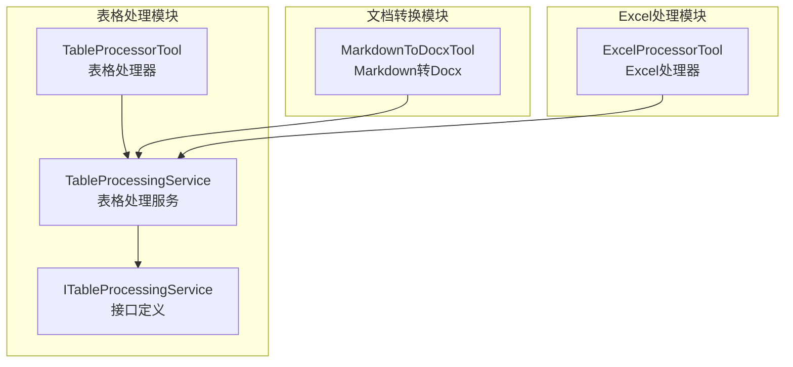
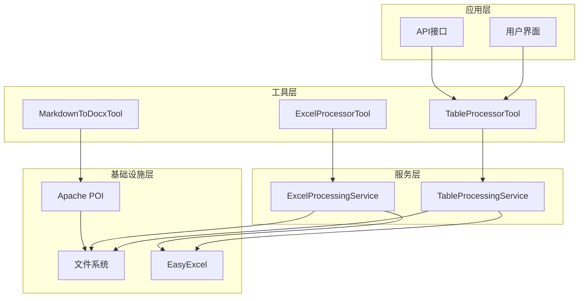
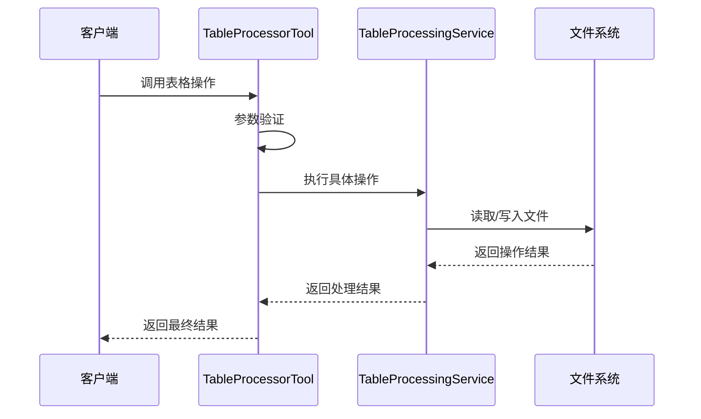
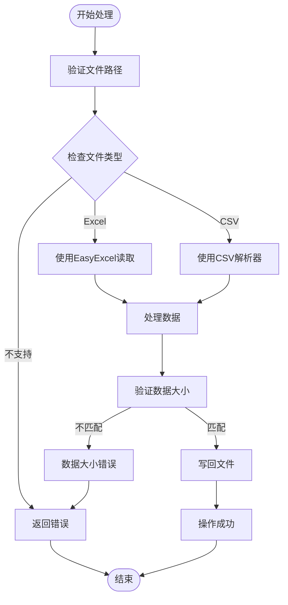
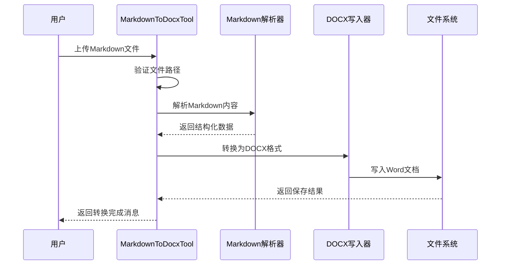
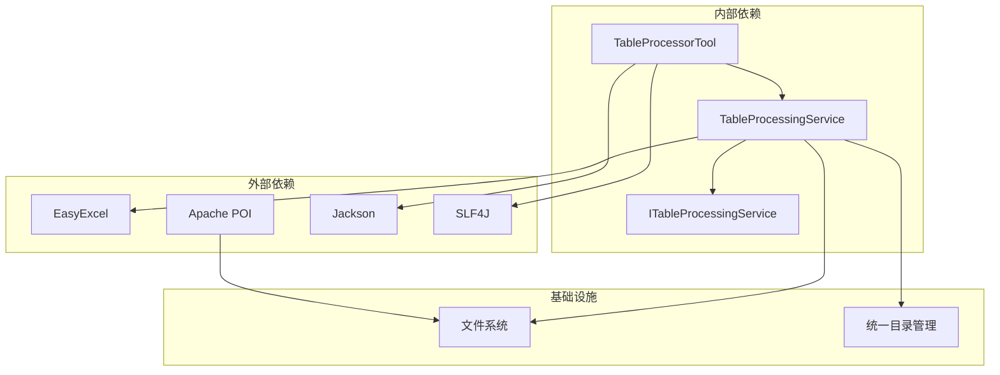

# 表格处理工具

<cite>
**本文档引用的文件**
- [TableProcessorTool.java](file://src/main/java/com/alibaba/cloud/ai/lynxe/tool/tableProcessor/TableProcessorTool.java)
- [TableProcessingService.java](file://src/main/java/com/alibaba/cloud/ai/lynxe/tool/tableProcessor/TableProcessingService.java)
- [ITableProcessingService.java](file://src/main/java/com/alibaba/cloud/ai/lynxe/tool/tableProcessor/ITableProcessingService.java)
- [MarkdownToDocxTool.java](file://src/main/java/com/alibaba/cloud/ai/lynxe/tool/office/MarkdownToDocxTool.java)
- [ExcelProcessorTool.java](file://src/main/java/com/alibaba/cloud/ai/lynxe/tool/excelProcessor/ExcelProcessorTool.java)
</cite>

## 目录
1. [简介](#简介)
2. [项目结构](#项目结构)
3. [核心组件](#核心组件)
4. [架构概览](#架构概览)
5. [详细组件分析](#详细组件分析)
6. [依赖分析](#依赖分析)
7. [性能考虑](#性能考虑)
8. [故障排除指南](#故障排除指南)
9. [结论](#结论)

## 简介

Lynxe表格处理工具模块是一套完整的表格数据处理解决方案，专注于提供高效、可靠的表格操作能力。该模块包含三个主要组件：TableProcessorTool（表格处理器）、TableProcessingService（表格处理服务）和MarkdownToDocxTool（Markdown到Word转换工具）。这些组件协同工作，为用户提供从基础表格创建到复杂数据处理的全方位支持。

本模块特别强调以下特性：
- 支持多种表格格式（Excel、CSV）
- 提供完整的CRUD操作能力
- 内置数据验证和错误处理机制
- 支持批量数据处理和高性能操作
- 提供文档格式转换功能

## 项目结构

表格处理工具模块位于项目的工具包中，采用清晰的分层架构设计：



**图表来源**
- [TableProcessorTool.java:1-485](file://src/main/java/com/alibaba/cloud/ai/lynxe/tool/tableProcessor/TableProcessorTool.java#L1-L485)
- [TableProcessingService.java:1-800](file://src/main/java/com/alibaba/cloud/ai/lynxe/tool/tableProcessor/TableProcessingService.java#L1-L800)
- [ITableProcessingService.java:1-211](file://src/main/java/com/alibaba/cloud/ai/lynxe/tool/tableProcessor/ITableProcessingService.java#L1-L211)

**章节来源**
- [TableProcessorTool.java:16-485](file://src/main/java/com/alibaba/cloud/ai/lynxe/tool/tableProcessor/TableProcessorTool.java#L16-L485)
- [TableProcessingService.java:16-800](file://src/main/java/com/alibaba/cloud/ai/lynxe/tool/tableProcessor/TableProcessingService.java#L16-L800)

## 核心组件

### TableProcessorTool - 表格处理器

TableProcessorTool是表格处理功能的对外接口，提供了完整的表格操作能力。它支持五种主要操作模式：

1. **create_table**: 创建新表格文件
2. **get_structure**: 获取表格结构信息
3. **write_multiple_rows**: 批量写入多行数据
4. **search_rows**: 按关键词搜索行数据
5. **delete_rows**: 删除指定行

该工具通过强类型输入参数确保操作的安全性和可靠性，并提供详细的错误处理机制。

**章节来源**
- [TableProcessorTool.java:29-485](file://src/main/java/com/alibaba/cloud/ai/lynxe/tool/tableProcessor/TableProcessorTool.java#L29-L485)

### TableProcessingService - 表格处理服务

TableProcessingService是表格处理的核心实现类，基于EasyExcel框架提供高性能的数据处理能力。该服务实现了ITableProcessingService接口，提供以下关键功能：

- 文件类型验证和路径管理
- 表头读取和结构分析
- 数据读取、写入和更新操作
- 搜索和删除功能
- 错误状态跟踪和清理机制

**章节来源**
- [TableProcessingService.java:43-800](file://src/main/java/com/alibaba/cloud/ai/lynxe/tool/tableProcessor/TableProcessingService.java#L43-L800)

### ITableProcessingService - 接口定义

ITableProcessingService定义了表格处理服务的标准接口规范，确保实现的一致性和可扩展性。接口涵盖了所有必要的表格操作方法，并提供了详细的实现指导原则。

**章节来源**
- [ITableProcessingService.java:36-211](file://src/main/java/com/alibaba/cloud/ai/lynxe/tool/tableProcessor/ITableProcessingService.java#L36-L211)

### MarkdownToDocxTool - 文档转换工具

MarkdownToDocxTool专门用于将Markdown格式的文档转换为Microsoft Word文档格式。该工具支持丰富的文档元素，包括：

- 标题层级处理
- 列表和编号列表
- 表格渲染
- 代码块格式化
- 图片嵌入和处理
- 水平分割线

**章节来源**
- [MarkdownToDocxTool.java:61-843](file://src/main/java/com/alibaba/cloud/ai/lynxe/tool/office/MarkdownToDocxTool.java#L61-L843)

## 架构概览

表格处理工具模块采用了清晰的分层架构设计，确保了良好的可维护性和扩展性：



**图表来源**
- [TableProcessorTool.java:117-121](file://src/main/java/com/alibaba/cloud/ai/lynxe/tool/tableProcessor/TableProcessorTool.java#L117-L121)
- [MarkdownToDocxTool.java:72-76](file://src/main/java/com/alibaba/cloud/ai/lynxe/tool/office/MarkdownToDocxTool.java#L72-L76)
- [ExcelProcessorTool.java:55-57](file://src/main/java/com/alibaba/cloud/ai/lynxe/tool/excelProcessor/ExcelProcessorTool.java#L55-L57)

## 详细组件分析

### TableProcessorTool 详细分析

TableProcessorTool作为表格处理的入口点，提供了完整的表格操作功能。其设计遵循了单一职责原则，每个操作都有明确的输入参数和输出结果。

#### 核心功能流程



**图表来源**
- [TableProcessorTool.java:269-339](file://src/main/java/com/alibaba/cloud/ai/lynxe/tool/tableProcessor/TableProcessorTool.java#L269-L339)
- [TableProcessingService.java:252-302](file://src/main/java/com/alibaba/cloud/ai/lynxe/tool/tableProcessor/TableProcessingService.java#L252-L302)

#### 支持的操作类型

| 操作类型 | 输入参数 | 功能描述 | 输出结果 |
|---------|---------|----------|----------|
| create_table | action, file_path, sheet_name, headers | 创建新表格文件 | 成功消息 |
| get_structure | action, file_path | 获取表格结构信息 | 表头列表 |
| write_multiple_rows | action, file_path, multiple_rows_data | 批量写入数据 | 成功消息 |
| search_rows | action, file_path, keywords | 搜索匹配行 | 匹配结果列表 |
| delete_rows | action, file_path, row_indices | 删除指定行 | 成功消息 |

**章节来源**
- [TableProcessorTool.java:123-239](file://src/main/java/com/alibaba/cloud/ai/lynxe/tool/tableProcessor/TableProcessorTool.java#L123-L239)

### TableProcessingService 详细分析

TableProcessingService是表格处理的核心实现，基于EasyExcel框架提供了高性能的数据处理能力。该服务的设计充分考虑了性能优化和错误处理。

#### 数据处理流程



**图表来源**
- [TableProcessingService.java:503-596](file://src/main/java/com/alibaba/cloud/ai/lynxe/tool/tableProcessor/TableProcessingService.java#L503-L596)
- [TableProcessingService.java:408-494](file://src/main/java/com/alibaba/cloud/ai/lynxe/tool/tableProcessor/TableProcessingService.java#L408-L494)

#### 关键特性

1. **多格式支持**: 同时支持Excel和CSV格式
2. **智能路径管理**: 自动处理相对路径和绝对路径
3. **并发安全**: 使用线程安全的数据结构
4. **错误恢复**: 提供完整的错误处理和恢复机制
5. **性能优化**: 基于流式处理减少内存占用

**章节来源**
- [TableProcessingService.java:42-800](file://src/main/java/com/alibaba/cloud/ai/lynxe/tool/tableProcessor/TableProcessingService.java#L42-L800)

### MarkdownToDocxTool 详细分析

MarkdownToDocxTool提供了强大的文档格式转换功能，能够将Markdown内容转换为专业的Word文档格式。

#### 转换流程



**图表来源**
- [MarkdownToDocxTool.java:127-197](file://src/main/java/com/alibaba/cloud/ai/lynxe/tool/office/MarkdownToDocxTool.java#L127-L197)
- [MarkdownToDocxTool.java:266-365](file://src/main/java/com/alibaba/cloud/ai/lynxe/tool/office/MarkdownToDocxTool.java#L266-L365)

#### 支持的Markdown元素

| 元素类型 | Markdown语法 | DOCX效果 |
|---------|-------------|----------|
| 标题 | # 标题1<br>## 标题2 | 加粗字体，不同字号 |
| 粗体 | **文本** | 粗体显示 |
| 斜体 | *文本* | 斜体显示 |
| 代码 | `代码` | 等宽字体 |
| 代码块 | ```javascript<br>代码``` | 背景色，等宽字体 |
| 列表 | - 项目<br>+ 项目<br>1. 编号项 | 对应的列表样式 |
| 表格 | \|列1\|\|列2\| | 表格单元格 |
| 图片 |  | 嵌入图片 |

**章节来源**
- [MarkdownToDocxTool.java:69-L800](file://src/main/java/com/alibaba/cloud/ai/lynxe/tool/office/MarkdownToDocxTool.java#L69-L800)

## 依赖分析

表格处理工具模块的依赖关系相对简单，主要依赖于外部库来处理具体的文件格式：



**图表来源**
- [TableProcessorTool.java:18-27](file://src/main/java/com/alibaba/cloud/ai/lynxe/tool/tableProcessor/TableProcessorTool.java#L18-L27)
- [TableProcessingService.java:34-41](file://src/main/java/com/alibaba/cloud/ai/lynxe/tool/tableProcessor/TableProcessingService.java#L34-L41)
- [MarkdownToDocxTool.java:30-47](file://src/main/java/com/alibaba/cloud/ai/lynxe/tool/office/MarkdownToDocxTool.java#L30-L47)

### 外部库说明

1. **EasyExcel**: 用于Excel文件的高性能读写
2. **Apache POI**: 用于Word文档的创建和编辑
3. **Jackson**: 用于JSON数据的序列化和反序列化
4. **SLF4J**: 用于日志记录

**章节来源**
- [TableProcessingService.java:34-41](file://src/main/java/com/alibaba/cloud/ai/lynxe/tool/tableProcessor/TableProcessingService.java#L34-L41)
- [MarkdownToDocxTool.java:30-47](file://src/main/java/com/alibaba/cloud/ai/lynxe/tool/office/MarkdownToDocxTool.java#L30-L47)

## 性能考虑

表格处理工具模块在设计时充分考虑了性能优化，特别是在处理大量数据时的表现。

### 内存管理策略

1. **流式处理**: 使用流式API处理大型文件，避免一次性加载到内存
2. **分页读取**: 支持分页读取数据，控制内存使用量
3. **及时释放**: 及时释放不再使用的资源和对象
4. **缓存机制**: 合理使用缓存减少重复计算

### 处理策略

1. **批量操作**: 支持批量数据写入，减少文件I/O次数
2. **并发处理**: 在可能的情况下使用并发处理提高效率
3. **延迟加载**: 只在需要时才加载数据到内存
4. **增量更新**: 支持增量更新，避免全量重写

### 大规模数据处理

对于超大文件的处理，建议采用以下策略：

1. **分块处理**: 将大文件分成小块进行处理
2. **进度监控**: 提供处理进度反馈
3. **错误恢复**: 支持断点续传和错误恢复
4. **资源限制**: 设置合理的内存和时间限制

## 故障排除指南

### 常见问题及解决方案

#### 文件路径问题
- **问题**: 绝对路径导致操作失败
- **原因**: 系统限制只能使用相对路径
- **解决方案**: 使用相对于计划目录的相对路径

#### 数据格式错误
- **问题**: 数据大小与表头不匹配
- **原因**: 写入的数据列数不正确
- **解决方案**: 确保数据列数与表头数量一致

#### 权限问题
- **问题**: 无法访问或修改文件
- **原因**: 文件权限不足或文件被其他进程占用
- **解决方案**: 检查文件权限和关闭占用文件的程序

#### 内存不足
- **问题**: 处理大文件时内存溢出
- **原因**: 单次处理的数据量过大
- **解决方案**: 分批处理或增加系统内存

**章节来源**
- [TableProcessingService.java:155-179](file://src/main/java/com/alibaba/cloud/ai/lynxe/tool/tableProcessor/TableProcessingService.java#L155-L179)
- [TableProcessorTool.java:277-339](file://src/main/java/com/alibaba/cloud/ai/lynxe/tool/tableProcessor/TableProcessorTool.java#L277-L339)

### 日志和调试

系统提供了详细的日志记录功能，帮助开发者诊断问题：

1. **操作日志**: 记录所有表格操作的详细信息
2. **错误日志**: 记录操作失败的原因和堆栈信息
3. **性能日志**: 记录操作耗时和资源使用情况
4. **调试信息**: 提供详细的调试输出

## 结论

Lynxe表格处理工具模块提供了一套完整、高效、可靠的表格数据处理解决方案。通过精心设计的架构和实现，该模块能够满足各种复杂的表格处理需求。

### 主要优势

1. **功能完整**: 提供从基础创建到高级分析的全套功能
2. **性能优秀**: 基于流式处理和优化算法，支持大规模数据处理
3. **易于使用**: 清晰的API设计和详细的文档支持
4. **扩展性强**: 基于接口的设计便于功能扩展和定制
5. **稳定性高**: 完善的错误处理和恢复机制

### 应用场景

- 企业数据管理系统的表格处理
- 数据导入导出工具
- 报表生成和文档转换
- 数据分析和统计工具
- 内容管理系统的内容处理

该模块为Lynxe平台提供了强大的数据处理能力，是构建复杂数据应用的理想选择。