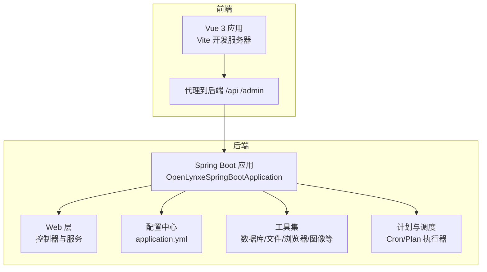
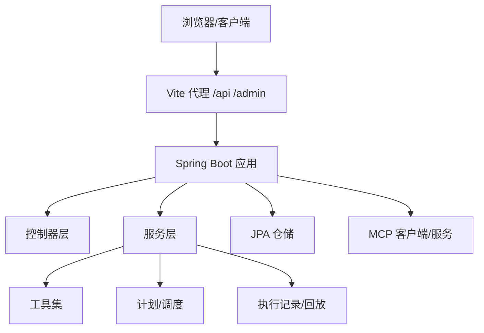
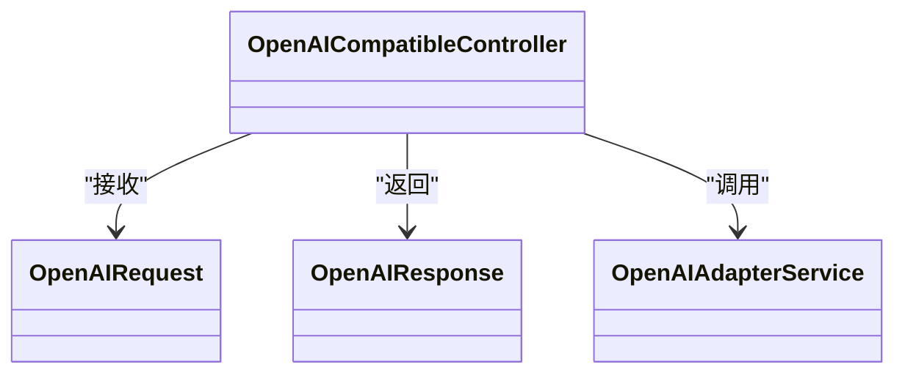
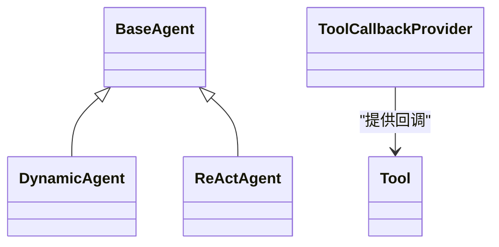
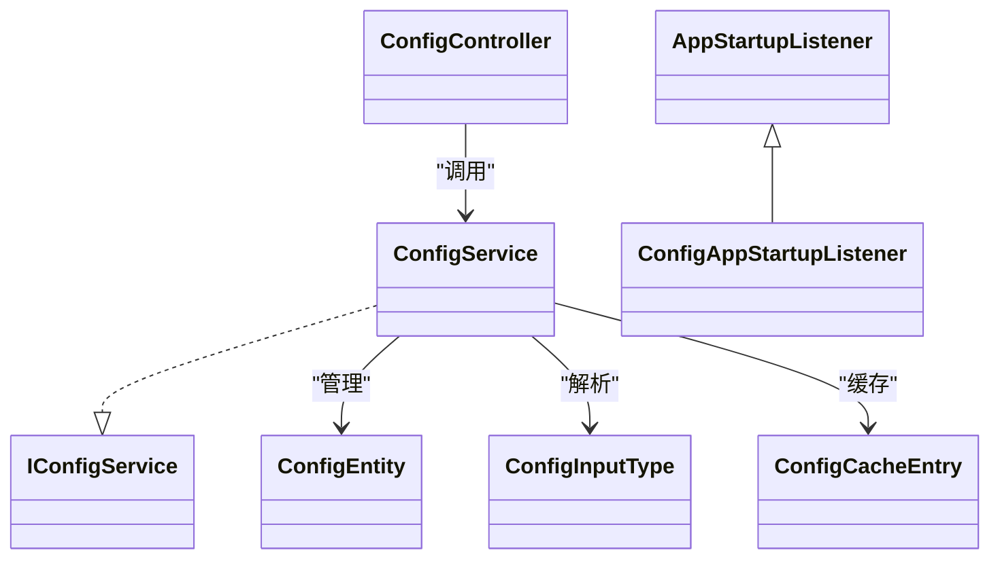
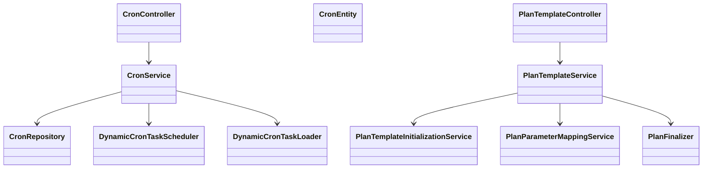
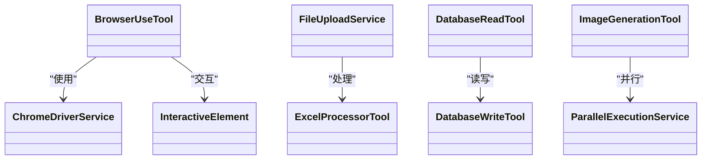
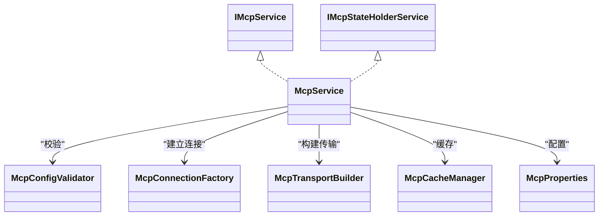
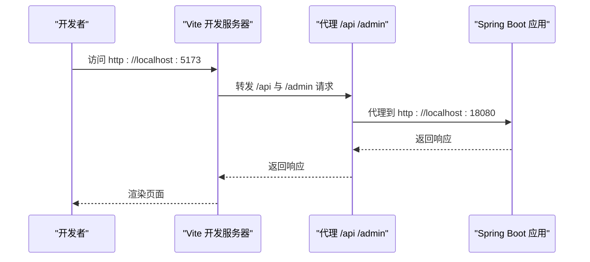
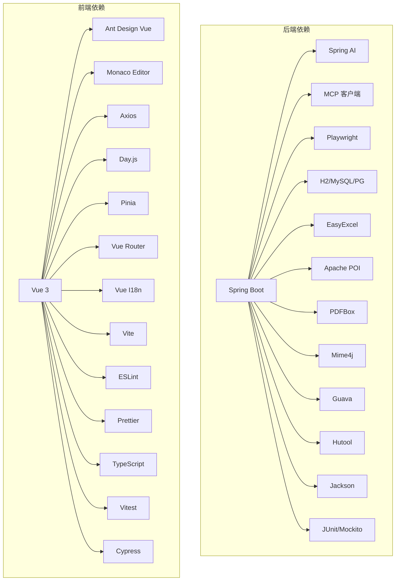

# 开发指南

<cite>
**本文引用的文件**
- [README.md](file://README.md)
- [CONTRIBUTING.md](file://CONTRIBUTING.md)
- [CONTRIBUTING-zh.md](file://CONTRIBUTING-zh.md)
- [CODE_OF_CONDUCT.md](file://CODE_OF_CONDUCT.md)
- [CLA.md](file://CLA.md)
- [pom.xml](file://pom.xml)
- [Makefile](file://Makefile)
- [.github/PULL_REQUEST_TEMPLATE.md](file://.github/PULL_REQUEST_TEMPLATE.md)
- [src/main/resources/application.yml](file://src/main/resources/application.yml)
- [tools/make/common.mk](file://tools/make/common.mk)
- [tools/src/checkstyle/checkstyle.xml](file://tools/src/checkstyle/checkstyle.xml)
- [tools/linter/markdownlint/markdown_lint_config.yaml](file://tools/linter/markdownlint/markdown_lint_config.yaml)
- [tools/linter/yamllint/.yamllint](file://tools/linter/yamllint/.yamllint)
- [ui-vue3/package.json](file://ui-vue3/package.json)
- [ui-vue3/vite.config.ts](file://ui-vue3/vite.config.ts)
- [ui-vue3/eslint.config.js](file://ui-vue3/eslint.config.js)
</cite>

## 目录
1. [简介](#简介)
2. [项目结构](#项目结构)
3. [核心组件](#核心组件)
4. [架构总览](#架构总览)
5. [详细组件分析](#详细组件分析)
6. [依赖关系分析](#依赖关系分析)
7. [性能考虑](#性能考虑)
8. [故障排查指南](#故障排查指南)
9. [结论](#结论)
10. [附录](#附录)

## 简介
本开发指南面向Lynxe项目的贡献者与维护者，系统阐述代码规范、开发流程、提交规范、IDE与环境配置、调试技巧、新功能与Bug修复流程、性能优化、代码审查标准、测试要求、文档更新规范、最佳实践与设计模式、架构演进方向、贡献流程与社区沟通渠道，以及开发工具与效率提升技巧。内容基于仓库中的实际配置与脚本，确保可落地、可复用。

## 项目结构
Lynxe采用前后端分离架构：
- 后端：Spring Boot 3 + Spring WebFlux + JPA，提供多Agent协作、计划调度、MCP集成、模型适配等能力。
- 前端：Vue 3 + Vite，提供配置管理、计划模板、工具选择、文件上传与浏览器自动化等交互界面。
- 工具链：Maven构建、Makefile统一CI入口、Checkstyle、Spotless、ESLint/Prettier、YAML/Markdown Lint等。

图表来源
- [pom.xml:1-556](file://pom.xml#L1-L556)
- [src/main/resources/application.yml:1-97](file://src/main/resources/application.yml#L1-L97)
- [ui-vue3/vite.config.ts:1-71](file://ui-vue3/vite.config.ts#L1-L71)

章节来源
- [pom.xml:1-556](file://pom.xml#L1-L556)
- [src/main/resources/application.yml:1-97](file://src/main/resources/application.yml#L1-L97)
- [ui-vue3/vite.config.ts:1-71](file://ui-vue3/vite.config.ts#L1-L71)

## 核心组件
- 后端核心模块
  - 适配层：OpenAI兼容接口与适配服务，便于接入不同模型供应商。
  - Agent体系：动态Agent、ReActAgent、工具回调提供器等，支持确定性执行与工具调用。
  - 配置中心：启动监听、配置缓存、属性与选项管理，支持多数据源与Profile切换。
  - 计划与调度：动态任务加载、调度器、计划模板与参数映射、异常事件发布。
  - 工具集：浏览器自动化（Playwright）、文件处理（Excel/PDF/Markdown转换）、数据库读写、图片生成、并行执行等。
  - 运行时：文件上传/下载、版本信息、用户输入、计划执行协调器。
  - MCP集成：客户端SDK、连接工厂、传输构建、配置校验与缓存管理。
  - 事件系统：全局事件发布与监听，异常与变更通知。
- 前端核心模块
  - API服务：Admin/Agent/Config/Cron/MCP/Plan/Tool等API封装。
  - 组件库：聊天容器、执行详情、编辑器、文件浏览器、模态框、右侧面板等。
  - 状态管理：Pinia Store（命名空间、记忆、参数历史、侧边栏、任务、模板）。
  - 国际化：中英双语支持与排序工具。
  - 路由与视图：配置页、初始化页、直接对话页、错误页等。

章节来源
- [pom.xml:60-353](file://pom.xml#L60-L353)
- [src/main/resources/application.yml:1-97](file://src/main/resources/application.yml#L1-L97)
- [ui-vue3/package.json:1-100](file://ui-vue3/package.json#L1-L100)

## 架构总览
Lynxe后端采用模块化分层设计，控制器负责HTTP请求，服务层编排业务逻辑，持久层通过JPA访问数据库；前端通过Vite代理转发至后端。MCP作为外部协议桥接，支持与外部工具与服务的无缝集成。

图表来源
- [ui-vue3/vite.config.ts:32-44](file://ui-vue3/vite.config.ts#L32-L44)
- [pom.xml:100-120](file://pom.xml#L100-L120)

章节来源
- [ui-vue3/vite.config.ts:1-71](file://ui-vue3/vite.config.ts#L1-L71)
- [pom.xml:100-120](file://pom.xml#L100-L120)

## 详细组件分析

### 适配层（OpenAI兼容）
- 功能：提供OpenAI兼容的请求/响应模型与适配服务，便于替换不同模型供应商。
- 关键点：请求/响应模型定义、适配服务实现、错误处理与流式响应处理器。

图表来源
- [src/main/java/com/alibaba/cloud/ai/lynxe/adapter/controller/OpenAICompatibleController.java](file://src/main/java/com/alibaba/cloud/ai/lynxe/adapter/controller/OpenAICompatibleController.java)
- [src/main/java/com/alibaba/cloud/ai/lynxe/adapter/model/OpenAIRequest.java](file://src/main/java/com/alibaba/cloud/ai/lynxe/adapter/model/OpenAIRequest.java)
- [src/main/java/com/alibaba/cloud/ai/lynxe/adapter/model/OpenAIResponse.java](file://src/main/java/com/alibaba/cloud/ai/lynxe/adapter/model/OpenAIResponse.java)
- [src/main/java/com/alibaba/cloud/ai/lynxe/adapter/service/OpenAIAdapterService.java](file://src/main/java/com/alibaba/cloud/ai/lynxe/adapter/service/OpenAIAdapterService.java)

章节来源
- [src/main/java/com/alibaba/cloud/ai/lynxe/adapter/controller/OpenAICompatibleController.java](file://src/main/java/com/alibaba/cloud/ai/lynxe/adapter/controller/OpenAICompatibleController.java)
- [src/main/java/com/alibaba/cloud/ai/lynxe/adapter/model/OpenAIRequest.java](file://src/main/java/com/alibaba/cloud/ai/lynxe/adapter/model/OpenAIRequest.java)
- [src/main/java/com/alibaba/cloud/ai/lynxe/adapter/model/OpenAIResponse.java](file://src/main/java/com/alibaba/cloud/ai/lynxe/adapter/model/OpenAIResponse.java)
- [src/main/java/com/alibaba/cloud/ai/lynxe/adapter/service/OpenAIAdapterService.java](file://src/main/java/com/alibaba/cloud/ai/lynxe/adapter/service/OpenAIAdapterService.java)

### Agent体系（动态Agent/ReActAgent）
- 功能：支持动态定义Agent、状态管理、工具回调、确定性执行。
- 关键点：基类抽象、动态Agent实现、ReAct执行流程、工具接口与回调提供器。

图表来源
- [src/main/java/com/alibaba/cloud/ai/lynxe/agent/BaseAgent.java](file://src/main/java/com/alibaba/cloud/ai/lynxe/agent/BaseAgent.java)
- [src/main/java/com/alibaba/cloud/ai/lynxe/agent/DynamicAgent.java](file://src/main/java/com/alibaba/cloud/ai/lynxe/agent/DynamicAgent.java)
- [src/main/java/com/alibaba/cloud/ai/lynxe/agent/ReActAgent.java](file://src/main/java/com/alibaba/cloud/ai/lynxe/agent/ReActAgent.java)
- [src/main/java/com/alibaba/cloud/ai/lynxe/agent/ToolCallbackProvider.java](file://src/main/java/com/alibaba/cloud/ai/lynxe/agent/ToolCallbackProvider.java)
- [src/main/java/com/alibaba/cloud/ai/lynxe/agent/model/Tool.java](file://src/main/java/com/alibaba/cloud/ai/lynxe/agent/model/Tool.java)

章节来源
- [src/main/java/com/alibaba/cloud/ai/lynxe/agent/BaseAgent.java](file://src/main/java/com/alibaba/cloud/ai/lynxe/agent/BaseAgent.java)
- [src/main/java/com/alibaba/cloud/ai/lynxe/agent/DynamicAgent.java](file://src/main/java/com/alibaba/cloud/ai/lynxe/agent/DynamicAgent.java)
- [src/main/java/com/alibaba/cloud/ai/lynxe/agent/ReActAgent.java](file://src/main/java/com/alibaba/cloud/ai/lynxe/agent/ReActAgent.java)
- [src/main/java/com/alibaba/cloud/ai/lynxe/agent/ToolCallbackProvider.java](file://src/main/java/com/alibaba/cloud/ai/lynxe/agent/ToolCallbackProvider.java)
- [src/main/java/com/alibaba/cloud/ai/lynxe/agent/model/Tool.java](file://src/main/java/com/alibaba/cloud/ai/lynxe/agent/model/Tool.java)

### 配置中心（ConfigService/ConfigController）
- 功能：启动监听、配置缓存、属性与选项管理，支持多Profile与数据源。
- 关键点：启动监听器、配置实体与输入类型、缓存条目、控制器与服务。

图表来源
- [src/main/java/com/alibaba/cloud/ai/lynxe/config/ConfigController.java](file://src/main/java/com/alibaba/cloud/ai/lynxe/config/ConfigController.java)
- [src/main/java/com/alibaba/cloud/ai/lynxe/config/ConfigService.java](file://src/main/java/com/alibaba/cloud/ai/lynxe/config/ConfigService.java)
- [src/main/java/com/alibaba/cloud/ai/lynxe/config/IConfigService.java](file://src/main/java/com/alibaba/cloud/ai/lynxe/config/IConfigService.java)
- [src/main/java/com/alibaba/cloud/ai/lynxe/config/entity/ConfigEntity.java](file://src/main/java/com/alibaba/cloud/ai/lynxe/config/entity/ConfigEntity.java)
- [src/main/java/com/alibaba/cloud/ai/lynxe/config/entity/ConfigInputType.java](file://src/main/java/com/alibaba/cloud/ai/lynxe/config/entity/ConfigInputType.java)
- [src/main/java/com/alibaba/cloud/ai/lynxe/config/ConfigCacheEntry.java](file://src/main/java/com/alibaba/cloud/ai/lynxe/config/ConfigCacheEntry.java)
- [src/main/java/com/alibaba/cloud/ai/lynxe/config/startUp/AppStartupListener.java](file://src/main/java/com/alibaba/cloud/ai/lynxe/config/startUp/AppStartupListener.java)
- [src/main/java/com/alibaba/cloud/ai/lynxe/config/startUp/ConfigAppStartupListener.java](file://src/main/java/com/alibaba/cloud/ai/lynxe/config/startUp/ConfigAppStartupListener.java)

章节来源
- [src/main/java/com/alibaba/cloud/ai/lynxe/config/ConfigController.java](file://src/main/java/com/alibaba/cloud/ai/lynxe/config/ConfigController.java)
- [src/main/java/com/alibaba/cloud/ai/lynxe/config/ConfigService.java](file://src/main/java/com/alibaba/cloud/ai/lynxe/config/ConfigService.java)
- [src/main/java/com/alibaba/cloud/ai/lynxe/config/IConfigService.java](file://src/main/java/com/alibaba/cloud/ai/lynxe/config/IConfigService.java)
- [src/main/java/com/alibaba/cloud/ai/lynxe/config/entity/ConfigEntity.java](file://src/main/java/com/alibaba/cloud/ai/lynxe/config/entity/ConfigEntity.java)
- [src/main/java/com/alibaba/cloud/ai/lynxe/config/entity/ConfigInputType.java](file://src/main/java/com/alibaba/cloud/ai/lynxe/config/entity/ConfigInputType.java)
- [src/main/java/com/alibaba/cloud/ai/lynxe/config/ConfigCacheEntry.java](file://src/main/java/com/alibaba/cloud/ai/lynxe/config/ConfigCacheEntry.java)
- [src/main/java/com/alibaba/cloud/ai/lynxe/config/startUp/AppStartupListener.java](file://src/main/java/com/alibaba/cloud/ai/lynxe/config/startUp/AppStartupListener.java)
- [src/main/java/com/alibaba/cloud/ai/lynxe/config/startUp/ConfigAppStartupListener.java](file://src/main/java/com/alibaba/cloud/ai/lynxe/config/startUp/ConfigAppStartupListener.java)

### 计划与调度（Cron/Plan）
- 功能：动态任务加载与调度、计划模板与参数映射、异常事件发布。
- 关键点：任务实体、调度器、服务接口与实现、启动初始化器。

图表来源
- [src/main/java/com/alibaba/cloud/ai/lynxe/cron/controller/CronController.java](file://src/main/java/com/alibaba/cloud/ai/lynxe/cron/controller/CronController.java)
- [src/main/java/com/alibaba/cloud/ai/lynxe/cron/entity/CronEntity.java](file://src/main/java/com/alibaba/cloud/ai/lynxe/cron/entity/CronEntity.java)
- [src/main/java/com/alibaba/cloud/ai/lynxe/cron/repository/CronRepository.java](file://src/main/java/com/alibaba/cloud/ai/lynxe/cron/repository/CronRepository.java)
- [src/main/java/com/alibaba/cloud/ai/lynxe/cron/scheduler/DynamicCronTaskScheduler.java](file://src/main/java/com/alibaba/cloud/ai/lynxe/cron/scheduler/DynamicCronTaskScheduler.java)
- [src/main/java/com/alibaba/cloud/ai/lynxe/cron/scheduler/DynamicCronTaskLoader.java](file://src/main/java/com/alibaba/cloud/ai/lynxe/cron/scheduler/DynamicCronTaskLoader.java)
- [src/main/java/com/alibaba/cloud/ai/lynxe/cron/service/CronService.java](file://src/main/java/com/alibaba/cloud/ai/lynxe/cron/service/CronService.java)
- [src/main/java/com/alibaba/cloud/ai/lynxe/planning/controller/PlanTemplateController.java](file://src/main/java/com/alibaba/cloud/ai/lynxe/planning/controller/PlanTemplateController.java)
- [src/main/java/com/alibaba/cloud/ai/lynxe/planning/service/PlanTemplateService.java](file://src/main/java/com/alibaba/cloud/ai/lynxe/planning/service/PlanTemplateService.java)
- [src/main/java/com/alibaba/cloud/ai/lynxe/planning/service/PlanTemplateInitializationService.java](file://src/main/java/com/alibaba/cloud/ai/lynxe/planning/service/PlanTemplateInitializationService.java)
- [src/main/java/com/alibaba/cloud/ai/lynxe/planning/service/PlanParameterMappingService.java](file://src/main/java/com/alibaba/cloud/ai/lynxe/planning/service/PlanParameterMappingService.java)
- [src/main/java/com/alibaba/cloud/ai/lynxe/planning/service/PlanFinalizer.java](file://src/main/java/com/alibaba/cloud/ai/lynxe/planning/service/PlanFinalizer.java)

章节来源
- [src/main/java/com/alibaba/cloud/ai/lynxe/cron/controller/CronController.java](file://src/main/java/com/alibaba/cloud/ai/lynxe/cron/controller/CronController.java)
- [src/main/java/com/alibaba/cloud/ai/lynxe/cron/entity/CronEntity.java](file://src/main/java/com/alibaba/cloud/ai/lynxe/cron/entity/CronEntity.java)
- [src/main/java/com/alibaba/cloud/ai/lynxe/cron/repository/CronRepository.java](file://src/main/java/com/alibaba/cloud/ai/lynxe/cron/repository/CronRepository.java)
- [src/main/java/com/alibaba/cloud/ai/lynxe/cron/scheduler/DynamicCronTaskScheduler.java](file://src/main/java/com/alibaba/cloud/ai/lynxe/cron/scheduler/DynamicCronTaskScheduler.java)
- [src/main/java/com/alibaba/cloud/ai/lynxe/cron/scheduler/DynamicCronTaskLoader.java](file://src/main/java/com/alibaba/cloud/ai/lynxe/cron/scheduler/DynamicCronTaskLoader.java)
- [src/main/java/com/alibaba/cloud/ai/lynxe/cron/service/CronService.java](file://src/main/java/com/alibaba/cloud/ai/lynxe/cron/service/CronService.java)
- [src/main/java/com/alibaba/cloud/ai/lynxe/planning/controller/PlanTemplateController.java](file://src/main/java/com/alibaba/cloud/ai/lynxe/planning/controller/PlanTemplateController.java)
- [src/main/java/com/alibaba/cloud/ai/lynxe/planning/service/PlanTemplateService.java](file://src/main/java/com/alibaba/cloud/ai/lynxe/planning/service/PlanTemplateService.java)
- [src/main/java/com/alibaba/cloud/ai/lynxe/planning/service/PlanTemplateInitializationService.java](file://src/main/java/com/alibaba/cloud/ai/lynxe/planning/service/PlanTemplateInitializationService.java)
- [src/main/java/com/alibaba/cloud/ai/lynxe/planning/service/PlanParameterMappingService.java](file://src/main/java/com/alibaba/cloud/ai/lynxe/planning/service/PlanParameterMappingService.java)
- [src/main/java/com/alibaba/cloud/ai/lynxe/planning/service/PlanFinalizer.java](file://src/main/java/com/alibaba/cloud/ai/lynxe/planning/service/PlanFinalizer.java)

### 工具集（浏览器/文件/数据库/图像/并行）
- 功能：浏览器自动化（Playwright）、文件处理（Excel/PDF/Markdown转换）、数据库读写、图片生成、并行执行等。
- 关键点：浏览器驱动服务、元素交互、文件上传/下载、数据库元数据与读写、图像生成提供器、并行执行服务。

图表来源
- [src/main/java/com/alibaba/cloud/ai/lynxe/tool/browser/BrowserUseTool.java](file://src/main/java/com/alibaba/cloud/ai/lynxe/tool/browser/BrowserUseTool.java)
- [src/main/java/com/alibaba/cloud/ai/lynxe/tool/browser/ChromeDriverService.java](file://src/main/java/com/alibaba/cloud/ai/lynxe/tool/browser/ChromeDriverService.java)
- [src/main/java/com/alibaba/cloud/ai/lynxe/tool/browser/InteractiveElement.java](file://src/main/java/com/alibaba/cloud/ai/lynxe/tool/browser/InteractiveElement.java)
- [src/main/java/com/alibaba/cloud/ai/lynxe/runtime/service/FileUploadService.java](file://src/main/java/com/alibaba/cloud/ai/lynxe/runtime/service/FileUploadService.java)
- [src/main/java/com/alibaba/cloud/ai/lynxe/tool/database/DatabaseReadTool.java](file://src/main/java/com/alibaba/cloud/ai/lynxe/tool/database/DatabaseReadTool.java)
- [src/main/java/com/alibaba/cloud/ai/lynxe/tool/database/DatabaseWriteTool.java](file://src/main/java/com/alibaba/cloud/ai/lynxe/tool/database/DatabaseWriteTool.java)
- [src/main/java/com/alibaba/cloud/ai/lynxe/tool/image/ImageGenerationTool.java](file://src/main/java/com/alibaba/cloud/ai/lynxe/tool/image/ImageGenerationTool.java)
- [src/main/java/com/alibaba/cloud/ai/lynxe/tool/mapreduce/ParallelExecutionService.java](file://src/main/java/com/alibaba/cloud/ai/lynxe/tool/mapreduce/ParallelExecutionService.java)
- [src/main/java/com/alibaba/cloud/ai/lynxe/tool/excelProcessor/ExcelProcessorTool.java](file://src/main/java/com/alibaba/cloud/ai/lynxe/tool/excelProcessor/ExcelProcessorTool.java)

章节来源
- [src/main/java/com/alibaba/cloud/ai/lynxe/tool/browser/BrowserUseTool.java](file://src/main/java/com/alibaba/cloud/ai/lynxe/tool/browser/BrowserUseTool.java)
- [src/main/java/com/alibaba/cloud/ai/lynxe/tool/browser/ChromeDriverService.java](file://src/main/java/com/alibaba/cloud/ai/lynxe/tool/browser/ChromeDriverService.java)
- [src/main/java/com/alibaba/cloud/ai/lynxe/tool/browser/InteractiveElement.java](file://src/main/java/com/alibaba/cloud/ai/lynxe/tool/browser/InteractiveElement.java)
- [src/main/java/com/alibaba/cloud/ai/lynxe/runtime/service/FileUploadService.java](file://src/main/java/com/alibaba/cloud/ai/lynxe/runtime/service/FileUploadService.java)
- [src/main/java/com/alibaba/cloud/ai/lynxe/tool/database/DatabaseReadTool.java](file://src/main/java/com/alibaba/cloud/ai/lynxe/tool/database/DatabaseReadTool.java)
- [src/main/java/com/alibaba/cloud/ai/lynxe/tool/database/DatabaseWriteTool.java](file://src/main/java/com/alibaba/cloud/ai/lynxe/tool/database/DatabaseWriteTool.java)
- [src/main/java/com/alibaba/cloud/ai/lynxe/tool/image/ImageGenerationTool.java](file://src/main/java/com/alibaba/cloud/ai/lynxe/tool/image/ImageGenerationTool.java)
- [src/main/java/com/alibaba/cloud/ai/lynxe/tool/mapreduce/ParallelExecutionService.java](file://src/main/java/com/alibaba/cloud/ai/lynxe/tool/mapreduce/ParallelExecutionService.java)
- [src/main/java/com/alibaba/cloud/ai/lynxe/tool/excelProcessor/ExcelProcessorTool.java](file://src/main/java/com/alibaba/cloud/ai/lynxe/tool/excelProcessor/ExcelProcessorTool.java)

### MCP集成（客户端/服务）
- 功能：MCP客户端SDK、连接工厂、传输构建、配置校验与缓存管理。
- 关键点：IMcpService/IMcpStateHolderService、McpConfigValidator、McpConnectionFactory、McpTransportBuilder、McpCacheManager。

图表来源
- [src/main/java/com/alibaba/cloud/ai/lynxe/mcp/service/IMcpService.java](file://src/main/java/com/alibaba/cloud/ai/lynxe/mcp/service/IMcpService.java)
- [src/main/java/com/alibaba/cloud/ai/lynxe/mcp/service/IMcpStateHolderService.java](file://src/main/java/com/alibaba/cloud/ai/lynxe/mcp/service/IMcpStateHolderService.java)
- [src/main/java/com/alibaba/cloud/ai/lynxe/mcp/service/McpService.java](file://src/main/java/com/alibaba/cloud/ai/lynxe/mcp/service/McpService.java)
- [src/main/java/com/alibaba/cloud/ai/lynxe/mcp/config/McpProperties.java](file://src/main/java/com/alibaba/cloud/ai/lynxe/mcp/config/McpProperties.java)
- [src/main/java/com/alibaba/cloud/ai/lynxe/mcp/service/McpConfigValidator.java](file://src/main/java/com/alibaba/cloud/ai/lynxe/mcp/service/McpConfigValidator.java)
- [src/main/java/com/alibaba/cloud/ai/lynxe/mcp/service/McpConnectionFactory.java](file://src/main/java/com/alibaba/cloud/ai/lynxe/mcp/service/McpConnectionFactory.java)
- [src/main/java/com/alibaba/cloud/ai/lynxe/mcp/service/McpTransportBuilder.java](file://src/main/java/com/alibaba/cloud/ai/lynxe/mcp/service/McpTransportBuilder.java)
- [src/main/java/com/alibaba/cloud/ai/lynxe/mcp/service/McpCacheManager.java](file://src/main/java/com/alibaba/cloud/ai/lynxe/mcp/service/McpCacheManager.java)

章节来源
- [src/main/java/com/alibaba/cloud/ai/lynxe/mcp/service/IMcpService.java](file://src/main/java/com/alibaba/cloud/ai/lynxe/mcp/service/IMcpService.java)
- [src/main/java/com/alibaba/cloud/ai/lynxe/mcp/service/IMcpStateHolderService.java](file://src/main/java/com/alibaba/cloud/ai/lynxe/mcp/service/IMcpStateHolderService.java)
- [src/main/java/com/alibaba/cloud/ai/lynxe/mcp/service/McpService.java](file://src/main/java/com/alibaba/cloud/ai/lynxe/mcp/service/McpService.java)
- [src/main/java/com/alibaba/cloud/ai/lynxe/mcp/config/McpProperties.java](file://src/main/java/com/alibaba/cloud/ai/lynxe/mcp/config/McpProperties.java)
- [src/main/java/com/alibaba/cloud/ai/lynxe/mcp/service/McpConfigValidator.java](file://src/main/java/com/alibaba/cloud/ai/lynxe/mcp/service/McpConfigValidator.java)
- [src/main/java/com/alibaba/cloud/ai/lynxe/mcp/service/McpConnectionFactory.java](file://src/main/java/com/alibaba/cloud/ai/lynxe/mcp/service/McpConnectionFactory.java)
- [src/main/java/com/alibaba/cloud/ai/lynxe/mcp/service/McpTransportBuilder.java](file://src/main/java/com/alibaba/cloud/ai/lynxe/mcp/service/McpTransportBuilder.java)
- [src/main/java/com/alibaba/cloud/ai/lynxe/mcp/service/McpCacheManager.java](file://src/main/java/com/alibaba/cloud/ai/lynxe/mcp/service/McpCacheManager.java)

### 前端开发（Vue 3 + Vite）
- 功能：配置管理、计划模板、工具选择、文件上传与浏览器自动化等交互界面。
- 关键点：代理配置、TypeScript检查、ESLint规则、Prettier格式化、单元测试与E2E测试。

图表来源
- [ui-vue3/vite.config.ts:32-44](file://ui-vue3/vite.config.ts#L32-L44)
- [src/main/resources/application.yml:1-97](file://src/main/resources/application.yml#L1-L97)

章节来源
- [ui-vue3/vite.config.ts:1-71](file://ui-vue3/vite.config.ts#L1-L71)
- [ui-vue3/package.json:1-100](file://ui-vue3/package.json#L1-L100)
- [ui-vue3/eslint.config.js:1-160](file://ui-vue3/eslint.config.js#L1-L160)

## 依赖关系分析
- 后端依赖
  - Spring Boot Starter Web/WebFlux/JPA
  - Spring AI OpenAI/MCP客户端
  - Playwright、WebDriverManager
  - H2/MySQL/PostgreSQL
  - EasyExcel、Apache POI、PDFBox、Mime4j
  - Guava、Hutool、Gson、Jackson
  - JUnit/Mockito
- 前端依赖
  - Vue 3、Ant Design Vue、Monaco Editor、Axios、Day.js、Pinia、Vue Router、Vue I18n
  - Vite、ESLint、Prettier、TypeScript、Vitest/Cypress

图表来源
- [pom.xml:60-353](file://pom.xml#L60-L353)
- [ui-vue3/package.json:28-81](file://ui-vue3/package.json#L28-L81)

章节来源
- [pom.xml:60-353](file://pom.xml#L60-L353)
- [ui-vue3/package.json:1-100](file://ui-vue3/package.json#L1-L100)

## 性能考虑
- 数据库连接池与超时：Hikari连接池参数（最大池大小、空闲超时、最大生命周期、泄漏检测阈值）与JPA配置（禁用Open Session In View）有助于避免性能瓶颈。
- 文件上传：限制单次上传文件数量与大小，合理设置阈值与存储目录，避免内存压力。
- 计划轮询：指数退避与最大尝试次数、连接与读取超时，平衡可靠性与资源消耗。
- 日志级别：生产环境降低日志级别，避免I/O开销。
- 前端构建：开启Source Map便于定位问题，同时注意生产环境体积与加载时间。

章节来源
- [src/main/resources/application.yml:1-97](file://src/main/resources/application.yml#L1-L97)

## 故障排查指南
- 启动失败
  - 检查数据库连接与JPA DDL配置，确认Profile激活与数据源URL/凭据正确。
  - 查看日志文件路径与日志级别，定位异常堆栈。
- 文件上传异常
  - 核对上传目录、文件类型验证策略与大小限制，确认权限与磁盘空间。
- 计划执行卡顿
  - 检查轮询配置、超时参数与指数退避策略，必要时调整并发与重试。
- 前端无法访问后端
  - 确认Vite代理配置指向正确端口，后端端口与跨域策略。
- 本地CI检查
  - 使用Makefile提供的统一入口执行检查，确保格式化、静态检查与测试通过。

章节来源
- [src/main/resources/application.yml:1-97](file://src/main/resources/application.yml#L1-L97)
- [ui-vue3/vite.config.ts:32-44](file://ui-vue3/vite.config.ts#L32-L44)
- [Makefile:1-30](file://Makefile#L1-L30)

## 结论
本指南基于Lynxe仓库的实际配置与脚本，提供了从环境搭建、开发流程、代码规范、测试与审查、性能优化到社区贡献的全流程指导。建议团队在日常开发中严格遵循Makefile与各类Linter配置，保持前后端一致的开发体验与质量标准。

## 附录

### 开发环境搭建与IDE配置
- 后端
  - JDK 17+、Maven、Spring Boot 3、数据库（H2/MySQL/PostgreSQL任选其一）
  - 推荐插件：Checkstyle、Spotless、Spring JavaFormat
- 前端
  - Node.js 16+、包管理器（如pnpm）、Vite、TypeScript、ESLint、Prettier
  - 推荐插件：Vue Language Features、ESLint、Prettier

章节来源
- [pom.xml:20-40](file://pom.xml#L20-L40)
- [ui-vue3/package.json:82-85](file://ui-vue3/package.json#L82-L85)

### 代码规范与格式化
- Java
  - Checkstyle规则：导入检查、未使用导入、行尾换行等
  - Spotless移除未使用导入
  - Spring JavaFormat统一缩进与长度
- 前端
  - ESLint规则：禁用console/debugger、未使用变量、Vue属性等
  - Prettier统一格式
  - Markdown/YAML Lint规则：行长度、尾随空格、缩进等

章节来源
- [tools/src/checkstyle/checkstyle.xml:102-120](file://tools/src/checkstyle/checkstyle.xml#L102-L120)
- [tools/linter/markdownlint/markdown_lint_config.yaml:16-44](file://tools/linter/markdownlint/markdown_lint_config.yaml#L16-L44)
- [tools/linter/yamllint/.yamllint:30-78](file://tools/linter/yamllint/.yamllint#L30-L78)
- [ui-vue3/eslint.config.js:67-126](file://ui-vue3/eslint.config.js#L67-L126)

### 提交与审查流程
- Fork仓库、配置Git身份、同步上游主干
- 开发前执行本地CI检查（Makefile）、Checkstyle、Spotless
- 提交信息遵循约定式提交（feat/fix/docs/style/refactor/test/chore）
- 提交PR并填写模板，等待CLA检查、CI通过与代码审查

章节来源
- [CONTRIBUTING.md:43-121](file://CONTRIBUTING.md#L43-L121)
- [CONTRIBUTING-zh.md:44-121](file://CONTRIBUTING-zh.md#L44-L121)
- [CLA.md:1-70](file://CLA.md#L1-L70)
- [.github/PULL_REQUEST_TEMPLATE.md:1-16](file://.github/PULL_REQUEST_TEMPLATE.md#L1-L16)

### 测试要求
- 单元测试：JUnit 5 + Mockito
- 前端测试：Vitest（单元）、Cypress（E2E）
- 建议在提交前运行类型检查、ESLint检查与单元测试

章节来源
- [pom.xml:309-335](file://pom.xml#L309-L335)
- [ui-vue3/package.json:10-16](file://ui-vue3/package.json#L10-L16)

### 文档更新规范
- README/开发文档与变更同步
- API变更需更新前端API服务与类型定义
- Markdown/YAML遵循Linter规则

章节来源
- [README.md:224-276](file://README.md#L224-L276)
- [tools/linter/markdownlint/markdown_lint_config.yaml:16-44](file://tools/linter/markdownlint/markdown_lint_config.yaml#L16-L44)
- [tools/linter/yamllint/.yamllint:30-78](file://tools/linter/yamllint/.yamllint#L30-L78)

### 开发最佳实践与设计模式
- 分层架构：控制器/服务/仓储清晰职责边界
- 领域驱动：实体与仓储分离、参数映射与初始化服务解耦
- 异常与事件：统一异常处理与事件发布机制
- 并发与限流：Hikari连接池与计划轮询退避策略
- 前后端分离：Vite代理、TypeScript强类型、组件化UI

章节来源
- [src/main/resources/application.yml:1-97](file://src/main/resources/application.yml#L1-L97)
- [ui-vue3/vite.config.ts:32-44](file://ui-vue3/vite.config.ts#L32-L44)

### 架构演进指导
- 模块化扩展：新增工具/计划模板/配置项时，遵循现有分层与接口契约
- MCP生态：持续完善MCP客户端与缓存策略，增强外部服务集成能力
- 前端工程化：保持Vite配置与ESLint/Prettier一致性，逐步引入更多自动化检查

章节来源
- [pom.xml:100-120](file://pom.xml#L100-L120)
- [ui-vue3/vite.config.ts:1-71](file://ui-vue3/vite.config.ts#L1-L71)

### 贡献流程与社区参与
- 通过Issue/PR参与，签署CLA，遵循行为准则
- 加入钉钉群讨论，关注项目Board与标签（good first issue/help wanted）

章节来源
- [CONTRIBUTING.md:9-138](file://CONTRIBUTING.md#L9-L138)
- [CONTRIBUTING-zh.md:9-140](file://CONTRIBUTING-zh.md#L9-L140)
- [CODE_OF_CONDUCT.md:1-30](file://CODE_OF_CONDUCT.md#L1-L30)
- [README.md:263-276](file://README.md#L263-L276)

### 开发工具与效率提升
- Makefile统一CI入口，一键执行格式化、检查与打包
- IDE集成Checkstyle/Spotless/ESLint/Prettier
- 前端Vite热更新、代理与类型检查，提升开发体验

章节来源
- [Makefile:1-30](file://Makefile#L1-L30)
- [tools/make/common.mk:30-35](file://tools/make/common.mk#L30-L35)
- [ui-vue3/vite.config.ts:49-62](file://ui-vue3/vite.config.ts#L49-L62)