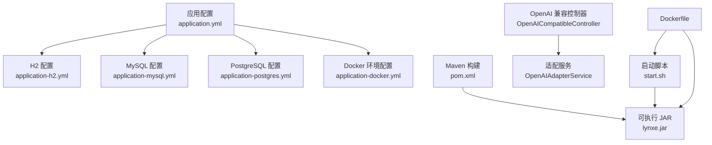
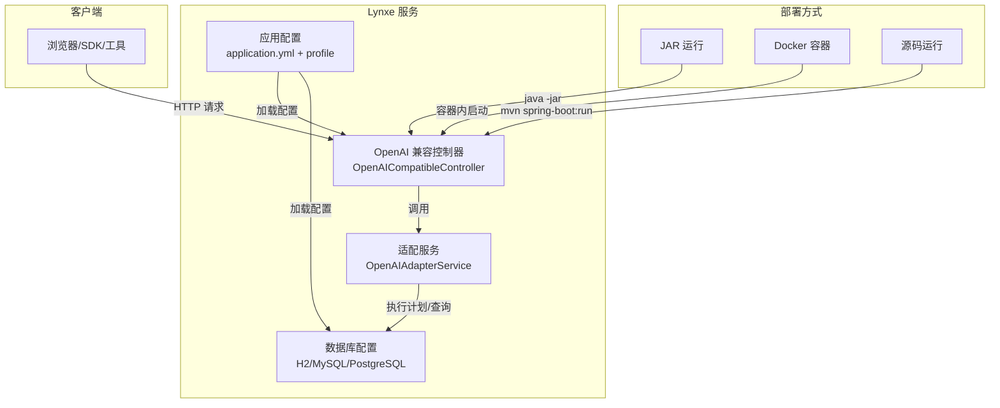
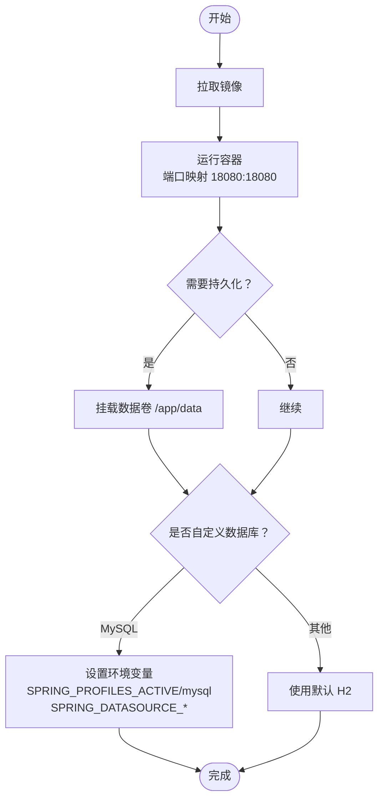
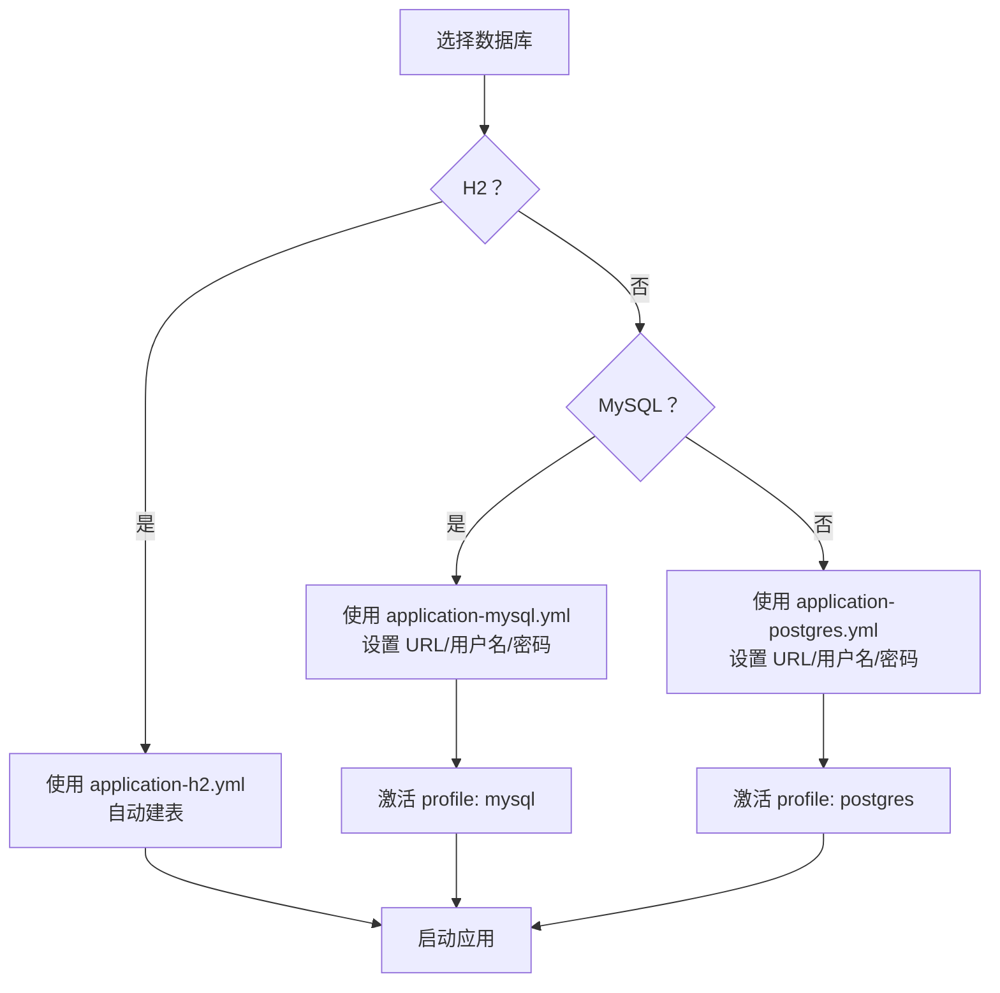
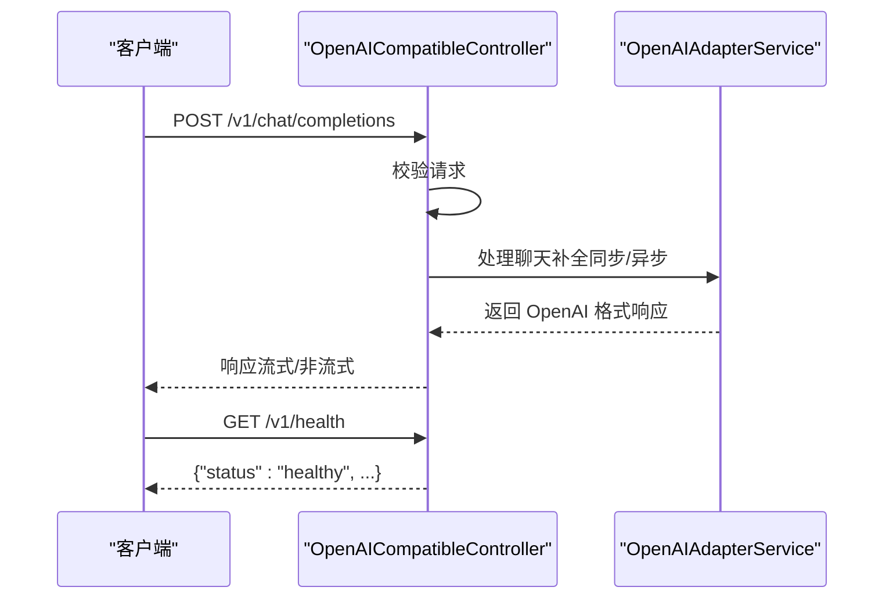
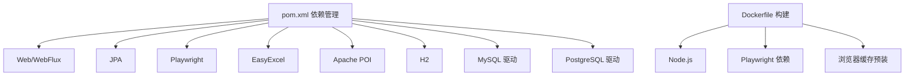

# 快速开始

<cite>
**本文引用的文件**
- [README.md](file://README.md)
- [Dockerfile](file://deploy/Dockerfile)
- [start.sh](file://deploy/start.sh)
- [application.yml](file://src/main/resources/application.yml)
- [application-docker.yml](file://src/main/resources/application-docker.yml)
- [application-h2.yml](file://src/main/resources/application-h2.yml)
- [application-mysql.yml](file://src/main/resources/application-mysql.yml)
- [application-postgres.yml](file://src/main/resources/application-postgres.yml)
- [pom.xml](file://pom.xml)
- [OpenAICompatibleController.java](file://src/main/java/com/alibaba/cloud/ai/lynxe/adapter/controller/OpenAICompatibleController.java)
- [OpenAIAdapterService.java](file://src/main/java/com/alibaba/cloud/ai/lynxe/adapter/service/OpenAIAdapterService.java)
- [PlanException.java](file://src/main/java/com/alibaba/cloud/ai/lynxe/exception/PlanException.java)
</cite>

## 目录
1. [简介](#简介)
2. [项目结构](#项目结构)
3. [核心组件](#核心组件)
4. [架构总览](#架构总览)
5. [详细组件分析](#详细组件分析)
6. [依赖分析](#依赖分析)
7. [性能考虑](#性能考虑)
8. [故障排除指南](#故障排除指南)
9. [结论](#结论)
10. [附录](#附录)

## 简介
本指南面向初学者与进阶用户，提供 Lynxe 的三种部署方式与完整上手流程：GitHub Release 下载运行、Docker 容器化部署、从源码运行。同时涵盖 DashScope API 密钥获取与配置、数据库选择（H2/MySQL/PostgreSQL）的配置说明，并提供 Docker 高级配置（数据持久化、环境变量等）。文末附常见问题排查与故障排除建议。

## 项目结构
Lynxe 是基于 Spring Boot 3.x 与 Spring AI Alibaba 的多智能体协作平台，支持 OpenAI 兼容接口、MCP 协议集成、浏览器自动化与多种数据库后端。核心资源与部署相关文件分布如下：
- 部署与容器化：deploy/Dockerfile、deploy/start.sh
- 应用配置：src/main/resources/application.yml 及其 profile 配置（application-h2.yml、application-mysql.yml、application-postgres.yml、application-docker.yml）
- 启动入口：OpenLynxeSpringBootApplication（由 pom.xml 中 spring-boot-maven-plugin 指定）
- OpenAI 兼容接口：adapter/controller 与 adapter/service
- 异常体系：exception/PlanException

**图表来源**
- [application.yml:1-97](file://src/main/resources/application.yml#L1-L97)
- [application-h2.yml:1-23](file://src/main/resources/application-h2.yml#L1-L23)
- [application-mysql.yml:1-15](file://src/main/resources/application-mysql.yml#L1-L15)
- [application-postgres.yml:1-15](file://src/main/resources/application-postgres.yml#L1-L15)
- [application-docker.yml:1-20](file://src/main/resources/application-docker.yml#L1-L20)
- [Dockerfile:1-138](file://deploy/Dockerfile#L1-L138)
- [start.sh:1-91](file://deploy/start.sh#L1-L91)
- [OpenAICompatibleController.java:1-357](file://src/main/java/com/alibaba/cloud/ai/lynxe/adapter/controller/OpenAICompatibleController.java#L1-L357)
- [OpenAIAdapterService.java:1-560](file://src/main/java/com/alibaba/cloud/ai/lynxe/adapter/service/OpenAIAdapterService.java#L1-L560)
- [pom.xml:496-512](file://pom.xml#L496-L512)

**章节来源**
- [README.md:49-217](file://README.md#L49-L217)
- [application.yml:1-97](file://src/main/resources/application.yml#L1-L97)
- [application-h2.yml:1-23](file://src/main/resources/application-h2.yml#L1-L23)
- [application-mysql.yml:1-15](file://src/main/resources/application-mysql.yml#L1-L15)
- [application-postgres.yml:1-15](file://src/main/resources/application-postgres.yml#L1-L15)
- [application-docker.yml:1-20](file://src/main/resources/application-docker.yml#L1-L20)
- [Dockerfile:1-138](file://deploy/Dockerfile#L1-L138)
- [start.sh:1-91](file://deploy/start.sh#L1-L91)
- [pom.xml:496-512](file://pom.xml#L496-L512)

## 核心组件
- OpenAI 兼容接口：提供 /v1/chat/completions 与 /v1/models、/v1/health 等端点，支持流式与非流式响应。
- 适配服务：负责将 OpenAI 请求转换为 Lynxe 执行上下文并返回 OpenAI 格式的响应。
- 数据库配置：默认使用 H2，亦支持 MySQL 与 PostgreSQL；通过 Spring Profiles 切换。
- Docker 配置：多阶段构建、Playwright 浏览器初始化、无头模式与日志目录挂载。
- 启动入口：Maven 插件打包生成可执行 JAR，Dockerfile 与启动脚本均指向主类。

**章节来源**
- [OpenAICompatibleController.java:85-298](file://src/main/java/com/alibaba/cloud/ai/lynxe/adapter/controller/OpenAICompatibleController.java#L85-L298)
- [OpenAIAdapterService.java:66-135](file://src/main/java/com/alibaba/cloud/ai/lynxe/adapter/service/OpenAIAdapterService.java#L66-L135)
- [application.yml:1-97](file://src/main/resources/application.yml#L1-L97)
- [application-h2.yml:1-23](file://src/main/resources/application-h2.yml#L1-L23)
- [application-mysql.yml:1-15](file://src/main/resources/application-mysql.yml#L1-L15)
- [application-postgres.yml:1-15](file://src/main/resources/application-postgres.yml#L1-L15)
- [Dockerfile:89-124](file://deploy/Dockerfile#L89-L124)
- [start.sh:89-91](file://deploy/start.sh#L89-L91)
- [pom.xml:496-512](file://pom.xml#L496-L512)

## 架构总览
下图展示 Lynxe 的部署与访问路径，以及 OpenAI 兼容接口在系统中的位置。

**图表来源**
- [OpenAICompatibleController.java:85-298](file://src/main/java/com/alibaba/cloud/ai/lynxe/adapter/controller/OpenAICompatibleController.java#L85-L298)
- [OpenAIAdapterService.java:66-135](file://src/main/java/com/alibaba/cloud/ai/lynxe/adapter/service/OpenAIAdapterService.java#L66-L135)
- [application.yml:1-97](file://src/main/resources/application.yml#L1-L97)
- [application-h2.yml:1-23](file://src/main/resources/application-h2.yml#L1-L23)
- [application-mysql.yml:1-15](file://src/main/resources/application-mysql.yml#L1-L15)
- [application-postgres.yml:1-15](file://src/main/resources/application-postgres.yml#L1-L15)
- [Dockerfile:89-124](file://deploy/Dockerfile#L89-L124)
- [start.sh:89-91](file://deploy/start.sh#L89-L91)
- [pom.xml:496-512](file://pom.xml#L496-L512)

## 详细组件分析

### 部署方式一：GitHub Release 下载运行
- 前置条件
  - 操作系统：任意支持 Java 17+ 的平台
  - 网络：可访问 GitHub Releases 页面或使用 wget/curl
- 步骤
  - 下载最新 JAR：参考 [README.md:62-71](file://README.md#L62-L71)
  - 运行 JAR：参考 [README.md:69-71](file://README.md#L69-L71)
- 验证
  - 浏览器访问 http://localhost:18080
  - 首次启动将进入引导设置，按提示输入 DashScope API Key
- 注意事项
  - 默认使用 H2 内嵌数据库，无需额外安装数据库
  - 如需切换数据库，请参考“数据库配置”小节

**章节来源**
- [README.md:58-81](file://README.md#L58-L81)

### 部署方式二：Docker 容器化部署
- 前置条件
  - 已安装 Docker
  - 网络：可拉取 ghcr.io/spring-ai-alibaba/lynxe:v4.7.0 镜像
- 步骤
  - 拉取镜像与运行：参考 [README.md:89-98](file://README.md#L89-L98)
  - 数据持久化（推荐生产）：参考 [README.md:104-114](file://README.md#L104-L114)
  - 自定义环境变量（如 MySQL）：参考 [README.md:118-127](file://README.md#L118-L127)
- 验证
  - 浏览器访问 http://localhost:18080
  - 首次启动将进入引导设置，按提示输入 DashScope API Key
- Docker 高级配置
  - 环境变量示例（MySQL）：SPRING_PROFILES_ACTIVE、SPRING_DATASOURCE_URL、SPRING_DATASOURCE_USERNAME、SPRING_DATASOURCE_PASSWORD
  - 数据卷挂载：/app/data（用于持久化）
  - 日志目录：/app/logs（容器内）
  - 无头浏览器：application-docker.yml 已开启 headless 模式
- Dockerfile 关键点
  - 多阶段构建，安装 Node.js 与 Playwright 依赖
  - playwright-init 初始化浏览器缓存
  - 启动脚本 start.sh 设置环境变量并以指定 profile 启动

**图表来源**
- [README.md:89-127](file://README.md#L89-L127)
- [Dockerfile:32-109](file://deploy/Dockerfile#L32-L109)
- [application-docker.yml:1-20](file://src/main/resources/application-docker.yml#L1-L20)
- [start.sh:70-91](file://deploy/start.sh#L70-L91)

**章节来源**
- [README.md:85-151](file://README.md#L85-L151)
- [Dockerfile:1-138](file://deploy/Dockerfile#L1-L138)
- [application-docker.yml:1-20](file://src/main/resources/application-docker.yml#L1-L20)
- [start.sh:1-91](file://deploy/start.sh#L1-L91)

### 部署方式三：从源码运行
- 前置条件
  - JDK 17+
  - Maven
  - 可选：DashScope API Key（可在首次引导中配置）
- 步骤
  - 克隆仓库并进入目录：参考 [README.md:159-162](file://README.md#L159-L162)
  - 数据库配置（可选）：参考 [README.md:174-196](file://README.md#L174-L196)
  - 启动应用：Unix/macOS 使用 ../mvnw spring-boot:run；Windows 使用 ../mvnw.cmd spring-boot:run：参考 [README.md:203-211](file://README.md#L203-L211)
- 验证
  - 浏览器访问 http://localhost:18080
  - 首次启动将进入引导设置，按提示输入 DashScope API Key
- Maven 构建
  - 主类由 spring-boot-maven-plugin 指定：参考 [pom.xml:496-512](file://pom.xml#L496-L512)

**章节来源**
- [README.md:155-217](file://README.md#L155-L217)
- [pom.xml:496-512](file://pom.xml#L496-L512)

### DashScope API 密钥获取与配置
- 获取方式
  - 登录阿里云控制台 DashScope 页面获取免费 API Key：参考 [README.md:166-168](file://README.md#L166-L168)
- 配置位置
  - 首次启动引导设置页面会要求输入 DashScope API Key
  - 若需直接配置，可在应用配置中设置对应模型提供商参数（application.yml 及其 profile）

**章节来源**
- [README.md:55-81](file://README.md#L55-L81)
- [README.md:166-168](file://README.md#L166-L168)

### 数据库选择与配置
- 支持数据库
  - H2（默认）、MySQL、PostgreSQL
- 配置要点
  - application.yml 激活默认 profile（如 h2），并在各 profile 配置文件中设置数据源与方言
  - H2：内置文件型数据库，自动建表（ddl-auto: update）
  - MySQL/PostgreSQL：在对应 profile 中设置连接信息与方言
  - Docker 环境：application-docker.yml 已优化日志级别与浏览器行为
- 切换方式
  - 在 application.yml 中修改 spring.profiles.active 为 mysql 或 postgres
  - 或在 Docker 运行时通过环境变量 SPRING_PROFILES_ACTIVE 指定

**图表来源**
- [application.yml:6-7](file://src/main/resources/application.yml#L6-L7)
- [application-h2.yml:1-23](file://src/main/resources/application-h2.yml#L1-L23)
- [application-mysql.yml:1-15](file://src/main/resources/application-mysql.yml#L1-L15)
- [application-postgres.yml:1-15](file://src/main/resources/application-postgres.yml#L1-L15)
- [application-docker.yml:1-20](file://src/main/resources/application-docker.yml#L1-L20)

**章节来源**
- [README.md:170-197](file://README.md#L170-L197)
- [application.yml:6-7](file://src/main/resources/application.yml#L6-L7)
- [application-h2.yml:1-23](file://src/main/resources/application-h2.yml#L1-L23)
- [application-mysql.yml:1-15](file://src/main/resources/application-mysql.yml#L1-L15)
- [application-postgres.yml:1-15](file://src/main/resources/application-postgres.yml#L1-L15)
- [application-docker.yml:1-20](file://src/main/resources/application-docker.yml#L1-L20)

### OpenAI 兼容接口与健康检查
- 接口说明
  - /v1/chat/completions：支持流式与非流式响应
  - /v1/models：列出可用模型
  - /v1/health：健康检查
- 控制器与服务
  - 控制器负责请求校验、分发与格式化响应
  - 适配服务负责将请求转换为执行上下文并返回 OpenAI 格式结果
- 健康检查
  - 通过 /v1/health 返回服务状态与模型标识

**图表来源**
- [OpenAICompatibleController.java:85-298](file://src/main/java/com/alibaba/cloud/ai/lynxe/adapter/controller/OpenAICompatibleController.java#L85-L298)
- [OpenAIAdapterService.java:66-135](file://src/main/java/com/alibaba/cloud/ai/lynxe/adapter/service/OpenAIAdapterService.java#L66-L135)

**章节来源**
- [OpenAICompatibleController.java:85-298](file://src/main/java/com/alibaba/cloud/ai/lynxe/adapter/controller/OpenAICompatibleController.java#L85-L298)
- [OpenAIAdapterService.java:66-135](file://src/main/java/com/alibaba/cloud/ai/lynxe/adapter/service/OpenAIAdapterService.java#L66-L135)

## 依赖分析
- 运行时依赖
  - Spring Boot Starter Web/WebFlux、JPA、Playwright、EasyExcel、Apache POI、H2/MySQL/PG 驱动等
- 构建与打包
  - Maven 插件生成可执行 JAR，主类为 OpenLynxeSpringBootApplication
- Docker 构建
  - 多阶段构建，安装 Node.js 与 Playwright 依赖，预装浏览器缓存，设置 JAVA_OPTS 与容器环境变量

**图表来源**
- [pom.xml:60-353](file://pom.xml#L60-L353)
- [Dockerfile:32-109](file://deploy/Dockerfile#L32-L109)

**章节来源**
- [pom.xml:60-353](file://pom.xml#L60-L353)
- [Dockerfile:32-109](file://deploy/Dockerfile#L32-L109)

## 性能考虑
- JVM 参数
  - Dockerfile 中设置了 JAVA_OPTS，包含 G1GC、容器支持、Netty 优化等参数，有助于容器化环境下的内存与网络性能
- 日志与 SQL 输出
  - Docker 环境已关闭 SQL 格式化以提升性能
- 并发与连接池
  - application.yml 中配置了 Hikari 连接池参数，可根据实际负载调整

**章节来源**
- [Dockerfile:115-119](file://deploy/Dockerfile#L115-L119)
- [application-docker.yml:11-15](file://src/main/resources/application-docker.yml#L11-L15)
- [application.yml:19-30](file://src/main/resources/application.yml#L19-L30)

## 故障排除指南
- 无法访问 http://localhost:18080
  - 检查端口占用与防火墙设置
  - Docker 环境确认端口映射是否正确（-p 18080:18080）
- 首次引导未出现 DashScope API Key 输入页
  - 确认应用已完全启动后再访问
  - 查看容器日志：docker logs -f <container>
- 数据库连接失败（MySQL/PostgreSQL）
  - 确认 SPRING_DATASOURCE_URL/USERNAME/PASSWORD 是否正确
  - 确认目标数据库服务可达且允许来自容器的连接
- 浏览器自动化异常
  - Docker 环境默认无头模式，若需调试可临时关闭 headless
  - 确认 Playwright 浏览器缓存已初始化（容器启动时自动执行 playwright-init）
- 健康检查失败
  - 访问 /v1/health 确认返回 healthy
  - 若返回错误，查看控制器日志定位问题

**章节来源**
- [README.md:135-149](file://README.md#L135-L149)
- [application-docker.yml:4-8](file://src/main/resources/application-docker.yml#L4-L8)
- [Dockerfile:92-109](file://deploy/Dockerfile#L92-L109)
- [OpenAICompatibleController.java:293-298](file://src/main/java/com/alibaba/cloud/ai/lynxe/adapter/controller/OpenAICompatibleController.java#L293-L298)

## 结论
通过本指南，您可以快速完成 Lynxe 的三种部署方式，并根据需要选择数据库后端与容器化方案。建议在生产环境中优先采用 Docker 方式并结合数据持久化与环境变量进行配置管理。遇到问题时，可依据故障排除章节逐步定位与解决。

## 附录
- 快速命令索引
  - 下载 JAR：参考 [README.md:62-71](file://README.md#L62-L71)
  - 运行 JAR：参考 [README.md:69-71](file://README.md#L69-L71)
  - 拉取与运行 Docker：参考 [README.md:89-98](file://README.md#L89-L98)
  - 数据持久化：参考 [README.md:104-114](file://README.md#L104-L114)
  - 自定义数据库：参考 [README.md:118-127](file://README.md#L118-L127)
  - 源码运行：参考 [README.md:203-211](file://README.md#L203-L211)
- 异常类型参考
  - 计划执行异常：PlanException（位于 exception 包）

**章节来源**
- [README.md:62-211](file://README.md#L62-L211)
- [PlanException.java:1-46](file://src/main/java/com/alibaba/cloud/ai/lynxe/exception/PlanException.java#L1-L46)