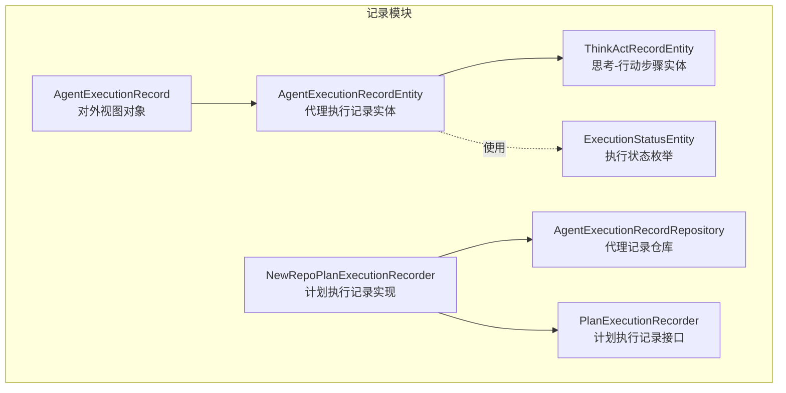
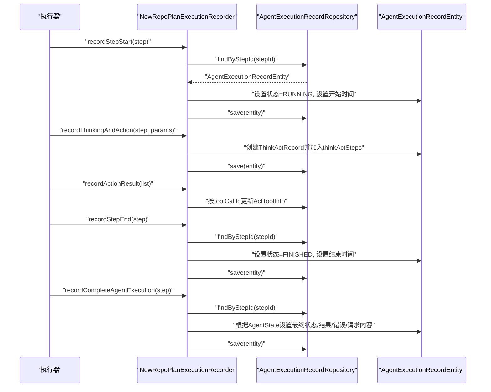
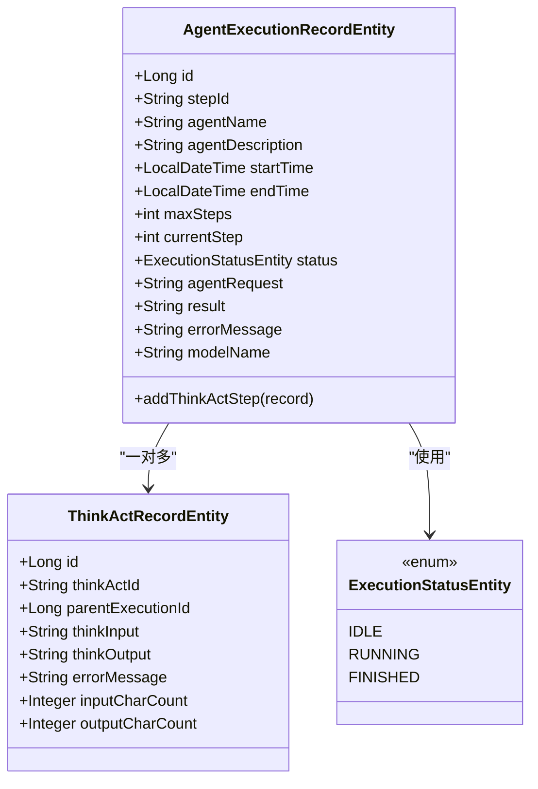
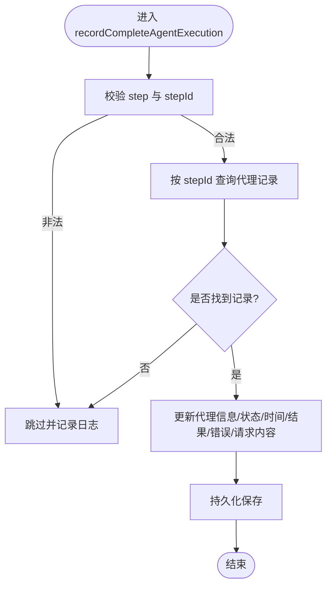
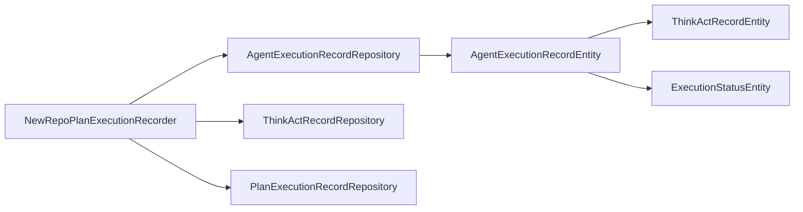

# 代理执行记录

<cite>
**本文引用的文件**
- [AgentExecutionRecordEntity.java](file://src/main/java/com/alibaba/cloud/ai/lynxe/recorder/entity/po/AgentExecutionRecordEntity.java)
- [ExecutionStatusEntity.java](file://src/main/java/com/alibaba/cloud/ai/lynxe/recorder/entity/po/ExecutionStatusEntity.java)
- [ThinkActRecordEntity.java](file://src/main/java/com/alibaba/cloud/ai/lynxe/recorder/entity/po/ThinkActRecordEntity.java)
- [AgentExecutionRecordRepository.java](file://src/main/java/com/alibaba/cloud/ai/lynxe/recorder/repository/AgentExecutionRecordRepository.java)
- [PlanExecutionRecorder.java](file://src/main/java/com/alibaba/cloud/ai/lynxe/recorder/service/PlanExecutionRecorder.java)
- [NewRepoPlanExecutionRecorder.java](file://src/main/java/com/alibaba/cloud/ai/lynxe/recorder/service/NewRepoPlanExecutionRecorder.java)
- [AgentExecutionRecord.java](file://src/main/java/com/alibaba/cloud/ai/lynxe/recorder/entity/vo/AgentExecutionRecord.java)
</cite>

## 目录
1. [简介](#简介)
2. [项目结构](#项目结构)
3. [核心组件](#核心组件)
4. [架构总览](#架构总览)
5. [组件详解](#组件详解)
6. [依赖关系分析](#依赖关系分析)
7. [性能考量](#性能考量)
8. [故障排查指南](#故障排查指南)
9. [结论](#结论)
10. [附录](#附录)

## 简介
本技术文档围绕 Lynxe 的“代理执行记录”模块展开，系统性阐述代理执行记录的设计理念、数据模型、状态流转与业务规则，重点解析 recordCompleteAgentExecution 方法的实现细节（包括代理执行的开始、中间态与结束标记），并说明代理执行记录与计划执行记录之间的父子层级关系维护方式。同时给出查询接口与按代理名称、时间范围过滤的实践建议，并讨论其在性能分析与执行效率评估中的作用。

## 项目结构
代理执行记录相关代码主要分布在以下包与文件中：
- 实体层：AgentExecutionRecordEntity、ThinkActRecordEntity、ExecutionStatusEntity
- 仓库层：AgentExecutionRecordRepository
- 服务层：PlanExecutionRecorder 接口与 NewRepoPlanExecutionRecorder 实现
- 视图对象：AgentExecutionRecord（用于对外返回的统一记录结构）

**图表来源**
- [AgentExecutionRecordEntity.java:61-275](file://src/main/java/com/alibaba/cloud/ai/lynxe/recorder/entity/po/AgentExecutionRecordEntity.java#L61-L275)
- [ThinkActRecordEntity.java:53-185](file://src/main/java/com/alibaba/cloud/ai/lynxe/recorder/entity/po/ThinkActRecordEntity.java#L53-L185)
- [ExecutionStatusEntity.java:21-25](file://src/main/java/com/alibaba/cloud/ai/lynxe/recorder/entity/po/ExecutionStatusEntity.java#L21-L25)
- [AgentExecutionRecordRepository.java:25-43](file://src/main/java/com/alibaba/cloud/ai/lynxe/recorder/repository/AgentExecutionRecordRepository.java#L25-L43)
- [PlanExecutionRecorder.java:26-242](file://src/main/java/com/alibaba/cloud/ai/lynxe/recorder/service/PlanExecutionRecorder.java#L26-L242)
- [NewRepoPlanExecutionRecorder.java:48-857](file://src/main/java/com/alibaba/cloud/ai/lynxe/recorder/service/NewRepoPlanExecutionRecorder.java#L48-L857)
- [AgentExecutionRecord.java:55-318](file://src/main/java/com/alibaba/cloud/ai/lynxe/recorder/entity/vo/AgentExecutionRecord.java#L55-L318)

**章节来源**
- [AgentExecutionRecordEntity.java:38-59](file://src/main/java/com/alibaba/cloud/ai/lynxe/recorder/entity/po/AgentExecutionRecordEntity.java#L38-L59)
- [PlanExecutionRecorder.java:22-81](file://src/main/java/com/alibaba/cloud/ai/lynxe/recorder/service/PlanExecutionRecorder.java#L22-L81)
- [NewRepoPlanExecutionRecorder.java:158-248](file://src/main/java/com/alibaba/cloud/ai/lynxe/recorder/service/NewRepoPlanExecutionRecorder.java#L158-L248)

## 核心组件
- 代理执行记录实体（AgentExecutionRecordEntity）
  - 负责持久化单个执行步骤的代理执行信息，包含基础信息、执行数据、执行结果三部分。
  - 关键字段：stepId、agentName、agentDescription、startTime、endTime、maxSteps、currentStep、status、thinkActSteps、agentRequest、result、errorMessage、modelName。
  - 通过 OneToMany 关联 ThinkActRecordEntity，形成“代理执行记录-思考-行动步骤”的层次结构。
- 思考-行动步骤实体（ThinkActRecordEntity）
  - 记录代理在单步执行中的思考阶段与行动阶段信息，支持多工具调用参数与结果。
  - 关键字段：thinkActId、parentExecutionId、thinkInput、thinkOutput、errorMessage、inputCharCount、outputCharCount、actToolInfoList。
- 执行状态枚举（ExecutionStatusEntity）
  - 定义代理执行状态：IDLE、RUNNING、FINISHED。
- 代理执行记录仓库（AgentExecutionRecordRepository）
  - 提供按 stepId 查询、存在性检查、删除等能力。
- 计划执行记录接口与实现（PlanExecutionRecorder / NewRepoPlanExecutionRecorder）
  - 对外暴露 recordCompleteAgentExecution 等方法，负责将执行状态、时间戳、结果、错误信息等写入代理执行记录。
  - 实现中包含状态转换逻辑（如根据 AgentState 转换为 ExecutionStatusEntity）。

**章节来源**
- [AgentExecutionRecordEntity.java:61-275](file://src/main/java/com/alibaba/cloud/ai/lynxe/recorder/entity/po/AgentExecutionRecordEntity.java#L61-L275)
- [ThinkActRecordEntity.java:53-185](file://src/main/java/com/alibaba/cloud/ai/lynxe/recorder/entity/po/ThinkActRecordEntity.java#L53-L185)
- [ExecutionStatusEntity.java:21-25](file://src/main/java/com/alibaba/cloud/ai/lynxe/recorder/entity/po/ExecutionStatusEntity.java#L21-L25)
- [AgentExecutionRecordRepository.java:25-43](file://src/main/java/com/alibaba/cloud/ai/lynxe/recorder/repository/AgentExecutionRecordRepository.java#L25-L43)
- [PlanExecutionRecorder.java:62-81](file://src/main/java/com/alibaba/cloud/ai/lynxe/recorder/service/PlanExecutionRecorder.java#L62-L81)
- [NewRepoPlanExecutionRecorder.java:250-275](file://src/main/java/com/alibaba/cloud/ai/lynxe/recorder/service/NewRepoPlanExecutionRecorder.java#L250-L275)

## 架构总览
代理执行记录模块与计划执行记录模块协同工作，形成“计划-代理-思考-行动”的完整执行链路。NewRepoPlanExecutionRecorder 在执行过程中通过 recordStepStart、recordThinkingAndAction、recordActionResult、recordStepEnd、recordCompleteAgentExecution 等方法，将执行状态与结果写入数据库；上层可基于 AgentExecutionRecordRepository 或服务层提供的查询方法获取代理执行详情。

**图表来源**
- [NewRepoPlanExecutionRecorder.java:293-386](file://src/main/java/com/alibaba/cloud/ai/lynxe/recorder/service/NewRepoPlanExecutionRecorder.java#L293-L386)
- [NewRepoPlanExecutionRecorder.java:388-450](file://src/main/java/com/alibaba/cloud/ai/lynxe/recorder/service/NewRepoPlanExecutionRecorder.java#L388-L450)
- [NewRepoPlanExecutionRecorder.java:452-520](file://src/main/java/com/alibaba/cloud/ai/lynxe/recorder/service/NewRepoPlanExecutionRecorder.java#L452-L520)
- [NewRepoPlanExecutionRecorder.java:522-604](file://src/main/java/com/alibaba/cloud/ai/lynxe/recorder/service/NewRepoPlanExecutionRecorder.java#L522-L604)
- [AgentExecutionRecordRepository.java:25-43](file://src/main/java/com/alibaba/cloud/ai/lynxe/recorder/repository/AgentExecutionRecordRepository.java#L25-L43)

## 组件详解

### 代理执行记录实体（AgentExecutionRecordEntity）
- 设计理念
  - 将一次代理执行的全过程以“步骤”为单位进行建模，每个步骤对应一个 AgentExecutionRecordEntity。
  - 通过 thinkActSteps 子步骤列表记录“思考-行动”的细粒度过程，便于回放与审计。
- 字段定义
  - 基础信息：stepId（唯一标识）、agentName、agentDescription、startTime、endTime
  - 执行数据：maxSteps、currentStep、status（ExecutionStatusEntity）
  - 执行结果：result、errorMessage、modelName
  - 关联子记录：thinkActSteps（List<ThinkActRecordEntity>）
- 业务规则
  - stepId 唯一索引，确保按步骤维度检索与去重。
  - currentStep 由 thinkActSteps.size() 自动维护。
  - status 受 AgentState 到 ExecutionStatusEntity 的映射约束。

**图表来源**
- [AgentExecutionRecordEntity.java:61-275](file://src/main/java/com/alibaba/cloud/ai/lynxe/recorder/entity/po/AgentExecutionRecordEntity.java#L61-L275)
- [ThinkActRecordEntity.java:53-185](file://src/main/java/com/alibaba/cloud/ai/lynxe/recorder/entity/po/ThinkActRecordEntity.java#L53-L185)
- [ExecutionStatusEntity.java:21-25](file://src/main/java/com/alibaba/cloud/ai/lynxe/recorder/entity/po/ExecutionStatusEntity.java#L21-L25)

**章节来源**
- [AgentExecutionRecordEntity.java:61-275](file://src/main/java/com/alibaba/cloud/ai/lynxe/recorder/entity/po/AgentExecutionRecordEntity.java#L61-L275)
- [ExecutionStatusEntity.java:21-25](file://src/main/java/com/alibaba/cloud/ai/lynxe/recorder/entity/po/ExecutionStatusEntity.java#L21-L25)

### 思考-行动步骤实体（ThinkActRecordEntity）
- 设计理念
  - 将代理在单步内的“思考”和“行动”拆分为两个阶段，分别记录输入输出与错误信息。
  - 支持多工具调用参数 actToolInfoList，便于追踪工具调用链。
- 字段定义
  - 基础信息：thinkActId、parentExecutionId
  - 思考阶段：thinkInput、thinkOutput、errorMessage、inputCharCount、outputCharCount
  - 行动阶段：actToolInfoList（工具名、参数、结果等）
- 业务规则
  - parentExecutionId 指向父级代理执行记录，建立层级关系。
  - actToolInfoList 与外部工具调用 ID 关联，支持后续结果回填。

**章节来源**
- [ThinkActRecordEntity.java:53-185](file://src/main/java/com/alibaba/cloud/ai/lynxe/recorder/entity/po/ThinkActRecordEntity.java#L53-L185)

### 执行状态枚举（ExecutionStatusEntity）
- 定义
  - IDLE：未开始
  - RUNNING：执行中
  - FINISHED：已完成（含成功、失败、阻塞等归并）
- 映射规则
  - AgentState.NOT_STARTED → IDLE
  - AgentState.IN_PROGRESS → RUNNING
  - AgentState.COMPLETED / AgentState.INTERRUPTED → FINISHED
  - AgentState.BLOCKED / AgentState.FAILED → FINISHED

**章节来源**
- [ExecutionStatusEntity.java:21-25](file://src/main/java/com/alibaba/cloud/ai/lynxe/recorder/entity/po/ExecutionStatusEntity.java#L21-L25)
- [NewRepoPlanExecutionRecorder.java:255-275](file://src/main/java/com/alibaba/cloud/ai/lynxe/recorder/service/NewRepoPlanExecutionRecorder.java#L255-L275)

### recordCompleteAgentExecution 方法实现细节
- 入口与职责
  - 由上层在代理执行结束时调用，负责将最终状态、时间戳、结果、错误信息、请求内容等写入代理执行记录。
- 关键流程
  - 依据 stepId 查询现有记录；若不存在则跳过。
  - 根据 step.getAgent().getName/description 更新代理信息。
  - 将 step.getStatus 映射为 ExecutionStatusEntity 并设置到记录。
  - 若 endTime 为空则设置为当前时间。
  - 若 step.getResult 非空则写入 result；若 step.getErrorMessage 非空则写入 errorMessage。
  - 若 step.getStepRequirement 非空则写入 agentRequest（作为代理请求内容）。
  - 最后持久化保存。
- 中间态与结束标记
  - 中间态由 recordStepStart/recordStepEnd、recordThinkingAndAction/recordActionResult 等方法维护。
  - 结束标记由 recordCompleteAgentExecution 设置最终状态与结束时间。

**图表来源**
- [NewRepoPlanExecutionRecorder.java:522-604](file://src/main/java/com/alibaba/cloud/ai/lynxe/recorder/service/NewRepoPlanExecutionRecorder.java#L522-L604)
- [NewRepoPlanExecutionRecorder.java:255-275](file://src/main/java/com/alibaba/cloud/ai/lynxe/recorder/service/NewRepoPlanExecutionRecorder.java#L255-L275)

**章节来源**
- [PlanExecutionRecorder.java:62-81](file://src/main/java/com/alibaba/cloud/ai/lynxe/recorder/service/PlanExecutionRecorder.java#L62-L81)
- [NewRepoPlanExecutionRecorder.java:522-604](file://src/main/java/com/alibaba/cloud/ai/lynxe/recorder/service/NewRepoPlanExecutionRecorder.java#L522-L604)

### 状态跟踪机制（成功/失败/阻塞/卡住）
- 状态映射
  - 成功：COMPLETED → FINISHED
  - 失败：FAILED → FINISHED
  - 阻塞：BLOCKED → FINISHED
  - 中断：INTERRUPTED → FINISHED
  - 进行中：IN_PROGRESS → RUNNING
  - 未开始：NOT_STARTED → IDLE
- 错误与结果
  - 失败或阻塞时，errorMessage 通常非空；成功时 result 非空。
  - recordCompleteAgentExecution 会优先写入 errorMessage 与 result，确保最终态可追溯。

**章节来源**
- [NewRepoPlanExecutionRecorder.java:255-275](file://src/main/java/com/alibaba/cloud/ai/lynxe/recorder/service/NewRepoPlanExecutionRecorder.java#L255-L275)
- [NewRepoPlanExecutionRecorder.java:546-594](file://src/main/java/com/alibaba/cloud/ai/lynxe/recorder/service/NewRepoPlanExecutionRecorder.java#L546-L594)

### 查询接口与过滤能力
- 当前仓库能力
  - AgentExecutionRecordRepository 提供按 stepId 查询、存在性检查、按 stepId 删除。
- 建议扩展（按需实现）
  - 按代理名称过滤：可在服务层增加按 agentName 查询的方法。
  - 按时间范围过滤：可在服务层增加按 startTime/endTime 范围查询的方法。
  - 分页与排序：结合 Spring Data JPA 的分页与排序能力实现。
- 获取详细记录
  - NewRepoPlanExecutionRecorder 提供 getAgentExecutionDetail(stepId)，返回包含 thinkActSteps 的完整记录。

**章节来源**
- [AgentExecutionRecordRepository.java:25-43](file://src/main/java/com/alibaba/cloud/ai/lynxe/recorder/repository/AgentExecutionRecordRepository.java#L25-L43)
- [NewRepoPlanExecutionRecorder.java:647-744](file://src/main/java/com/alibaba/cloud/ai/lynxe/recorder/service/NewRepoPlanExecutionRecorder.java#L647-L744)
- [AgentExecutionRecord.java:55-318](file://src/main/java/com/alibaba/cloud/ai/lynxe/recorder/entity/vo/AgentExecutionRecord.java#L55-L318)

### 与计划执行记录的关联与父子关系
- 层级关系
  - ThinkActRecordEntity.parentExecutionId 指向 AgentExecutionRecordEntity.id，形成“代理执行记录-思考-行动步骤”的父子关系。
  - 计划层级关系由 PlanExecutionRecordEntity 维护（父计划、根计划、触发工具调用 ID），与代理执行记录通过 stepId 关联。
- 关系维护
  - recordThinkingAndAction 中将新建的 ThinkActRecordEntity 关联到父级代理记录的 thinkActSteps。
  - 计划层级关系在 recordPlanExecutionStart 中创建，要求 rootPlanId 必填，并对 parentPlanId/toolcallId 进行验证。

**章节来源**
- [ThinkActRecordEntity.java:66-68](file://src/main/java/com/alibaba/cloud/ai/lynxe/recorder/entity/po/ThinkActRecordEntity.java#L66-L68)
- [NewRepoPlanExecutionRecorder.java:412-436](file://src/main/java/com/alibaba/cloud/ai/lynxe/recorder/service/NewRepoPlanExecutionRecorder.java#L412-L436)
- [NewRepoPlanExecutionRecorder.java:782-854](file://src/main/java/com/alibaba/cloud/ai/lynxe/recorder/service/NewRepoPlanExecutionRecorder.java#L782-L854)

### 性能分析与执行效率评估
- 可观测性指标
  - 执行耗时：endTime - startTime
  - 步骤数量：currentStep 或 thinkActSteps.size()
  - 工具调用次数与字符统计：inputCharCount、outputCharCount
  - 成功率与失败率：按 FINISHED/ERROR 分组统计
- 评估建议
  - 按代理名称与时间范围聚合，计算平均耗时、P95/P99 耗时、失败率。
  - 分析 thinkActSteps 的分布，定位长尾环节。
  - 结合 ActToolInfo 的调用结果，评估工具链效率。

[本节为通用性能分析建议，不直接分析具体文件，故无“章节来源”]

## 依赖关系分析
- 组件耦合
  - NewRepoPlanExecutionRecorder 依赖多个仓库与实体，承担协调与持久化职责。
  - AgentExecutionRecordEntity 与 ThinkActRecordEntity 强关联，One-to-Many 维护父子关系。
- 外部依赖
  - Spring Data JPA 提供仓库能力与索引支持（stepId 唯一索引）。
  - 日志框架用于关键路径的调试与异常记录。

**图表来源**
- [NewRepoPlanExecutionRecorder.java:48-62](file://src/main/java/com/alibaba/cloud/ai/lynxe/recorder/service/NewRepoPlanExecutionRecorder.java#L48-L62)
- [AgentExecutionRecordRepository.java:25-43](file://src/main/java/com/alibaba/cloud/ai/lynxe/recorder/repository/AgentExecutionRecordRepository.java#L25-L43)
- [AgentExecutionRecordEntity.java:104-106](file://src/main/java/com/alibaba/cloud/ai/lynxe/recorder/entity/po/AgentExecutionRecordEntity.java#L104-L106)
- [ThinkActRecordEntity.java:92-94](file://src/main/java/com/alibaba/cloud/ai/lynxe/recorder/entity/po/ThinkActRecordEntity.java#L92-L94)

**章节来源**
- [NewRepoPlanExecutionRecorder.java:48-62](file://src/main/java/com/alibaba/cloud/ai/lynxe/recorder/service/NewRepoPlanExecutionRecorder.java#L48-L62)
- [AgentExecutionRecordEntity.java:104-106](file://src/main/java/com/alibaba/cloud/ai/lynxe/recorder/entity/po/AgentExecutionRecordEntity.java#L104-L106)

## 性能考量
- 数据库层面
  - stepId 唯一索引保证按步骤快速检索。
  - OneToMany 懒加载 fetch=LAZY，避免不必要的关联加载。
- 事务与一致性
  - recordCompleteAgentExecution 使用 @Transactional，确保状态变更原子性。
- 日志与可观测性
  - 关键路径均记录日志，便于定位性能瓶颈与异常。

[本节为通用性能建议，不直接分析具体文件，故无“章节来源”]

## 故障排查指南
- 常见问题
  - 代理记录缺失：确认 recordStepStart 是否在 recordCompleteAgentExecution 之前执行。
  - 状态异常：检查 AgentState 到 ExecutionStatusEntity 的映射是否符合预期。
  - 结果为空：确认 step.getResult 与 step.getErrorMessage 的赋值时机。
- 排查步骤
  - 通过 getAgentExecutionDetail(stepId) 获取完整记录，核对 thinkActSteps 数量与状态。
  - 检查 ActToolInfo 的 toolCallId 是否正确匹配，避免结果回填失败。
  - 查看服务层日志，定位 recordCompleteAgentExecution 的执行路径。

**章节来源**
- [NewRepoPlanExecutionRecorder.java:647-744](file://src/main/java/com/alibaba/cloud/ai/lynxe/recorder/service/NewRepoPlanExecutionRecorder.java#L647-L744)
- [NewRepoPlanExecutionRecorder.java:522-604](file://src/main/java/com/alibaba/cloud/ai/lynxe/recorder/service/NewRepoPlanExecutionRecorder.java#L522-L604)

## 结论
代理执行记录模块以“步骤”为核心单位，结合“思考-行动”细粒度记录，实现了对代理执行过程的全链路追踪。通过明确的状态映射与完善的生命周期方法（开始、中间态、结束），配合与计划执行记录的层级关系，为性能分析与效率评估提供了坚实的数据基础。建议在现有基础上扩展按代理名称与时间范围的查询能力，并持续完善工具调用结果的回填与校验，以进一步提升可观测性与可维护性。

## 附录
- 相关类型与用途
  - AgentExecutionRecord（对外视图对象）：用于 API 返回与前端展示，封装了完整的执行详情。
  - ExecutionStatus / ExecutionStatusEntity：统一状态语义，便于跨层传递。

**章节来源**
- [AgentExecutionRecord.java:55-318](file://src/main/java/com/alibaba/cloud/ai/lynxe/recorder/entity/vo/AgentExecutionRecord.java#L55-L318)
- [ExecutionStatusEntity.java:21-25](file://src/main/java/com/alibaba/cloud/ai/lynxe/recorder/entity/po/ExecutionStatusEntity.java#L21-L25)